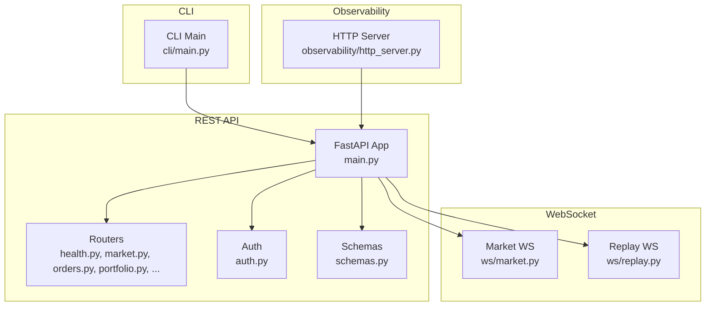
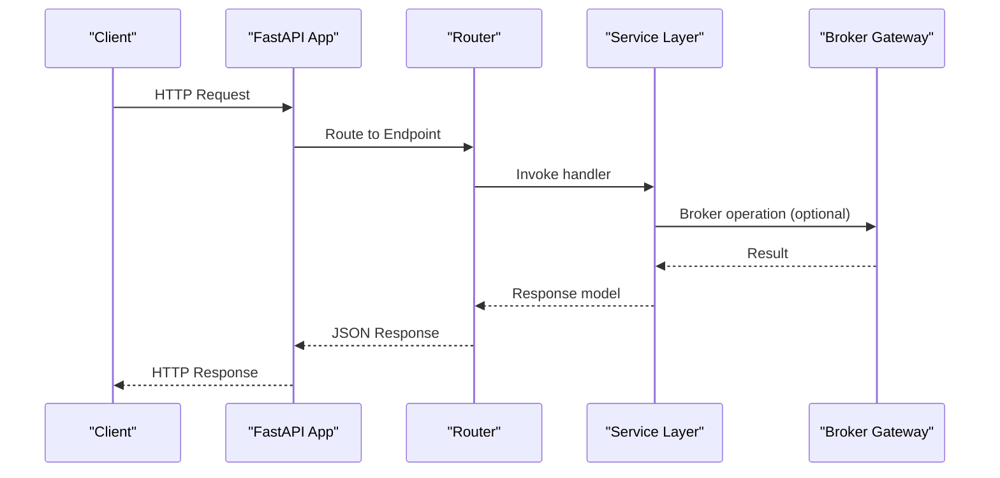
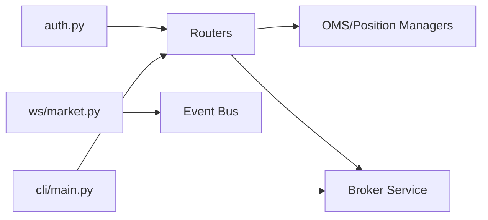

# API Reference

<cite>
**Referenced Files in This Document**
- [main.py](file://datalake/api/main.py)
- [health.py](file://datalake/api/routers/health.py)
- [market.py](file://datalake/api/routers/market.py)
- [orders.py](file://datalake/api/routers/orders.py)
- [portfolio.py](file://datalake/api/routers/portfolio.py)
- [schemas.py](file://datalake/api/schemas.py)
- [auth.py](file://datalake/api/auth.py)
- [market.py](file://datalake/api/ws/market.py)
- [replay.py](file://datalake/api/ws/replay.py)
- [main.py](file://cli/main.py)
- [http_server.py](file://brokers/common/observability/http_server.py)
- [test_http_observability_server.py](file://tests/chaos/test_network_partitions.py)
</cite>

## Table of Contents
1. [Introduction](#introduction)
2. [Project Structure](#project-structure)
3. [Core Components](#core-components)
4. [Architecture Overview](#architecture-overview)
5. [Detailed Component Analysis](#detailed-component-analysis)
6. [Dependency Analysis](#dependency-analysis)
7. [Performance Considerations](#performance-considerations)
8. [Troubleshooting Guide](#troubleshooting-guide)
9. [Conclusion](#conclusion)
10. [Appendices](#appendices)

## Introduction
This document provides a comprehensive API reference for the TradeXV2 platform’s REST and WebSocket interfaces, plus the CLI command interface and HTTP observability endpoints. It covers:
- REST endpoints for market data, analytics, scanner, strategy, options, replay, backtest, portfolio, orders, and risk.
- WebSocket endpoints for market data and replay sessions.
- CLI commands for broker diagnostics, market data retrieval, order placement, and diagnostics.
- HTTP observability endpoints for health, readiness, and metrics.
- Authentication, caching, error handling, security, rate limiting considerations, and versioning.
- Practical examples, client implementation guidelines, and performance optimization tips.

## Project Structure
The API surface is organized around a FastAPI application that mounts multiple routers grouped by domain (market data, orders, portfolio, etc.) and exposes WebSocket endpoints for streaming data. Authentication is enforced via a configurable API key mechanism. Observability endpoints expose health, readiness, and metrics.

**Diagram sources**
- [main.py:146-291](file://datalake/api/main.py#L146-L291)
- [health.py:1-97](file://datalake/api/routers/health.py#L1-L97)
- [market.py:1-271](file://datalake/api/routers/market.py#L1-L271)
- [orders.py:1-463](file://datalake/api/routers/orders.py#L1-L463)
- [portfolio.py:1-370](file://datalake/api/routers/portfolio.py#L1-L370)
- [schemas.py:1-593](file://datalake/api/schemas.py#L1-L593)
- [auth.py:1-117](file://datalake/api/auth.py#L1-L117)
- [market.py:1-152](file://datalake/api/ws/market.py#L1-L152)
- [replay.py:1-200](file://datalake/api/ws/replay.py#L1-L200)
- [main.py:1-610](file://cli/main.py#L1-L610)
- [http_server.py:156-197](file://brokers/common/observability/http_server.py#L156-L197)

**Section sources**
- [main.py:146-291](file://datalake/api/main.py#L146-L291)
- [auth.py:1-117](file://datalake/api/auth.py#L1-L117)

## Core Components
- REST API: Mounted routers for health, symbols, market data, analytics, scanner, strategy, options, replay, backtest, portfolio, orders, and risk. All endpoints are versioned under a configurable prefix.
- Authentication: API key header-based protection controlled by environment variables.
- WebSocket: Real-time market data and replay session endpoints with subscription management and ping/pong.
- CLI: Comprehensive command suite for broker diagnostics, market data, order placement, and system checks.
- Observability: Health, readiness, and metrics endpoints served by an embedded HTTP server.

**Section sources**
- [main.py:231-287](file://datalake/api/main.py#L231-L287)
- [auth.py:38-105](file://datalake/api/auth.py#L38-L105)
- [market.py:56-127](file://datalake/api/ws/market.py#L56-L127)
- [main.py:120-178](file://cli/main.py#L120-L178)
- [http_server.py:182-197](file://brokers/common/observability/http_server.py#L182-L197)

## Architecture Overview
The REST API is a FastAPI application with dependency injection, CORS, and modular routers. WebSocket endpoints are mounted separately and rely on an event bus for real-time data. The CLI integrates with the same service container and broker services.

**Diagram sources**
- [main.py:146-291](file://datalake/api/main.py#L146-L291)
- [orders.py:239-327](file://datalake/api/routers/orders.py#L239-L327)
- [portfolio.py:30-65](file://datalake/api/routers/portfolio.py#L30-L65)

## Detailed Component Analysis

### REST API: Health, Readiness, Metrics
- Endpoint: GET /api/v1/health
  - Purpose: Liveness probe returning service status and version.
  - Response: HealthResponse with status, version, and timestamp.
- Endpoint: GET /api/v1/health/readyz
  - Purpose: Readiness probe verifying service container initialization and required services.
  - Response: ReadinessResponse with readiness boolean and service checks.
  - Failure: 503 with details if services are missing.
- Endpoint: GET /api/v1/health/metrics
  - Purpose: OMS observability metrics snapshot.
  - Response: Dictionary containing event metrics, dead-letter queue stats, and processed trade repository stats.
  - Failure: 503 if metrics collection fails.

Security and Access:
- Public endpoints: /api/v1/health, /api/v1/health/readyz, /api/v1/health/metrics.
- Authentication: Controlled by AUTH_MODE and X-API-Key header.

**Section sources**
- [health.py:18-96](file://datalake/api/routers/health.py#L18-L96)
- [http_server.py:182-197](file://brokers/common/observability/http_server.py#L182-L197)
- [auth.py:59-71](file://datalake/api/auth.py#L59-L71)

### REST API: Market Data
Endpoints:
- GET /api/v1/market/candles
  - Query: symbol, timeframe, from_ts, to_ts, limit.
  - Response: CandlesResponse with symbol, timeframe, exchange, candles array, and count.
  - Caching: Cache-Control varies by timeframe; freshness headers included.
  - Errors: 404 if no data; 500 on internal failures.
- GET /api/v1/market/quote/{symbol}
  - Query: exchange (default NSE).
  - Response: QuoteResponse with symbol, exchange, ltp, timestamp, and OHLCV fields.
  - Caching: Short TTL for quotes; freshness headers included.
  - Errors: 404 if no data; 500 on internal failures.

Caching Strategy:
- Timeframe-aware TTLs and stale-while-revalidate headers applied based on endpoint and timeframe.

**Section sources**
- [market.py:65-180](file://datalake/api/routers/market.py#L65-L180)
- [market.py:192-271](file://datalake/api/routers/market.py#L192-L271)
- [schemas.py:122-147](file://datalake/api/schemas.py#L122-L147)

### REST API: Orders
Endpoints:
- GET /api/v1/orders
  - Query: status (pending, complete, cancelled, all), from_date, to_date, limit.
  - Response: OrdersResponse with list of OrderResponse entries.
- GET /api/v1/orders/trades
  - Query: from_date, to_date, limit.
  - Response: TradesResponse with filled trades and counts.
- GET /api/v1/orders/tradebook
  - Query: from_date, to_date.
  - Response: Dictionary with trades and summary metrics.
- GET /api/v1/orders/{order_id}
  - Response: OrderResponse for a specific order.
- POST /api/v1/orders
  - Body: OrderRequest validated against enums and cross-field constraints.
  - Behavior: Requires broker connectivity; returns 503 with Retry-After if unavailable.
- PUT /api/v1/orders/{order_id}
  - Body: OrderRequest; modifies by cancel-and-replace via broker.
  - Behavior: Requires broker connectivity; returns 503 if unavailable.
- DELETE /api/v1/orders/{order_id}
  - Behavior: Cancels order via broker; returns 503 if unavailable.

Validation and Constraints:
- OrderRequest enforces exchange, order type, product type, and cross-field constraints (prices, trigger prices, buy/sell relationships).

**Section sources**
- [orders.py:28-76](file://datalake/api/routers/orders.py#L28-L76)
- [orders.py:79-132](file://datalake/api/routers/orders.py#L79-L132)
- [orders.py:135-209](file://datalake/api/routers/orders.py#L135-L209)
- [orders.py:212-236](file://datalake/api/routers/orders.py#L212-L236)
- [orders.py:239-327](file://datalake/api/routers/orders.py#L239-L327)
- [orders.py:330-422](file://datalake/api/routers/orders.py#L330-L422)
- [orders.py:425-462](file://datalake/api/routers/orders.py#L425-L462)
- [schemas.py:400-471](file://datalake/api/schemas.py#L400-L471)

### REST API: Portfolio
Endpoints:
- GET /api/v1/portfolio/positions
  - Query: status (open, closed, all).
  - Response: PositionsResponse with positions, counts, and aggregated PnL.
- GET /api/v1/portfolio/holdings
  - Response: HoldingsResponse with long-term holdings, values, and PnL.
- GET /api/v1/portfolio/summary
  - Response: PortfolioSummary with totals, realized/unrealized PnL, margins, and counts.
- GET /api/v1/portfolio/pnl
  - Query: from_date, to_date, group_by (day, week, month).
  - Response: Dictionary with pnl_curve, grouping, totals.
- POST /api/v1/portfolio/square-off
  - Query: symbol (optional).
  - Behavior: Places market orders to close positions; returns status and details.

**Section sources**
- [portfolio.py:30-65](file://datalake/api/routers/portfolio.py#L30-L65)
- [portfolio.py:68-126](file://datalake/api/routers/portfolio.py#L68-L126)
- [portfolio.py:129-204](file://datalake/api/routers/portfolio.py#L129-L204)
- [portfolio.py:207-279](file://datalake/api/routers/portfolio.py#L207-L279)
- [portfolio.py:282-369](file://datalake/api/routers/portfolio.py#L282-L369)

### REST API: Authentication and Security
- Modes:
  - none: No authentication.
  - api_key: Requires X-API-Key header on protected endpoints.
- Protected endpoints include trading and data endpoints; public endpoints include health, docs, and WebSocket paths.
- Headers:
  - X-API-Key for API key mode.
  - WWW-Authenticate: ApiKey on unauthorized responses.

**Section sources**
- [auth.py:38-105](file://datalake/api/auth.py#L38-L105)
- [auth.py:59-71](file://datalake/api/auth.py#L59-L71)

### WebSocket: Market Data
Endpoints:
- /ws/market
  - Protocol: JSON messages.
  - Client -> Server:
    - {"action": "subscribe", "symbols": [...]}
    - {"action": "unsubscribe", "symbols": [...]}
    - {"action": "ping", "timestamp": ...}
  - Server -> Client:
    - {"type": "subscribed", "symbols": [...]}
    - {"type": "unsubscribed", "symbols": [...]}
    - {"type": "pong", "timestamp": ...}
    - {"type": "quote", ...}, {"type": "candle", ...}
  - Availability: Requires event bus; otherwise returns error and closes with 1013.
- /ws/market/{symbol}
  - Simplified endpoint that auto-subscribes to the given symbol.

**Section sources**
- [market.py:56-127](file://datalake/api/ws/market.py#L56-L127)
- [market.py:129-152](file://datalake/api/ws/market.py#L129-L152)

### WebSocket: Replay
- Endpoint: /ws/replay
- Protocol: Similar ping/pong and control actions; handles WebSocketDisconnect and logs errors.

**Section sources**
- [replay.py:131-142](file://datalake/api/ws/replay.py#L131-L142)

### CLI: Command Interface
Overview:
- Entry point: tradex <command> [args].
- Flags:
  - --broker NAME: Select broker (default dhan).
  - --json: Emit structured JSON output.
  - --verbose: Enable debug logging.
  - --timing: Show execution time.
- Example commands:
  - broker, dashboard, validate, benchmark, account/funds, holdings, positions, orders/trades/oms, quote, depth, option-chain, futures, historical/history, stream, websocket, events, search, instrument/instruments, doctor, load-test, news, journal, views, options-sync, place-order, cancel-order, modify-order, place-orders, bracket-order, oco-order, basket-order, risk, cache.

Output Formats:
- Human-readable tables by default; JSON via --json flag.

**Section sources**
- [main.py:120-178](file://cli/main.py#L120-L178)
- [main.py:436-586](file://cli/main.py#L436-L586)

## Dependency Analysis
- REST endpoints depend on:
  - Authentication dependency for protected routes.
  - Service dependencies injected via FastAPI Depends (e.g., order manager, position manager, broker service).
- WebSocket endpoints depend on:
  - Active event bus for market data streaming.
- CLI depends on:
  - BrokerService and EventBusService for gateway access and diagnostics.

**Diagram sources**
- [auth.py:76-105](file://datalake/api/auth.py#L76-L105)
- [orders.py:12-22](file://datalake/api/routers/orders.py#L12-L22)
- [portfolio.py:12-23](file://datalake/api/routers/portfolio.py#L12-L23)
- [market.py:72-80](file://datalake/api/ws/market.py#L72-L80)
- [main.py:534-543](file://cli/main.py#L534-L543)

**Section sources**
- [orders.py:12-22](file://datalake/api/routers/orders.py#L12-L22)
- [portfolio.py:12-23](file://datalake/api/routers/portfolio.py#L12-L23)
- [market.py:72-80](file://datalake/api/ws/market.py#L72-L80)
- [main.py:534-543](file://cli/main.py#L534-L543)

## Performance Considerations
- Caching:
  - Historical candles: timeframe-aware TTLs and stale-while-revalidate headers.
  - Quotes: short TTL with freshness headers.
- Vectorized data processing:
  - Candle conversion uses vectorized DataFrame operations to minimize overhead.
- Graceful degradation:
  - Orders endpoint returns 503 with Retry-After when broker is unavailable.
- Recommendations:
  - Respect Cache-Control headers.
  - Batch requests where possible.
  - Use WebSocket for real-time streams to reduce polling.

**Section sources**
- [market.py:22-62](file://datalake/api/routers/market.py#L22-L62)
- [market.py:129-150](file://datalake/api/routers/market.py#L129-L150)
- [orders.py:254-272](file://datalake/api/routers/orders.py#L254-L272)

## Troubleshooting Guide
- Health and Readiness:
  - Use /api/v1/health for liveness and /api/v1/health/readyz for readiness.
  - On readiness failure, inspect service container initialization and required services.
- Metrics:
  - Use /api/v1/health/metrics to retrieve OMS metrics snapshots.
- WebSocket:
  - Market WS requires event bus; absence results in immediate error and closure.
  - Use ping/pong to keep connections alive.
- CLI:
  - Use --verbose for debug logs and --timing to measure execution time.
  - Use --json for machine-readable output.

**Section sources**
- [health.py:18-96](file://datalake/api/routers/health.py#L18-L96)
- [http_server.py:182-197](file://brokers/common/observability/http_server.py#L182-L197)
- [market.py:72-80](file://datalake/api/ws/market.py#L72-L80)
- [main.py:574-586](file://cli/main.py#L574-L586)

## Conclusion
TradeXV2 offers a robust REST API with strong typing, caching, and observability, complemented by WebSocket streaming and a powerful CLI. Authentication is configurable, and endpoints are designed for reliability and performance. Use the health and metrics endpoints for monitoring, and follow the provided guidelines for secure, efficient integration.

## Appendices

### HTTP Methods and URL Patterns
- Health: GET /api/v1/health
- Readiness: GET /api/v1/health/readyz
- Metrics: GET /api/v1/health/metrics
- Market: GET /api/v1/market/candles, GET /api/v1/market/quote/{symbol}
- Orders: GET /api/v1/orders, GET /api/v1/orders/trades, GET /api/v1/orders/tradebook, GET /api/v1/orders/{order_id}, POST /api/v1/orders, PUT /api/v1/orders/{order_id}, DELETE /api/v1/orders/{order_id}
- Portfolio: GET /api/v1/portfolio/positions, GET /api/v1/portfolio/holdings, GET /api/v1/portfolio/summary, GET /api/v1/portfolio/pnl, POST /api/v1/portfolio/square-off

**Section sources**
- [health.py:18-96](file://datalake/api/routers/health.py#L18-L96)
- [market.py:65-271](file://datalake/api/routers/market.py#L65-L271)
- [orders.py:28-462](file://datalake/api/routers/orders.py#L28-L462)
- [portfolio.py:30-369](file://datalake/api/routers/portfolio.py#L30-L369)

### Request/Response Schemas
- Market: Candle, CandlesResponse, QuoteResponse.
- Orders: OrderRequest, OrderResponse, OrdersResponse, Trade, TradesResponse.
- Portfolio: PositionsResponse, HoldingsResponse, PortfolioSummary.
- Health: HealthResponse, ReadinessResponse.

**Section sources**
- [schemas.py:111-147](file://datalake/api/schemas.py#L111-L147)
- [schemas.py:400-471](file://datalake/api/schemas.py#L400-L471)
- [schemas.py:506-548](file://datalake/api/schemas.py#L506-L548)
- [schemas.py:580-593](file://datalake/api/schemas.py#L580-L593)

### WebSocket Message Formats
- Market WS:
  - Subscribe: {"action": "subscribe", "symbols": ["SYMBOL", ...]}
  - Unsubscribe: {"action": "unsubscribe", "symbols": ["SYMBOL", ...]}
  - Ping: {"action": "ping", "timestamp": 1234567890}
  - Server responses: {"type": "subscribed"/"unsubscribed"/"pong"}, {"type": "quote"/"candle", ...}
- Replay WS:
  - Similar ping/pong and control actions; handles disconnects.

**Section sources**
- [market.py:60-121](file://datalake/api/ws/market.py#L60-L121)
- [replay.py:131-142](file://datalake/api/ws/replay.py#L131-L142)

### CLI Command Syntax and Output
- Syntax: tradex <command> [args] [--broker dhan|upstox] [--json] [--verbose] [--timing]
- Examples:
  - tradex quote RELIANCE --verbose --timing
  - tradex place-order RELIANCE BUY 10 --type MARKET
  - tradex doctor --parallel --timing

**Section sources**
- [main.py:120-178](file://cli/main.py#L120-L178)
- [main.py:436-586](file://cli/main.py#L436-L586)

### HTTP Observability Endpoints
- GET /healthz: Liveness response with uptime and request counters.
- GET /readyz: Readiness response with service checks.
- GET /metrics: Prometheus-style metrics snapshot.

**Section sources**
- [http_server.py:182-197](file://brokers/common/observability/http_server.py#L182-L197)
- [test_http_observability_server.py:207-221](file://tests/chaos/test_network_partitions.py#L207-L221)

### Security, Rate Limiting, and Versioning
- Security:
  - API key header (X-API-Key) when AUTH_MODE=api_key.
  - Public endpoints excluded from authentication.
- Rate Limiting:
  - Not enforced at the API level; a token bucket rate limiter exists in resilience utilities.
- Versioning:
  - API version 1.0.0; endpoints are prefixed under /api/v1.

**Section sources**
- [auth.py:38-105](file://datalake/api/auth.py#L38-L105)
- [http_server.py:182-197](file://brokers/common/observability/http_server.py#L182-L197)
- [test_network_partitions.py:240-260](file://tests/chaos/test_network_partitions.py#L240-L260)

### Migration and Compatibility Notes
- Deprecated features: Not documented in the referenced files; consult release notes or deprecation notices.
- Backward compatibility: Order and portfolio schemas maintain aliases and consistent field names.

**Section sources**
- [schemas.py:574-576](file://datalake/api/schemas.py#L574-L576)