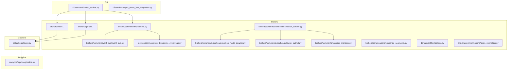
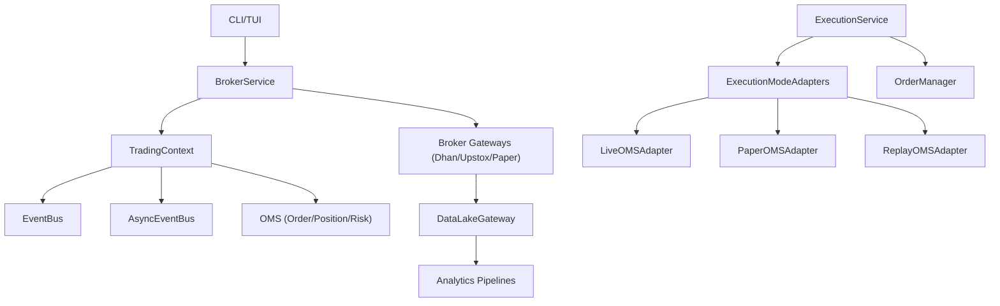
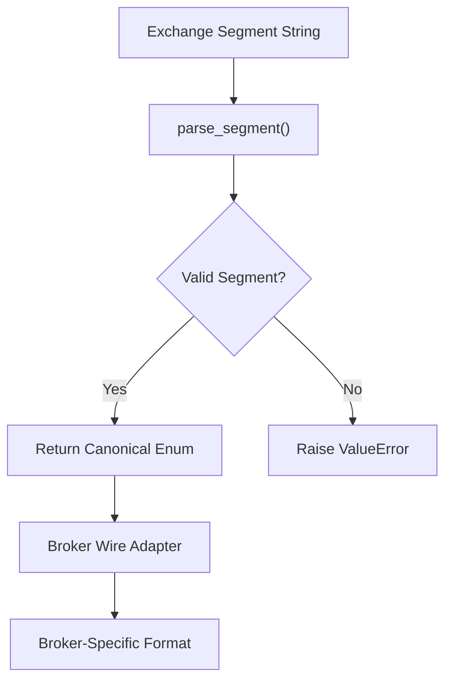
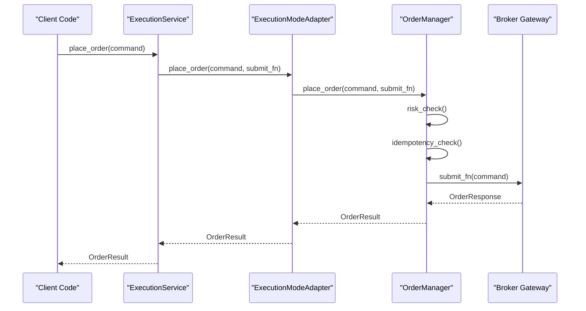
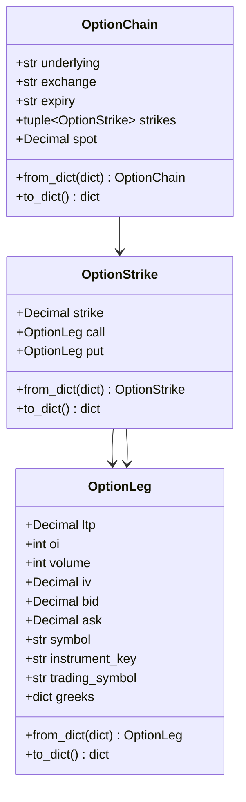
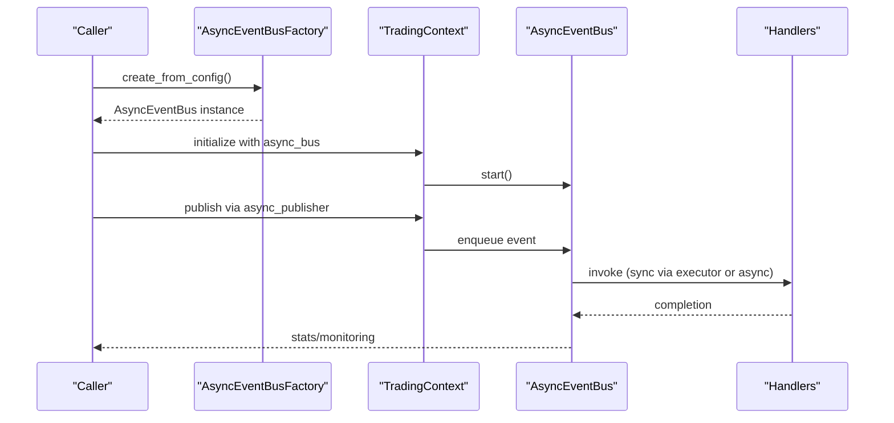
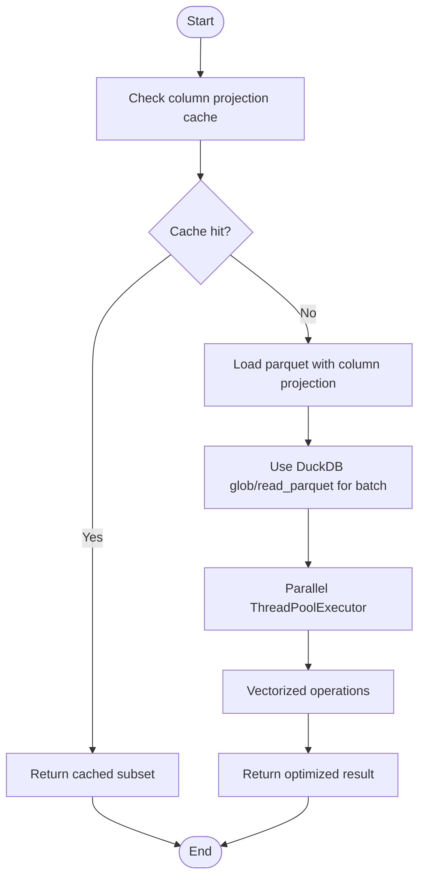
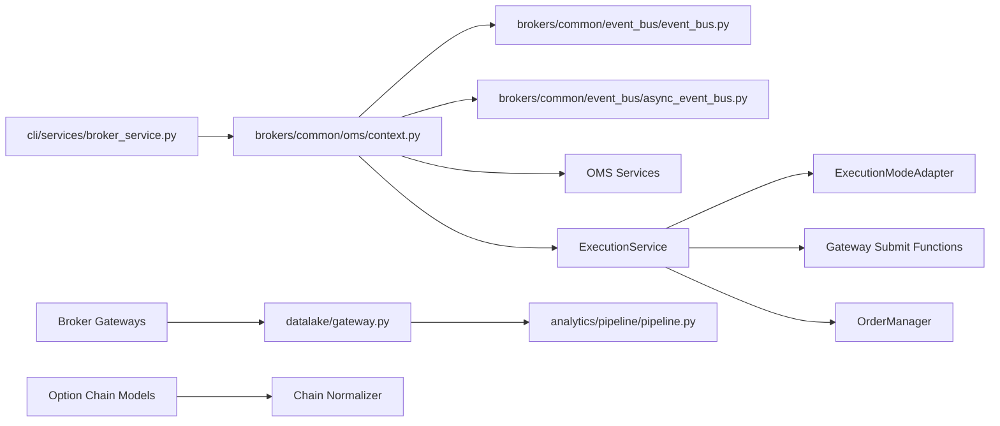

# Advanced Topics

<cite>
**Referenced Files in This Document**
- [template.md](file://docs/adr/template.md)
- [REFACTORING_PLAYBOOK.md](file://docs/REFACTORING_PLAYBOOK.md)
- [CONCURRENCY_ROADMAP.md](file://CONCURRENCY_ROADMAP.md)
- [ASYNC_EVENT_BUS_IMPLEMENTATION_SUMMARY.md](file://docs/ASYNC_EVENT_BUS_IMPLEMENTATION_SUMMARY.md)
- [ASYNC_EVENT_BUS_MIGRATION.md](file://docs/ASYNC_EVENT_BUS_MIGRATION.md)
- [PRODUCTION_CERTIFICATION_PLAN.md](file://docs/PRODUCTION_CERTIFICATION_PLAN.md)
- [ACTIONABLE_DEVELOPMENT_PLAN.md](file://ACTIONABLE_DEVELOPMENT_PLAN.md)
- [ENGINEERING_REPORT.md](file://ENGINEERING_REPORT.md)
- [FINAL_SYNTHESIS_REPORT.md](file://FINAL_SYNTHESIS_REPORT.md)
- [CONTRIBUTING.md](file://CONTRIBUTING.md)
- [SECURITY.md](file://SECURITY.md)
- [README.md](file://README.md)
- [context.py](file://brokers/common/oms/context.py)
- [event_bus.py](file://brokers/common/event_bus/event_bus.py)
- [async_event_bus.py](file://brokers/common/event_bus/async_event_bus.py)
- [broker_service.py](file://cli/services/broker_service.py)
- [gateway.py](file://datalake/gateway.py)
- [pipeline.py](file://analytics/pipeline/pipeline.py)
- [upstox.md](file://docs/brokers/upstox.md)
- [ADR-006-exchange-resolution-layer.md](file://docs/adr/ADR-006-exchange-resolution-layer.md)
- [ADR-007-oms-first-execution.md](file://docs/adr/ADR-007-oms-first-execution.md)
- [ADR-008-option-chain-domain-type.md](file://docs/adr/ADR-008-option-chain-domain-type.md)
- [ADR-009-execution-service-facade.md](file://docs/adr/ADR-009-execution-service-facade.md)
- [exchange_segments.py](file://brokers/common/core/exchange_segments.py)
- [execution_service.py](file://brokers/common/execution/execution_service.py)
- [execution_mode_adapter.py](file://brokers/common/execution/execution_mode_adapter.py)
- [gateway_submit.py](file://brokers/common/execution/gateway_submit.py)
- [order_manager.py](file://brokers/common/oms/order_manager.py)
- [chain_normalizer.py](file://brokers/common/options/chain_normalizer.py)
- [options.py](file://domain/entities/options.py)
</cite>

## Update Summary
**Changes Made**
- Added four new Architectural Decision Records (ADRs) documenting critical system improvements
- Updated execution architecture section to cover OMS-first execution patterns
- Enhanced option chain domain types documentation with new canonical models
- Expanded execution service facade pattern documentation
- Updated exchange resolution layer implementation details

## Table of Contents
1. [Introduction](#introduction)
2. [Project Structure](#project-structure)
3. [Core Components](#core-components)
4. [Architecture Overview](#architecture-overview)
5. [Detailed Component Analysis](#detailed-component-analysis)
6. [Dependency Analysis](#dependency-analysis)
7. [Performance Considerations](#performance-considerations)
8. [Troubleshooting Guide](#troubleshooting-guide)
9. [Conclusion](#conclusion)
10. [Appendices](#appendices)

## Introduction
This document consolidates advanced topics for system extensions, performance optimization, and architectural evolution. It synthesizes architectural decision records (ADRs), retrospective analyses, refactoring playbooks, concurrency roadmaps, plugin architectures, advanced debugging and profiling techniques, migration strategies, and contribution practices. The goal is to provide a practical, code-backed guide for extending the framework, optimizing performance, evolving architecture, and operating at scale.

## Project Structure
The repository is organized around modular domains:
- brokers: broker adapters (Dhan, Upstox), OMS, lifecycle, observability, resilience, and event bus
- datalake: read-only market data gateway, caching, batch operations, and research APIs
- analytics: feature pipelines, backtesting, scanning, ranking, and views
- cli: command-line orchestration, service wiring, and observability
- docs: ADRs, retrospectives, migration guides, and certification plans
- config: environment and endpoints
- tests: architecture, integration, performance, and chaos suites

**Diagram sources**
- [broker_service.py:1-410](file://cli/services/broker_service.py#L1-L410)
- [context.py:1-478](file://brokers/common/oms/context.py#L1-L478)
- [event_bus.py:1-420](file://brokers/common/event_bus/event_bus.py#L1-L420)
- [async_event_bus.py:1-586](file://brokers/common/event_bus/async_event_bus.py#L1-L586)
- [gateway.py:1-599](file://datalake/gateway.py#L1-L599)
- [pipeline.py:1-88](file://analytics/pipeline/pipeline.py#L1-L88)
- [execution_service.py:1-59](file://brokers/common/execution/execution_service.py#L1-L59)
- [execution_mode_adapter.py:1-89](file://brokers/common/execution/execution_mode_adapter.py#L1-L89)
- [gateway_submit.py:1-64](file://brokers/common/execution/gateway_submit.py#L1-L64)
- [order_manager.py:1-556](file://brokers/common/oms/order_manager.py#L1-L556)
- [exchange_segments.py:1-15](file://brokers/common/core/exchange_segments.py#L1-L15)
- [options.py:1-236](file://domain/entities/options.py#L1-L236)
- [chain_normalizer.py:1-160](file://brokers/common/options/chain_normalizer.py#L1-L160)

**Section sources**
- [README.md](file://README.md)
- [ACTIONABLE_DEVELOPMENT_PLAN.md:1-308](file://ACTIONABLE_DEVELOPMENT_PLAN.md#L1-L308)

## Core Components
- TradingContext: central OMS wiring, lifecycle integration, event bus, metrics, DLQ, and async bus integration
- EventBus and AsyncEventBus: thread-safe and async-first event distribution with backpressure and observability
- BrokerService: CLI/TUI service layer that orchestrates gateways, OMS, and observability
- DataLakeGateway: read-only market data gateway with DuckDB-backed batch operations and parallel loading
- FeaturePipeline: composable analytics pipeline with intentional no-cache to avoid look-ahead bias
- ExecutionService: unified execution facade providing OMS-first order placement across all modes
- OptionChain domain types: canonical frozen dataclasses for options and futures chains with type safety

**Section sources**
- [context.py:44-478](file://brokers/common/oms/context.py#L44-L478)
- [event_bus.py:118-420](file://brokers/common/event_bus/event_bus.py#L118-L420)
- [async_event_bus.py:104-586](file://brokers/common/event_bus/async_event_bus.py#L104-L586)
- [broker_service.py:41-410](file://cli/services/broker_service.py#L41-L410)
- [gateway.py:39-599](file://datalake/gateway.py#L39-L599)
- [pipeline.py:27-88](file://analytics/pipeline/pipeline.py#L27-L88)
- [execution_service.py:18-59](file://brokers/common/execution/execution_service.py#L18-L59)
- [options.py:28-236](file://domain/entities/options.py#L28-L236)

## Architecture Overview
The system follows a layered architecture:
- Presentation/Orchestration: CLI and TUI
- Service Layer: BrokerService and TradingContext
- Domain/OMS: OrderManager, PositionManager, RiskManager, ReconciliationService
- Event Bus: Sync and Async variants with backpressure and observability
- Data Access: Broker adapters and DataLakeGateway
- Analytics: Pipelines and backtesting engines
- Execution Layer: Unified ExecutionService with mode adapters for live, paper, and replay

**Diagram sources**
- [broker_service.py:41-410](file://cli/services/broker_service.py#L41-L410)
- [context.py:44-478](file://brokers/common/oms/context.py#L44-L478)
- [event_bus.py:118-420](file://brokers/common/event_bus/event_bus.py#L118-L420)
- [async_event_bus.py:104-586](file://brokers/common/event_bus/async_event_bus.py#L104-L586)
- [gateway.py:39-599](file://datalake/gateway.py#L39-L599)
- [execution_service.py:18-59](file://brokers/common/execution/execution_service.py#L18-L59)
- [execution_mode_adapter.py:16-89](file://brokers/common/execution/execution_mode_adapter.py#L16-L89)
- [order_manager.py:94-556](file://brokers/common/oms/order_manager.py#L94-L556)

## Detailed Component Analysis

### Architectural Decision Records (ADRs)
The repository now includes comprehensive ADRs documenting critical architectural improvements:

#### ADR-006: Exchange Resolution Layer Model
Addresses inconsistent exchange segment handling across broker adapters with a canonical resolution approach.

**Decision Highlights:**
- Canonical `ExchangeSegment` enum with `parse_segment()` function
- Dedicated broker wire adapters for Dhan and Upstox segment mappings
- Explicit `ValueError` failure mode eliminating silent fallbacks

**Consequences:**
- Standardized exchange segment resolution across all production call sites
- Consolidated segment mapping logic in dedicated adapter modules
- Architecture tests prevent inline alias dictionaries outside approved modules

#### ADR-007: OMS-First Execution (Zero-Parity)
Establishes centralized order management for all execution paths to ensure consistent risk checking and audit trails.

**Decision Highlights:**
- All live/paper/replay order placement flows through `OrderManager.place_order()`
- Transport-only mode for broker gateways when `transport_only=True`
- Canonical transport adapters for HTTP/API paths via `BrokerService.submit_order`

**Consequences:**
- Single risk gate, single idempotency gate, and single audit trail per order
- Backtest/replay/paper share identical OMS code path as live submission
- Architecture tests detect bypass attempts to `gateway.place_order()` without OMS

#### ADR-008: Option Chain Domain Type
Introduces strongly-typed domain models for options and futures chains to replace untyped dictionary responses.

**Decision Highlights:**
- Frozen dataclasses: `OptionLeg`, `OptionStrike`, `OptionChain`, `FutureContract`, `FutureChain`
- Gateway contract methods return canonical domain types with backward compatibility
- Dedicated chain normalizer for broker-agnostic option chain representation

**Consequences:**
- Typed models for CLI and analytics with `.to_dict()` at presentation boundaries
- Contract tests validate schema parity with legacy dictionary shapes
- Datalake API schemas can map from domain types without re-parsing

#### ADR-009: ExecutionService Facade
Provides a unified facade for order placement and cancellation through OMS across all presentation layers.

**Decision Highlights:**
- Central `ExecutionService` class orchestrating order placement and cancellation
- Live mode uses internal `make_gateway_submit_fn()` with transport-only mode
- Paper/replay modes delegate to existing `ExecutionModeAdapter` implementations
- Single composition root accessor for live trading via `BrokerService.execution_service`

**Consequences:**
- Single facade for place/cancel operations through OMS across presentation layers
- Orchestrator can accept optional `execution_service` instead of raw `submit_fn`
- Avoids creation of a third orchestration path through `PlaceOrderUseCase`

**Section sources**
- [ADR-006-exchange-resolution-layer.md:1-22](file://docs/adr/ADR-006-exchange-resolution-layer.md#L1-L22)
- [ADR-007-oms-first-execution.md:1-22](file://docs/adr/ADR-007-oms-first-execution.md#L1-L22)
- [ADR-008-option-chain-domain-type.md:1-22](file://docs/adr/ADR-008-option-chain-domain-type.md#L1-L22)
- [ADR-009-execution-service-facade.md:1-21](file://docs/adr/ADR-009-execution-service-facade.md#L1-L21)

### Exchange Resolution Layer Implementation
The exchange resolution layer provides a canonical approach to handle exchange segment strings consistently across all broker adapters.

**Implementation Details:**
- Centralized `parse_segment()` function in `brokers/common/core/exchange_segments.py`
- Dedicated adapters for each broker: `brokers/dhan/segments.py` and `brokers/upstox/instruments/segment_mapper.py`
- Explicit error handling with `ValueError` instead of silent fallbacks
- Architecture tests enforce usage of canonical resolution functions

**Diagram sources**
- [exchange_segments.py:1-15](file://brokers/common/core/exchange_segments.py#L1-L15)

**Section sources**
- [exchange_segments.py:1-15](file://brokers/common/core/exchange_segments.py#L1-L15)

### OMS-First Execution Architecture
The OMS-first execution pattern ensures all order placement goes through the central OrderManager, providing consistent risk checking and audit trails.

**Execution Flow:**
1. Client calls `ExecutionService.place_order()` with `OmsOrderCommand`
2. `ExecutionService` delegates to appropriate `ExecutionModeAdapter`
3. Mode adapter calls `OrderManager.place_order()` with `submit_fn`
4. `OrderManager` performs risk checks, idempotency validation, and state management
5. `submit_fn` handles broker-specific transport logic

**Diagram sources**
- [execution_service.py:44-59](file://brokers/common/execution/execution_service.py#L44-L59)
- [execution_mode_adapter.py:38-43](file://brokers/common/execution/execution_mode_adapter.py#L38-L43)
- [order_manager.py:181-200](file://brokers/common/oms/order_manager.py#L181-L200)

**Section sources**
- [execution_service.py:18-59](file://brokers/common/execution/execution_service.py#L18-L59)
- [execution_mode_adapter.py:16-89](file://brokers/common/execution/execution_mode_adapter.py#L16-L89)
- [order_manager.py:94-556](file://brokers/common/oms/order_manager.py#L94-L556)

### Option Chain Domain Types
The new option chain domain types provide strongly-typed representations of options and futures chains, replacing untyped dictionary responses.

**Domain Models:**
- `OptionContract`: Base contract with greeks and market data
- `OptionLeg`: Individual CE/PE leg with market data and greeks
- `OptionStrike`: Complete strike row with call and put legs
- `OptionChain`: Canonical option chain representation
- `FutureContract` and `FutureChain`: Futures equivalents

**Implementation Features:**
- Frozen dataclasses for immutability and thread safety
- `from_dict()` and `to_dict()` methods for backward compatibility
- Comprehensive validation and type conversion utilities
- Architecture tests ensure proper usage patterns

**Diagram sources**
- [options.py:28-236](file://domain/entities/options.py#L28-L236)

**Section sources**
- [options.py:28-236](file://domain/entities/options.py#L28-L236)
- [chain_normalizer.py:1-160](file://brokers/common/options/chain_normalizer.py#L1-L160)

### Execution Service Facade Pattern
The ExecutionService provides a unified interface for order placement and cancellation across all execution modes.

**Facade Design:**
- Centralized orchestration of order placement and cancellation
- Mode-specific adapters for live, paper, and replay execution
- Transport-only mode for live orders to avoid duplicate risk checks
- Integration with TradingContext for OMS coordination

**Implementation Details:**
- `ExecutionService` constructor accepts `TradingContext`, `MarketDataGateway`, and mode
- `_live_submit_fn()` creates transport-only submit functions for live mode
- Mode adapters encapsulate execution logic for different trading modes
- Single composition root accessible via `BrokerService.execution_service`

**Section sources**
- [execution_service.py:18-59](file://brokers/common/execution/execution_service.py#L18-L59)
- [execution_mode_adapter.py:16-89](file://brokers/common/execution/execution_mode_adapter.py#L16-L89)
- [gateway_submit.py:37-64](file://brokers/common/execution/gateway_submit.py#L37-L64)

### Refactoring Playbook
The playbook outlines a phased extraction and optimization strategy:
- Wave 1: Service Layer Extraction (observability setup, WebSocket wiring, OMS setup)
- Wave 2: Performance Optimizations (Parquet column cache, parallel download, efficient cache keys, DataFrame copy elimination, DuckDB connection pooling, last-row query, Upstox observability)
- Wave 3: Instrument Unification (canonical instrument model)
- Wave 4: Structural Cleanup and Guardrails
- Wave 5: Documentation and tests

Implementation highlights:
- Observability extraction reduces BrokerService complexity and improves testability.
- Parallel downloads and DuckDB batch queries deliver 3–5x performance gains.
- Immutable domain objects and lock-safe services improve concurrency safety.
- **Updated** New ADRs provide architectural foundation for exchange resolution, OMS-first execution, and domain type standardization.

**Section sources**
- [REFACTORING_PLAYBOOK.md:1-1383](file://docs/REFACTORING_PLAYBOOK.md#L1-L1383)

### Concurrency Roadmap
The roadmap focuses on correctness-first concurrency hardening:
- Immutable domain objects, single ownership, copy-on-write, lock-safe EventBus, atomic file writes, deterministic ordering, and fail-fast policies
- Phase 1: Immutable objects, lock safety for paper/mock OMS, idempotency cache locking, callback/listener protection, atomic writes, deterministic sorting
- Phase 2: Centralized OMS (OrderManager, PositionManager, RiskManager), lock-safe EventBus, and event log replay
- Phase 3: Per-thread DB connections, versioned materialized snapshots, and backtest config consistency
- Phase 4: WebSocket reconnect backfill, persistent event log, and active reconciliation

Validation:
- Extensive concurrency tests, determinism tests, and integration tests ensure robustness under stress.
- **Updated** New domain types and execution patterns enhance thread safety and immutability guarantees.

**Section sources**
- [CONCURRENCY_ROADMAP.md:1-498](file://CONCURRENCY_ROADMAP.md#L1-L498)

### AsyncEventBus Integration
The AsyncEventBus provides async-first event processing with backpressure and FIFO ordering:
- Factory-based creation (sync/async), opt-in integration, and uniform async publish adapter
- Backpressure policies: BLOCK, DROP, ERROR
- Metrics, DLQ, and alerting integration
- Migration phases: opt-in, environment control, and eventual default

**Diagram sources**
- [ASYNC_EVENT_BUS_MIGRATION.md:1-564](file://docs/ASYNC_EVENT_BUS_MIGRATION.md#L1-L564)
- [ASYNC_EVENT_BUS_IMPLEMENTATION_SUMMARY.md:1-353](file://docs/ASYNC_EVENT_BUS_IMPLEMENTATION_SUMMARY.md#L1-L353)
- [context.py:306-369](file://brokers/common/oms/context.py#L306-L369)

**Section sources**
- [ASYNC_EVENT_BUS_MIGRATION.md:1-564](file://docs/ASYNC_EVENT_BUS_MIGRATION.md#L1-L564)
- [ASYNC_EVENT_BUS_IMPLEMENTATION_SUMMARY.md:1-353](file://docs/ASYNC_EVENT_BUS_IMPLEMENTATION_SUMMARY.md#L1-L353)
- [context.py:44-478](file://brokers/common/oms/context.py#L44-L478)

### Plugin Architecture and Extension Points
- Broker adapters: Dhan and Upstox provide distinct capabilities with unified interfaces
- Gateway registry: CLI resolves gateways via a registry for pluggable broker selection
- Event bus: Extensible handler subscriptions for custom analytics and strategies
- DataLakeGateway: Read-only extension for research and backtesting
- CLI commands: Modular command structure enabling new analytics and operational commands
- **Updated** ExecutionService facade enables consistent extension across all execution modes

Practical examples:
- Extend broker capabilities by adding adapters and updating capability registries
- Introduce new analytics endpoints by adding router handlers and integrating with the event bus
- Add new CLI commands by registering them in the command registry and wiring lifecycle services
- **Updated** Implement new execution modes by extending `ExecutionModeAdapter` interface

**Section sources**
- [upstox.md:1-164](file://docs/brokers/upstox.md#L1-L164)
- [broker_service.py:121-244](file://cli/services/broker_service.py#L121-L244)
- [event_bus.py:268-295](file://brokers/common/event_bus/event_bus.py#L268-L295)
- [execution_service.py:18-59](file://brokers/common/execution/execution_service.py#L18-L59)

### Performance Optimization Strategies
Key optimizations implemented and recommended:
- Parquet column projection cache and LRU caching for faster reads
- Parallel downloads and batch operations using ThreadPoolExecutor and DuckDB
- Efficient cache key generation using tuple hashing
- Elimination of DataFrame copies and vectorized operations
- DuckDB connection pooling with thread-local reuse
- AsyncEventBus backpressure policies for throughput control
- **Updated** Strongly-typed domain models reduce parsing overhead and improve memory efficiency

**Diagram sources**
- [REFACTORING_PLAYBOOK.md:344-472](file://docs/REFACTORING_PLAYBOOK.md#L344-L472)
- [gateway.py:264-428](file://datalake/gateway.py#L264-L428)

**Section sources**
- [REFACTORING_PLAYBOOK.md:344-606](file://docs/REFACTORING_PLAYBOOK.md#L344-L606)
- [gateway.py:161-599](file://datalake/gateway.py#L161-L599)

### Advanced Debugging and Profiling
Recommended techniques:
- Use structured logging and metrics to trace event flows and handler failures
- Enable AsyncEventBus alerting and DLQ monitoring for failure visibility
- Employ deterministic replay with event logs to isolate state drift
- Validate concurrency with stress tests and determinism checks
- Profile hotspots using benchmark tests and memory-profiling tools
- **Updated** Monitor execution service performance and mode adapter behavior

**Section sources**
- [event_bus.py:175-420](file://brokers/common/event_bus/event_bus.py#L175-L420)
- [context.py:453-478](file://brokers/common/oms/context.py#L453-L478)

### Migration Guides
- AsyncEventBus migration: opt-in to environment-controlled rollout with clear rollback procedures
- Production certification: phased hardening of lifecycle, OMS, domain consolidation, and observability
- Broker adapter updates: capability registration, token lifecycle, and WebSocket enhancements
- **Updated** Exchange resolution migration: replace inline segment strings with `parse_segment()` calls
- **Updated** Execution service adoption: migrate from direct gateway calls to `ExecutionService` facade

**Section sources**
- [ASYNC_EVENT_BUS_MIGRATION.md:1-564](file://docs/ASYNC_EVENT_BUS_MIGRATION.md#L1-L564)
- [PRODUCTION_CERTIFICATION_PLAN.md:1-282](file://docs/PRODUCTION_CERTIFICATION_PLAN.md#L1-L282)
- [upstox.md:1-164](file://docs/brokers/upstox.md#L1-L164)

### Practical Examples
- Extending the framework:
  - Add a new broker adapter by implementing gateway interfaces and capability registry
  - Introduce new analytics features by composing FeaturePipeline stages
  - Introduce CLI commands by registering handlers and wiring lifecycle services
  - **Updated** Implement new execution modes by extending `ExecutionModeAdapter`
  - **Updated** Add new exchange segment support by updating canonical resolution logic
- Performance tuning:
  - Apply parallel batch operations and DuckDB queries for large-scale data
  - Use AsyncEventBus with appropriate backpressure policies for high-throughput scenarios
  - **Updated** Leverage strongly-typed domain models to reduce parsing overhead
- Adapting to changing requirements:
  - Use ADRs to document architectural changes and migration paths
  - Follow the refactoring playbook to reduce complexity and technical debt
  - **Updated** Adopt OMS-first execution patterns for consistent order management

**Section sources**
- [ACTIONABLE_DEVELOPMENT_PLAN.md:1-308](file://ACTIONABLE_DEVELOPMENT_PLAN.md#L1-L308)
- [REFACTORING_PLAYBOOK.md:1-1383](file://docs/REFACTORING_PLAYBOOK.md#L1-L1383)

### Advanced Security and Compliance
- Security policy: supported versions, vulnerability reporting, secrets management, and trading-specific controls
- Hardening practices: fail-safe defaults, kill switches, and pre-trade risk enforcement
- Dependency auditing and secure development practices
- **Updated** Execution service security: centralized risk management and audit trails

**Section sources**
- [SECURITY.md:1-50](file://SECURITY.md#L1-L50)

### Enterprise Integration Patterns
- Centralized OMS with explicit state machine and immutable risk snapshots
- Unified broker interface and capability-driven routing
- Persistent event log and active reconciliation for auditability and drift correction
- Observability program with metrics, structured logging, and alerting
- **Updated** Execution service integration: consistent order management across all presentation layers
- **Updated** Domain type standardization: improved data quality and validation across systems

**Section sources**
- [PRODUCTION_CERTIFICATION_PLAN.md:175-201](file://docs/PRODUCTION_CERTIFICATION_PLAN.md#L175-L201)
- [context.py:453-478](file://brokers/common/oms/context.py#L453-L478)

### Contributing and Maintaining Architectural Integrity
- Contribution workflow: conventional commits, style/lint/formatting, testing requirements, and pull request process
- Module ownership and review practices
- Maintaining architectural integrity through ADRs, refactoring playbooks, and concurrency hardening
- **Updated** New ADR template and decision documentation standards

**Section sources**
- [CONTRIBUTING.md:1-105](file://CONTRIBUTING.md#L1-L105)

## Dependency Analysis
The system exhibits clear layering and separation of concerns:
- CLI depends on BrokerService and TradingContext
- TradingContext depends on EventBus/AsyncEventBus, OMS, and lifecycle
- Broker adapters depend on common core and lifecycle
- DataLakeGateway depends on pandas, DuckDB, and analytics pipelines
- Analytics pipelines depend on feature implementations
- **Updated** ExecutionService depends on OrderManager and execution adapters
- **Updated** Option chain domain types depend on canonical models and normalizers

**Diagram sources**
- [broker_service.py:41-410](file://cli/services/broker_service.py#L41-L410)
- [context.py:44-478](file://brokers/common/oms/context.py#L44-L478)
- [event_bus.py:118-420](file://brokers/common/event_bus/event_bus.py#L118-L420)
- [async_event_bus.py:104-586](file://brokers/common/event_bus/async_event_bus.py#L104-L586)
- [gateway.py:39-599](file://datalake/gateway.py#L39-L599)
- [pipeline.py:27-88](file://analytics/pipeline/pipeline.py#L27-L88)
- [execution_service.py:18-59](file://brokers/common/execution/execution_service.py#L18-L59)
- [execution_mode_adapter.py:16-89](file://brokers/common/execution/execution_mode_adapter.py#L16-L89)
- [order_manager.py:94-556](file://brokers/common/oms/order_manager.py#L94-L556)
- [options.py:28-236](file://domain/entities/options.py#L28-L236)
- [chain_normalizer.py:1-160](file://brokers/common/options/chain_normalizer.py#L1-L160)

**Section sources**
- [ENGINEERING_REPORT.md:1-164](file://ENGINEERING_REPORT.md#L1-L164)
- [FINAL_SYNTHESIS_REPORT.md:1-212](file://FINAL_SYNTHESIS_REPORT.md#L1-L212)

## Performance Considerations
- Event bus throughput: choose AsyncEventBus with appropriate backpressure policy for high-volume scenarios
- Data access: leverage DuckDB glob queries and parallel executors for batch operations
- Memory efficiency: eliminate unnecessary DataFrame copies and use vectorized operations
- Concurrency: adopt immutable objects and lock-safe services to minimize contention
- **Updated** Domain type performance: strongly-typed models reduce parsing overhead and improve memory efficiency
- **Updated** Execution service optimization: centralized order management reduces duplicate processing

## Troubleshooting Guide
Common issues and resolutions:
- Async bus not running: ensure start_async_bus() is invoked and verify is_running flag
- Handler failures: inspect DLQ depth and handler error metrics; adjust backpressure policy
- Backpressure causing delays: increase queue size or switch to DROP policy; optimize handler performance
- Memory pressure: reduce queue size or enable DROP/ERROR policies; profile handlers for leaks
- **Updated** Execution service issues: verify proper initialization of TradingContext and gateway
- **Updated** Option chain parsing errors: ensure proper use of canonical domain types and normalizers

**Section sources**
- [ASYNC_EVENT_BUS_MIGRATION.md:485-536](file://docs/ASYNC_EVENT_BUS_MIGRATION.md#L485-L536)
- [event_bus.py:382-420](file://brokers/common/event_bus/event_bus.py#L382-L420)

## Conclusion
This document provides a comprehensive blueprint for advanced system evolution. By leveraging ADRs, refactoring playbooks, concurrency hardening, and AsyncEventBus integration, the framework can be extended safely, optimized for performance, and operated reliably at scale. The newly added ADRs for exchange resolution layer, OMS-first execution, option chain domain types, and execution service facade patterns provide a solid foundation for future architectural improvements. The included migration guides, debugging techniques, and contribution practices ensure sustainable growth and architectural integrity.

## Appendices
- Actionable development plan for immediate actions, parallel execution, and production readiness
- Final synthesis report outlining risk mitigation and success metrics
- **Updated** New ADRs providing detailed architectural guidance for exchange resolution, execution patterns, and domain modeling

**Section sources**
- [ACTIONABLE_DEVELOPMENT_PLAN.md:1-308](file://ACTIONABLE_DEVELOPMENT_PLAN.md#L1-L308)
- [FINAL_SYNTHESIS_REPORT.md:1-212](file://FINAL_SYNTHESIS_REPORT.md#L1-L212)