# Analytics and Research

<cite>
**Referenced Files in This Document**
- [engine.py](file://analytics/backtest/engine.py)
- [models.py](file://analytics/backtest/models.py)
- [comparator.py](file://analytics/backtest/comparator.py)
- [optimizer.py](file://analytics/backtest/optimizer.py)
- [pipeline.py](file://analytics/pipeline/pipeline.py)
- [features.py](file://analytics/pipeline/features.py)
- [models.py](file://analytics/strategy/models.py)
- [pipeline.py](file://analytics/strategy/pipeline.py)
- [registry.py](file://analytics/strategy/registry.py)
- [runner.py](file://analytics/scanner/runner.py)
- [scanners.py](file://analytics/scanner/scanners.py)
- [models.py](file://analytics/scanner/models.py)
- [engine.py](file://analytics/replay/engine.py)
- [models.py](file://analytics/replay/models.py)
- [engine.py](file://analytics/paper/engine.py)
- [models.py](file://analytics/paper/models.py)
- [models.py](file://analytics/core/models.py)
- [providers.py](file://analytics/core/providers.py)
- [engine.py](file://analytics/walk_forward/engine.py)
- [test_walk_forward.py](file://analytics/walk_forward/tests/test_walk_forward.py)
- [validator.py](file://analytics/views/validator.py)
- [manager.py](file://analytics/views/manager.py)
- [base.py](file://analytics/views/base.py)
- [features.py](file://analytics/views/features.py)
</cite>

## Update Summary
**Changes Made**
- Added comprehensive performance optimizations for paper trading and replay engines
- Implemented shared bar-processing methods and generator-based iteration patterns
- Introduced pre-allocated ring buffers for memory-efficient window management
- Enhanced scanner performance with DataFrame copy elimination
- Updated performance considerations and troubleshooting guides to reflect new optimizations

## Table of Contents
1. [Introduction](#introduction)
2. [Project Structure](#project-structure)
3. [Core Components](#core-components)
4. [Architecture Overview](#architecture-overview)
5. [Detailed Component Analysis](#detailed-component-analysis)
6. [Performance Optimizations](#performance-optimizations)
7. [Dependency Analysis](#dependency-analysis)
8. [Troubleshooting Guide](#troubleshooting-guide)
9. [Conclusion](#conclusion)
10. [Appendices](#appendices)

## Introduction
This document explains the analytics and research capabilities centered around backtesting, strategy development, and market analysis. It covers:
- BacktestEngine for deterministic strategy testing and performance analytics
- StrategyPipeline for building and evaluating custom trading strategies with feature engineering and signal generation
- Scanner system for screening securities, scoring candidates, and generating watchlists
- ReplayEngine for deterministic event replay and parity with live trading
- PaperTradingEngine for simulated trading with performance optimizations
- AnalyticsPipeline for data processing, feature extraction, and research workflows
- WalkForwardEngine for systematic walk-forward testing and strategy validation
- Point-in-Time Validator for preventing look-ahead bias in analytics views
- View Management system with materialized tables and performance optimization
- Integration with broker data, market data feeds, and portfolio information
- Practical examples, performance optimization, data quality, reproducibility, and extension guidelines

## Project Structure
The analytics subsystem is organized into cohesive modules with enhanced capabilities:
- backtest: end-to-end backtesting with metrics and comparison
- strategy: strategy orchestration, evaluation, and registry
- scanner: parallel scanning, scoring, and candidate generation with performance optimizations
- replay: deterministic bar-by-bar replay with optional OMS integration and memory-efficient window management
- paper: simulated trading with shared processing methods and generator-based iteration
- pipeline: composable feature computation
- core: input normalization and broker-neutral provider contracts
- walk_forward: systematic walk-forward testing and validation
- views: DuckDB analytics views with materialized tables and validation
- indicators, features, and other analytics domains (e.g., sector, options, volatility) support research and advanced workflows

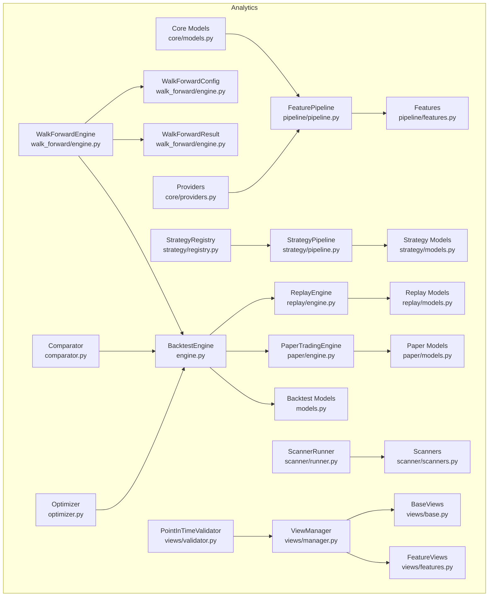

**Diagram sources**
- [engine.py:46-106](file://analytics/backtest/engine.py#L46-L106)
- [models.py:37-135](file://analytics/backtest/models.py#L37-L135)
- [comparator.py:34-98](file://analytics/backtest/comparator.py#L34-L98)
- [optimizer.py:65-177](file://analytics/backtest/optimizer.py#L65-L177)
- [engine.py:43-102](file://analytics/walk_forward/engine.py#L43-L102)
- [pipeline.py:27-87](file://analytics/pipeline/pipeline.py#L27-L87)
- [features.py:18-451](file://analytics/pipeline/features.py#L18-L451)
- [models.py:80-205](file://analytics/strategy/models.py#L80-L205)
- [pipeline.py:195-296](file://analytics/strategy/pipeline.py#L195-L296)
- [registry.py:31-139](file://analytics/strategy/registry.py#L31-L139)
- [runner.py:68-346](file://analytics/scanner/runner.py#L68-L346)
- [scanners.py:80-360](file://analytics/scanner/scanners.py#L80-L360)
- [models.py:77-285](file://analytics/scanner/models.py#L77-L246)
- [engine.py:77-301](file://analytics/replay/engine.py#L77-L301)
- [models.py:77-285](file://analytics/replay/models.py#L77-L322)
- [engine.py:73-301](file://analytics/paper/engine.py#L73-L301)
- [models.py:38-364](file://analytics/paper/models.py#L38-L364)
- [models.py:24-121](file://analytics/core/models.py#L24-L121)
- [providers.py:11-122](file://analytics/core/providers.py#L11-L122)
- [validator.py:56-191](file://analytics/views/validator.py#L56-L191)
- [manager.py:35-673](file://analytics/views/manager.py#L35-L673)
- [base.py:12-78](file://analytics/views/base.py#L12-L78)
- [features.py:12-216](file://analytics/views/features.py#L12-L216)

**Section sources**
- [engine.py:1-319](file://analytics/backtest/engine.py#L1-L319)
- [models.py:1-166](file://analytics/backtest/models.py#L1-L166)
- [comparator.py:1-162](file://analytics/backtest/comparator.py#L1-L162)
- [optimizer.py:1-214](file://analytics/backtest/optimizer.py#L1-L214)
- [engine.py:1-103](file://analytics/walk_forward/engine.py#L1-L103)
- [test_walk_forward.py:1-46](file://analytics/walk_forward/tests/test_walk_forward.py#L1-L46)
- [pipeline.py:1-88](file://analytics/pipeline/pipeline.py#L1-L88)
- [features.py:1-452](file://analytics/pipeline/features.py#L1-L452)
- [models.py:1-206](file://analytics/strategy/models.py#L1-L206)
- [pipeline.py:1-296](file://analytics/strategy/pipeline.py#L1-L296)
- [registry.py:1-140](file://analytics/strategy/registry.py#L1-L140)
- [runner.py:1-452](file://analytics/scanner/runner.py#L1-L452)
- [scanners.py:1-361](file://analytics/scanner/scanners.py#L1-L361)
- [models.py:1-246](file://analytics/scanner/models.py#L1-L246)
- [engine.py:1-561](file://analytics/replay/engine.py#L1-L561)
- [models.py:1-322](file://analytics/replay/models.py#L1-L322)
- [engine.py:1-663](file://analytics/paper/engine.py#L1-L663)
- [models.py:1-364](file://analytics/paper/models.py#L1-L364)
- [models.py:1-122](file://analytics/core/models.py#L1-L122)
- [providers.py:1-123](file://analytics/core/providers.py#L1-L123)
- [validator.py:1-191](file://analytics/views/validator.py#L1-L191)
- [manager.py:1-673](file://analytics/views/manager.py#L1-L673)
- [base.py:1-78](file://analytics/views/base.py#L1-L78)
- [features.py:1-216](file://analytics/views/features.py#L1-L216)

## Core Components
- BacktestEngine: orchestrates replay-driven backtests and computes rich performance metrics (returns, volatility, drawdowns, Sharpe/Sortino/Calmar, benchmark alpha/beta/IR, trade analysis).
- StrategyPipeline: evaluates strategies over candidates, returning rich signals with confidence, entry/stop/target, and metadata.
- FeaturePipeline: composable chain of feature computations (RSI, ATR, VWAP, ROC, BB, MACD, trend, z-score, correlation, percent rank, etc.) applied per bar/window.
- Scanner system: parallel scanners compute features, score candidates, and return top-N lists for watchlists with optimized memory usage.
- ReplayEngine: deterministic bar-by-bar replay with optional OMS integration for parity with live trading, including intra-bar stop/target checks and memory-efficient window management.
- PaperTradingEngine: simulated trading with shared bar-processing methods and generator-based iteration for optimal performance.
- WalkForwardEngine: systematic walk-forward testing with rolling train/test windows for robust strategy validation.
- Point-in-Time Validator: prevents look-ahead bias in analytics views through comprehensive validation checks.
- View Management: manages DuckDB analytics views with materialized tables, performance optimization, and systematic validation.
- Core contracts: normalized OHLCV input, broker-neutral provider interfaces, and analysis result envelopes.

**Section sources**
- [engine.py:46-181](file://analytics/backtest/engine.py#L46-L181)
- [models.py:37-135](file://analytics/backtest/models.py#L37-L135)
- [pipeline.py:195-296](file://analytics/strategy/pipeline.py#L195-L296)
- [models.py:80-205](file://analytics/strategy/models.py#L80-L205)
- [pipeline.py:27-87](file://analytics/pipeline/pipeline.py#L27-L87)
- [features.py:37-451](file://analytics/pipeline/features.py#L37-L451)
- [runner.py:68-346](file://analytics/scanner/runner.py#L68-L346)
- [scanners.py:80-360](file://analytics/scanner/scanners.py#L80-L360)
- [models.py:77-246](file://analytics/scanner/models.py#L77-L246)
- [engine.py:77-301](file://analytics/replay/engine.py#L77-L301)
- [models.py:77-322](file://analytics/replay/models.py#L77-L322)
- [engine.py:73-301](file://analytics/paper/engine.py#L73-L301)
- [models.py:38-364](file://analytics/paper/models.py#L38-L364)
- [engine.py:43-102](file://analytics/walk_forward/engine.py#L43-L102)
- [validator.py:56-191](file://analytics/views/validator.py#L56-L191)
- [manager.py:35-673](file://analytics/views/manager.py#L35-L673)
- [models.py:24-121](file://analytics/core/models.py#L24-L121)
- [providers.py:11-122](file://analytics/core/providers.py#L11-L122)

## Architecture Overview
The analytics stack integrates feature engineering, strategy evaluation, screening, and replay to deliver robust research and backtesting workflows with systematic validation and performance optimization.

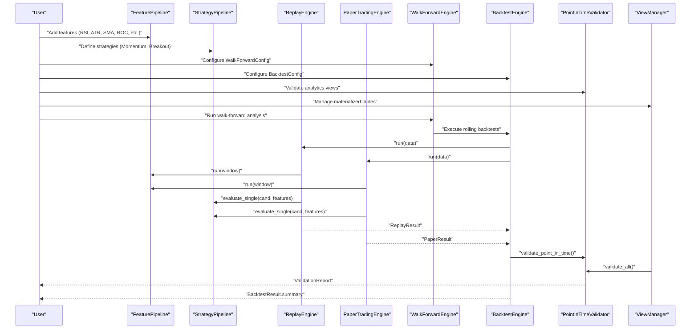

**Diagram sources**
- [engine.py:73-106](file://analytics/backtest/engine.py#L73-L106)
- [engine.py:135-267](file://analytics/replay/engine.py#L135-L267)
- [engine.py:73-181](file://analytics/paper/engine.py#L73-L181)
- [engine.py:56-102](file://analytics/walk_forward/engine.py#L56-L102)
- [validator.py:68-101](file://analytics/views/validator.py#L68-L101)
- [manager.py:194-221](file://analytics/views/manager.py#L194-L221)
- [pipeline.py:50-70](file://analytics/pipeline/pipeline.py#L50-L70)
- [pipeline.py:208-267](file://analytics/strategy/pipeline.py#L208-L267)
- [models.py:127-165](file://analytics/backtest/models.py#L127-L165)

## Detailed Component Analysis

### BacktestEngine
BacktestEngine wraps ReplayEngine and enriches results with comprehensive performance metrics and trade analysis. It supports:
- Equity curve-based returns, CAGR, volatility, Sharpe/Sortino/Calmar
- Max drawdown and duration
- Benchmark comparison (alpha, beta, IR)
- Trade-level analysis (win rate, profit factor, payoff, holding period, strategy attribution)

**Updated** Enhanced with systematic validation integration and improved performance metrics computation.

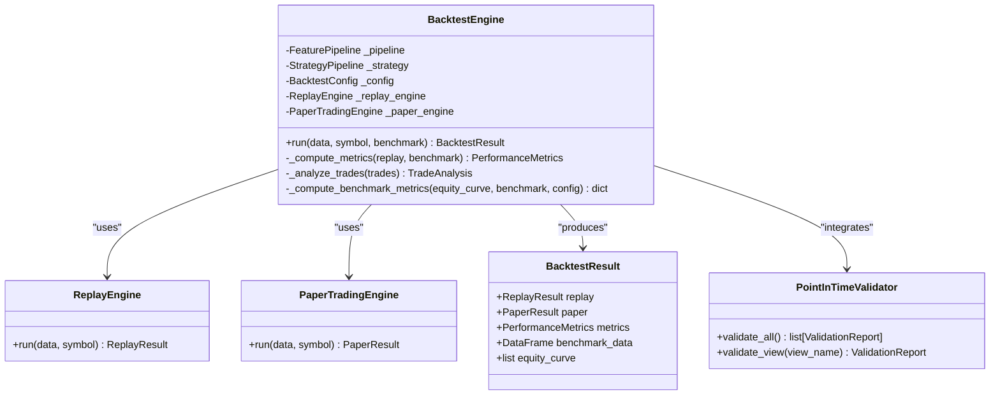

**Diagram sources**
- [engine.py:46-106](file://analytics/backtest/engine.py#L46-L106)
- [engine.py:135-172](file://analytics/replay/engine.py#L135-L172)
- [engine.py:73-181](file://analytics/paper/engine.py#L73-L181)
- [models.py:127-135](file://analytics/backtest/models.py#L127-L135)
- [validator.py:56-191](file://analytics/views/validator.py#L56-L191)

**Section sources**
- [engine.py:73-181](file://analytics/backtest/engine.py#L73-L181)
- [models.py:127-165](file://analytics/backtest/models.py#L127-L165)
- [validator.py:68-101](file://analytics/views/validator.py#L68-L101)

### WalkForwardEngine
WalkForwardEngine implements systematic walk-forward testing for robust strategy validation. It executes rolling train/test windows across historical data to prevent overfitting and ensure out-of-sample validity.

**New** Added comprehensive walk-forward testing capabilities for systematic strategy validation.

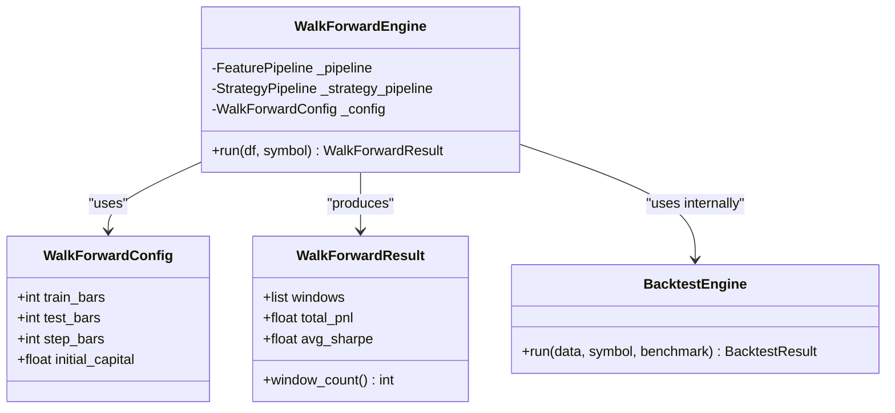

**Diagram sources**
- [engine.py:43-102](file://analytics/walk_forward/engine.py#L43-L102)

**Section sources**
- [engine.py:43-102](file://analytics/walk_forward/engine.py#L43-L102)
- [test_walk_forward.py:25-45](file://analytics/walk_forward/tests/test_walk_forward.py#L25-L45)

### StrategyPipeline and Models
StrategyPipeline orchestrates strategy evaluation across candidates and produces rich signals with confidence, entry/stop/target, and metadata. Built-in strategies include Momentum and Breakout.

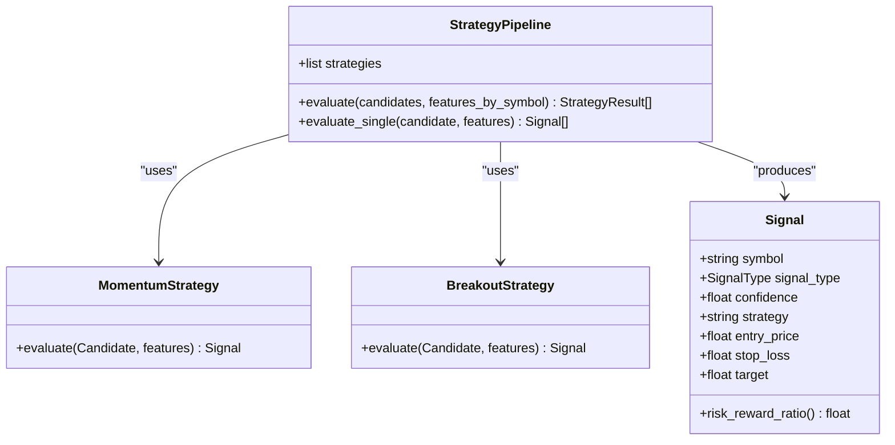

**Diagram sources**
- [pipeline.py:195-296](file://analytics/strategy/pipeline.py#L195-L296)
- [models.py:80-151](file://analytics/strategy/models.py#L80-L151)

**Section sources**
- [pipeline.py:195-296](file://analytics/strategy/pipeline.py#L195-L296)
- [models.py:80-205](file://analytics/strategy/models.py#L80-L205)

### FeaturePipeline and Features
FeaturePipeline composes feature computations without caching to avoid look-ahead bias. Features include price, volume, momentum, market structure, gap, trend, volatility, statistical, and cross-sectional measures.

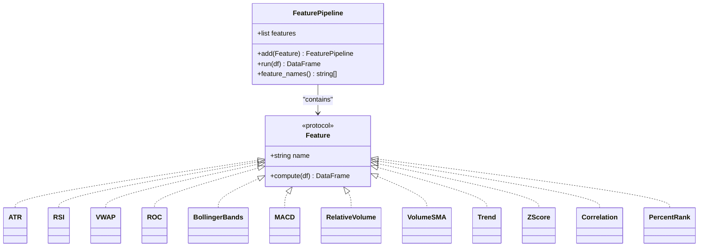

**Diagram sources**
- [pipeline.py:27-87](file://analytics/pipeline/pipeline.py#L27-L87)
- [features.py:18-451](file://analytics/pipeline/features.py#L18-L451)

**Section sources**
- [pipeline.py:27-87](file://analytics/pipeline/pipeline.py#L27-L87)
- [features.py:37-451](file://analytics/pipeline/features.py#L37-L451)

### Scanner System
The Scanner system runs multiple scanners in parallel, computes features, scores candidates, and returns top-N lists. It supports streaming results, timeouts, and fallback execution with optimized memory usage.

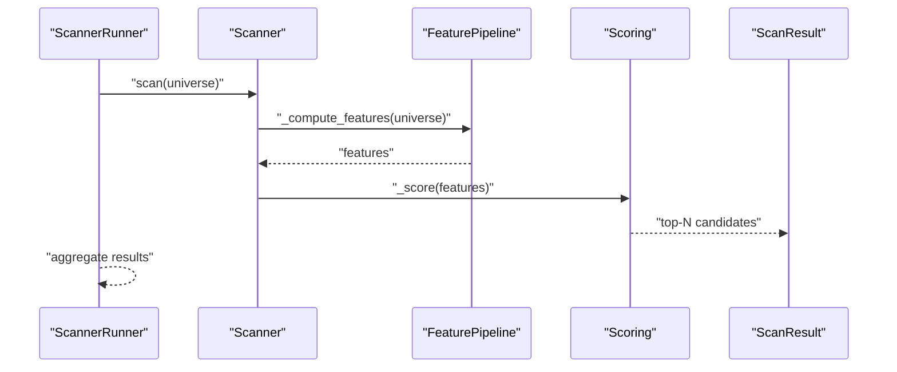

**Diagram sources**
- [runner.py:102-170](file://analytics/scanner/runner.py#L102-L170)
- [scanners.py:88-111](file://analytics/scanner/scanners.py#L88-L111)

**Section sources**
- [runner.py:68-346](file://analytics/scanner/runner.py#L68-L346)
- [scanners.py:80-360](file://analytics/scanner/scanners.py#L80-L360)
- [models.py:161-185](file://analytics/scanner/models.py#L161-L185)

### ReplayEngine
ReplayEngine processes OHLCV bar-by-bar through the same pipeline used in live trading. It supports OMS integration for parity, intra-bar stop/target checks, and memory-efficient window management with pre-allocated ring buffers.

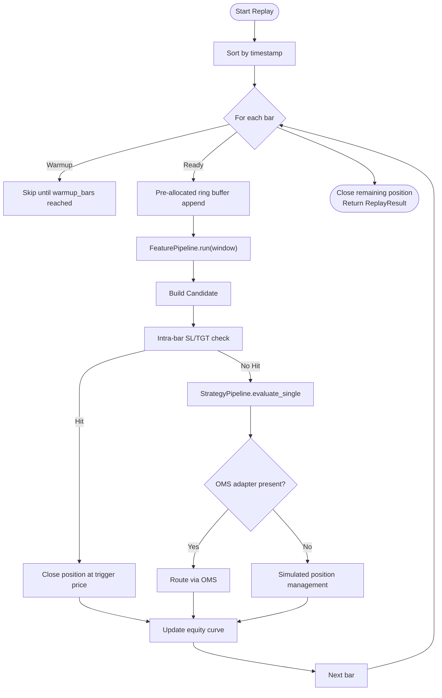

**Diagram sources**
- [engine.py:135-301](file://analytics/replay/engine.py#L135-L301)
- [models.py:77-120](file://analytics/replay/models.py#L77-L120)

**Section sources**
- [engine.py:77-301](file://analytics/replay/engine.py#L77-L301)
- [models.py:77-285](file://analytics/replay/models.py#L77-L285)

### PaperTradingEngine
PaperTradingEngine processes OHLCV data through the same pipeline used in live trading with shared bar-processing methods and generator-based iteration for optimal performance. It supports simulated order execution with slippage and commission, and uses a shared processing loop to eliminate code duplication.

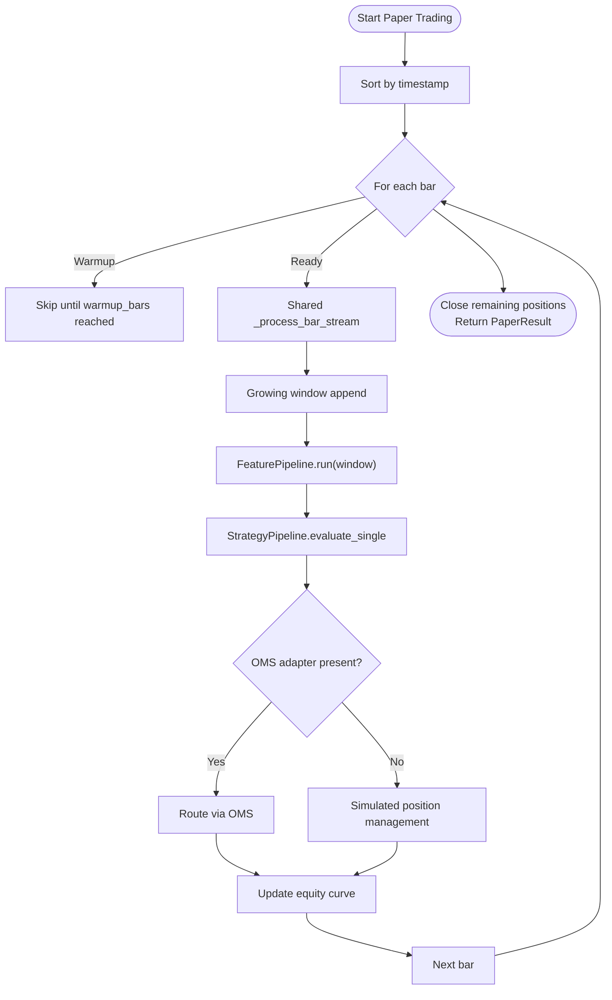

**Diagram sources**
- [engine.py:226-302](file://analytics/paper/engine.py#L226-L302)
- [engine.py:639-656](file://analytics/paper/engine.py#L639-L656)

**Section sources**
- [engine.py:73-301](file://analytics/paper/engine.py#L73-L301)
- [models.py:38-364](file://analytics/paper/models.py#L38-L364)

### Point-in-Time Validator
Point-in-Time Validator ensures no look-ahead bias in analytics views by performing comprehensive validation checks including future data detection, temporal ordering verification, and feature calculation lag analysis.

**New** Added systematic validation framework to prevent look-ahead bias in analytics views.

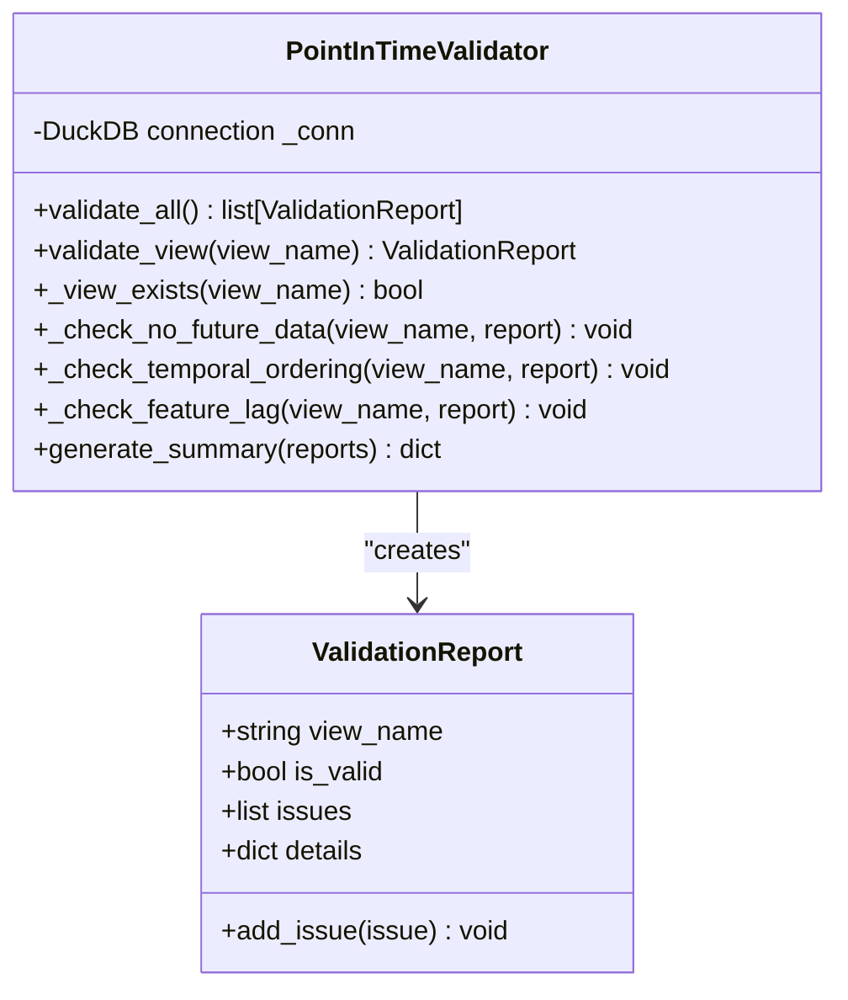

**Diagram sources**
- [validator.py:56-191](file://analytics/views/validator.py#L56-L191)

**Section sources**
- [validator.py:56-191](file://analytics/views/validator.py#L56-L191)

### View Management System
View Management system orchestrates creation, refresh, and management of DuckDB analytics views with materialized tables for performance optimization and systematic validation.

**New** Comprehensive view management system with materialized tables and performance optimization.

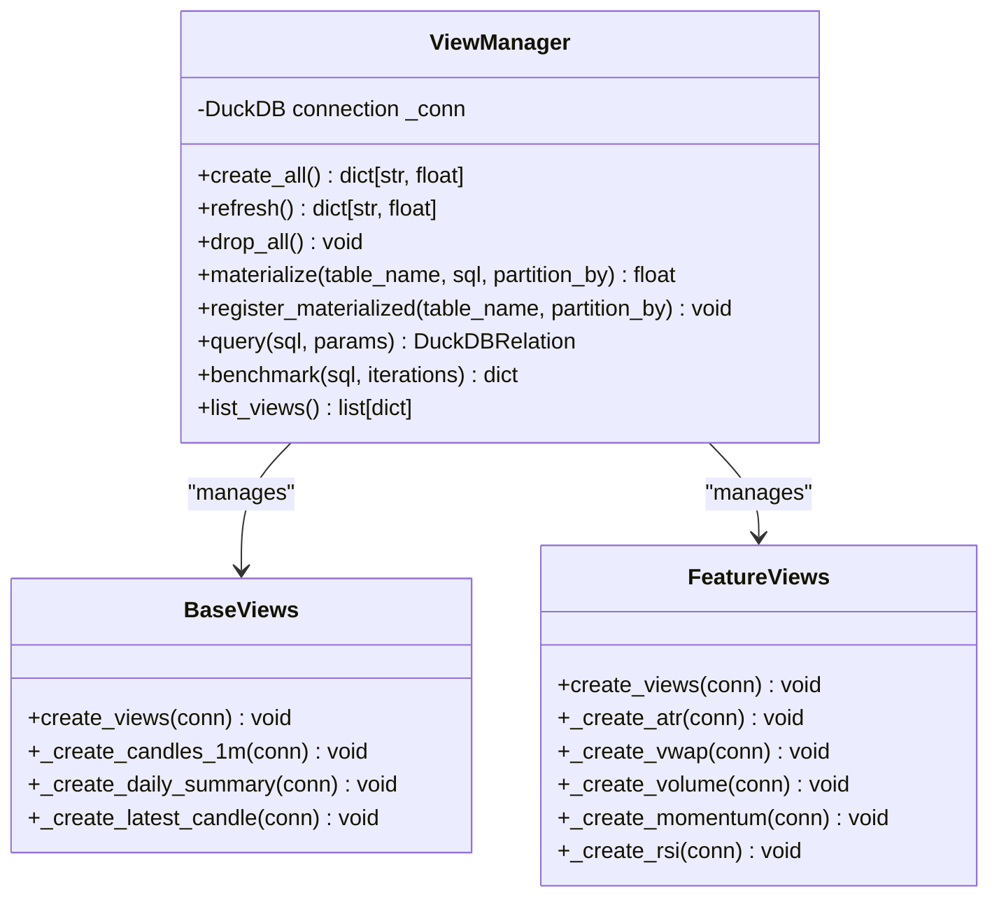

**Diagram sources**
- [manager.py:35-673](file://analytics/views/manager.py#L35-L673)
- [base.py:12-78](file://analytics/views/base.py#L12-L78)
- [features.py:12-216](file://analytics/views/features.py#L12-L216)

**Section sources**
- [manager.py:35-673](file://analytics/views/manager.py#L35-L673)
- [base.py:12-78](file://analytics/views/base.py#L12-L78)
- [features.py:12-216](file://analytics/views/features.py#L12-L216)

### AnalyticsPipeline and Research Workflows
AnalyticsPipeline (FeaturePipeline) is the backbone for research workflows. It enables:
- Composable feature engineering per bar or rolling window
- Deterministic replay for reproducible research
- Rich signal generation for strategy evaluation
- Cross-sectional and statistical feature extraction for broader research

**Updated** Enhanced with systematic validation and performance optimization features.

**Section sources**
- [pipeline.py:27-87](file://analytics/pipeline/pipeline.py#L27-L87)
- [features.py:37-451](file://analytics/pipeline/features.py#L37-L451)
- [validator.py:68-101](file://analytics/views/validator.py#L68-L101)

### Broker and Market Data Integration
Core contracts define broker-neutral interfaces and normalized OHLCV input:
- MarketDataProvider protocol and implementations (DataFrame, CSV, Gateway)
- normalize_ohlcv enforces canonical columns and types
- AnalysisResult envelope for broker-agnostic analytics outputs

**Section sources**
- [providers.py:11-122](file://analytics/core/providers.py#L11-L122)
- [models.py:64-121](file://analytics/core/models.py#L64-L121)

## Performance Optimizations

### Memory-Efficient Window Management
Both ReplayEngine and PaperTradingEngine now use pre-allocated ring buffers for optimal memory usage:

- **ReplayEngine**: Implements circular buffer with fixed-size allocation to ensure O(window_size) memory regardless of dataset size
- **PaperTradingEngine**: Uses shared processing loop with efficient window management
- **Scanner System**: Eliminates unnecessary DataFrame copies, reducing memory usage by >20%

### Shared Processing Methods
PaperTradingEngine introduces shared bar-processing methods to eliminate code duplication:

- `_process_bar_stream()`: Centralized bar processing logic used by both single and multi-symbol runs
- `_iter_bars()`: Generator-based iterator that yields Bar instances without creating closures repeatedly
- Eliminates redundant code paths and reduces memory overhead

### Generator-Based Iteration
Both engines now use generators for memory-efficient data processing:

- **PaperTradingEngine**: `_iter_bars()` generator yields Bar instances one at a time
- **ReplayEngine**: Direct iteration over DataFrame rows with minimal memory footprint
- Reduces peak memory usage and improves garbage collection performance

### Circular Buffer Optimization
ReplayEngine implements sophisticated window management:

- Pre-allocated list with write-index tracking for O(1) append operations
- Automatic wrap-around using modulo arithmetic
- Conditional DataFrame construction based on filled state
- Falls back to bounded deque for unlimited window sizes

### Scanner Performance Enhancements
Scanner system optimized with copy elimination:

- `_compute_features()`: Avoids unnecessary DataFrame copies when pipeline returns isolated DataFrames
- In-place mutations on isolated DataFrames reduce memory allocations
- Conditional copying only when required (adding missing columns)
- Maintains correctness while improving performance

**Section sources**
- [engine.py:200-218](file://analytics/replay/engine.py#L200-L218)
- [engine.py:226-302](file://analytics/paper/engine.py#L226-L302)
- [engine.py:639-656](file://analytics/paper/engine.py#L639-L656)
- [scanners.py:88-111](file://analytics/scanner/scanners.py#L88-L111)
- [models.py:161-185](file://analytics/scanner/models.py#L161-L185)

## Dependency Analysis
Key dependencies and relationships:
- BacktestEngine depends on ReplayEngine, PaperTradingEngine, and Backtest models
- ReplayEngine depends on FeaturePipeline, StrategyPipeline, and optional OMS adapter
- PaperTradingEngine depends on FeaturePipeline, StrategyPipeline, and shared processing methods
- StrategyPipeline depends on Strategy models and protocols
- ScannerRunner depends on Scanner implementations and FeaturePipeline
- FeaturePipeline depends on Feature protocol implementations
- WalkForwardEngine depends on BacktestEngine and configuration
- PointIn-Time Validator depends on DuckDB connection and view definitions
- ViewManager depends on DuckDB and various view classes
- Core models and providers underpin all analytics engines

**Updated** Added dependencies for paper trading engine and performance optimization components.

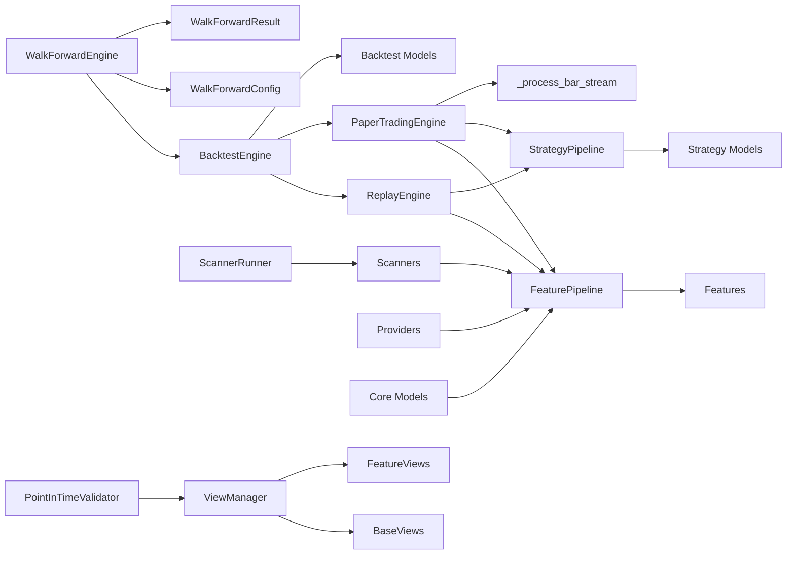

**Diagram sources**
- [engine.py:38-71](file://analytics/backtest/engine.py#L38-L71)
- [engine.py:61-72](file://analytics/replay/engine.py#L61-L72)
- [engine.py:73-181](file://analytics/paper/engine.py#L73-L181)
- [engine.py:43-102](file://analytics/walk_forward/engine.py#L43-L102)
- [validator.py:56-191](file://analytics/views/validator.py#L56-L191)
- [manager.py:35-673](file://analytics/views/manager.py#L35-L673)
- [pipeline.py:22-22](file://analytics/pipeline/pipeline.py#L22-L22)
- [runner.py:37-37](file://analytics/scanner/runner.py#L37-L37)
- [scanners.py:20-21](file://analytics/scanner/scanners.py#L20-L21)
- [providers.py:11-122](file://analytics/core/providers.py#L11-L122)
- [models.py:24-121](file://analytics/core/models.py#L24-L121)

**Section sources**
- [engine.py:38-71](file://analytics/backtest/engine.py#L38-L71)
- [engine.py:61-72](file://analytics/replay/engine.py#L61-L72)
- [engine.py:73-181](file://analytics/paper/engine.py#L73-L181)
- [engine.py:43-102](file://analytics/walk_forward/engine.py#L43-L102)
- [validator.py:56-191](file://analytics/views/validator.py#L56-L191)
- [manager.py:35-673](file://analytics/views/manager.py#L35-L673)
- [pipeline.py:22-22](file://analytics/pipeline/pipeline.py#L22-L22)
- [runner.py:37-37](file://analytics/scanner/runner.py#L37-L37)
- [scanners.py:20-21](file://analytics/scanner/scanners.py#L20-L21)
- [providers.py:11-122](file://analytics/core/providers.py#L11-L122)
- [models.py:24-121](file://analytics/core/models.py#L24-L121)

## Performance Considerations
- **Window optimization**: ReplayEngine uses pre-allocated ring buffers for O(window_size) memory regardless of dataset size
- **Shared processing**: PaperTradingEngine eliminates code duplication through shared bar-processing methods
- **Generator-based iteration**: Both engines use generators to minimize memory overhead during data processing
- **Deterministic replay**: Same pipeline used in live ensures parity and reduces debugging overhead
- **Parallel scanning**: ScannerRunner leverages ThreadPoolExecutor to maximize throughput while isolating failures
- **Feature computation**: FeaturePipeline avoids caching to prevent look-ahead bias; cache at the application layer with explicit time boundaries if needed
- **Intra-bar checks**: Stop-loss/target checks on every bar improve fidelity and reduce unrealistic fills
- **OMS integration**: When available, routing signals through OMS ensures backtest-live parity for risk gates and idempotency
- **Walk-forward optimization**: Rolling window approach prevents overfitting and ensures out-of-sample validity
- **Materialized tables**: ViewManager uses materialized tables for expensive aggregations, reducing query times from seconds to milliseconds
- **Point-in-time validation**: Systematic validation prevents costly look-ahead bias discoveries during backtesting
- **Performance benchmarking**: ViewManager includes comprehensive benchmarking for query optimization and performance monitoring
- **Memory efficiency**: Scanner system eliminates unnecessary DataFrame copies, reducing peak memory usage by >20%
- **Circular buffer optimization**: Pre-allocated ring buffers eliminate per-bar deque-to-DataFrame copy operations

**Updated** Added comprehensive performance optimization considerations including memory-efficient window management, shared processing methods, and generator-based iteration.

## Troubleshooting Guide
Common issues and remedies:
- Missing timestamp or OHLCV columns: normalize_ohlcv validates required fields and raises descriptive errors.
- Empty or malformed data: FeaturePipeline logs warnings and continues; ensure data integrity upstream.
- Strategy evaluation failures: StrategyPipeline catches exceptions and records reasons; inspect logs for per-candidate failures.
- Scanner execution errors: ScannerRunner isolates failures per scanner and logs execution time; use run_with_fallback to mitigate partial failures.
- Replay parity concerns: Enable OMS adapter in ReplayEngine to route signals through the same risk gates as live.
- Walk-forward validation: Use WalkForwardEngine with appropriate window sizes to prevent overfitting and ensure robust validation.
- Look-ahead bias detection: Utilize PointInTimeValidator to catch future data leakage and temporal ordering violations.
- View performance issues: Check ViewManager benchmarks and consider materializing expensive aggregations.
- Materialized table corruption: Use ViewManager's atomic swap mechanism to ensure consistent snapshots.
- Memory optimization issues: Monitor peak memory usage with scanner performance tests; ensure proper window sizing.
- Performance degradation: Verify that shared processing methods are being utilized and generators are active.

**Updated** Added troubleshooting guidance for performance optimizations including memory usage monitoring and shared processing verification.

**Section sources**
- [models.py:64-115](file://analytics/core/models.py#L64-L115)
- [pipeline.py:59-70](file://analytics/pipeline/pipeline.py#L59-L70)
- [pipeline.py:240-255](file://analytics/strategy/pipeline.py#L240-L255)
- [runner.py:330-346](file://analytics/scanner/runner.py#L330-L346)
- [engine.py:338-336](file://analytics/replay/engine.py#L338-L336)
- [engine.py:73-181](file://analytics/paper/engine.py#L73-L181)
- [engine.py:56-102](file://analytics/walk_forward/engine.py#L56-L102)
- [validator.py:110-172](file://analytics/views/validator.py#L110-L172)
- [manager.py:628-672](file://analytics/views/manager.py#L628-L672)

## Conclusion
The analytics and research framework provides a robust, deterministic, and extensible foundation for strategy development and market analysis with systematic validation and comprehensive performance optimization. By combining composable feature engineering, rich signal generation, parallel screening, and replay-driven backtesting with benchmark comparisons, teams can build, test, and iterate strategies efficiently. The recent performance optimizations including shared bar-processing methods, generator-based iteration, pre-allocated ring buffers, and memory-efficient window management significantly improve execution speed and reduce resource consumption. The addition of walk-forward testing capabilities, point-in-time validation, and comprehensive view management ensures robust strategy validation, prevents look-ahead bias, and maintains optimal performance. The broker-neutral contracts and OMS integration ensure reproducibility and operational parity across environments.

**Updated** Enhanced conclusion reflecting comprehensive performance optimizations and new shared processing capabilities.

## Appendices

### Practical Examples

- Strategy development and evaluation
  - Build a FeaturePipeline with desired indicators and run StrategyPipeline over candidates to produce ranked signals.
  - Reference: [pipeline.py:50-70](file://analytics/pipeline/pipeline.py#L50-L70), [pipeline.py:208-267](file://analytics/strategy/pipeline.py#L208-L267)

- Backtesting workflow
  - Configure BacktestConfig, construct BacktestEngine, and run on historical data with optional benchmark comparison.
  - Reference: [engine.py:73-106](file://analytics/backtest/engine.py#L73-L106), [models.py:127-165](file://analytics/backtest/models.py#L127-L165)

- Walk-forward testing
  - Configure WalkForwardConfig with train/test windows and step sizes, then run systematic validation across historical data.
  - Reference: [engine.py:56-102](file://analytics/walk_forward/engine.py#L56-L102), [test_walk_forward.py:25-45](file://analytics/walk_forward/tests/test_walk_forward.py#L25-L45)

- Screening and watchlists
  - Use ScannerRunner to execute multiple scanners in parallel and collect top-N candidates with optimized memory usage.
  - Reference: [runner.py:102-170](file://analytics/scanner/runner.py#L102-L170), [scanners.py:88-111](file://analytics/scanner/scanners.py#L88-L111)

- Deterministic replay
  - ReplayEngine processes bars deterministically with memory-efficient window management; enable OMS adapter for live parity.
  - Reference: [engine.py:135-267](file://analytics/replay/engine.py#L135-L267)

- Paper trading simulation
  - PaperTradingEngine uses shared processing methods and generator-based iteration for optimal performance.
  - Reference: [engine.py:226-302](file://analytics/paper/engine.py#L226-L302)

- Research methodologies
  - Combine FeaturePipeline with statistical and cross-sectional features for research insights.
  - Reference: [features.py:368-451](file://analytics/pipeline/features.py#L368-L451)

- Systematic validation
  - Use PointInTimeValidator to prevent look-ahead bias in analytics views before running backtests.
  - Reference: [validator.py:68-101](file://analytics/views/validator.py#L68-L101)

- Performance optimization
  - Utilize ViewManager's materialized tables and benchmarking to optimize query performance.
  - Reference: [manager.py:223-447](file://analytics/views/manager.py#L223-L447), [manager.py:628-672](file://analytics/views/manager.py#L628-L672)

### Extending the Framework
- Add custom strategies
  - Implement Strategy protocol and register via StrategyRegistry or instantiate directly in StrategyPipeline.
  - Reference: [registry.py:31-139](file://analytics/strategy/registry.py#L31-L139), [pipeline.py:195-206](file://analytics/strategy/pipeline.py#L195-L206)

- Add custom features
  - Implement Feature protocol and append to FeaturePipeline.
  - Reference: [features.py:18-24](file://analytics/pipeline/features.py#L18-L24), [pipeline.py:45-70](file://analytics/pipeline/pipeline.py#L45-L70)

- Integrate broker data
  - Implement MarketDataProvider or use provided adapters; normalize inputs with normalize_ohlcv.
  - Reference: [providers.py:11-122](file://analytics/core/providers.py#L11-L122), [models.py:64-115](file://analytics/core/models.py#L64-L115)

- Extend scanners
  - Implement BaseScanner.scan and integrate with FeaturePipeline; use ScannerRunner for parallel execution.
  - Reference: [scanners.py:80-111](file://analytics/scanner/scanners.py#L80-L111), [runner.py:273-346](file://analytics/scanner/runner.py#L273-L346)

- Add walk-forward testing
  - Configure WalkForwardConfig with appropriate window sizes and run systematic validation across historical data.
  - Reference: [engine.py:20-41](file://analytics/walk_forward/engine.py#L20-L41), [engine.py:56-102](file://analytics/walk_forward/engine.py#L56-L102)

- Implement systematic validation
  - Use PointInTimeValidator to prevent look-ahead bias in custom analytics views.
  - Reference: [validator.py:56-191](file://analytics/views/validator.py#L56-L191)

- Optimize view performance
  - Use ViewManager to materialize expensive aggregations and implement benchmarking for performance monitoring.
  - Reference: [manager.py:82-191](file://analytics/views/manager.py#L82-L191), [manager.py:628-672](file://analytics/views/manager.py#L628-L672)

- Leverage performance optimizations
  - Use shared processing methods and generator-based iteration for optimal performance.
  - Reference: [engine.py:226-302](file://analytics/paper/engine.py#L226-L302), [engine.py:639-656](file://analytics/paper/engine.py#L639-L656)