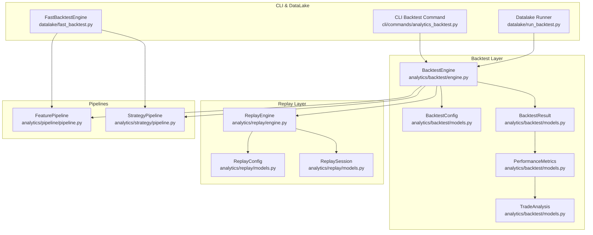
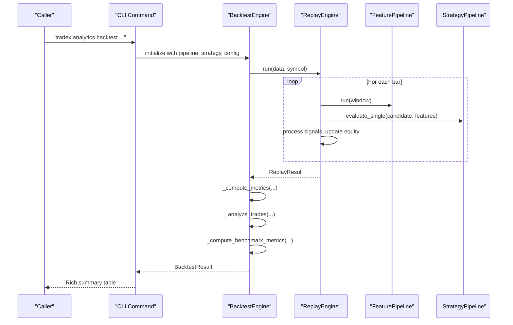
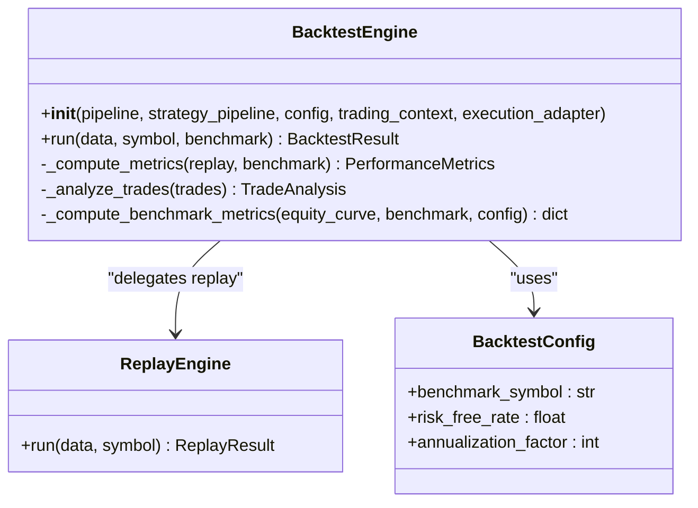
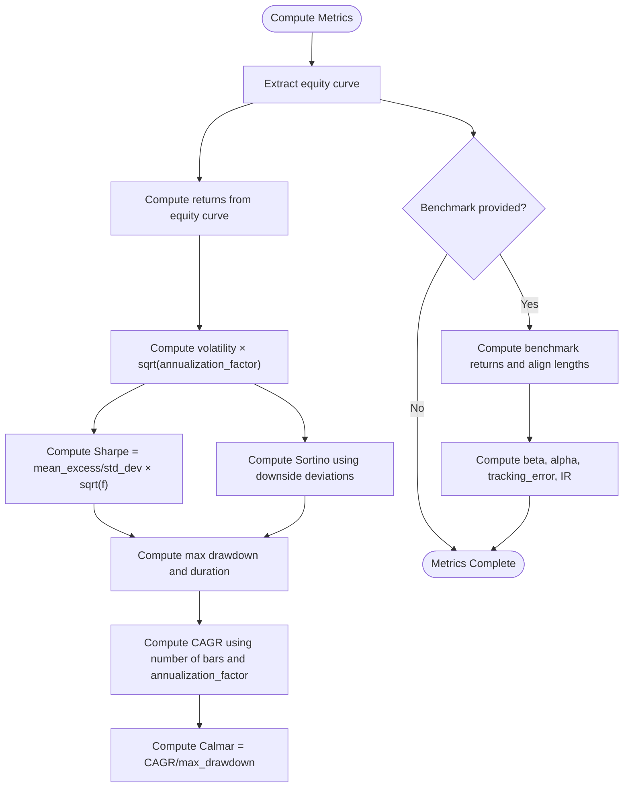
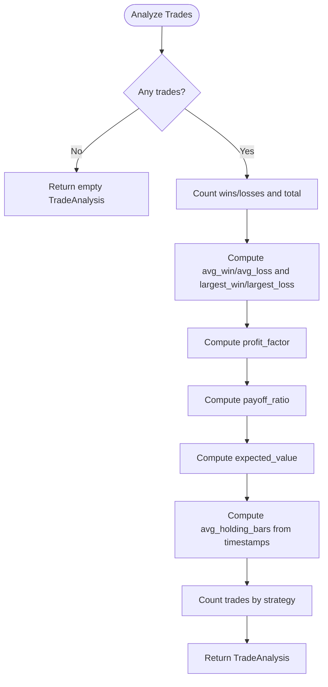
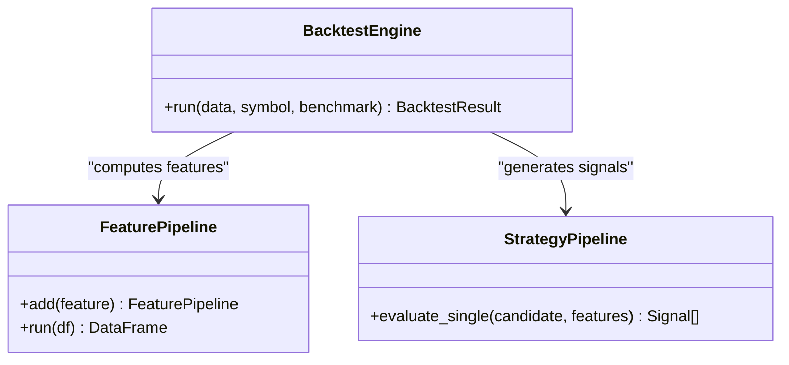
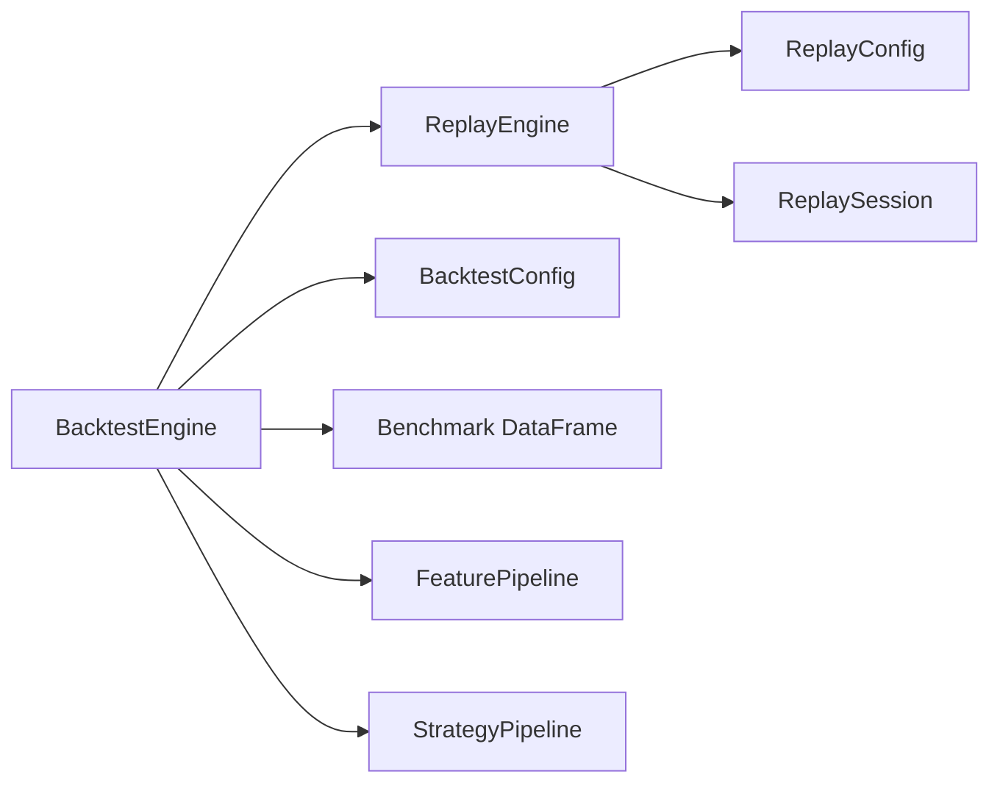

# Backtesting Framework

<cite>
**Referenced Files in This Document**
- [engine.py](file://analytics/backtest/engine.py)
- [models.py](file://analytics/backtest/models.py)
- [engine.py](file://analytics/replay/engine.py)
- [models.py](file://analytics/replay/models.py)
- [optimizer.py](file://analytics/backtest/optimizer.py)
- [comparator.py](file://analytics/backtest/comparator.py)
- [test_backtest.py](file://analytics/tests/test_backtest.py)
- [analytics_backtest.py](file://cli/commands/analytics_backtest.py)
- [fast_backtest.py](file://datalake/fast_backtest.py)
- [run_backtest.py](file://datalake/run_backtest.py)
- [pipeline.py](file://analytics/pipeline/pipeline.py)
- [pipeline.py](file://analytics/strategy/pipeline.py)
</cite>

## Table of Contents
1. [Introduction](#introduction)
2. [Project Structure](#project-structure)
3. [Core Components](#core-components)
4. [Architecture Overview](#architecture-overview)
5. [Detailed Component Analysis](#detailed-component-analysis)
6. [Dependency Analysis](#dependency-analysis)
7. [Performance Considerations](#performance-considerations)
8. [Troubleshooting Guide](#troubleshooting-guide)
9. [Conclusion](#conclusion)
10. [Appendices](#appendices)

## Introduction
This document describes the backtesting framework centered on the BacktestEngine class, which wraps the ReplayEngine to perform bar-by-bar simulation using the same FeaturePipeline and StrategyPipeline applied in live trading. It computes comprehensive performance analytics including return metrics, risk metrics, risk-adjusted metrics, maximum drawdown statistics, benchmark comparisons (alpha, beta, information ratio), and detailed TradeAnalysis. It also covers configuration via BacktestConfig, integration with FeaturePipeline and StrategyPipeline, practical usage via CLI, and advanced workflows such as parameter optimization and strategy comparison.

## Project Structure
The backtesting framework spans several modules:
- analytics/backtest: BacktestEngine, BacktestConfig, BacktestResult, PerformanceMetrics, TradeAnalysis, plus optimizer and comparator utilities
- analytics/replay: ReplayEngine and ReplayConfig for bar-by-bar replay and session tracking
- analytics/pipeline: FeaturePipeline for composing feature computations
- analytics/strategy: StrategyPipeline and built-in strategies (e.g., MomentumStrategy, BreakoutStrategy)
- datalake: optimized engines and runners integrating DataLake data
- cli: command-line interface for running backtests with rich output
- tests: unit tests validating behavior and metrics computation

**Diagram sources**
- [engine.py:46-116](file://analytics/backtest/engine.py#L46-L116)
- [models.py:37-166](file://analytics/backtest/models.py#L37-L166)
- [engine.py:84-151](file://analytics/replay/engine.py#L84-L151)
- [models.py:77-230](file://analytics/replay/models.py#L77-L230)
- [pipeline.py:27-88](file://analytics/pipeline/pipeline.py#L27-L88)
- [pipeline.py:195-296](file://analytics/strategy/pipeline.py#L195-L296)
- [analytics_backtest.py:15-84](file://cli/commands/analytics_backtest.py#L15-L84)
- [run_backtest.py:70-107](file://datalake/run_backtest.py#L70-L107)
- [fast_backtest.py:45-127](file://datalake/fast_backtest.py#L45-L127)

**Section sources**
- [engine.py:1-319](file://analytics/backtest/engine.py#L1-L319)
- [models.py:1-166](file://analytics/backtest/models.py#L1-L166)
- [engine.py:1-584](file://analytics/replay/engine.py#L1-L584)
- [models.py:1-286](file://analytics/replay/models.py#L1-L286)
- [pipeline.py:1-88](file://analytics/pipeline/pipeline.py#L1-L88)
- [pipeline.py:1-296](file://analytics/strategy/pipeline.py#L1-L296)
- [analytics_backtest.py:1-191](file://cli/commands/analytics_backtest.py#L1-L191)
- [run_backtest.py:1-207](file://datalake/run_backtest.py#L1-L207)
- [fast_backtest.py:1-295](file://datalake/fast_backtest.py#L1-L295)

## Core Components
- BacktestEngine: orchestrates replay-driven simulation and computes performance metrics and trade analysis. It initializes a ReplayEngine internally and delegates the OHLCV loop to it, then augments results with analytics.
- BacktestConfig: extends ReplayConfig with backtest-specific fields such as benchmark_symbol, risk_free_rate, and annualization_factor.
- PerformanceMetrics: aggregates return, risk, risk-adjusted, and benchmark metrics.
- TradeAnalysis: detailed trade-level statistics including win rate, payoff ratio, profit factor, expected value, holding period, and strategy-wise trade counts.
- ReplayEngine: performs the bar-by-bar replay using FeaturePipeline and StrategyPipeline, tracks signals, trades, and equity curve, and supports optional OMS integration for parity.
- FeaturePipeline and StrategyPipeline: reusable components that compute features and generate signals consistently across replay, backtest, paper, and live modes.

Key responsibilities:
- BacktestEngine.run(data, symbol, benchmark) → BacktestResult
- BacktestEngine._compute_metrics(...) → PerformanceMetrics
- BacktestEngine._analyze_trades(...) → TradeAnalysis
- BacktestEngine._compute_benchmark_metrics(...) → alpha, beta, IR, benchmark_return, tracking_error

**Section sources**
- [engine.py:46-191](file://analytics/backtest/engine.py#L46-L191)
- [models.py:37-166](file://analytics/backtest/models.py#L37-L166)
- [engine.py:84-284](file://analytics/replay/engine.py#L84-L284)

## Architecture Overview
The backtesting pipeline follows a layered design:
- Input: OHLCV DataFrame (and optional benchmark)
- ReplayEngine processes each bar, computing features via FeaturePipeline and generating signals via StrategyPipeline
- BacktestEngine collects ReplayResult and enriches with performance analytics
- Results expose a unified BacktestResult with metrics and summaries

**Diagram sources**
- [engine.py:83-116](file://analytics/backtest/engine.py#L83-L116)
- [engine.py:152-284](file://analytics/replay/engine.py#L152-L284)
- [pipeline.py:50-70](file://analytics/pipeline/pipeline.py#L50-L70)
- [pipeline.py:269-296](file://analytics/strategy/pipeline.py#L269-L296)
- [analytics_backtest.py:58-84](file://cli/commands/analytics_backtest.py#L58-L84)

## Detailed Component Analysis

### BacktestEngine
BacktestEngine wraps ReplayEngine to run bar-by-bar simulations and compute comprehensive performance analytics. It:
- Initializes ReplayEngine with FeaturePipeline, StrategyPipeline, and BacktestConfig
- Executes replay and then computes metrics and trade analysis
- Supports optional benchmark comparison and returns a BacktestResult

Key methods:
- run(data, symbol="SYMBOL", benchmark=None) → BacktestResult
- _compute_metrics(replay_result, benchmark) → PerformanceMetrics
- _analyze_trades(trades) → TradeAnalysis
- _compute_benchmark_metrics(equity_curve, benchmark, config) → dict

**Diagram sources**
- [engine.py:62-116](file://analytics/backtest/engine.py#L62-L116)
- [engine.py:152-189](file://analytics/replay/engine.py#L152-L189)
- [models.py:37-48](file://analytics/backtest/models.py#L37-L48)

**Section sources**
- [engine.py:62-191](file://analytics/backtest/engine.py#L62-L191)

### BacktestConfig and Configuration Options
BacktestConfig extends ReplayConfig and adds:
- benchmark_symbol: default "NIFTY"
- risk_free_rate: default 0.065 (annualized)
- annualization_factor: default 252 (daily)

ReplayConfig fields include initial_capital, mode, window_size, warmup_bars, max_position_pct, slippage_pct, commission_flat, publish_events.

Validation constraints:
- slippage_pct ≥ 0
- max_position_pct > 0
- warmup_bars ≥ 0

**Section sources**
- [models.py:37-48](file://analytics/backtest/models.py#L37-L48)
- [models.py:77-119](file://analytics/replay/models.py#L77-L119)

### Performance Metrics Computation
BacktestEngine._compute_metrics populates PerformanceMetrics with:
- Return metrics: total_return, total_return_pct, CAGR
- Risk metrics: volatility, max_drawdown, max_drawdown_duration
- Risk-adjusted metrics: Sharpe ratio, Sortino ratio, Calmar ratio
- Benchmark comparison: alpha, beta, benchmark_return, tracking_error, information_ratio
- Trade metrics: embedded TradeAnalysis

Sharpe and Sortino:
- Uses risk-free rate scaled by annualization_factor
- Annualized by multiplying by sqrt(annualization_factor)

Calmar:
- CAGR divided by max_drawdown

Benchmark comparison:
- Builds benchmark returns from close prices
- Aligns lengths and computes beta, alpha, tracking error, IR

**Diagram sources**
- [engine.py:118-191](file://analytics/backtest/engine.py#L118-L191)
- [engine.py:266-319](file://analytics/backtest/engine.py#L266-L319)

**Section sources**
- [engine.py:118-191](file://analytics/backtest/engine.py#L118-L191)

### TradeAnalysis Functionality
BacktestEngine._analyze_trades computes:
- Totals: total_trades, winning_trades, losing_trades, win_rate
- PnL stats: avg_win, avg_loss, avg_win_pct, avg_loss_pct, largest_win, largest_loss
- Efficiency: profit_factor, payoff_ratio, expected_value
- Duration: avg_holding_bars (computed from entry/exit timestamps)
- Distribution: trades_by_strategy (count per strategy)
- Aggregate PnL: total_pnl, total_pnl_pct

**Diagram sources**
- [engine.py:193-264](file://analytics/backtest/engine.py#L193-L264)

**Section sources**
- [engine.py:193-264](file://analytics/backtest/engine.py#L193-L264)

### Benchmark Comparison
When a benchmark DataFrame is provided, BacktestEngine._compute_benchmark_metrics:
- Validates presence of timestamp/date and close columns
- Computes benchmark and strategy returns
- Aligns arrays by minimum length
- Calculates beta, alpha, tracking_error, information_ratio, and benchmark total return

**Section sources**
- [engine.py:266-319](file://analytics/backtest/engine.py#L266-L319)

### Integration with FeaturePipeline and StrategyPipeline
BacktestEngine uses:
- FeaturePipeline to compute indicators on each bar’s window
- StrategyPipeline to evaluate candidates and generate signals
- ReplayEngine to orchestrate the bar loop and maintain session state

**Diagram sources**
- [pipeline.py:27-88](file://analytics/pipeline/pipeline.py#L27-L88)
- [pipeline.py:195-296](file://analytics/strategy/pipeline.py#L195-L296)
- [engine.py:62-82](file://analytics/backtest/engine.py#L62-L82)

**Section sources**
- [pipeline.py:27-88](file://analytics/pipeline/pipeline.py#L27-L88)
- [pipeline.py:195-296](file://analytics/strategy/pipeline.py#L195-L296)
- [engine.py:62-82](file://analytics/backtest/engine.py#L62-L82)

### Practical Examples

#### Running a Backtest with OHLCV Data
- Build a FeaturePipeline (e.g., RSI, ATR, SMA)
- Build a StrategyPipeline (e.g., MomentumStrategy)
- Configure BacktestConfig (initial_capital, warmup_bars, slippage, commission)
- Instantiate BacktestEngine and call run(data, symbol="SYMBOL")

Reference usage:
- CLI command constructs pipeline, config, engine, and prints a rich summary
- Datalake runner loads 1-minute data from DataLake and runs backtests

**Section sources**
- [analytics_backtest.py:58-84](file://cli/commands/analytics_backtest.py#L58-L84)
- [run_backtest.py:84-107](file://datalake/run_backtest.py#L84-L107)

#### Configuring Benchmark Comparisons
- Provide a benchmark DataFrame with timestamp/date and close columns
- BacktestEngine._compute_benchmark_metrics will compute alpha, beta, information_ratio, and tracking_error

**Section sources**
- [engine.py:182-190](file://analytics/backtest/engine.py#L182-L190)
- [engine.py:266-319](file://analytics/backtest/engine.py#L266-L319)

#### Interpreting Performance Results
- summary keys include bars_processed, total_trades, win_rate, profit_factor, total_return_pct, cagr, sharpe_ratio, sortino_ratio, calmar_ratio, max_drawdown_pct, max_drawdown_duration, volatility, alpha, beta, information_ratio, final_equity, avg_holding_bars, max_consecutive_wins, max_consecutive_losses

**Section sources**
- [models.py:137-161](file://analytics/backtest/models.py#L137-L161)

### Advanced Workflows

#### Parameter Optimization
- optimizer.optimize_grid sweeps parameter grids (e.g., RSI period, SMA period, trend fast/slow) and returns OptimizationResult with best parameters by Sharpe ratio
- quick helpers optimize single parameters (e.g., RSI period, SMA period)

Common use cases:
- Strategy validation: run multiple parameter combinations to identify robust setups
- Hyperparameter tuning: sweep feature periods and strategy thresholds

**Section sources**
- [optimizer.py:65-177](file://analytics/backtest/optimizer.py#L65-L177)
- [optimizer.py:180-214](file://analytics/backtest/optimizer.py#L180-L214)

#### Strategy Comparison
- comparator.compare_strategies compares multiple strategies (e.g., Momentum vs Breakout) with shared features and config
- comparator.compare_parameters compares different parameter sets for the same strategy

Use cases:
- Strategy selection: choose the highest Sharpe or CAGR
- Sensitivity analysis: observe how changing parameters affects performance

**Section sources**
- [comparator.py:34-98](file://analytics/backtest/comparator.py#L34-L98)
- [comparator.py:101-161](file://analytics/backtest/comparator.py#L101-L161)

#### Monte Carlo Simulations
- The frontend includes a Monte Carlo tab indicating stochastic simulation of paths and confidence intervals
- While the backend does not implement a built-in Monte Carlo sampler here, the frontend demonstrates how probabilistic outcomes can be visualized and interpreted

**Section sources**
- [Backtest.tsx:345-371](file://archive/frontend-v1-2026-06-14/src/features/backtest/Backtest.tsx#L345-L371)

## Dependency Analysis
BacktestEngine depends on:
- ReplayEngine for the bar loop and session state
- FeaturePipeline and StrategyPipeline for feature computation and signal generation
- BacktestConfig for capital, slippage, risk-free rate, and annualization
- Pandas and NumPy for DataFrame operations and numerical computations

**Diagram sources**
- [engine.py:62-82](file://analytics/backtest/engine.py#L62-L82)
- [engine.py:116-151](file://analytics/replay/engine.py#L116-L151)
- [models.py:37-48](file://analytics/backtest/models.py#L37-L48)
- [models.py:77-119](file://analytics/replay/models.py#L77-L119)

**Section sources**
- [engine.py:62-82](file://analytics/backtest/engine.py#L62-L82)
- [engine.py:116-151](file://analytics/replay/engine.py#L116-L151)
- [models.py:37-48](file://analytics/backtest/models.py#L37-L48)
- [models.py:77-119](file://analytics/replay/models.py#L77-L119)

## Performance Considerations
- Standard ReplayEngine runs FeaturePipeline on a growing window per bar (O(n²)). For large datasets, consider:
  - Optimized FastBacktestEngine: pre-computes features once, then evaluates strategies in O(n); however, it warns of potential lookahead bias and is intended for research scanning rather than production backtesting
- Memory footprint: ReplayEngine uses a bounded deque for the sliding window to maintain O(window_size) memory regardless of dataset size
- Annualization: metrics assume daily frequency; adjust annualization_factor accordingly for intraday or irregular frequencies

**Section sources**
- [fast_backtest.py:45-83](file://datalake/fast_backtest.py#L45-L83)
- [engine.py:198-200](file://analytics/replay/engine.py#L198-L200)

## Troubleshooting Guide
Common issues and resolutions:
- Missing timestamp/date column in OHLCV data: ReplayEngine raises a ValueError; ensure timestamp or date exists and is datetime dtype
- Empty data: BacktestEngine.run returns empty results; verify data loading and preprocessing
- Validation errors in BacktestConfig: slippage_pct must be non-negative, max_position_pct must be positive, warmup_bars must be non-negative
- No trades generated: Confirm StrategyPipeline produces actionable signals and FeaturePipeline yields sufficient feature columns
- Benchmark mismatch: Ensure benchmark DataFrame has timestamp/date and close columns; returns are aligned by minimum length

**Section sources**
- [engine.py:170-183](file://analytics/replay/engine.py#L170-L183)
- [models.py:112-119](file://analytics/replay/models.py#L112-L119)
- [test_backtest.py:227-239](file://analytics/tests/test_backtest.py#L227-L239)

## Conclusion
The Backtesting Framework provides a robust, replay-driven backtesting engine that mirrors live trading conditions. It delivers comprehensive performance analytics, detailed trade analysis, and benchmark comparisons, while integrating seamlessly with FeaturePipeline and StrategyPipeline. With utilities for parameter optimization and strategy comparison, it supports strategy validation, hyperparameter tuning, and comparative analysis. For performance-sensitive scenarios, the optimized FastBacktestEngine offers speed at the cost of potential lookahead bias, while the standard ReplayEngine remains the recommended choice for production-grade backtests.

## Appendices

### API Reference Summary
- BacktestEngine.run(data, symbol="SYMBOL", benchmark=None) → BacktestResult
- BacktestResult.summary → dict with standardized metrics
- BacktestResult.to_dataframe() → single-row DataFrame
- BacktestConfig(initial_capital, warmup_bars, slippage_pct, commission_flat, risk_free_rate, annualization_factor, benchmark_symbol)

**Section sources**
- [engine.py:83-116](file://analytics/backtest/engine.py#L83-L116)
- [models.py:137-166](file://analytics/backtest/models.py#L137-L166)
- [models.py:37-48](file://analytics/backtest/models.py#L37-L48)