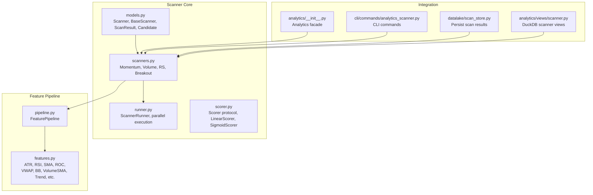
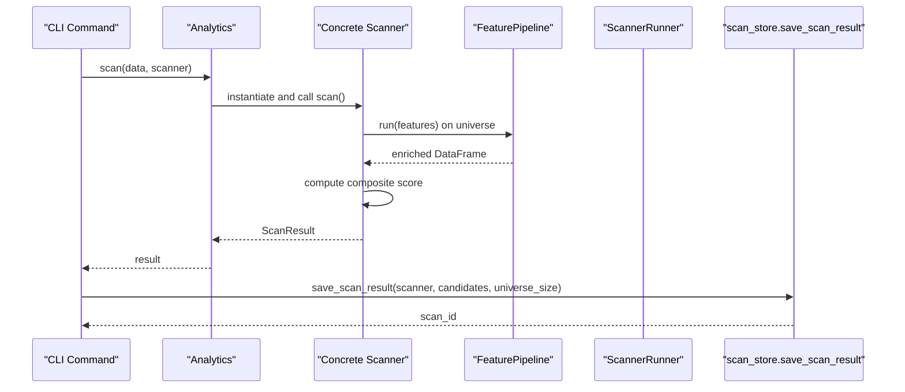
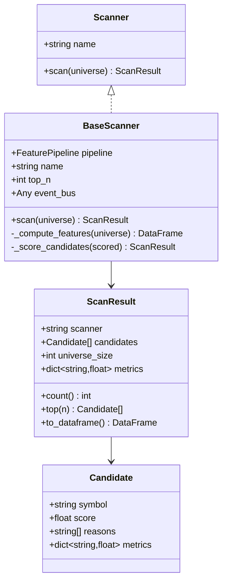
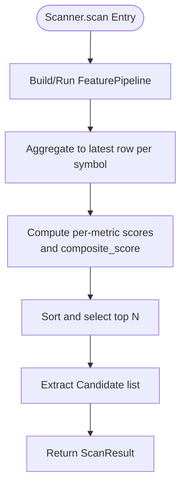
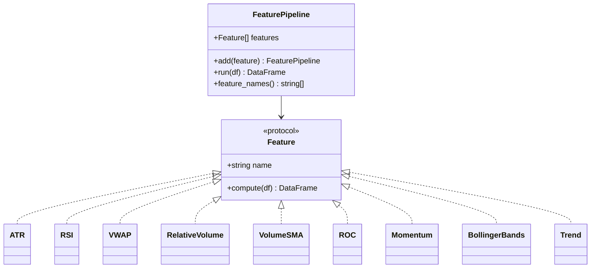
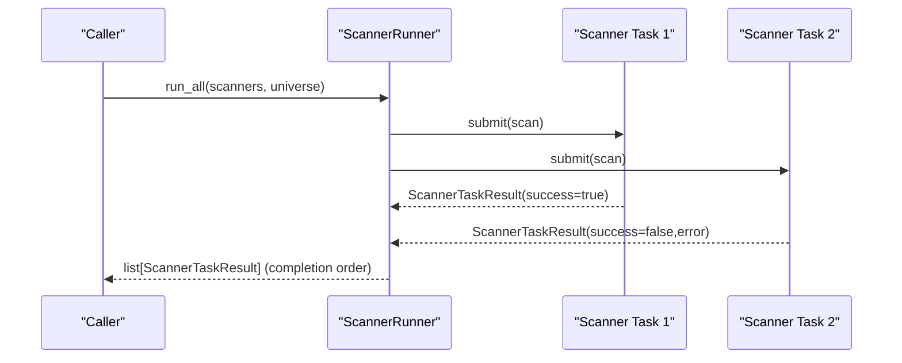
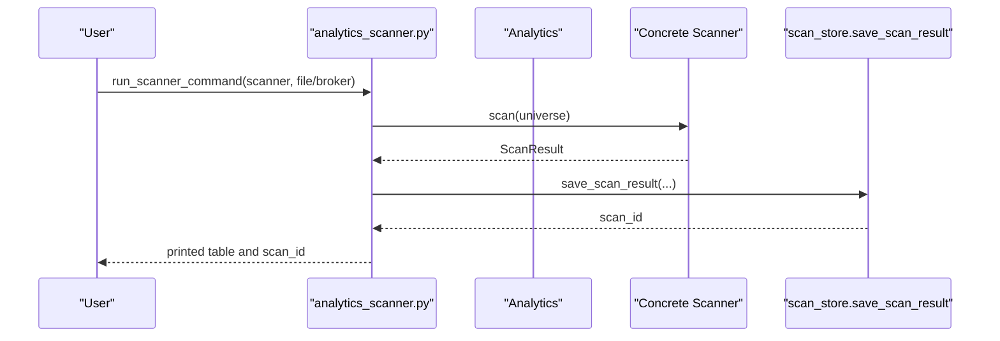
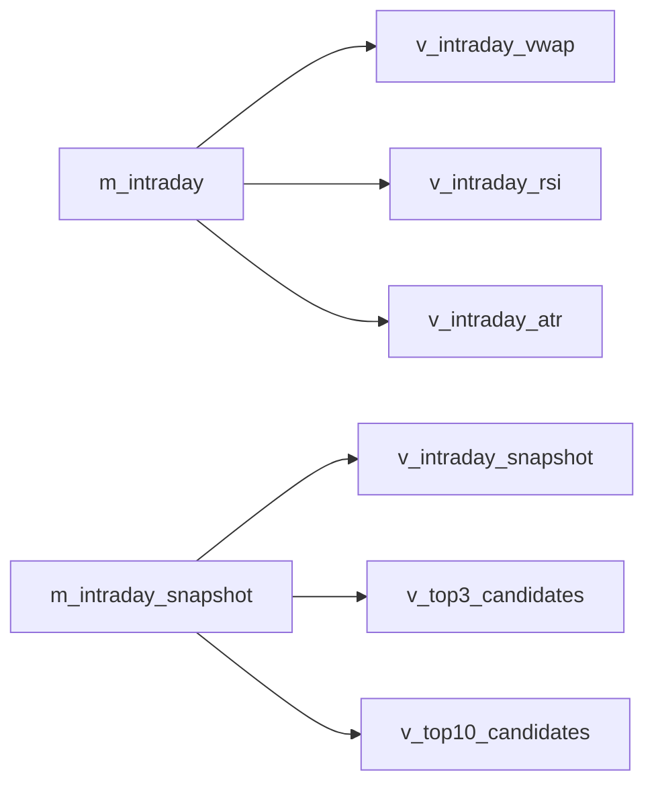
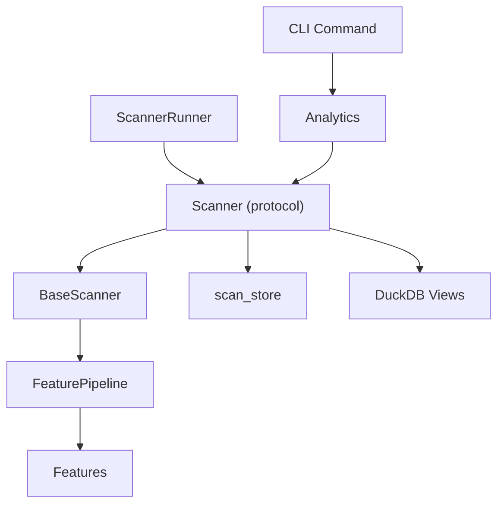

# Market Scanning and Screening

<cite>
**Referenced Files in This Document**
- [analytics/scanner/__init__.py](file://analytics/scanner/__init__.py)
- [analytics/scanner/models.py](file://analytics/scanner/models.py)
- [analytics/scanner/runner.py](file://analytics/scanner/runner.py)
- [analytics/scanner/scanners.py](file://analytics/scanner/scanners.py)
- [analytics/scanner/scorer.py](file://analytics/scanner/scorer.py)
- [analytics/pipeline/pipeline.py](file://analytics/pipeline/pipeline.py)
- [analytics/pipeline/features.py](file://analytics/pipeline/features.py)
- [analytics/views/scanner.py](file://analytics/views/scanner.py)
- [cli/commands/analytics_scanner.py](file://cli/commands/analytics_scanner.py)
- [config/scan-profiles.json](file://config/scan-profiles.json)
- [analytics/__init__.py](file://analytics/__init__.py)
- [datalake/scan_store.py](file://datalake/scan_store.py)
- [analytics/tests/test_scanner.py](file://analytics/tests/test_scanner.py)
- [analytics/tests/helpers.py](file://analytics/tests/helpers.py)
</cite>

## Table of Contents
1. [Introduction](#introduction)
2. [Project Structure](#project-structure)
3. [Core Components](#core-components)
4. [Architecture Overview](#architecture-overview)
5. [Detailed Component Analysis](#detailed-component-analysis)
6. [Dependency Analysis](#dependency-analysis)
7. [Performance Considerations](#performance-considerations)
8. [Troubleshooting Guide](#troubleshooting-guide)
9. [Conclusion](#conclusion)
10. [Appendices](#appendices)

## Introduction
This document describes the market scanning and screening system used to identify securities meeting specific technical and cross-sectional criteria. It covers the Scanner architecture, the ScannerRunner for efficient parallel execution, scoring algorithms, and the ScannerModels that define scan parameters and selection criteria. It also documents integration with market data, real-time views, and persistent storage of scan results, along with performance optimization strategies and guidance for extending the system with custom criteria.

## Project Structure
The scanner subsystem is organized around:
- Scanner models and runners
- Concrete scanners implementing distinct strategies
- A composable feature pipeline for technical indicators
- Scoring utilities for normalization
- CLI commands for interactive scanning
- DuckDB-backed persistence and views for real-time analytics

**Diagram sources**
- [analytics/scanner/models.py:107-238](file://analytics/scanner/models.py#L107-L238)
- [analytics/scanner/scanners.py:80-361](file://analytics/scanner/scanners.py#L80-L361)
- [analytics/scanner/runner.py:68-347](file://analytics/scanner/runner.py#L68-L347)
- [analytics/scanner/scorer.py:22-148](file://analytics/scanner/scorer.py#L22-L148)
- [analytics/pipeline/pipeline.py:27-88](file://analytics/pipeline/pipeline.py#L27-L88)
- [analytics/pipeline/features.py:18-452](file://analytics/pipeline/features.py#L18-L452)
- [analytics/__init__.py:40-193](file://analytics/__init__.py#L40-L193)
- [cli/commands/analytics_scanner.py:19-171](file://cli/commands/analytics_scanner.py#L19-L171)
- [datalake/scan_store.py:47-89](file://datalake/scan_store.py#L47-L89)
- [analytics/views/scanner.py:18-187](file://analytics/views/scanner.py#L18-L187)

**Section sources**
- [analytics/scanner/__init__.py:1-25](file://analytics/scanner/__init__.py#L1-L25)
- [analytics/scanner/models.py:1-238](file://analytics/scanner/models.py#L1-L238)
- [analytics/scanner/scanners.py:1-361](file://analytics/scanner/scanners.py#L1-L361)
- [analytics/scanner/runner.py:1-452](file://analytics/scanner/runner.py#L1-L452)
- [analytics/scanner/scorer.py:1-148](file://analytics/scanner/scorer.py#L1-L148)
- [analytics/pipeline/pipeline.py:1-88](file://analytics/pipeline/pipeline.py#L1-L88)
- [analytics/pipeline/features.py:1-452](file://analytics/pipeline/features.py#L1-L452)
- [analytics/views/scanner.py:1-187](file://analytics/views/scanner.py#L1-L187)
- [cli/commands/analytics_scanner.py:1-176](file://cli/commands/analytics_scanner.py#L1-L176)
- [analytics/__init__.py:1-325](file://analytics/__init__.py#L1-L325)
- [datalake/scan_store.py:1-229](file://datalake/scan_store.py#L1-L229)

## Core Components
- Scanner protocol and models: Defines the Scanner interface, BaseScanner with shared feature computation and candidate extraction, and ScanResult/Candidate data structures.
- Concrete scanners: Momentum, Volume, RS, and Breakout scanners, each with a dedicated FeaturePipeline and composite scoring logic.
- FeaturePipeline and features: Composable feature computation engine that enriches universes with technical indicators.
- Scoring utilities: Pluggable Scorer protocol enabling linear or sigmoid normalization to a 0–100 range.
- Runner: Parallel execution engine using ThreadPoolExecutor to run multiple scanners concurrently with error isolation and streaming results.
- CLI and Analytics facade: Command-line entry points and a unified API to run scanners and persist results.
- Persistence and views: DuckDB-backed storage of scan results and SQL views for real-time scanning.

**Section sources**
- [analytics/scanner/models.py:107-238](file://analytics/scanner/models.py#L107-L238)
- [analytics/scanner/scanners.py:80-361](file://analytics/scanner/scanners.py#L80-L361)
- [analytics/pipeline/pipeline.py:27-88](file://analytics/pipeline/pipeline.py#L27-L88)
- [analytics/pipeline/features.py:18-452](file://analytics/pipeline/features.py#L18-L452)
- [analytics/scanner/scorer.py:22-148](file://analytics/scanner/scorer.py#L22-L148)
- [analytics/scanner/runner.py:68-347](file://analytics/scanner/runner.py#L68-L347)
- [analytics/__init__.py:40-193](file://analytics/__init__.py#L40-L193)
- [cli/commands/analytics_scanner.py:19-171](file://cli/commands/analytics_scanner.py#L19-L171)
- [datalake/scan_store.py:47-89](file://datalake/scan_store.py#L47-L89)
- [analytics/views/scanner.py:18-187](file://analytics/views/scanner.py#L18-L187)

## Architecture Overview
The scanner architecture separates concerns across feature engineering, scoring, and execution orchestration, while integrating with market data and persistence.

**Diagram sources**
- [cli/commands/analytics_scanner.py:124-171](file://cli/commands/analytics_scanner.py#L124-L171)
- [analytics/__init__.py:178-193](file://analytics/__init__.py#L178-L193)
- [analytics/scanner/scanners.py:88-111](file://analytics/scanner/scanners.py#L88-L111)
- [analytics/pipeline/pipeline.py:50-70](file://analytics/pipeline/pipeline.py#L50-L70)
- [datalake/scan_store.py:47-89](file://datalake/scan_store.py#L47-L89)

## Detailed Component Analysis

### Scanner Models and Protocol
- Scanner protocol: A simple interface requiring a name and a scan method that takes a universe DataFrame and returns a ScanResult.
- BaseScanner: Provides shared logic for computing features via FeaturePipeline, normalizing inputs, extracting candidates, and publishing events. It supports optional EventBus integration for SCAN_STARTED, CANDIDATE_GENERATED, and SCAN_COMPLETED events.
- ScanResult and Candidate: Standardized containers for results, including top-N retrieval and conversion to DataFrame for reporting.

**Diagram sources**
- [analytics/scanner/models.py:107-238](file://analytics/scanner/models.py#L107-L238)

**Section sources**
- [analytics/scanner/models.py:107-238](file://analytics/scanner/models.py#L107-L238)

### Concrete Scanners and Scoring
- MomentumScanner: Builds a pipeline with RSI, ROC, trend alignment, relative volume, SMA, and computes a composite score weighted across these signals.
- VolumeScanner: Emphasizes relative volume, volume trend, ATR, and RSI to surface unusual volume activity.
- RSScanner: Focuses on relative strength versus benchmark using RSI, trend, ROC, momentum, and ATR.
- BreakoutScanner: Uses Bollinger Bands %B, relative volume, RSI, and VWAP proximity to detect breakout setups.
- Scoring: Each scanner’s _score method assigns normalized scores per metric and combines them into a composite_score. Scorers (LinearScorer, SigmoidScorer) provide configurable normalization strategies.

**Diagram sources**
- [analytics/scanner/scanners.py:88-111](file://analytics/scanner/scanners.py#L88-L111)
- [analytics/scanner/scanners.py:164-185](file://analytics/scanner/scanners.py#L164-L185)
- [analytics/scanner/scanners.py:233-254](file://analytics/scanner/scanners.py#L233-L254)
- [analytics/scanner/scanners.py:307-328](file://analytics/scanner/scanners.py#L307-L328)

**Section sources**
- [analytics/scanner/scanners.py:80-361](file://analytics/scanner/scanners.py#L80-L361)
- [analytics/scanner/scorer.py:22-148](file://analytics/scanner/scorer.py#L22-L148)

### Feature Pipeline and Indicators
- FeaturePipeline: Chains Feature instances and applies them sequentially to a DataFrame, logging warnings on feature failures.
- Features: Includes ATR, RSI, SMA, EMA, Bollinger Bands, MACD, VWAP, RelativeVolume, VolumeSMA, ROC, Momentum, SwingHighLow, PriceDistance, Gap, Trend, HistoricalVolatility, ATRPercent, ZScore, Correlation, Beta, PercentRank, and others.

**Diagram sources**
- [analytics/pipeline/pipeline.py:27-88](file://analytics/pipeline/pipeline.py#L27-L88)
- [analytics/pipeline/features.py:18-452](file://analytics/pipeline/features.py#L18-L452)

**Section sources**
- [analytics/pipeline/pipeline.py:27-88](file://analytics/pipeline/pipeline.py#L27-L88)
- [analytics/pipeline/features.py:37-452](file://analytics/pipeline/features.py#L37-L452)

### ScannerRunner and Parallel Execution
- ScannerRunner: Executes multiple scanners concurrently using ThreadPoolExecutor, returning results in completion order. It isolates errors per scanner, copies the universe for thread safety, and records execution times.
- Convenience functions: run_scanners_parallel and run_scanners_with_timing simplify batch execution and timing collection.

**Diagram sources**
- [analytics/scanner/runner.py:102-170](file://analytics/scanner/runner.py#L102-L170)
- [analytics/scanner/runner.py:273-347](file://analytics/scanner/runner.py#L273-L347)

**Section sources**
- [analytics/scanner/runner.py:68-347](file://analytics/scanner/runner.py#L68-L347)

### CLI, Analytics Facade, and Persistence
- Analytics facade: Exposes a scan method to run a named scanner on a DataFrame and returns ScanResult.
- CLI command: Supports running a specific scanner, loading data from file or broker, saving results to DuckDB, and printing top candidates.
- Persistence: scan_store saves ScanResult entries keyed by scan_id and symbol, with indexes for efficient queries and comparison utilities.

**Diagram sources**
- [cli/commands/analytics_scanner.py:82-171](file://cli/commands/analytics_scanner.py#L82-L171)
- [analytics/__init__.py:178-193](file://analytics/__init__.py#L178-L193)
- [datalake/scan_store.py:47-89](file://datalake/scan_store.py#L47-L89)

**Section sources**
- [cli/commands/analytics_scanner.py:19-171](file://cli/commands/analytics_scanner.py#L19-L171)
- [analytics/__init__.py:178-193](file://analytics/__init__.py#L178-L193)
- [datalake/scan_store.py:47-89](file://datalake/scan_store.py#L47-L89)

### Real-Time Views and Profiles
- DuckDB scanner views: Provide precomputed intraday analytics (VWAP, RSI, ATR) and top candidate snapshots for real-time monitoring.
- Scan profiles: JSON configuration defines universes, modes, option scanning parameters, and criteria for hybrid and institutional workflows.

**Diagram sources**
- [analytics/views/scanner.py:30-187](file://analytics/views/scanner.py#L30-L187)

**Section sources**
- [analytics/views/scanner.py:18-187](file://analytics/views/scanner.py#L18-L187)
- [config/scan-profiles.json:1-56](file://config/scan-profiles.json#L1-L56)

## Dependency Analysis
- Scanner depends on FeaturePipeline and Feature implementations to compute indicators.
- BaseScanner orchestrates feature computation, scoring, and candidate extraction.
- Runner coordinates parallel execution and isolates failures.
- CLI and Analytics facade integrate scanners with data sources and persistence.
- DuckDB views and scan_store provide real-time and historical access to scan results.

**Diagram sources**
- [analytics/scanner/models.py:107-238](file://analytics/scanner/models.py#L107-L238)
- [analytics/scanner/scanners.py:80-361](file://analytics/scanner/scanners.py#L80-L361)
- [analytics/scanner/runner.py:68-347](file://analytics/scanner/runner.py#L68-L347)
- [analytics/pipeline/pipeline.py:27-88](file://analytics/pipeline/pipeline.py#L27-L88)
- [analytics/pipeline/features.py:18-452](file://analytics/pipeline/features.py#L18-L452)
- [cli/commands/analytics_scanner.py:19-171](file://cli/commands/analytics_scanner.py#L19-L171)
- [analytics/__init__.py:178-193](file://analytics/__init__.py#L178-L193)
- [datalake/scan_store.py:47-89](file://datalake/scan_store.py#L47-L89)
- [analytics/views/scanner.py:18-187](file://analytics/views/scanner.py#L18-L187)

**Section sources**
- [analytics/scanner/models.py:107-238](file://analytics/scanner/models.py#L107-L238)
- [analytics/scanner/scanners.py:80-361](file://analytics/scanner/scanners.py#L80-L361)
- [analytics/scanner/runner.py:68-347](file://analytics/scanner/runner.py#L68-L347)
- [analytics/pipeline/pipeline.py:27-88](file://analytics/pipeline/pipeline.py#L27-L88)
- [analytics/pipeline/features.py:18-452](file://analytics/pipeline/features.py#L18-L452)
- [cli/commands/analytics_scanner.py:19-171](file://cli/commands/analytics_scanner.py#L19-L171)
- [analytics/__init__.py:178-193](file://analytics/__init__.py#L178-L193)
- [datalake/scan_store.py:47-89](file://datalake/scan_store.py#L47-L89)
- [analytics/views/scanner.py:18-187](file://analytics/views/scanner.py#L18-L187)

## Performance Considerations
- FeaturePipeline avoids caching to prevent look-ahead bias; callers should cache static datasets at the application layer when appropriate.
- BaseScanner optimizes DataFrame handling by mutating isolated results and avoiding unnecessary copies.
- Concrete scanners minimize copies by aggregating to latest timestamps after feature computation and sorting in place.
- ScannerRunner uses ThreadPoolExecutor with controlled concurrency and per-task timing; timeouts can bound total batch duration.
- DuckDB indexing on scan_results accelerates queries by scanner and timestamp.

Recommendations:
- Use top_n to cap result sets early.
- Prefer streaming results for dashboards to reduce latency-to-first-result.
- Tune max_workers to match CPU cores and I/O characteristics.
- Persist results with scan_store to enable comparisons across scans and reduce recomputation.

**Section sources**
- [analytics/pipeline/pipeline.py:31-38](file://analytics/pipeline/pipeline.py#L31-L38)
- [analytics/scanner/models.py:160-184](file://analytics/scanner/models.py#L160-L184)
- [analytics/scanner/scanners.py:96-110](file://analytics/scanner/scanners.py#L96-L110)
- [analytics/scanner/runner.py:98-97](file://analytics/scanner/runner.py#L98-L97)
- [datalake/scan_store.py:22-44](file://datalake/scan_store.py#L22-L44)

## Troubleshooting Guide
Common issues and resolutions:
- Missing required columns: Ensure OHLCV columns are present; BaseScanner adds defaults when missing.
- Empty universe: Scanners short-circuit and return empty results.
- Feature computation failures: FeaturePipeline logs warnings; verify required columns and feature compatibility.
- No candidates found: Adjust thresholds or criteria in scanners’ scoring logic.
- Persistence errors: scan_store requires DuckDB connectivity; confirm catalog path and permissions.

Operational tips:
- Use Analytics.scan without data to inspect available scanners.
- Leverage CLI run_scanner_command to validate data shapes and save results.
- Compare scans using scan_store.compare_scans to track drift.

**Section sources**
- [analytics/scanner/models.py:160-184](file://analytics/scanner/models.py#L160-L184)
- [analytics/pipeline/pipeline.py:64-69](file://analytics/pipeline/pipeline.py#L64-L69)
- [cli/commands/analytics_scanner.py:106-112](file://cli/commands/analytics_scanner.py#L106-L112)
- [datalake/scan_store.py:162-229](file://datalake/scan_store.py#L162-L229)

## Conclusion
The scanner system offers a modular, extensible framework for building and running market scans. By composing features, applying robust scoring, and executing in parallel, it supports both research and operational needs. Integration with DuckDB enables real-time views and persistent comparisons, while the CLI and Analytics facade streamline experimentation and adoption.

## Appendices

### Practical Examples

- Setting up a security screen with a concrete scanner:
  - Load OHLCV data (CSV or broker).
  - Instantiate a scanner (e.g., MomentumScanner).
  - Call scan(universe) to get ScanResult.
  - Save results via scan_store.save_scan_result for later retrieval and comparison.

- Configuring scan parameters:
  - Adjust top_n in BaseScanner subclasses to control candidate counts.
  - Modify composite score weights in scanner _score methods to emphasize specific signals.
  - Use FeaturePipeline.add(...) to include/exclude indicators.

- Interpreting scan results:
  - Inspect ScanResult.candidates for symbol, score, reasons, and metrics.
  - Use ScanResult.top(n) to retrieve top performers.
  - Convert to DataFrame via ScanResult.to_dataframe for reporting.

- Real-time updates and watchlists:
  - Use DuckDB views (v_intraday_* and v_topN_candidates) for live dashboards.
  - Periodically re-run scanners and compare results using scan_store.compare_scans.

- Creating custom scan criteria:
  - Define a new Feature subclass in features.py.
  - Add it to a scanner’s FeaturePipeline.
  - Implement a custom scoring method in the scanner and normalize scores to 0–100.

- Extending the scanner functionality:
  - Implement a new Scanner subclass with a custom scan method.
  - Integrate with Analytics._scanners to expose via CLI.
  - Add persistence and views for operational visibility.

**Section sources**
- [cli/commands/analytics_scanner.py:124-171](file://cli/commands/analytics_scanner.py#L124-L171)
- [analytics/scanner/scanners.py:80-361](file://analytics/scanner/scanners.py#L80-L361)
- [analytics/pipeline/features.py:18-452](file://analytics/pipeline/features.py#L18-L452)
- [analytics/views/scanner.py:18-187](file://analytics/views/scanner.py#L18-L187)
- [datalake/scan_store.py:47-89](file://datalake/scan_store.py#L47-L89)
- [analytics/tests/test_scanner.py:19-25](file://analytics/tests/test_scanner.py#L19-L25)
- [analytics/tests/helpers.py:8-18](file://analytics/tests/helpers.py#L8-L18)