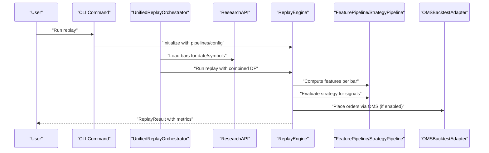
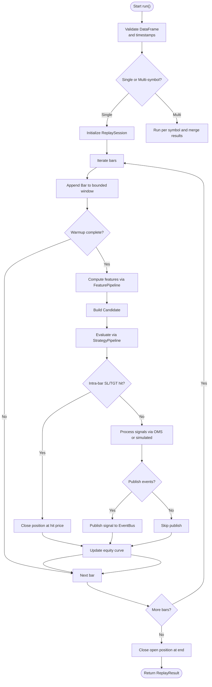
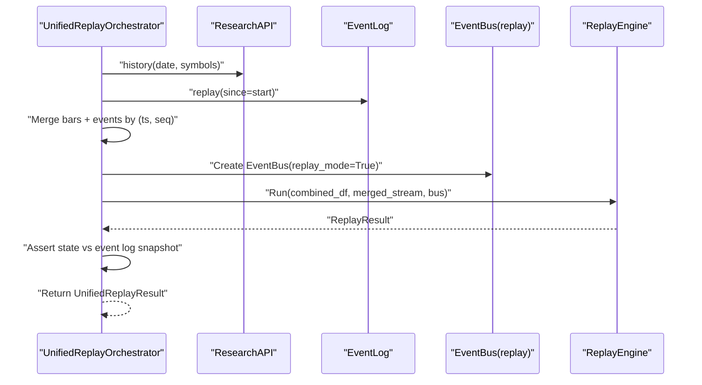
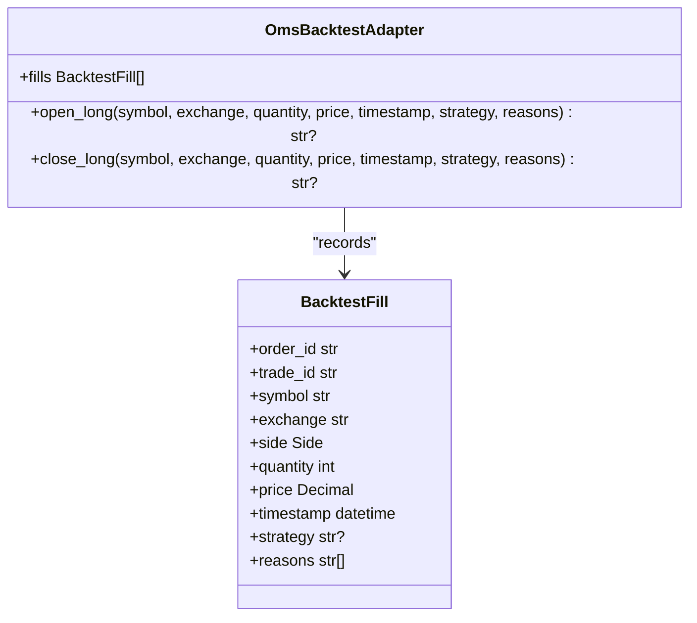
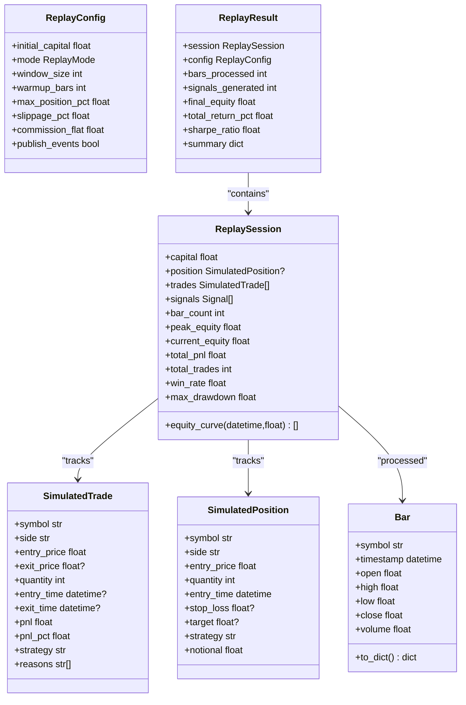
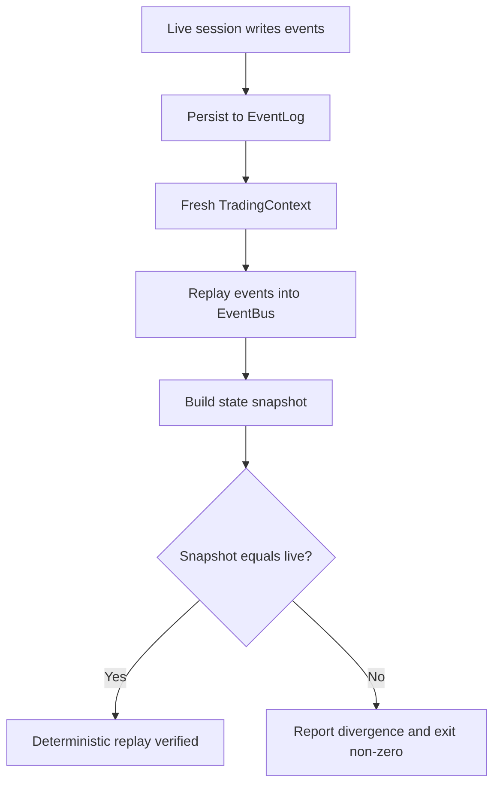
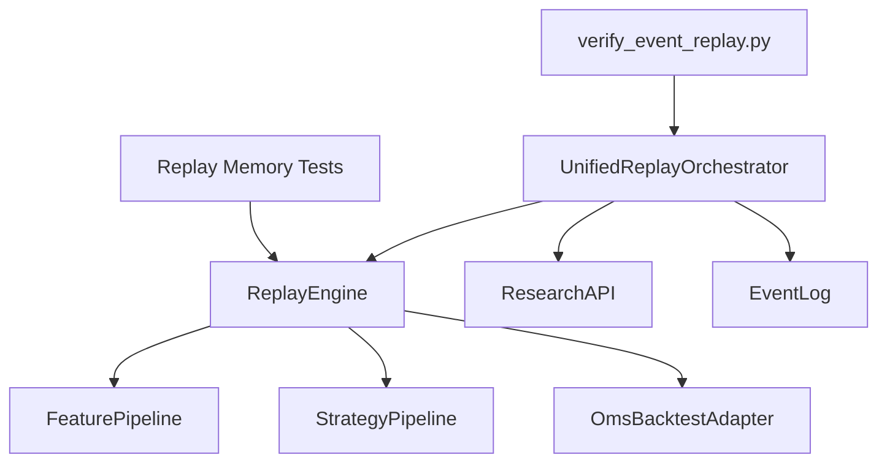

# Research and Replay Engines

<cite>
**Referenced Files in This Document**
- [engine.py](file://analytics/replay/engine.py)
- [orchestrator.py](file://analytics/replay/orchestrator.py)
- [models.py](file://analytics/replay/models.py)
- [oms_bridge.py](file://analytics/replay/oms_bridge.py)
- [research.py](file://datalake/research.py)
- [verify_event_replay.py](file://scripts/verify_event_replay.py)
- [test_replay_memory.py](file://analytics/replay/tests/test_replay_memory.py)
- [test_replay_orchestrator.py](file://tests/test_replay_orchestrator.py)
- [test_event_replay_determinism.py](file://tests/integration/test_event_replay_determinism.py)
- [analytics_replay.py](file://cli/commands/analytics_replay.py)
- [pipeline.py](file://analytics/pipeline/pipeline.py)
- [strategy_pipeline.py](file://analytics/strategy/pipeline.py)
</cite>

## Table of Contents
1. [Introduction](#introduction)
2. [Project Structure](#project-structure)
3. [Core Components](#core-components)
4. [Architecture Overview](#architecture-overview)
5. [Detailed Component Analysis](#detailed-component-analysis)
6. [Dependency Analysis](#dependency-analysis)
7. [Performance Considerations](#performance-considerations)
8. [Troubleshooting Guide](#troubleshooting-guide)
9. [Conclusion](#conclusion)
10. [Appendices](#appendices)

## Introduction
This document describes the Research and Replay Engines designed for deterministic testing and event replay. It explains how historical OHLCV data and persisted domain events are merged into a single time-ordered stream and replayed through the same FeaturePipeline → StrategyPipeline → OMS stack used in live trading. The ReplayEngine simulates trading sessions with exact event timing and sequence, while the UnifiedReplayOrchestrator coordinates deterministic replay workflows, session state, and data synchronization. The OMSBacktestAdapter connects replay sessions to the order management system to ensure backtest-live parity. ReplayModels define the structures for simulated trades, session state, and performance tracking. Practical examples demonstrate replaying historical events, debugging trading logic, and validating strategy performance under identical conditions. Deterministic replay capabilities ensure reproducibility across environments, and guidance is provided for performance optimization, memory management for long historical periods, and integration with backtesting workflows.

## Project Structure
The replay subsystem is organized around three primary modules:
- ReplayEngine: bar-by-bar replay of OHLCV data through FeaturePipeline and StrategyPipeline, optionally integrated with OMS.
- UnifiedReplayOrchestrator: merges historical bars and domain events into a deterministic stream and orchestrates replay execution.
- ReplayModels: dataclasses representing Bars, ReplayConfig, ReplaySession, ReplayResult, SimulatedTrade, and SimulatedPosition.

Supporting components:
- OMSBacktestAdapter: routes signals through the OMS for backtest-live parity.
- ResearchAPI: loads historical OHLCV data from the datalake for replay.
- Scripts and tests: verify event replay determinism and validate replay performance/memory characteristics.

```mermaid
graph TB
subgraph "Analytics"
RP["ReplayEngine<br/>engine.py"]
RO["UnifiedReplayOrchestrator<br/>orchestrator.py"]
RM["ReplayModels<br/>models.py"]
OMSA["OmsBacktestAdapter<br/>oms_bridge.py"]
end
subgraph "Data Access"
RA["ResearchAPI<br/>research.py"]
end
subgraph "Verification"
VER["verify_event_replay.py"]
end
subgraph "CLI"
CLI["analytics_replay.py"]
end
subgraph "Pipelines"
FP["FeaturePipeline<br/>pipeline.py"]
SP["StrategyPipeline<br/>strategy_pipeline.py"]
end
RO --> RA
RO --> FP
RO --> SP
RP --> FP
RP --> SP
RP --> OMSA
RO --> RP
CLI --> RP
VER --> RO
```

**Diagram sources**
- [engine.py:84-584](file://analytics/replay/engine.py#L84-L584)
- [orchestrator.py:116-484](file://analytics/replay/orchestrator.py#L116-L484)
- [models.py:41-286](file://analytics/replay/models.py#L41-L286)
- [oms_bridge.py:48-178](file://analytics/replay/oms_bridge.py#L48-L178)
- [research.py:18-142](file://datalake/research.py#L18-L142)
- [verify_event_replay.py:155-228](file://scripts/verify_event_replay.py#L155-L228)
- [analytics_replay.py:14-122](file://cli/commands/analytics_replay.py#L14-L122)
- [pipeline.py:27-88](file://analytics/pipeline/pipeline.py#L27-L88)
- [strategy_pipeline.py:195-296](file://analytics/strategy/pipeline.py#L195-L296)

**Section sources**
- [engine.py:1-584](file://analytics/replay/engine.py#L1-L584)
- [orchestrator.py:1-484](file://analytics/replay/orchestrator.py#L1-L484)
- [models.py:1-286](file://analytics/replay/models.py#L1-L286)
- [oms_bridge.py:1-178](file://analytics/replay/oms_bridge.py#L1-L178)
- [research.py:1-142](file://datalake/research.py#L1-L142)
- [verify_event_replay.py:1-228](file://scripts/verify_event_replay.py#L1-L228)
- [analytics_replay.py:1-122](file://cli/commands/analytics_replay.py#L1-L122)
- [pipeline.py:1-88](file://analytics/pipeline/pipeline.py#L1-L88)
- [strategy_pipeline.py:1-296](file://analytics/strategy/pipeline.py#L1-L296)

## Core Components
- ReplayEngine: Processes OHLCV data bar-by-bar, computes features, evaluates strategies, routes signals through OMS when available, and tracks session state and performance metrics.
- UnifiedReplayOrchestrator: Loads bars from the datalake and events from the event log, merges them into a deterministic stream, runs replay through the engine, and asserts final state against recorded state.
- OmsBacktestAdapter: Provides backtest-live parity by routing order placement and fills through the OMS, applying slippage and commission.
- ReplayModels: Defines Bar, ReplayConfig, ReplaySession, ReplayResult, SimulatedTrade, and SimulatedPosition for replay state and reporting.

**Section sources**
- [engine.py:84-584](file://analytics/replay/engine.py#L84-L584)
- [orchestrator.py:116-484](file://analytics/replay/orchestrator.py#L116-L484)
- [oms_bridge.py:48-178](file://analytics/replay/oms_bridge.py#L48-L178)
- [models.py:41-286](file://analytics/replay/models.py#L41-L286)

## Architecture Overview
The ReplayEngine and UnifiedReplayOrchestrator share the same FeaturePipeline and StrategyPipeline used in live trading, ensuring parity. The orchestrator merges OHLCV bars and domain events into a single time-ordered stream, enabling deterministic replay. The OMSBacktestAdapter ensures that order execution follows the same risk gates, idempotency ledger, and event publishing as live trading.



**Diagram sources**
- [analytics_replay.py:14-122](file://cli/commands/analytics_replay.py#L14-L122)
- [orchestrator.py:158-247](file://analytics/replay/orchestrator.py#L158-L247)
- [research.py:25-73](file://datalake/research.py#L25-L73)
- [engine.py:152-284](file://analytics/replay/engine.py#L152-L284)
- [pipeline.py:50-70](file://analytics/pipeline/pipeline.py#L50-L70)
- [strategy_pipeline.py:195-296](file://analytics/strategy/pipeline.py#L195-L296)
- [oms_bridge.py:68-178](file://analytics/replay/oms_bridge.py#L68-L178)

## Detailed Component Analysis

### ReplayEngine
The ReplayEngine processes OHLCV data bar-by-bar, computes features, evaluates strategies, and routes signals through OMS when available. It supports warmup phases, intra-bar stop-loss/target checks, and optional event publishing. Memory usage is optimized using a bounded deque for the sliding window.

Key behaviors:
- Validates and normalizes timestamps, sorts data, and supports single or multi-symbol replay.
- Uses a bounded deque for the feature computation window to ensure O(window_size) memory.
- Applies intra-bar stop-loss/target checks before signal processing.
- Routes signals through OMSBacktestAdapter for backtest-live parity or uses simulated fills otherwise.
- Updates equity curves and maintains session state.



**Diagram sources**
- [engine.py:152-284](file://analytics/replay/engine.py#L152-L284)
- [engine.py:332-555](file://analytics/replay/engine.py#L332-L555)
- [pipeline.py:50-70](file://analytics/pipeline/pipeline.py#L50-L70)
- [strategy_pipeline.py:195-296](file://analytics/strategy/pipeline.py#L195-L296)

**Section sources**
- [engine.py:84-584](file://analytics/replay/engine.py#L84-L584)
- [pipeline.py:27-88](file://analytics/pipeline/pipeline.py#L27-L88)
- [strategy_pipeline.py:195-296](file://analytics/strategy/pipeline.py#L195-L296)

### UnifiedReplayOrchestrator
The orchestrator merges OHLCV bars and domain events into a deterministic stream using timestamp and sequence ordering. It builds a combined DataFrame, creates an EventBus in replay mode, and runs the ReplayEngine. It also performs state assertions against recorded state from the event log.

Key behaviors:
- Loads bars from ResearchAPI and events from EventLog.
- Merges streams deterministically and builds a combined DataFrame.
- Creates an EventBus in replay mode to disable auto-persistence and enforce deterministic timestamps.
- Executes replay through ReplayEngine and optionally asserts final state.



**Diagram sources**
- [orchestrator.py:158-247](file://analytics/replay/orchestrator.py#L158-L247)
- [orchestrator.py:251-362](file://analytics/replay/orchestrator.py#L251-L362)
- [research.py:25-73](file://datalake/research.py#L25-L73)
- [engine.py:396-422](file://analytics/replay/engine.py#L396-L422)

**Section sources**
- [orchestrator.py:116-484](file://analytics/replay/orchestrator.py#L116-L484)
- [research.py:18-142](file://datalake/research.py#L18-L142)

### OMSBacktestAdapter
The OMSBacktestAdapter routes order placement and fills through the OMS to achieve backtest-live parity. It applies slippage and records simulated trades, maintaining a list of BacktestFill entries.

Key behaviors:
- Accepts signals and places orders via the OMS execution adapter.
- Applies slippage to fill prices and records trades.
- Maintains a list of recorded fills for audit/tracing.



**Diagram sources**
- [oms_bridge.py:48-178](file://analytics/replay/oms_bridge.py#L48-L178)

**Section sources**
- [oms_bridge.py:48-178](file://analytics/replay/oms_bridge.py#L48-L178)

### ReplayModels
ReplayModels define the data structures used throughout replay:
- Bar: minimal OHLCV bar representation.
- ReplayConfig: replay configuration including initial capital, window size, warmup bars, slippage, commission, and event publishing.
- SimulatedTrade and SimulatedPosition: simulated execution artifacts and open positions.
- ReplaySession: tracks session state including capital, position, trades, signals, equity curve, and performance metrics.
- ReplayResult: final output including session, config, counts, and summary metrics.



**Diagram sources**
- [models.py:41-286](file://analytics/replay/models.py#L41-L286)

**Section sources**
- [models.py:41-286](file://analytics/replay/models.py#L41-L286)

### Deterministic Replay and Event Replay Verification
Deterministic replay guarantees include:
- Single time source with timezone-aware timestamps and sequence numbers for total ordering.
- No side effects in replay mode: EventBus disables auto-persistence and uses original timestamps.
- Idempotent pipelines: pure functions with caching disabled during replay.
- State assertion: final portfolio state compared against a snapshot derived from the event log.

The verification script compares the OMS state built by a live session against the state rebuilt by replaying the event log into a fresh OMS, raising non-zero exit on drift.



**Diagram sources**
- [verify_event_replay.py:155-228](file://scripts/verify_event_replay.py#L155-L228)
- [test_event_replay_determinism.py:86-330](file://tests/integration/test_event_replay_determinism.py#L86-L330)

**Section sources**
- [verify_event_replay.py:1-228](file://scripts/verify_event_replay.py#L1-L228)
- [test_event_replay_determinism.py:1-330](file://tests/integration/test_event_replay_determinism.py#L1-L330)

## Dependency Analysis
The ReplayEngine depends on FeaturePipeline and StrategyPipeline for feature computation and signal generation. When a TradingContext is provided, it integrates with OMSBacktestAdapter for parity. The UnifiedReplayOrchestrator depends on ResearchAPI for OHLCV data and EventLog for domain events, then invokes ReplayEngine. Tests and scripts validate correctness, determinism, and performance.



**Diagram sources**
- [engine.py:116-151](file://analytics/replay/engine.py#L116-L151)
- [orchestrator.py:396-422](file://analytics/replay/orchestrator.py#L396-L422)
- [research.py:25-73](file://datalake/research.py#L25-L73)
- [test_replay_memory.py:127-392](file://analytics/replay/tests/test_replay_memory.py#L127-L392)
- [verify_event_replay.py:155-228](file://scripts/verify_event_replay.py#L155-L228)

**Section sources**
- [engine.py:116-151](file://analytics/replay/engine.py#L116-L151)
- [orchestrator.py:396-422](file://analytics/replay/orchestrator.py#L396-L422)
- [test_replay_memory.py:1-392](file://analytics/replay/tests/test_replay_memory.py#L1-L392)
- [verify_event_replay.py:1-228](file://scripts/verify_event_replay.py#L1-L228)

## Performance Considerations
- Bounded memory window: ReplayEngine uses a deque with maxlen to keep O(window_size) memory regardless of dataset size.
- Window optimization: Lazy loading and bounded access prevent unbounded accumulation of bars.
- Deterministic ordering: Composite sort key (timestamp, sequence) ensures stable ordering even with timestamp collisions.
- Execution time: Benchmarks confirm linear scaling with number of bars and acceptable performance for large datasets.
- Multi-symbol replay: Memory remains bounded per symbol and scales with number of symbols.

Practical tips:
- Set window_size to the minimum required by your indicators (e.g., RSI period) to optimize memory.
- Use warmup_bars to skip initial bars for stable indicator initialization.
- Enable publish_events only when needed to reduce event bus overhead.
- For very long histories, consider chunking or streaming data to maintain bounded memory.

**Section sources**
- [engine.py:198-200](file://analytics/replay/engine.py#L198-L200)
- [test_replay_memory.py:181-392](file://analytics/replay/tests/test_replay_memory.py#L181-L392)
- [orchestrator.py:339-344](file://analytics/replay/orchestrator.py#L339-L344)

## Troubleshooting Guide
Common issues and resolutions:
- Missing timestamp column: ReplayEngine requires either "timestamp" or "date"; otherwise, it raises a ValueError.
- Empty DataFrame: ReplayEngine returns an empty ReplayResult without errors.
- Missing trading_context: Without a TradingContext, ReplayEngine uses simulated fills; enable STRICT_EXECUTION_PARITY to enforce OMS parity.
- Event publishing failures: Publishing errors are swallowed to avoid aborting replay; verify EventBus configuration if signals are not observed.
- State mismatches: Use the verification script to compare live vs replayed state snapshots and identify drift.

Validation and verification:
- Replay memory tests ensure bounded memory usage and identical results across runs.
- Orchestrator tests validate deterministic ordering, empty data handling, and state assertion logic.
- Event replay determinism tests verify that replay reconstructs the same OMS state deterministically.

**Section sources**
- [engine.py:167-183](file://analytics/replay/engine.py#L167-L183)
- [engine.py:352-359](file://analytics/replay/engine.py#L352-L359)
- [engine.py:557-584](file://analytics/replay/engine.py#L557-L584)
- [test_replay_memory.py:127-180](file://analytics/replay/tests/test_replay_memory.py#L127-L180)
- [test_replay_orchestrator.py:287-470](file://tests/test_replay_orchestrator.py#L287-L470)
- [test_event_replay_determinism.py:265-330](file://tests/integration/test_event_replay_determinism.py#L265-L330)

## Conclusion
The Research and Replay Engines provide a robust framework for deterministic testing and event replay. By merging OHLCV bars and domain events into a single time-ordered stream and replaying through the same pipelines and OMS used in live trading, the system ensures parity and reproducibility. ReplayEngine’s bounded memory window and intra-bar checks improve fidelity and performance. UnifiedReplayOrchestrator coordinates data loading, stream merging, and state assertion. OmsBacktestAdapter delivers backtest-live parity for order execution. ReplayModels encapsulate session state and performance metrics. Together, these components support research, debugging, and performance analysis with confidence in reproducibility and accuracy.

## Appendices

### Practical Examples

- Replay historical OHLCV data:
  - Prepare a DataFrame with timestamp/close columns.
  - Build FeaturePipeline and StrategyPipeline.
  - Configure ReplayConfig (warmup_bars, slippage_pct, commission_flat).
  - Instantiate ReplayEngine and call run(data, symbol).
  - Inspect ReplayResult.summary for metrics and session.trades for execution details.

- Debugging trading logic:
  - Use ReplayEngine with a small, known dataset to reproduce scenarios.
  - Enable publish_events and inspect EventBus for signal generation.
  - Compare simulated vs OMS parity by providing a TradingContext.

- Validate strategy performance under identical conditions:
  - Run ReplayEngine multiple times with the same data and config.
  - Confirm identical signals, trades, and metrics across runs.
  - Use ReplayResult.summary to compare Sharpe ratio, max drawdown, and win rate.

- Deterministic event replay:
  - Use UnifiedReplayOrchestrator to load bars and events for a specific date.
  - Merge and replay through ReplayEngine.
  - Assert final state against event log-derived snapshot.

- Integration with backtesting workflows:
  - Combine ReplayEngine with StrategyPipeline and FeaturePipeline.
  - Use ResearchAPI to load historical data for extended periods.
  - Apply OMSBacktestAdapter for realistic order execution and risk controls.

**Section sources**
- [analytics_replay.py:14-122](file://cli/commands/analytics_replay.py#L14-L122)
- [engine.py:152-284](file://analytics/replay/engine.py#L152-L284)
- [orchestrator.py:158-247](file://analytics/replay/orchestrator.py#L158-L247)
- [research.py:25-73](file://datalake/research.py#L25-L73)
- [verify_event_replay.py:155-228](file://scripts/verify_event_replay.py#L155-L228)