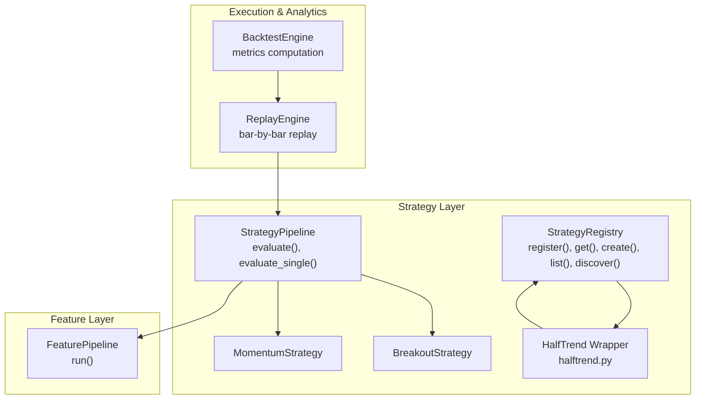
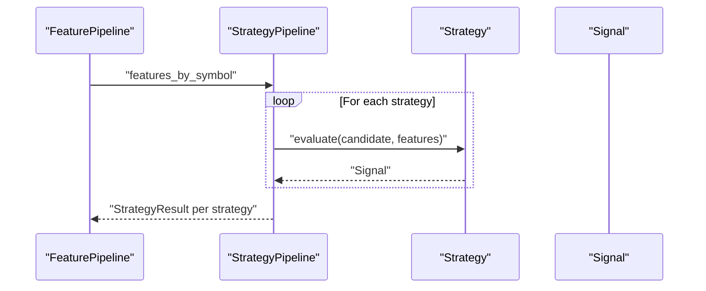
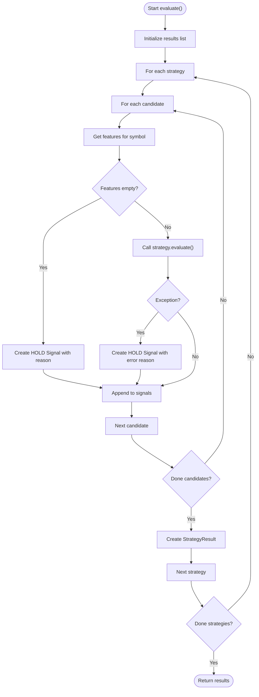
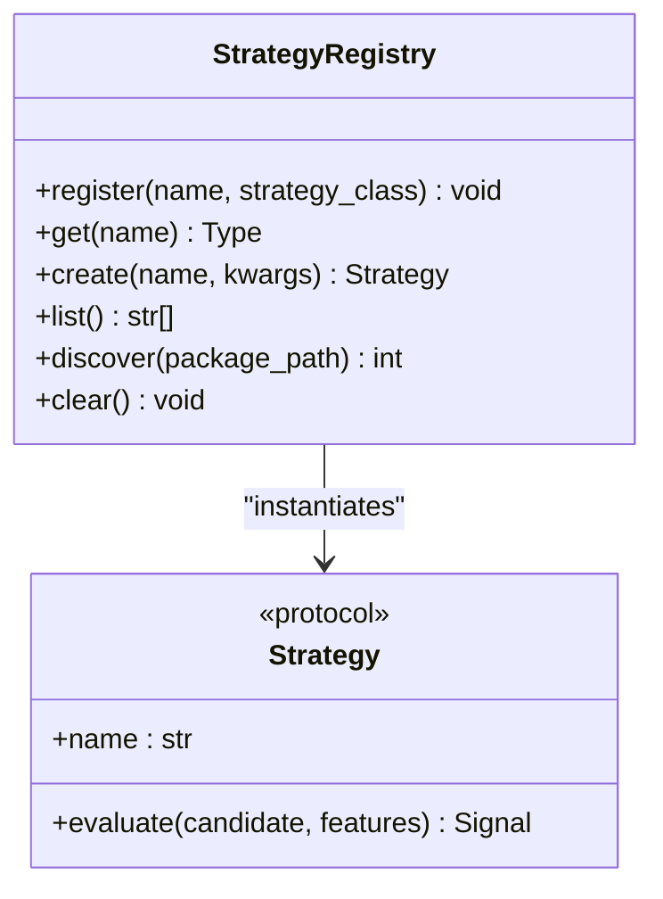
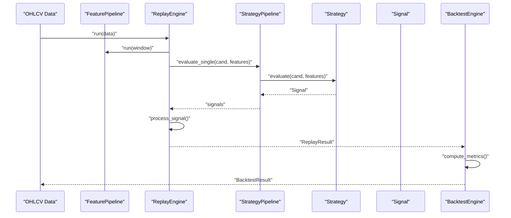
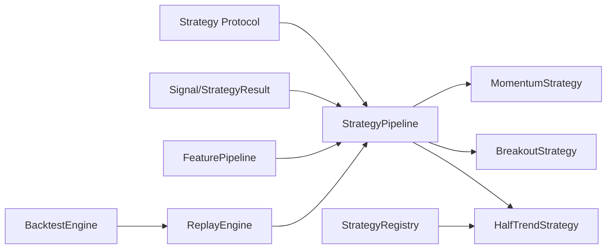

# Strategy Development and Pipelines

<cite>
**Referenced Files in This Document**
- [__init__.py](file://analytics/strategy/__init__.py)
- [models.py](file://analytics/strategy/models.py)
- [pipeline.py](file://analytics/strategy/pipeline.py)
- [protocols.py](file://analytics/strategy/protocols.py)
- [registry.py](file://analytics/strategy/registry.py)
- [halftrend.py](file://analytics/strategy/builtins/halftrend.py)
- [halftrend_backtest.py](file://analytics/indicators/halftrend_backtest.py)
- [pipeline.py](file://analytics/pipeline/pipeline.py)
- [engine.py](file://analytics/backtest/engine.py)
- [engine.py](file://analytics/replay/engine.py)
- [test_strategy.py](file://analytics/tests/test_strategy.py)
</cite>

## Table of Contents
1. [Introduction](#introduction)
2. [Project Structure](#project-structure)
3. [Core Components](#core-components)
4. [Architecture Overview](#architecture-overview)
5. [Detailed Component Analysis](#detailed-component-analysis)
6. [Dependency Analysis](#dependency-analysis)
7. [Performance Considerations](#performance-considerations)
8. [Troubleshooting Guide](#troubleshooting-guide)
9. [Conclusion](#conclusion)
10. [Appendices](#appendices)

## Introduction
This document explains the Strategy Development and Pipelines subsystem used to build, compose, and execute trading strategies in a modular way. It covers:
- StrategyPipeline architecture for composing strategies and generating rich signals
- Built-in strategies (MomentumStrategy, BreakoutStrategy) and the HalfTrend strategy integration
- Strategy registry for dynamic discovery and instantiation
- Strategy execution flow from feature pipelines to backtesting and replay engines
- Position sizing and risk management coordination
- Practical examples for creating custom strategies, combining strategies, and tuning parameters
- Relationship to the broader analytics ecosystem (feature pipelines, backtesting, and replay)

## Project Structure
The strategy subsystem resides under analytics/strategy and integrates with analytics/pipeline (feature pipelines), analytics/backtest (backtesting), and analytics/replay (historical replay). The HalfTrend strategy is provided as a built-in wrapper that registers the indicator-based strategy into the registry.

**Diagram sources**
- [pipeline.py:195-296](file://analytics/strategy/pipeline.py#L195-L296)
- [registry.py:31-140](file://analytics/strategy/registry.py#L31-L140)
- [halftrend.py:10-15](file://analytics/strategy/builtins/halftrend.py#L10-L15)
- [pipeline.py:27-88](file://analytics/pipeline/pipeline.py#L27-L88)
- [engine.py:84-584](file://analytics/replay/engine.py#L84-L584)
- [engine.py:46-319](file://analytics/backtest/engine.py#L46-L319)

**Section sources**
- [__init__.py:1-22](file://analytics/strategy/__init__.py#L1-L22)
- [pipeline.py:1-296](file://analytics/strategy/pipeline.py#L1-L296)
- [registry.py:1-140](file://analytics/strategy/registry.py#L1-L140)
- [halftrend.py:1-15](file://analytics/strategy/builtins/halftrend.py#L1-L15)
- [pipeline.py:1-88](file://analytics/pipeline/pipeline.py#L1-L88)
- [engine.py:1-584](file://analytics/replay/engine.py#L1-L584)
- [engine.py:1-319](file://analytics/backtest/engine.py#L1-L319)

## Core Components
- Signal: Rich output of a strategy with direction, confidence, entry/stop/target, position sizing, reasons, and metadata.
- StrategyResult: Aggregated results for a strategy across candidates.
- Strategy protocol: Duck-typed interface that all strategies must implement.
- StrategyPipeline: Orchestrates strategy evaluation over candidates and aggregates results.
- StrategyRegistry: Central registry for dynamic discovery and instantiation of strategies.
- Built-in strategies: MomentumStrategy and BreakoutStrategy; HalfTrend via wrapper.

Key responsibilities:
- Signal captures both trade intent and risk parameters for downstream execution.
- StrategyPipeline evaluates each strategy on each candidate and collects signals.
- StrategyRegistry enables plugin-style strategy discovery and creation.
- Built-in strategies demonstrate parameterizable logic and risk-aware suggestions.

**Section sources**
- [models.py:32-206](file://analytics/strategy/models.py#L32-L206)
- [protocols.py:28-60](file://analytics/strategy/protocols.py#L28-L60)
- [pipeline.py:195-296](file://analytics/strategy/pipeline.py#L195-L296)
- [registry.py:31-140](file://analytics/strategy/registry.py#L31-L140)

## Architecture Overview
The strategy pipeline sits between feature pipelines and execution/analytics layers. It consumes feature-enriched DataFrames and emits signals that are processed by replay/backtesting engines.

**Diagram sources**
- [pipeline.py:208-267](file://analytics/strategy/pipeline.py#L208-L267)
- [pipeline.py:50-70](file://analytics/pipeline/pipeline.py#L50-L70)

## Detailed Component Analysis

### StrategyPipeline
- Evaluates a list of strategies on a set of candidates.
- For each candidate, fetches the corresponding feature DataFrame and calls strategy.evaluate.
- Handles missing features and exceptions by emitting HOLD signals with reasons.
- Supports single-candidate evaluation for live/backtest scenarios.

**Diagram sources**
- [pipeline.py:208-267](file://analytics/strategy/pipeline.py#L208-L267)

**Section sources**
- [pipeline.py:195-296](file://analytics/strategy/pipeline.py#L195-L296)

### Built-in Strategies

#### MomentumStrategy
- Uses RSI and ROC thresholds to decide BUY/SELL/HOLD.
- Computes suggested entry/stop/target using ATR when available.
- Provides both strong and weakened signals with confidence derived from thresholds.

Implementation highlights:
- Parameterized thresholds for oversold/overbought and ROC.
- Confidence scaling based on distance from thresholds.
- Optional ATR-derived entry/SL/TP.

**Section sources**
- [pipeline.py:37-138](file://analytics/strategy/pipeline.py#L37-L138)

#### BreakoutStrategy
- Decides BUY/SELL/HOLD based on price action relative to swing highs/lows or SMA.
- Requires volume confirmation to reduce false signals.
- Confidence derived from volume strength relative to averages.

**Section sources**
- [pipeline.py:140-187](file://analytics/strategy/pipeline.py#L140-L187)

#### HalfTrend Strategy Integration
- The HalfTrend indicator is wrapped as a strategy and registered under the canonical name "halftrend".
- The wrapper strategy computes HalfTrend signals and returns rich signals with entry/SL/TP and metadata.

Integration flow:
- Indicator-based strategy computes signals on feature DataFrame.
- Registry registration allows dynamic discovery and instantiation.

**Section sources**
- [halftrend_backtest.py:34-86](file://analytics/indicators/halftrend_backtest.py#L34-L86)
- [halftrend.py:10-15](file://analytics/strategy/builtins/halftrend.py#L10-L15)

### Strategy Registry
- Centralized registry supporting manual registration and importlib-based discovery.
- Provides factory-style creation by name with optional constructor arguments.
- Enables plugin-like extensibility without modifying core code.

**Diagram sources**
- [registry.py:31-140](file://analytics/strategy/registry.py#L31-L140)
- [protocols.py:28-60](file://analytics/strategy/protocols.py#L28-L60)

**Section sources**
- [registry.py:31-140](file://analytics/strategy/registry.py#L31-L140)

### Strategy Protocol
- Defines the minimal interface that all strategies must implement.
- Ensures separation of concerns: strategies produce signals; execution manages orders.

**Section sources**
- [protocols.py:28-60](file://analytics/strategy/protocols.py#L28-L60)

### Signal and StrategyResult
- Signal encapsulates trade intent, confidence, risk parameters, and metadata.
- StrategyResult aggregates signals and provides convenience accessors (top-N, buys/sells, by_symbol).

Validation and properties:
- Enforces confidence and position size bounds.
- Provides computed risk-reward ratio and actionable flags.

**Section sources**
- [models.py:32-206](file://analytics/strategy/models.py#L32-L206)

### Execution Flow: Replay and Backtest Integration
- ReplayEngine runs feature pipelines and strategy pipelines bar-by-bar, mirroring live behavior.
- Signals are processed through OMS parity (when available) or legacy simulated fills.
- BacktestEngine wraps ReplayEngine and computes comprehensive performance metrics.

**Diagram sources**
- [engine.py:152-284](file://analytics/replay/engine.py#L152-L284)
- [engine.py:83-116](file://analytics/backtest/engine.py#L83-L116)

**Section sources**
- [engine.py:84-584](file://analytics/replay/engine.py#L84-L584)
- [engine.py:46-319](file://analytics/backtest/engine.py#L46-L319)

## Dependency Analysis
- StrategyPipeline depends on Strategy protocol and Signal models.
- Built-in strategies depend on feature columns (RSI, ROC, ATR, swing highs/lows, SMA, volumes).
- StrategyRegistry depends on Strategy protocol and importlib for discovery.
- ReplayEngine and BacktestEngine depend on StrategyPipeline and FeaturePipeline.
- HalfTrend wrapper depends on HalfTrend indicator and registry.

**Diagram sources**
- [protocols.py:28-60](file://analytics/strategy/protocols.py#L28-L60)
- [pipeline.py:195-296](file://analytics/strategy/pipeline.py#L195-L296)
- [registry.py:31-140](file://analytics/strategy/registry.py#L31-L140)
- [pipeline.py:27-88](file://analytics/pipeline/pipeline.py#L27-L88)
- [engine.py:84-584](file://analytics/replay/engine.py#L84-L584)
- [engine.py:46-319](file://analytics/backtest/engine.py#L46-L319)

**Section sources**
- [pipeline.py:1-296](file://analytics/strategy/pipeline.py#L1-L296)
- [registry.py:1-140](file://analytics/strategy/registry.py#L1-L140)
- [pipeline.py:1-88](file://analytics/pipeline/pipeline.py#L1-L88)
- [engine.py:1-584](file://analytics/replay/engine.py#L1-L584)
- [engine.py:1-319](file://analytics/backtest/engine.py#L1-L319)

## Performance Considerations
- FeaturePipeline intentionally avoids caching to prevent look-ahead bias in backtesting; callers should cache at higher layers with time-bound awareness.
- ReplayEngine uses bounded deques for sliding windows to maintain O(window_size) memory.
- StrategyPipeline logs warnings on per-strategy failures to avoid halting evaluation.
- BacktestEngine computes metrics from replay sessions; ensure sufficient warmup bars and appropriate annualization factors.

[No sources needed since this section provides general guidance]

## Troubleshooting Guide
Common issues and resolutions:
- Missing features for a symbol: StrategyPipeline skips silently and logs; ensure FeaturePipeline includes required columns.
- Exceptions during strategy evaluation: StrategyPipeline catches and emits HOLD signals with error reasons.
- No data frames passed: Strategies return HOLD with explicit reasons.
- Registry lookups: StrategyRegistry.get raises KeyError if name not found; use StrategyRegistry.list to inspect available strategies.

Validation and tests:
- Signal validation enforces confidence and position size bounds.
- StrategyResult provides filtering helpers (actionable, buys, sells).
- Tests cover default strategies, empty features, and protocol compliance.

**Section sources**
- [pipeline.py:234-255](file://analytics/strategy/pipeline.py#L234-L255)
- [models.py:122-127](file://analytics/strategy/models.py#L122-L127)
- [test_strategy.py:177-186](file://analytics/tests/test_strategy.py#L177-L186)
- [test_strategy.py:235-275](file://analytics/tests/test_strategy.py#L235-L275)

## Conclusion
The Strategy Pipeline system offers a robust, modular foundation for developing and executing trading strategies. Its protocol-driven design, rich signal model, and tight integration with feature pipelines, replay, and backtesting enable consistent behavior across research, backtesting, and live trading. The registry supports dynamic discovery, while built-in strategies illustrate best practices for parameterization, risk-aware signal generation, and metadata usage.

[No sources needed since this section summarizes without analyzing specific files]

## Appendices

### Practical Examples

- Creating a custom strategy
  - Implement a class with a name property and an evaluate method returning a Signal.
  - Ensure evaluate takes a Candidate and a feature DataFrame and returns a Signal with direction, confidence, and optional entry/stop/target.
  - Register the strategy dynamically via StrategyRegistry.register and instantiate via StrategyRegistry.create.

- Combining multiple strategies in a pipeline
  - Instantiate StrategyPipeline with a list of strategy instances.
  - Call evaluate with a list of candidates and a features mapping keyed by symbol.

- Implementing strategy-specific parameters
  - Define parameters in the strategy class (e.g., thresholds, periods).
  - Pass parameters when constructing strategy instances or via StrategyRegistry.create.

- Integrating with HalfTrend
  - Import the built-in wrapper to register HalfTrendStrategy under the "halftrend" name.
  - Use StrategyRegistry.get or StrategyRegistry.create to obtain the strategy instance.

- Relationship to analytics ecosystem
  - FeaturePipeline enriches DataFrames with technical indicators.
  - ReplayEngine and BacktestEngine consume StrategyPipeline outputs to simulate execution and compute performance metrics.

**Section sources**
- [protocols.py:28-60](file://analytics/strategy/protocols.py#L28-L60)
- [pipeline.py:195-296](file://analytics/strategy/pipeline.py#L195-L296)
- [registry.py:80-92](file://analytics/strategy/registry.py#L80-L92)
- [halftrend.py:10-15](file://analytics/strategy/builtins/halftrend.py#L10-L15)
- [pipeline.py:50-70](file://analytics/pipeline/pipeline.py#L50-L70)
- [engine.py:152-284](file://analytics/replay/engine.py#L152-L284)
- [engine.py:83-116](file://analytics/backtest/engine.py#L83-L116)