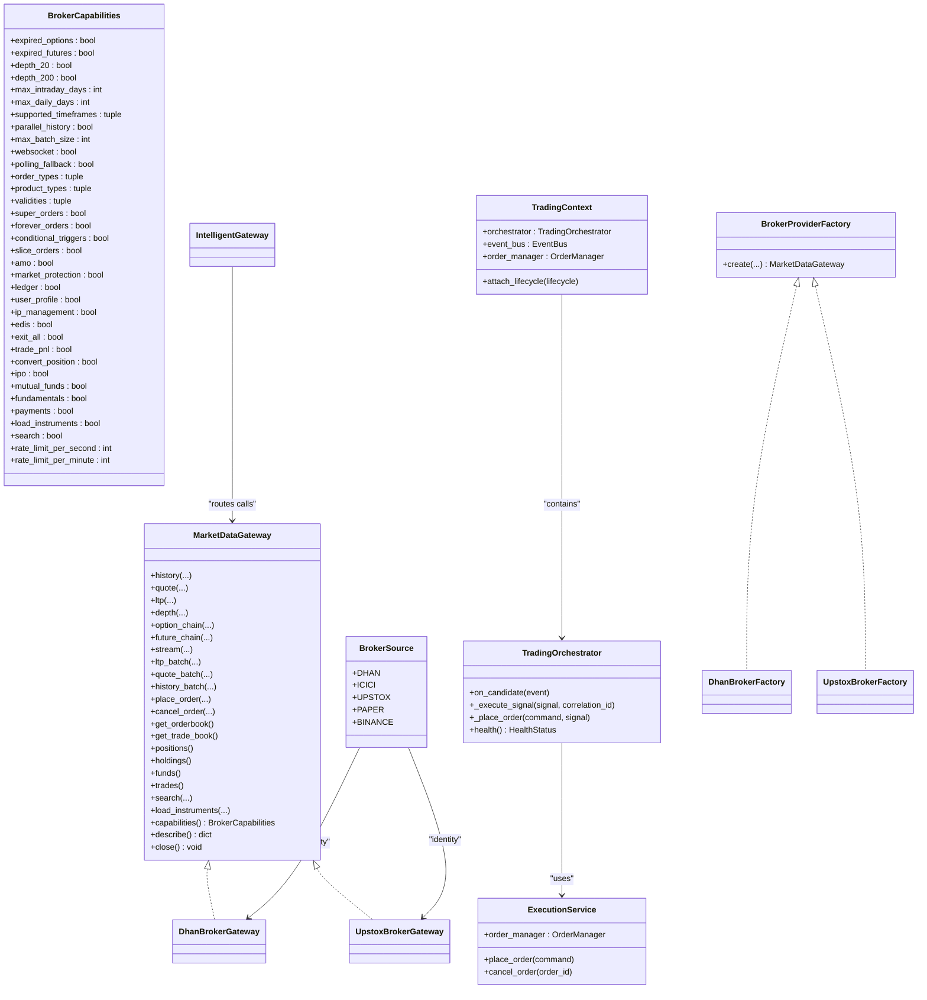
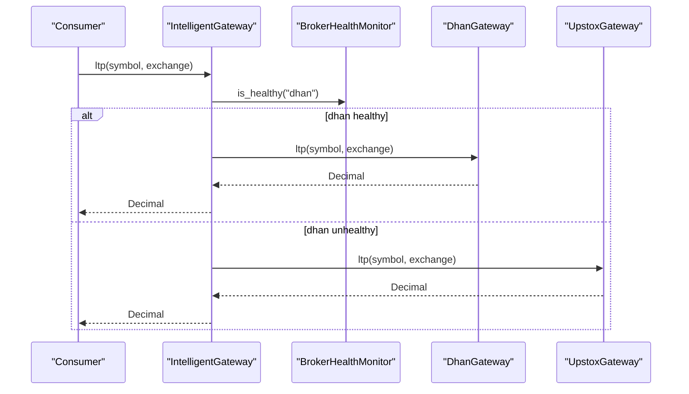
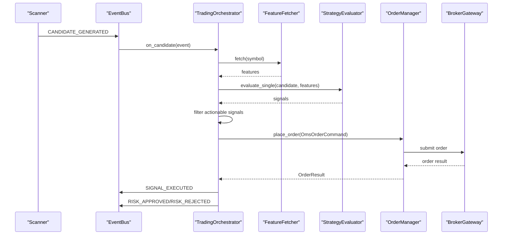
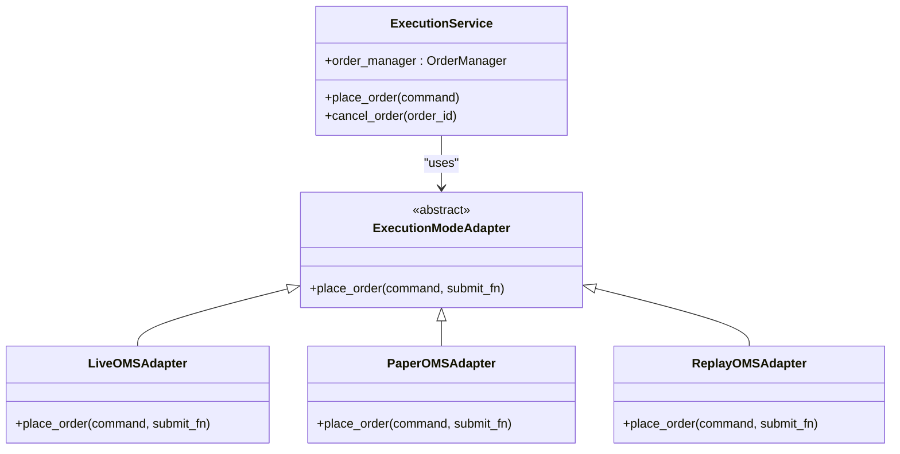
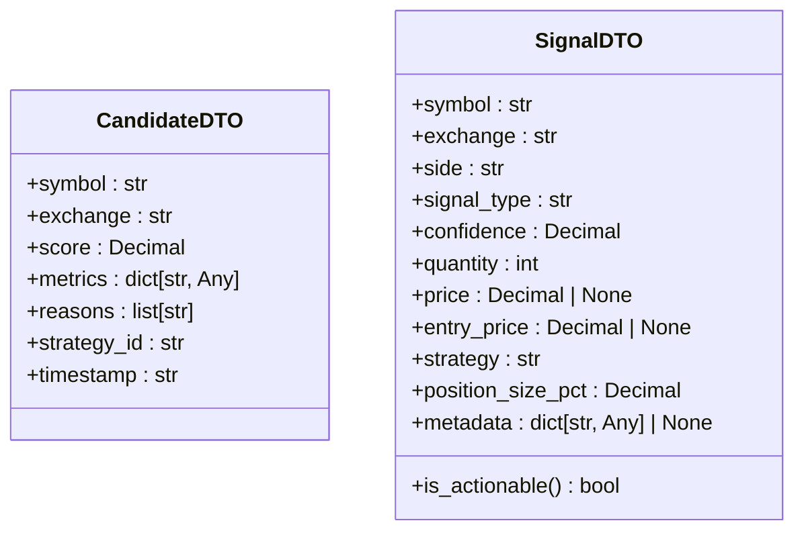
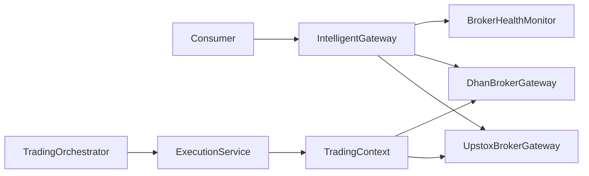

# Broker Abstraction Layer

<cite>
**Referenced Files in This Document**
- [ports.py](file://brokers/common/api/ports.py)
- [spi.py](file://brokers/common/api/spi.py)
- [gateway.py](file://brokers/common/gateway.py)
- [intelligent_gateway.py](file://brokers/common/intelligent_gateway.py)
- [factory.py](file://brokers/common/factory.py)
- [broker_health_monitor.py](file://brokers/common/resilience/broker_health_monitor.py)
- [errors.py](file://brokers/common/resilience/errors.py)
- [dhan_factory.py](file://brokers/dhan/factory.py)
- [upstox_factory.py](file://brokers/upstox/factory.py)
- [dhan_gateway.py](file://brokers/dhan/gateway.py)
- [upstox_gateway.py](file://brokers/upstox/gateway.py)
- [oms_factory.py](file://brokers/common/oms/factory.py)
- [trading_orchestrator.py](file://brokers/common/execution/trading_orchestrator.py)
- [context.py](file://brokers/common/oms/context.py)
- [execution_service.py](file://brokers/common/execution/execution_service.py)
- [models.py](file://brokers/common/orchestrator/models.py)
- [execution_mode_adapter.py](file://brokers/common/execution/execution_mode_adapter.py)
- [place_order_use_case.py](file://brokers/common/execution/place_order_use_case.py)
- [cancel_order_use_case.py](file://brokers/common/execution/cancel_order_use_case.py)
- [trading.py](file://domain/models/trading.py)
- [strategy_evaluator.py](file://domain/ports/strategy_evaluator.py)
</cite>

## Update Summary
**Changes Made**
- Added comprehensive documentation for the new TradingOrchestrator component
- Documented the unified domain model with CandidateDTO and SignalDTO
- Added ExecutionService and execution mode adapters documentation
- Updated TradingContext to include orchestrator integration
- Enhanced execution flow management documentation
- Added practical examples for implementing new broker adapters with execution systems

## Table of Contents
1. [Introduction](#introduction)
2. [Project Structure](#project-structure)
3. [Core Components](#core-components)
4. [Architecture Overview](#architecture-overview)
5. [Detailed Component Analysis](#detailed-component-analysis)
6. [New TradingOrchestrator System](#new-tradingorchestrator-system)
7. [Unified Domain Model](#unified-domain-model)
8. [Execution Flow Management](#execution-flow-management)
9. [Dependency Analysis](#dependency-analysis)
10. [Performance Considerations](#performance-considerations)
11. [Troubleshooting Guide](#troubleshooting-guide)
12. [Conclusion](#conclusion)
13. [Appendices](#appendices)

## Introduction
This document explains the broker abstraction layer centered on the MarketDataGateway interface and a capability-based architecture. The system has been significantly enhanced with a new execution orchestrator, unified trading systems, and a comprehensive domain model. It covers:
- The abstract base class design using ABC inheritance
- The port/spi pattern for service interfaces
- The BrokerProviderFactory abstract factory pattern for polymorphic broker instantiation
- The IntelligentGateway implementation for broker selection, capability discovery, and automatic failover
- Service provider interfaces (SPI) for market data, order management, and portfolio services
- **NEW**: TradingOrchestrator for automated trading workflows
- **NEW**: Unified domain model with CandidateDTO and SignalDTO
- **NEW**: ExecutionService and execution mode adapters
- **NEW**: TradingContext integration with orchestrator support
- Practical examples for implementing new broker adapters, extending service interfaces, and integrating with the factory pattern
- Architectural benefits for multi-broker deployments and future broker additions

## Project Structure
The broker abstraction layer is organized around a small set of core contracts and pluggable broker implementations, now enhanced with execution orchestration:
- Common contracts and abstractions under brokers/common
- Broker-specific adapters under brokers/<broker>
- **NEW**: Execution orchestration under brokers/common/execution
- **NEW**: Trading systems under brokers/common/oms
- **NEW**: Orchestrator components under brokers/common/orchestrator
- Resilience and observability utilities under brokers/common/resilience and brokers/common/observability
- Factory interfaces enabling polymorphic creation of gateways

```mermaid
graph TB
subgraph "Core Contracts"
GW["MarketDataGateway<br/>ABC"]
CAP["BrokerCapabilities<br/>dataclass"]
PORTS["Ports (SPI)<br/>MarketDataProvider, OrderCommand, PortfolioProvider, ..."]
SPI["BrokerSource (Enum)"]
FACTORY["BrokerProviderFactory (ABC)"]
END
subgraph "Execution Layer"
TO["TradingOrchestrator<br/>Scanner→Strategy→OMS"]
ES["ExecutionService<br/>Unified Execution"]
EMA["ExecutionModeAdapter<br/>Live/Paper/Replay"]
TC["TradingContext<br/>EventBus + OMS"]
END
subgraph "Dhan Adapter"
DGW["Dhan BrokerGateway"]
DFAC["Dhan BrokerFactory"]
END
subgraph "Upstox Adapter"
UGW["Upstox BrokerGateway"]
UFAC["Upstox BrokerFactory"]
END
subgraph "Intelligent Orchestration"
IG["IntelligentGateway"]
HM["BrokerHealthMonitor"]
END
GW --> PORTS
GW --> CAP
FACTORY --> GW
DFAC --> DGW
UFAC --> UGW
IG --> GW
IG --> HM
TO --> ES
ES --> EMA
TC --> TO
```

**Diagram sources**
- [gateway.py:115-364](file://brokers/common/gateway.py#L115-L364)
- [ports.py:85-518](file://brokers/common/api/ports.py#L85-L518)
- [spi.py:14-22](file://brokers/common/api/spi.py#L14-L22)
- [factory.py:16-44](file://brokers/common/factory.py#L16-L44)
- [dhan_gateway.py:41-411](file://brokers/dhan/gateway.py#L41-L411)
- [upstox_gateway.py:55-402](file://brokers/upstox/gateway.py#L55-L402)
- [dhan_factory.py:30-238](file://brokers/dhan/factory.py#L30-L238)
- [upstox_factory.py:26-79](file://brokers/upstox/factory.py#L26-L79)
- [intelligent_gateway.py:94-534](file://brokers/common/intelligent_gateway.py#L94-L534)
- [broker_health_monitor.py:44-166](file://brokers/common/resilience/broker_health_monitor.py#L44-L166)
- [trading_orchestrator.py:96-576](file://brokers/common/execution/trading_orchestrator.py#L96-L576)
- [execution_service.py:18-59](file://brokers/common/execution/execution_service.py#L18-L59)
- [execution_mode_adapter.py:16-89](file://brokers/common/execution/execution_mode_adapter.py#L16-L89)
- [context.py:44-478](file://brokers/common/oms/context.py#L44-L478)

**Section sources**
- [gateway.py:1-433](file://brokers/common/gateway.py#L1-L433)
- [ports.py:1-518](file://brokers/common/api/ports.py#L1-L518)
- [spi.py:1-22](file://brokers/common/api/spi.py#L1-L22)
- [factory.py:1-45](file://brokers/common/factory.py#L1-L45)
- [intelligent_gateway.py:1-534](file://brokers/common/intelligent_gateway.py#L1-L534)
- [trading_orchestrator.py:1-576](file://brokers/common/execution/trading_orchestrator.py#L1-L576)
- [context.py:1-478](file://brokers/common/oms/context.py#L1-L478)

## Core Components
- MarketDataGateway (ABC): Defines a broker-agnostic contract for market data, batch operations, trading, portfolio, instruments, and lifecycle. All broker adapters implement this interface.
- Ports (SPI): Fine-grained capability contracts (e.g., MarketDataProvider, OrderCommand, PortfolioProvider) that represent individual broker capabilities.
- BrokerCapabilities: A frozen capability matrix returned by gateway.capabilities() to inform consumers about supported features.
- BrokerProviderFactory (ABC): Abstract factory interface for creating configured MarketDataGateway instances.
- BrokerSource (Enum): Identifies broker providers (e.g., dhan, upstox, paper).
- IntelligentGateway: Orchestrates multiple broker gateways, routes operations to the best-performing broker, and provides graceful degradation and observability.
- **NEW**: TradingOrchestrator: Automated trading workflow connecting scanner→strategy→OMS execution.
- **NEW**: ExecutionService: Unified facade for order placement across different execution modes.
- **NEW**: TradingContext: Central container for event bus, OMS, position and risk managers with orchestrator integration.

Key implementation references:
- MarketDataGateway methods and BrokerCapabilities: [gateway.py:115-364](file://brokers/common/gateway.py#L115-L364)
- Port contracts (OrderCommand, MarketDataProvider, PortfolioProvider, etc.): [ports.py:85-518](file://brokers/common/api/ports.py#L85-L518)
- BrokerSource enumeration: [spi.py:14-22](file://brokers/common/api/spi.py#L14-L22)
- BrokerProviderFactory: [factory.py:16-44](file://brokers/common/factory.py#L16-L44)
- IntelligentGateway routing and health-aware fallback: [intelligent_gateway.py:94-534](file://brokers/common/intelligent_gateway.py#L94-L534)
- **NEW**: TradingOrchestrator workflow: [trading_orchestrator.py:96-576](file://brokers/common/execution/trading_orchestrator.py#L96-L576)
- **NEW**: ExecutionService facade: [execution_service.py:18-59](file://brokers/common/execution/execution_service.py#L18-L59)
- **NEW**: TradingContext integration: [context.py:44-478](file://brokers/common/oms/context.py#L44-L478)

**Section sources**
- [gateway.py:115-364](file://brokers/common/gateway.py#L115-L364)
- [ports.py:85-518](file://brokers/common/api/ports.py#L85-L518)
- [spi.py:14-22](file://brokers/common/api/spi.py#L14-L22)
- [factory.py:16-44](file://brokers/common/factory.py#L16-L44)
- [intelligent_gateway.py:94-534](file://brokers/common/intelligent_gateway.py#L94-L534)
- [trading_orchestrator.py:96-576](file://brokers/common/execution/trading_orchestrator.py#L96-L576)
- [execution_service.py:18-59](file://brokers/common/execution/execution_service.py#L18-L59)
- [context.py:44-478](file://brokers/common/oms/context.py#L44-L478)

## Architecture Overview
The architecture enforces a strict separation between the consumer-facing MarketDataGateway and broker-specific implementations. The system now includes a comprehensive execution layer that connects analytics to trading operations. Consumers depend on the ABC; adapters implement ports and wire them into a unified gateway facade. The IntelligentGateway composes multiple gateways and applies capability-based routing and health-aware failover. The TradingOrchestrator provides autonomous trading workflows with unified domain models.



**Diagram sources**
- [gateway.py:115-364](file://brokers/common/gateway.py#L115-L364)
- [ports.py:85-518](file://brokers/common/api/ports.py#L85-L518)
- [spi.py:14-22](file://brokers/common/api/spi.py#L14-L22)
- [factory.py:16-44](file://brokers/common/factory.py#L16-L44)
- [dhan_gateway.py:41-411](file://brokers/dhan/gateway.py#L41-L411)
- [upstox_gateway.py:55-402](file://brokers/upstox/gateway.py#L55-L402)
- [intelligent_gateway.py:94-534](file://brokers/common/intelligent_gateway.py#L94-L534)
- [trading_orchestrator.py:96-576](file://brokers/common/execution/trading_orchestrator.py#L96-L576)
- [execution_service.py:18-59](file://brokers/common/execution/execution_service.py#L18-L59)
- [context.py:44-478](file://brokers/common/oms/context.py#L44-L478)

## Detailed Component Analysis

### MarketDataGateway (ABC) and BrokerCapabilities
- Purpose: Provide a single, broker-agnostic interface for market data, trading, portfolio, and lifecycle operations.
- BrokerCapabilities: Describes supported features, limits, and capabilities (e.g., order types, timeframes, advanced order types, rate limits).
- ObservabilityProvider: Optional protocol for exposing canonical observability data from broker adapters.

Implementation highlights:
- Methods for market data, batch operations, trading, portfolio, instruments, lifecycle, and observability.
- Canonical return types and schemas (e.g., Quote, MarketDepth, Balance, Position, Holding, Trade).
- ObservabilityProvider default implementations for connection status, circuit breaker states, token refresh metrics, and rate limiter metrics.

References:
- [gateway.py:115-364](file://brokers/common/gateway.py#L115-L364)
- [gateway.py:372-433](file://brokers/common/gateway.py#L372-L433)

**Section sources**
- [gateway.py:115-364](file://brokers/common/gateway.py#L115-L364)
- [gateway.py:372-433](file://brokers/common/gateway.py#L372-L433)

### Port/Service Provider Interfaces (SPI)
- Fine-grained capability contracts define individual broker capabilities:
  - MarketDataProvider: quotes, LTP, depth, historical data
  - OrderCommand/OrderQuery: order placement, modification, cancellation, and querying
  - PortfolioProvider: positions, holdings, funds
  - OptionsProvider/FuturesProvider: option and futures chains
  - Advanced order types: BracketOrderProvider, GttOrderProvider, SliceOrderCommand
  - Conditional alerts, market status, news, market intelligence, kill switch, static IP, idempotency cache
- Relationship: MarketDataGateway acts as a coarse-grained facade combining these ports.

References:
- [ports.py:85-518](file://brokers/common/api/ports.py#L85-L518)

**Section sources**
- [ports.py:1-518](file://brokers/common/api/ports.py#L1-L518)

### BrokerProviderFactory (Abstract Factory Pattern)
- Role: Abstract interface for creating configured MarketDataGateway instances.
- Polymorphism: Both Dhan and Upstox factories implement this interface, enabling BrokerService to call them interchangeably.
- Parameters: Environment path, instrument loading, event bus, risk manager, lifecycle manager, and broker-specific callbacks.

References:
- [factory.py:16-44](file://brokers/common/factory.py#L16-L44)
- [dhan_factory.py:30-238](file://brokers/dhan/factory.py#L30-L238)
- [upstox_factory.py:26-79](file://brokers/upstox/factory.py#L26-L79)

**Section sources**
- [factory.py:16-44](file://brokers/common/factory.py#L16-L44)
- [dhan_factory.py:30-238](file://brokers/dhan/factory.py#L30-L238)
- [upstox_factory.py:26-79](file://brokers/upstox/factory.py#L26-L79)

### IntelligentGateway: Routing, Failover, and Observability
- Routing strategy: Routes operations to the best-performing broker based on operation type and capability.
- Health-aware routing: Uses BrokerHealthMonitor to skip unhealthy brokers and record success/failure.
- Graceful degradation: In degraded mode (all brokers unhealthy), read operations may return cached/stale data; write operations raise BrokerDegradedError.
- Observability: Logs fallbacks, increments metrics, and preserves caller-visible behavior.



**Diagram sources**
- [intelligent_gateway.py:213-321](file://brokers/common/intelligent_gateway.py#L213-L321)
- [broker_health_monitor.py:97-107](file://brokers/common/resilience/broker_health_monitor.py#L97-L107)

**Section sources**
- [intelligent_gateway.py:94-534](file://brokers/common/intelligent_gateway.py#L94-L534)
- [broker_health_monitor.py:44-166](file://brokers/common/resilience/broker_health_monitor.py#L44-L166)
- [errors.py:66-82](file://brokers/common/resilience/errors.py#L66-L82)

### Broker Adapters: Dhan and Upstox Gateways
- DhanBrokerGateway:
  - Implements MarketDataGateway and ObservabilityProvider
  - Exposes extended capabilities (super orders, forever orders, conditional triggers, ledger, user profile, IP management, EDIS, exit all)
  - Provides depth_20/depth_200, batch operations, and observability metrics
- UpstoxBrokerGateway:
  - Facade delegating to specialized adapters (MarketDataAdapter, HistoricalAdapter, SymbolResolverAdapter, StreamManagerAdapter, OrderAdapter, PortfolioAdapter)
  - Supports extended capabilities (IPO, mutual funds, fundamentals, payments, market protection, convert position, trade PnL, exit all)
  - Raises NotImplementedError for unsupported features (e.g., future_chain)

References:
- [dhan_gateway.py:41-411](file://brokers/dhan/gateway.py#L41-L411)
- [upstox_gateway.py:55-402](file://brokers/upstox/gateway.py#L55-L402)

**Section sources**
- [dhan_gateway.py:41-411](file://brokers/dhan/gateway.py#L41-L411)
- [upstox_gateway.py:55-402](file://brokers/upstox/gateway.py#L55-L402)

### Capability-Based Service Discovery
- Each gateway implements capabilities(): BrokerCapabilities to advertise supported features.
- Consumers inspect capabilities() before invoking methods to avoid runtime errors.
- Examples:
  - Dhan: depth_20/depth_200, super_orders, forever_orders, conditional_triggers, ledger, user_profile, ip_management, edis, exit_all
  - Upstox: slice_orders, conditional_triggers, amo, market_protection, ipo, mutual_funds, fundamentals, payments, user_profile, convert_position, trade_pnl, exit_all

References:
- [dhan_gateway.py:361-394](file://brokers/dhan/gateway.py#L361-L394)
- [upstox_gateway.py:360-402](file://brokers/upstox/gateway.py#L360-L402)

**Section sources**
- [dhan_gateway.py:361-394](file://brokers/dhan/gateway.py#L361-L394)
- [upstox_gateway.py:360-402](file://brokers/upstox/gateway.py#L360-L402)

## New TradingOrchestrator System

### TradingOrchestrator: Automated Trading Workflow
The TradingOrchestrator is the missing link between the analytics layer (scanner/strategy) and the execution layer (OMS/broker). It automates the complete trading workflow:

1. Subscribe to CANDIDATE_GENERATED events from the EventBus
2. For each candidate, fetch features via FeatureFetcher
3. Run StrategyPipeline.evaluate_single(candidate, features)
4. Filter actionable signals (signal.is_actionable)
5. Convert signal to OmsOrderCommand
6. Call OrderManager.place_order() with the command
7. Publish RISK_APPROVED/RISK_REJECTED events based on OMS result
8. Publish SIGNAL_EXECUTED event with order_id



**Diagram sources**
- [trading_orchestrator.py:174-357](file://brokers/common/execution/trading_orchestrator.py#L174-L357)

### ExecutionService: Unified Execution Facade
The ExecutionService provides a single entry point for order placement and cancellation, supporting different execution modes:

- **Live Mode**: Direct routing through OMS + broker gateway
- **Paper Mode**: Routes through OMS with simulated submit functions
- **Replay/Backtest Mode**: Routes through OMS for zero-parity with live



**Diagram sources**
- [execution_service.py:18-59](file://brokers/common/execution/execution_service.py#L18-L59)
- [execution_mode_adapter.py:16-89](file://brokers/common/execution/execution_mode_adapter.py#L16-L89)

### TradingContext: Central Trading Services Container
The TradingContext serves as a central container for all trading services, now including optional orchestrator integration:

- Event bus with observability hooks
- Order, position, and risk managers
- Processed trade repository for idempotency
- Optional TradingOrchestrator integration
- Async event bus support for modern applications

**Section sources**
- [trading_orchestrator.py:96-576](file://brokers/common/execution/trading_orchestrator.py#L96-L576)
- [execution_service.py:18-59](file://brokers/common/execution/execution_service.py#L18-L59)
- [execution_mode_adapter.py:16-89](file://brokers/common/execution/execution_mode_adapter.py#L16-L89)
- [context.py:44-478](file://brokers/common/oms/context.py#L44-L478)

## Unified Domain Model

### CandidateDTO and SignalDTO: Neutral Trading Data Transfer Objects
The system introduces a unified domain model with neutral DTOs that cross the orchestrator boundary:

- **CandidateDTO**: Represents scanner output passed to the execution layer
- **SignalDTO**: Represents strategy signals passed to execution layer
- Both use frozen dataclasses with slots for memory efficiency
- SignalDTO includes an `is_actionable` property for filtering non-actionable signals



**Diagram sources**
- [trading.py:10-45](file://domain/models/trading.py#L10-L45)

### StrategyEvaluator Protocol
The StrategyEvaluator protocol decouples execution from analytics by defining a clean interface for strategy evaluation:

- Takes a CandidateDTO and features DataFrame
- Returns a list of SignalDTO objects (including HOLD signals)
- Allows multiple strategies to be evaluated independently

**Section sources**
- [trading.py:10-45](file://domain/models/trading.py#L10-L45)
- [strategy_evaluator.py:12-23](file://domain/ports/strategy_evaluator.py#L12-L23)

## Execution Flow Management

### Use Case Patterns
The system implements proper use case patterns for order management:

- **PlaceOrderUseCase**: Single entry point for order placement with risk and event publishing
- **CancelOrderUseCase**: Single entry point for order cancellation
- Both provide clean interfaces that handle conversion between domain requests and OMS commands

### Execution Flow Control
The execution flow includes comprehensive control mechanisms:

- Confidence threshold filtering (configurable minimum confidence)
- Kill switch integration for emergency stops
- Dry-run mode for testing and validation
- Feature timeout handling for robustness
- Proper error handling and logging throughout the pipeline

**Section sources**
- [place_order_use_case.py:13-57](file://brokers/common/execution/place_order_use_case.py#L13-L57)
- [cancel_order_use_case.py:11-33](file://brokers/common/execution/cancel_order_use_case.py#L11-L33)
- [trading_orchestrator.py:301-520](file://brokers/common/execution/trading_orchestrator.py#L301-L520)

## Dependency Analysis
The abstraction layer minimizes coupling through:
- Clear separation of concerns: consumers depend on MarketDataGateway; adapters encapsulate broker specifics.
- Polymorphic factory pattern: BrokerProviderFactory enables interchangeable broker instantiation.
- Health-aware orchestration: IntelligentGateway coordinates multiple gateways without hardcoding broker logic.
- **NEW**: Execution layer separation: TradingOrchestrator, ExecutionService, and TradingContext provide clean boundaries between analytics and execution.



**Diagram sources**
- [intelligent_gateway.py:94-534](file://brokers/common/intelligent_gateway.py#L94-L534)
- [broker_health_monitor.py:44-166](file://brokers/common/resilience/broker_health_monitor.py#L44-L166)
- [dhan_gateway.py:41-411](file://brokers/dhan/gateway.py#L41-L411)
- [upstox_gateway.py:55-402](file://brokers/upstox/gateway.py#L55-L402)
- [trading_orchestrator.py:96-576](file://brokers/common/execution/trading_orchestrator.py#L96-L576)
- [execution_service.py:18-59](file://brokers/common/execution/execution_service.py#L18-L59)
- [context.py:44-478](file://brokers/common/oms/context.py#L44-L478)

**Section sources**
- [intelligent_gateway.py:94-534](file://brokers/common/intelligent_gateway.py#L94-L534)
- [broker_health_monitor.py:44-166](file://brokers/common/resilience/broker_health_monitor.py#L44-L166)
- [dhan_gateway.py:41-411](file://brokers/dhan/gateway.py#L41-L411)
- [upstox_gateway.py:55-402](file://brokers/upstox/gateway.py#L55-L402)
- [trading_orchestrator.py:96-576](file://brokers/common/execution/trading_orchestrator.py#L96-L576)
- [execution_service.py:18-59](file://brokers/common/execution/execution_service.py#L18-L59)
- [context.py:44-478](file://brokers/common/oms/context.py#L44-L478)

## Performance Considerations
- Parallel history fetching: DhanGateway supports parallel history_batch using ThreadPoolExecutor.
- Batch operations: UpstoxGateway leverages BatchFetchMixin for efficient batch market data retrieval.
- Streaming: Both adapters provide WebSocket streaming with lifecycle integration for deterministic start/stop.
- Rate limiting and circuit breakers: Dhan adapter uses separate circuit breakers for read/write/admin categories to isolate failure domains.
- **NEW**: Asynchronous event bus support: TradingContext supports AsyncEventBus for improved throughput in modern applications.
- **NEW**: Execution mode optimization: Different execution adapters optimize for their specific use cases (live vs paper vs replay).

References:
- [dhan_gateway.py:550-572](file://brokers/dhan/gateway.py#L550-L572)
- [upstox_gateway.py:55-402](file://brokers/upstox/gateway.py#L55-L402)
- [dhan_factory.py:99-138](file://brokers/dhan/factory.py#L99-L138)
- [context.py:306-360](file://brokers/common/oms/context.py#L306-L360)
- [execution_mode_adapter.py:28-74](file://brokers/common/execution/execution_mode_adapter.py#L28-L74)

**Section sources**
- [dhan_gateway.py:550-572](file://brokers/dhan/gateway.py#L550-L572)
- [upstox_gateway.py:55-402](file://brokers/upstox/gateway.py#L55-L402)
- [dhan_factory.py:99-138](file://brokers/dhan/factory.py#L99-L138)
- [context.py:306-360](file://brokers/common/oms/context.py#L306-L360)
- [execution_mode_adapter.py:28-74](file://brokers/common/execution/execution_mode_adapter.py#L28-L74)

## Troubleshooting Guide
- BrokerDegradedError: Raised when write operations are attempted while all brokers are unhealthy. Read operations may return cached data depending on degraded mode.
- Circuit breaker states: Inspect via ObservabilityProvider.get_circuit_breaker_states() to diagnose throttling or blocked endpoints.
- Token refresh metrics: Use ObservabilityProvider.get_token_refresh_metrics() to track token lifecycle and failures.
- Health monitoring: Use BrokerHealthMonitor to check consecutive failures and overall health status.
- **NEW**: TradingOrchestrator debugging: Monitor execution statistics (executed_count, rejected_count, error_count) and check feature fetch timeouts.
- **NEW**: Execution mode issues: Verify execution adapter configuration and mode settings in ExecutionService.

References:
- [errors.py:66-82](file://brokers/common/resilience/errors.py#L66-L82)
- [dhan_gateway.py:595-640](file://brokers/dhan/gateway.py#L595-L640)
- [broker_health_monitor.py:109-136](file://brokers/common/resilience/broker_health_monitor.py#L109-L136)
- [trading_orchestrator.py:521-570](file://brokers/common/execution/trading_orchestrator.py#L521-L570)
- [execution_service.py:21-59](file://brokers/common/execution/execution_service.py#L21-L59)

**Section sources**
- [errors.py:66-82](file://brokers/common/resilience/errors.py#L66-L82)
- [dhan_gateway.py:595-640](file://brokers/dhan/gateway.py#L595-L640)
- [broker_health_monitor.py:109-136](file://brokers/common/resilience/broker_health_monitor.py#L109-L136)
- [trading_orchestrator.py:521-570](file://brokers/common/execution/trading_orchestrator.py#L521-L570)
- [execution_service.py:21-59](file://brokers/common/execution/execution_service.py#L21-L59)

## Conclusion
The broker abstraction layer provides a robust, capability-driven foundation for multi-broker deployments with significant enhancements for automated trading. By enforcing a clean MarketDataGateway contract, using fine-grained port interfaces, applying health-aware orchestration, and introducing comprehensive execution systems, the architecture achieves:

- Interoperability across brokers
- Automatic failover and graceful degradation
- Extensibility for new brokers and capabilities
- Strong observability and resilience
- **NEW**: Autonomous trading workflows through TradingOrchestrator
- **NEW**: Unified domain model for clean separation between analytics and execution
- **NEW**: Flexible execution modes supporting live, paper, and backtesting scenarios

## Appendices

### BrokerSource Enumeration
- Values: dhan, icici, upstox, paper, binance

References:
- [spi.py:14-22](file://brokers/common/api/spi.py#L14-L22)

**Section sources**
- [spi.py:14-22](file://brokers/common/api/spi.py#L14-L22)

### Creating a TradingContext with Reconciliation
- Use create_trading_context() to assemble a TradingContext with optional reconciliation, risk management, and event buses.
- **NEW**: Optional TradingOrchestrator integration for autonomous trading workflows.

References:
- [oms_factory.py:22-71](file://brokers/common/oms/factory.py#L22-L71)
- [context.py:180-210](file://brokers/common/oms/context.py#L180-L210)

**Section sources**
- [oms_factory.py:22-71](file://brokers/common/oms/factory.py#L22-L71)
- [context.py:180-210](file://brokers/common/oms/context.py#L180-L210)

### Practical Implementation Examples

#### Implementing a New Broker Adapter with Execution Support
Steps:
1. Implement MarketDataGateway (ABC) in a new broker module.
2. Implement required ports (e.g., MarketDataProvider, OrderCommand, PortfolioProvider) as needed.
3. Implement BrokerProviderFactory.create() to construct the gateway with dependencies (event bus, risk manager, lifecycle).
4. Populate capabilities() with supported features.
5. **NEW**: Integrate with TradingContext for execution support.
6. **NEW**: Implement execution mode adapters if needed for paper/replay scenarios.
7. Integrate with IntelligentGateway by adding the new gateway instance and updating routing logic.

References:
- [gateway.py:115-364](file://brokers/common/gateway.py#L115-L364)
- [ports.py:85-518](file://brokers/common/api/ports.py#L85-L518)
- [factory.py:16-44](file://brokers/common/factory.py#L16-L44)
- [intelligent_gateway.py:94-534](file://brokers/common/intelligent_gateway.py#L94-L534)
- [context.py:44-478](file://brokers/common/oms/context.py#L44-L478)
- [execution_mode_adapter.py:76-89](file://brokers/common/execution/execution_mode_adapter.py#L76-L89)

**Section sources**
- [gateway.py:115-364](file://brokers/common/gateway.py#L115-L364)
- [ports.py:85-518](file://brokers/common/api/ports.py#L85-L518)
- [factory.py:16-44](file://brokers/common/factory.py#L16-L44)
- [intelligent_gateway.py:94-534](file://brokers/common/intelligent_gateway.py#L94-L534)
- [context.py:44-478](file://brokers/common/oms/context.py#L44-L478)
- [execution_mode_adapter.py:76-89](file://brokers/common/execution/execution_mode_adapter.py#L76-L89)

#### Extending Service Interfaces (Ports)
- Add new ports in ports.py for additional capabilities (e.g., new provider interfaces).
- Update broker adapters to implement the new ports.
- Expose extended capabilities via gateway.extended or by augmenting MarketDataGateway.

References:
- [ports.py:85-518](file://brokers/common/api/ports.py#L85-L518)

**Section sources**
- [ports.py:85-518](file://brokers/common/api/ports.py#L85-L518)

#### Integrating with the Factory Pattern
- Implement BrokerProviderFactory.create() to configure the gateway with environment settings, event bus, risk manager, lifecycle, and optional reconciliation/backfill callbacks.
- Use the factory to instantiate gateways programmatically or via BrokerService.

References:
- [dhan_factory.py:30-238](file://brokers/dhan/factory.py#L30-L238)
- [upstox_factory.py:26-79](file://brokers/upstox/factory.py#L26-L79)
- [factory.py:16-44](file://brokers/common/factory.py#L16-L44)

**Section sources**
- [dhan_factory.py:30-238](file://brokers/dhan/factory.py#L30-L238)
- [upstox_factory.py:26-79](file://brokers/upstox/factory.py#L26-L79)
- [factory.py:16-44](file://brokers/common/factory.py#L16-L44)

#### Implementing Custom Execution Modes
Steps:
1. Create a new ExecutionModeAdapter subclass for custom execution logic.
2. Implement the place_order method with mode-specific behavior.
3. Register the adapter in the create_execution_adapter factory function.
4. Configure ExecutionService to use the new mode.

References:
- [execution_mode_adapter.py:16-89](file://brokers/common/execution/execution_mode_adapter.py#L16-L89)
- [execution_service.py:76-89](file://brokers/common/execution/execution_service.py#L76-L89)

**Section sources**
- [execution_mode_adapter.py:16-89](file://brokers/common/execution/execution_mode_adapter.py#L16-L89)
- [execution_service.py:76-89](file://brokers/common/execution/execution_service.py#L76-L89)