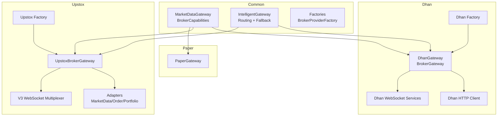
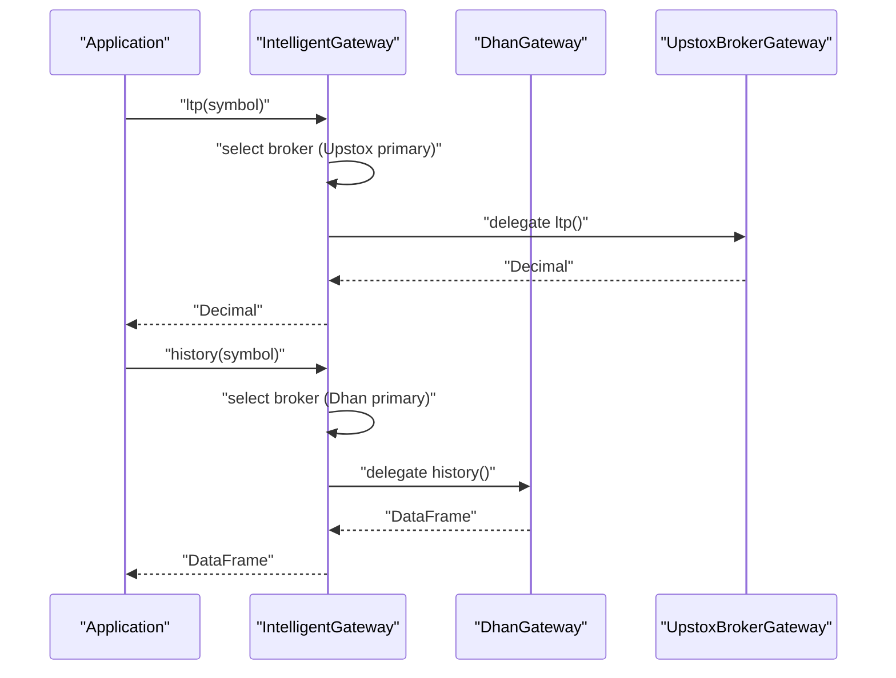
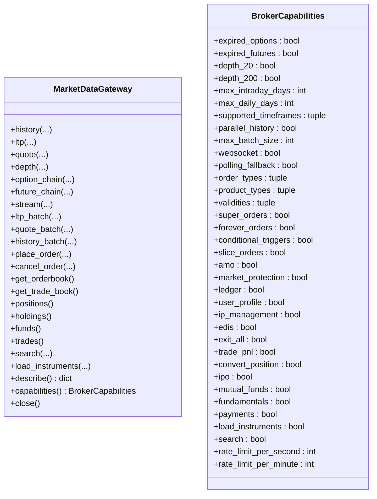
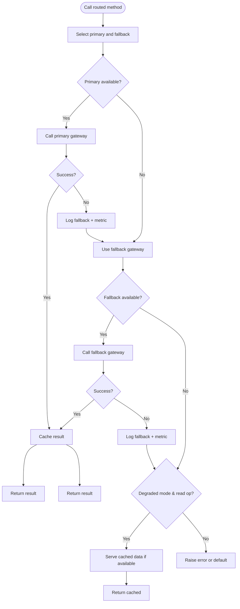
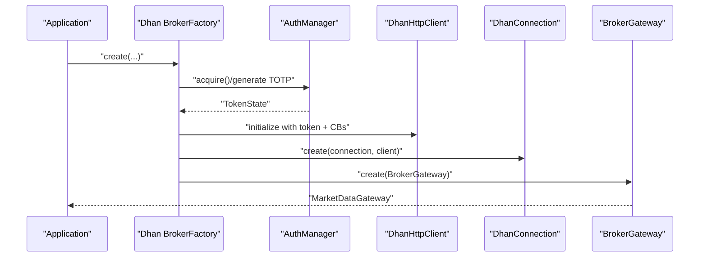
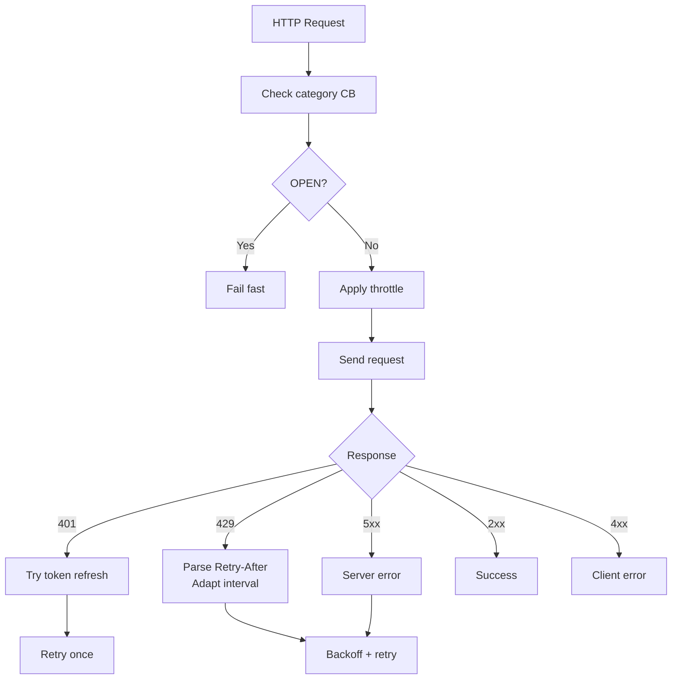
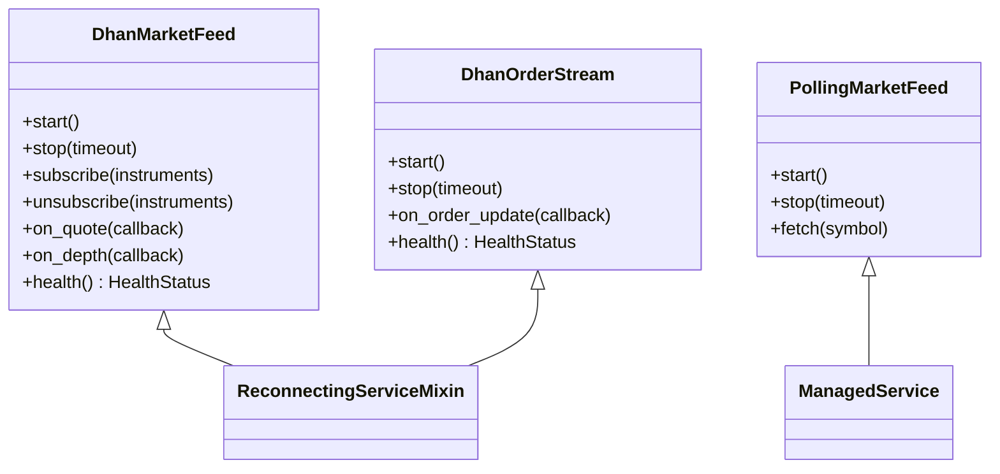
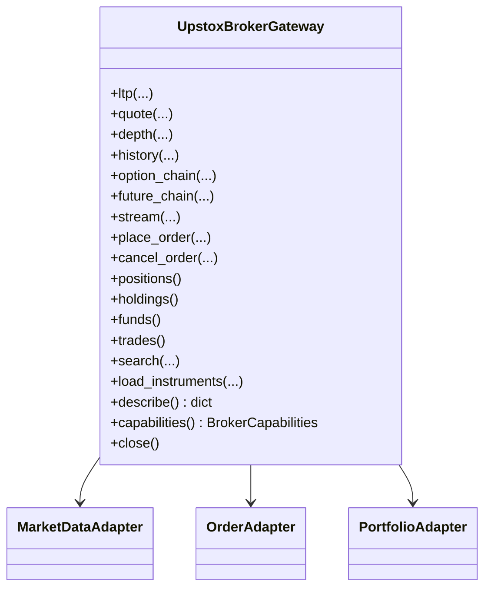
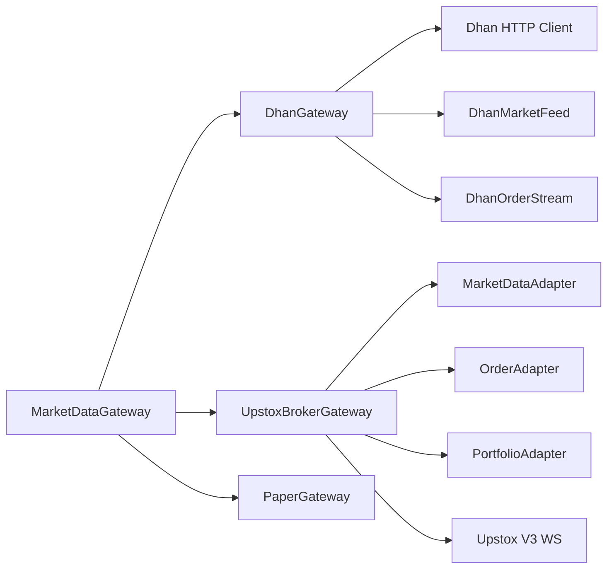

# Broker Integration

<cite>
**Referenced Files in This Document**
- [gateway.py](file://brokers/common/gateway.py)
- [intelligent_gateway.py](file://brokers/common/intelligent_gateway.py)
- [factory.py](file://brokers/dhan/factory.py)
- [gateway.py](file://brokers/dhan/gateway.py)
- [websocket.py](file://brokers/dhan/websocket.py)
- [http_client.py](file://brokers/dhan/http_client.py)
- [market_data.py](file://brokers/dhan/market_data.py)
- [orders.py](file://brokers/dhan/orders.py)
- [factory.py](file://brokers/upstox/factory.py)
- [gateway.py](file://brokers/upstox/gateway.py)
- [market_data_adapter.py](file://brokers/upstox/adapters/market_data_adapter.py)
- [order_adapter.py](file://brokers/upstox/adapters/order_adapter.py)
- [portfolio_adapter.py](file://brokers/upstox/adapters/portfolio_adapter.py)
- [market_data_v3.py](file://brokers/upstox/websocket/market_data_v3.py)
- [paper_gateway.py](file://brokers/paper/paper_gateway.py)
</cite>

## Table of Contents
1. [Introduction](#introduction)
2. [Project Structure](#project-structure)
3. [Core Components](#core-components)
4. [Architecture Overview](#architecture-overview)
5. [Detailed Component Analysis](#detailed-component-analysis)
6. [Dependency Analysis](#dependency-analysis)
7. [Performance Considerations](#performance-considerations)
8. [Troubleshooting Guide](#troubleshooting-guide)
9. [Conclusion](#conclusion)
10. [Appendices](#appendices)

## Introduction
This document explains the broker integration architecture with a focus on the broker-agnostic design, capability-based service discovery, and concrete implementations for Dhan and Upstox. It covers the MarketDataGateway abstraction, the IntelligentGateway for dynamic broker selection and fallback, the Dhan integration (WebSocket services, HTTP client, market data handling), the Upstox integration (comprehensive adapters for market data v2/v3, orders, portfolio, kill switch, alerts, margin, GTT, cover orders, slicing), and the paper trading simulator. It also documents configuration management, authentication flows, error handling strategies, and practical setup/testing guidance.

## Project Structure
The broker integration spans three major areas:
- Common abstractions and utilities under brokers/common
- Broker-specific implementations under brokers/dhan and brokers/upstox
- A paper trading simulator under brokers/paper

**Diagram sources**
- [gateway.py:115-364](file://brokers/common/gateway.py#L115-L364)
- [intelligent_gateway.py:94-534](file://brokers/common/intelligent_gateway.py#L94-L534)
- [factory.py:30-238](file://brokers/dhan/factory.py#L30-L238)
- [gateway.py:41-641](file://brokers/dhan/gateway.py#L41-L641)
- [websocket.py:143-763](file://brokers/dhan/websocket.py#L143-L763)
- [http_client.py:100-365](file://brokers/dhan/http_client.py#L100-L365)
- [factory.py:26-79](file://brokers/upstox/factory.py#L26-L79)
- [gateway.py:55-547](file://brokers/upstox/gateway.py#L55-L547)
- [market_data_adapter.py:24-132](file://brokers/upstox/adapters/market_data_adapter.py#L24-L132)
- [order_adapter.py:31-223](file://brokers/upstox/adapters/order_adapter.py#L31-L223)
- [portfolio_adapter.py:18-87](file://brokers/upstox/adapters/portfolio_adapter.py#L18-L87)
- [market_data_v3.py:60-348](file://brokers/upstox/websocket/market_data_v3.py#L60-L348)
- [paper_gateway.py:30-312](file://brokers/paper/paper_gateway.py#L30-L312)

**Section sources**
- [gateway.py:1-433](file://brokers/common/gateway.py#L1-L433)
- [intelligent_gateway.py:1-534](file://brokers/common/intelligent_gateway.py#L1-L534)
- [factory.py:30-415](file://brokers/dhan/factory.py#L30-L415)
- [gateway.py:41-641](file://brokers/dhan/gateway.py#L41-L641)
- [websocket.py:143-1181](file://brokers/dhan/websocket.py#L143-L1181)
- [http_client.py:100-365](file://brokers/dhan/http_client.py#L100-L365)
- [factory.py:26-82](file://brokers/upstox/factory.py#L26-L82)
- [gateway.py:55-547](file://brokers/upstox/gateway.py#L55-L547)
- [market_data_adapter.py:24-132](file://brokers/upstox/adapters/market_data_adapter.py#L24-L132)
- [order_adapter.py:31-223](file://brokers/upstox/adapters/order_adapter.py#L31-L223)
- [portfolio_adapter.py:18-87](file://brokers/upstox/adapters/portfolio_adapter.py#L18-L87)
- [market_data_v3.py:60-348](file://brokers/upstox/websocket/market_data_v3.py#L60-L348)
- [paper_gateway.py:30-312](file://brokers/paper/paper_gateway.py#L30-L312)

## Core Components
- MarketDataGateway: The broker-agnostic contract defining canonical market data, trading, portfolio, instrument, and lifecycle operations. It also defines BrokerCapabilities for capability-based service discovery.
- IntelligentGateway: A router that selects the optimal broker per operation type, supports parallel data fetching, and gracefully degrades to cached data when all brokers are down.
- Dhan integration: Includes BrokerGateway, Dhan HTTP client, and WebSocket services (DhanMarketFeed, DhanOrderStream, PollingMarketFeed), plus token management and circuit breakers.
- Upstox integration: Includes UpstoxBrokerGateway with specialized adapters (MarketDataAdapter, OrderAdapter, PortfolioAdapter), V3 WebSocket multiplexer, and comprehensive extended capabilities.
- PaperGateway: A thread-safe in-memory simulator for testing and development with configurable risk context.

**Section sources**
- [gateway.py:115-364](file://brokers/common/gateway.py#L115-L364)
- [intelligent_gateway.py:94-534](file://brokers/common/intelligent_gateway.py#L94-L534)
- [gateway.py:41-641](file://brokers/dhan/gateway.py#L41-L641)
- [http_client.py:100-365](file://brokers/dhan/http_client.py#L100-L365)
- [websocket.py:143-763](file://brokers/dhan/websocket.py#L143-L763)
- [gateway.py:55-547](file://brokers/upstox/gateway.py#L55-L547)
- [market_data_adapter.py:24-132](file://brokers/upstox/adapters/market_data_adapter.py#L24-L132)
- [order_adapter.py:31-223](file://brokers/upstox/adapters/order_adapter.py#L31-L223)
- [portfolio_adapter.py:18-87](file://brokers/upstox/adapters/portfolio_adapter.py#L18-L87)
- [market_data_v3.py:60-348](file://brokers/upstox/websocket/market_data_v3.py#L60-L348)
- [paper_gateway.py:30-312](file://brokers/paper/paper_gateway.py#L30-L312)

## Architecture Overview
The system separates concerns into:
- Abstraction: MarketDataGateway and BrokerCapabilities define the contract and capability matrix.
- Routing: IntelligentGateway routes operations to the best broker and handles fallback.
- Transport: Broker-specific factories instantiate gateways with authentication, HTTP clients, and WebSocket services.
- Adapters: Specialized adapters encapsulate broker wire formats and capabilities.
- Observability: ObservabilityProvider exposes connection status, circuit breaker states, and token refresh metrics.

**Diagram sources**
- [intelligent_gateway.py:424-498](file://brokers/common/intelligent_gateway.py#L424-L498)
- [gateway.py:280-304](file://brokers/dhan/gateway.py#L280-L304)
- [gateway.py:105-142](file://brokers/upstox/gateway.py#L105-L142)

## Detailed Component Analysis

### MarketDataGateway and BrokerCapabilities
- Defines canonical operations for market data, batch operations, trading, portfolio, instrument search, and lifecycle.
- BrokerCapabilities provides a frozen capability matrix consumed by clients to discover features (depth levels, batch sizes, order types, product types, validities, advanced order types, account management, investment capabilities, rate limits).

**Diagram sources**
- [gateway.py:115-364](file://brokers/common/gateway.py#L115-L364)
- [gateway.py:42-108](file://brokers/common/gateway.py#L42-L108)

**Section sources**
- [gateway.py:115-364](file://brokers/common/gateway.py#L115-L364)
- [gateway.py:42-108](file://brokers/common/gateway.py#L42-L108)

### IntelligentGateway: Dynamic Routing and Fallback
- Routes operations to the best broker based on operation type and capability.
- Supports parallel data fetching for batch operations.
- Graceful degradation: serves cached/stale data for read operations when all brokers are down; raises BrokerDegradedError for write operations.
- Health-aware routing: uses BrokerHealthMonitor to skip unhealthy brokers.
- Thread-safe in-memory cache with TTL per operation type.

**Diagram sources**
- [intelligent_gateway.py:213-321](file://brokers/common/intelligent_gateway.py#L213-L321)
- [intelligent_gateway.py:331-374](file://brokers/common/intelligent_gateway.py#L331-L374)

**Section sources**
- [intelligent_gateway.py:94-534](file://brokers/common/intelligent_gateway.py#L94-L534)

### Dhan Integration

#### Factory Pattern and Authentication
- BrokerFactory constructs DhanBrokerGateway with:
  - AuthManager using TOTP-based token acquisition and persistence
  - Dhan HTTP client with category-specific circuit breakers (read/write/admin)
  - Token refresh scheduler with thread lock to prevent concurrent refresh
  - Auto-wires WebSocket services (market feed, order stream) into lifecycle

**Diagram sources**
- [factory.py:30-238](file://brokers/dhan/factory.py#L30-L238)

**Section sources**
- [factory.py:30-415](file://brokers/dhan/factory.py#L30-L415)

#### HTTP Client: Circuit Breakers, Retry, and Rate Limiting
- Category-based circuit breakers isolate read, write, and admin endpoints.
- Adaptive rate limiting and throttling per endpoint.
- Automatic token refresh on 401/400 with “Invalid Token” patterns.
- Exponential backoff and retry for transient failures.

**Diagram sources**
- [http_client.py:243-355](file://brokers/dhan/http_client.py#L243-L355)

**Section sources**
- [http_client.py:100-365](file://brokers/dhan/http_client.py#L100-L365)

#### WebSocket Services: DhanMarketFeed, DhanOrderStream, PollingMarketFeed
- DhanMarketFeed: ManagedService with reconnect/backoff, strict-mode tick/depth publishing, and backfill on reconnect.
- DhanOrderStream: Real-time order updates via SDK OrderUpdate.
- PollingMarketFeed: On-demand polling fallback for instruments not available via WebSocket.

**Diagram sources**
- [websocket.py:143-763](file://brokers/dhan/websocket.py#L143-L763)

**Section sources**
- [websocket.py:143-1181](file://brokers/dhan/websocket.py#L143-L1181)

#### Market Data Adapter and Batch Operations
- MarketDataAdapter resolves instruments via identity provider, enforces invariants, and calls Dhan HTTP endpoints for LTP, Quote, OHLC, and batch operations.
- Supports batch LTP and Quote with per-segment payload assembly.

**Section sources**
- [market_data.py:17-168](file://brokers/dhan/market_data.py#L17-L168)

#### Orders Adapter: Validation, Idempotency, Risk Checks
- Validates order parameters, product-type constraints, and derivative lot sizes.
- Enforces pre-trade risk checks via injected RiskManager.
- Idempotency cache keyed by correlation_id to prevent duplicate submissions.
- Supports slice orders and trade history retrieval.

**Section sources**
- [orders.py:93-655](file://brokers/dhan/orders.py#L93-L655)

#### BrokerGateway Facade
- Thin facade delegating to DhanConnection ports.
- Exposes extended capabilities (super orders, forever orders, conditional triggers, ledger, user profile, IP management, EDIS, option/futures listing, order validation).
- Manages stream lifecycle, depth feeds (20/200), and batch operations.

**Section sources**
- [gateway.py:41-641](file://brokers/dhan/gateway.py#L41-L641)

### Upstox Integration

#### Factory Pattern and WebSocket Lifecycle Wiring
- UpstoxBrokerFactory initializes UpstoxBroker, connects, and builds UpstoxBrokerGateway.
- Auto-wires Upstox V3 WebSocket multiplexer into lifecycle for deterministic start/stop.

**Section sources**
- [factory.py:26-82](file://brokers/upstox/factory.py#L26-L82)

#### UpstoxBrokerGateway and Adapters
- UpstoxBrokerGateway delegates to specialized adapters:
  - MarketDataAdapter: HTTP market data (LTP, Quote, Depth)
  - HistoricalAdapter: Historical candles
  - SymbolResolverAdapter: Instrument key resolution
  - StreamManagerAdapter: WebSocket stream management
  - OrderAdapter: Order placement and cancellation
  - PortfolioAdapter: Portfolio, positions, holdings, funds

**Diagram sources**
- [gateway.py:55-547](file://brokers/upstox/gateway.py#L55-L547)
- [market_data_adapter.py:24-132](file://brokers/upstox/adapters/market_data_adapter.py#L24-L132)
- [order_adapter.py:31-223](file://brokers/upstox/adapters/order_adapter.py#L31-L223)
- [portfolio_adapter.py:18-87](file://brokers/upstox/adapters/portfolio_adapter.py#L18-L87)

**Section sources**
- [gateway.py:55-547](file://brokers/upstox/gateway.py#L55-L547)
- [market_data_adapter.py:24-132](file://brokers/upstox/adapters/market_data_adapter.py#L24-L132)
- [order_adapter.py:31-223](file://brokers/upstox/adapters/order_adapter.py#L31-L223)
- [portfolio_adapter.py:18-87](file://brokers/upstox/adapters/portfolio_adapter.py#L18-L87)

#### Upstox V3 WebSocket Multiplexer
- UpstoxMarketDataV3Multiplexer manages subscriptions, modes (ltpc/full/option_greeks), auto-reconnect, and backfill on reconnection.
- Supports listener registration, subscription limits, and safe send/receive loops.

**Section sources**
- [market_data_v3.py:60-348](file://brokers/upstox/websocket/market_data_v3.py#L60-L348)

### Paper Trading Simulator
- PaperGateway implements MarketDataGateway with in-memory state management.
- Provides synthetic market data, order execution, portfolio tracking, and thread-safe operations.
- Configurable TradingContext with risk limits and capital.

**Section sources**
- [paper_gateway.py:30-312](file://brokers/paper/paper_gateway.py#L30-L312)

## Dependency Analysis
- Coupling:
  - Gateways depend on adapters and identity/resolver layers.
  - DhanGateway depends on HTTP client, WebSocket services, and token management.
  - UpstoxBrokerGateway depends on adapters and V3 WebSocket multiplexer.
- Cohesion:
  - Each adapter encapsulates a single responsibility (market data, orders, portfolio).
- External dependencies:
  - Dhan SDK (marketfeed/orderupdate), Upstox V2/V3 APIs, websockets library for Upstox.

**Diagram sources**
- [gateway.py:115-364](file://brokers/common/gateway.py#L115-L364)
- [gateway.py:41-641](file://brokers/dhan/gateway.py#L41-L641)
- [http_client.py:100-365](file://brokers/dhan/http_client.py#L100-L365)
- [websocket.py:143-763](file://brokers/dhan/websocket.py#L143-L763)
- [gateway.py:55-547](file://brokers/upstox/gateway.py#L55-L547)
- [market_data_adapter.py:24-132](file://brokers/upstox/adapters/market_data_adapter.py#L24-L132)
- [order_adapter.py:31-223](file://brokers/upstox/adapters/order_adapter.py#L31-L223)
- [portfolio_adapter.py:18-87](file://brokers/upstox/adapters/portfolio_adapter.py#L18-L87)
- [market_data_v3.py:60-348](file://brokers/upstox/websocket/market_data_v3.py#L60-L348)
- [paper_gateway.py:30-312](file://brokers/paper/paper_gateway.py#L30-L312)

**Section sources**
- [gateway.py:115-364](file://brokers/common/gateway.py#L115-L364)
- [gateway.py:41-641](file://brokers/dhan/gateway.py#L41-L641)
- [http_client.py:100-365](file://brokers/dhan/http_client.py#L100-L365)
- [websocket.py:143-763](file://brokers/dhan/websocket.py#L143-L763)
- [gateway.py:55-547](file://brokers/upstox/gateway.py#L55-L547)
- [market_data_adapter.py:24-132](file://brokers/upstox/adapters/market_data_adapter.py#L24-L132)
- [order_adapter.py:31-223](file://brokers/upstox/adapters/order_adapter.py#L31-L223)
- [portfolio_adapter.py:18-87](file://brokers/upstox/adapters/portfolio_adapter.py#L18-L87)
- [market_data_v3.py:60-348](file://brokers/upstox/websocket/market_data_v3.py#L60-L348)
- [paper_gateway.py:30-312](file://brokers/paper/paper_gateway.py#L30-L312)

## Performance Considerations
- Parallel history fetching: DhanGateway leverages ThreadPoolExecutor for parallel history_batch; UpstoxGateway supports parallel historical fetches via adapters.
- Batch operations: Dhan supports up to 1000 instruments per batch; Upstox supports small batches (e.g., 10) for HTTP market data.
- Rate limiting: Dhan HTTP client applies adaptive intervals and throttling; Upstox enforces its own rate limits.
- Circuit breakers: Category-specific breakers prevent cascading failures across read/write/admin endpoints.
- Caching: IntelligentGateway caches read results with TTL to reduce load and improve responsiveness.

[No sources needed since this section provides general guidance]

## Troubleshooting Guide
- Authentication failures:
  - Dhan: 401/400 with token errors trigger automatic refresh; verify TOTP generation and token persistence.
  - Upstox: Verify OAuth flow and token webhook/controller; check redirect server and PKCE/TOTP settings.
- WebSocket connectivity:
  - Dhan: Monitor connection status via ObservabilityProvider; inspect circuit breaker states and reconnect counts.
  - Upstox: Ensure websockets library installed; verify feed authorization URL and subscription modes.
- Order placement issues:
  - Dhan: Validate order parameters, product-type constraints, and risk checks; check idempotency cache collisions.
  - Upstox: Confirm allow_live_orders setting and exchange segment mapping.
- Fallback and degraded mode:
  - IntelligentGateway logs fallbacks and increments metrics; verify health monitor thresholds and cache TTLs.

**Section sources**
- [http_client.py:224-355](file://brokers/dhan/http_client.py#L224-L355)
- [websocket.py:347-384](file://brokers/dhan/websocket.py#L347-L384)
- [orders.py:118-297](file://brokers/dhan/orders.py#L118-L297)
- [gateway.py:467-514](file://brokers/upstox/gateway.py#L467-L514)
- [intelligent_gateway.py:392-421](file://brokers/common/intelligent_gateway.py#L392-L421)

## Conclusion
The broker integration achieves true broker-agnosticism through MarketDataGateway and BrokerCapabilities, enabling capability-based service discovery and dynamic routing via IntelligentGateway. Dhan and Upstox integrations leverage robust factories, HTTP clients with circuit breakers, and resilient WebSocket services. The paper trading simulator provides a thread-safe, in-memory environment for testing. Together, these components deliver a scalable, observable, and fault-tolerant brokerage layer suitable for production trading systems.

[No sources needed since this section summarizes without analyzing specific files]

## Appendices

### Practical Setup and Testing Examples
- Dhan setup:
  - Configure environment with client credentials and TOTP secret; factory will generate and persist tokens.
  - Instantiate gateway via BrokerFactory and optionally auto-wire WebSocket services.
  - Test connectivity: call gateway.ltp() and gateway.history(); verify connection status via ObservabilityProvider.
- Upstox setup:
  - Configure OAuth settings and start broker; factory connects and builds UpstoxBrokerGateway.
  - Test connectivity: call gateway.ltp() and gateway.stream(); verify V3 WebSocket multiplexer subscription.
- Paper setup:
  - Instantiate PaperGateway with initial capital and optional TradingContext.
  - Test order placement and portfolio simulation without live broker connectivity.

[No sources needed since this section provides general guidance]