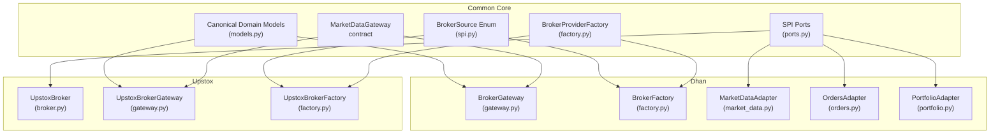
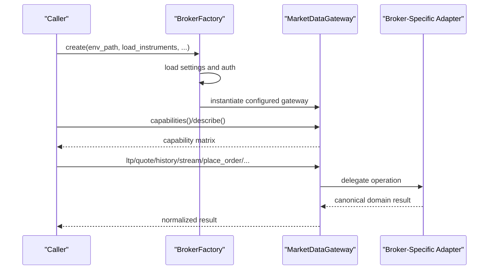
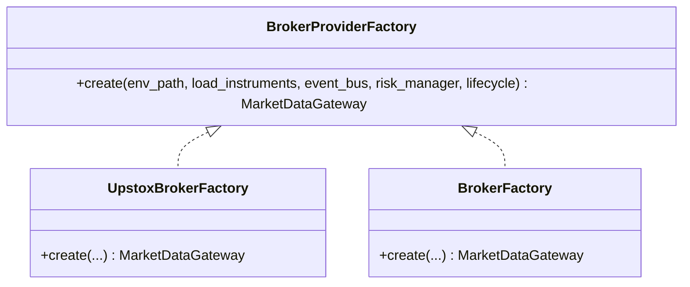
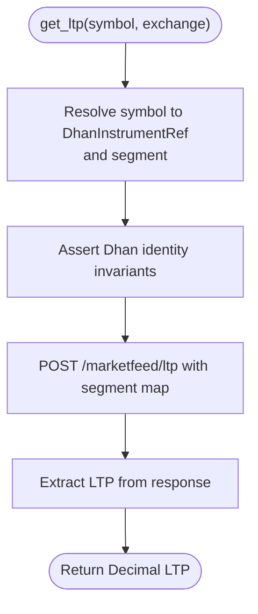
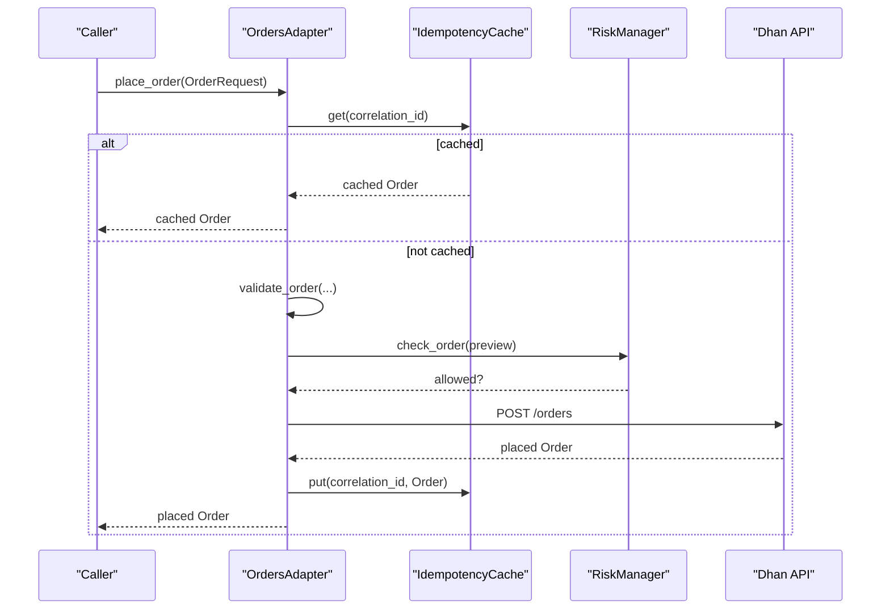
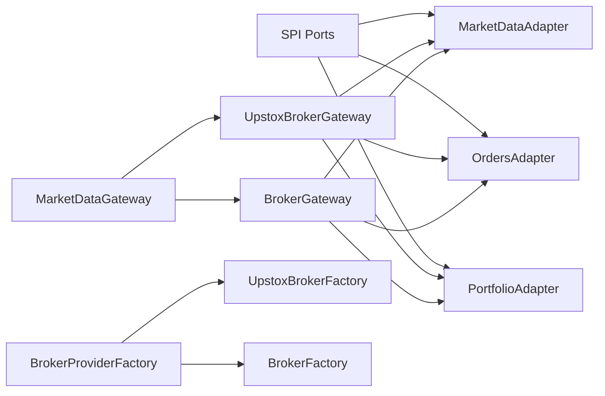

# Custom Broker Development

<cite>
**Referenced Files in This Document**
- [gateway.py](file://brokers/common/gateway.py)
- [factory.py](file://brokers/common/factory.py)
- [spi.py](file://brokers/common/api/spi.py)
- [ports.py](file://brokers/common/api/ports.py)
- [domain.py](file://brokers/common/core/domain.py)
- [broker.py](file://brokers/upstox/broker.py)
- [factory.py](file://brokers/upstox/factory.py)
- [gateway.py](file://brokers/upstox/gateway.py)
- [factory.py](file://brokers/dhan/factory.py)
- [gateway.py](file://brokers/dhan/gateway.py)
- [market_data.py](file://brokers/dhan/market_data.py)
- [orders.py](file://brokers/dhan/orders.py)
- [portfolio.py](file://brokers/dhan/portfolio.py)
- [models.py](file://brokers/common/core/models.py)
</cite>

## Table of Contents
1. [Introduction](#introduction)
2. [Project Structure](#project-structure)
3. [Core Components](#core-components)
4. [Architecture Overview](#architecture-overview)
5. [Detailed Component Analysis](#detailed-component-analysis)
6. [Dependency Analysis](#dependency-analysis)
7. [Performance Considerations](#performance-considerations)
8. [Troubleshooting Guide](#troubleshooting-guide)
9. [Conclusion](#conclusion)
10. [Appendices](#appendices)

## Introduction
This document explains how to develop custom broker integrations using the adapter pattern and the broker-agnostic gateway contract. It covers:
- Implementing MarketDataGateway interface compliance
- Service provider interface (SPI) and capability declarations
- Factory pattern for dynamic broker instantiation and configuration
- Domain model mapping between broker-specific data and canonical types
- Instrument loading and symbol resolution
- Real-time streaming (WebSocket/HTTP) with error handling and retries
- Authentication flows for multiple schemes
- Practical examples for market data, order management, and portfolio adapters
- Common development challenges and testing strategies
- Performance optimization, memory management, and thread safety guidelines

## Project Structure
The broker integration framework is organized around a common core and broker-specific adapters:
- Common core defines the gateway contract, canonical domain models, SPI ports, and factories
- Broker implementations (e.g., Upstox, Dhan) implement the gateway and expose adapters for market data, orders, portfolio, and streaming
- Factories encapsulate configuration, authentication, and lifecycle wiring

**Diagram sources**
- [gateway.py:115-368](file://brokers/common/gateway.py#L115-L368)
- [ports.py:85-518](file://brokers/common/api/ports.py#L85-L518)
- [models.py:69-546](file://brokers/common/core/models.py#L69-L546)
- [factory.py:16-44](file://brokers/common/factory.py#L16-L44)
- [spi.py:14-22](file://brokers/common/api/spi.py#L14-L22)
- [broker.py:99-312](file://brokers/upstox/broker.py#L99-L312)
- [gateway.py:55-611](file://brokers/upstox/gateway.py#L55-L611)
- [factory.py:26-82](file://brokers/upstox/factory.py#L26-L82)
- [gateway.py:43-710](file://brokers/dhan/gateway.py#L43-L710)
- [factory.py:30-416](file://brokers/dhan/factory.py#L30-L416)
- [market_data.py:17-168](file://brokers/dhan/market_data.py#L17-L168)
- [orders.py:93-662](file://brokers/dhan/orders.py#L93-L662)
- [portfolio.py:17-101](file://brokers/dhan/portfolio.py#L17-L101)

**Section sources**
- [gateway.py:1-437](file://brokers/common/gateway.py#L1-L437)
- [ports.py:1-518](file://brokers/common/api/ports.py#L1-L518)
- [models.py:1-546](file://brokers/common/core/models.py#L1-L546)
- [factory.py:1-45](file://brokers/common/factory.py#L1-L45)
- [spi.py:1-22](file://brokers/common/api/spi.py#L1-L22)
- [broker.py:1-312](file://brokers/upstox/broker.py#L1-L312)
- [gateway.py:1-611](file://brokers/upstox/gateway.py#L1-L611)
- [factory.py:1-82](file://brokers/upstox/factory.py#L1-L82)
- [gateway.py:1-710](file://brokers/dhan/gateway.py#L1-L710)
- [factory.py:1-416](file://brokers/dhan/factory.py#L1-L416)
- [market_data.py:1-168](file://brokers/dhan/market_data.py#L1-L168)
- [orders.py:1-662](file://brokers/dhan/orders.py#L1-L662)
- [portfolio.py:1-101](file://brokers/dhan/portfolio.py#L1-L101)

## Core Components
- MarketDataGateway: The single broker-agnostic contract that all broker adapters must implement. It defines market data, batch operations, trading, portfolio, instrument, and lifecycle methods.
- BrokerCapabilities: A frozen capability matrix returned by gateway.capabilities() to declare supported features (timeframes, depth levels, order types, streaming, etc.).
- SPI Ports: Fine-grained capability contracts (OrderCommand, OrderQuery, MarketDataProvider, PortfolioProvider, etc.) that adapters implement internally.
- Canonical Domain Models: Shared dataclasses (Order, Position, Holding, Trade, Quote, MarketDepth, Balance) ensuring consistent data across brokers.
- BrokerProviderFactory: Abstract factory interface for creating configured gateway instances with environment-driven configuration and lifecycle integration.
- BrokerSource Enum: Identifies broker providers (e.g., dhan, upstox, paper).

Implementation highlights:
- Gateway methods enforce canonical return types and schemas (e.g., DataFrame with standardized columns for history).
- ObservabilityProvider enables decoupled exposure of broker-specific observability metrics.
- SPI ports allow modular composition of capabilities; adapters combine ports into a cohesive facade.

**Section sources**
- [gateway.py:115-368](file://brokers/common/gateway.py#L115-L368)
- [gateway.py:42-108](file://brokers/common/gateway.py#L42-L108)
- [ports.py:85-518](file://brokers/common/api/ports.py#L85-L518)
- [models.py:69-546](file://brokers/common/core/models.py#L69-L546)
- [factory.py:16-44](file://brokers/common/factory.py#L16-L44)
- [spi.py:14-22](file://brokers/common/api/spi.py#L14-L22)

## Architecture Overview
The integration architecture follows the adapter pattern:
- A broker-specific facade (e.g., UpstoxBrokerGateway, BrokerGateway) implements MarketDataGateway
- Internally, the facade composes specialized adapters (market data, orders, portfolio, streaming)
- Factories configure authentication, token management, lifecycle, and WebSocket services
- SPI ports define capability contracts; adapters implement them to fulfill gateway methods

**Diagram sources**
- [factory.py:30-240](file://brokers/dhan/factory.py#L30-L240)
- [gateway.py:43-170](file://brokers/dhan/gateway.py#L43-L170)
- [factory.py:26-82](file://brokers/upstox/factory.py#L26-L82)
- [gateway.py:55-114](file://brokers/upstox/gateway.py#L55-L114)

## Detailed Component Analysis

### MarketDataGateway Compliance
Key responsibilities:
- Market data: ltp, quote, depth, history, option_chain, future_chain, stream
- Batch operations: ltp_batch, quote_batch, history_batch
- Trading: place_order, cancel_order, get_orderbook, get_trade_book
- Portfolio: positions, holdings, funds, trades
- Instrument: search, load_instruments
- Lifecycle: capabilities, describe, close

Guidelines:
- Always return canonical types (DataFrame for history, domain models for quotes/depth/orders)
- Normalize broker-specific fields to canonical enums/types
- Implement capabilities() to reflect actual broker support
- Provide structured error responses (OrderResponse) instead of raising for non-existent or already-cancelled orders

**Section sources**
- [gateway.py:115-368](file://brokers/common/gateway.py#L115-L368)

### SPI and Port-Based Design
SPI ports decompose capabilities into focused interfaces:
- MarketDataProvider: quote, ltp, depth, history
- OrderCommand/OrderQuery: order lifecycle and trade queries
- PortfolioProvider: positions, holdings, funds
- OptionsProvider/FuturesProvider: derivatives chains
- Additional ports for advanced features (GTT, brackets, market intelligence, kill switch, static IP)

Adoption pattern:
- Broker facades compose adapters that implement these ports
- The facade aggregates port results into MarketDataGateway responses

**Section sources**
- [ports.py:85-518](file://brokers/common/api/ports.py#L85-L518)

### Factory Pattern and Dynamic Instantiation
Factories encapsulate:
- Environment-driven configuration loading
- Authentication setup (e.g., TOTP, token managers, circuit breakers)
- Lifecycle integration (auto-registering WebSocket services)
- Instrument loading and gateway initialization

Examples:
- UpstoxBrokerFactory: loads settings, connects broker, wires WebSocket lifecycle, optionally loads instruments
- BrokerFactory (Dhan): sets up AuthManager, HTTP client with circuit breakers, connection, token scheduler, and auto-registers services

**Diagram sources**
- [factory.py:16-44](file://brokers/common/factory.py#L16-L44)
- [factory.py:26-82](file://brokers/upstox/factory.py#L26-L82)
- [factory.py:30-416](file://brokers/dhan/factory.py#L30-L416)

**Section sources**
- [factory.py:1-45](file://brokers/common/factory.py#L1-L45)
- [factory.py:1-82](file://brokers/upstox/factory.py#L1-L82)
- [factory.py:1-416](file://brokers/dhan/factory.py#L1-L416)

### Domain Model Mapping
Canonical models unify broker outputs:
- Order, Position, Holding, Trade, Quote, MarketDepth, Balance
- FieldMapping protocol enables broker-specific field name normalization
- Status normalization via StatusMapperRegistry ensures consistent order states

Practical steps:
- Implement FieldMapping for the broker
- Use Order.from_broker_dict() to parse broker responses into canonical Order
- Map exchange segments and enums consistently

**Section sources**
- [models.py:69-546](file://brokers/common/core/models.py#L69-L546)
- [orders.py:477-514](file://brokers/dhan/orders.py#L477-L514)

### Instrument Loading and Symbol Resolution
Strategies:
- Load instrument master from cache or remote endpoint
- Register definitions into an in-memory resolver
- Resolve symbols/exchanges to broker-specific identifiers (security_id, segment)

Patterns:
- UpstoxBrokerGateway.load_instruments() downloads and registers instrument definitions
- Dhan MarketDataAdapter resolves symbols to DhanInstrumentRef and validates identity invariants

**Section sources**
- [gateway.py:190-220](file://brokers/upstox/gateway.py#L190-L220)
- [market_data.py:23-31](file://brokers/dhan/market_data.py#L23-L31)

### Real-Time Streaming and Connection Management
Approaches:
- WebSocket multiplexers with auto-reconnect and subscription limits
- Event bus integration for tick routing and lifecycle management
- Dedicated feeds for depth (20/200 levels) with fallback to REST snapshots

Dhan specifics:
- Market feed lifecycle via connection.create_market_feed()
- Depth 20/200 feeds created on demand with instrument-specific subscriptions
- Token refresh broadcast to all receivers

Upstox specifics:
- MarketDataV3Multiplexer with authorizer, decoder, and auto-reconnect
- StreamManagerAdapter coordinates subscriptions and deduplicates callbacks

**Section sources**
- [gateway.py:447-574](file://brokers/dhan/gateway.py#L447-L574)
- [gateway.py:190-314](file://brokers/dhan/gateway.py#L190-L314)
- [gateway.py:460-505](file://brokers/upstox/gateway.py#L460-L505)
- [broker.py:186-226](file://brokers/upstox/broker.py#L186-L226)

### Authentication Flows
Dhan:
- AuthManager with TOTP token generation and JSON state store
- TokenRefreshScheduler updates HTTP client and broadcasts token to receivers
- Circuit breakers separate read/write/admin endpoints

Upstox:
- OAuth-like configuration via UpstoxConnectionSettings and token manager
- WebSocket lifecycle auto-wiring through lifecycle manager

**Section sources**
- [factory.py:55-238](file://brokers/dhan/factory.py#L55-L238)
- [factory.py:26-82](file://brokers/upstox/factory.py#L26-L82)

### Practical Adapter Examples

#### Market Data Adapter (Dhan)
Responsibilities:
- LTP, Quote, Depth retrieval via HTTP client
- Batch LTP and Quote using segment-aware payloads
- Identity enforcement to ensure Dhan-only contracts

**Diagram sources**
- [market_data.py:33-52](file://brokers/dhan/market_data.py#L33-L52)

**Section sources**
- [market_data.py:17-168](file://brokers/dhan/market_data.py#L17-L168)

#### Orders Adapter (Dhan)
Responsibilities:
- Pre-trade validation (quantity, product type, price)
- Idempotency cache keyed by correlation_id
- Risk checks via external RiskManager
- Structured order placement, modification, cancellation
- Trade history retrieval

**Diagram sources**
- [orders.py:182-304](file://brokers/dhan/orders.py#L182-L304)

**Section sources**
- [orders.py:93-662](file://brokers/dhan/orders.py#L93-L662)

#### Portfolio Adapter (Dhan)
Responsibilities:
- Positions, holdings, and balance retrieval
- Exchange and product type parsing from segments

**Section sources**
- [portfolio.py:17-101](file://brokers/dhan/portfolio.py#L17-L101)

#### Upstox Broker Facade
Responsibilities:
- Compose adapters for market data, historical, symbol resolution, streaming, orders, and portfolio
- Expose extended capabilities beyond MarketDataGateway
- Manage instrument loading and resolver registration

**Section sources**
- [broker.py:99-312](file://brokers/upstox/broker.py#L99-L312)
- [gateway.py:73-114](file://brokers/upstox/gateway.py#L73-L114)

## Dependency Analysis
Key relationships:
- MarketDataGateway is the central contract; all broker gateways implement it
- SPI ports define capability contracts; adapters implement them
- Factories depend on settings loaders, auth managers, and lifecycle managers
- Gateways depend on adapters; adapters depend on HTTP clients and identity/resolver providers

**Diagram sources**
- [gateway.py:115-368](file://brokers/common/gateway.py#L115-L368)
- [ports.py:85-518](file://brokers/common/api/ports.py#L85-L518)
- [factory.py:16-44](file://brokers/common/factory.py#L16-L44)
- [gateway.py:55-114](file://brokers/upstox/gateway.py#L55-L114)
- [gateway.py:43-170](file://brokers/dhan/gateway.py#L43-L170)

**Section sources**
- [gateway.py:1-437](file://brokers/common/gateway.py#L1-L437)
- [ports.py:1-518](file://brokers/common/api/ports.py#L1-L518)
- [factory.py:1-45](file://brokers/common/factory.py#L1-L45)
- [gateway.py:1-611](file://brokers/upstox/gateway.py#L1-L611)
- [gateway.py:1-710](file://brokers/dhan/gateway.py#L1-L710)

## Performance Considerations
- Batch operations: leverage ltp_batch, quote_batch, history_batch to reduce overhead
- Parallel history fetching: ThreadPoolExecutor-based batching in BrokerGateway
- Token refresh coordination: avoid concurrent refresh attempts with locks; broadcast refreshed tokens to all receivers
- Circuit breakers: separate read/write/admin endpoints to prevent cascading failures
- Connection pooling and lifecycle: auto-register WebSocket services with lifecycle managers for deterministic startup/shutdown

[No sources needed since this section provides general guidance]

## Troubleshooting Guide
Common issues and resolutions:
- Order cancellation returns unexpected dict: ensure success detection uses broker-provided status fields, not arbitrary dict presence
- Missing LTP/depth data: verify identity invariants and segment mapping; log available keys for diagnosis
- Stream race conditions: use stream locks and registry deduplication to prevent duplicate subscriptions
- Token refresh conflicts: synchronize via shared locks; broadcast refreshed tokens to all receivers
- WebSocket connectivity: confirm lifecycle registration and auto-reconnect configuration

**Section sources**
- [orders.py:356-410](file://brokers/dhan/orders.py#L356-L410)
- [market_data.py:44-49](file://brokers/dhan/market_data.py#L44-L49)
- [gateway.py:477-522](file://brokers/dhan/gateway.py#L477-L522)
- [factory.py:255-266](file://brokers/dhan/factory.py#L255-L266)
- [gateway.py:486-504](file://brokers/upstox/gateway.py#L486-L504)

## Conclusion
By adhering to the adapter pattern and the MarketDataGateway contract, developers can implement robust, testable broker integrations. The SPI port decomposition promotes modularity, while factories and lifecycle managers simplify configuration and observability. Canonical domain models and strict error handling ensure consistent behavior across brokers. Following the patterns demonstrated by Upstox and Dhan adapters will accelerate development and improve reliability.

[No sources needed since this section summarizes without analyzing specific files]

## Appendices

### Step-by-Step: Implementing a New Broker Adapter
1. Define SPI ports for required capabilities (market data, orders, portfolio, streaming)
2. Implement MarketDataGateway in a gateway class; delegate to composed adapters
3. Create a BrokerProviderFactory subclass to handle configuration, auth, and lifecycle
4. Implement instrument loading and symbol resolution using a resolver
5. Integrate streaming with WebSocket multiplexer and lifecycle management
6. Map broker-specific responses to canonical domain models using FieldMapping
7. Declare capabilities() and describe() to expose supported features
8. Add observability via ObservabilityProvider methods
9. Write tests validating gateway compliance and adapter behavior

**Section sources**
- [ports.py:85-518](file://brokers/common/api/ports.py#L85-L518)
- [gateway.py:115-368](file://brokers/common/gateway.py#L115-L368)
- [factory.py:16-44](file://brokers/common/factory.py#L16-L44)
- [models.py:69-546](file://brokers/common/core/models.py#L69-L546)