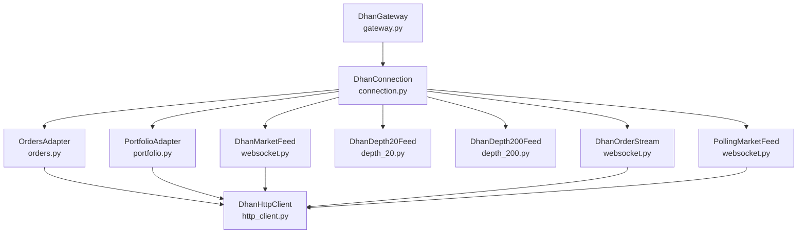
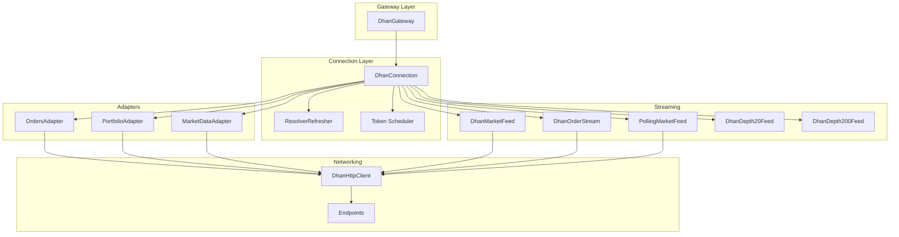
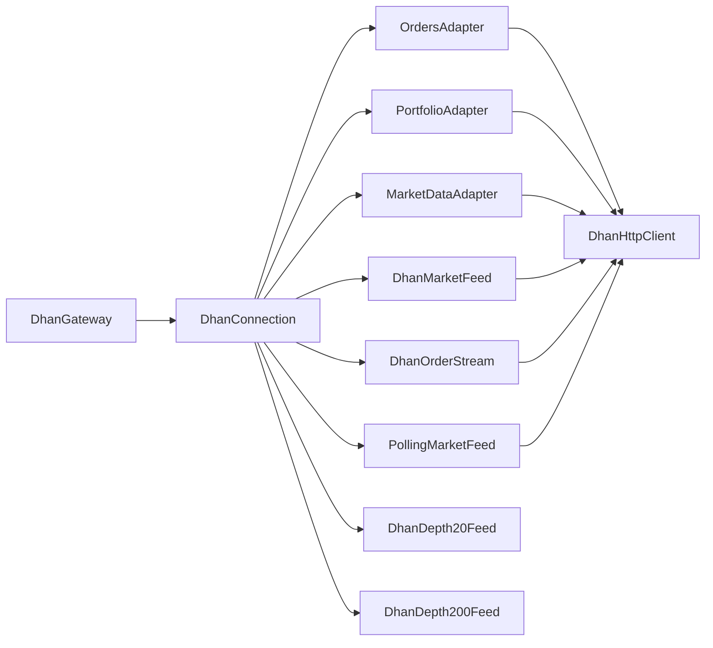

# DhanHQ Integration

<cite>
**Referenced Files in This Document**
- [gateway.py](file://brokers/dhan/gateway.py)
- [websocket.py](file://brokers/dhan/websocket.py)
- [http_client.py](file://brokers/dhan/http_client.py)
- [depth_20.py](file://brokers/dhan/depth_20.py)
- [depth_200.py](file://brokers/dhan/depth_200.py)
- [depth_feed_base.py](file://brokers/dhan/depth_feed_base.py)
- [orders.py](file://brokers/dhan/orders.py)
- [portfolio.py](file://brokers/dhan/portfolio.py)
- [connection.py](file://brokers/dhan/connection.py)
- [settings.py](file://config/dhan-sandbox.properties.example)
- [endpoints.py](file://config/endpoints.py)
</cite>

## Table of Contents
1. [Introduction](#introduction)
2. [Project Structure](#project-structure)
3. [Core Components](#core-components)
4. [Architecture Overview](#architecture-overview)
5. [Detailed Component Analysis](#detailed-component-analysis)
6. [Dependency Analysis](#dependency-analysis)
7. [Performance Considerations](#performance-considerations)
8. [Troubleshooting Guide](#troubleshooting-guide)
9. [Conclusion](#conclusion)
10. [Appendices](#appendices)

## Introduction
This document provides a comprehensive guide to integrating DhanHQ as a broker within the system. It focuses on the DhanGateway adapter and its WebSocket services (DhanMarketFeed, DhanOrderStream, PollingMarketFeed), the HTTP client with rate limiting and circuit breaker patterns, market data handling (depth 20 and depth 200), order management, portfolio adapter, authentication and token refresh, connection management, and reconnection strategies. Practical examples and troubleshooting advice are included to address common integration issues such as connection drops, rate limits, and data consistency.

## Project Structure
The Dhan integration is implemented under the brokers/dhan package and integrates with shared components such as the HTTP client, resilience utilities, and lifecycle management. Key areas include:
- Gateway and adapters for orders, market data, portfolio, and streaming
- WebSocket services for real-time market data and order updates
- Binary depth feeds for depth-20 and depth-200 levels
- HTTP client with rate limiting, retries, and circuit breakers
- Connection orchestration and token refresh coordination

**Diagram sources**
- [gateway.py:43-701](file://brokers/dhan/gateway.py#L43-L701)
- [connection.py:65-593](file://brokers/dhan/connection.py#L65-L593)
- [http_client.py:100-365](file://brokers/dhan/http_client.py#L100-L365)
- [websocket.py:143-1181](file://brokers/dhan/websocket.py#L143-L1181)
- [depth_20.py:24-88](file://brokers/dhan/depth_20.py#L24-L88)
- [depth_200.py:28-122](file://brokers/dhan/depth_200.py#L28-L122)
- [orders.py:93-662](file://brokers/dhan/orders.py#L93-L662)
- [portfolio.py:17-101](file://brokers/dhan/portfolio.py#L17-L101)

**Section sources**
- [gateway.py:1-701](file://brokers/dhan/gateway.py#L1-L701)
- [connection.py:1-593](file://brokers/dhan/connection.py#L1-L593)

## Core Components
- DhanGateway: Unified API facade delegating to connection adapters. Provides order placement, market data retrieval, depth feeds, historical data, options/futures chains, portfolio balances, positions, holdings, and streaming tick management. Implements observability for connection status, circuit breaker states, and token refresh metrics.
- DhanConnection: Wires adapters, manages lifecycle, creates and registers streaming services, coordinates token receivers, and orchestrates instrument loading and resolver refresher.
- DhanHttpClient: Sync HTTP client with token refresh, retry logic, adaptive rate limiting, and category-specific circuit breakers (read/write/admin).
- Streaming Services:
  - DhanMarketFeed: Real-time market data via SDK MarketFeed with reconnect/backfill, strict-mode tick/depth publishing, and health metrics.
  - DhanOrderStream: Real-time order updates via SDK OrderUpdate with reconnect/backoff and health metrics.
  - PollingMarketFeed: REST polling fallback for LTP with managed lifecycle and health.
- Depth Feeds:
  - DhanDepth20Feed: 20-level depth via WebSocket with up to 50 instruments per connection.
  - DhanDepth200Feed: 200-level depth via WebSocket with a single instrument per connection.
- OrdersAdapter: Place, modify, cancel orders with pre-trade validation, idempotency, risk checks, and structured logging.
- PortfolioAdapter: Positions, holdings, and balance retrieval.

**Section sources**
- [gateway.py:43-701](file://brokers/dhan/gateway.py#L43-L701)
- [connection.py:65-593](file://brokers/dhan/connection.py#L65-L593)
- [http_client.py:100-365](file://brokers/dhan/http_client.py#L100-L365)
- [websocket.py:143-1181](file://brokers/dhan/websocket.py#L143-L1181)
- [depth_20.py:24-88](file://brokers/dhan/depth_20.py#L24-L88)
- [depth_200.py:28-122](file://brokers/dhan/depth_200.py#L28-L122)
- [orders.py:93-662](file://brokers/dhan/orders.py#L93-L662)
- [portfolio.py:17-101](file://brokers/dhan/portfolio.py#L17-L101)

## Architecture Overview
The integration follows a layered architecture:
- Gateway layer (DhanGateway) exposes a broker-agnostic interface and delegates to connection adapters.
- Connection layer (DhanConnection) instantiates and wires adapters, manages lifecycle, and coordinates token refresh.
- Adapters encapsulate broker-specific logic:
  - OrdersAdapter for order lifecycle
  - MarketDataAdapter for REST market data
  - PortfolioAdapter for positions/holdings/balance
- Streaming layer provides real-time data via WebSocket and polling fallback.
- HTTP client enforces rate limits, retries, and circuit breakers per endpoint category.

**Diagram sources**
- [gateway.py:43-701](file://brokers/dhan/gateway.py#L43-L701)
- [connection.py:65-593](file://brokers/dhan/connection.py#L65-L593)
- [http_client.py:100-365](file://brokers/dhan/http_client.py#L100-L365)
- [websocket.py:143-1181](file://brokers/dhan/websocket.py#L143-L1181)
- [depth_20.py:24-88](file://brokers/dhan/depth_20.py#L24-L88)
- [depth_200.py:28-122](file://brokers/dhan/depth_200.py#L28-L122)
- [orders.py:93-662](file://brokers/dhan/orders.py#L93-L662)
- [portfolio.py:17-101](file://brokers/dhan/portfolio.py#L17-L101)
- [endpoints.py](file://config/endpoints.py)

## Detailed Component Analysis

### DhanGateway
Responsibilities:
- Order lifecycle: place_order, cancel_order, get_orderbook, get_trade_book
- Market data: ltp, quote, depth, depth_20, depth_200, history, option_chain, future_chain
- Portfolio: funds, positions, holdings, trades
- Streaming: stream, unstream with deduplication and mode tracking
- Observability: connection status, circuit breaker states, token refresh metrics
- Capabilities: comprehensive broker capability matrix including depth feeds, order types, product types, validities, and advanced features

Key behaviors:
- Validates exchange segments for depth feeds and raises ValueError for unsupported exchanges
- Lazily creates and manages streaming feeds via DhanConnection
- Translates gateway calls to adapter invocations and normalizes responses

**Section sources**
- [gateway.py:43-701](file://brokers/dhan/gateway.py#L43-L701)

### DhanConnection
Responsibilities:
- Instantiates adapters and identity provider
- Creates and registers streaming services (DhanMarketFeed, DhanOrderStream, PollingMarketFeed, DhanDepth20Feed, DhanDepth200Feed)
- Manages token receivers and broadcasts refreshed tokens to all services
- Orchestrates resolver refresher and lifecycle management
- Provides accessors for adapters and feeds

Lifecycle management:
- Registers services with LifecycleManager for deterministic shutdown
- Stops all ManagedServices on close with thread joining

**Section sources**
- [connection.py:65-593](file://brokers/dhan/connection.py#L65-L593)

### DhanMarketFeed (Real-time Market Data)
Features:
- Wraps SDK MarketFeed with reconnect/backoff and optional backfill on reconnection
- Strict-mode tick/depth publishing with counters for published/dropped events
- Converts SDK messages to canonical Quote/MarketDepth and publishes DomainEvents
- Tracks last tick time per symbol for gap detection and cleanup
- Supports LTP/Quote/FULL modes mapped to SDK constants

Reconnection and backfill:
- Resets backoff on clean disconnect
- Calls backfill callback with gap duration to fill missed bars

Health monitoring:
- Exposes ManagedService health with reconnect counts, thread status, and message counters

**Section sources**
- [websocket.py:143-764](file://brokers/dhan/websocket.py#L143-L764)

### DhanOrderStream (Real-time Order Updates)
Features:
- Wraps SDK OrderUpdate for order alerts
- Strict reconnect/backoff with shared reconnect state
- Transforms SDK order data to canonical Order and publishes ORDER_UPDATED and TRADE events when filled

Health monitoring:
- ManagedService health with reconnect counts, thread status, and message counters

**Section sources**
- [websocket.py:765-1024](file://brokers/dhan/websocket.py#L765-L1024)

### PollingMarketFeed (REST Polling Fallback)
Features:
- Polls /marketfeed/ltp at configurable intervals
- Dispatches quote callbacks with symbol resolution
- ManagedService lifecycle with health reporting

**Section sources**
- [websocket.py:1026-1181](file://brokers/dhan/websocket.py#L1026-L1181)

### Depth Feeds (Binary WebSocket)
Shared implementation:
- BinaryDepthFeed parses binary depth packets, merges bids/asks per security_id, and publishes DEPTH events
- Supports two variants:
  - DhanDepth20Feed: up to 50 instruments, header carries security_id
  - DhanDepth200Feed: single instrument, header carries row count; security_id resolved from subscription

Reconnection and reliability:
- Async WebSocket loop with exponential backoff
- Subscription messages sent via asyncio.run_coroutine_threadsafe with done-callbacks
- Strict parsing and error handling with dropped packet counters

**Section sources**
- [depth_feed_base.py:55-667](file://brokers/dhan/depth_feed_base.py#L55-L667)
- [depth_20.py:24-88](file://brokers/dhan/depth_20.py#L24-L88)
- [depth_200.py:28-122](file://brokers/dhan/depth_200.py#L28-L122)

### HTTP Client with Rate Limiting and Circuit Breakers
Features:
- Token refresh with cooldown and callback injection
- Category-based circuit breakers (read/write/admin) to isolate failure domains
- Adaptive rate limiting with endpoint prefix matching
- Retry logic with exponential backoff for transient errors
- Request throttling per endpoint with configurable intervals
- Robust error handling for 401, 429, 5xx, and API failures

Endpoint categorization:
- Read: market data endpoints (e.g., /marketfeed/*, /charts/*, /optionchain)
- Write: order endpoints (e.g., /orders)
- Admin: account state and auth endpoints

**Section sources**
- [http_client.py:100-365](file://brokers/dhan/http_client.py#L100-L365)

### Orders Adapter
Features:
- Pre-trade validation (quantity, price, product type, lot size)
- Idempotency cache keyed by correlation_id with TTL
- Risk checks via RiskManager
- Payload building and response parsing with field mapping
- Modify/cancel order operations with robust error handling
- Slice order support and trade history retrieval

**Section sources**
- [orders.py:93-662](file://brokers/dhan/orders.py#L93-L662)

### Portfolio Adapter
Features:
- Positions: net quantity, average price, LTP, realized/unrealized PnL, product type
- Holdings: total/current quantities, average cost, LTP, computed PnL
- Balance: available, SoD limit, collateral, utilized, withdrawable

**Section sources**
- [portfolio.py:17-101](file://brokers/dhan/portfolio.py#L17-L101)

### Authentication and Token Refresh
- DhanConnection maintains a token receiver registry and broadcasts refreshed tokens to all services
- Token refresh scheduler invokes broadcast_token on refresh events
- Services update their internal tokens via update_token hooks

**Section sources**
- [connection.py:462-506](file://brokers/dhan/connection.py#L462-L506)

### Connection Management and Reconnection Strategies
- ManagedService lifecycle ensures threads are joined on stop/close
- DhanMarketFeed and DhanOrderStream implement reconnect/backoff with shared state
- Binary depth feeds use async loops with exponential backoff
- PollingMarketFeed runs on a dedicated thread with periodic polling

**Section sources**
- [websocket.py:233-346](file://brokers/dhan/websocket.py#L233-L346)
- [websocket.py:815-861](file://brokers/dhan/websocket.py#L815-L861)
- [depth_feed_base.py:331-416](file://brokers/dhan/depth_feed_base.py#L331-L416)
- [connection.py:558-593](file://brokers/dhan/connection.py#L558-L593)

## Dependency Analysis
The Dhan integration exhibits clear separation of concerns:
- Gateway depends on Connection for adapter access
- Connection depends on HTTP client and resolver for adapters
- Adapters depend on HTTP client for REST calls
- Streaming services depend on HTTP client for token refresh and optional backfill
- Depth feeds depend on binary packet parsing and async WebSocket libraries

**Diagram sources**
- [gateway.py:43-701](file://brokers/dhan/gateway.py#L43-L701)
- [connection.py:65-593](file://brokers/dhan/connection.py#L65-L593)
- [http_client.py:100-365](file://brokers/dhan/http_client.py#L100-L365)
- [websocket.py:143-1181](file://brokers/dhan/websocket.py#L143-L1181)
- [orders.py:93-662](file://brokers/dhan/orders.py#L93-L662)
- [portfolio.py:17-101](file://brokers/dhan/portfolio.py#L17-L101)

**Section sources**
- [gateway.py:43-701](file://brokers/dhan/gateway.py#L43-L701)
- [connection.py:65-593](file://brokers/dhan/connection.py#L65-L593)

## Performance Considerations
- Rate limiting: HTTP client applies static and adaptive intervals per endpoint; adjust intervals for bursty endpoints
- Retries: Exponential backoff reduces load on failing endpoints; combine with jitter for fairness
- Circuit breakers: Isolate read/write/admin domains to prevent cascading failures
- Streaming: Strict-mode publishing avoids false signals; use backfill to minimize gaps on reconnect
- Depth feeds: Binary parsing is efficient; limit instruments per connection to reduce overhead
- Polling fallback: Tune interval to balance freshness and API usage

[No sources needed since this section provides general guidance]

## Troubleshooting Guide
Common issues and resolutions:
- Connection drops:
  - Market data: DhanMarketFeed resets backoff on clean disconnect and backfills gaps via backfill_callback
  - Order updates: DhanOrderStream reconnects with exponential backoff
  - Depth feeds: Async loop reconnects with capped backoff
- Rate limits:
  - HTTP client throttles requests and adapts intervals based on Retry-After; monitor dropped counters
  - Circuit breakers isolate failing endpoints; check category-specific states
- Data consistency:
  - Strict-mode tick/depth publishing drops malformed packets; verify symbol resolution and cache cleanup
  - Depth cache merges bids/asks independently; ensure correct security_id resolution
- Authentication:
  - 401 errors trigger token refresh; ensure token refresh callback is registered and broadcasting
- Token refresh failures:
  - Broadcast failures are logged; verify token scheduler and receiver registration

**Section sources**
- [websocket.py:265-304](file://brokers/dhan/websocket.py#L265-L304)
- [websocket.py:835-861](file://brokers/dhan/websocket.py#L835-L861)
- [depth_feed_base.py:331-416](file://brokers/dhan/depth_feed_base.py#L331-L416)
- [http_client.py:224-242](file://brokers/dhan/http_client.py#L224-L242)
- [connection.py:462-506](file://brokers/dhan/connection.py#L462-L506)

## Conclusion
The Dhan integration provides a robust, resilient, and observable bridge to the Dhan broker. The gateway offers a unified interface, while the connection layer orchestrates adapters, streaming services, and token management. The HTTP client enforces rate limits and isolates failures via circuit breakers. Real-time feeds and polling fallbacks ensure continuous data availability, and strict-mode publishing improves data quality. The order and portfolio adapters encapsulate broker-specific logic with validation, idempotency, and risk controls.

[No sources needed since this section summarizes without analyzing specific files]

## Appendices

### Practical Setup Examples
- Configure endpoints and credentials using the sandbox properties file and endpoints registry.
- Initialize DhanConnection with HTTP client, resolver, event bus, and optional lifecycle manager.
- Create streaming feeds via DhanConnection and register with lifecycle for deterministic shutdown.
- Subscribe to depth feeds and streaming ticks through DhanGateway methods.

**Section sources**
- [settings.py](file://config/dhan-sandbox.properties.example)
- [endpoints.py](file://config/endpoints.py)
- [connection.py:318-460](file://brokers/dhan/connection.py#L318-L460)
- [gateway.py:181-304](file://brokers/dhan/gateway.py#L181-L304)

### Handling Different Market Data Feeds
- Depth 20: Use depth_20 with up to 50 instruments per connection; returns cached depth or falls back to REST snapshot.
- Depth 200: Use depth_200 with a single instrument per connection; validates subscription uniqueness.
- Streaming ticks: Use stream with LTP/Quote/FULL modes; supports callback deduplication and mode tracking.

**Section sources**
- [gateway.py:181-304](file://brokers/dhan/gateway.py#L181-L304)
- [websocket.py:438-566](file://brokers/dhan/websocket.py#L438-L566)
- [depth_20.py:77-88](file://brokers/dhan/depth_20.py#L77-L88)
- [depth_200.py:111-122](file://brokers/dhan/depth_200.py#L111-L122)

### Managing Order Lifecycle
- Place orders with pre-trade validation, idempotency, and risk checks.
- Modify and cancel orders with robust error handling.
- Monitor order updates via DhanOrderStream and ORDER_UPDATED/TRADE events.

**Section sources**
- [orders.py:182-447](file://brokers/dhan/orders.py#L182-L447)
- [websocket.py:933-1024](file://brokers/dhan/websocket.py#L933-L1024)

### Observability and Metrics
- Connection status: market_feed and order_stream connectivity
- Circuit breaker states: CLOSED/OPEN/HALF_OPEN for read/write/admin categories
- Token refresh metrics: refresh count and error presence
- Health snapshots: reconnect counts, thread status, published/dropped counters

**Section sources**
- [gateway.py:604-666](file://brokers/dhan/gateway.py#L604-L666)
- [websocket.py:347-384](file://brokers/dhan/websocket.py#L347-L384)
- [websocket.py:887-922](file://brokers/dhan/websocket.py#L887-L922)
- [depth_feed_base.py:291-327](file://brokers/dhan/depth_feed_base.py#L291-L327)