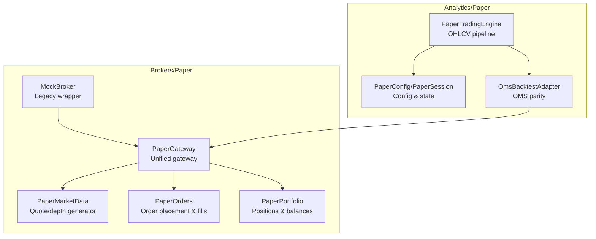
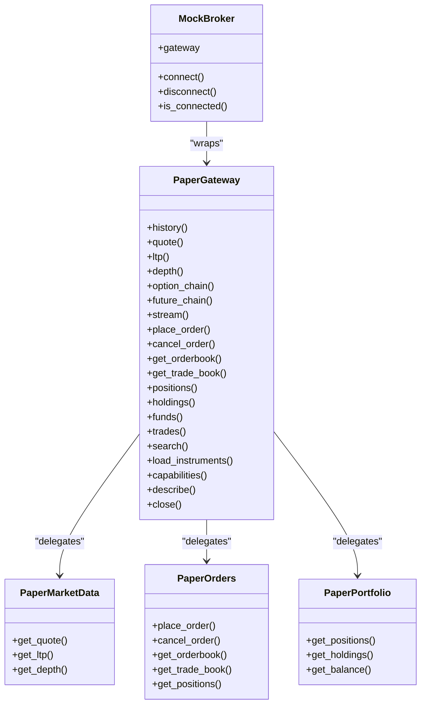
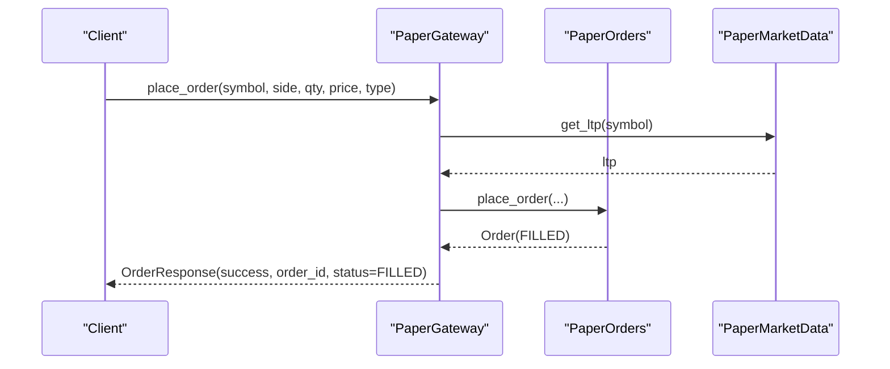
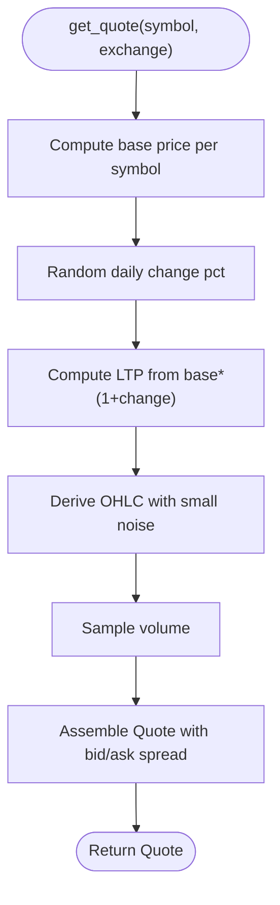
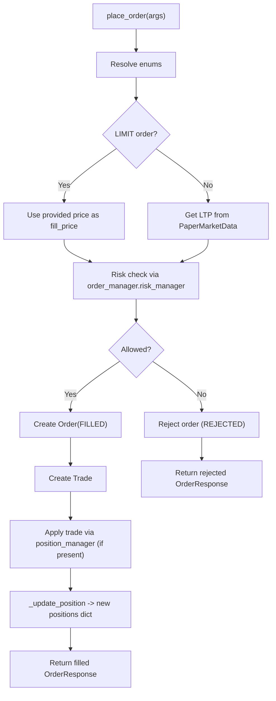
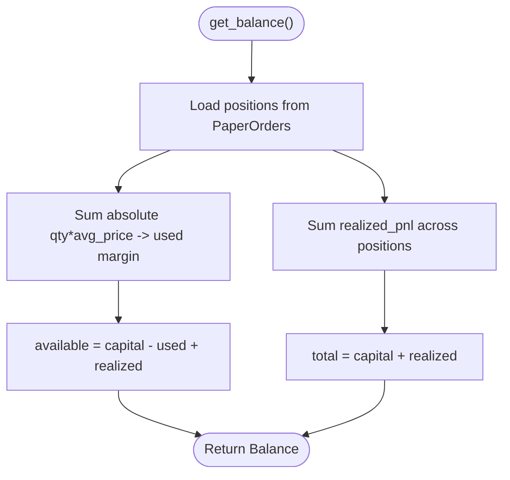
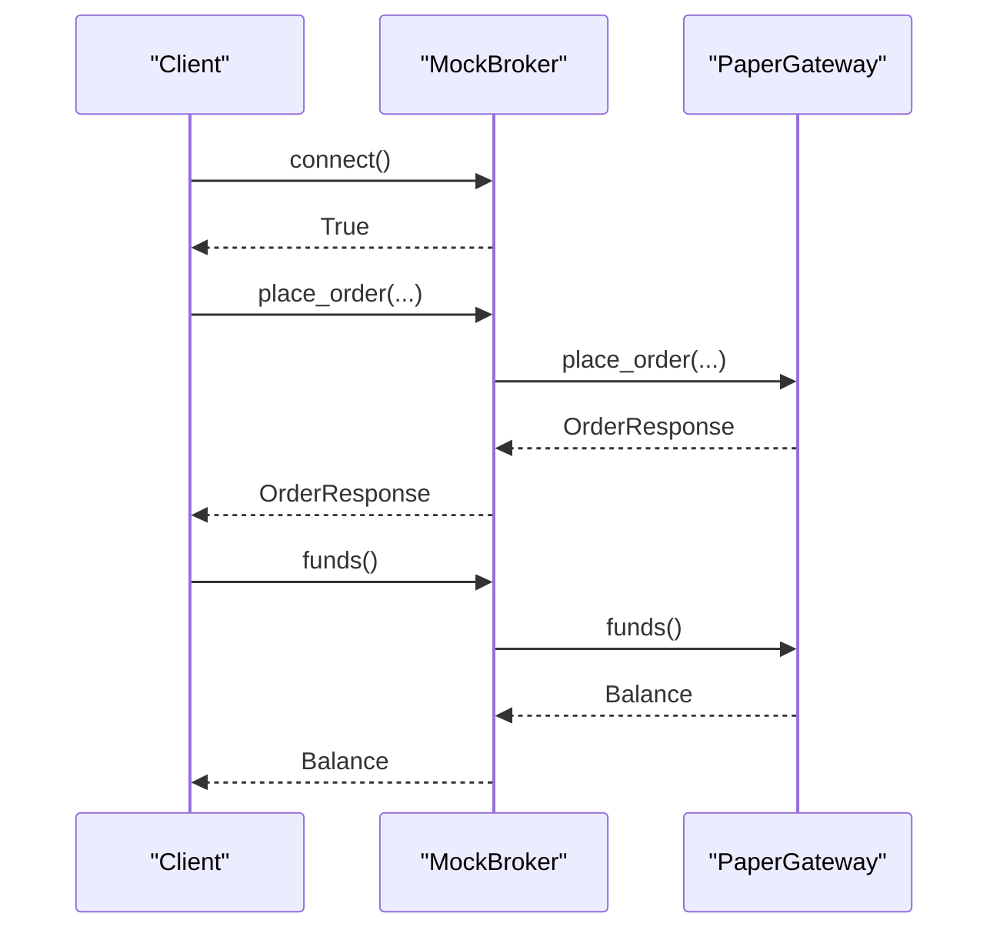
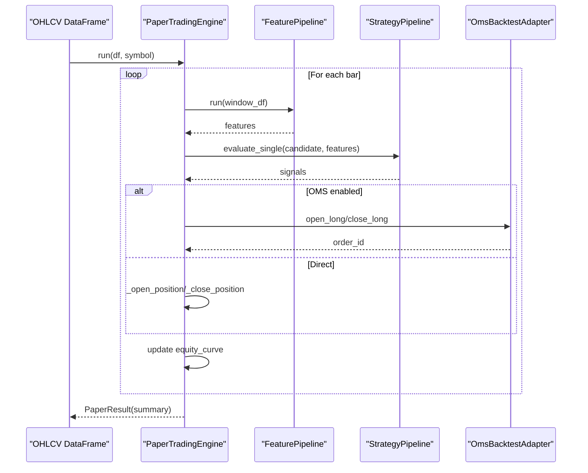
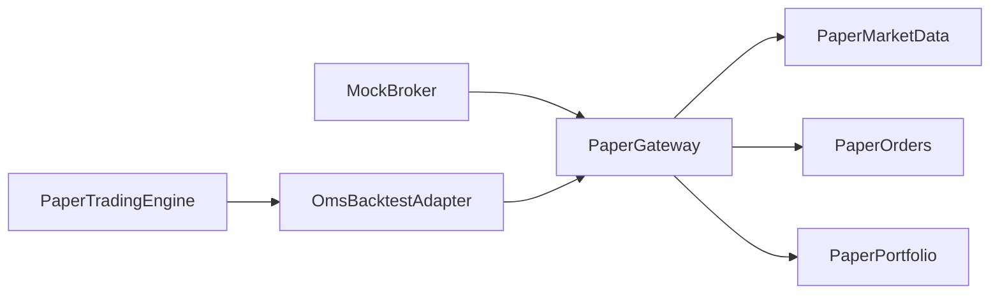

# Paper Trading Simulator

<cite>
**Referenced Files in This Document**
- [paper_gateway.py](file://brokers/paper/paper_gateway.py)
- [paper_market_data.py](file://brokers/paper/paper_market_data.py)
- [paper_orders.py](file://brokers/paper/paper_orders.py)
- [paper_portfolio.py](file://brokers/paper/paper_portfolio.py)
- [mock_broker.py](file://brokers/paper/mock_broker.py)
- [engine.py](file://analytics/paper/engine.py)
- [models.py](file://analytics/paper/models.py)
- [oms_bridge.py](file://analytics/replay/oms_bridge.py)
- [test_paper.py](file://brokers/paper/tests/test_paper.py)
- [test_paper_orders_concurrency.py](file://brokers/paper/tests/test_paper_orders_concurrency.py)
</cite>

## Table of Contents
1. [Introduction](#introduction)
2. [Project Structure](#project-structure)
3. [Core Components](#core-components)
4. [Architecture Overview](#architecture-overview)
5. [Detailed Component Analysis](#detailed-component-analysis)
6. [Dependency Analysis](#dependency-analysis)
7. [Performance Considerations](#performance-considerations)
8. [Troubleshooting Guide](#troubleshooting-guide)
9. [Conclusion](#conclusion)
10. [Appendices](#appendices)

## Introduction
This document describes the paper trading simulator implemented in the repository, focusing on the in-memory trading environment that mirrors real broker behavior without executing live trades. It covers the PaperGateway class as a broker-agnostic simulation layer, the paper market data implementation with realistic price simulation and bid-ask modeling, the paper order management system with instant fills and status updates, and the paper portfolio management with position tracking and PnL calculations. It also documents the mock broker wrapper for backward compatibility, thread-safe state management, configuration options for simulating market conditions, slippage, and latency, and practical usage examples for strategy development, backtesting preparation, and team training. Differences from real trading, simulation limitations, and best practices are addressed to help users set up effective paper trading environments.

## Project Structure
The paper trading simulator is organized into two primary areas:
- brokers/paper: In-memory gateway and adapters for market data, orders, and portfolio
- analytics/paper: High-level paper trading engine that runs strategies against OHLCV data with slippage and commission modeling

**Diagram sources**
- [paper_gateway.py:30-312](file://brokers/paper/paper_gateway.py#L30-L312)
- [paper_market_data.py:12-77](file://brokers/paper/paper_market_data.py#L12-L77)
- [paper_orders.py:24-200](file://brokers/paper/paper_orders.py#L24-L200)
- [paper_portfolio.py:12-45](file://brokers/paper/paper_portfolio.py#L12-L45)
- [mock_broker.py:14-226](file://brokers/paper/mock_broker.py#L14-L226)
- [engine.py:68-640](file://analytics/paper/engine.py#L68-L640)
- [models.py:37-323](file://analytics/paper/models.py#L37-L323)
- [oms_bridge.py:48-178](file://analytics/replay/oms_bridge.py#L48-L178)

**Section sources**
- [paper_gateway.py:30-312](file://brokers/paper/paper_gateway.py#L30-L312)
- [paper_market_data.py:12-77](file://brokers/paper/paper_market_data.py#L12-L77)
- [paper_orders.py:24-200](file://brokers/paper/paper_orders.py#L24-L200)
- [paper_portfolio.py:12-45](file://brokers/paper/paper_portfolio.py#L12-L45)
- [mock_broker.py:14-226](file://brokers/paper/mock_broker.py#L14-L226)
- [engine.py:68-640](file://analytics/paper/engine.py#L68-L640)
- [models.py:37-323](file://analytics/paper/models.py#L37-L323)
- [oms_bridge.py:48-178](file://analytics/replay/oms_bridge.py#L48-L178)

## Core Components
- PaperGateway: A unified, broker-agnostic gateway that exposes market data, order placement/cancellation, order/trade books, positions/holdings/funds, instrument search, and lifecycle methods. Delegates to internal adapters for market data, orders, and portfolio.
- PaperMarketData: Generates realistic quotes and depths with random walk LTP, OHLC modeling, bid-ask spreads, and volume.
- PaperOrders: Simulates order placement with instant fills, risk gating via a central order manager if provided, immutable order updates, and position accumulation.
- PaperPortfolio: Tracks positions and computes balances (available/use/total margins) based on realized/unrealized PnL and current positions.
- MockBroker: Legacy wrapper exposing connect/disconnect and delegating to PaperGateway for backward compatibility.
- PaperTradingEngine: Runs strategies on OHLCV data with slippage and commission, supports single/multi-symbol sessions, and optionally routes signals through OMS for parity.

**Section sources**
- [paper_gateway.py:30-312](file://brokers/paper/paper_gateway.py#L30-L312)
- [paper_market_data.py:12-77](file://brokers/paper/paper_market_data.py#L12-L77)
- [paper_orders.py:24-200](file://brokers/paper/paper_orders.py#L24-L200)
- [paper_portfolio.py:12-45](file://brokers/paper/paper_portfolio.py#L12-L45)
- [mock_broker.py:14-226](file://brokers/paper/mock_broker.py#L14-L226)
- [engine.py:68-640](file://analytics/paper/engine.py#L68-L640)

## Architecture Overview
The paper trading stack consists of:
- Gateway layer (PaperGateway) implementing the MarketDataGateway contract
- Adapters (PaperMarketData, PaperOrders, PaperPortfolio) encapsulating simulation logic
- Optional OMS integration (via OmsBacktestAdapter) for strict execution parity
- Analytics engine (PaperTradingEngine) orchestrating strategy evaluation and simulated fills

**Diagram sources**
- [paper_gateway.py:30-312](file://brokers/paper/paper_gateway.py#L30-L312)
- [paper_market_data.py:12-77](file://brokers/paper/paper_market_data.py#L12-L77)
- [paper_orders.py:24-200](file://brokers/paper/paper_orders.py#L24-L200)
- [paper_portfolio.py:12-45](file://brokers/paper/paper_portfolio.py#L12-L45)
- [mock_broker.py:14-226](file://brokers/paper/mock_broker.py#L14-L226)

## Detailed Component Analysis

### PaperGateway: Broker-Agnostic Simulation Layer
PaperGateway implements a frozen MarketDataGateway v1.0 contract and delegates to adapters:
- Market Data: history, quote, ltp, depth, option_chain, future_chain, stream
- Batch: ltp_batch, quote_batch, history_batch
- Trading: place_order, cancel_order, get_orderbook, get_trade_book
- Portfolio: positions, holdings, funds, trades
- Instrument: search, load_instruments
- Lifecycle: describe, capabilities, close

Key behaviors:
- Initializes with a TradingContext and internal adapters for market data, orders, and portfolio
- Market data methods return synthetic quotes and depths; history generates OHLCV with random walks
- Order placement returns an OrderResponse with status FILLED instantly
- Portfolio methods compute balances from realized/unrealized PnL and current positions
- Capabilities enumerates supported features and constraints for paper trading

**Diagram sources**
- [paper_gateway.py:232-239](file://brokers/paper/paper_gateway.py#L232-L239)
- [paper_orders.py:58-159](file://brokers/paper/paper_orders.py#L58-L159)
- [paper_market_data.py:54-55](file://brokers/paper/paper_market_data.py#L54-L55)

**Section sources**
- [paper_gateway.py:30-312](file://brokers/paper/paper_gateway.py#L30-L312)

### Paper Market Data: Realistic Price and Depth Simulation
PaperMarketData generates:
- Quote with LTP, OHLC, volume, change, bid, ask, timestamp
- MarketDepth with symmetric bid/ask levels around LTP
- Base price per symbol maintained internally for reproducible simulations

Implementation highlights:
- Random walk for LTP with bounded daily change
- OHLC derived from LTP with small noise
- Bid-ask spread modeled as fixed offset from LTP
- Volume sampled from a realistic range

**Diagram sources**
- [paper_market_data.py:23-52](file://brokers/paper/paper_market_data.py#L23-L52)

**Section sources**
- [paper_market_data.py:12-77](file://brokers/paper/paper_market_data.py#L12-L77)

### Paper Orders: Instant Fill Simulation and Thread Safety
PaperOrders simulates order placement with:
- Risk gating via a central order manager’s risk manager if provided
- Instant fills at market price (or limit price for LIMIT orders)
- Immutable order updates and atomic position updates
- Thread-safe operations guarded by an RLock

Key behaviors:
- place_order validates enums, computes fill price, applies risk check, creates Order(FILLED), emits Trade, and updates positions
- cancel_order replaces OPEN orders with CANCELLED immutably
- get_orderbook/get_trade_book/get_positions return snapshots under lock
- _update_position returns a new positions dict (copy-on-write semantics)

**Diagram sources**
- [paper_orders.py:58-159](file://brokers/paper/paper_orders.py#L58-L159)
- [paper_market_data.py:54-55](file://brokers/paper/paper_market_data.py#L54-L55)

**Section sources**
- [paper_orders.py:24-200](file://brokers/paper/paper_orders.py#L24-L200)

### Paper Portfolio: Position Tracking and PnL Calculation
PaperPortfolio computes:
- Positions from PaperOrders
- Holdings as empty list (no external holdings in pure paper mode)
- Balance with available/use/total margins, collateral, and withdrawable amounts based on realized/unrealized PnL and current positions

**Diagram sources**
- [paper_portfolio.py:30-44](file://brokers/paper/paper_portfolio.py#L30-L44)

**Section sources**
- [paper_portfolio.py:12-45](file://brokers/paper/paper_portfolio.py#L12-L45)

### Mock Broker: Legacy Wrapper for Backward Compatibility
MockBroker provides:
- connect()/disconnect()/is_connected() lifecycle
- Delegation to PaperGateway for all trading operations
- Access to portfolio sub-object matching the legacy BrokerGateway.portfolio interface
- Utility to create a seeded broker with realistic orders, trades, positions, and holdings

**Diagram sources**
- [mock_broker.py:47-108](file://brokers/paper/mock_broker.py#L47-L108)
- [paper_gateway.py:260-264](file://brokers/paper/paper_gateway.py#L260-L264)

**Section sources**
- [mock_broker.py:14-226](file://brokers/paper/mock_broker.py#L14-L226)

### Paper Trading Engine: Strategy Pipeline with Slippage and Commission
PaperTradingEngine:
- Runs FeaturePipeline and StrategyPipeline on OHLCV bars
- Generates signals and processes them either directly or via OMS for parity
- Supports single-symbol and multi-symbol runs
- Computes equity curve, PnL, drawdown, Sharpe ratio, and other metrics
- Configurable via PaperConfig (initial capital, slippage%, commission%, position limits, etc.)

**Diagram sources**
- [engine.py:118-302](file://analytics/paper/engine.py#L118-L302)
- [engine.py:408-460](file://analytics/paper/engine.py#L408-L460)
- [models.py:37-78](file://analytics/paper/models.py#L37-L78)
- [oms_bridge.py:48-178](file://analytics/replay/oms_bridge.py#L48-L178)

**Section sources**
- [engine.py:68-640](file://analytics/paper/engine.py#L68-L640)
- [models.py:37-323](file://analytics/paper/models.py#L37-L323)
- [oms_bridge.py:48-178](file://analytics/replay/oms_bridge.py#L48-L178)

## Dependency Analysis
- PaperGateway depends on PaperMarketData, PaperOrders, and PaperPortfolio
- PaperOrders depends on PaperMarketData and optionally on external order/position managers via TradingContext
- PaperPortfolio depends on PaperOrders
- MockBroker wraps PaperGateway
- PaperTradingEngine optionally integrates with OmsBacktestAdapter for OMS parity
- Tests validate gateway behavior, concurrency, and risk gating

**Diagram sources**
- [paper_gateway.py:62-69](file://brokers/paper/paper_gateway.py#L62-L69)
- [paper_orders.py:33-48](file://brokers/paper/paper_orders.py#L33-L48)
- [paper_portfolio.py:15-22](file://brokers/paper/paper_portfolio.py#L15-L22)
- [mock_broker.py:30-33](file://brokers/paper/mock_broker.py#L30-L33)
- [engine.py:98-108](file://analytics/paper/engine.py#L98-L108)
- [oms_bridge.py:51-61](file://analytics/replay/oms_bridge.py#L51-L61)

**Section sources**
- [paper_gateway.py:30-312](file://brokers/paper/paper_gateway.py#L30-L312)
- [paper_orders.py:24-200](file://brokers/paper/paper_orders.py#L24-L200)
- [paper_portfolio.py:12-45](file://brokers/paper/paper_portfolio.py#L12-L45)
- [mock_broker.py:14-226](file://brokers/paper/mock_broker.py#L14-L226)
- [engine.py:68-640](file://analytics/paper/engine.py#L68-L640)
- [oms_bridge.py:48-178](file://analytics/replay/oms_bridge.py#L48-L178)

## Performance Considerations
- Market data generation is lightweight and deterministic per symbol base price
- Order placement and position updates are O(1) operations with minimal overhead
- Concurrency is protected by an RLock; heavy contention may increase wait times
- PaperTradingEngine processes bars sequentially; multi-symbol runs iterate per symbol
- Slippage and commission computations are constant-time additions to equity and PnL
- For large-scale backtests, consider batching OHLCV windows and avoiding excessive warmup periods

[No sources needed since this section provides general guidance]

## Troubleshooting Guide
Common issues and resolutions:
- Orders rejected by risk gate: Ensure TradingContext is provided with appropriate RiskConfig and capital_fn; verify max_position_pct and exposure limits
- Filled orders cannot be canceled: Paper orders are executed immediately; OPEN orders can be canceled
- Unexpected zero holdings: PaperPortfolio returns empty holdings by design; use positions for current holdings
- Equity discrepancies: Confirm slippage/commission settings in PaperConfig and that OMS adapter is configured consistently
- Concurrency anomalies: The tests demonstrate unique order IDs and atomic position updates under load; ensure your code acquires orders/positions under lock when extending

**Section sources**
- [test_paper.py:208-221](file://brokers/paper/tests/test_paper.py#L208-L221)
- [test_paper_orders_concurrency.py:11-76](file://brokers/paper/tests/test_paper_orders_concurrency.py#L11-L76)

## Conclusion
The paper trading simulator provides a robust, in-memory environment that mirrors real broker behavior without executing live trades. PaperGateway acts as a broker-agnostic simulation layer, PaperMarketData generates realistic quotes and depths, PaperOrders simulates instant fills with thread-safe state management, and PaperPortfolio tracks positions and balances. The analytics PaperTradingEngine extends this capability with configurable slippage, commission, and optional OMS parity for strict execution fidelity. Together, these components support strategy development, backtesting preparation, and team training with controlled, repeatable simulations.

[No sources needed since this section summarizes without analyzing specific files]

## Appendices

### Configuration Options for Simulation
PaperConfig controls paper trading behavior:
- initial_capital: Starting capital for the session
- max_position_pct: Maximum percent of equity per position
- max_positions: Maximum simultaneous open positions
- slippage_pct: Simulated slippage as a percentage of price
- commission_pct: Commission as a percentage of trade value
- commission_flat: Flat commission per trade
- warmup_bars: Number of bars to skip before generating signals
- window_size: Sliding window size for feature computation
- stop_loss_pct/take_profit_pct: Auto-exit thresholds
- max_daily_loss_pct: Daily loss cap as percent of equity

**Section sources**
- [models.py:37-78](file://analytics/paper/models.py#L37-L78)

### Practical Usage Examples
- Strategy development: Use PaperTradingEngine with FeaturePipeline and StrategyPipeline to evaluate strategies on historical OHLCV data with slippage and commission
- Backtesting preparation: Seed MockBroker with realistic orders/trades/positions for CLI/TUI displays when no live broker is available
- Team training: Run multi-symbol paper sessions with shared capital and position limits to simulate real-world constraints

**Section sources**
- [engine.py:18-30](file://analytics/paper/engine.py#L18-L30)
- [mock_broker.py:115-225](file://brokers/paper/mock_broker.py#L115-L225)

### Differences Between Paper Trading and Real Trading
- No brokerage fees or exchange charges in paper mode (unless configured)
- Instant fills vs. market execution latency and partial fills
- No real-time feeds; synthetic quotes and depths are generated
- Risk gates can be stricter in paper mode (e.g., max_position_pct)
- No real capital movement; balances reflect realized/unrealized PnL only

[No sources needed since this section provides general guidance]

### Best Practices for Effective Paper Trading Setup
- Calibrate slippage and commission to match your broker’s typical impact
- Set conservative max_position_pct and max_positions to avoid overfitting to paper conditions
- Use warmup_bars sufficient for your indicator windows
- Enable OMS parity when validating execution logic to mirror live behavior
- Regularly review equity curve, drawdown, and Sharpe ratio to assess strategy robustness

[No sources needed since this section provides general guidance]