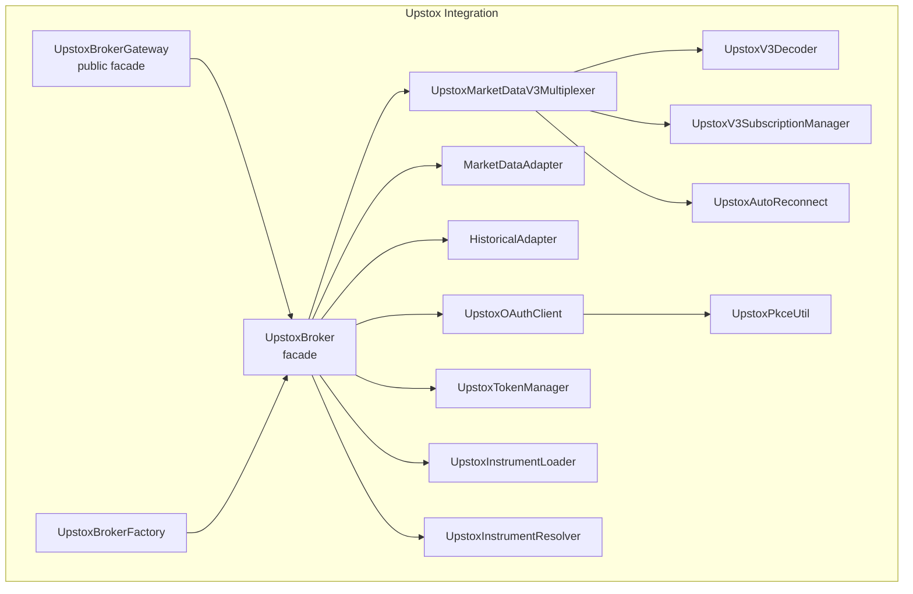
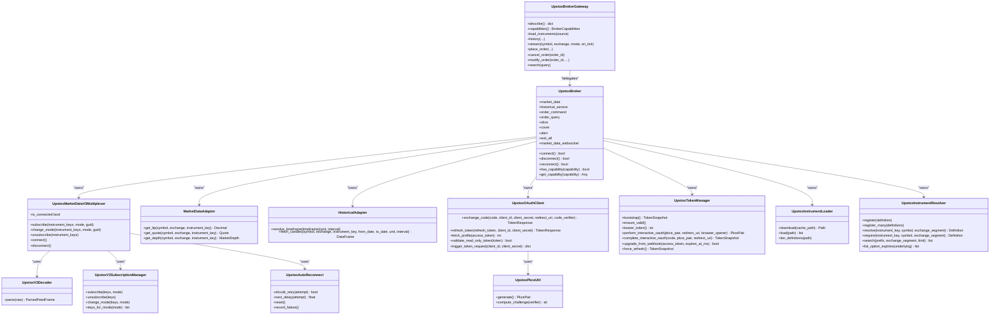
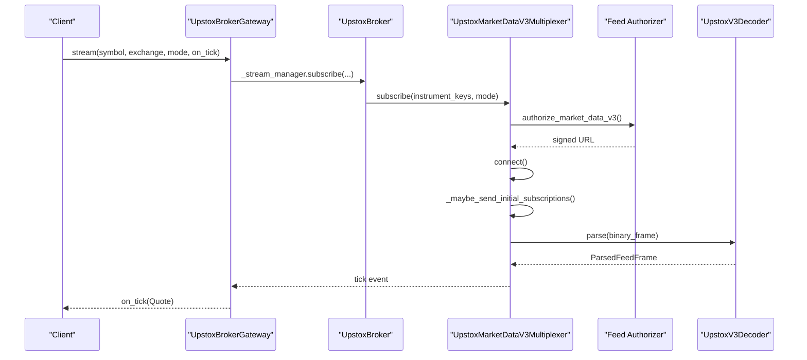
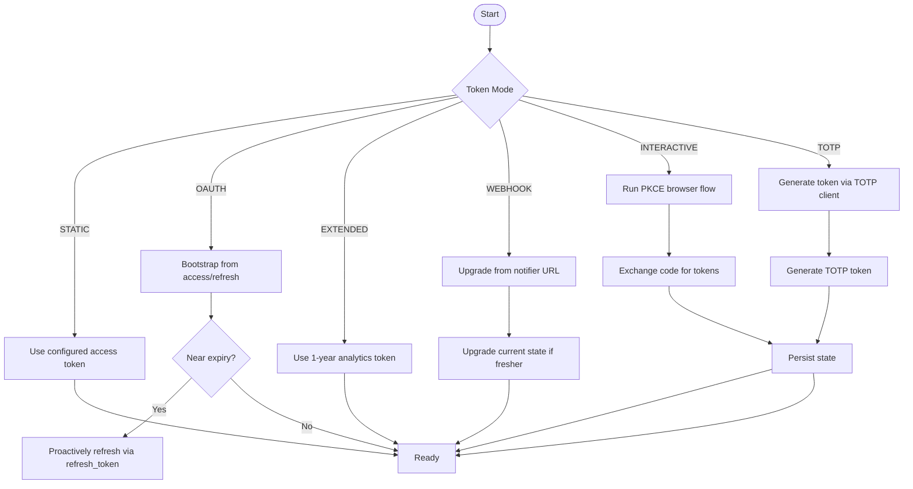
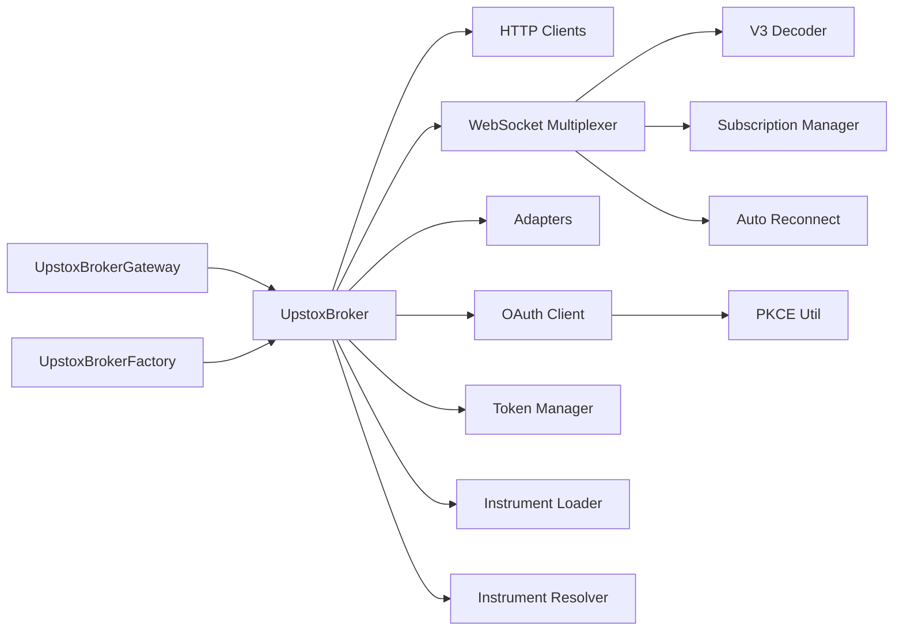

# Upstox Integration

<cite>
**Referenced Files in This Document**
- [broker.py](file://brokers/upstox/broker.py)
- [gateway.py](file://brokers/upstox/gateway.py)
- [factory.py](file://brokers/upstox/factory.py)
- [market_data_v3.py](file://brokers/upstox/websocket/market_data_v3.py)
- [v3_auto_reconnect.py](file://brokers/upstox/websocket/v3_auto_reconnect.py)
- [v3_decoder.py](file://brokers/upstox/websocket/v3_decoder.py)
- [v3_subscription_manager.py](file://brokers/upstox/websocket/v3_subscription_manager.py)
- [market_data_adapter.py](file://brokers/upstox/adapters/market_data_adapter.py)
- [historical_adapter.py](file://brokers/upstox/adapters/historical_adapter.py)
- [oauth_client.py](file://brokers/upstox/auth/oauth_client.py)
- [pkce.py](file://brokers/upstox/auth/pkce.py)
- [token_manager.py](file://brokers/upstox/auth/token_manager.py)
- [loader.py](file://brokers/upstox/instruments/loader.py)
- [resolver.py](file://brokers/upstox/instruments/resolver.py)
- [upstox-live.properties.example](file://config/upstox-live.properties.example)
- [upstox-sandbox.properties.example](file://config/upstox-sandbox.properties.example)
</cite>

## Table of Contents
1. [Introduction](#introduction)
2. [Project Structure](#project-structure)
3. [Core Components](#core-components)
4. [Architecture Overview](#architecture-overview)
5. [Detailed Component Analysis](#detailed-component-analysis)
6. [Dependency Analysis](#dependency-analysis)
7. [Performance Considerations](#performance-considerations)
8. [Troubleshooting Guide](#troubleshooting-guide)
9. [Conclusion](#conclusion)
10. [Appendices](#appendices)

## Introduction
This document provides comprehensive documentation for the Upstox broker integration within the Trade_XV2 ecosystem. It focuses on the UpstoxBroker facade and its extensive adapter ecosystem, including market data v2/v3, order management, portfolio tracking, kill switch, alerts, margin, GTT, cover orders, slicing, historical data, mutual funds, IPO, news, market intelligence, and instrument loader with segment mapping and symbol resolution. It also covers the Upstox WebSocket market data v3 implementation with auto-reconnect, subscription management, and protobuf message handling, along with the OAuth authentication flow including PKCE, JWT expiry handling, and token refresh mechanisms.

## Project Structure
The Upstox integration is organized around a central broker facade that wires together numerous adapters and services:
- Broker facade: orchestrates all adapters and capabilities
- WebSocket multiplexer: manages V3 market data streams with auto-reconnect and protobuf decoding
- Adapters: HTTP-based market data, historical data, order command/query, portfolio, and specialized services (IPO, mutual funds, news, market intelligence, kill switch, static IP)
- Authentication: OAuth client, PKCE utilities, and token manager with support for multiple token modes
- Instruments: loader and resolver for symbol mapping and segment normalization
- Factory and gateway: provide a unified interface for external consumers

**Diagram sources**
- [broker.py:99-312](file://brokers/upstox/broker.py#L99-L312)
- [gateway.py:55-100](file://brokers/upstox/gateway.py#L55-L100)
- [factory.py:26-82](file://brokers/upstox/factory.py#L26-L82)
- [market_data_v3.py:60-101](file://brokers/upstox/websocket/market_data_v3.py#L60-L101)
- [v3_decoder.py:27-49](file://brokers/upstox/websocket/v3_decoder.py#L27-L49)
- [v3_subscription_manager.py:39-80](file://brokers/upstox/websocket/v3_subscription_manager.py#L39-L80)
- [v3_auto_reconnect.py:11-42](file://brokers/upstox/websocket/v3_auto_reconnect.py#L11-L42)
- [market_data_adapter.py:24-48](file://brokers/upstox/adapters/market_data_adapter.py#L24-L48)
- [historical_adapter.py:43-64](file://brokers/upstox/adapters/historical_adapter.py#L43-L64)
- [oauth_client.py:27-41](file://brokers/upstox/auth/oauth_client.py#L27-L41)
- [pkce.py:20-36](file://brokers/upstox/auth/pkce.py#L20-L36)
- [token_manager.py:34-62](file://brokers/upstox/auth/token_manager.py#L34-L62)
- [loader.py:36-41](file://brokers/upstox/instruments/loader.py#L36-L41)
- [resolver.py:19-32](file://brokers/upstox/instruments/resolver.py#L19-L32)

**Section sources**
- [broker.py:78-227](file://brokers/upstox/broker.py#L78-L227)
- [gateway.py:55-100](file://brokers/upstox/gateway.py#L55-L100)
- [factory.py:26-82](file://brokers/upstox/factory.py#L26-L82)

## Core Components
- UpstoxBroker: Central facade that initializes and wires all adapters, clients, WebSocket multiplexer, reconciliation service, and capability registry. It exposes attributes for market data, historical data, orders, portfolio, and specialized services (IPO, mutual funds, news, market intelligence, kill switch, static IP, GTT).
- UpstoxBrokerGateway: Public facade delegating to specialized adapters for market data, historical data, symbol resolution, streaming, order placement/cancellation/modification, and portfolio operations. Provides capability metadata and search functionality.
- UpstoxBrokerFactory: Creates configured UpstoxBrokerGateway instances, loads instruments, connects the broker, and optionally registers the WebSocket multiplexer with a lifecycle manager.
- WebSocket V3 Multiplexer: Manages WebSocket connections, subscription state, auto-reconnect, protobuf decoding, and dispatches ticks to listeners. Includes backfill logic for gaps after reconnection.
- MarketDataAdapter: HTTP-based market data operations (LTP, Quote, Depth) using Upstox V2 endpoints.
- HistoricalAdapter: Historical OHLCV candle retrieval with timeframe mapping and date-range enforcement.
- OAuth and Token Management: Low-level OAuth client supporting PKCE, refresh grants, and token validation; token manager supports multiple token modes (STATIC, OAUTH, EXTENDED, WEBHOOK, INTERACTIVE, TOTP) with proactive refresh and persistence.
- Instruments: Loader for downloading and caching instrument catalogs; Resolver for symbol-to-instrument-key mapping and alternate key generation.

**Section sources**
- [broker.py:99-312](file://brokers/upstox/broker.py#L99-L312)
- [gateway.py:55-444](file://brokers/upstox/gateway.py#L55-L444)
- [factory.py:26-82](file://brokers/upstox/factory.py#L26-L82)
- [market_data_v3.py:60-101](file://brokers/upstox/websocket/market_data_v3.py#L60-L101)
- [market_data_adapter.py:24-48](file://brokers/upstox/adapters/market_data_adapter.py#L24-L48)
- [historical_adapter.py:43-64](file://brokers/upstox/adapters/historical_adapter.py#L43-L64)
- [oauth_client.py:27-41](file://brokers/upstox/auth/oauth_client.py#L27-L41)
- [token_manager.py:34-62](file://brokers/upstox/auth/token_manager.py#L34-L62)
- [loader.py:36-41](file://brokers/upstox/instruments/loader.py#L36-L41)
- [resolver.py:19-32](file://brokers/upstox/instruments/resolver.py#L19-L32)

## Architecture Overview
The Upstox integration follows a layered architecture:
- External consumers interact with UpstoxBrokerGateway, which delegates to specialized adapters.
- UpstoxBroker orchestrates all components, including HTTP clients, WebSocket multiplexer, and capability registration.
- WebSocket V3 handles real-time market data with protobuf decoding and auto-reconnect.
- Authentication subsystem manages token lifecycles and supports multiple modes.

**Diagram sources**
- [broker.py:99-312](file://brokers/upstox/broker.py#L99-L312)
- [gateway.py:55-100](file://brokers/upstox/gateway.py#L55-L100)
- [market_data_v3.py:60-101](file://brokers/upstox/websocket/market_data_v3.py#L60-L101)
- [v3_decoder.py:27-49](file://brokers/upstox/websocket/v3_decoder.py#L27-L49)
- [v3_subscription_manager.py:39-80](file://brokers/upstox/websocket/v3_subscription_manager.py#L39-L80)
- [v3_auto_reconnect.py:11-42](file://brokers/upstox/websocket/v3_auto_reconnect.py#L11-L42)
- [market_data_adapter.py:24-48](file://brokers/upstox/adapters/market_data_adapter.py#L24-L48)
- [historical_adapter.py:43-64](file://brokers/upstox/adapters/historical_adapter.py#L43-L64)
- [oauth_client.py:27-41](file://brokers/upstox/auth/oauth_client.py#L27-L41)
- [token_manager.py:34-62](file://brokers/upstox/auth/token_manager.py#L34-L62)
- [pkce.py:20-36](file://brokers/upstox/auth/pkce.py#L20-L36)
- [loader.py:36-41](file://brokers/upstox/instruments/loader.py#L36-L41)
- [resolver.py:19-32](file://brokers/upstox/instruments/resolver.py#L19-L32)

## Detailed Component Analysis

### UpstoxBroker Facade
The UpstoxBroker class is the central orchestrator that:
- Initializes token manager, adapter context, and instrument loader/resolver/search
- Constructs standalone clients (market data v2/v3, historical v2/v3, order client, expired instruments client)
- Registers adapters via a registry, including IPO, payments, mutual funds, fundamentals, portfolio, margin, options, futures, market status, news, intelligence, kill switch, static IP, GTT
- Creates composite adapters (market data, intelligence snapshot), order command/query adapters, slicing, cover orders, alerts, and exit-all
- Sets up WebSocket multiplexer with feed authorizer, decoder, subscription limits, auto-reconnect, and optional backfill callback
- Exposes shared historical data service and reconciliation service
- Registers capabilities for all adapters and services

Key responsibilities:
- Capability registration and discovery
- Connection lifecycle management (connect/disconnect/reconnect)
- Wiring of HTTP clients, WebSocket, and adapters
- Integration with event bus and reconciliation services

**Section sources**
- [broker.py:99-312](file://brokers/upstox/broker.py#L99-L312)

### UpstoxBrokerGateway
The UpstoxBrokerGateway provides a unified public API:
- Delegates market data operations to MarketDataAdapter
- Historical data via HistoricalAdapter
- Symbol resolution via InstrumentResolver
- Streaming via StreamManagerAdapter
- Orders via OrderAdapter
- Portfolio via PortfolioAdapter
- Extended capabilities via UpstoxExtendedCapabilities
- Instrument loading with caching and memory registration
- Capability metadata and search

It ensures thread safety by delegating to thread-safe adapters and managing subscription state internally.

**Section sources**
- [gateway.py:55-444](file://brokers/upstox/gateway.py#L55-L444)

### UpstoxBrokerFactory
The factory creates configured gateway instances:
- Loads settings from environment
- Instantiates UpstoxBroker and connects it
- Optionally loads instruments
- Auto-wires WebSocket multiplexer into lifecycle if provided

**Section sources**
- [factory.py:26-82](file://brokers/upstox/factory.py#L26-L82)

### WebSocket Market Data V3
The UpstoxMarketDataV3Multiplexer implements:
- Authorization and connection management
- Subscription tracking with category limits
- Auto-reconnect with exponential backoff and jitter
- Protobuf frame decoding and dispatch
- Gap detection and backfill via REST callback
- Listener management with thread safety

**Diagram sources**
- [gateway.py:460-504](file://brokers/upstox/gateway.py#L460-L504)
- [broker.py:186-206](file://brokers/upstox/broker.py#L186-L206)
- [market_data_v3.py:159-198](file://brokers/upstox/websocket/market_data_v3.py#L159-L198)
- [v3_decoder.py:30-48](file://brokers/upstox/websocket/v3_decoder.py#L30-L48)

**Section sources**
- [market_data_v3.py:60-348](file://brokers/upstox/websocket/market_data_v3.py#L60-L348)
- [v3_auto_reconnect.py:11-42](file://brokers/upstox/websocket/v3_auto_reconnect.py#L11-L42)
- [v3_decoder.py:27-143](file://brokers/upstox/websocket/v3_decoder.py#L27-L143)
- [v3_subscription_manager.py:39-150](file://brokers/upstox/websocket/v3_subscription_manager.py#L39-L150)

### Market Data Adapter (HTTP V2)
The MarketDataAdapter encapsulates HTTP-based market data operations:
- LTP retrieval
- Quote retrieval with OHLCV
- Order book depth retrieval
- Price parsing and domain mapping

**Section sources**
- [market_data_adapter.py:24-132](file://brokers/upstox/adapters/market_data_adapter.py#L24-L132)

### Historical Data Adapter (V3)
The HistoricalAdapter:
- Maps timeframe strings to V3 API units/intervals
- Enforces date-range limits per unit
- Fetches candles via historical_v3 client
- Converts responses to DataFrame with standardized columns

**Section sources**
- [historical_adapter.py:43-204](file://brokers/upstox/adapters/historical_adapter.py#L43-L204)

### Authentication Flow (OAuth + PKCE + Token Refresh)
The authentication subsystem supports:
- PKCE pair generation and challenge computation
- OAuth code exchange with code verifier
- Refresh token grant
- Profile-based expiry introspection
- Read-only token validation
- Webhook-based token upgrade
- Proactive refresh with buffer window
- Multiple token modes (STATIC, OAUTH, EXTENDED, WEBHOOK, INTERACTIVE, TOTP)

**Diagram sources**
- [token_manager.py:34-156](file://brokers/upstox/auth/token_manager.py#L34-L156)
- [oauth_client.py:27-41](file://brokers/upstox/auth/oauth_client.py#L27-L41)
- [pkce.py:20-36](file://brokers/upstox/auth/pkce.py#L20-L36)

**Section sources**
- [oauth_client.py:27-179](file://brokers/upstox/auth/oauth_client.py#L27-L179)
- [pkce.py:20-36](file://brokers/upstox/auth/pkce.py#L20-L36)
- [token_manager.py:34-445](file://brokers/upstox/auth/token_manager.py#L34-L445)

### Instrument Loader and Resolver
The instrument loader:
- Downloads compressed instrument catalog from Upstox CDN
- Caches raw and parsed versions with validity checks
- Streams and parses definitions efficiently
- Migrates legacy pickle caches securely

The instrument resolver:
- Maintains in-memory indices by key, symbol+segment, and alternate keys
- Supports prefix search and option/future expiry derivation
- Normalizes segments and generates alternate symbol forms

**Section sources**
- [loader.py:36-296](file://brokers/upstox/instruments/loader.py#L36-L296)
- [resolver.py:19-298](file://brokers/upstox/instruments/resolver.py#L19-L298)

### Specialized Adapters and Services
- IPO, Mutual Funds, News, Market Intelligence, Kill Switch, Static IP, Payments, Fundamentals: Constructed from registry-driven client/adapter pairs and registered as capabilities
- Portfolio, Margin, Options, Futures, Market Status: Additional adapters for portfolio tracking, margin, derivatives, and market status
- Order Command/Query, Slice, Cover, Alert, Exit All: Specialized adapters for order lifecycle, slicing, cover orders, alerts, and kill switch exit

These are wired in the broker’s adapter registry and capability registration loops.

**Section sources**
- [broker.py:78-259](file://brokers/upstox/broker.py#L78-L259)

## Dependency Analysis
The Upstox integration exhibits strong cohesion within the broker facade and clear separation of concerns:
- UpstoxBroker depends on token manager, adapter context, HTTP clients, WebSocket multiplexer, and adapters
- WebSocket multiplexer depends on decoder, subscription manager, and authorizer
- Gateways depend on broker facades and specialized adapters
- Authentication subsystem is decoupled and reusable

Potential coupling points:
- WebSocket multiplexer and backfill callback dependency
- Adapter context dependency for HTTP clients and URL resolver
- Event bus integration for telemetry and observability

**Diagram sources**
- [broker.py:99-312](file://brokers/upstox/broker.py#L99-L312)
- [market_data_v3.py:60-101](file://brokers/upstox/websocket/market_data_v3.py#L60-L101)
- [v3_decoder.py:27-49](file://brokers/upstox/websocket/v3_decoder.py#L27-L49)
- [v3_subscription_manager.py:39-80](file://brokers/upstox/websocket/v3_subscription_manager.py#L39-L80)
- [v3_auto_reconnect.py:11-42](file://brokers/upstox/websocket/v3_auto_reconnect.py#L11-L42)
- [oauth_client.py:27-41](file://brokers/upstox/auth/oauth_client.py#L27-L41)
- [pkce.py:20-36](file://brokers/upstox/auth/pkce.py#L20-L36)
- [token_manager.py:34-62](file://brokers/upstox/auth/token_manager.py#L34-L62)
- [loader.py:36-41](file://brokers/upstox/instruments/loader.py#L36-L41)
- [resolver.py:19-32](file://brokers/upstox/instruments/resolver.py#L19-L32)
- [gateway.py:55-100](file://brokers/upstox/gateway.py#L55-L100)
- [factory.py:26-82](file://brokers/upstox/factory.py#L26-L82)

**Section sources**
- [broker.py:99-312](file://brokers/upstox/broker.py#L99-L312)
- [gateway.py:55-100](file://brokers/upstox/gateway.py#L55-L100)
- [factory.py:26-82](file://brokers/upstox/factory.py#L26-L82)

## Performance Considerations
- WebSocket V3 multiplexer uses efficient binary frame parsing and minimal allocations; protobuf decoding is centralized in the decoder
- Subscription manager enforces strict limits to avoid over-subscription penalties
- Auto-reconnect uses exponential backoff with jitter to reduce thundering herd effects
- Instrument loader streams large JSON archives to avoid memory spikes
- Historical adapter clips date ranges to API limits to prevent oversized requests
- MarketDataAdapter and HistoricalAdapter are stateless and thread-safe, enabling concurrent usage

[No sources needed since this section provides general guidance]

## Troubleshooting Guide
Common issues and resolutions:
- Authentication failures
  - Verify OAuth client configuration and PKCE pair correctness
  - Ensure refresh token availability for proactive refresh
  - Check JWT expiry handling and token persistence
  - For TOTP mode, confirm mobile/PIN/TOTP secret configuration
- WebSocket connection problems
  - Confirm feed authorization URL is returned
  - Validate network connectivity and firewall rules
  - Adjust auto-reconnect parameters (enabled, intervals, max retries)
  - Monitor backfill callback for missed bars after reconnection
- Subscription limit violations
  - Review active subscription categories and counts
  - Ensure combined limits are respected across modes
  - Use Plus plan limits if applicable
- Instrument loading issues
  - Clear stale caches and re-download instrument catalog
  - Validate segment mappings and symbol normalization
  - Check for malformed records and migration of legacy pickle caches

**Section sources**
- [oauth_client.py:27-179](file://brokers/upstox/auth/oauth_client.py#L27-L179)
- [token_manager.py:34-445](file://brokers/upstox/auth/token_manager.py#L34-L445)
- [market_data_v3.py:60-348](file://brokers/upstox/websocket/market_data_v3.py#L60-L348)
- [v3_subscription_manager.py:39-150](file://brokers/upstox/websocket/v3_subscription_manager.py#L39-L150)
- [loader.py:36-296](file://brokers/upstox/instruments/loader.py#L36-L296)
- [resolver.py:19-298](file://brokers/upstox/instruments/resolver.py#L19-L298)

## Conclusion
The Upstox integration delivers a robust, modular, and extensible broker facade with comprehensive adapter coverage spanning market data, historical data, order management, portfolio tracking, and specialized services. Its WebSocket V3 implementation provides reliable real-time feeds with auto-reconnect and protobuf decoding. The authentication subsystem supports multiple token modes and proactive refresh strategies. Together, these components enable seamless integration with Upstox while maintaining high reliability and maintainability.

[No sources needed since this section summarizes without analyzing specific files]

## Appendices

### Configuration Examples
- Live credentials example: [upstox-live.properties.example:1-27](file://config/upstox-live.properties.example#L1-L27)
- Sandbox credentials example: [upstox-sandbox.properties.example:1-8](file://config/upstox-sandbox.properties.example#L1-L8)

### Practical Usage Patterns
- Configure Upstox integration via factory with environment-based settings and optional lifecycle wiring
- Subscribe to WebSocket streams with mode selection (LTP, full, option greeks) and handle callbacks safely
- Place complex orders using order command adapter with slicing, cover orders, and alerts
- Manage instrument catalogs with caching and memory registration for fast symbol resolution

**Section sources**
- [factory.py:26-82](file://brokers/upstox/factory.py#L26-L82)
- [gateway.py:460-504](file://brokers/upstox/gateway.py#L460-L504)
- [broker.py:168-184](file://brokers/upstox/broker.py#L168-L184)
- [gateway.py:190-220](file://brokers/upstox/gateway.py#L190-L220)