# CLI and TUI Interface

<cite>
**Referenced Files in This Document**
- [cli/main.py](file://cli/main.py)
- [cli/views/tui_app.py](file://cli/views/tui_app.py)
- [cli/views/tui.tcss](file://cli/views/tui.tcss)
- [cli/services/broker_service.py](file://cli/services/broker_service.py)
- [cli/services/oms_service.py](file://cli/services/oms_service.py)
- [cli/services/observability_setup.py](file://cli/services/observability_setup.py)
- [cli/commands/registry.py](file://cli/commands/registry.py)
- [cli/commands/market.py](file://cli/commands/market.py)
- [cli/commands/market_handlers.py](file://cli/commands/market_handlers.py)
- [cli/commands/order_placement.py](file://cli/commands/order_placement.py)
- [cli/commands/portfolio.py](file://cli/commands/portfolio.py)
- [cli/commands/oms.py](file://cli/commands/oms.py)
- [cli/commands/analytics.py](file://cli/commands/analytics.py)
- [cli/commands/analytics_backtest.py](file://cli/commands/analytics_backtest.py)
- [cli/commands/analytics_walkforward.py](file://cli/commands/analytics_walkforward.py)
- [cli/commands/analytics_strategies.py](file://cli/commands/analytics_strategies.py)
- [cli/commands/analytics_optimize.py](file://cli/commands/analytics_optimize.py)
- [cli/commands/analytics_compare.py](file://cli/commands/analytics_compare.py)
- [cli/commands/analytics_scanner.py](file://cli/commands/analytics_scanner.py)
- [cli/commands/analytics_sector.py](file://cli/commands/analytics_sector.py)
- [cli/commands/analytics_research.py](file://cli/commands/analytics_research.py)
- [cli/widgets/broker_console.py](file://cli/widgets/broker_console.py)
- [cli/widgets/oms_console.py](file://cli/widgets/oms_console.py)
- [cli/widgets/market_console.py](file://cli/widgets/market_console.py)
- [cli/commands/doctor/checks.py](file://cli/commands/doctor/checks.py)
- [cli/commands/doctor/orchestrator.py](file://cli/commands/doctor/orchestrator.py)
</cite>

## Update Summary
**Changes Made**
- Updated CLI architecture to reflect major refactoring with extraction of market data handlers into dedicated module (cli/commands/market_handlers.py)
- Enhanced modularity documentation with improved separation of concerns between market data presentation and business logic
- Updated command dispatching documentation to show new market handlers integration
- Revised project structure diagrams to reflect the new market_handlers.py module
- Added documentation for the REF-013 inline extraction initiative that moved market data handlers from main.py to dedicated module

## Table of Contents
1. [Introduction](#introduction)
2. [Project Structure](#project-structure)
3. [Core Components](#core-components)
4. [Architecture Overview](#architecture-overview)
5. [Detailed Component Analysis](#detailed-component-analysis)
6. [Analytics Command System](#analytics-command-system)
7. [Dependency Analysis](#dependency-analysis)
8. [Performance Considerations](#performance-considerations)
9. [Troubleshooting Guide](#troubleshooting-guide)
10. [Conclusion](#conclusion)
11. [Appendices](#appendices)

## Introduction
This document explains the CLI and TUI interfaces for the Rich/Textual diagnostic terminal and command system. It covers:
- CLI architecture: command dispatching, argument parsing, and service integration
- TUI dashboard powered by Textual with real-time monitoring, widget system, and interactive controls
- Command system: broker commands, account management, portfolio queries, OMS diagnostics, market data retrieval, and comprehensive analytics
- Analytics capabilities: walk-forward testing, strategy evaluation, optimization, and comparative analysis
- Widget architecture for customizable dashboards, real-time data visualization, and user interaction patterns
- Practical CLI examples: order placement, position monitoring, system diagnostics, and advanced analytics operations
- HTTP observability endpoints exposed by the CLI (healthz, readyz, metrics) and production monitoring integration
- Diagnostic tools for connectivity testing, broker validation, and system health assessment
- Guidance on extending the CLI with custom commands and enhancing the TUI with new widgets and visualizations

## Project Structure
The CLI and TUI are organized around a central entrypoint, a command registry, and service layers that integrate with broker gateways, observability, and analytics frameworks. The architecture has been enhanced with improved modularity through the extraction of market data handlers into a dedicated module.

```mermaid
graph TB
subgraph "CLI Core"
MAIN["cli/main.py"]
REG["cli/commands/registry.py"]
CMD_MARKET["cli/commands/market.py"]
CMD_MARKET_HANDLERS["cli/commands/market_handlers.py"]
CMD_OMS["cli/commands/oms.py"]
CMD_PORTFOLIO["cli/commands/portfolio.py"]
CMD_ORDERS["cli/commands/order_placement.py"]
CMD_ANALYTICS["cli/commands/analytics.py"]
end
subgraph "Analytics Commands"
ANALYTICS_BACKTEST["cli/commands/analytics_backtest.py"]
ANALYTICS_WALKFORWARD["cli/commands/analytics_walkforward.py"]
ANALYTICS_STRATEGIES["cli/commands/analytics_strategies.py"]
ANALYTICS_OPTIMIZE["cli/commands/analytics_optimize.py"]
ANALYTICS_COMPARE["cli/commands/analytics_compare.py"]
ANALYTICS_SCANNER["cli/commands/analytics_scanner.py"]
ANALYTICS_SECTOR["cli/commands/analytics_sector.py"]
ANALYTICS_RESEARCH["cli/commands/analytics_research.py"]
end
subgraph "Services"
BROKER_SVC["cli/services/broker_service.py"]
OMS_SVC["cli/services/oms_service.py"]
OBS_SETUP["cli/services/observability_setup.py"]
end
subgraph "TUI"
TUI_APP["cli/views/tui_app.py"]
W_BROKER["cli/widgets/broker_console.py"]
W_OMS["cli/widgets/oms_console.py"]
W_MARKET["cli/widgets/market_console.py"]
TUI_CSS["cli/views/tui.tcss"]
end
MAIN --> REG
MAIN --> BROKER_SVC
MAIN --> CMD_MARKET
MAIN --> CMD_MARKET_HANDLERS
MAIN --> CMD_OMS
MAIN --> CMD_PORTFOLIO
MAIN --> CMD_ORDERS
MAIN --> CMD_ANALYTICS
CMD_ANALYTICS --> ANALYTICS_BACKTEST
CMD_ANALYTICS --> ANALYTICS_WALKFORWARD
CMD_ANALYTICS --> ANALYTICS_STRATEGIES
CMD_ANALYTICS --> ANALYTICS_OPTIMIZE
CMD_ANALYTICS --> ANALYTICS_COMPARE
CMD_ANALYTICS --> ANALYTICS_SCANNER
CMD_ANALYTICS --> ANALYTICS_SECTOR
CMD_ANALYTICS --> ANALYTICS_RESEARCH
CMD_MARKET --> BROKER_SVC
CMD_MARKET_HANDLERS --> BROKER_SVC
CMD_OMS --> BROKER_SVC
CMD_PORTFOLIO --> BROKER_SVC
CMD_ORDERS --> OMS_SVC
TUI_APP --> W_BROKER
TUI_APP --> W_OMS
TUI_APP --> W_MARKET
TUI_APP --> BROKER_SVC
TUI_APP --> OMS_SVC
BROKER_SVC --> OBS_SETUP
```

**Diagram sources**
- [cli/main.py:436-586](file://cli/main.py#L436-L586)
- [cli/commands/registry.py:80-109](file://cli/commands/registry.py#L80-L109)
- [cli/commands/analytics.py:32-126](file://cli/commands/analytics.py#L32-L126)
- [cli/services/broker_service.py:41-406](file://cli/services/broker_service.py#L41-L406)
- [cli/services/oms_service.py:12-177](file://cli/services/oms_service.py#L12-L177)
- [cli/views/tui_app.py:21-78](file://cli/views/tui_app.py#L21-L78)

**Section sources**
- [cli/main.py:33-118](file://cli/main.py#L33-L118)
- [cli/commands/registry.py:25-109](file://cli/commands/registry.py#L25-L109)

## Core Components
- Central CLI entrypoint and dispatcher: parses flags, builds services, routes commands, and emits results in JSON or Rich console modes.
- Command registry: maintains module-path and runtime dispatch tables for discoverability and testability.
- Broker service: composes gateways, lifecycle, OMS, WebSocket services, and HTTP observability server.
- OMS service: provides order placement, cancellation, statistics, and integration with TradingContext.
- Market data handlers: specialized handlers for quote, depth, historical data, option chains, futures, streaming, orders, and validation operations, extracted from main.py for improved modularity.
- Analytics command system: comprehensive suite of financial analysis tools including backtesting, walk-forward testing, strategy optimization, and comparative analysis.
- TUI app: Textual application with tabbed panes and interactive widgets for broker, OMS, market, events, diagnostics, performance, and analytics.
- Widgets: reusable components for broker accounts, orders/trades, market data, and analytics visualization with real-time updates.

**Updated** Enhanced with dedicated market data handlers module for improved separation of concerns and maintainability.

**Section sources**
- [cli/main.py:478-586](file://cli/main.py#L478-L586)
- [cli/commands/registry.py:25-127](file://cli/commands/registry.py#L25-L127)
- [cli/services/broker_service.py:41-406](file://cli/services/broker_service.py#L41-L406)
- [cli/services/oms_service.py:12-177](file://cli/services/oms_service.py#L12-L177)
- [cli/views/tui_app.py:21-78](file://cli/views/tui_app.py#L21-L78)

## Architecture Overview
The CLI uses a registry-driven dispatcher to route subcommands to specialized handlers. Handlers interact with services that encapsulate broker integrations, observability, and analytics frameworks. The TUI composes widgets that bind to the same services for real-time dashboards with enhanced analytics capabilities. Market data operations have been modularized into dedicated handlers for improved maintainability.

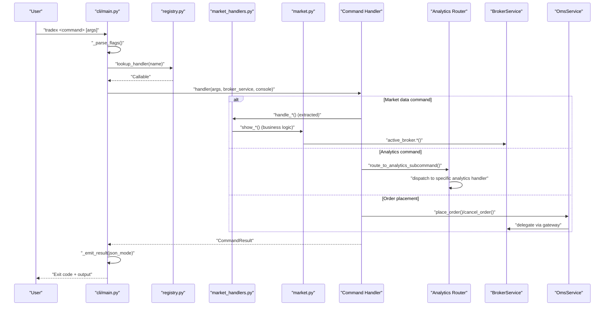

**Diagram sources**
- [cli/main.py:436-586](file://cli/main.py#L436-L586)
- [cli/commands/registry.py:80-109](file://cli/commands/registry.py#L80-L109)
- [cli/commands/analytics.py:32-126](file://cli/commands/analytics.py#L32-L126)
- [cli/commands/market_handlers.py:28-191](file://cli/commands/market_handlers.py#L28-L191)
- [cli/services/broker_service.py:254-360](file://cli/services/broker_service.py#L254-L360)
- [cli/services/oms_service.py:101-177](file://cli/services/oms_service.py#L101-L177)

## Detailed Component Analysis

### CLI Command Dispatch and Argument Parsing
- Flags: --broker, --json, --verbose, --timing
- Dispatch table: maps subcommands to handlers; includes inline handlers for quote/depth/history/stream/orders/validate and wrapped handlers for portfolio/oms/journal/views/options-sync/events/analytics.
- Result emission: CommandResult carries structured data and exit codes; JSON mode prints serialized results.

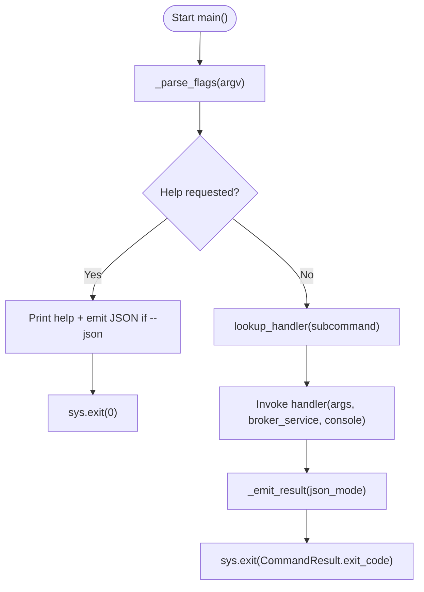

**Diagram sources**
- [cli/main.py:436-586](file://cli/main.py#L436-L586)

**Section sources**
- [cli/main.py:436-586](file://cli/main.py#L436-L586)
- [cli/commands/registry.py:25-127](file://cli/commands/registry.py#L25-L127)

### Market Data Handlers Module Extraction
**Updated** The market data handlers have been extracted from the main CLI entrypoint into a dedicated module (cli/commands/market_handlers.py) as part of the REF-013 inline extraction initiative. This improves modularity and maintainability by separating presentation logic from business logic.

The extraction includes handlers for:
- Quote handling: `handle_quote()` - displays real-time quotes with formatted tables
- Depth handling: `handle_depth()` - shows market depth with bid/ask levels
- History handling: `handle_history()` - retrieves historical data with candle summaries
- Option chain handling: `handle_option_chain()` - displays option chain data with expiry selection
- Futures handling: `handle_futures()` - shows futures contract details
- Stream handling: `handle_stream()` - manages live tick streaming with fallback mechanisms
- Orders handling: `handle_orders()` - displays order book data
- Validation handling: `handle_validate()` - runs various validation checks

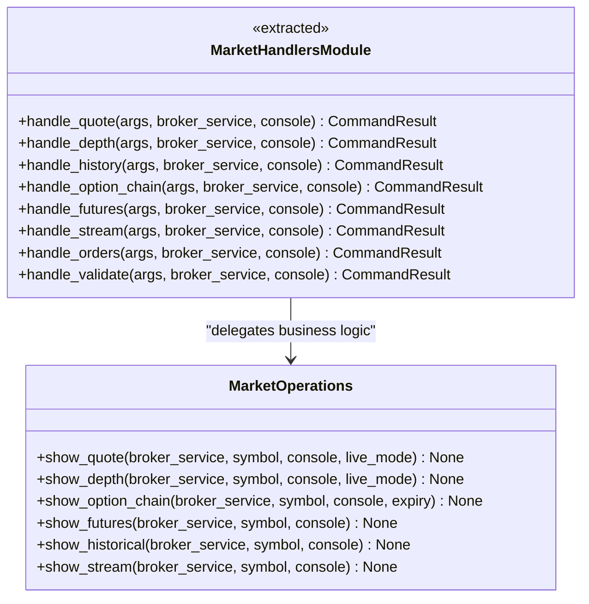

**Diagram sources**
- [cli/commands/market_handlers.py:28-191](file://cli/commands/market_handlers.py#L28-L191)
- [cli/commands/market.py:33-525](file://cli/commands/market.py#L33-L525)

**Section sources**
- [cli/commands/market_handlers.py:1-191](file://cli/commands/market_handlers.py#L1-L191)
- [cli/commands/market.py:1-525](file://cli/commands/market.py#L1-L525)

### Broker Service Composition and Observability
- Initializes gateways (Dhan, Upstox, Paper, Mock), lifecycle, OMS, WebSocket services, and HTTP observability server.
- Provides active broker selection, readiness checks, and clean shutdown with lifecycle management.
- Exposes HTTP observability server for metrics and diagnostics.

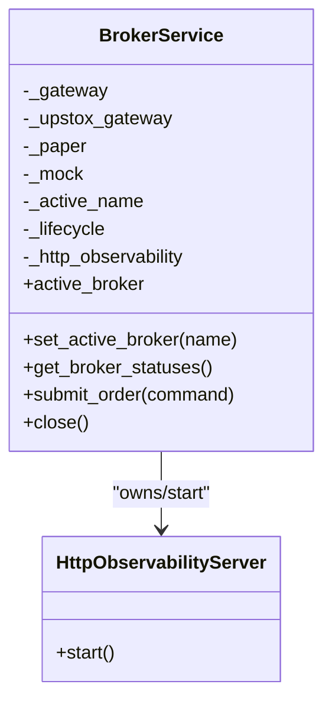

**Diagram sources**
- [cli/services/broker_service.py:41-406](file://cli/services/broker_service.py#L41-L406)
- [cli/services/observability_setup.py:120-178](file://cli/services/observability_setup.py#L120-L178)

**Section sources**
- [cli/services/broker_service.py:113-198](file://cli/services/broker_service.py#L113-L198)
- [cli/services/observability_setup.py:120-178](file://cli/services/observability_setup.py#L120-L178)

### OMS Service Integration
- Centralizes order placement via TradingContext and gateway, ensuring risk checks, idempotency, and event publishing.
- Supports order cancellation and statistics aggregation.

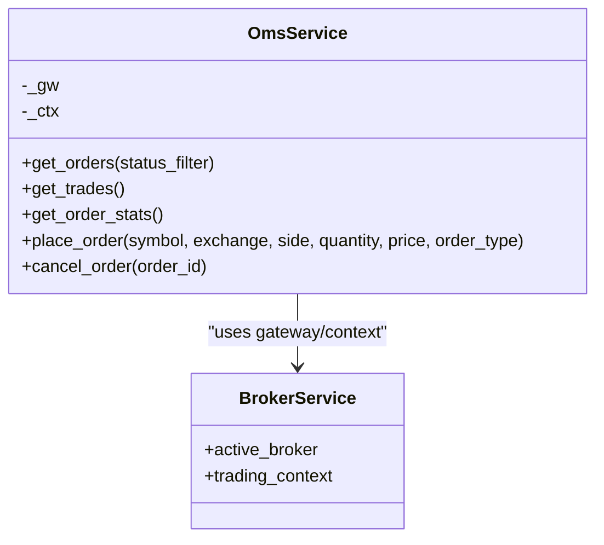

**Diagram sources**
- [cli/services/oms_service.py:12-177](file://cli/services/oms_service.py#L12-L177)
- [cli/services/broker_service.py:246-250](file://cli/services/broker_service.py#L246-L250)

**Section sources**
- [cli/services/oms_service.py:12-177](file://cli/services/oms_service.py#L12-L177)

### Market Data Commands and Real-Time Streaming
- Quote, depth, option chain, futures, historical, and stream commands use the active broker's market data adapters.
- Stream command supports WebSocket subscription with fallback to REST polling and a rolling Live table.
- Market data operations are now handled by dedicated handlers in market_handlers.py while business logic remains in market.py.

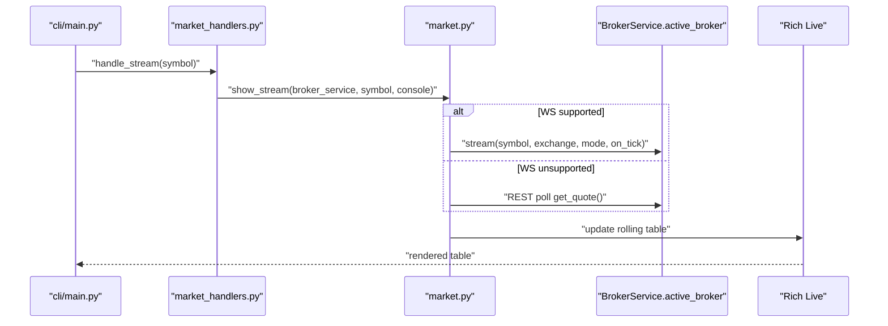

**Diagram sources**
- [cli/commands/market.py:373-486](file://cli/commands/market.py#L373-L486)
- [cli/commands/market_handlers.py:167-174](file://cli/commands/market_handlers.py#L167-L174)
- [cli/main.py:413-422](file://cli/main.py#L413-L422)

**Section sources**
- [cli/commands/market.py:33-525](file://cli/commands/market.py#L33-L525)
- [cli/commands/market_handlers.py:167-174](file://cli/commands/market_handlers.py#L167-L174)

### Portfolio and OMS Queries
- Portfolio commands return holdings and positions with styled tables and JSON data for --json mode.
- OMS commands present order books, trades, and summary statistics with filters and styling.

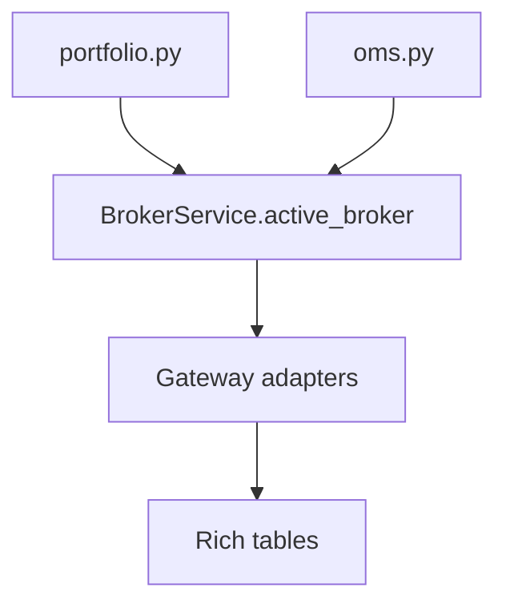

**Diagram sources**
- [cli/commands/portfolio.py:21-134](file://cli/commands/portfolio.py#L21-L134)
- [cli/commands/oms.py:11-162](file://cli/commands/oms.py#L11-L162)

**Section sources**
- [cli/commands/portfolio.py:21-134](file://cli/commands/portfolio.py#L21-L134)
- [cli/commands/oms.py:11-162](file://cli/commands/oms.py#L11-L162)

### Order Placement Commands
- Single order placement, batch placement from CSV, cancellation, and modification.
- Uses OmsService with TradingContext for risk checks and gateway submission.

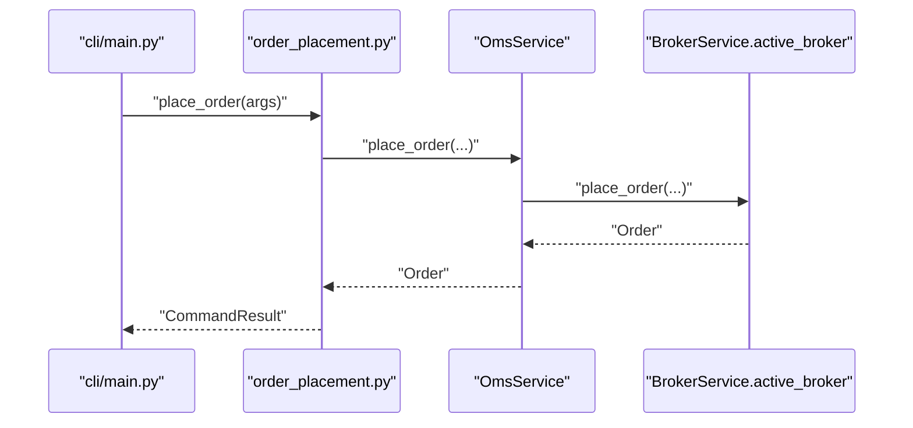

**Diagram sources**
- [cli/commands/order_placement.py:31-150](file://cli/commands/order_placement.py#L31-L150)
- [cli/services/oms_service.py:101-169](file://cli/services/oms_service.py#L101-L169)

**Section sources**
- [cli/commands/order_placement.py:31-383](file://cli/commands/order_placement.py#L31-L383)
- [cli/services/oms_service.py:101-169](file://cli/services/oms_service.py#L101-L169)

### TUI Dashboard and Widget System
- Textual app with tabbed panes: Broker & Account, OMS & Orders, Market Terminal, Events & Websocket, Doctor Diagnostics, Performance Testing, Analytics Dashboard.
- Widgets:
  - BrokerConsoleWidget: account metrics, positions, holdings
  - OmsConsoleWidget: order form, stats, orders/trades tables, placement/cancellation
  - MarketConsoleWidget: symbol search, quote, depth, option chain
  - AnalyticsConsoleWidget: performance metrics, strategy comparisons, optimization results
- Interactive controls: buttons, inputs, selects; refresh actions per pane.

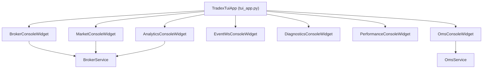

**Diagram sources**
- [cli/views/tui_app.py:21-78](file://cli/views/tui_app.py#L21-L78)
- [cli/widgets/broker_console.py:18-136](file://cli/widgets/broker_console.py#L18-L136)
- [cli/widgets/oms_console.py:18-224](file://cli/widgets/oms_console.py#L18-L224)
- [cli/widgets/market_console.py:18-178](file://cli/widgets/market_console.py#L18-L178)

**Section sources**
- [cli/views/tui_app.py:21-78](file://cli/views/tui_app.py#L21-L78)
- [cli/widgets/broker_console.py:18-136](file://cli/widgets/broker_console.py#L18-L136)
- [cli/widgets/oms_console.py:18-224](file://cli/widgets/oms_console.py#L18-L224)
- [cli/widgets/market_console.py:18-178](file://cli/widgets/market_console.py#L18-L178)

### Doctor Diagnostics and Parallel Checks
- Strategy pattern for checks; orchestrator runs independent checks concurrently with timeouts and result aggregation.
- Results include PASS/WARN/FAIL/INFO/ERROR with details.

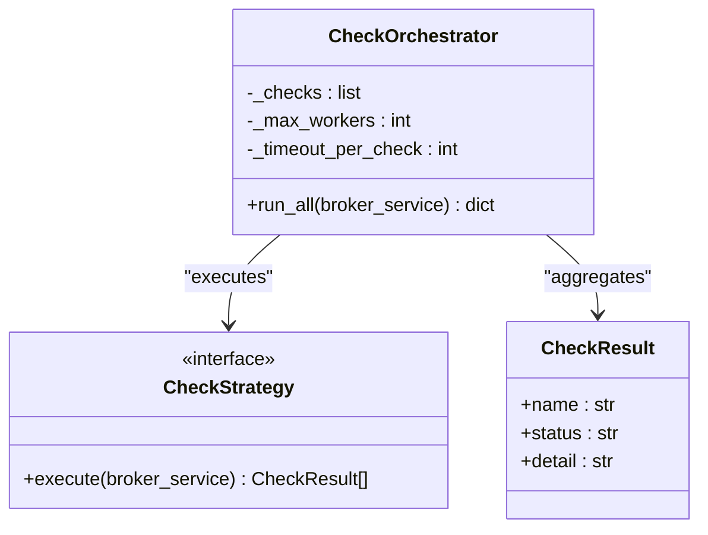

**Diagram sources**
- [cli/commands/doctor/checks.py:16-64](file://cli/commands/doctor/checks.py#L16-L64)
- [cli/commands/doctor/orchestrator.py:42-141](file://cli/commands/doctor/orchestrator.py#L42-L141)

**Section sources**
- [cli/commands/doctor/checks.py:16-64](file://cli/commands/doctor/checks.py#L16-L64)
- [cli/commands/doctor/orchestrator.py:42-141](file://cli/commands/doctor/orchestrator.py#L42-L141)

### HTTP Observability Endpoints
- BrokerService starts an HttpObservabilityServer exposing metrics and gauges (daily PnL, kill switch toggles, DLQ depth, reconciliation drift/run counts, token refresh metrics, circuit breaker states, connection status).
- Integrated into lifecycle for clean shutdown.

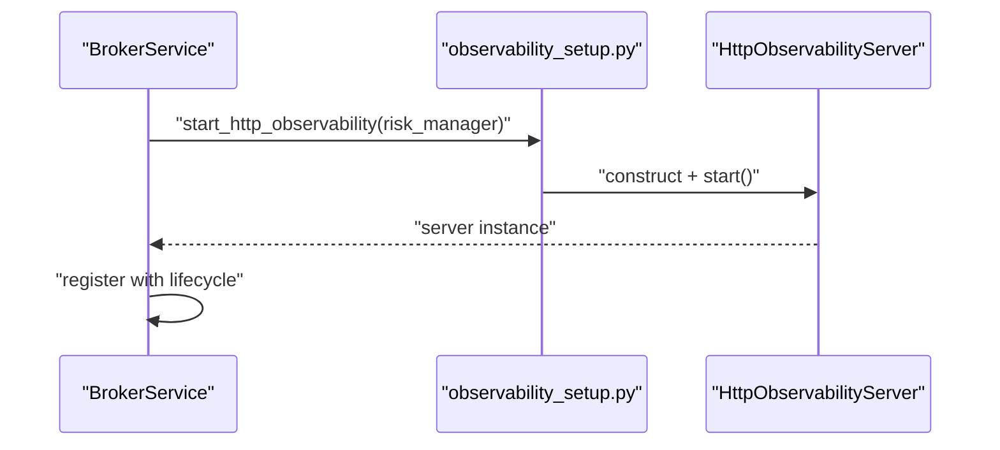

**Diagram sources**
- [cli/services/broker_service.py:113-167](file://cli/services/broker_service.py#L113-L167)
- [cli/services/observability_setup.py:120-178](file://cli/services/observability_setup.py#L120-L178)

**Section sources**
- [cli/services/broker_service.py:113-167](file://cli/services/broker_service.py#L113-L167)
- [cli/services/observability_setup.py:26-117](file://cli/services/observability_setup.py#L26-L117)

## Analytics Command System

### Analytics Command Router
The analytics command system provides a comprehensive suite of financial analysis tools through a centralized router that handles multiple subcommands for different types of analysis.

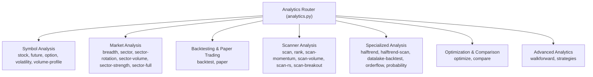

**Diagram sources**
- [cli/commands/analytics.py:32-126](file://cli/commands/analytics.py#L32-L126)

### Walk-Forward Testing
Walk-forward testing provides systematic forward testing methodology for validating trading strategies across different market regimes and time periods.

**Section sources**
- [cli/commands/analytics_walkforward.py:14-90](file://cli/commands/analytics_walkforward.py#L14-L90)

### Strategy Evaluation and Management
Multi-strategy runtime enables dynamic strategy composition, evaluation, and management for complex trading systems.

**Section sources**
- [cli/commands/analytics_strategies.py:11-33](file://cli/commands/analytics_strategies.py#L11-L33)

### Parameter Optimization
Comprehensive optimization framework supports grid search, single-parameter optimization, and strategy parameter tuning.

**Section sources**
- [cli/commands/analytics_optimize.py:16-129](file://cli/commands/analytics_optimize.py#L16-L129)

### Comparative Analysis
Advanced comparison tools enable side-by-side evaluation of strategies, parameters, and performance metrics to identify optimal configurations.

**Section sources**
- [cli/commands/analytics_compare.py:12-155](file://cli/commands/analytics_compare.py#L12-L155)

### Market Scanner Integration
Integrated scanner system provides systematic screening of securities using multiple analytical approaches including momentum, volume, relative strength, and breakout strategies.

**Section sources**
- [cli/commands/analytics_scanner.py:19-176](file://cli/commands/analytics_scanner.py#L19-L176)

### Sector Analysis Framework
Comprehensive sector analysis toolkit covers breadth, rotation, strength, volume, and full multi-dimensional sector evaluation.

**Section sources**
- [cli/commands/analytics_sector.py:16-232](file://cli/commands/analytics_sector.py#L16-L232)

### Research and Probability Analysis
Advanced research tools combine order flow analysis, probability scoring, and statistical modeling for informed decision-making.

**Section sources**
- [cli/commands/analytics_research.py:14-105](file://cli/commands/analytics_research.py#L14-L105)

## Dependency Analysis
- Coupling: CLI depends on registry and services; commands depend on services; TUI widgets depend on services; analytics commands depend on analytics framework.
- Cohesion: Services encapsulate broker integration and lifecycle; commands encapsulate domain operations; widgets encapsulate UI rendering; analytics commands encapsulate financial analysis logic.
- External dependencies: Rich for console rendering, Textual for TUI, broker gateways for market data, pandas for data analysis, analytics libraries for financial computations.
- **Updated** Market data handlers module provides clean separation between presentation (market_handlers.py) and business logic (market.py), improving maintainability.

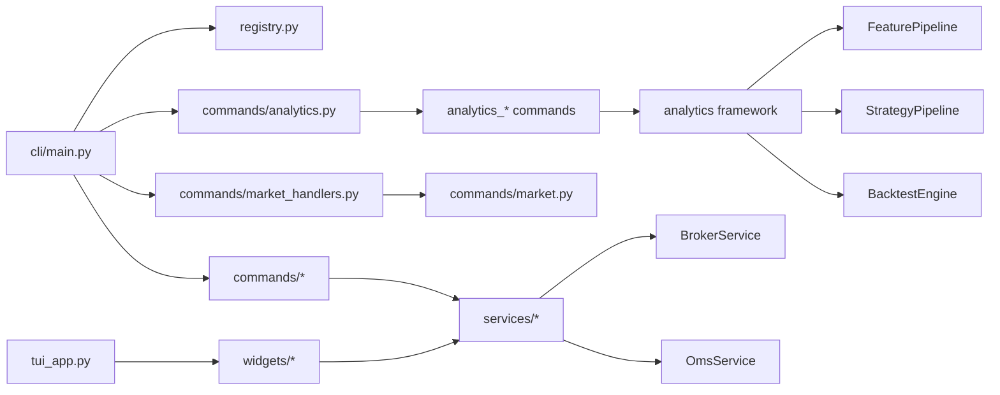

**Diagram sources**
- [cli/main.py:33-118](file://cli/main.py#L33-L118)
- [cli/commands/registry.py:44-109](file://cli/commands/registry.py#L44-L109)
- [cli/views/tui_app.py:13-18](file://cli/views/tui_app.py#L13-L18)
- [cli/commands/analytics.py:9-27](file://cli/commands/analytics.py#L9-L27)

**Section sources**
- [cli/main.py:33-118](file://cli/main.py#L33-L118)
- [cli/commands/registry.py:44-109](file://cli/commands/registry.py#L44-L109)

## Performance Considerations
- Command dispatch uses a dictionary-based lookup replacing chained conditionals for scalability.
- TUI widgets update tables and labels efficiently; streaming uses a rolling buffer and Live rendering.
- Observability gauges are collected via snapshots and gateway metrics to minimize overhead.
- Parallel doctor checks use a bounded thread pool with timeouts to prevent slow checks from blocking diagnostics.
- Analytics commands leverage vectorized operations and efficient data structures for large-scale financial analysis.
- Walk-forward testing implements memory-efficient sliding window processing for long historical datasets.
- **Updated** Market data handlers extraction reduces main.py complexity and improves command dispatch performance through cleaner separation of concerns.

## Troubleshooting Guide
- Unknown command: CLI prints help and exits with error code; verify subcommand spelling and registration.
- Broker availability: set_active_broker raises if credentials missing; use --broker to select dhan/upstox/paper.
- JSON output: --json flag serializes CommandResult; inspect error field for failures.
- Timing and verbosity: --timing prints elapsed time; --verbose enables debug logging.
- TUI refresh: manual refresh triggers widget-specific refresh methods for active tab.
- Analytics data loading: ensure CSV files contain required columns (timestamp, open, high, low, close, volume).
- Parameter validation: analytics commands validate input parameters and provide meaningful error messages.
- **Updated** Market data handlers: if market commands fail, check market_handlers.py for proper broker service integration and ensure market.py business logic is functioning correctly.

**Section sources**
- [cli/main.py:517-571](file://cli/main.py#L517-L571)
- [cli/views/tui_app.py:63-78](file://cli/views/tui_app.py#L63-L78)

## Conclusion
The CLI and TUI provide a cohesive, extensible diagnostic terminal with comprehensive analytics capabilities:
- The CLI offers robust command dispatch, structured output, and production-grade observability.
- The TUI delivers real-time dashboards with interactive controls, analytics visualization, and modular widgets.
- Services encapsulate broker integrations, lifecycle, and OMS workflows for safe, repeatable operations.
- The analytics system provides advanced financial analysis tools including walk-forward testing, strategy optimization, and comparative evaluation.
- **Updated** The market data handlers extraction demonstrates improved architectural modularity, separating presentation logic from business logic for better maintainability and testability.
- Extensibility is achieved through the registry, strategy-based diagnostics, widget composition, and modular analytics framework.

## Appendices

### Practical CLI Operations
- Order placement
  - Single order: tradex place-order SYMBOL SIDE QUANTITY [--type TYPE] [--price PRICE] [--exchange EXCHANGE]
  - Batch orders: tradex place-orders --file orders.csv
  - Cancel order: tradex cancel-order ORDER_ID
  - Modify order: tradex modify-order ORDER_ID [--price PRICE] [--quantity QTY]
- Position monitoring
  - Holdings: tradex holdings
  - Positions: tradex positions
- Market data
  - Quote: tradex quote SYMBOL
  - Depth: tradex depth SYMBOL
  - Option chain: tradex option-chain SYMBOL [--expiry YYYY-MM-DD]
  - Futures: tradex futures SYMBOL
  - Historical: tradex historical SYMBOL
  - Stream: tradex stream SYMBOL
- OMS diagnostics
  - Orders: tradex orders [STATUS_FILTER]
  - Trades: tradex trades
  - OMS summary: tradex oms
- System diagnostics
  - Doctor: tradex doctor [--parallel] [--timing]
- Analytics operations
  - Backtesting: tradex analytics backtest --file ohlcv.csv [--benchmark benchmark.csv] [--capital 100000] [--warmup 20]
  - Walk-forward testing: tradex analytics walkforward --file ohlcv.csv [--symbol TEST] [--train-bars 500] [--test-bars 100] [--step-bars 100] [--capital 100000]
  - Strategy optimization: tradex analytics optimize --file ohlcv.csv [--rsi 7,10,14,21] [--sma 10,20,30] [--atr 14,21,30] [--top 10]
  - Strategy comparison: tradex analytics compare --file ohlcv.csv [--strategies momentum,breakout] [--rsi 7,14,21] [--sma 10,20,30]
  - Sector analysis: tradex analytics sector --file sector_data.csv
  - Market scanning: tradex analytics scan-momentum --file universe.csv --limit 10

**Section sources**
- [cli/commands/order_placement.py:31-383](file://cli/commands/order_placement.py#L31-L383)
- [cli/commands/portfolio.py:21-134](file://cli/commands/portfolio.py#L21-L134)
- [cli/commands/market.py:488-523](file://cli/commands/market.py#L488-L523)
- [cli/commands/oms.py:11-162](file://cli/commands/oms.py#L11-L162)
- [cli/commands/analytics_backtest.py:15-191](file://cli/commands/analytics_backtest.py#L15-L191)
- [cli/commands/analytics_walkforward.py:14-90](file://cli/commands/analytics_walkforward.py#L14-L90)
- [cli/commands/analytics_optimize.py:16-129](file://cli/commands/analytics_optimize.py#L16-L129)
- [cli/commands/analytics_compare.py:12-155](file://cli/commands/analytics_compare.py#L12-L155)
- [cli/commands/analytics_sector.py:16-232](file://cli/commands/analytics_sector.py#L16-L232)
- [cli/commands/analytics_scanner.py:19-176](file://cli/commands/analytics_scanner.py#L19-L176)

### Extending the CLI with Custom Commands
- Add a new module under cli/commands/ with a run(args, broker_service, console) entry point.
- Register the command name and module path for discoverability.
- Register the handler in the dispatch table with a normalized signature.
- Use CommandResult for consistent exit codes and JSON output.

**Section sources**
- [cli/commands/registry.py:44-109](file://cli/commands/registry.py#L44-L109)
- [cli/main.py:371-427](file://cli/main.py#L371-L427)

### Enhancing the TUI with New Widgets
- Create a new widget class inheriting from Static with compose() yielding containers and controls.
- Bind to services via constructor and implement refresh_* methods.
- Add a new TabPane in TradexTuiApp.compose() and wire action_refresh_all to the new widget's refresh method.
- Define styles in tui.tcss for consistent look and feel.

**Section sources**
- [cli/views/tui_app.py:42-78](file://cli/views/tui_app.py#L42-L78)
- [cli/widgets/broker_console.py:25-78](file://cli/widgets/broker_console.py#L25-L78)
- [cli/widgets/oms_console.py:25-97](file://cli/widgets/oms_console.py#L25-L97)
- [cli/widgets/market_console.py:26-86](file://cli/widgets/market_console.py#L26-L86)

### Market Data Handlers Module Benefits
**Updated** The extraction of market data handlers into cli/commands/market_handlers.py provides several architectural benefits:

- **Improved Separation of Concerns**: Presentation logic (formatting, console output) separated from business logic (data retrieval, processing)
- **Enhanced Maintainability**: Cleaner code organization makes it easier to modify market data operations without affecting core CLI logic
- **Better Testability**: Dedicated handlers can be tested independently with mock broker services
- **Reduced Complexity**: main.py focuses on routing and lifecycle management, improving readability
- **Scalability**: Easier to add new market data operations without bloating the main entrypoint

The REF-013 inline extraction initiative successfully refactored the CLI architecture while maintaining backward compatibility and improving overall system design.