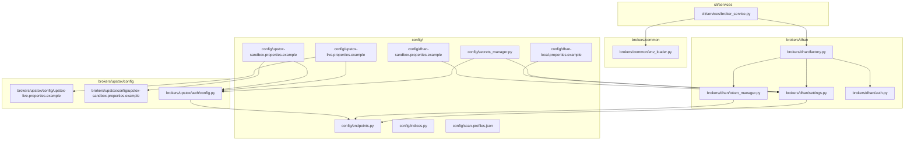
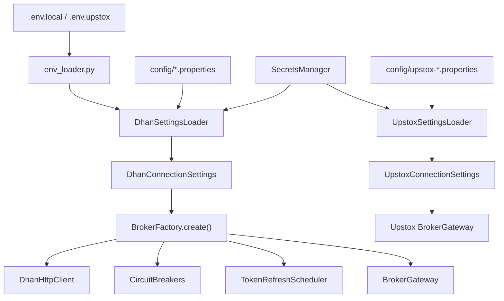
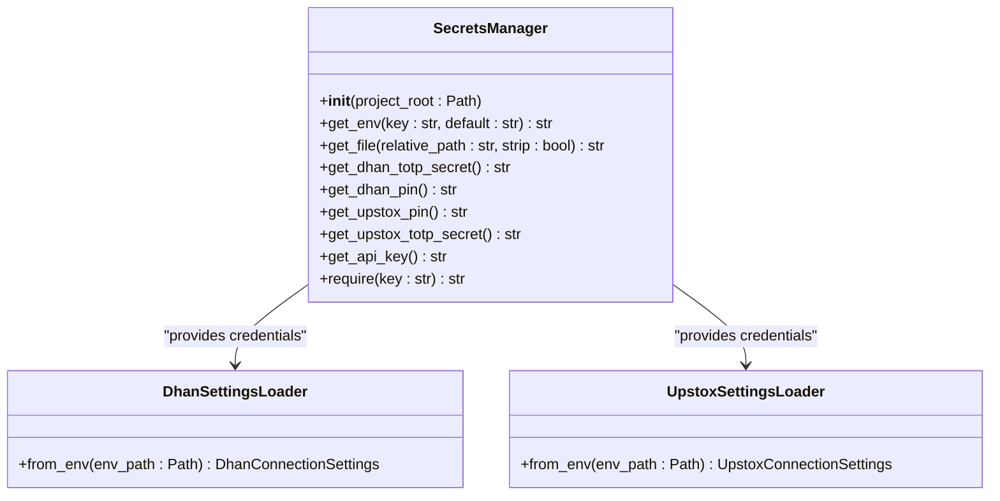
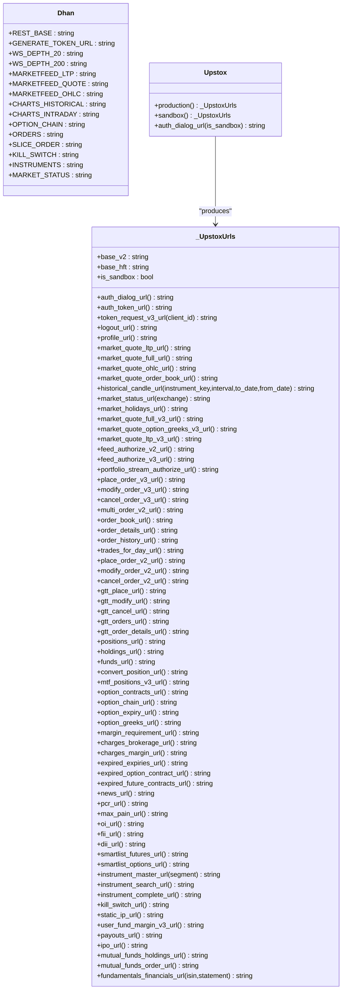
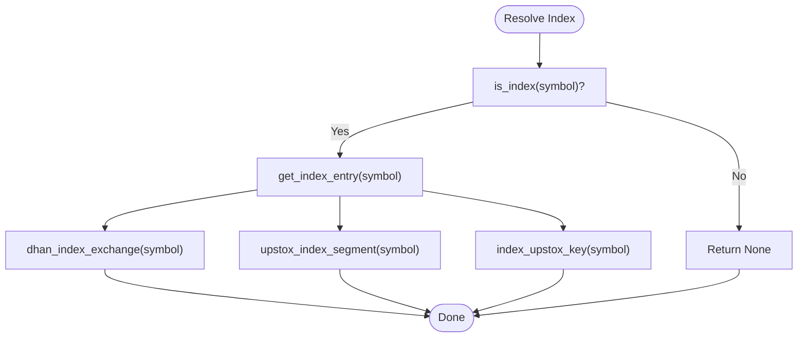
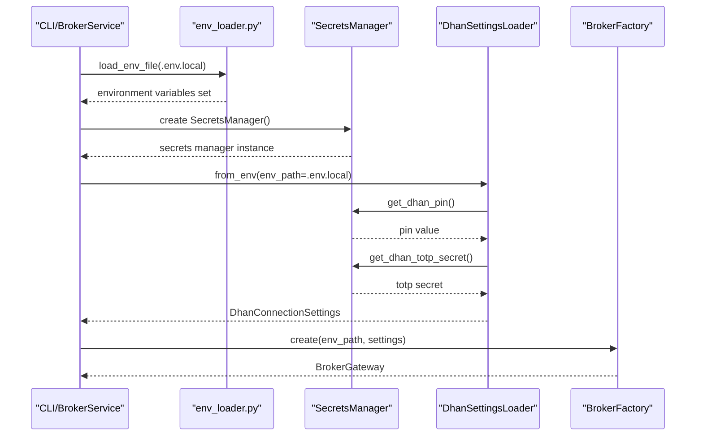
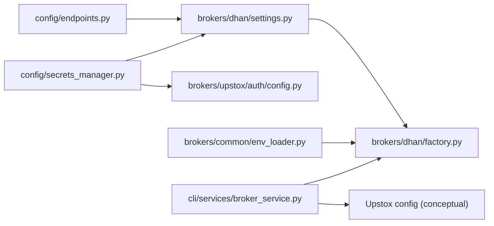

# Configuration Management

<cite>
**Referenced Files in This Document**
- [CONFIG.md](file://config/CONFIG.md)
- [secrets_manager.py](file://config/secrets_manager.py)
- [endpoints.py](file://config/endpoints.py)
- [indices.py](file://config/indices.py)
- [scan-profiles.json](file://config/scan-profiles.json)
- [dhan-local.properties.example](file://config/dhan-local.properties.example)
- [dhan-sandbox.properties.example](file://config/dhan-sandbox.properties.example)
- [upstox-live.properties.example](file://config/upstox-live.properties.example)
- [upstox-sandbox.properties.example](file://config/upstox-sandbox.properties.example)
- [env_loader.py](file://brokers/common/env_loader.py)
- [factory.py](file://brokers/dhan/factory.py)
- [settings.py](file://brokers/dhan/settings.py)
- [token_manager.py](file://brokers/dhan/token_manager.py)
- [auth.py](file://brokers/dhan/auth.py)
- [broker_service.py](file://cli/services/broker_service.py)
- [upstox-live.properties.example](file://brokers/upstox/config/upstox-live.properties.example)
- [upstox-sandbox.properties.example](file://brokers/upstox/config/upstox-sandbox.properties.example)
- [config.py](file://brokers/upstox/auth/config.py)
</cite>

## Update Summary
**Changes Made**
- Updated to reflect current configuration management approach with retained temporary configuration files
- Documented the centralized configuration system with environment variables, property files, and runtime settings
- Covered broker-specific configuration for Dhan and Upstox including API endpoints, authentication credentials, and broker-specific parameters
- Documented market indices configuration, scan profiles, and trading parameters
- Updated security considerations for credential management with unified secrets management
- Provided practical examples of setting up different environments and configuring broker credentials safely

## Table of Contents
1. [Introduction](#introduction)
2. [Project Structure](#project-structure)
3. [Core Components](#core-components)
4. [Architecture Overview](#architecture-overview)
5. [Detailed Component Analysis](#detailed-component-analysis)
6. [Dependency Analysis](#dependency-analysis)
7. [Performance Considerations](#performance-considerations)
8. [Troubleshooting Guide](#troubleshooting-guide)
9. [Conclusion](#conclusion)
10. [Appendices](#appendices)

## Introduction
This document explains the centralized configuration system used to manage environment setup, broker configuration, and system tuning across Dhan and Upstox integrations. The system features a unified secrets management approach that provides secure credential handling through environment variables and gitignored file fallbacks. It covers:
- How environment variables and property files are loaded and merged
- Unified secrets management with SecretsManager for API keys and TOTP secrets
- Broker-specific configuration for Dhan (TOTP/JWT) and Upstox (OAuth/read-only analytics)
- Market indices normalization and scanning profiles
- Runtime token management, environment-specific overrides, and enhanced security practices
- Practical examples for sandbox vs live setups, credential safety, and tuning trading parameters

## Project Structure
Configuration is organized under a dedicated config/ directory with:
- Centralized endpoints registry for Dhan and Upstox
- Index symbol mapping and universe definitions
- Scan profiles for analytics-driven screening
- Example property files for Dhan and Upstox in sandbox/live modes
- New secrets manager for unified credential access
- Gitignored credential files for secure storage

**Diagram sources**
- [secrets_manager.py:12-68](file://config/secrets_manager.py#L12-L68)
- [endpoints.py:1-441](file://config/endpoints.py#L1-L441)
- [indices.py:1-409](file://config/indices.py#L1-L409)
- [scan-profiles.json:1-56](file://config/scan-profiles.json#L1-L56)
- [dhan-local.properties.example:1-36](file://config/dhan-local.properties.example#L1-L36)
- [dhan-sandbox.properties.example:1-24](file://config/dhan-sandbox.properties.example#L1-L24)
- [upstox-live.properties.example:1-19](file://config/upstox-live.properties.example#L1-L19)
- [upstox-sandbox.properties.example:1-8](file://config/upstox-sandbox.properties.example#L1-L8)
- [env_loader.py:1-31](file://brokers/common/env_loader.py#L1-L31)
- [factory.py:1-415](file://brokers/dhan/factory.py#L1-L415)
- [settings.py:1-175](file://brokers/dhan/settings.py#L1-L175)
- [token_manager.py:1-182](file://brokers/dhan/token_manager.py#L1-L182)
- [auth.py:1-85](file://brokers/dhan/auth.py#L1-L85)
- [broker_service.py:1-406](file://cli/services/broker_service.py#L1-L406)
- [upstox-live.properties.example:1-19](file://brokers/upstox/config/upstox-live.properties.example#L1-L19)
- [upstox-sandbox.properties.example:1-8](file://brokers/upstox/config/upstox-sandbox.properties.example#L1-L8)
- [config.py:210-356](file://brokers/upstox/auth/config.py#L210-L356)

**Section sources**
- [CONFIG.md:1-53](file://config/CONFIG.md#L1-L53)
- [secrets_manager.py:12-68](file://config/secrets_manager.py#L12-L68)
- [endpoints.py:1-441](file://config/endpoints.py#L1-L441)
- [indices.py:1-409](file://config/indices.py#L1-L409)
- [scan-profiles.json:1-56](file://config/scan-profiles.json#L1-L56)

## Core Components
- Centralized endpoints registry: Consolidates all broker API endpoints and WebSocket URLs for Dhan and Upstox, enabling uniform access across modules.
- Index symbol mapping: Normalizes index resolution differences between Dhan and Upstox, providing canonical metadata and helpers.
- Scan profiles: Defines universe filters, fetch strategies, and selection criteria for analytics-driven scanners.
- SecretsManager: Unified credential access layer that supports environment variables and gitignored file fallbacks for API keys and TOTP secrets.
- Dhan settings loader: Loads and validates Dhan configuration from environment variables or .properties files, with sensible defaults and strict validation.
- Environment loader: Minimal .env parser used by broker factories to seed environment variables from local files.
- Broker factory: Orchestrates token acquisition (including TOTP), HTTP client creation, and lifecycle wiring for Dhan.
- CLI broker service: Manages broker initialization, lifecycle, readiness gates, and environment file loading for Upstox and Dhan.

**Section sources**
- [endpoints.py:1-441](file://config/endpoints.py#L1-L441)
- [indices.py:1-409](file://config/indices.py#L1-L409)
- [scan-profiles.json:1-56](file://config/scan-profiles.json#L1-L56)
- [secrets_manager.py:12-68](file://config/secrets_manager.py#L12-L68)
- [settings.py:1-175](file://brokers/dhan/settings.py#L1-L175)
- [env_loader.py:1-31](file://brokers/common/env_loader.py#L1-L31)
- [factory.py:1-415](file://brokers/dhan/factory.py#L1-L415)
- [broker_service.py:1-406](file://cli/services/broker_service.py#L1-L406)

## Architecture Overview
The configuration system separates concerns across four layers with enhanced security:
- Data layer: Centralized registries (endpoints, indices, scan profiles) define canonical constants and defaults.
- Secrets layer: Unified SecretsManager provides secure credential access through environment variables and gitignored file fallbacks.
- Loader layer: Settings loaders parse environment variables and .properties files into typed, validated settings using the secrets manager.
- Runtime layer: Factories and services consume settings to initialize clients, token managers, and lifecycle services.

**Diagram sources**
- [secrets_manager.py:12-68](file://config/secrets_manager.py#L12-L68)
- [env_loader.py:1-31](file://brokers/common/env_loader.py#L1-L31)
- [settings.py:110-175](file://brokers/dhan/settings.py#L110-L175)
- [config.py:215-261](file://brokers/upstox/auth/config.py#L215-L261)
- [factory.py:1-415](file://brokers/dhan/factory.py#L1-L415)

## Detailed Component Analysis

### Unified Secrets Manager
The new SecretsManager provides a centralized interface for accessing credentials from multiple sources with priority-based fallback:

- **Environment Variable Priority**: Reads directly from environment variables first (e.g., DHAN_TOTP_SECRET, UPSTOX_PIN)
- **File Fallback Support**: Falls back to gitignored text files when environment variables are not set
- **Broker-Specific Methods**: Dedicated methods for Dhan and Upstox credentials (TOTP secrets, PINs)
- **API Key Access**: Direct access to API_KEY environment variable
- **Validation Support**: Built-in validation through require() method for mandatory secrets

**Diagram sources**
- [secrets_manager.py:12-68](file://config/secrets_manager.py#L12-L68)
- [settings.py:112-144](file://brokers/dhan/settings.py#L112-L144)
- [config.py:215-261](file://brokers/upstox/auth/config.py#L215-L261)

**Section sources**
- [secrets_manager.py:12-68](file://config/secrets_manager.py#L12-L68)

### Centralized Endpoints Registry (Dhan and Upstox)
- Dhan endpoints: REST base URL, auth token generation, market data endpoints, options endpoints, order endpoints, kill switch, instruments, and market status.
- Upstox endpoints: Separate v2 and v3 hosts for market data and order APIs, with methods to build URLs for auth dialogs, feeds, orders, portfolio, options, and market intelligence.

**Diagram sources**
- [endpoints.py:43-441](file://config/endpoints.py#L43-L441)

**Section sources**
- [endpoints.py:1-441](file://config/endpoints.py#L1-L441)

### Index Symbol Mapping and Resolution
- Provides a single source of truth for index symbols, including exchange/segment mappings and canonical names.
- Helpers support fast membership checks and broker-specific segment/exchange overrides.

**Diagram sources**
- [indices.py:367-396](file://config/indices.py#L367-L396)

**Section sources**
- [indices.py:1-409](file://config/indices.py#L1-L409)

### Scan Profiles
- Defines multiple scanning profiles with universe filters (segments, asset classes, underlyings), REST fetch behavior, promotion settings, and option scan parameters.
- Used by analytics engines to drive screening and selection workflows.

**Section sources**
- [scan-profiles.json:1-56](file://config/scan-profiles.json#L1-L56)

### Enhanced Dhan Settings Loader with Secrets Manager
The Dhan settings loader now integrates with the SecretsManager for secure credential access:

- **Environment Variable Support**: Direct reading from environment variables (e.g., DHAN_CLIENT_ID, DHAN_PIN, DHAN_TOTP_SECRET)
- **File-Based Fallback**: Automatic fallback to gitignored text files when environment variables are not set
- **Unified Credential Access**: Uses SecretsManager.get_dhan_pin() and SecretsManager.get_dhan_totp_secret() methods
- **Strict Validation**: Maintains existing validation patterns with enhanced security

**Diagram sources**
- [secrets_manager.py:32-44](file://config/secrets_manager.py#L32-L44)
- [settings.py:112-144](file://brokers/dhan/settings.py#L112-L144)
- [env_loader.py:12-31](file://brokers/common/env_loader.py#L12-L31)

**Section sources**
- [settings.py:110-175](file://brokers/dhan/settings.py#L110-L175)
- [secrets_manager.py:12-68](file://config/secrets_manager.py#L12-L68)

### Upstox Settings Loader with Enhanced Security
The Upstox settings loader also integrates with the SecretsManager for secure credential management:

- **TOTP Configuration**: Supports both environment variables and file-based TOTP secrets
- **Mobile PIN Support**: Unified access to Upstox PIN through SecretsManager
- **Backward Compatibility**: Maintains existing configuration patterns while adding security enhancements

**Section sources**
- [config.py:215-261](file://brokers/upstox/auth/config.py#L215-L261)
- [secrets_manager.py:46-58](file://config/secrets_manager.py#L46-L58)

### Environment Loading Mechanism and Overrides
- CLI loads .env.local for Dhan and .env.upstox for Upstox using a shared environment loader.
- Settings loader merges file-backed values with environment variables, ensuring environment variables take precedence for overrides.
- Dhan factory supports passing env_path to seed settings and also updates .env.local atomically when tokens refresh.
- **Enhanced Security**: SecretsManager provides unified access to credentials from multiple sources with proper fallback logic.

**Section sources**
- [broker_service.py:121-221](file://cli/services/broker_service.py#L121-L221)
- [env_loader.py:12-31](file://brokers/common/env_loader.py#L12-L31)
- [settings.py:91-135](file://brokers/dhan/settings.py#L91-L135)
- [factory.py:338-413](file://brokers/dhan/factory.py#L338-L413)
- [secrets_manager.py:12-68](file://config/secrets_manager.py#L12-L68)

### Security Considerations and Enhanced Credential Management
The new secrets management system provides comprehensive security enhancements:

- **Multi-Layered Storage**: Credentials stored in gitignored text files with environment variable overrides
- **Unified Access Interface**: SecretsManager provides consistent access patterns across all broker configurations
- **Priority-Based Fallback**: Environment variables take precedence over file-based credentials, with sensible defaults
- **Atomic Operations**: Token updates use atomic file replacement with proper locking mechanisms
- **Validation Support**: Built-in validation through require() method ensures critical secrets are always present

**Section sources**
- [CONFIG.md:40-53](file://config/CONFIG.md#L40-L53)
- [secrets_manager.py:12-68](file://config/secrets_manager.py#L12-L68)
- [factory.py:338-413](file://brokers/dhan/factory.py#L338-L413)

### Practical Examples

#### Secure Credential Setup with Secrets Manager
- **Dhan Configuration**: Set DHAN_CLIENT_ID in environment, store DHAN_PIN and DHAN_TOTP_SECRET in config/dhan-pin.txt and config/dhan-totp-secret.txt respectively
- **Upstox Configuration**: Set UPSTOX_PIN and UPSTOX_TOTP_SECRET environment variables or store in gitignored files
- **API Keys**: Store API_KEY in environment variable for universal access

#### Sandbox vs Live Environments
- Dhan sandbox: Point restBaseUrl to the sandbox host and configure clientId and accessToken for sandbox sessions. Use test order parameters for integration tests.
- Dhan live: Configure clientId, optional bootstrap accessToken, authMode (TOTP_GENERATED), environment=LIVE, and paths to pin/totp secret/token state files.

#### Upstox Credentials and Analytics Preference
- Live Upstox: Provide clientId, clientSecret, redirectUri, accessToken, and analyticsToken. The analytics token is used by the IntelligentGateway for LTP/Quote preference and falls back to Dhan on failure.
- Sandbox Upstox: Provide clientId, clientSecret, redirectUri, and accessToken.

#### Customizing Trading Parameters
- Adjust HTTP timeouts, retry behavior, and connection pooling via Dhan settings fields.
- Tune token refresh intervals and buffer windows to balance freshness and overhead.

**Section sources**
- [dhan-sandbox.properties.example:6-23](file://config/dhan-sandbox.properties.example#L6-L23)
- [dhan-local.properties.example:6-23](file://config/dhan-local.properties.example#L6-L23)

## Dependency Analysis
- Dhan settings loader depends on the centralized endpoints registry and SecretsManager for base URLs and credential access.
- Upstox settings loader integrates with SecretsManager for secure TOTP and PIN management.
- Broker factory composes settings, auth manager, HTTP client, and lifecycle services.
- CLI broker service initializes Dhan and Upstox gateways, wires lifecycle, and starts observability.

**Diagram sources**
- [endpoints.py:1-441](file://config/endpoints.py#L1-L441)
- [secrets_manager.py:12-68](file://config/secrets_manager.py#L12-L68)
- [settings.py:1-175](file://brokers/dhan/settings.py#L1-L175)
- [config.py:215-261](file://brokers/upstox/auth/config.py#L215-L261)
- [factory.py:1-415](file://brokers/dhan/factory.py#L1-L415)
- [env_loader.py:1-31](file://brokers/common/env_loader.py#L1-L31)
- [broker_service.py:1-406](file://cli/services/broker_service.py#L1-L406)

**Section sources**
- [endpoints.py:1-441](file://config/endpoints.py#L1-L441)
- [secrets_manager.py:12-68](file://config/secrets_manager.py#L12-L68)
- [settings.py:1-175](file://brokers/dhan/settings.py#L1-L175)
- [config.py:215-261](file://brokers/upstox/auth/config.py#L215-L261)
- [factory.py:1-415](file://brokers/dhan/factory.py#L1-L415)
- [broker_service.py:1-406](file://cli/services/broker_service.py#L1-L406)

## Performance Considerations
- Circuit breakers are separated by endpoint categories to isolate failures and reduce cascading outages.
- Connection pooling and configurable timeouts help manage throughput and latency.
- Token refresh scheduling balances proactive renewal with avoiding excessive refresh storms.
- **Enhanced Security**: SecretsManager adds minimal overhead while providing secure credential access patterns.

## Troubleshooting Guide
Common issues and remedies:
- Missing or invalid credentials: Ensure required fields (clientId, accessToken, or TOTP secrets) are present in the appropriate .env or properties file, or in gitignored text files accessed by SecretsManager.
- Token persistence failures: Verify file permissions for token state and secret files; the factory logs when env updates cannot be performed due to read-only files.
- Environment precedence: Confirm environment variables override file-backed settings as intended through SecretsManager fallback logic.
- Readiness checks: The CLI performs production readiness checks before entering the live trading path; failures are logged and surfaced.
- **New Security Issues**: Verify SecretsManager can access both environment variables and gitignored files correctly; check file paths and permissions for credential files.

**Section sources**
- [factory.py:338-413](file://brokers/dhan/factory.py#L338-L413)
- [broker_service.py:177-194](file://cli/services/broker_service.py#L177-L194)
- [secrets_manager.py:12-68](file://config/secrets_manager.py#L12-L68)

## Conclusion
The configuration system provides a robust, centralized foundation for managing broker endpoints, indices, scanning profiles, and environment-specific settings. The new SecretsManager enhances security by providing unified access to credentials from multiple sources with priority-based fallback. By combining strict validation, environment seeding, and secure token management, it enables safe operation across sandbox and live environments while supporting customization and extension.

## Appendices

### Extending the Configuration System
- Add new broker endpoints: Extend the endpoints registry with new URL builders and constants.
- Add new indices: Append entries to the index mapping with canonical names and broker-specific segments/exchanges.
- Add new scan profiles: Extend the scan profiles JSON with new profile definitions and criteria.
- Add new settings fields: Extend the settings loader to parse new environment variables or properties keys, with defaults and validation.
- **Add new credential sources**: Extend SecretsManager with new methods for additional credential types following the established pattern.

### New Secrets Manager Usage Patterns
- **Environment Variables**: Use DHAN_PIN, DHAN_TOTP_SECRET, UPSTOX_PIN, UPSTOX_TOTP_SECRET for direct access
- **File-Based Storage**: Store credentials in config/dhan-pin.txt, config/dhan-totp-secret.txt, etc.
- **Fallback Logic**: SecretsManager automatically tries environment variables first, then falls back to file-based storage
- **Validation**: Use require() method for mandatory secrets that must be present