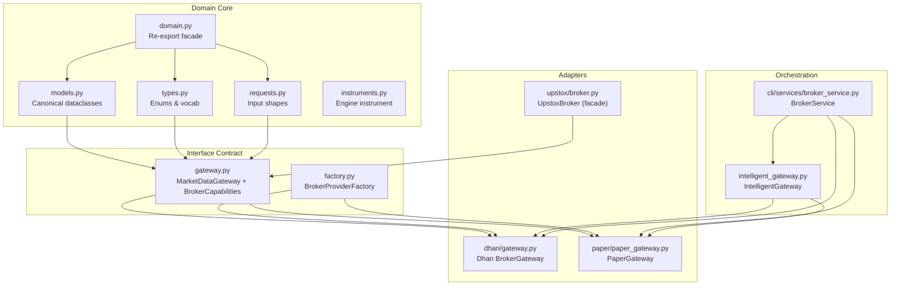
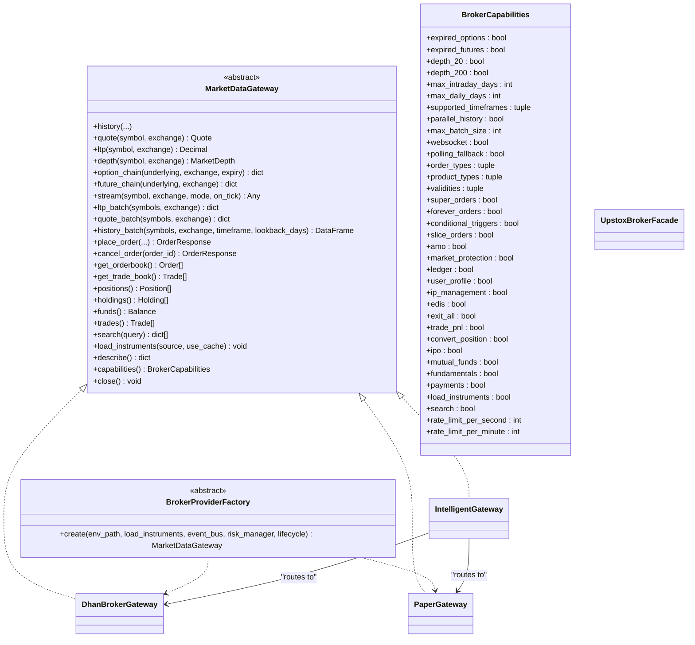
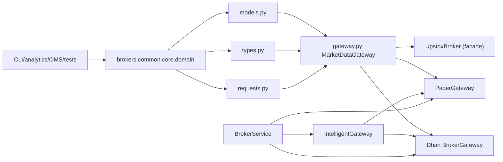

# Broker Abstraction Layer

<cite>
**Referenced Files in This Document**
- [domain.py](file://brokers/common/core/domain.py)
- [models.py](file://brokers/common/core/models.py)
- [types.py](file://brokers/common/core/types.py)
- [requests.py](file://brokers/common/core/requests.py)
- [gateway.py](file://brokers/common/gateway.py)
- [intelligent_gateway.py](file://brokers/common/intelligent_gateway.py)
- [factory.py](file://brokers/common/factory.py)
- [broker.py](file://brokers/upstox/broker.py)
- [paper_gateway.py](file://brokers/paper/paper_gateway.py)
- [broker_service.py](file://cli/services/broker_service.py)
- [broker.py](file://brokers/dhan/gateway.py)
- [instruments.py](file://brokers/common/core/instruments.py)
</cite>

## Table of Contents
1. [Introduction](#introduction)
2. [Project Structure](#project-structure)
3. [Core Components](#core-components)
4. [Architecture Overview](#architecture-overview)
5. [Detailed Component Analysis](#detailed-component-analysis)
6. [Dependency Analysis](#dependency-analysis)
7. [Performance Considerations](#performance-considerations)
8. [Troubleshooting Guide](#troubleshooting-guide)
9. [Conclusion](#conclusion)

## Introduction
This document describes the broker abstraction layer that unifies multiple brokerage APIs behind a single, canonical domain model and a strict interface contract. The domain.py re-export facade serves as the single source of truth for all domain types crossing adapter, OMS, CLI, analytics, and test boundaries. It defines dataclass-based canonical models (Order, Position, Instrument, Quote, MarketDepth, and others), a broker-agnostic MarketDataGateway interface, and a capability matrix for broker feature detection. The IntelligentGateway orchestrates dynamic broker selection and graceful degradation, while the adapter pattern wraps broker-specific implementations behind a unified interface. The document explains import patterns, thread-safety considerations, and how to integrate new brokers into the abstraction layer.

## Project Structure
The broker abstraction layer is organized around a small set of canonical domain types and a strict interface contract. Broker-specific adapters implement the contract and expose capabilities via a capability matrix. The CLI and OMS consume the unified interface, ensuring consistent behavior regardless of the underlying broker.

**Diagram sources**
- [domain.py:1-67](file://brokers/common/core/domain.py#L1-L67)
- [models.py:1-546](file://brokers/common/core/models.py#L1-L546)
- [types.py:1-263](file://brokers/common/core/types.py#L1-L263)
- [requests.py:1-96](file://brokers/common/core/requests.py#L1-L96)
- [gateway.py:1-433](file://brokers/common/gateway.py#L1-L433)
- [factory.py:1-45](file://brokers/common/factory.py#L1-L45)
- [broker.py:1-701](file://brokers/dhan/gateway.py#L1-L701)
- [broker.py:1-312](file://brokers/upstox/broker.py#L1-L312)
- [paper_gateway.py:1-312](file://brokers/paper/paper_gateway.py#L1-L312)
- [intelligent_gateway.py:1-534](file://brokers/common/intelligent_gateway.py#L1-L534)
- [broker_service.py:1-406](file://cli/services/broker_service.py#L1-L406)
- [instruments.py:1-150](file://brokers/common/core/instruments.py#L1-L150)

**Section sources**
- [domain.py:1-67](file://brokers/common/core/domain.py#L1-L67)
- [gateway.py:1-433](file://brokers/common/gateway.py#L1-L433)
- [intelligent_gateway.py:1-534](file://brokers/common/intelligent_gateway.py#L1-L534)
- [factory.py:1-45](file://brokers/common/factory.py#L1-L45)
- [broker.py:1-701](file://brokers/dhan/gateway.py#L1-L701)
- [broker.py:1-312](file://brokers/upstox/broker.py#L1-L312)
- [paper_gateway.py:1-312](file://brokers/paper/paper_gateway.py#L1-L312)
- [broker_service.py:1-406](file://cli/services/broker_service.py#L1-L406)
- [models.py:1-546](file://brokers/common/core/models.py#L1-L546)
- [types.py:1-263](file://brokers/common/core/types.py#L1-L263)
- [requests.py:1-96](file://brokers/common/core/requests.py#L1-L96)
- [instruments.py:1-150](file://brokers/common/core/instruments.py#L1-L150)

## Core Components
- Domain re-export facade: domain.py consolidates imports from types, models, requests, and reconciliation into a single canonical import path for all subsystems.
- Canonical dataclasses: models.py defines immutable and mutable domain models (Order, Position, Instrument, Quote, MarketDepth, etc.) with validation and convenience methods.
- Enums and vocabulary: types.py defines canonical enums (Side, OrderStatus, ProductType, etc.) and capability taxonomy.
- Request models: requests.py defines input shapes for order placement and previews.
- Broker interface: gateway.py defines MarketDataGateway (contract) and BrokerCapabilities (capability matrix).
- Factory abstraction: factory.py defines BrokerProviderFactory for dynamic broker instantiation.
- Orchestration: intelligent_gateway.py routes operations to the best broker and handles graceful degradation.
- Adapters: broker-specific implementations (Dhan, Upstox, Paper) implement MarketDataGateway and expose capabilities.

Key import patterns:
- Import canonical domain types from brokers.common.core.domain to ensure consistency across adapter, OMS, CLI, analytics, and tests.
- Use MarketDataGateway methods uniformly; do not leak broker-specific fields into the contract.

**Section sources**
- [domain.py:1-67](file://brokers/common/core/domain.py#L1-L67)
- [models.py:1-546](file://brokers/common/core/models.py#L1-L546)
- [types.py:1-263](file://brokers/common/core/types.py#L1-L263)
- [requests.py:1-96](file://brokers/common/core/requests.py#L1-L96)
- [gateway.py:1-433](file://brokers/common/gateway.py#L1-L433)
- [factory.py:1-45](file://brokers/common/factory.py#L1-L45)
- [intelligent_gateway.py:1-534](file://brokers/common/intelligent_gateway.py#L1-L534)

## Architecture Overview
The abstraction layer enforces a strict boundary:
- Outside the boundary: CLI, analytics, OMS, tests.
- Inside the boundary: broker adapters and the canonical domain.

**Diagram sources**
- [gateway.py:115-433](file://brokers/common/gateway.py#L115-L433)
- [factory.py:16-45](file://brokers/common/factory.py#L16-L45)
- [broker.py:43-701](file://brokers/dhan/gateway.py#L43-L701)
- [paper_gateway.py:30-312](file://brokers/paper/paper_gateway.py#L30-L312)
- [intelligent_gateway.py:94-534](file://brokers/common/intelligent_gateway.py#L94-L534)
- [broker.py:99-312](file://brokers/upstox/broker.py#L99-L312)

## Detailed Component Analysis

### Domain Types and Validation Rules
- Order: Immutable canonical order with fields for identifiers, sides, types, quantities, pricing, status, timestamps, and correlation. Includes helpers for remaining quantity, terminal status, and immutability via dataclasses.replace.
- Position: Immutable position with symbol, exchange, quantities, prices, and PnL calculations. Provides with_ltp and with_fill transformations.
- Instrument: Canonical instrument master record for trading engine use, distinct from broker-specific instrument models.
- Quote: Canonical quote snapshot with LTP, OHLC, volume, change, bid/ask, and timestamp.
- MarketDepth: Canonical depth with bids/asks lists and depth type.
- Requests: OrderRequest, ModifyOrderRequest, SliceOrderRequest, OrderPreview, HistoricalCandle define input shapes for operations.
- Enums: Side, OrderStatus, ProductType, OrderType, Validity, ExchangeSegment, InstrumentType, Capability, ConnectionStatus, PositionState define canonical vocabulary and state machines.

Validation and normalization:
- Order.from_broker_dict normalizes broker-specific status strings via a status mapper registry and converts exchange strings using an optional resolver.
- OrderStatus.normalize delegates to a registry to ensure canonical status values.
- Dataclasses with slots=True reduce memory footprint; frozen=True ensures immutability for canonical types.

Examples of usage:
- Place an order: call gateway.place_order with parameters mapped to OrderRequest semantics; receive OrderResponse.
- Inspect capabilities: call gateway.capabilities() and check fields such as websocket, order_types, product_types, and rate limits.
- Batch operations: use ltp_batch, quote_batch, history_batch where supported.

**Section sources**
- [models.py:69-167](file://brokers/common/core/models.py#L69-L167)
- [models.py:169-237](file://brokers/common/core/models.py#L169-L237)
- [models.py:240-286](file://brokers/common/core/models.py#L240-L286)
- [models.py:289-393](file://brokers/common/core/models.py#L289-L393)
- [models.py:396-449](file://brokers/common/core/models.py#L396-L449)
- [models.py:418-432](file://brokers/common/core/models.py#L418-L432)
- [models.py:452-477](file://brokers/common/core/models.py#L452-L477)
- [models.py:480-546](file://brokers/common/core/models.py#L480-L546)
- [types.py:14-165](file://brokers/common/core/types.py#L14-L165)
- [requests.py:23-96](file://brokers/common/core/requests.py#L23-L96)
- [domain.py:1-67](file://brokers/common/core/domain.py#L1-L67)

### Broker Interface Design and Adapter Pattern
- MarketDataGateway defines the contract that all broker adapters must implement. Methods are grouped by domain (market data, batch, trading, portfolio, instrument, lifecycle).
- BrokerCapabilities exposes a frozen capability matrix for feature detection and routing decisions.
- Adapter pattern: each broker (Dhan, Upstox, Paper) implements MarketDataGateway and wraps broker-specific clients and connections. They expose canonical domain types and hide broker internals from consumers.

Thread-safety and locks:
- Adapters use threading.RLock or Lock where needed to protect shared state (e.g., stream registries, caches).
- Dataclasses with slots=True are used for memory efficiency; frozen=True for immutable canonical types.

Integration examples:
- DhanBrokerGateway implements MarketDataGateway and exposes extended capabilities via an extended facade.
- UpstoxBroker facade wires many adapters and capabilities; UpstoxBrokerGateway (separate) implements MarketDataGateway.
- PaperGateway implements MarketDataGateway for simulation/testing.

**Section sources**
- [gateway.py:115-433](file://brokers/common/gateway.py#L115-L433)
- [broker.py:43-701](file://brokers/dhan/gateway.py#L43-L701)
- [broker.py:99-312](file://brokers/upstox/broker.py#L99-L312)
- [paper_gateway.py:30-312](file://brokers/paper/paper_gateway.py#L30-L312)

### IntelligentGateway Pattern and Dynamic Broker Selection
- IntelligentGateway routes operations to the best available broker based on operation type and broker capabilities.
- Graceful degradation: when all brokers are down, read operations return cached/stale data (with metadata tagging), while write operations raise a degraded error.
- Health monitoring: tracks consecutive failures per broker and skips unhealthy ones.
- Thread-safety: uses a Lock for cache access; RLocks elsewhere ensure safe concurrent access to shared state.
- Observability: logs fallbacks and increments metrics for each fallback type.

Routing strategy highlights:
- LTP/Quote: prefer Upstox (faster batch).
- History: prefer Dhan (better intraday support).
- Option Chain: prefer Dhan (more complete).
- Future Chain: Dhan (Upstox doesn’t support).
- Depth: prefer Dhan (Upstox endpoint deprecated).
- Positions/Holdings/Funds: use first available.

**Section sources**
- [intelligent_gateway.py:94-534](file://brokers/common/intelligent_gateway.py#L94-L534)

### Factory Pattern for Dynamic Broker Instantiation
- BrokerProviderFactory abstracts creation of configured MarketDataGateway instances.
- CLI/BrokerService resolves the active broker using a unified registry and lifecycle management, passing environment paths, instrument loading preferences, event buses, risk managers, and lifecycle managers to the factory.

Import patterns:
- Import canonical domain types from brokers.common.core.domain.
- Instantiate gateways via factory.create with env_path and lifecycle.

**Section sources**
- [factory.py:16-45](file://brokers/common/factory.py#L16-L45)
- [broker_service.py:121-244](file://cli/services/broker_service.py#L121-L244)

### Relationship Between Domain Types and Broker Adapters
- Adapters translate broker-specific responses into canonical domain types (e.g., Order, Position, Quote, MarketDepth).
- Instruments: brokers.common.core.models.Instrument is the adapter-level instrument; brokers.common.core.instruments.Instrument is for the trading engine.
- BrokerCapabilities drives feature detection; adapters populate capabilities consistently.

Integration steps for a new broker:
- Implement MarketDataGateway and return canonical domain types.
- Define BrokerCapabilities reflecting supported features.
- Provide a BrokerProviderFactory.create implementation that builds the gateway from environment and lifecycle.
- Optionally implement ObservabilityProvider to expose connection and operational metrics.
- Wire into BrokerService via the unified registry.

**Section sources**
- [models.py:452-477](file://brokers/common/core/models.py#L452-L477)
- [instruments.py:12-107](file://brokers/common/core/instruments.py#L12-L107)
- [gateway.py:42-108](file://brokers/common/gateway.py#L42-L108)
- [broker_service.py:137-212](file://cli/services/broker_service.py#L137-L212)

## Dependency Analysis
The abstraction layer minimizes coupling by enforcing a single import path for domain types and a strict interface contract. Adapters depend on the canonical domain and the interface contract, while higher layers (CLI, OMS, analytics) depend only on the canonical domain and the interface.

**Diagram sources**
- [domain.py:1-67](file://brokers/common/core/domain.py#L1-L67)
- [models.py:1-546](file://brokers/common/core/models.py#L1-L546)
- [types.py:1-263](file://brokers/common/core/types.py#L1-L263)
- [requests.py:1-96](file://brokers/common/core/requests.py#L1-L96)
- [gateway.py:115-433](file://brokers/common/gateway.py#L115-L433)
- [intelligent_gateway.py:94-534](file://brokers/common/intelligent_gateway.py#L94-L534)
- [broker_service.py:1-406](file://cli/services/broker_service.py#L1-L406)
- [broker.py:1-701](file://brokers/dhan/gateway.py#L1-L701)
- [broker.py:1-312](file://brokers/upstox/broker.py#L1-L312)
- [paper_gateway.py:1-312](file://brokers/paper/paper_gateway.py#L1-L312)

**Section sources**
- [domain.py:1-67](file://brokers/common/core/domain.py#L1-L67)
- [gateway.py:1-433](file://brokers/common/gateway.py#L1-L433)
- [intelligent_gateway.py:1-534](file://brokers/common/intelligent_gateway.py#L1-L534)
- [broker_service.py:1-406](file://cli/services/broker_service.py#L1-L406)

## Performance Considerations
- Dataclasses with slots=True reduce memory overhead for canonical domain types.
- Frozen dataclasses ensure immutability and enable safe sharing across threads.
- Batch operations (ltp_batch, quote_batch, history_batch) improve throughput where supported.
- IntelligentGateway caching reduces redundant network calls for read operations; write operations avoid stale data to preserve correctness.
- Use BrokerCapabilities to avoid unsupported operations and minimize retries.

[No sources needed since this section provides general guidance]

## Troubleshooting Guide
Common issues and resolutions:
- Broker capability mismatches: Use gateway.capabilities() to detect supported features and adjust logic accordingly.
- Stale data in degraded mode: IntelligentGateway serves cached/stale data for reads; writes raise a degraded error. Verify health monitor and cache TTLs.
- Thread-safety violations: Ensure shared state is protected by locks; prefer immutable canonical types to avoid races.
- Order status normalization: If statuses appear inconsistent, verify adapter status normalization via the registry.
- Import boundary violations: Always import domain types from brokers.common.core.domain to maintain a single source of truth.

**Section sources**
- [intelligent_gateway.py:323-375](file://brokers/common/intelligent_gateway.py#L323-L375)
- [gateway.py:42-108](file://brokers/common/gateway.py#L42-L108)
- [models.py:146-166](file://brokers/common/core/models.py#L146-L166)

## Conclusion
The broker abstraction layer establishes a robust, canonical domain and a strict interface contract that insulates higher layers from broker-specific details. The domain.py re-export facade, dataclass-based canonical models, MarketDataGateway interface, and BrokerCapabilities matrix collectively enable dynamic broker instantiation, intelligent routing, and graceful degradation. Following the documented import patterns, thread-safety guidelines, and integration steps ensures consistent behavior and maintainability across adapters, CLI, OMS, analytics, and tests.