# Core Architecture

<cite>
**Referenced Files in This Document**
- [domain/__init__.py](file://domain/__init__.py)
- [domain/entities/__init__.py](file://domain/entities/__init__.py)
- [domain/entities/account.py](file://domain/entities/account.py)
- [domain/entities/alerts.py](file://domain/entities/alerts.py)
- [domain/entities/instrument.py](file://domain/entities/instrument.py)
- [domain/entities/market.py](file://domain/entities/market.py)
- [domain/entities/options.py](file://domain/entities/options.py)
- [domain/entities/order.py](file://domain/entities/order.py)
- [domain/entities/position.py](file://domain/entities/position.py)
- [domain/entities/trade.py](file://domain/entities/trade.py)
- [domain/types.py](file://domain/types.py)
- [domain/enums.py](file://domain/enums.py)
- [domain/market_enums.py](file://domain/market_enums.py)
- [brokers/common/core/domain.py](file://brokers/common/core/domain.py)
- [brokers/common/execution/trading_orchestrator.py](file://brokers/common/execution/trading_orchestrator.py)
- [brokers/common/execution/execution_service.py](file://brokers/common/execution/execution_service.py)
- [brokers/common/execution/execution_mode_adapter.py](file://brokers/common/execution/execution_mode_adapter.py)
- [brokers/common/execution/place_order_use_case.py](file://brokers/common/execution/place_order_use_case.py)
- [brokers/common/execution/cancel_order_use_case.py](file://brokers/common/execution/cancel_order_use_case.py)
- [brokers/common/oms/context.py](file://brokers/common/oms/context.py)
- [brokers/common/oms/order_manager.py](file://brokers/common/oms/order_manager.py)
- [brokers/common/gateway.py](file://brokers/common/gateway.py)
- [brokers/common/intelligent_gateway.py](file://brokers/common/intelligent_gateway.py)
- [brokers/common/factory.py](file://brokers/common/factory.py)
- [cli/services/broker_service.py](file://cli/services/broker_service.py)
- [brokers/common/event_bus/event_bus.py](file://brokers/common/event_bus/event_bus.py)
- [brokers/common/event_bus/async_event_bus.py](file://brokers/common/event_bus/async_event_bus.py)
- [brokers/common/lifecycle/lifecycle.py](file://brokers/common/lifecycle/lifecycle.py)
- [brokers/common/observability/event_metrics.py](file://brokers/common/observability/event_metrics.py)
- [brokers/common/resilience/backoff.py](file://brokers/common/resilience/backoff.py)
</cite>

## Update Summary
**Changes Made**
- Updated domain model consolidation section to reflect comprehensive domain entity restructuring with new canonical dataclasses
- Enhanced canonical domain types documentation with unified entity definitions including Balance, ConditionalAlert, OptionContract, FutureContract, Instrument, and MarketDepth
- Added new sections documenting the enhanced type system with frozen dataclasses and improved domain entity organization
- Updated architectural diagrams to reflect the new domain model structure and relationships

## Table of Contents
1. [Introduction](#introduction)
2. [Project Structure](#project-structure)
3. [Core Components](#core-components)
4. [Architecture Overview](#architecture-overview)
5. [Detailed Component Analysis](#detailed-component-analysis)
6. [Dependency Analysis](#dependency-analysis)
7. [Performance Considerations](#performance-considerations)
8. [Troubleshooting Guide](#troubleshooting-guide)
9. [Conclusion](#conclusion)
10. [Appendices](#appendices)

## Introduction
This document describes the core architecture of TradeXV2 with a focus on the layered design and component relationships. The system has undergone comprehensive domain model consolidation, broker abstraction hardening, and execution system redesign. The system is built around:
- A unified domain model with canonical entities, frozen dataclasses, and slots for optimal memory usage
- A hardened broker abstraction layer (MarketDataGateway) with enhanced interfaces and capability-based composition
- A modernized execution system featuring TradingOrchestrator, ExecutionService, and execution mode adapters
- A centralized TradingContext for service composition and lifecycle management
- An event-driven architecture powered by thread-safe EventBus with async support
- An order management system (OMS) enforcing idempotency, risk checks, and state validation
- Cross-cutting concerns for observability, resilience, and lifecycle management

The canonical domain types defined in the domain layer act as the single source of truth across adapters, CLI/TUI, analytics, and test boundaries.

## Project Structure
The architecture is organized into cohesive layers with enhanced modularity:
- CLI/TUI layer: command orchestration and presentation
- Service layer: composition roots and lifecycle management through TradingContext
- Broker abstraction: gateway contract and intelligent routing with enhanced capabilities
- Broker adapters: Dhan and Upstox implementations with unified domain interfaces
- Execution layer: TradingOrchestrator, ExecutionService, and execution mode adapters
- Event bus: in-process event distribution with observability and async support
- OMS: order lifecycle and position management with unified command objects
- Resilience and observability: backoff strategies, health monitoring, metrics

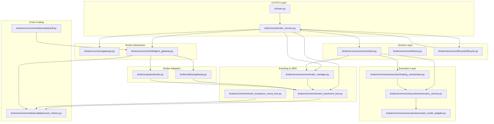

**Diagram sources**
- [cli/services/broker_service.py:41-406](file://cli/services/broker_service.py#L41-L406)
- [brokers/common/oms/context.py:44-478](file://brokers/common/oms/context.py#L44-L478)
- [brokers/common/gateway.py:115-365](file://brokers/common/gateway.py#L115-L365)
- [brokers/common/intelligent_gateway.py:94-534](file://brokers/common/intelligent_gateway.py#L94-L534)
- [brokers/common/execution/trading_orchestrator.py:96-576](file://brokers/common/execution/trading_orchestrator.py#L96-L576)
- [brokers/common/execution/execution_service.py:18-59](file://brokers/common/execution/execution_service.py#L18-L59)
- [brokers/common/execution/execution_mode_adapter.py:16-89](file://brokers/common/execution/execution_mode_adapter.py#L16-L89)
- [brokers/common/event_bus/event_bus.py:118-420](file://brokers/common/event_bus/event_bus.py#L118-L420)
- [brokers/common/event_bus/async_event_bus.py](file://brokers/common/event_bus/async_event_bus.py)
- [brokers/common/oms/order_manager.py:94-556](file://brokers/common/oms/order_manager.py#L94-L556)

## Core Components
- **Unified Domain Model**: Central enums, models, and request/response types that unify broker adapters and downstream systems with frozen dataclasses and slots
- **Enhanced MarketDataGateway**: Broker-agnostic contract with comprehensive capability discovery and runtime feature detection
- **TradingOrchestrator**: Modernized execution orchestrator connecting scanner-strategy-OMS workflow with configurable execution modes
- **ExecutionService**: Unified execution facade supporting live, paper, and replay modes through execution adapters
- **TradingContext**: Central service container managing EventBus, OMS, Position and Risk managers with lifecycle integration
- **Execution Mode Adapters**: LiveOMSAdapter, PaperOMSAdapter, and ReplayOMSAdapter for mode-specific order execution
- **IntelligentGateway**: Routes operations to best broker with parallel reads, caching, and graceful degradation
- **Factory Pattern**: BrokerProviderFactory for dynamic broker instantiation with configurable dependencies
- **Enhanced EventBus**: Thread-safe event bus with async support, mandatory observability, and dead-letter queue integration
- **OrderManager**: Thread-safe OMS with unified command objects, idempotency, risk checks, and event publishing
- **LifecycleManager**: Deterministic service ownership with health snapshots and managed service lifecycle
- **Observability**: EventMetrics for counters and rates; backoff strategies for resilient retries

**Section sources**
- [domain/__init__.py:1-92](file://domain/__init__.py#L1-L92)
- [domain/entities/__init__.py:1-82](file://domain/entities/__init__.py#L1-L82)
- [domain/entities/order.py:47-218](file://domain/entities/order.py#L47-L218)
- [domain/entities/position.py:11-93](file://domain/entities/position.py#L11-L93)
- [domain/entities/account.py:13-38](file://domain/entities/account.py#L13-L38)
- [domain/entities/market.py:10-55](file://domain/entities/market.py#L10-L55)
- [domain/entities/options.py:28-236](file://domain/entities/options.py#L28-L236)
- [domain/entities/instrument.py:11-39](file://domain/entities/instrument.py#L11-L39)
- [domain/entities/alerts.py:9-69](file://domain/entities/alerts.py#L9-L69)
- [domain/entities/trade.py:12-33](file://domain/entities/trade.py#L12-L33)
- [domain/types.py:1-36](file://domain/types.py#L1-L36)
- [domain/enums.py:11-77](file://domain/enums.py#L11-L77)
- [domain/market_enums.py:11-37](file://domain/market_enums.py#L11-L37)

## Architecture Overview
The system follows a modernized layered, event-driven design with enhanced execution orchestration:
- CLI/TUI invokes BrokerService, which composes TradingContext and wires gateway stack with lifecycle, observability, and OMS services
- TradingContext manages central service composition including EventBus, OrderManager, PositionManager, and RiskManager
- BrokerService delegates to MarketDataGateway implementations (Dhan, Upstox) or IntelligentGateway for routing
- TradingOrchestrator connects scanner-strategy-OMS workflow with configurable execution modes
- ExecutionService provides unified order placement through execution adapters (Live, Paper, Replay)
- EventBus distributes domain events across subscribers; OrderManager consumes and updates state
- Resilience and observability are integrated at multiple layers with async event bus support

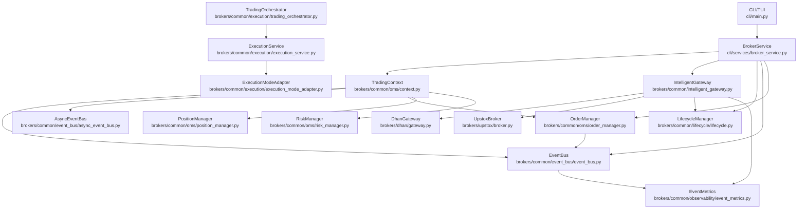

**Diagram sources**
- [cli/services/broker_service.py:41-406](file://cli/services/broker_service.py#L41-L406)
- [brokers/common/oms/context.py:44-478](file://brokers/common/oms/context.py#L44-L478)
- [brokers/common/execution/trading_orchestrator.py:96-576](file://brokers/common/execution/trading_orchestrator.py#L96-L576)
- [brokers/common/execution/execution_service.py:18-59](file://brokers/common/execution/execution_service.py#L18-L59)
- [brokers/common/execution/execution_mode_adapter.py:16-89](file://brokers/common/execution/execution_mode_adapter.py#L16-L89)
- [brokers/common/intelligent_gateway.py:94-534](file://brokers/common/intelligent_gateway.py#L94-L534)

## Detailed Component Analysis

### Unified Domain Model Consolidation
- **Domain Layer**: Single source of truth with comprehensive re-exports from domain.* packages
- **Canonical Entities**: Frozen dataclasses with slots for optimal memory usage and performance
- **Entity Consolidation**: Account entities merged (FundLimits → Balance), options entities unified
- **Enhanced Type System**: Comprehensive enums (Side, OrderStatus, ProductType, OrderType, Validity, ExchangeSegment, InstrumentType)
- **New Domain Entities**: ConditionalAlert, OptionContract, FutureContract, MarketDepth, Instrument, Trade, and supporting structures

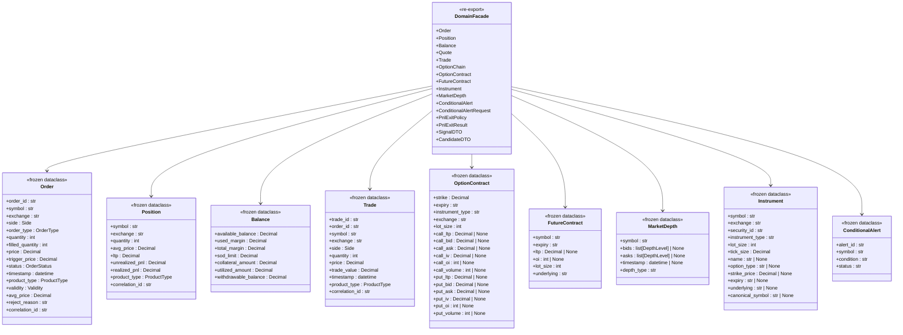

**Diagram sources**
- [domain/__init__.py:10-92](file://domain/__init__.py#L10-L92)
- [domain/entities/order.py:47-218](file://domain/entities/order.py#L47-L218)
- [domain/entities/position.py:11-93](file://domain/entities/position.py#L11-L93)
- [domain/entities/account.py:13-38](file://domain/entities/account.py#L13-L38)
- [domain/entities/trade.py:12-33](file://domain/entities/trade.py#L12-L33)
- [domain/entities/options.py:28-236](file://domain/entities/options.py#L28-L236)
- [domain/entities/market.py:19-55](file://domain/entities/market.py#L19-L55)
- [domain/entities/instrument.py:11-39](file://domain/entities/instrument.py#L11-L39)
- [domain/entities/alerts.py:9-69](file://domain/entities/alerts.py#L9-L69)

**Section sources**
- [domain/__init__.py:1-92](file://domain/__init__.py#L1-L92)
- [domain/entities/__init__.py:1-82](file://domain/entities/__init__.py#L1-L82)
- [domain/entities/order.py:47-218](file://domain/entities/order.py#L47-L218)
- [domain/entities/position.py:11-93](file://domain/entities/position.py#L11-L93)
- [domain/entities/account.py:13-38](file://domain/entities/account.py#L13-L38)
- [domain/entities/trade.py:12-33](file://domain/entities/trade.py#L12-L33)
- [domain/entities/options.py:28-236](file://domain/entities/options.py#L28-L236)
- [domain/entities/market.py:10-55](file://domain/entities/market.py#L10-L55)
- [domain/entities/instrument.py:11-39](file://domain/entities/instrument.py#L11-L39)
- [domain/entities/alerts.py:9-69](file://domain/entities/alerts.py#L9-L69)
- [domain/types.py:1-36](file://domain/types.py#L1-L36)
- [domain/enums.py:11-77](file://domain/enums.py#L11-L77)
- [domain/market_enums.py:11-37](file://domain/market_enums.py#L11-L37)

### Enhanced Broker Abstraction Layer
- **MarketDataGateway**: Enhanced contract with comprehensive capability discovery and runtime feature detection
- **BrokerCapabilities**: Runtime capability registration and dynamic provider retrieval
- **ObservabilityProvider**: Canonical observability data exposure without implementation leakage
- **FieldMapping Protocol**: Broker-specific field name mapping for order parsing
- **Unified Order Processing**: Consistent order handling across all broker adapters

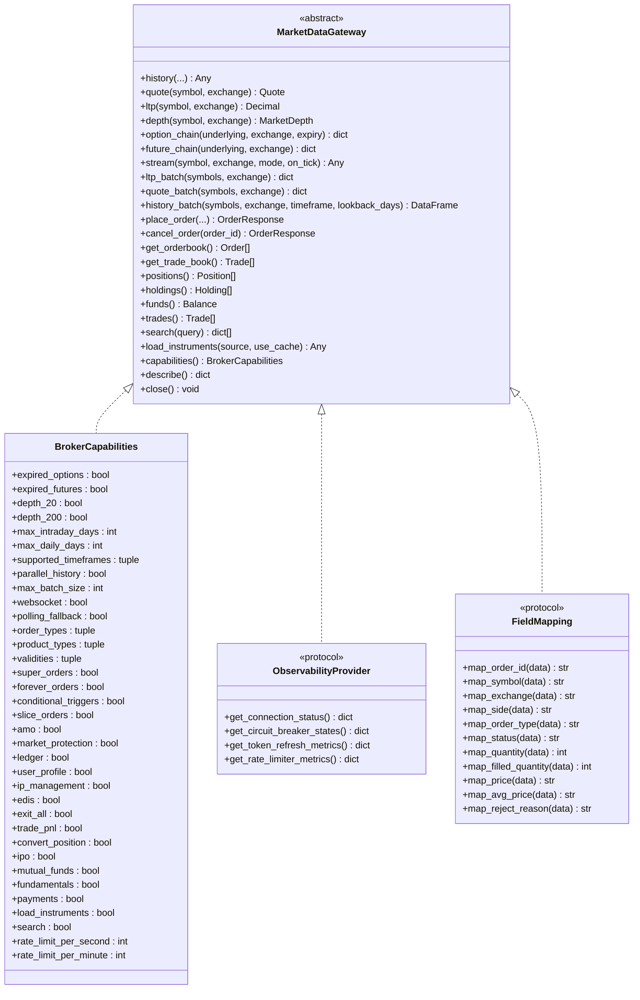

**Diagram sources**
- [brokers/common/gateway.py:115-365](file://brokers/common/gateway.py#L115-L365)

**Section sources**
- [brokers/common/gateway.py:115-365](file://brokers/common/gateway.py#L115-L365)

### Modernized Execution System
- **TradingOrchestrator**: Connects scanner-strategy-OMS workflow with configurable execution modes and risk controls
- **ExecutionService**: Unified facade supporting live, paper, and replay execution through adapters
- **Execution Mode Adapters**: LiveOMSAdapter, PaperOMSAdapter, and ReplayOMSAdapter for different trading modes
- **TradingContext**: Central service container managing all trading services with lifecycle integration
- **PlaceOrderUseCase**: Risk validation and event publishing for order placement
- **CancelOrderUseCase**: Simplified order cancellation with event publishing

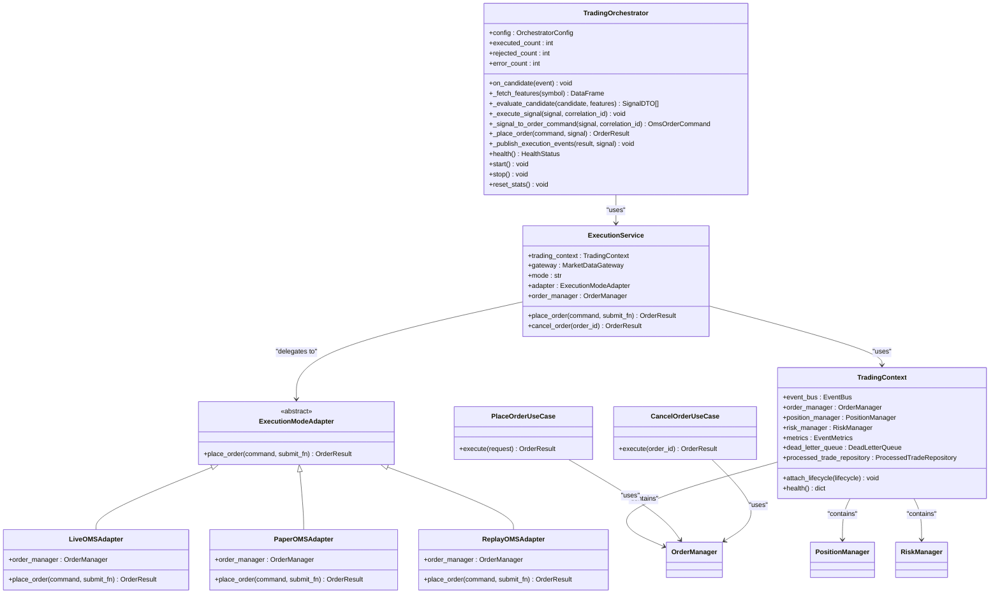

**Diagram sources**
- [brokers/common/execution/trading_orchestrator.py:96-576](file://brokers/common/execution/trading_orchestrator.py#L96-L576)
- [brokers/common/execution/execution_service.py:18-59](file://brokers/common/execution/execution_service.py#L18-L59)
- [brokers/common/execution/execution_mode_adapter.py:16-89](file://brokers/common/execution/execution_mode_adapter.py#L16-L89)
- [brokers/common/oms/context.py:44-478](file://brokers/common/oms/context.py#L44-L478)
- [brokers/common/execution/place_order_use_case.py:13-57](file://brokers/common/execution/place_order_use_case.py#L13-L57)
- [brokers/common/execution/cancel_order_use_case.py:11-33](file://brokers/common/execution/cancel_order_use_case.py#L11-L33)

**Section sources**
- [brokers/common/execution/trading_orchestrator.py:96-576](file://brokers/common/execution/trading_orchestrator.py#L96-L576)
- [brokers/common/execution/execution_service.py:18-59](file://brokers/common/execution/execution_service.py#L18-L59)
- [brokers/common/execution/execution_mode_adapter.py:16-89](file://brokers/common/execution/execution_mode_adapter.py#L16-L89)
- [brokers/common/oms/context.py:44-478](file://brokers/common/oms/context.py#L44-L478)
- [brokers/common/execution/place_order_use_case.py:13-57](file://brokers/common/execution/place_order_use_case.py#L13-L57)
- [brokers/common/execution/cancel_order_use_case.py:11-33](file://brokers/common/execution/cancel_order_use_case.py#L11-L33)

### Enhanced Broker Adapters
- **DhanGateway**: Implements MarketDataGateway and ObservabilityProvider with extended capabilities and WebSocket feeds
- **UpstoxBroker**: Composite broker with capability-based routing and lifecycle management
- **Unified Interface**: Both adapters now use canonical domain entities and consistent order processing

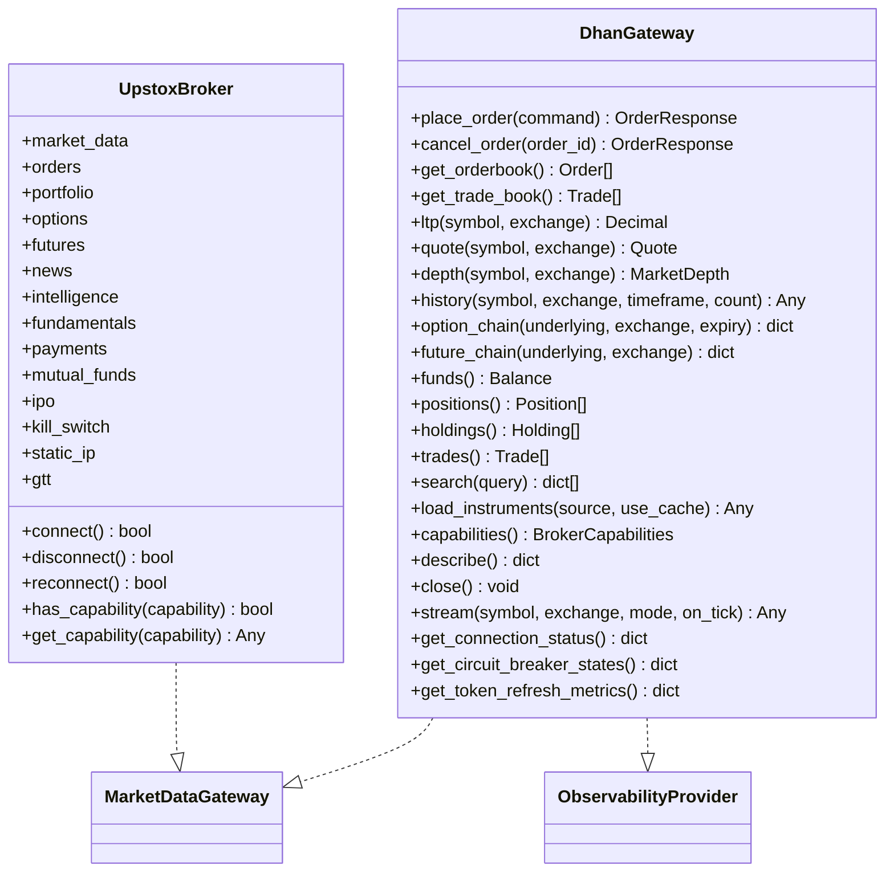

**Diagram sources**
- [brokers/dhan/gateway.py:41-641](file://brokers/dhan/gateway.py#L41-L641)
- [brokers/upstox/broker.py:99-312](file://brokers/upstox/broker.py#L99-L312)

**Section sources**
- [brokers/dhan/gateway.py:41-641](file://brokers/dhan/gateway.py#L41-L641)
- [brokers/upstox/broker.py:99-312](file://brokers/upstox/broker.py#L99-L312)

### Enhanced Event-Driven Architecture and EventBus
- **Thread-Safe EventBus**: Synchronous event bus with mandatory observability for handler failures
- **AsyncEventBus Integration**: Optional async event processing with uniform publish API
- **DeadLetterQueue Integration**: Automatic failure handling and recovery
- **EventMetrics**: Comprehensive observability with counters and rate-based alerting
- **Event Types**: Unified EventType enum for consistent event handling

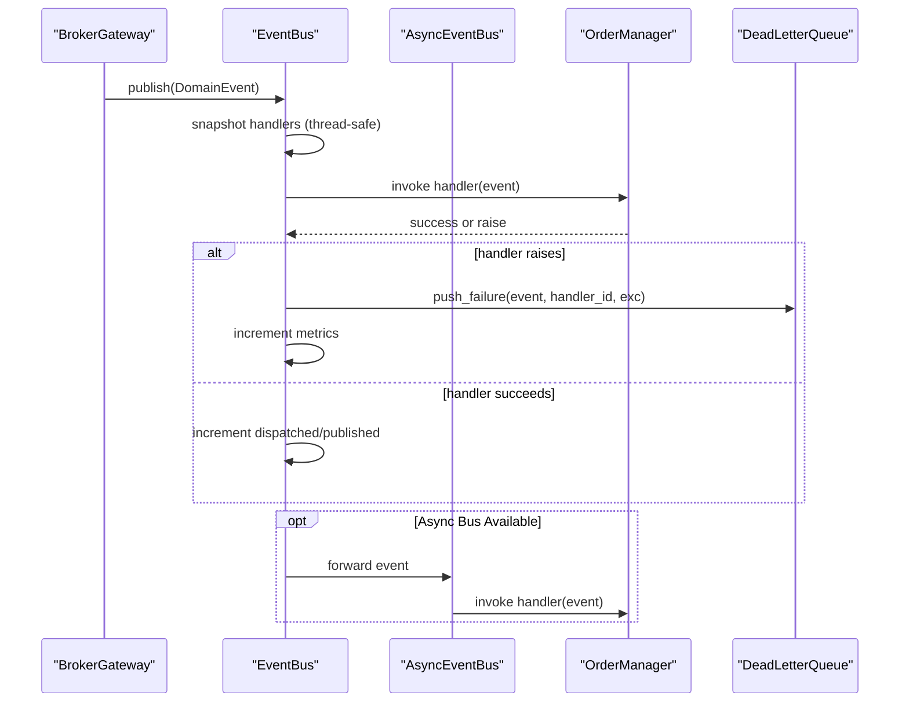

**Diagram sources**
- [brokers/common/event_bus/event_bus.py:298-420](file://brokers/common/event_bus/event_bus.py#L298-L420)
- [brokers/common/event_bus/async_event_bus.py](file://brokers/common/event_bus/async_event_bus.py)
- [brokers/common/oms/order_manager.py:483-512](file://brokers/common/oms/order_manager.py#L483-L512)

**Section sources**
- [brokers/common/event_bus/event_bus.py:118-420](file://brokers/common/event_bus/event_bus.py#L118-L420)
- [brokers/common/event_bus/async_event_bus.py](file://brokers/common/event_bus/async_event_bus.py)

### Enhanced Order Management System (OMS)
- **Unified Command Objects**: OmsOrderCommand replaces OrderRequest for canonical command handling
- **Thread-Safe Operations**: RLock protection with idempotency, risk checks, and event publishing
- **Collaborators**: OrderStateValidator, OrderAuditLogger, OrderPositionUpdater for specialized responsibilities
- **Risk Integration**: Integrated kill switch and risk manager for comprehensive risk control
- **Processed Trade Repository**: Idempotency ledger preventing double-position bugs

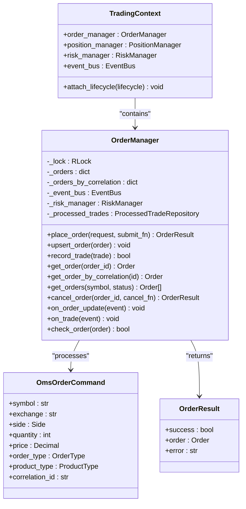

**Diagram sources**
- [brokers/common/oms/order_manager.py:94-556](file://brokers/common/oms/order_manager.py#L94-L556)
- [brokers/common/oms/context.py:44-478](file://brokers/common/oms/context.py#L44-L478)

**Section sources**
- [brokers/common/oms/order_manager.py:94-556](file://brokers/common/oms/order_manager.py#L94-L556)
- [brokers/common/oms/context.py:44-478](file://brokers/common/oms/context.py#L44-L478)

### Enhanced Lifecycle Management
- **TradingContext Ownership**: Centralized service management with deterministic start/stop
- **ManagedService Integration**: LifecycleManager owns all background services including websockets and schedulers
- **Health Monitoring**: Comprehensive health snapshots with observability integration
- **Async Support**: Optional AsyncEventBus integration with proper lifecycle management

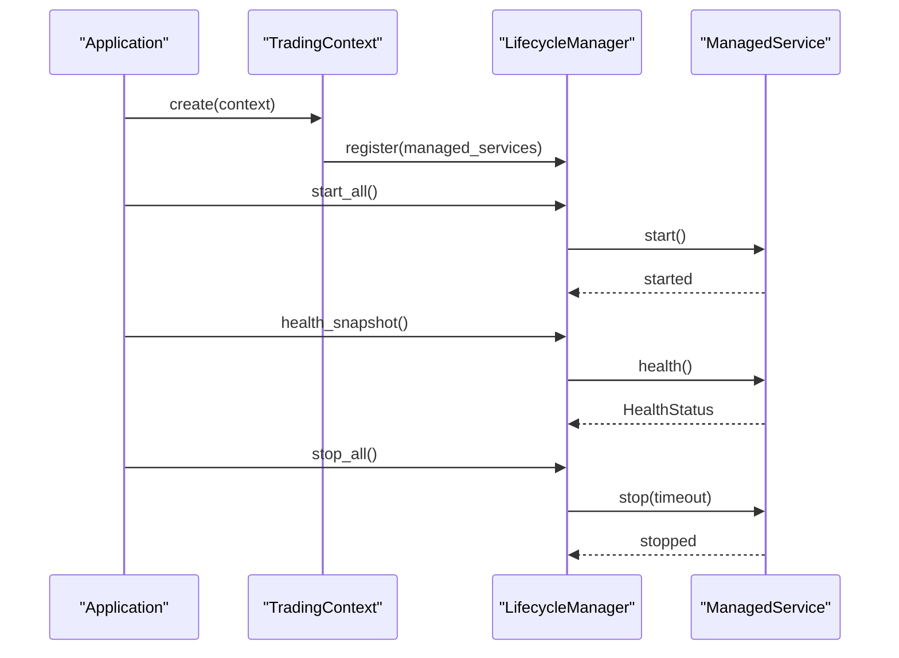

**Diagram sources**
- [brokers/common/oms/context.py:183-211](file://brokers/common/oms/context.py#L183-L211)

**Section sources**
- [brokers/common/oms/context.py:183-211](file://brokers/common/oms/context.py#L183-L211)

### Enhanced Observability and Resilience
- **EventMetrics**: Thread-safe counters with timestamped metrics for rate-based alerting
- **Backoff Strategies**: Comprehensive retry mechanisms with jitter for resilient operations
- **IntelligentGateway Integration**: Metrics and health monitoring for fallback observability
- **Async Event Bus**: Optional async processing with proper resource management

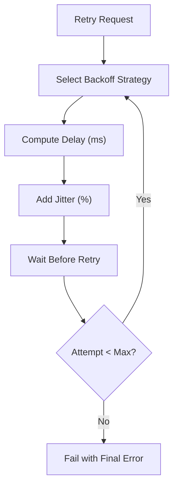

**Diagram sources**
- [brokers/common/observability/event_metrics.py:106-165](file://brokers/common/observability/event_metrics.py#L106-L165)
- [brokers/common/resilience/backoff.py:49-78](file://brokers/common/resilience/backoff.py#L49-L78)
- [brokers/common/intelligent_gateway.py:392-421](file://brokers/common/intelligent_gateway.py#L392-L421)

**Section sources**
- [brokers/common/observability/event_metrics.py:35-196](file://brokers/common/observability/event_metrics.py#L35-L196)
- [brokers/common/resilience/backoff.py:19-78](file://brokers/common/resilience/backoff.py#L19-L78)
- [brokers/common/intelligent_gateway.py:392-421](file://brokers/common/intelligent_gateway.py#L392-L421)

## Dependency Analysis
- **Domain Model**: Unified domain layer with canonical re-exports replacing brokers.common.core.domain
- **Execution Layer**: TradingOrchestrator depends on ExecutionService, which depends on execution adapters
- **Service Composition**: TradingContext manages EventBus, OrderManager, PositionManager, and RiskManager
- **Broker Abstraction**: MarketDataGateway is single contract; adapters implement it; IntelligentGateway composes gateways
- **CLI/TUI**: Depends on BrokerService for composition and lifecycle; BrokerService depends on factories and lifecycle manager
- **Event Bus**: Cross-cutting dependency for order updates and market data events with async support
- **OMS**: Depends on EventBus and canonical domain models; validates state transitions and enforces idempotency
- **Resilience**: Integrated via backoff strategies, health monitors, and metrics

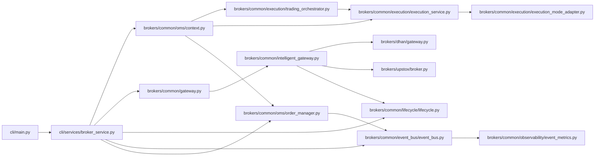

**Diagram sources**
- [cli/services/broker_service.py:41-406](file://cli/services/broker_service.py#L41-L406)
- [brokers/common/oms/context.py:44-478](file://brokers/common/oms/context.py#L44-L478)
- [brokers/common/gateway.py:115-365](file://brokers/common/gateway.py#L115-L365)
- [brokers/common/intelligent_gateway.py:94-534](file://brokers/common/intelligent_gateway.py#L94-L534)
- [brokers/common/execution/trading_orchestrator.py:96-576](file://brokers/common/execution/trading_orchestrator.py#L96-L576)
- [brokers/common/execution/execution_service.py:18-59](file://brokers/common/execution/execution_service.py#L18-L59)
- [brokers/common/execution/execution_mode_adapter.py:16-89](file://brokers/common/execution/execution_mode_adapter.py#L16-L89)

**Section sources**
- [cli/services/broker_service.py:41-406](file://cli/services/broker_service.py#L41-L406)
- [brokers/common/oms/context.py:44-478](file://brokers/common/oms/context.py#L44-L478)

## Performance Considerations
- **Frozen Dataclasses with Slots**: Reduced memory overhead and improved attribute access speed for domain models
- **Thread-Safe Concurrency**: threading.RLock protects shared mutable state in EventBus and OrderManager
- **Execution Mode Optimization**: Separate adapters for live, paper, and replay modes optimize performance per use case
- **IntelligentGateway Caching**: Reduces repeated broker calls for read-heavy operations
- **Parallel Batch Operations**: DhanGateway acceleration for multi-symbol fetches
- **Async Event Bus**: Optional async processing reduces blocking and improves throughput
- **Backoff Strategies**: Jitter mitigation for thundering herds and improved broker stability

## Troubleshooting Guide
- **EventBus Handler Failures**: Failures logged, counted, and dead-lettered; verify DeadLetterQueue presence and metrics
- **OrderManager Idempotency**: Duplicated trades detected and logged; inspect ProcessedTradeRepository and metrics
- **TradingOrchestrator Execution**: Check execution mode configuration and adapter selection
- **ExecutionService Issues**: Verify TradingContext setup and mode adapter configuration
- **Broker Connectivity**: Use ObservabilityProvider methods to check connection status and circuit breaker states
- **Lifecycle Issues**: Ensure ManagedService registration and bounded stop timeouts; inspect health snapshots
- **IntelligentGateway Fallbacks**: Check fallback logs and metrics; confirm health monitor configuration
- **Async Event Bus**: Verify async bus configuration and proper lifecycle management

**Section sources**
- [brokers/common/event_bus/event_bus.py:382-420](file://brokers/common/event_bus/event_bus.py#L382-L420)
- [brokers/common/oms/order_manager.py:308-380](file://brokers/common/oms/order_manager.py#L308-L380)
- [brokers/common/execution/trading_orchestrator.py:174-237](file://brokers/common/execution/trading_orchestrator.py#L174-L237)
- [brokers/common/execution/execution_service.py:44-59](file://brokers/common/execution/execution_service.py#L44-L59)
- [brokers/common/oms/context.py:183-211](file://brokers/common/oms/context.py#L183-L211)

## Conclusion
TradeXV2's architecture has been comprehensively modernized with unified domain model consolidation, hardened broker abstractions, and redesigned execution systems. The system now centers on a robust domain-first approach with frozen dataclasses, enhanced broker interfaces, and modernized execution orchestration. The TradingContext provides centralized service composition, while the TradingOrchestrator and ExecutionService enable flexible execution modes. The canonical domain types, thread-safe concurrency primitives, and lifecycle management ensure reliability and maintainability. Cross-cutting concerns for observability and resilience are deeply integrated with async event bus support, enabling production-grade operations and diagnostics.

## Appendices
- **Integration Patterns**: Use MarketDataGateway for broker-agnostic access; leverage TradingContext for service composition; integrate TradingOrchestrator for automated execution; adopt ExecutionService for unified order placement
- **New Component Guidance**: Implement MarketDataGateway or adapter interfaces, register capabilities, wire observability hooks, participate in TradingContext lifecycle; ensure thread-safety, idempotency, and proper execution mode selection
- **Migration Path**: Update imports from brokers.common.core.domain to domain.*; migrate OrderRequest to OmsOrderCommand; integrate TradingContext for service composition; configure execution adapters for desired trading modes