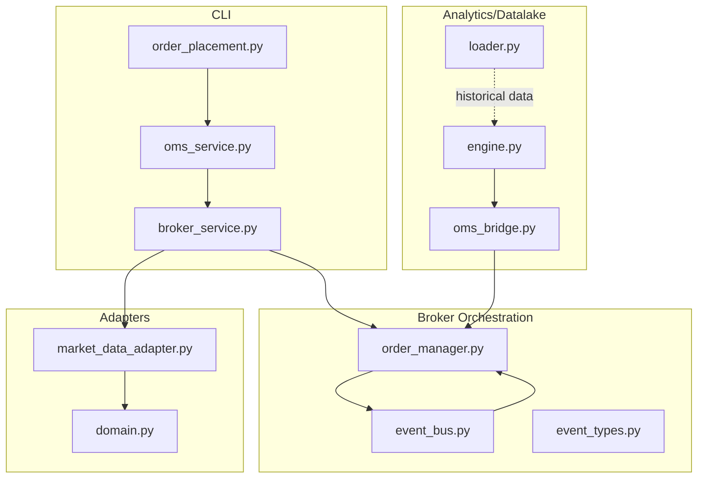
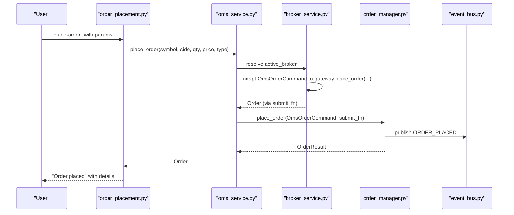
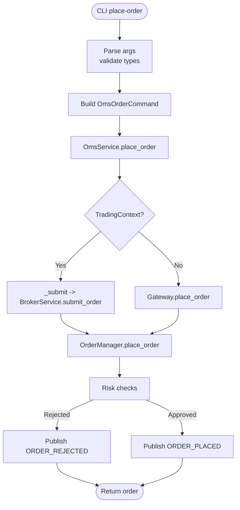
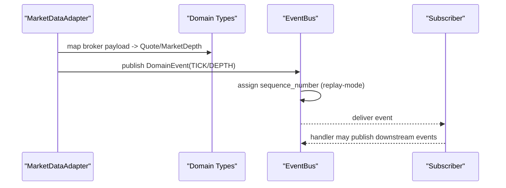
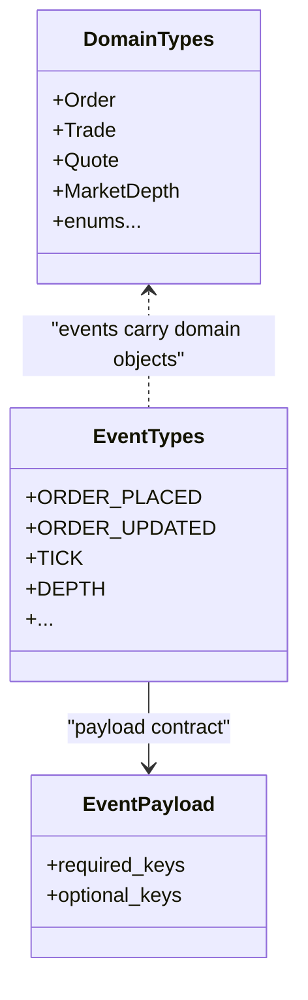
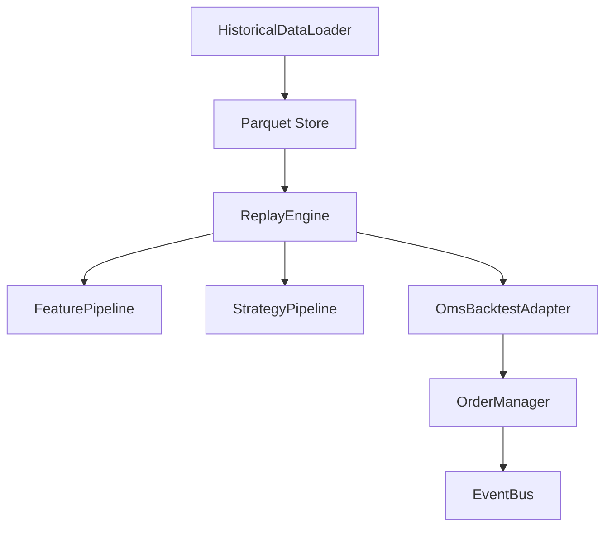
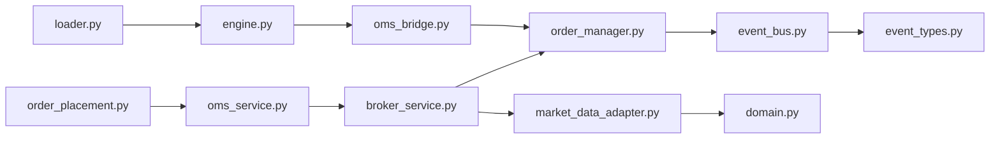

# Data Flow Patterns

<cite>
**Referenced Files in This Document**
- [broker_service.py](file://cli/services/broker_service.py)
- [oms_service.py](file://cli/services/oms_service.py)
- [order_placement.py](file://cli/commands/order_placement.py)
- [order_manager.py](file://brokers/common/oms/order_manager.py)
- [event_bus.py](file://brokers/common/event_bus/event_bus.py)
- [event_types.py](file://brokers/common/event_bus/event_types.py)
- [models.py](file://brokers/common/event_bus/models.py)
- [domain.py](file://brokers/common/core/domain.py)
- [market_data_adapter.py](file://brokers/upstox/adapters/market_data_adapter.py)
- [loader.py](file://datalake/loader.py)
- [engine.py](file://analytics/replay/engine.py)
- [oms_bridge.py](file://analytics/replay/oms_bridge.py)
- [orders.py](file://datalake/api/routers/orders.py)
- [factory.py](file://brokers/common/event_bus/factory.py)
- [test_order_placement.py](file://cli/tests/test_order_placement.py)
- [test_replay_orchestrator.py](file://tests/test_replay_orchestrator.py)
- [test_replay_endpoints.py](file://tests/api/test_replay_endpoints.py)
</cite>

## Table of Contents
1. [Introduction](#introduction)
2. [Project Structure](#project-structure)
3. [Core Components](#core-components)
4. [Architecture Overview](#architecture-overview)
5. [Detailed Component Analysis](#detailed-component-analysis)
6. [Dependency Analysis](#dependency-analysis)
7. [Performance Considerations](#performance-considerations)
8. [Troubleshooting Guide](#troubleshooting-guide)
9. [Conclusion](#conclusion)
10. [Appendices](#appendices)

## Introduction
This document describes the canonical data flow patterns in TradeXV2, focusing on how information moves from CLI commands through BrokerService to OrderManager and broker adapters, then to market data feeds and the event bus. It documents the transformation pipeline (domain type conversions, validation, serialization), bidirectional data flow between market data adapters and the event bus, and integration with the datalake for historical data access and the replay engine for deterministic testing. Examples include order placement, market data subscription, and portfolio updates, along with consistency guarantees, caching strategies, and observability.

## Project Structure
TradeXV2 organizes data flow across CLI, broker orchestration, OMS, adapters, event bus, and analytics. The CLI exposes commands that delegate to BrokerService, which coordinates broker gateways and OMS services. Market data adapters translate broker-native payloads into canonical domain types and publish events. The event bus distributes typed events to subscribers. Analytics components consume historical data from the datalake and replay streams deterministically.

**Diagram sources**
- [order_placement.py:1-383](file://cli/commands/order_placement.py#L1-L383)
- [oms_service.py:1-177](file://cli/services/oms_service.py#L1-L177)
- [broker_service.py:1-406](file://cli/services/broker_service.py#L1-L406)
- [order_manager.py:1-527](file://brokers/common/oms/order_manager.py#L1-L527)
- [event_bus.py:1-420](file://brokers/common/event_bus/event_bus.py#L1-L420)
- [event_types.py:1-429](file://brokers/common/event_bus/event_types.py#L1-L429)
- [market_data_adapter.py:1-132](file://brokers/upstox/adapters/market_data_adapter.py#L1-L132)
- [domain.py:1-67](file://brokers/common/core/domain.py#L1-L67)
- [loader.py:1-296](file://datalake/loader.py#L1-L296)
- [engine.py:1-584](file://analytics/replay/engine.py#L1-L584)
- [oms_bridge.py:1-178](file://analytics/replay/oms_bridge.py#L1-L178)

**Section sources**
- [order_placement.py:1-383](file://cli/commands/order_placement.py#L1-L383)
- [oms_service.py:1-177](file://cli/services/oms_service.py#L1-L177)
- [broker_service.py:1-406](file://cli/services/broker_service.py#L1-L406)
- [order_manager.py:1-527](file://brokers/common/oms/order_manager.py#L1-L527)
- [event_bus.py:1-420](file://brokers/common/event_bus/event_bus.py#L1-L420)
- [event_types.py:1-429](file://brokers/common/event_bus/event_types.py#L1-L429)
- [market_data_adapter.py:1-132](file://brokers/upstox/adapters/market_data_adapter.py#L1-L132)
- [domain.py:1-67](file://brokers/common/core/domain.py#L1-L67)
- [loader.py:1-296](file://datalake/loader.py#L1-L296)
- [engine.py:1-584](file://analytics/replay/engine.py#L1-L584)
- [oms_bridge.py:1-178](file://analytics/replay/oms_bridge.py#L1-L178)

## Core Components
- CLI commands parse user input, validate parameters, and invoke OMS services.
- BrokerService initializes gateways, wires OMS services, and exposes submit_order for live trading.
- OmsService encapsulates order operations and delegates to OrderManager when a TradingContext is present.
- OrderManager enforces idempotency, risk checks, state transitions, and publishes domain events.
- Event bus provides thread-safe, typed event distribution with replay support and observability.
- Market data adapters convert broker-native responses into canonical domain types and publish market events.
- Datalake loader normalizes and persists historical data; replay engine consumes it deterministically.
- OMS backtest adapter integrates replay with OMS for parity.

**Section sources**
- [order_placement.py:31-150](file://cli/commands/order_placement.py#L31-L150)
- [broker_service.py:321-360](file://cli/services/broker_service.py#L321-L360)
- [oms_service.py:101-177](file://cli/services/oms_service.py#L101-L177)
- [order_manager.py:177-271](file://brokers/common/oms/order_manager.py#L177-L271)
- [event_bus.py:298-379](file://brokers/common/event_bus/event_bus.py#L298-L379)
- [market_data_adapter.py:49-132](file://brokers/upstox/adapters/market_data_adapter.py#L49-L132)
- [loader.py:39-106](file://datalake/loader.py#L39-L106)
- [engine.py:152-284](file://analytics/replay/engine.py#L152-L284)
- [oms_bridge.py:48-178](file://analytics/replay/oms_bridge.py#L48-L178)

## Architecture Overview
The system’s canonical flow begins at the CLI, which constructs typed requests and delegates to OMS services. BrokerService resolves the active gateway and wires OMS services. OrderManager validates, records, and publishes domain events. Market data adapters publish ticks and depths. The event bus supports deterministic replay and observability. Datalake provides historical datasets consumed by the replay engine, which routes signals through OMS for parity.

**Diagram sources**
- [order_placement.py:31-150](file://cli/commands/order_placement.py#L31-L150)
- [oms_service.py:101-177](file://cli/services/oms_service.py#L101-L177)
- [broker_service.py:321-360](file://cli/services/broker_service.py#L321-L360)
- [order_manager.py:177-271](file://brokers/common/oms/order_manager.py#L177-L271)
- [event_bus.py:298-379](file://brokers/common/event_bus/event_bus.py#L298-L379)

## Detailed Component Analysis

### CLI to OMS to BrokerService to OrderManager
- CLI parses and validates inputs, constructs typed requests, and calls OmsService.
- OmsService delegates to OrderManager when a TradingContext is available, ensuring centralized risk checks and event publishing.
- BrokerService exposes submit_order that adapts canonical commands to gateway signatures.
- OrderManager enforces idempotency via correlation_id, performs risk checks, and publishes ORDER_PLACED and related events.

**Diagram sources**
- [order_placement.py:31-150](file://cli/commands/order_placement.py#L31-L150)
- [oms_service.py:101-177](file://cli/services/oms_service.py#L101-L177)
- [broker_service.py:321-360](file://cli/services/broker_service.py#L321-L360)
- [order_manager.py:177-271](file://brokers/common/oms/order_manager.py#L177-L271)

**Section sources**
- [order_placement.py:31-150](file://cli/commands/order_placement.py#L31-L150)
- [oms_service.py:101-177](file://cli/services/oms_service.py#L101-L177)
- [broker_service.py:321-360](file://cli/services/broker_service.py#L321-L360)
- [order_manager.py:177-271](file://brokers/common/oms/order_manager.py#L177-L271)
- [test_order_placement.py:188-225](file://cli/tests/test_order_placement.py#L188-L225)

### Bidirectional Data Flow: Market Data Adapters and Event Bus
- MarketDataAdapter translates broker-native responses into canonical Quote/MarketDepth and publishes TICK/DEPTH events.
- Event bus supports deterministic replay with sequence numbers and preserves timestamps for ordering.
- Subscribers handle events safely; failures are captured and logged without silent swallowing.

**Diagram sources**
- [market_data_adapter.py:49-132](file://brokers/upstox/adapters/market_data_adapter.py#L49-L132)
- [domain.py:1-67](file://brokers/common/core/domain.py#L1-L67)
- [event_bus.py:298-379](file://brokers/common/event_bus/event_bus.py#L298-L379)
- [event_types.py:56-140](file://brokers/common/event_bus/event_types.py#L56-L140)

**Section sources**
- [market_data_adapter.py:49-132](file://brokers/upstox/adapters/market_data_adapter.py#L49-L132)
- [event_bus.py:298-379](file://brokers/common/event_bus/event_bus.py#L298-L379)
- [event_types.py:56-140](file://brokers/common/event_bus/event_types.py#L56-L140)

### Data Transformation Pipeline: Domain Types, Validation, Serialization
- Canonical domain types are re-exported via domain.py, ensuring consistent imports across adapters, OMS, CLI, and analytics.
- Event payloads are governed by EventTypes and EventPayload contracts; optional validation is available via make_payload.
- Market data adapters parse numeric fields and map to canonical types, ensuring consistent representation.

**Diagram sources**
- [domain.py:18-67](file://brokers/common/core/domain.py#L18-L67)
- [event_types.py:43-140](file://brokers/common/event_bus/event_types.py#L43-L140)
- [event_types.py:142-167](file://brokers/common/event_bus/event_types.py#L142-L167)

**Section sources**
- [domain.py:18-67](file://brokers/common/core/domain.py#L18-L67)
- [event_types.py:142-167](file://brokers/common/event_bus/event_types.py#L142-L167)

### Integration with Datalake and Replay Engine
- Historical data loaders normalize broker responses to canonical schema and write Parquet files.
- ReplayEngine runs FeaturePipeline and StrategyPipeline over OHLCV bars, publishing signals and routing orders through OMS for parity.
- OmsBacktestAdapter simulates fills and records trades via OrderManager, preserving idempotency and event semantics.

**Diagram sources**
- [loader.py:39-106](file://datalake/loader.py#L39-L106)
- [engine.py:152-284](file://analytics/replay/engine.py#L152-L284)
- [oms_bridge.py:48-178](file://analytics/replay/oms_bridge.py#L48-L178)
- [order_manager.py:301-374](file://brokers/common/oms/order_manager.py#L301-L374)

**Section sources**
- [loader.py:39-106](file://datalake/loader.py#L39-L106)
- [engine.py:152-284](file://analytics/replay/engine.py#L152-L284)
- [oms_bridge.py:48-178](file://analytics/replay/oms_bridge.py#L48-L178)
- [order_manager.py:301-374](file://brokers/common/oms/order_manager.py#L301-L374)

### Typical Data Flow Scenarios
- Order placement: CLI -> OmsService -> BrokerService -> OrderManager -> Event Bus -> Subscribers.
- Market data subscription: MarketDataAdapter -> Event Bus -> Subscribers.
- Portfolio updates: OrderManager.TRADE_APPLIED -> PositionManager -> Event Bus -> Observers.

**Section sources**
- [order_placement.py:31-150](file://cli/commands/order_placement.py#L31-L150)
- [oms_service.py:101-177](file://cli/services/oms_service.py#L101-L177)
- [broker_service.py:321-360](file://cli/services/broker_service.py#L321-L360)
- [order_manager.py:375-389](file://brokers/common/oms/order_manager.py#L375-L389)
- [market_data_adapter.py:49-132](file://brokers/upstox/adapters/market_data_adapter.py#L49-L132)

## Dependency Analysis
- CLI depends on OmsService and BrokerService for order lifecycle.
- BrokerService depends on gateway factories and OMS services.
- OmsService depends on OrderManager and gateway APIs.
- OrderManager depends on Event Bus and domain types.
- Event Bus depends on Event Types and models.
- MarketDataAdapter depends on domain mappers and parsers.
- ReplayEngine depends on datalake loader and OMS backtest adapter.

**Diagram sources**
- [order_placement.py:1-383](file://cli/commands/order_placement.py#L1-L383)
- [oms_service.py:1-177](file://cli/services/oms_service.py#L1-L177)
- [broker_service.py:1-406](file://cli/services/broker_service.py#L1-L406)
- [order_manager.py:1-527](file://brokers/common/oms/order_manager.py#L1-L527)
- [event_bus.py:1-420](file://brokers/common/event_bus/event_bus.py#L1-L420)
- [event_types.py:1-429](file://brokers/common/event_bus/event_types.py#L1-L429)
- [market_data_adapter.py:1-132](file://brokers/upstox/adapters/market_data_adapter.py#L1-L132)
- [domain.py:1-67](file://brokers/common/core/domain.py#L1-L67)
- [loader.py:1-296](file://datalake/loader.py#L1-L296)
- [engine.py:1-584](file://analytics/replay/engine.py#L1-L584)
- [oms_bridge.py:1-178](file://analytics/replay/oms_bridge.py#L1-L178)

**Section sources**
- [order_placement.py:1-383](file://cli/commands/order_placement.py#L1-L383)
- [oms_service.py:1-177](file://cli/services/oms_service.py#L1-L177)
- [broker_service.py:1-406](file://cli/services/broker_service.py#L1-L406)
- [order_manager.py:1-527](file://brokers/common/oms/order_manager.py#L1-L527)
- [event_bus.py:1-420](file://brokers/common/event_bus/event_bus.py#L1-L420)
- [event_types.py:1-429](file://brokers/common/event_bus/event_types.py#L1-L429)
- [market_data_adapter.py:1-132](file://brokers/upstox/adapters/market_data_adapter.py#L1-L132)
- [domain.py:1-67](file://brokers/common/core/domain.py#L1-L67)
- [loader.py:1-296](file://datalake/loader.py#L1-L296)
- [engine.py:1-584](file://analytics/replay/engine.py#L1-L584)
- [oms_bridge.py:1-178](file://analytics/replay/oms_bridge.py#L1-L178)

## Performance Considerations
- Event bus uses a monotonic sequence number for deterministic replay ordering and avoids recursive persistence during replay.
- ReplayEngine uses bounded deques for windows and lazy loading to maintain O(window_size) memory.
- MarketDataAdapter is stateless and thread-safe, enabling concurrent access.
- HistoricalDataLoader deduplicates and validates data before writing, reducing downstream processing overhead.

[No sources needed since this section provides general guidance]

## Troubleshooting Guide
- Order placement failures: Validate CLI arguments and inspect OmsService place_order error handling and OrderManager rejection events.
- Network or broker errors: BrokerService.submit_order raises when no gateway is configured; CLI tests simulate connection errors.
- Event bus handler failures: Event bus logs and dead-letters handler exceptions; ensure a DeadLetterQueue is attached in production.
- Replay determinism: Verify replay mode settings and sequence numbers; tests exercise replay orchestrator behavior.

**Section sources**
- [test_order_placement.py:188-225](file://cli/tests/test_order_placement.py#L188-L225)
- [event_bus.py:382-420](file://brokers/common/event_bus/event_bus.py#L382-L420)
- [test_replay_orchestrator.py:1-39](file://tests/test_replay_orchestrator.py#L1-L39)

## Conclusion
TradeXV2’s data flow is centered on a canonical event bus and a single OMS entry point for orders, ensuring consistency, observability, and replayability. Market data adapters transform broker-native payloads into canonical types and publish typed events. The datalake and replay engine provide deterministic historical processing with OMS parity. Robust validation, idempotency, and observability mechanisms support reliable operations.

[No sources needed since this section summarizes without analyzing specific files]

## Appendices

### API Endpoint for Order Placement (Datalake/API)
- Validates broker availability and connectivity.
- Converts HTTP request to OmsOrderCommand and delegates to OrderManager via submit_fn.
- Returns 503 with Retry-After on broker unavailability.

**Section sources**
- [orders.py:246-312](file://datalake/api/routers/orders.py#L246-L312)

### Async Event Bus Factory
- Gradual migration from sync to async event processing with zero-breaking changes.
- Opt-in via configuration; maintains backward compatibility.

**Section sources**
- [factory.py:1-38](file://brokers/common/event_bus/factory.py#L1-L38)

### Replay Endpoints Integration Tests
- Validate replay session store isolation and deterministic replay behavior.
- Demonstrate integration with real ReplayEngine and event bus.

**Section sources**
- [test_replay_endpoints.py:1-46](file://tests/api/test_replay_endpoints.py#L1-L46)