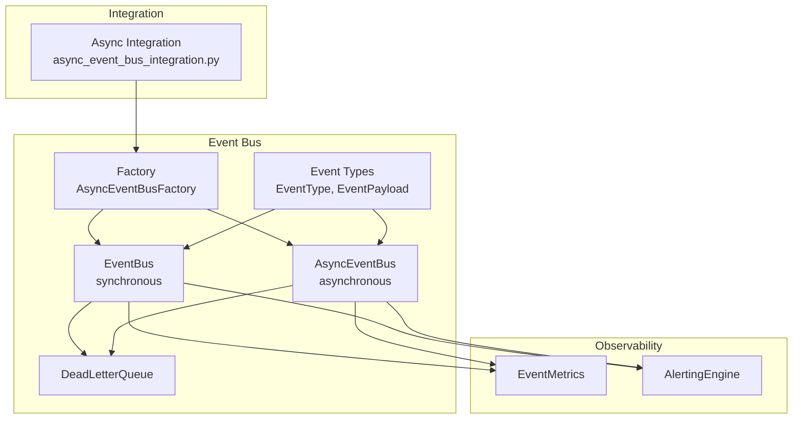
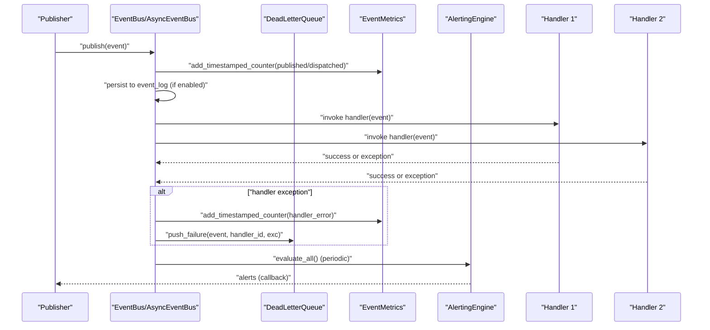
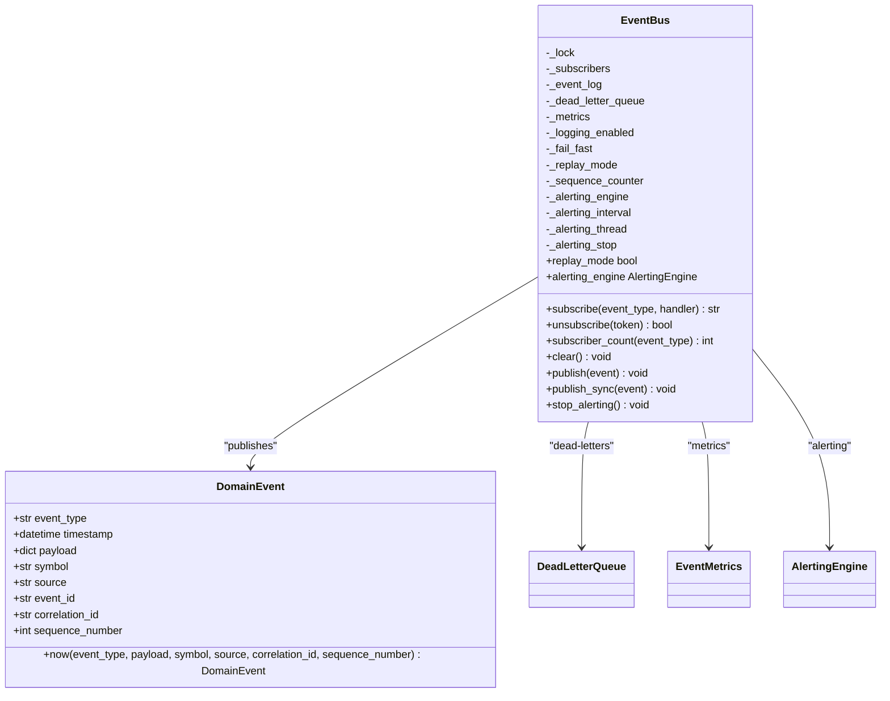
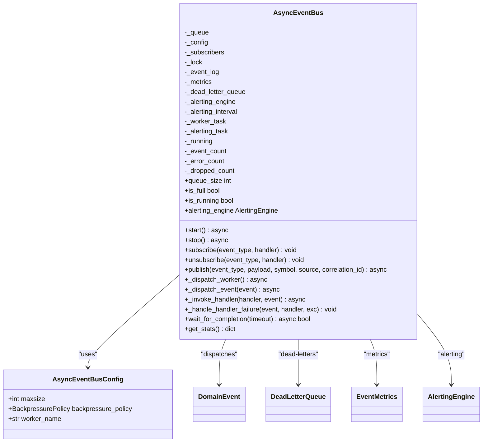
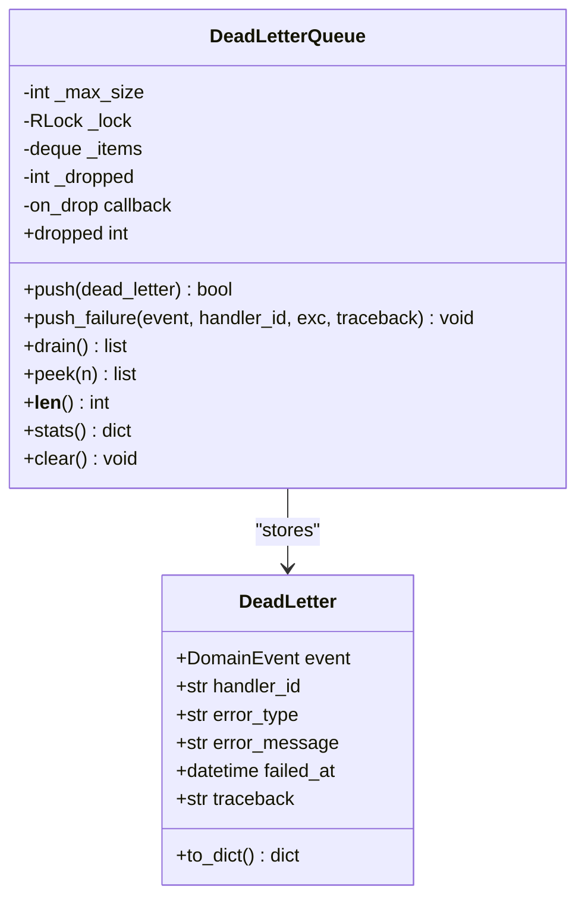
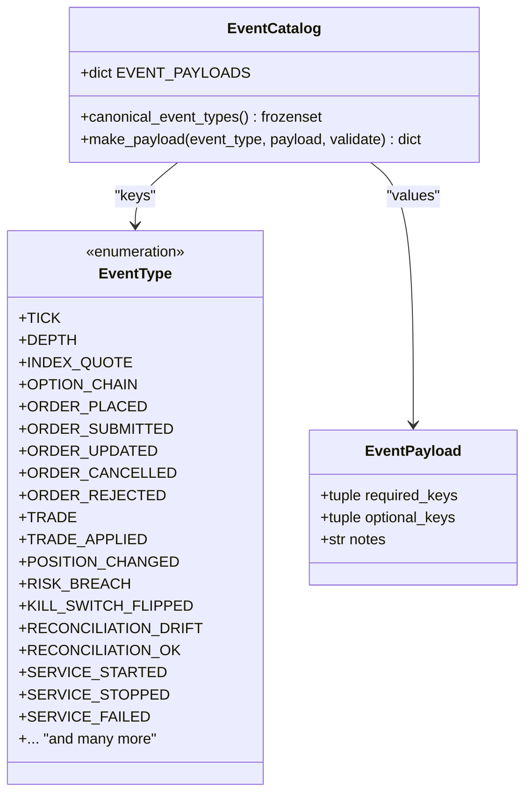
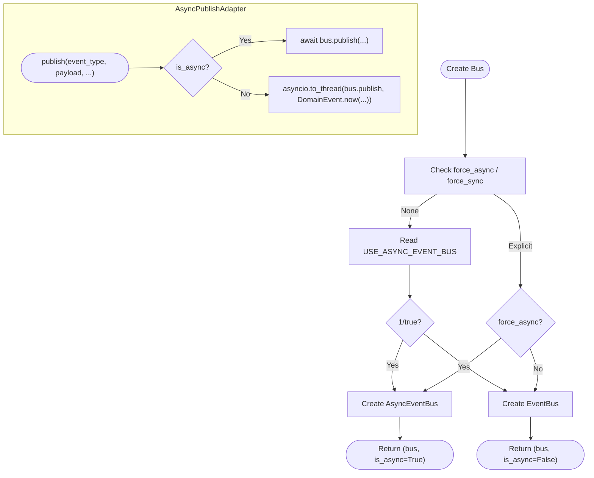
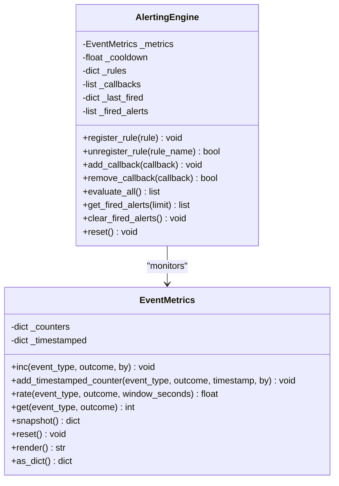
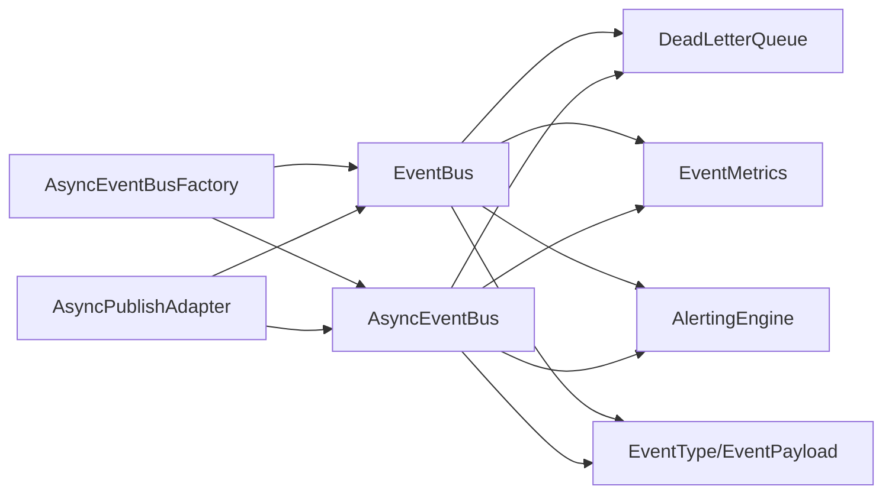

# Event-Driven Architecture

<cite>
**Referenced Files in This Document**
- [event_bus.py](file://brokers/common/event_bus/event_bus.py)
- [async_event_bus.py](file://brokers/common/event_bus/async_event_bus.py)
- [dead_letter_queue.py](file://brokers/common/event_bus/dead_letter_queue.py)
- [event_types.py](file://brokers/common/event_bus/event_types.py)
- [models.py](file://brokers/common/event_bus/models.py)
- [factory.py](file://brokers/common/event_bus/factory.py)
- [event_metrics.py](file://brokers/common/observability/event_metrics.py)
- [alerting.py](file://brokers/common/observability/alerting.py)
- [async_event_bus_integration.py](file://cli/services/async_event_bus_integration.py)
- [test_event_bus.py](file://brokers/common/event_bus/tests/test_event_bus.py)
- [test_event_bus_integration.py](file://brokers/common/event_bus/tests/test_event_bus_integration.py)
- [test_async_event_bus.py](file://tests/test_async_event_bus.py)
</cite>

## Table of Contents
1. [Introduction](#introduction)
2. [Project Structure](#project-structure)
3. [Core Components](#core-components)
4. [Architecture Overview](#architecture-overview)
5. [Detailed Component Analysis](#detailed-component-analysis)
6. [Dependency Analysis](#dependency-analysis)
7. [Performance Considerations](#performance-considerations)
8. [Troubleshooting Guide](#troubleshooting-guide)
9. [Conclusion](#conclusion)
10. [Appendices](#appendices)

## Introduction
This document describes the event-driven architecture centered on the EventBus system and event distribution patterns in the trading platform. It covers the synchronous EventBus implementation with thread-safe event publishing and subscriber management, the DeadLetterQueue mechanism for handling failed event processing, the event type hierarchy, the AsyncEventBus variant for asynchronous processing, subscriber registration patterns, and integration with the observability layer. It also provides guidance on implementing custom event handlers, extending the event system, and operational considerations such as performance, memory management, event ordering guarantees, replay capabilities, and error handling strategies.

## Project Structure
The event system is organized under the brokers/common/event_bus package with supporting observability components and integration utilities. The structure emphasizes separation of concerns:
- Event bus implementations (sync and async)
- Canonical event type catalog and payload contracts
- Dead letter queue for failure capture
- Factory and integration helpers for gradual migration
- Observability metrics and alerting engines
- Tests validating behavior and integration

**Diagram sources**
- [event_bus.py:118-420](file://brokers/common/event_bus/event_bus.py#L118-L420)
- [async_event_bus.py:104-586](file://brokers/common/event_bus/async_event_bus.py#L104-L586)
- [dead_letter_queue.py:55-140](file://brokers/common/event_bus/dead_letter_queue.py#L55-L140)
- [event_types.py:43-140](file://brokers/common/event_bus/event_types.py#L43-L140)
- [factory.py:71-390](file://brokers/common/event_bus/factory.py#L71-L390)
- [event_metrics.py:35-196](file://brokers/common/observability/event_metrics.py#L35-L196)
- [alerting.py:157-604](file://brokers/common/observability/alerting.py#L157-L604)
- [async_event_bus_integration.py:61-320](file://cli/services/async_event_bus_integration.py#L61-L320)

**Section sources**
- [event_bus.py:1-420](file://brokers/common/event_bus/event_bus.py#L1-L420)
- [async_event_bus.py:1-586](file://brokers/common/event_bus/async_event_bus.py#L1-L586)
- [dead_letter_queue.py:1-140](file://brokers/common/event_bus/dead_letter_queue.py#L1-L140)
- [event_types.py:1-429](file://brokers/common/event_bus/event_types.py#L1-L429)
- [models.py:1-33](file://brokers/common/event_bus/models.py#L1-L33)
- [factory.py:1-390](file://brokers/common/event_bus/factory.py#L1-L390)
- [event_metrics.py:1-196](file://brokers/common/observability/event_metrics.py#L1-L196)
- [alerting.py:1-604](file://brokers/common/observability/alerting.py#L1-L604)
- [async_event_bus_integration.py:1-320](file://cli/services/async_event_bus_integration.py#L1-L320)

## Core Components
- EventBus (synchronous): Immutable event model, thread-safe publish/subscribe, failure logging and dead-lettering, replay-mode sequencing, correlation ID propagation, and alerting integration.
- AsyncEventBus (asynchronous): Bounded queue with backpressure policies, single dispatch worker for FIFO ordering, mixed sync/async handler support, DLQ integration, metrics integration, and alerting integration.
- DeadLetterQueue: Bounded FIFO store of failed handler invocations with drop accounting and inspection APIs.
- Event Types: Canonical EventType enum and EventPayload contracts for event schemas.
- Factory: AsyncEventBusFactory for creating sync or async buses based on configuration, and AsyncPublishAdapter for unified async publish API.
- Observability: EventMetrics for counters and rate-based alerting; AlertingEngine for threshold-based alert rules.

**Section sources**
- [event_bus.py:118-420](file://brokers/common/event_bus/event_bus.py#L118-L420)
- [async_event_bus.py:104-586](file://brokers/common/event_bus/async_event_bus.py#L104-L586)
- [dead_letter_queue.py:55-140](file://brokers/common/event_bus/dead_letter_queue.py#L55-L140)
- [event_types.py:43-140](file://brokers/common/event_bus/event_types.py#L43-L140)
- [factory.py:71-390](file://brokers/common/event_bus/factory.py#L71-L390)
- [event_metrics.py:35-196](file://brokers/common/observability/event_metrics.py#L35-L196)
- [alerting.py:157-604](file://brokers/common/observability/alerting.py#L157-L604)

## Architecture Overview
The EventBus system provides a unified event distribution layer for market data, order management, risk, reconciliation, lifecycle, and system events. Handlers can be registered per event type and receive immutable DomainEvent instances. The synchronous EventBus ensures ordered dispatch and strict failure visibility, while the asynchronous variant provides backpressure and FIFO ordering with mixed handler support.

**Diagram sources**
- [event_bus.py:298-420](file://brokers/common/event_bus/event_bus.py#L298-L420)
- [async_event_bus.py:343-586](file://brokers/common/event_bus/async_event_bus.py#L343-L586)
- [dead_letter_queue.py:90-140](file://brokers/common/event_bus/dead_letter_queue.py#L90-L140)
- [event_metrics.py:76-196](file://brokers/common/observability/event_metrics.py#L76-L196)
- [alerting.py:286-480](file://brokers/common/observability/alerting.py#L286-L480)

## Detailed Component Analysis

### Synchronous EventBus
- Immutable DomainEvent with event_type, timestamp, payload, symbol, source, event_id, correlation_id, and sequence_number for replay ordering.
- Thread-safe publish/subscribe with RLock protection; snapshot of handlers before iteration to avoid concurrent mutation issues.
- Failure handling: logs warnings, increments metrics with handler_error counters, dead-letters failures, and optionally re-raises in fail-fast mode.
- Replay mode: disables auto-persistence, preserves original timestamps, and uses monotonic sequence_number for deterministic ordering.
- Alerting integration: optional background thread evaluating rules periodically.

**Diagram sources**
- [event_bus.py:118-420](file://brokers/common/event_bus/event_bus.py#L118-L420)
- [event_types.py:56-126](file://brokers/common/event_bus/event_types.py#L56-L126)

**Section sources**
- [event_bus.py:118-420](file://brokers/common/event_bus/event_bus.py#L118-L420)
- [event_types.py:56-126](file://brokers/common/event_bus/event_types.py#L56-L126)

### Asynchronous EventBus
- Bounded queue with configurable backpressure policy: BLOCK (wait), DROP (immediate drop), ERROR (raise QueueFull).
- Single dispatch worker ensures FIFO ordering and handler isolation.
- Mixed handler support: sync handlers run in executor; async handlers awaited directly.
- Stats and lifecycle: start/stop worker, wait_for_completion, get_stats, queue_size, is_full, is_running.

**Diagram sources**
- [async_event_bus.py:104-586](file://brokers/common/event_bus/async_event_bus.py#L104-L586)

**Section sources**
- [async_event_bus.py:104-586](file://brokers/common/event_bus/async_event_bus.py#L104-L586)

### Dead Letter Queue
- Bounded FIFO of DeadLetter entries capturing event, handler_id, error_type, error_message, failed_at, and optional traceback.
- Drop accounting and on-drop callback hook for external metrics pipelines.
- Drain, peek, length, stats, and clear operations for inspection and maintenance.

**Diagram sources**
- [dead_letter_queue.py:29-140](file://brokers/common/event_bus/dead_letter_queue.py#L29-L140)

**Section sources**
- [dead_letter_queue.py:55-140](file://brokers/common/event_bus/dead_letter_queue.py#L55-L140)

### Event Type Hierarchy and Payload Contracts
- EventType enum defines canonical event types grouped by domain (market data, orders/OMS, risk/position, reconciliation, lifecycle/system, broker connectivity, scanner/strategy, position lifecycle, health/system, risk decisions, portfolio/metrics, scanner/strategy lifecycle).
- EventPayload defines required and optional keys per event type and notes for subscribers.
- make_payload validates payloads against contracts when enabled.

**Diagram sources**
- [event_types.py:43-376](file://brokers/common/event_bus/event_types.py#L43-L376)

**Section sources**
- [event_types.py:43-376](file://brokers/common/event_bus/event_types.py#L43-L376)
- [models.py:17-32](file://brokers/common/event_bus/models.py#L17-L32)

### Factory and Integration for Async Migration
- AsyncEventBusFactory creates either sync or async buses based on explicit flags or environment variables, with priority order and defaults.
- AsyncPublishAdapter provides a uniform async publish API that wraps both sync and async buses, enabling publishers to remain unchanged during migration.

**Diagram sources**
- [factory.py:96-258](file://brokers/common/event_bus/factory.py#L96-L258)
- [async_event_bus_integration.py:61-320](file://cli/services/async_event_bus_integration.py#L61-L320)

**Section sources**
- [factory.py:71-390](file://brokers/common/event_bus/factory.py#L71-L390)
- [async_event_bus_integration.py:61-320](file://cli/services/async_event_bus_integration.py#L61-L320)

### Observability: Metrics and Alerting
- EventMetrics tracks counters and timestamped counters for rate-based alerting; supports snapshot and rate calculations over windows.
- AlertingEngine registers rules, evaluates metrics snapshots, deduplicates alerts, and invokes callbacks.

**Diagram sources**
- [event_metrics.py:35-196](file://brokers/common/observability/event_metrics.py#L35-L196)
- [alerting.py:157-604](file://brokers/common/observability/alerting.py#L157-L604)

**Section sources**
- [event_metrics.py:35-196](file://brokers/common/observability/event_metrics.py#L35-L196)
- [alerting.py:157-604](file://brokers/common/observability/alerting.py#L157-L604)

## Dependency Analysis
- EventBus depends on DeadLetterQueue, EventMetrics, AlertingEngine, and optional EventLog for persistence.
- AsyncEventBus depends on DeadLetterQueue, EventMetrics, AlertingEngine, and uses asyncio.Queue for backpressure.
- Event types are decoupled from bus implementations via EventType and EventPayload contracts.
- Factory and integration modules coordinate bus selection and publisher adaptation.

**Diagram sources**
- [event_bus.py:175-202](file://brokers/common/event_bus/event_bus.py#L175-L202)
- [async_event_bus.py:161-190](file://brokers/common/event_bus/async_event_bus.py#L161-L190)
- [dead_letter_queue.py:67-72](file://brokers/common/event_bus/dead_letter_queue.py#L67-L72)
- [event_types.py:169-376](file://brokers/common/event_bus/event_types.py#L169-L376)
- [factory.py:96-258](file://brokers/common/event_bus/factory.py#L96-L258)
- [async_event_bus_integration.py:261-382](file://cli/services/async_event_bus_integration.py#L261-L382)

**Section sources**
- [event_bus.py:175-202](file://brokers/common/event_bus/event_bus.py#L175-L202)
- [async_event_bus.py:161-190](file://brokers/common/event_bus/async_event_bus.py#L161-L190)
- [factory.py:96-258](file://brokers/common/event_bus/factory.py#L96-L258)

## Performance Considerations
- Synchronous EventBus
  - Lock-protected dispatch; handler isolation via snapshot prevents mutation during dispatch.
  - Persistence to event_log occurs before dispatch; failures are captured and surfaced.
  - Sequence numbering ensures deterministic replay ordering in replay_mode.
- Asynchronous EventBus
  - Bounded queue with configurable backpressure policy to prevent unbounded memory growth.
  - Single dispatch worker ensures FIFO ordering and avoids race conditions.
  - Mixed handler support: sync handlers executed in executor to avoid blocking the event loop.
  - Metrics and alerting support rate-based thresholds for proactive monitoring.
- Memory Management
  - DeadLetterQueue is bounded with drop accounting; on_drop callback allows external metrics.
  - AsyncEventBus queue size and drop counts tracked for operational insights.
- Event Ordering Guarantees
  - AsyncEventBus FIFO ordering via single worker; synchronous EventBus dispatch order is per-subscription registration order.
  - Replay mode preserves original timestamps and sequence_numbers for deterministic replay.
- Integration with Observability
  - EventMetrics supports rate-based alerting; AlertingEngine provides threshold rules and deduplication.

[No sources needed since this section provides general guidance]

## Troubleshooting Guide
Common issues and strategies:
- Handler failures
  - Symptom: Silent failures or inconsistent state.
  - Resolution: Ensure DeadLetterQueue is attached; verify metrics show handler_error counters; inspect DLQ contents.
- Missing DeadLetterQueue
  - Symptom: Failures not captured; noisy logs only.
  - Resolution: Attach DLQ in production; bus logs loud ERROR when missing.
- EventLog persistence failures
  - Symptom: Disk errors or log append failures.
  - Resolution: Capture and dead-letter log_error events; surface failures via fail_fast in tests.
- Backpressure in AsyncEventBus
  - Symptom: Queue full, dropped events, or blocked publishers.
  - Resolution: Adjust maxsize, tune backpressure policy (BLOCK/DROP/ERROR), monitor queue_size and dropped_count.
- Alerting not firing
  - Symptom: Thresholds exceeded but no alerts.
  - Resolution: Verify AlertingEngine rules, cooldown periods, and callback registrations; confirm metrics snapshot and rate calculations.

**Section sources**
- [event_bus.py:382-420](file://brokers/common/event_bus/event_bus.py#L382-L420)
- [dead_letter_queue.py:90-140](file://brokers/common/event_bus/dead_letter_queue.py#L90-L140)
- [event_metrics.py:76-196](file://brokers/common/observability/event_metrics.py#L76-L196)
- [alerting.py:286-480](file://brokers/common/observability/alerting.py#L286-L480)
- [test_event_bus.py:107-153](file://brokers/common/event_bus/tests/test_event_bus.py#L107-L153)
- [test_async_event_bus.py:107-146](file://tests/test_async_event_bus.py#L107-L146)

## Conclusion
The event-driven architecture provides a robust, observable, and extensible foundation for the trading platform. The synchronous EventBus ensures reliable, deterministic dispatch with strong failure visibility, while the asynchronous variant scales throughput with backpressure and FIFO ordering. The canonical event type catalog and payload contracts improve correctness and maintainability. The DeadLetterQueue, EventMetrics, and AlertingEngine collectively enhance reliability and operability. The factory and integration utilities facilitate gradual migration to asynchronous processing without disrupting existing code.

[No sources needed since this section summarizes without analyzing specific files]

## Appendices

### Example Workflows and Patterns

- Event Publication Workflow (Synchronous)
  - Create DomainEvent via DomainEvent.now with event_type, payload, optional symbol/source/correlation_id.
  - Publish via EventBus.publish; metrics incremented, event persisted (if enabled), handlers invoked, failures dead-lettered.

- Subscriber Registration Patterns
  - Subscribe handlers per event type; unsubscribe via token; clear all subscribers for testing.
  - Verify subscription counts and stability in integration tests.

- Asynchronous Processing
  - Configure AsyncEventBus with maxsize and backpressure policy; start worker; publish via async API; monitor stats and lifecycle.

- Error Handling Strategies
  - Use fail_fast in tests to assert on handler exceptions; ensure DLQ presence in production; leverage metrics and alerting for proactive detection.

**Section sources**
- [event_bus.py:298-378](file://brokers/common/event_bus/event_bus.py#L298-L378)
- [async_event_bus.py:215-280](file://brokers/common/event_bus/async_event_bus.py#L215-L280)
- [test_event_bus.py:30-96](file://brokers/common/event_bus/tests/test_event_bus.py#L30-L96)
- [test_async_event_bus.py:43-104](file://tests/test_async_event_bus.py#L43-L104)

### Event Ordering Guarantees and Replay Capabilities
- Deterministic ordering in replay_mode: preserves original timestamps and sequence_numbers for total ordering.
- FIFO ordering in AsyncEventBus via single dispatch worker.
- Replay mode disables auto-persistence to avoid recursive writes and maintains replay determinism.

**Section sources**
- [event_bus.py:164-167](file://brokers/common/event_bus/event_bus.py#L164-L167)
- [event_bus.py:321-331](file://brokers/common/event_bus/event_bus.py#L321-L331)
- [async_event_bus.py:125-131](file://brokers/common/event_bus/async_event_bus.py#L125-L131)

### Implementing Custom Event Handlers and Extending the Event System
- Define event_type using EventType enum or canonical strings; ensure payload conforms to EventPayload contract.
- Subscribe handlers to event types; handle DomainEvent immutably; propagate correlation_id if needed.
- Integrate with observability: use EventMetrics for counters and rate-based alerting; configure AlertingEngine rules.
- Extend AsyncEventBus with additional backpressure policies or alerting rules as needed.

**Section sources**
- [event_types.py:169-376](file://brokers/common/event_bus/event_types.py#L169-L376)
- [event_metrics.py:76-196](file://brokers/common/observability/event_metrics.py#L76-L196)
- [alerting.py:511-594](file://brokers/common/observability/alerting.py#L511-L594)
- [async_event_bus.py:71-82](file://brokers/common/event_bus/async_event_bus.py#L71-L82)