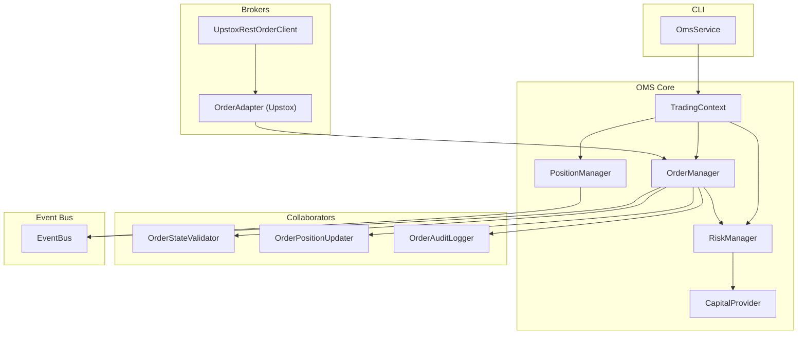
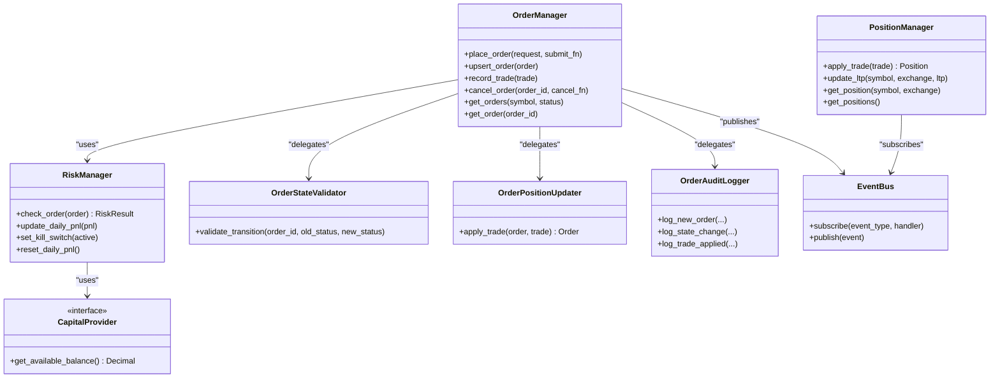
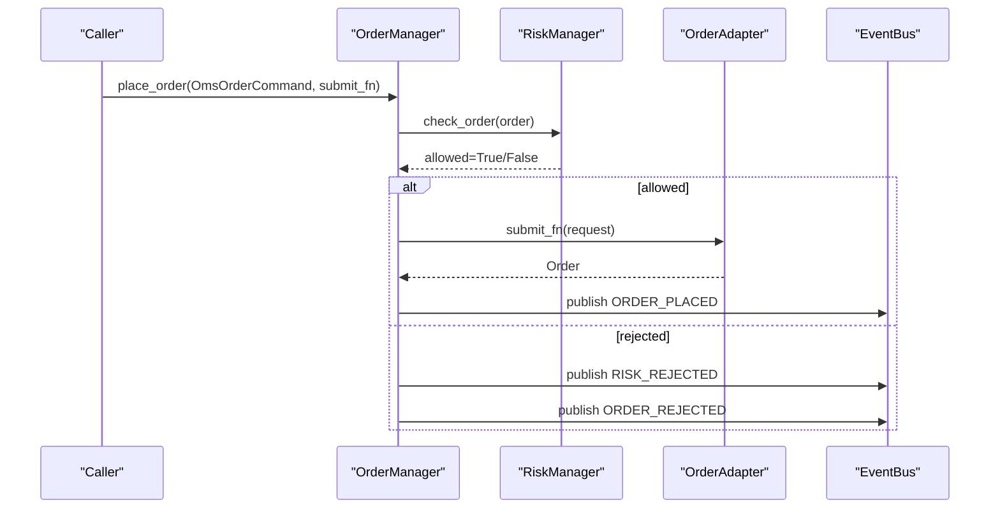
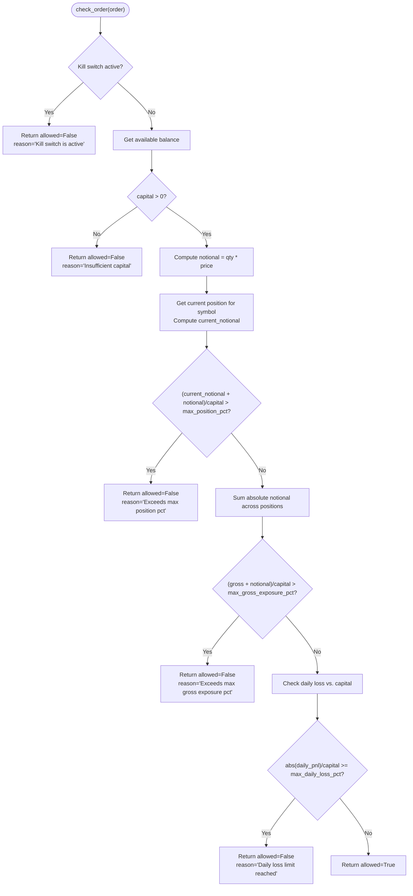
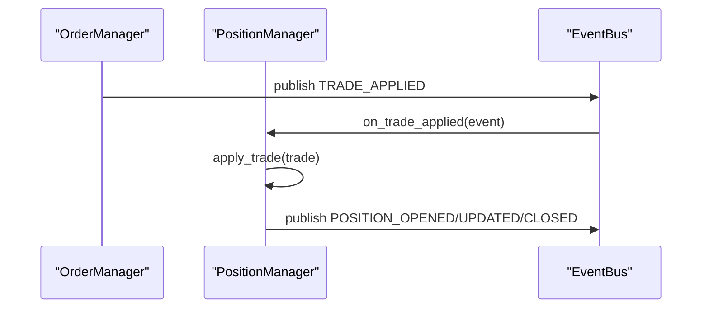
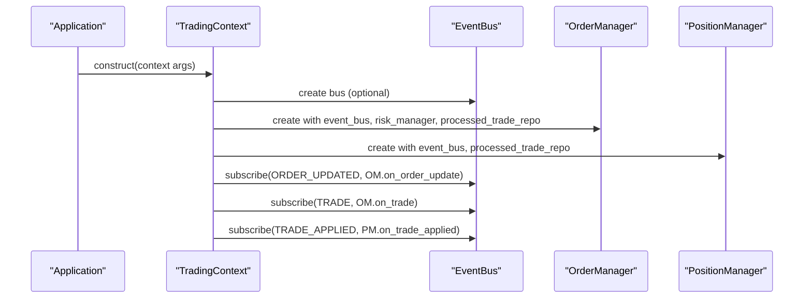
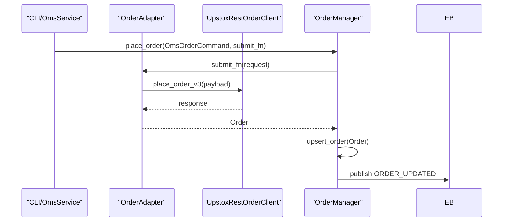
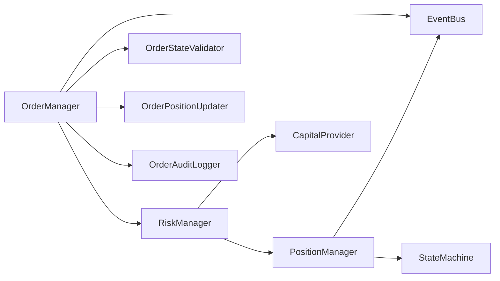

# Order Management System

<cite>
**Referenced Files in This Document**
- [order_manager.py](file://brokers/common/oms/order_manager.py)
- [risk_manager.py](file://brokers/common/oms/risk_manager.py)
- [position_manager.py](file://brokers/common/oms/position_manager.py)
- [capital_provider.py](file://brokers/common/oms/capital_provider.py)
- [context.py](file://brokers/common/oms/context.py)
- [order_state_validator.py](file://brokers/common/oms/order_state_validator.py)
- [order_position_updater.py](file://brokers/common/oms/order_position_updater.py)
- [order_audit_logger.py](file://brokers/common/oms/order_audit_logger.py)
- [daily_pnl_reset_scheduler.py](file://brokers/common/oms/daily_pnl_reset_scheduler.py)
- [event_bus.py](file://brokers/common/event_bus/event_bus.py)
- [state_machine.py](file://brokers/common/core/state_machine.py)
- [order_adapter.py](file://brokers/upstox/adapters/order_adapter.py)
- [order_client.py](file://brokers/upstox/orders/order_client.py)
- [oms_service.py](file://cli/services/oms_service.py)
</cite>

## Table of Contents
1. [Introduction](#introduction)
2. [Project Structure](#project-structure)
3. [Core Components](#core-components)
4. [Architecture Overview](#architecture-overview)
5. [Detailed Component Analysis](#detailed-component-analysis)
6. [Dependency Analysis](#dependency-analysis)
7. [Performance Considerations](#performance-considerations)
8. [Troubleshooting Guide](#troubleshooting-guide)
9. [Conclusion](#conclusion)
10. [Appendices](#appendices)

## Introduction
This document describes the Order Management System (OMS) that governs order lifecycle management and risk controls across trading operations. The OMS centers around the OrderManager, which coordinates order placement, modification, cancellation, and status tracking. Risk controls are enforced by the RiskManager, which validates pre-trade constraints using position sizing, exposure limits, and capital allocation. The PositionManager aggregates and tracks open positions, computes PnL, and enforces position state transitions. The CapitalProvider interface abstracts funding and margin retrieval for risk computations. The Context object wires the event bus, OMS, Position and Risk managers, and orchestrates lifecycle services. The OMS integrates with broker adapters to submit and cancel orders and to receive order and trade updates.

## Project Structure
The OMS spans several modules:
- Central managers: OrderManager, RiskManager, PositionManager
- Collaborators: OrderStateValidator, OrderPositionUpdater, OrderAuditLogger
- Infrastructure: CapitalProvider, Context, DailyPnlResetScheduler
- Event bus: EventBus and related models
- Broker adapters: Upstox order adapter and REST client
- CLI service: OmsService for diagnostics and order placement

**Diagram sources**
- [order_manager.py:93-527](file://brokers/common/oms/order_manager.py#L93-L527)
- [risk_manager.py:70-258](file://brokers/common/oms/risk_manager.py#L70-L258)
- [position_manager.py:22-290](file://brokers/common/oms/position_manager.py#L22-L290)
- [capital_provider.py:25-94](file://brokers/common/oms/capital_provider.py#L25-L94)
- [context.py:44-478](file://brokers/common/oms/context.py#L44-L478)
- [order_state_validator.py:35-198](file://brokers/common/oms/order_state_validator.py#L35-L198)
- [order_position_updater.py:30-116](file://brokers/common/oms/order_position_updater.py#L30-L116)
- [order_audit_logger.py:65-251](file://brokers/common/oms/order_audit_logger.py#L65-L251)
- [event_bus.py:118-420](file://brokers/common/event_bus/event_bus.py#L118-L420)
- [order_adapter.py:31-223](file://brokers/upstox/adapters/order_adapter.py#L31-L223)
- [order_client.py:15-113](file://brokers/upstox/orders/order_client.py#L15-L113)
- [oms_service.py:12-177](file://cli/services/oms_service.py#L12-L177)

**Section sources**
- [order_manager.py:93-527](file://brokers/common/oms/order_manager.py#L93-L527)
- [context.py:44-478](file://brokers/common/oms/context.py#L44-L478)

## Core Components
- OrderManager: Single owner of order state, thread-safe, enforces idempotency, risk checks, and publishes domain events. Delegates state validation, audit logging, and position updates to collaborators.
- RiskManager: Pre-trade risk checks including kill switch, capital availability, per-symbol concentration, gross exposure, and daily loss limits. Supports dynamic capital retrieval via CapitalProvider and daily PnL rollover.
- PositionManager: Thread-safe position book updated via TRADE_APPLIED events, enforcing position state transitions and publishing lifecycle events.
- CapitalProvider: Protocol for retrieving available balance; implementations include GatewayCapitalProvider and FixedCapitalProvider.
- Context: Wiring of EventBus, OMS, Position and Risk managers, reconciliation, and lifecycle services.

**Section sources**
- [order_manager.py:93-527](file://brokers/common/oms/order_manager.py#L93-L527)
- [risk_manager.py:70-258](file://brokers/common/oms/risk_manager.py#L70-L258)
- [position_manager.py:22-290](file://brokers/common/oms/position_manager.py#L22-L290)
- [capital_provider.py:25-94](file://brokers/common/oms/capital_provider.py#L25-L94)
- [context.py:44-478](file://brokers/common/oms/context.py#L44-L478)

## Architecture Overview
The OMS uses a collaborative design with explicit separation of concerns:
- OrderManager delegates state validation, position updates, and audit logging to collaborators.
- RiskManager depends on PositionManager and CapitalProvider for risk computations.
- PositionManager subscribes to TRADE_APPLIED events from OrderManager to ensure idempotent position updates.
- EventBus mediates inter-component communication with mandatory failure observability.

**Diagram sources**
- [order_manager.py:93-527](file://brokers/common/oms/order_manager.py#L93-L527)
- [risk_manager.py:70-258](file://brokers/common/oms/risk_manager.py#L70-L258)
- [position_manager.py:22-290](file://brokers/common/oms/position_manager.py#L22-L290)
- [capital_provider.py:25-94](file://brokers/common/oms/capital_provider.py#L25-L94)
- [order_state_validator.py:35-198](file://brokers/common/oms/order_state_validator.py#L35-L198)
- [order_position_updater.py:30-116](file://brokers/common/oms/order_position_updater.py#L30-L116)
- [order_audit_logger.py:65-251](file://brokers/common/oms/order_audit_logger.py#L65-L251)
- [event_bus.py:118-420](file://brokers/common/event_bus/event_bus.py#L118-L420)

## Detailed Component Analysis

### OrderManager
OrderManager is the central coordinator for all trading operations:
- Thread-safety: Uses a re-entrant lock to protect order book and idempotency ledger.
- Idempotency: Tracks orders by correlation_id to prevent duplicate submissions.
- Risk checks: Invokes RiskManager.check_order before placing orders; publishes risk events.
- Collaboration: Delegates state validation, position updates, and audit logging to collaborators.
- Event publishing: Emits ORDER_PLACED, ORDER_UPDATED, ORDER_CANCELLED, and TRADE_APPLIED.

**Diagram sources**
- [order_manager.py:177-270](file://brokers/common/oms/order_manager.py#L177-L270)
- [risk_manager.py:125-158](file://brokers/common/oms/risk_manager.py#L125-L158)
- [order_adapter.py:66-162](file://brokers/upstox/adapters/order_adapter.py#L66-L162)
- [event_bus.py:298-379](file://brokers/common/event_bus/event_bus.py#L298-L379)

**Section sources**
- [order_manager.py:93-527](file://brokers/common/oms/order_manager.py#L93-L527)

### RiskManager
RiskManager performs pre-trade risk checks:
- Kill switch: Blocks all order placement when active.
- Capital availability: Retrieves available balance via CapitalProvider.
- Position sizing: Enforces per-symbol concentration vs. capital.
- Gross exposure: Limits total exposure across all positions.
- Daily loss: Prevents further trading once daily loss limit is hit.
- Daily PnL rollover: Reset via DailyPnlResetScheduler at configured IST rollover.

**Diagram sources**
- [risk_manager.py:125-158](file://brokers/common/oms/risk_manager.py#L125-L158)

**Section sources**
- [risk_manager.py:70-258](file://brokers/common/oms/risk_manager.py#L70-L258)
- [capital_provider.py:25-94](file://brokers/common/oms/capital_provider.py#L25-L94)
- [daily_pnl_reset_scheduler.py:61-242](file://brokers/common/oms/daily_pnl_reset_scheduler.py#L61-L242)

### PositionManager
PositionManager manages open positions and PnL:
- Idempotency: Receives TRADE_APPLIED events from OrderManager, ensuring duplicate trades are not double-counted.
- Position state machine: Enforces transitions FLAT → OPEN → CLOSED with audit-only mode supported.
- Lifecycle events: Publishes POSITION_OPENED, POSITION_UPDATED, POSITION_CLOSED.
- LTP updates: Updates unrealized PnL via last-traded-price updates.

**Diagram sources**
- [position_manager.py:250-269](file://brokers/common/oms/position_manager.py#L250-L269)
- [order_manager.py:375-388](file://brokers/common/oms/order_manager.py#L375-L388)
- [event_bus.py:298-379](file://brokers/common/event_bus/event_bus.py#L298-L379)

**Section sources**
- [position_manager.py:22-290](file://brokers/common/oms/position_manager.py#L22-L290)
- [state_machine.py:53-162](file://brokers/common/core/state_machine.py#L53-L162)

### CapitalProvider
CapitalProvider abstracts capital retrieval:
- GatewayCapitalProvider: Retrieves balance from gateway with fallback on failure.
- FixedCapitalProvider: Supplies a fixed capital for backtesting/paper trading.
- RiskManager supports both legacy capital_fn and new CapitalProvider.

**Section sources**
- [capital_provider.py:25-94](file://brokers/common/oms/capital_provider.py#L25-L94)
- [risk_manager.py:86-110](file://brokers/common/oms/risk_manager.py#L86-L110)

### Context
TradingContext wires the OMS ecosystem:
- Creates and wires EventBus, OrderManager, PositionManager, RiskManager.
- Subscribes managers to event bus for order and trade updates.
- Integrates reconciliation service, DLQ monitoring, and daily PnL reset scheduler.
- Provides async bus integration and lifecycle management.

**Diagram sources**
- [context.py:124-157](file://brokers/common/oms/context.py#L124-L157)
- [event_bus.py:268-282](file://brokers/common/event_bus/event_bus.py#L268-L282)

**Section sources**
- [context.py:44-478](file://brokers/common/oms/context.py#L44-L478)

### Collaborators

#### OrderStateValidator
- Validates order status transitions using a state machine per order.
- Supports enforcement and audit modes; maintains bounded cache with TTL.

**Section sources**
- [order_state_validator.py:35-198](file://brokers/common/oms/order_state_validator.py#L35-L198)
- [state_machine.py:53-162](file://brokers/common/core/state_machine.py#L53-L162)

#### OrderPositionUpdater
- Computes VWAP-style average price and derives order status (FILLED/PARTIALLY_FILLED).
- Returns immutable updated order instances.

**Section sources**
- [order_position_updater.py:30-116](file://brokers/common/oms/order_position_updater.py#L30-L116)

#### OrderAuditLogger
- Maintains immutable audit entries per order with thread-safe storage.
- Logs new orders, state changes, and trade applications.

**Section sources**
- [order_audit_logger.py:65-251](file://brokers/common/oms/order_audit_logger.py#L65-L251)

### Broker Adapters and Integration
- OrderAdapter encapsulates order placement and cancellation via Upstox broker, including validation, correlation ID tracking, and security guards.
- UpstoxRestOrderClient provides REST endpoints for order operations.
- OmsService exposes order placement and cancellation through the OMS.

**Diagram sources**
- [oms_service.py:101-159](file://cli/services/oms_service.py#L101-L159)
- [order_adapter.py:66-162](file://brokers/upstox/adapters/order_adapter.py#L66-L162)
- [order_client.py:20-32](file://brokers/upstox/orders/order_client.py#L20-L32)
- [order_manager.py:272-299](file://brokers/common/oms/order_manager.py#L272-L299)
- [event_bus.py:298-379](file://brokers/common/event_bus/event_bus.py#L298-L379)

**Section sources**
- [order_adapter.py:31-223](file://brokers/upstox/adapters/order_adapter.py#L31-L223)
- [order_client.py:15-113](file://brokers/upstox/orders/order_client.py#L15-L113)
- [oms_service.py:12-177](file://cli/services/oms_service.py#L12-L177)

## Dependency Analysis
- Coupling: OrderManager depends on RiskManager, PositionManager (indirectly via PositionManager subscription), and EventBus. RiskManager depends on PositionManager and CapitalProvider. PositionManager depends on EventBus and StateMachine.
- Cohesion: Each collaborator focuses on a single responsibility (validation, position updates, audit logging).
- External dependencies: EventBus, StateMachine, and broker clients.

**Diagram sources**
- [order_manager.py:153-159](file://brokers/common/oms/order_manager.py#L153-L159)
- [risk_manager.py:86-91](file://brokers/common/oms/risk_manager.py#L86-L91)
- [position_manager.py:49-51](file://brokers/common/oms/position_manager.py#L49-L51)
- [state_machine.py:53-162](file://brokers/common/core/state_machine.py#L53-L162)
- [event_bus.py:118-420](file://brokers/common/event_bus/event_bus.py#L118-L420)

**Section sources**
- [order_manager.py:153-159](file://brokers/common/oms/order_manager.py#L153-L159)
- [risk_manager.py:86-91](file://brokers/common/oms/risk_manager.py#L86-L91)
- [position_manager.py:49-51](file://brokers/common/oms/position_manager.py#L49-L51)

## Performance Considerations
- Concurrency: All managers use RLock to ensure thread safety; avoid long-held locks in handlers to minimize contention.
- Idempotency: ProcessedTradeRepository prevents duplicate processing; ensure handlers are idempotent.
- State machines: OrderStateValidator uses bounded cache with TTL to prevent memory leaks; tune max_orders and ttl_seconds for workload.
- Event bus: Handlers should be lightweight; heavy processing should be offloaded to queues or background workers.
- Risk checks: RiskManager holds an internal RLock; keep risk computations deterministic and fast.

[No sources needed since this section provides general guidance]

## Troubleshooting Guide
- Order rejected: Check RISK_REJECTED and ORDER_REJECTED events; verify kill switch, capital availability, and limits.
- Duplicate trades: Verify ProcessedTradeRepository and TRADE_APPLIED flow; ensure PositionManager subscribes to TRADE_APPLIED, not raw TRADE.
- Illegal state transitions: Review OrderStateValidator mode (enforce vs. audit); inspect state machine transitions.
- Handler failures: Inspect DeadLetterQueue and EventMetrics; ensure observability is configured.
- Daily PnL rollover: Confirm DailyPnlResetScheduler registration with LifecycleManager.

**Section sources**
- [order_manager.py:212-231](file://brokers/common/oms/order_manager.py#L212-L231)
- [position_manager.py:250-269](file://brokers/common/oms/position_manager.py#L250-L269)
- [order_state_validator.py:122-135](file://brokers/common/oms/order_state_validator.py#L122-L135)
- [context.py:371-451](file://brokers/common/oms/context.py#L371-L451)

## Conclusion
The OMS provides a robust, event-driven framework for order lifecycle management and risk control. Its collaborative design separates concerns, enforces strict state transitions, and integrates tightly with the event bus and broker adapters. The system’s thread-safety, idempotency, and observability features make it suitable for production trading environments.

[No sources needed since this section summarizes without analyzing specific files]

## Appendices

### Order Creation Workflow Example
- Build OmsOrderCommand with symbol, exchange, side, quantity, price, order type, product type, and correlation_id.
- Call OrderManager.place_order with submit_fn that routes to broker adapter.
- On success, ORDER_PLACED is emitted; on rejection, RISK_REJECTED and ORDER_REJECTED are emitted.

**Section sources**
- [order_manager.py:177-270](file://brokers/common/oms/order_manager.py#L177-L270)
- [oms_service.py:101-159](file://cli/services/oms_service.py#L101-L159)

### Risk Validation Process
- RiskManager.check_order computes notional, checks kill switch, capital, per-symbol concentration, gross exposure, and daily loss.
- Returns RiskResult with allowed flag and reason.

**Section sources**
- [risk_manager.py:125-158](file://brokers/common/oms/risk_manager.py#L125-L158)

### Position Management Scenario
- Receive TRADE_APPLIED event; apply_trade updates position quantity and average price.
- Publish POSITION_OPENED on first fill, POSITION_CLOSED on flat-out, and POSITION_UPDATED on each update.

**Section sources**
- [position_manager.py:55-150](file://brokers/common/oms/position_manager.py#L55-L150)

### Concurrency Considerations
- Use RLock in managers; avoid nested locks; handle re-entrancy via handler_depth guards.
- Keep event handlers fast; delegate heavy work to background tasks.

**Section sources**
- [order_manager.py:146-151](file://brokers/common/oms/order_manager.py#L146-L151)
- [position_manager.py:238-248](file://brokers/common/oms/position_manager.py#L238-L248)

### Integration Patterns with Event Bus
- Subscribe to ORDER_UPDATED and TRADE events; publish domain events with correlation_id for tracing.
- Use DeadLetterQueue and EventMetrics for observability; configure alerting if needed.

**Section sources**
- [event_bus.py:118-420](file://brokers/common/event_bus/event_bus.py#L118-L420)
- [context.py:149-157](file://brokers/common/oms/context.py#L149-L157)