# Data Lake and Storage

<cite>
**Referenced Files in This Document**
- [__init__.py](file://datalake/__init__.py)
- [gateway.py](file://datalake/gateway.py)
- [loader.py](file://datalake/loader.py)
- [journal.py](file://datalake/journal.py)
- [schema.py](file://datalake/schema.py)
- [normalize.py](file://datalake/normalize.py)
- [research.py](file://datalake/research.py)
- [catalog.py](file://datalake/catalog.py)
- [validation.py](file://datalake/validation.py)
- [io.py](file://datalake/io.py)
- [cache_utils.py](file://datalake/cache_utils.py)
- [paths.py](file://datalake/paths.py)
- [symbols.py](file://datalake/symbols.py)
- [quality.py](file://datalake/quality.py)
- [updater.py](file://datalake/updater.py)
- [duckdb_utils.py](file://datalake/duckdb_utils.py)
- [views.py](file://datalake/views.py)
- [middleware.py](file://datalake/api/middleware.py)
- [main.py](file://datalake/api/main.py)
- [config.py](file://datalake/api/config.py)
- [deps.py](file://datalake/api/deps.py)
- [health.py](file://datalake/api/routers/health.py)
- [monitor.py](file://datalake/monitor.py)
</cite>

## Update Summary
**Changes Made**
- Added comprehensive observability and monitoring capabilities with new middleware system
- Enhanced DuckDB integration with improved connection pooling and concurrent access
- Integrated Data Quality Monitor for automated data validation and health checks
- Added request logging, correlation IDs, and Prometheus metrics collection
- Improved data catalog performance with optimized connection management

## Table of Contents
1. [Introduction](#introduction)
2. [Project Structure](#project-structure)
3. [Core Components](#core-components)
4. [Architecture Overview](#architecture-overview)
5. [Detailed Component Analysis](#detailed-component-analysis)
6. [Observability and Monitoring](#observability-and-monitoring)
7. [Enhanced DuckDB Integration](#enhanced-duckdb-integration)
8. [Dependency Analysis](#dependency-analysis)
9. [Performance Considerations](#performance-considerations)
10. [Troubleshooting Guide](#troubleshooting-guide)
11. [Conclusion](#conclusion)
12. [Appendices](#appendices)

## Introduction
This document explains the data lake and storage system for historical market data, research datasets, and operational records. It covers:
- DataLakeGateway for accessing historical OHLCV data as a read-only market data provider
- Loader for efficient ingestion, normalization, and atomic writes
- Journal for reliable trade record persistence using SQLite WAL
- Canonical schema and validation for consistency and quality
- Normalization utilities for timezone alignment and data hygiene
- Integration with broker data sources and research workflows
- **NEW**: Comprehensive observability and monitoring system with request logging, metrics collection, and health checks
- **NEW**: Enhanced DuckDB integration with connection pooling and concurrent access patterns
- **NEW**: Automated data quality monitoring and validation
- Practical examples for querying, historical analysis, and research data preparation
- Guidance on extending the system with new data sources, schemas, and advanced querying

## Project Structure
The data lake is organized around a Parquet-based, Hive-partitioned store with DuckDB metadata and views. Core modules include:
- Data access and research: DataLakeGateway, ResearchAPI
- Ingestion and updates: HistoricalDataLoader, IncrementalUpdater
- Persistence: TradeJournal (SQLite WAL)
- Metadata and catalogs: DataCatalog (DuckDB), views
- Quality and validation: DataQualityEngine, validation utilities, DataQualityMonitor
- Storage primitives: atomic I/O, caching, symbol/path helpers
- **NEW**: Observability: RequestLoggingMiddleware, HTTP metrics, Prometheus integration

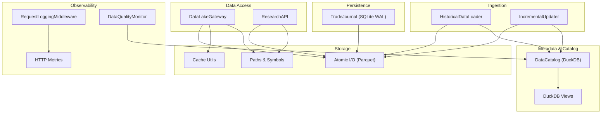

**Diagram sources**
- [gateway.py:39-599](file://datalake/gateway.py#L39-L599)
- [research.py:18-142](file://datalake/research.py#L18-L142)
- [loader.py:32-296](file://datalake/loader.py#L32-L296)
- [updater.py:17-123](file://datalake/updater.py#L17-L123)
- [journal.py:78-306](file://datalake/journal.py#L78-L306)
- [catalog.py:22-236](file://datalake/catalog.py#L22-L236)
- [views.py:15-88](file://datalake/views.py#L15-L88)
- [io.py:42-80](file://datalake/io.py#L42-L80)
- [cache_utils.py:32-263](file://datalake/cache_utils.py#L32-L263)
- [paths.py:59-152](file://datalake/paths.py#L59-L152)
- [symbols.py:17-53](file://datalake/symbols.py#L17-L53)
- [middleware.py:144-200](file://datalake/api/middleware.py#L144-L200)
- [monitor.py:81-389](file://datalake/monitor.py#L81-L389)

**Section sources**
- [__init__.py:43-79](file://datalake/__init__.py#L43-L79)
- [paths.py:59-152](file://datalake/paths.py#L59-L152)
- [schema.py:12-82](file://datalake/schema.py#L12-L82)

## Core Components
- DataLake: Unified facade exposing catalog, loader, updater, research API, and quality engine.
- DataLakeGateway: Read-only market data provider backed by Parquet; supports batch reads and resampling with TTL cache.
- HistoricalDataLoader: Downloads from broker gateways, normalizes to canonical schema, validates, and writes atomically.
- IncrementalUpdater: Appends new intraday bars to existing files with atomic writes.
- DataCatalog: DuckDB-backed metadata catalog for symbols, quality, and download jobs.
- TradeJournal: SQLite WAL-backed persistent trade log with thread-local connections.
- ResearchAPI: Local, fast queries over Parquet and DuckDB views.
- Validation and Quality: Validation rules and quality checks for completeness and OHLC consistency.
- **NEW**: DataQualityMonitor: Automated data quality monitoring with freshness, completeness, and integrity checks.
- **NEW**: RequestLoggingMiddleware: HTTP request logging with correlation IDs and Prometheus metrics.
- Atomic I/O and Caching: Atomic Parquet writes and column-projected reads with cache keys.

**Section sources**
- [__init__.py:43-79](file://datalake/__init__.py#L43-L79)
- [gateway.py:39-599](file://datalake/gateway.py#L39-L599)
- [loader.py:32-296](file://datalake/loader.py#L32-L296)
- [updater.py:17-123](file://datalake/updater.py#L17-L123)
- [catalog.py:22-236](file://datalake/catalog.py#L22-L236)
- [journal.py:78-306](file://datalake/journal.py#L78-L306)
- [research.py:18-142](file://datalake/research.py#L18-L142)
- [validation.py:25-142](file://datalake/validation.py#L25-L142)
- [quality.py:49-212](file://datalake/quality.py#L49-L212)
- [io.py:42-80](file://datalake/io.py#L42-L80)
- [cache_utils.py:32-263](file://datalake/cache_utils.py#L32-L263)
- [monitor.py:81-389](file://datalake/monitor.py#L81-L389)
- [middleware.py:144-200](file://datalake/api/middleware.py#L144-L200)

## Architecture Overview
The system combines:
- Storage: Hive-partitioned Parquet under equities/candles with canonical schema and atomic writes
- Metadata: DuckDB catalog for symbol metadata, quality metrics, and views
- Access: DataLakeGateway and ResearchAPI for historical queries and research
- Persistence: TradeJournal for trade records
- Operations: Loader for initial ingestion and gap-filling; Updater for incremental daily updates
- Quality: Validation and quality checks integrated into ingestion and standalone reporting
- **NEW**: Observability: RequestLoggingMiddleware for request tracing and metrics collection
- **NEW**: Monitoring: DataQualityMonitor for automated data health assessment

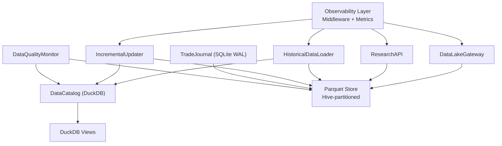

**Diagram sources**
- [gateway.py:39-599](file://datalake/gateway.py#L39-L599)
- [research.py:18-142](file://datalake/research.py#L18-L142)
- [loader.py:32-296](file://datalake/loader.py#L32-L296)
- [updater.py:17-123](file://datalake/updater.py#L17-L123)
- [catalog.py:22-236](file://datalake/catalog.py#L22-L236)
- [journal.py:78-306](file://datalake/journal.py#L78-L306)
- [views.py:15-88](file://datalake/views.py#L15-L88)
- [middleware.py:144-200](file://datalake/api/middleware.py#L144-L200)
- [monitor.py:81-389](file://datalake/monitor.py#L81-L389)

## Detailed Component Analysis

### DataLakeGateway
DataLakeGateway implements a read-only market data interface backed by local Parquet files. It:
- Loads 1-minute candles and resamples to higher timeframes with TTL-bounded cache
- Supports batch operations leveraging DuckDB for glob reads and parallel execution
- Provides quote and LTP retrieval from the latest candle
- Exposes capability descriptors and lifecycle info

Key capabilities:
- Resampling with cache: [gateway.py:89-138](file://datalake/gateway.py#L89-L138)
- Batch history via DuckDB glob: [gateway.py:330-377](file://datalake/gateway.py#L330-L377)
- Batch LTP via DuckDB: [gateway.py:277-305](file://datalake/gateway.py#L277-L305)
- Parallel quote and LTP: [gateway.py:312-428](file://datalake/gateway.py#L312-L428)
- Capabilities and lifecycle: [gateway.py:497-512](file://datalake/gateway.py#L497-L512)

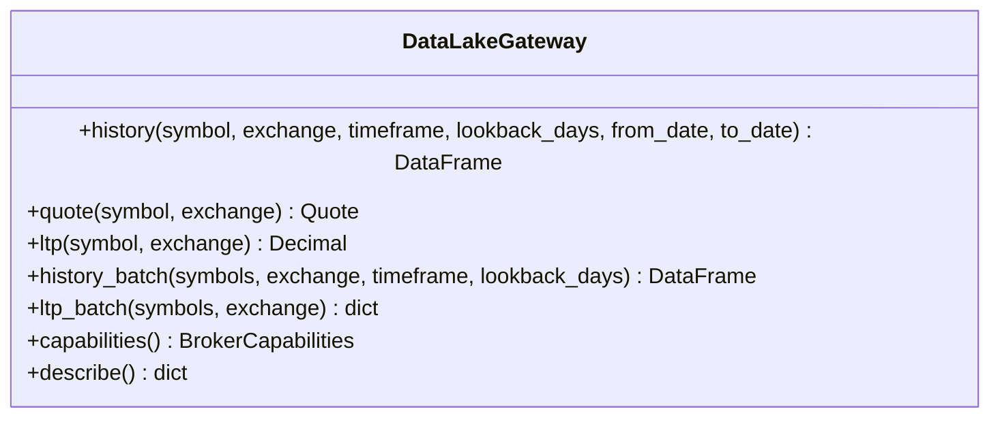

**Diagram sources**
- [gateway.py:39-599](file://datalake/gateway.py#L39-L599)

**Section sources**
- [gateway.py:39-599](file://datalake/gateway.py#L39-L599)

### HistoricalDataLoader
Handles ingestion from broker gateways:
- Normalizes broker schemas to canonical columns and IST timestamps
- Validates OHLCV consistency and drops invalid rows
- Writes atomically to Parquet with snappy compression
- Registers metadata in DataCatalog
- Computes intraday completeness thresholds

Highlights:
- Download and normalize: [loader.py:39-105](file://datalake/loader.py#L39-L105)
- Universe download: [loader.py:107-144](file://datalake/loader.py#L107-L144)
- Repair missing periods: [loader.py:146-192](file://datalake/loader.py#L146-L192)
- Canonical normalization: [loader.py:194-240](file://datalake/loader.py#L194-L240)
- Atomic write: [loader.py:242-255](file://datalake/loader.py#L242-L255)
- Completeness checks: [loader.py:268-295](file://datalake/loader.py#L268-L295)

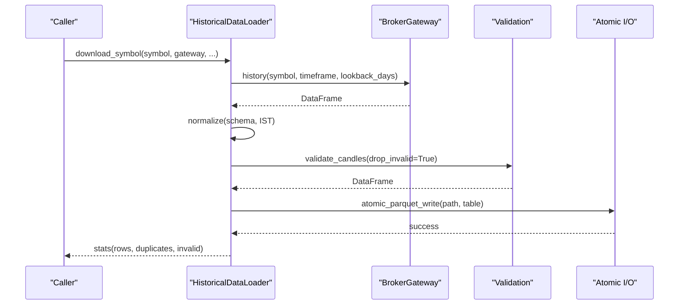

**Diagram sources**
- [loader.py:39-105](file://datalake/loader.py#L39-L105)
- [validation.py:25-115](file://datalake/validation.py#L25-L115)
- [io.py:42-62](file://datalake/io.py#L42-L62)

**Section sources**
- [loader.py:32-296](file://datalake/loader.py#L32-L296)
- [validation.py:25-142](file://datalake/validation.py#L25-L142)
- [io.py:42-80](file://datalake/io.py#L42-L80)

### IncrementalUpdater
Daily updates append new bars to existing files:
- Detects last recorded date and downloads only missing days
- Normalizes and deduplicates before atomic append
- Uses atomic Parquet write to ensure durability

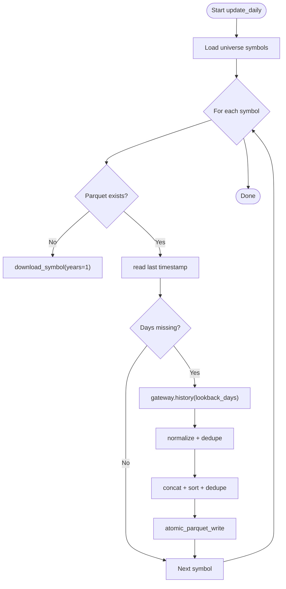

**Diagram sources**
- [updater.py:25-123](file://datalake/updater.py#L25-L123)
- [loader.py:194-240](file://datalake/loader.py#L194-L240)
- [io.py:42-62](file://datalake/io.py#L42-L62)

**Section sources**
- [updater.py:17-123](file://datalake/updater.py#L17-L123)

### DataCatalog and DuckDB Utilities
DataCatalog maintains metadata and quality records:
- Creates tables for symbols, data_quality, download_jobs
- Scans Parquet directories and registers symbols
- Records quality metrics and summaries

DuckDB utilities:
- Pool-based connections with retry and backoff
- Read-only pool for concurrent readers
- Centralized acquisition and shutdown

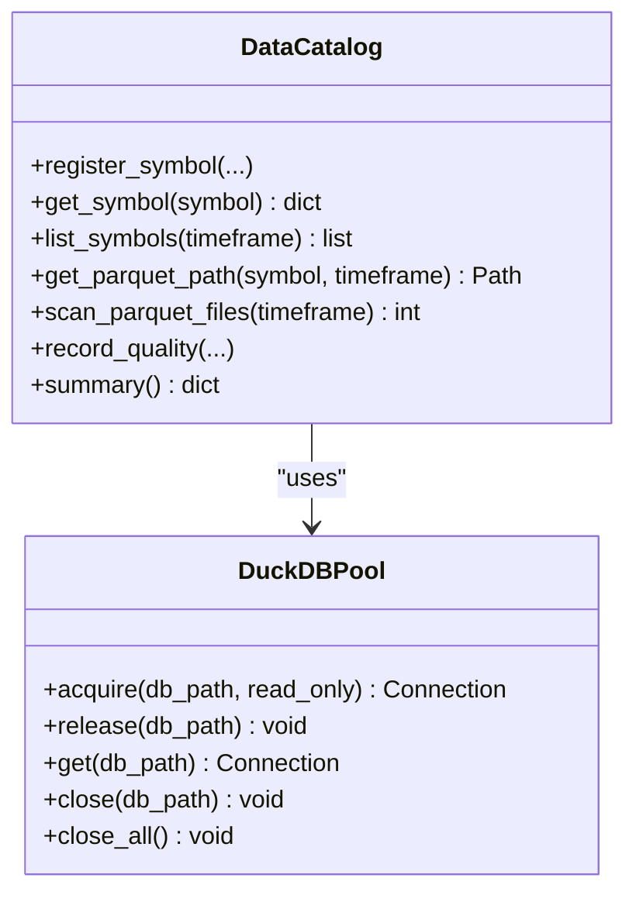

**Diagram sources**
- [catalog.py:22-236](file://datalake/catalog.py#L22-L236)
- [duckdb_utils.py:130-251](file://datalake/duckdb_utils.py#L130-L251)

**Section sources**
- [catalog.py:22-236](file://datalake/catalog.py#L22-L236)
- [duckdb_utils.py:32-251](file://datalake/duckdb_utils.py#L32-L251)

### TradeJournal (SQLite WAL)
Persistent trade log with:
- SQLite WAL mode for concurrency
- Thread-local connections with health checks
- CRUD operations for trades and summaries

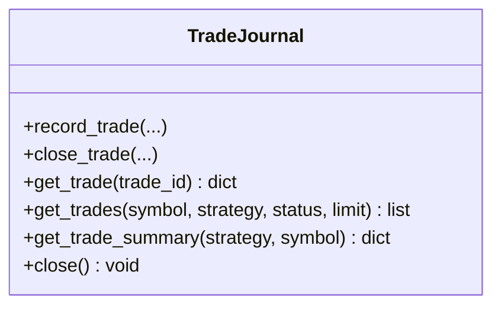

**Diagram sources**
- [journal.py:78-306](file://datalake/journal.py#L78-L306)

**Section sources**
- [journal.py:78-306](file://datalake/journal.py#L78-L306)

### ResearchAPI
Local research interface:
- history: date-filtered loads from Parquet
- universe: batch load per universe list
- scan: available symbols with data
- latest: last N candles

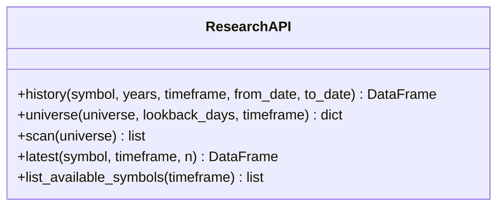

**Diagram sources**
- [research.py:18-142](file://datalake/research.py#L18-L142)

**Section sources**
- [research.py:18-142](file://datalake/research.py#L18-L142)

### Schema, Paths, and Symbols
- Canonical schema defines required columns and Arrow schema
- Hive partitioning scheme for time-series storage
- Symbol normalization to uppercase and suffix stripping

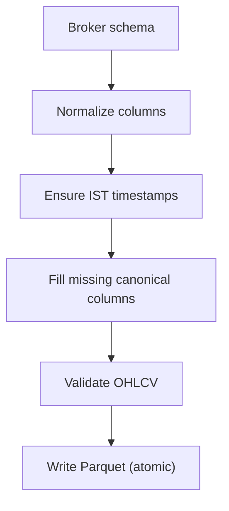

**Diagram sources**
- [schema.py:12-82](file://datalake/schema.py#L12-L82)
- [paths.py:59-152](file://datalake/paths.py#L59-L152)
- [symbols.py:17-53](file://datalake/symbols.py#L17-L53)
- [loader.py:194-240](file://datalake/loader.py#L194-L240)

**Section sources**
- [schema.py:12-82](file://datalake/schema.py#L12-L82)
- [paths.py:59-152](file://datalake/paths.py#L59-L152)
- [symbols.py:17-53](file://datalake/symbols.py#L17-L53)

### Validation and Quality
- Validation enforces OHLC consistency, price ranges, volume, and timestamp constraints
- Quality engine computes gaps, duplicates, completeness, and status

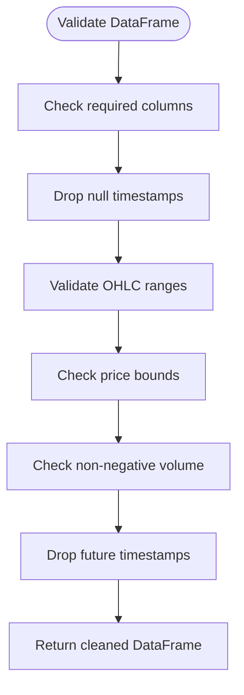

**Diagram sources**
- [validation.py:25-115](file://datalake/validation.py#L25-L115)

**Section sources**
- [validation.py:25-142](file://datalake/validation.py#L25-L142)
- [quality.py:49-212](file://datalake/quality.py#L49-L212)

### Atomic I/O and Caching
- Atomic writes ensure readers never observe partial files
- Column-projected reads and cache keys improve performance

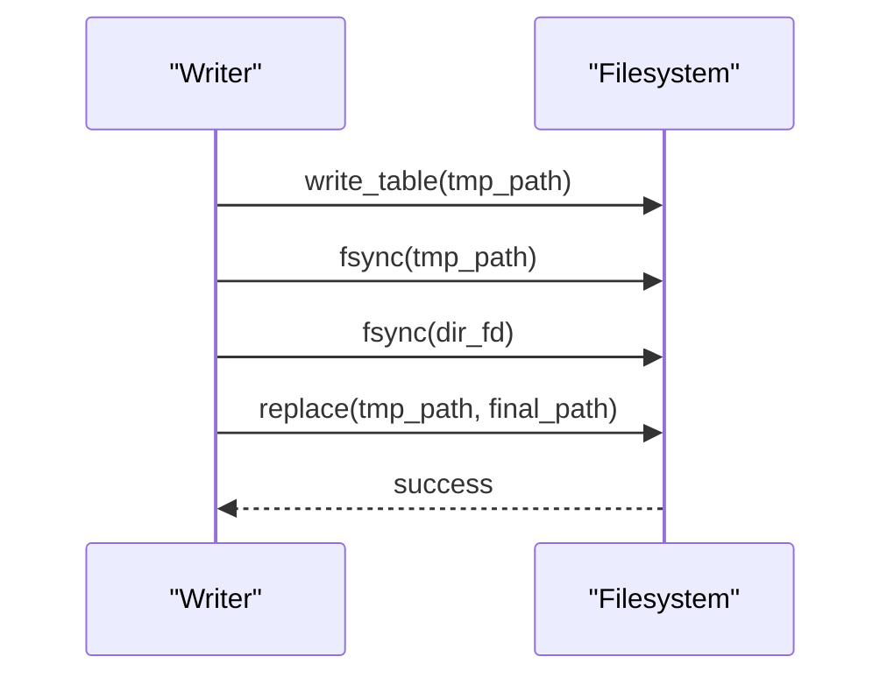

**Diagram sources**
- [io.py:42-62](file://datalake/io.py#L42-L62)

**Section sources**
- [io.py:42-80](file://datalake/io.py#L42-L80)
- [cache_utils.py:32-263](file://datalake/cache_utils.py#L32-L263)

## Observability and Monitoring

### Request Logging Middleware
The system now includes comprehensive request logging and metrics collection through a dedicated middleware layer:

- **Correlation IDs**: Automatically generates or propagates X-Request-ID headers for request tracing
- **Structured Logging**: Logs request method, path, status code, and duration in milliseconds
- **Prometheus Metrics**: Exposes HTTP request counters and duration histograms
- **Path Normalization**: Removes numeric IDs from paths to prevent high-cardinality labels
- **Health Probe Filtering**: Skips noisy health check endpoints to reduce log volume

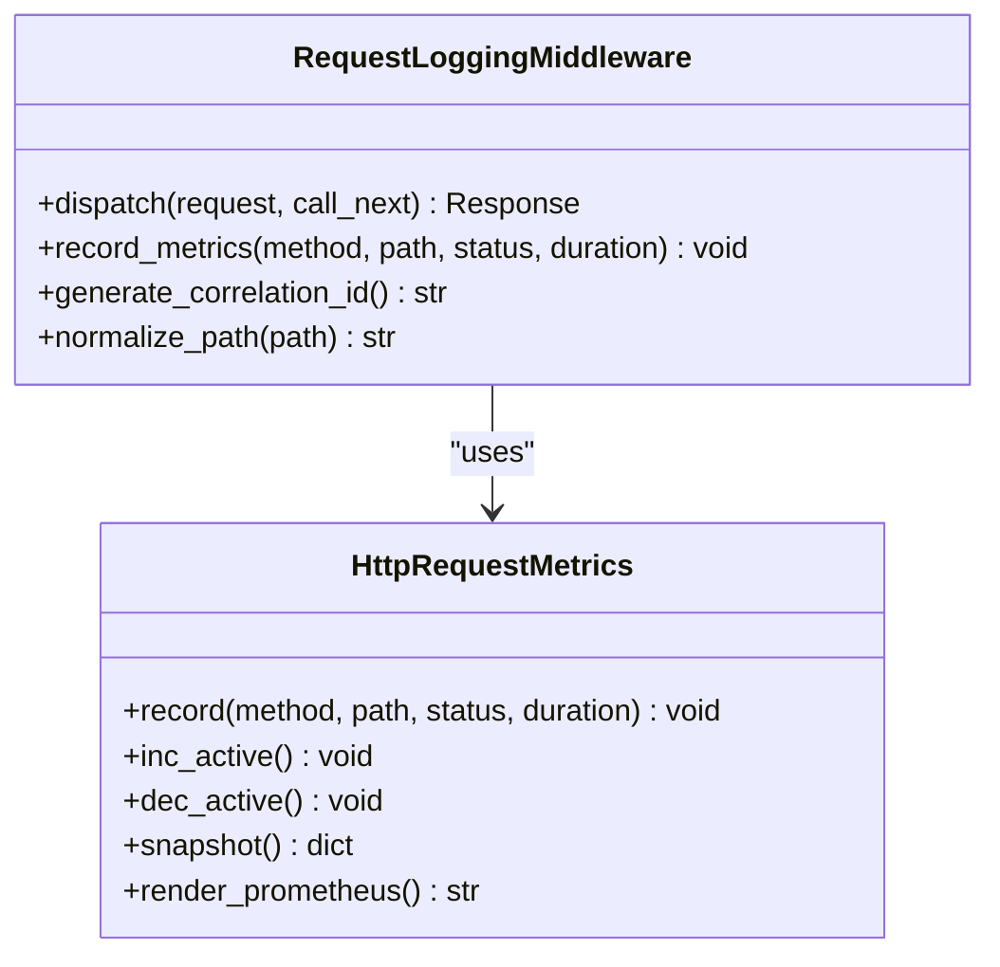

**Diagram sources**
- [middleware.py:144-200](file://datalake/api/middleware.py#L144-L200)
- [middleware.py:25-82](file://datalake/api/middleware.py#L25-L82)

**Section sources**
- [middleware.py:1-200](file://datalake/api/middleware.py#L1-L200)

### HTTP Metrics Collection
The middleware provides comprehensive HTTP metrics for monitoring:

- **Request Counters**: `tradexv2_http_requests_total` with method, path, and status labels
- **Duration Tracking**: `tradexv2_http_request_duration_ms_*` for latency analysis
- **Active Requests**: Gauge metric for current concurrent requests
- **Prometheus Export**: Text-based exposition format for scraping
- **Thread Safety**: Lock-protected counters for concurrent access

**Section sources**
- [middleware.py:25-120](file://datalake/api/middleware.py#L25-L120)

### Data Quality Monitor
An automated monitoring system provides comprehensive data quality assessment:

- **Freshness Checks**: Monitors data age per symbol with PASS/WARNING/FAIL thresholds
- **Completeness Analysis**: Validates intraday candle completeness based on expected trading hours
- **Integrity Verification**: Detects zero-volume bars and OHLC consistency errors
- **Health Scoring**: Calculates overall system health percentage
- **Issue Reporting**: Generates detailed reports of problematic symbols

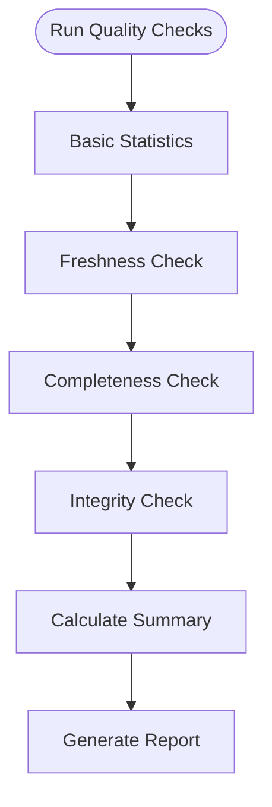

**Diagram sources**
- [monitor.py:88-122](file://datalake/monitor.py#L88-L122)
- [monitor.py:143-183](file://datalake/monitor.py#L143-L183)
- [monitor.py:185-246](file://datalake/monitor.py#L185-L246)
- [monitor.py:248-310](file://datalake/monitor.py#L248-L310)

**Section sources**
- [monitor.py:1-389](file://datalake/monitor.py#L1-L389)

### Health and Readiness Endpoints
The API provides comprehensive health monitoring:

- **Liveness Probe**: Basic server status check
- **Readiness Probe**: Service dependency verification
- **Metrics Endpoint**: JSON format HTTP metrics
- **Prometheus Endpoint**: Raw text metrics for scraping
- **Service Container Status**: Real-time dependency availability

**Section sources**
- [health.py:19-113](file://datalake/api/routers/health.py#L19-L113)

## Enhanced DuckDB Integration

### Connection Pooling Architecture
The system now features sophisticated DuckDB connection management:

- **Separate Read/Write Pools**: Dedicated pools prevent lock conflicts
- **Concurrent Read Access**: Multiple readers can access simultaneously
- **Reference Counting**: Efficient connection reuse with automatic cleanup
- **Retry Logic**: Automatic retry with exponential backoff for lock conflicts
- **Thread Safety**: All operations protected by reentrant locks

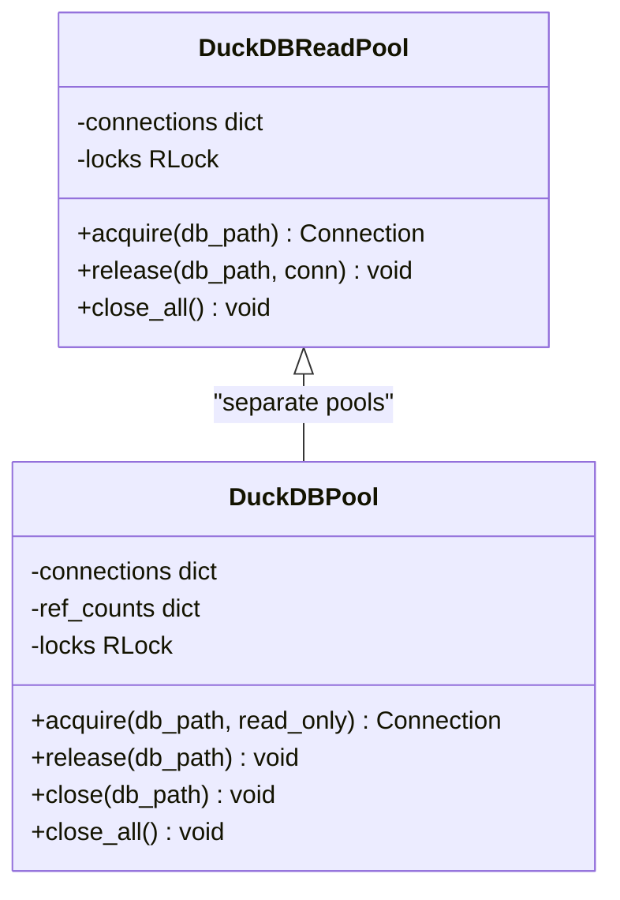

**Diagram sources**
- [duckdb_utils.py:58-130](file://datalake/duckdb_utils.py#L58-L130)
- [duckdb_utils.py:131-213](file://datalake/duckdb_utils.py#L131-L213)

**Section sources**
- [duckdb_utils.py:1-295](file://datalake/duckdb_utils.py#L1-L295)

### Performance Optimizations
Enhanced DuckDB integration provides significant performance improvements:

- **Reduced Lock Contention**: Separate pools eliminate writer-read conflicts
- **Connection Reuse**: Minimizes connection overhead through reference counting
- **Concurrent Reads**: Multiple FastAPI handlers can query simultaneously
- **Automatic Cleanup**: Graceful connection management prevents resource leaks
- **Migration Support**: Schema evolution handled automatically during initialization

**Section sources**
- [duckdb_utils.py:33-56](file://datalake/duckdb_utils.py#L33-L56)
- [catalog.py:68-72](file://datalake/catalog.py#L68-L72)

## Dependency Analysis
- DataLakeGateway depends on Parquet paths, symbol normalization, and cache utilities
- HistoricalDataLoader depends on validation, schema, and atomic I/O
- IncrementalUpdater depends on Loader internals and atomic I/O
- DataCatalog coordinates ingestion and exposes metadata to ResearchAPI and views
- TradeJournal is independent but integrates with CLI and analytics
- DuckDB utilities centralize connection management and retries
- **NEW**: RequestLoggingMiddleware integrates with FastAPI application lifecycle
- **NEW**: DataQualityMonitor leverages DuckDB for automated quality assessment

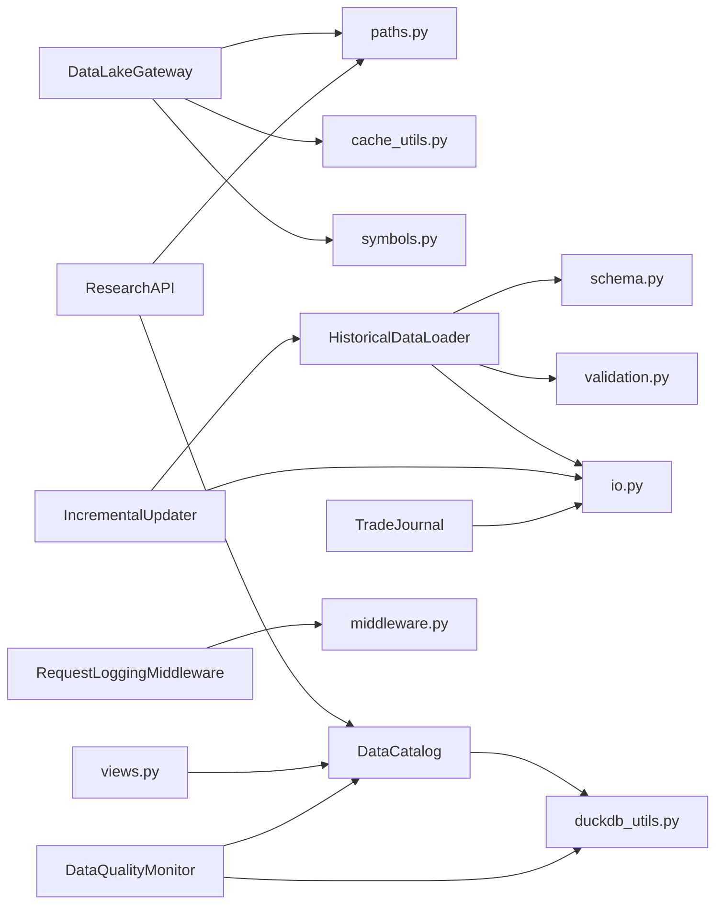

**Diagram sources**
- [gateway.py:39-599](file://datalake/gateway.py#L39-L599)
- [loader.py:32-296](file://datalake/loader.py#L32-L296)
- [updater.py:17-123](file://datalake/updater.py#L17-L123)
- [catalog.py:22-236](file://datalake/catalog.py#L22-L236)
- [research.py:18-142](file://datalake/research.py#L18-L142)
- [views.py:15-88](file://datalake/views.py#L15-L88)
- [journal.py:78-306](file://datalake/journal.py#L78-L306)
- [duckdb_utils.py:130-251](file://datalake/duckdb_utils.py#L130-L251)
- [io.py:42-80](file://datalake/io.py#L42-L80)
- [cache_utils.py:32-263](file://datalake/cache_utils.py#L32-L263)
- [paths.py:59-152](file://datalake/paths.py#L59-L152)
- [symbols.py:17-53](file://datalake/symbols.py#L17-L53)
- [validation.py:25-142](file://datalake/validation.py#L25-L142)
- [schema.py:12-82](file://datalake/schema.py#L12-L82)
- [middleware.py:144-200](file://datalake/api/middleware.py#L144-L200)
- [monitor.py:81-389](file://datalake/monitor.py#L81-L389)

**Section sources**
- [__init__.py:27-40](file://datalake/__init__.py#L27-L40)

## Performance Considerations
- Batch reads: DuckDB glob queries and parallel thread pools reduce latency for multi-symbol loads
- Resampling cache: TTL-bounded cache avoids recomputation of higher timeframe bars
- Column projection: Loading only needed columns reduces I/O and memory usage
- Atomic writes: Ensures durability without reader contention
- DuckDB connection pooling: Reduces lock conflicts and improves throughput
- **NEW**: Separate read/write pools prevent contention between concurrent operations
- **NEW**: Request correlation IDs enable distributed tracing across microservices
- **NEW**: Metrics collection supports real-time performance monitoring and alerting

## Troubleshooting Guide
Common issues and remedies:
- Lock conflicts in DuckDB: Use connection pool and retry with backoff
  - [duckdb_utils.py:32-54](file://datalake/duckdb_utils.py#L32-L54)
- Missing or corrupted Parquet files: Validate with quality checks and re-download
  - [quality.py:49-212](file://datalake/quality.py#L49-L212)
  - [loader.py:39-105](file://datalake/loader.py#L39-L105)
- Incomplete intraday data: Check completeness thresholds and repair gaps
  - [loader.py:268-295](file://datalake/loader.py#L268-L295)
- Timezone inconsistencies: Run normalization to align timestamps to IST
  - [normalize.py:33-168](file://datalake/normalize.py#L33-L168)
- Trade journal connectivity: Verify SQLite WAL mode and thread-local connections
  - [journal.py:53-117](file://datalake/journal.py#L53-L117)
- **NEW**: Request logging issues: Check middleware configuration and correlation ID propagation
  - [middleware.py:144-200](file://datalake/api/middleware.py#L144-L200)
- **NEW**: Metrics collection problems: Verify Prometheus endpoint accessibility and metric formatting
  - [health.py:79-113](file://datalake/api/routers/health.py#L79-L113)
- **NEW**: Data quality monitoring failures: Check DuckDB connectivity and catalog permissions
  - [monitor.py:88-122](file://datalake/monitor.py#L88-L122)

**Section sources**
- [duckdb_utils.py:32-54](file://datalake/duckdb_utils.py#L32-L54)
- [quality.py:49-212](file://datalake/quality.py#L49-L212)
- [loader.py:268-295](file://datalake/loader.py#L268-L295)
- [normalize.py:33-168](file://datalake/normalize.py#L33-L168)
- [journal.py:53-117](file://datalake/journal.py#L53-L117)
- [middleware.py:144-200](file://datalake/api/middleware.py#L144-L200)
- [health.py:79-113](file://datalake/api/routers/health.py#L79-L113)
- [monitor.py:88-122](file://datalake/monitor.py#L88-L122)

## Conclusion
The data lake provides a robust, scalable foundation for historical market data management with comprehensive observability:
- Canonical schema and validation ensure consistency
- Atomic writes and partitioned storage enable safe, high-throughput ingestion
- DuckDB metadata and views accelerate research and analytics
- DataLakeGateway and ResearchAPI deliver efficient, batch-capable access
- TradeJournal offers reliable persistence for operational records
- **NEW**: RequestLoggingMiddleware provides complete request tracing and correlation
- **NEW**: DataQualityMonitor ensures data integrity through automated validation
- **NEW**: Enhanced DuckDB integration delivers optimal performance through connection pooling
Extensibility is straightforward: add new timeframes, universes, and views while preserving the established patterns and leveraging the new observability capabilities.

## Appendices

### Practical Examples

- Query historical data for a symbol
  - [research.py:25-73](file://datalake/research.py#L25-L73)
- Load a universe dataset
  - [research.py:75-105](file://datalake/research.py#L75-L105)
- Backtest using DataLakeGateway
  - [gateway.py:161-186](file://datalake/gateway.py#L161-L186)
- Download and normalize a symbol
  - [loader.py:39-105](file://datalake/loader.py#L39-L105)
- Repair missing bars for a symbol
  - [loader.py:146-192](file://datalake/loader.py#L146-L192)
- Record and summarize trades
  - [journal.py:138-290](file://datalake/journal.py#L138-L290)
- **NEW**: Monitor data quality
  - [monitor.py:88-122](file://datalake/monitor.py#L88-L122)
- **NEW**: Enable request logging
  - [middleware.py:144-200](file://datalake/api/middleware.py#L144-L200)

### Extending the Data Lake
- Add a new timeframe
  - Update supported timeframes and loader mappings
  - [schema.py:67-67](file://datalake/schema.py#L67-L67)
  - [paths.py:47-50](file://datalake/paths.py#L47-L50)
- Introduce a new universe
  - Provide CSV or DuckDB-backed symbol list
  - [schema.py:84-137](file://datalake/schema.py#L84-L137)
- Add a DuckDB view
  - Create reusable aggregations and summaries
  - [views.py:15-88](file://datalake/views.py#L15-L88)
- Enforce stricter validation rules
  - Extend validation logic and integrate into Loader
  - [validation.py:25-142](file://datalake/validation.py#L25-L142)
  - [loader.py:237-238](file://datalake/loader.py#L237-L238)
- **NEW**: Add observability endpoints
  - Configure middleware and metrics collection
  - [middleware.py:144-200](file://datalake/api/middleware.py#L144-L200)
- **NEW**: Implement custom data quality checks
  - Extend DataQualityMonitor with domain-specific validations
  - [monitor.py:81-389](file://datalake/monitor.py#L81-L389)