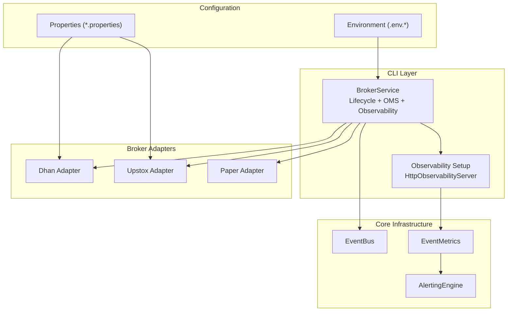
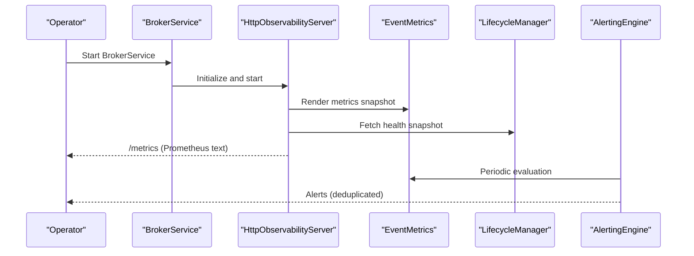
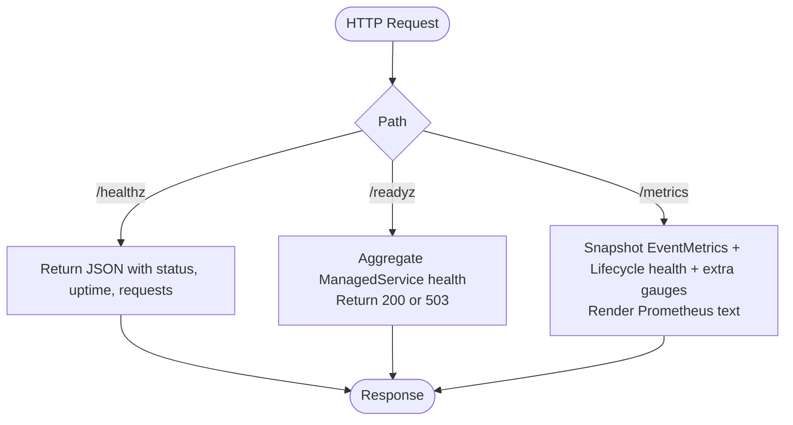
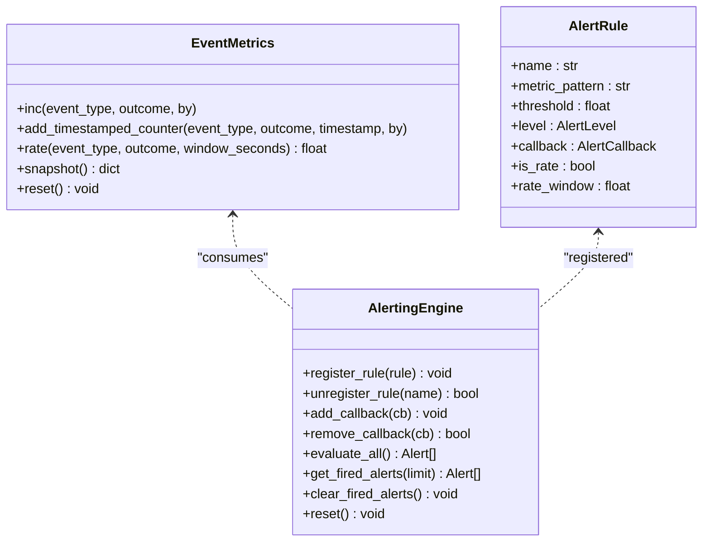
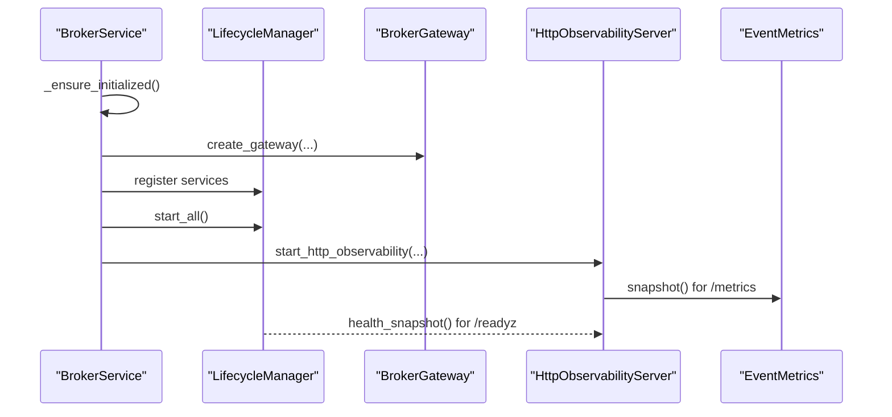
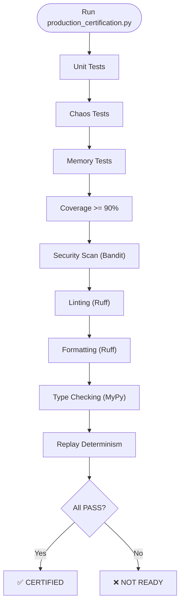
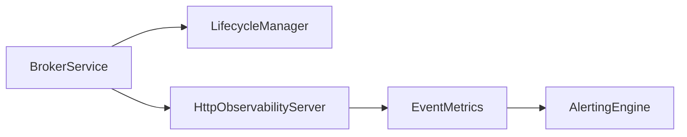

# Deployment and Operations

<cite>
**Referenced Files in This Document**
- [README.md](file://README.md)
- [PRODUCTION_CERTIFICATION_CRITERIA.md](file://PRODUCTION_CERTIFICATION_CRITERIA.md)
- [PRODUCTION_CERTIFICATION_PLAN.md](file://PRODUCTION_CERTIFICATION_PLAN.md)
- [PRODUCTION_HARDENING_PLAN.md](file://PRODUCTION_HARDENING_PLAN.md)
- [BROKER_CERTIFICATION_REPORT.md](file://BROKER_CERTIFICATION_REPORT.md)
- [BROKER_CONNECTION_STATUS.md](file://BROKER_CONNECTION_STATUS.md)
- [scripts/production_certification.py](file://scripts/production_certification.py)
- [brokers/common/observability/http_server.py](file://brokers/common/observability/http_server.py)
- [brokers/common/observability/alerting.py](file://brokers/common/observability/alerting.py)
- [brokers/common/observability/event_metrics.py](file://brokers/common/observability/event_metrics.py)
- [cli/services/observability_setup.py](file://cli/services/observability_setup.py)
- [cli/services/broker_service.py](file://cli/services/broker_service.py)
- [config/endpoints.py](file://config/endpoints.py)
- [config/upstox-live.properties.example](file://config/upstox-live.properties.example)
- [config/dhan-local.properties.example](file://config/dhan-local.properties.example)
- [tests/chaos/test_network_partitions.py](file://tests/chaos/test_network_partitions.py)
- [tests/chaos/test_data_corruption.py](file://tests/chaos/test_data_corruption.py)
- [tests/regression/test_memory_leaks.py](file://tests/regression/test_memory_leaks.py)
- [tests/performance/test_benchmarks.py](file://tests/performance/test_benchmarks.py)
- [cli/load_testing/runner.py](file://cli/load_testing/runner.py)
- [cli/commands/load_test.py](file://cli/commands/load_test.py)
- [docs/ASYNCHRONOUS_EVENT_BUS_IMPLEMENTATION_SUMMARY.md](file://docs/ASYNCHRONOUS_EVENT_BUS_IMPLEMENTATION_SUMMARY.md)
- [docs/ASYNC_EVENT_BUS_MIGRATION.md](file://docs/ASYNC_EVENT_BUS_MIGRATION.md)
- [docs/IMPORT_DIRECTION_RULES.md](file://docs/IMPORT_DIRECTION_RULES.md)
- [docs/CROSS_CUTTING_PROGRESS.md](file://docs/CROSS_CUTTING_PROGRESS.md)
- [docs/REFACTORING_PLAYBOOK.md](file://docs/REFACTORING_PLAYBOOK.md)
- [docs/UPSTOX_WIRE_FORMAT.md](file://docs/UPSTOX_WIRE_FORMAT.md)
- [docs/UPSTOX_FIX_PLAN.md](file://docs/UPSTOX_FIX_PLAN.md)
- [docs/UPSTOX_GAP_CLOSURE_REPORT.md](file://docs/UPSTOX_GAP_CLOSURE_REPORT.md)
- [docs/UPSTOX_VERIFIED_CAPABILITIES.md](file://docs/UPSTOX_VERIFIED_CAPABILITIES.md)
- [docs/SECURITY.md](file://docs/SECURITY.md)
- [docs/PRODUCTION_CERTIFICATION_REPORT.md](file://docs/PRODUCTION_CERTIFICATION_REPORT.md)
- [docs/PRODUCTION_CERTIFICATION_PLAN.md](file://docs/PRODUCTION_CERTIFICATION_PLAN.md)
- [docs/PRODUCTION_HARDENING_PLAN.md](file://docs/PRODUCTION_HARDENING_PLAN.md)
- [docs/ADR-001-DOMAIN-SINGLE-SOURCE.md](file://docs/ADR-001-DOMAIN-SINGLE-SOURCE.md)
- [docs/ADR-002-GATEWAY-CONTRACT.md](file://docs/ADR-002-GATEWAY-CONTRACT.md)
- [docs/ADR-003-RECONCILIATION-ENGINE.md](file://docs/ADR-003-RECONCILIATION-ENGINE.md)
- [docs/ADR-004-BATCH-FETCH-MIXIN.md](file://docs/ADR-004-BATCH-FETCH-MIXIN.md)
- [docs/ADR-005-SEVERITY-VOCABULARY.md](file://docs/ADR-005-SEVERITY-VOCABULARY.md)
</cite>

## Table of Contents
1. [Introduction](#introduction)
2. [Project Structure](#project-structure)
3. [Core Components](#core-components)
4. [Architecture Overview](#architecture-overview)
5. [Detailed Component Analysis](#detailed-component-analysis)
6. [Dependency Analysis](#dependency-analysis)
7. [Performance Considerations](#performance-considerations)
8. [Troubleshooting Guide](#troubleshooting-guide)
9. [Conclusion](#conclusion)
10. [Appendices](#appendices)

## Introduction
This document provides production-focused deployment, operations, and maintenance guidance for TradeXV2. It consolidates the production certification criteria, broker certification status, observability endpoints, monitoring and alerting setup, operational runbooks, and hardening recommendations. It also outlines deployment topology, containerization options, infrastructure requirements, and operational best practices derived from the repository’s official documentation and source code.

## Project Structure
TradeXV2 is organized into modular components supporting broker-agnostic trading, CLI diagnostics, analytics, and a data lake. For production operations, the most relevant areas are:
- Broker adapters (Dhan, Upstox, Paper)
- Observability subsystem (HTTP server, metrics, alerting)
- CLI services (BrokerService, observability wiring)
- Configuration and environment files
- Certification and hardening plans

**Diagram sources**
- [cli/services/broker_service.py:41-120](file://cli/services/broker_service.py#L41-L120)
- [cli/services/observability_setup.py:120-178](file://cli/services/observability_setup.py#L120-L178)
- [brokers/common/observability/http_server.py:133-427](file://brokers/common/observability/http_server.py#L133-L427)
- [brokers/common/observability/event_metrics.py:35-196](file://brokers/common/observability/event_metrics.py#L35-L196)
- [brokers/common/observability/alerting.py:157-604](file://brokers/common/observability/alerting.py#L157-L604)

**Section sources**
- [README.md:50-83](file://README.md#L50-L83)

## Core Components
- HTTP observability server: Provides /healthz, /readyz, and /metrics endpoints, integrated as a ManagedService via LifecycleManager.
- EventMetrics: Thread-safe counters and timestamped counters enabling rate-based alerting.
- AlertingEngine: Threshold-based alerting with deduplication and callbacks.
- BrokerService: Central service owning LifecycleManager, OMS wiring, and observability server startup.
- Production certification script: Automates unit tests, chaos tests, memory tests, coverage, security scan, linting, formatting, type checking, and replay determinism.

**Section sources**
- [brokers/common/observability/http_server.py:133-427](file://brokers/common/observability/http_server.py#L133-L427)
- [brokers/common/observability/event_metrics.py:35-196](file://brokers/common/observability/event_metrics.py#L35-L196)
- [brokers/common/observability/alerting.py:157-604](file://brokers/common/observability/alerting.py#L157-L604)
- [cli/services/broker_service.py:41-120](file://cli/services/broker_service.py#L41-L120)
- [scripts/production_certification.py:546-644](file://scripts/production_certification.py#L546-L644)

## Architecture Overview
The observability architecture centers on the HttpObservabilityServer, which aggregates metrics from EventMetrics and LifecycleManager health snapshots, and augments them with OMS risk gauges collected by BrokerService. AlertingEngine consumes EventMetrics to trigger alerts based on predefined rules.

**Diagram sources**
- [cli/services/broker_service.py:113-169](file://cli/services/broker_service.py#L113-L169)
- [cli/services/observability_setup.py:120-178](file://cli/services/observability_setup.py#L120-L178)
- [brokers/common/observability/http_server.py:182-268](file://brokers/common/observability/http_server.py#L182-L268)
- [brokers/common/observability/event_metrics.py:106-178](file://brokers/common/observability/event_metrics.py#L106-L178)
- [brokers/common/observability/alerting.py:286-378](file://brokers/common/observability/alerting.py#L286-L378)

## Detailed Component Analysis

### HTTP Observability Endpoints
- /healthz: Liveness probe returning process uptime and request stats.
- /readyz: Readiness probe checking ManagedService health states; returns 503 if any service is FAILED/UNHEALTHY.
- /metrics: Prometheus text exposition combining EventMetrics, LifecycleManager health, and extra gauges (e.g., daily PnL, kill switch state).

**Diagram sources**
- [brokers/common/observability/http_server.py:182-268](file://brokers/common/observability/http_server.py#L182-L268)

**Section sources**
- [README.md:161-166](file://README.md#L161-L166)
- [brokers/common/observability/http_server.py:133-427](file://brokers/common/observability/http_server.py#L133-L427)
- [cli/services/observability_setup.py:120-178](file://cli/services/observability_setup.py#L120-L178)

### EventMetrics and Alerting
- EventMetrics maintains counters and timestamped counters for rate-based alerting. It supports snapshotting and rate computation over a sliding window.
- AlertingEngine evaluates rules against metrics snapshots, deduplicates alerts within a cooldown, and invokes callbacks.

**Diagram sources**
- [brokers/common/observability/event_metrics.py:35-196](file://brokers/common/observability/event_metrics.py#L35-L196)
- [brokers/common/observability/alerting.py:157-604](file://brokers/common/observability/alerting.py#L157-L604)

**Section sources**
- [brokers/common/observability/event_metrics.py:35-196](file://brokers/common/observability/event_metrics.py#L35-L196)
- [brokers/common/observability/alerting.py:157-604](file://brokers/common/observability/alerting.py#L157-L604)

### BrokerService Lifecycle and Observability Wiring
- BrokerService owns LifecycleManager and orchestrates OMS setup, WebSocket services, readiness checks, and observability server startup.
- ObservabilitySetup collects OMS risk gauges (daily PnL, kill switch state, reconciliation metrics, DLQ depth) and exposes them via /metrics.

**Diagram sources**
- [cli/services/broker_service.py:121-195](file://cli/services/broker_service.py#L121-L195)
- [cli/services/observability_setup.py:120-178](file://cli/services/observability_setup.py#L120-L178)
- [brokers/common/observability/http_server.py:182-268](file://brokers/common/observability/http_server.py#L182-L268)

**Section sources**
- [cli/services/broker_service.py:41-120](file://cli/services/broker_service.py#L41-L120)
- [cli/services/observability_setup.py:26-117](file://cli/services/observability_setup.py#L26-L117)

### Production Certification and Operational Readiness
- The certification script automates the production gate, including unit tests, chaos tests, memory regression tests, coverage, security scan, linting, formatting, type checking, and replay determinism.
- The certification criteria define mandatory and warning-quality gates, including replay determinism and coverage thresholds.

**Diagram sources**
- [scripts/production_certification.py:546-644](file://scripts/production_certification.py#L546-L644)
- [PRODUCTION_CERTIFICATION_CRITERIA.md:263-301](file://PRODUCTION_CERTIFICATION_CRITERIA.md#L263-L301)

**Section sources**
- [scripts/production_certification.py:546-644](file://scripts/production_certification.py#L546-L644)
- [PRODUCTION_CERTIFICATION_CRITERIA.md:11-332](file://PRODUCTION_CERTIFICATION_CRITERIA.md#L11-L332)

### Broker Certification and Connection Status
- Broker certification report documents capabilities and gaps for Dhan, Upstox, and Paper trading adapters, including missing features and blockers for production.
- Broker connection status report details current operational state and remediation steps for Dhan SDK version mismatch.

**Section sources**
- [BROKER_CERTIFICATION_REPORT.md:1-447](file://BROKER_CERTIFICATION_REPORT.md#L1-L447)
- [BROKER_CONNECTION_STATUS.md:1-247](file://BROKER_CONNECTION_STATUS.md#L1-L247)

### Monitoring and Alerting Setup
- Default alert rules include high error rate, dead letter queue growth, circuit breaker open, broker fallback storm, event bus backpressure, and log write failures.
- Observability server renders Prometheus metrics and exposes readiness/liveness probes.

**Section sources**
- [brokers/common/observability/alerting.py:511-594](file://brokers/common/observability/alerting.py#L511-L594)
- [brokers/common/observability/http_server.py:61-127](file://brokers/common/observability/http_server.py#L61-L127)

### Load Testing and Performance
- Load testing is integrated via CLI commands and a runner; performance benchmarks are proposed for critical paths.
- The hardening plan recommends adding load testing to CI and performance regression tests.

**Section sources**
- [cli/load_testing/runner.py](file://cli/load_testing/runner.py)
- [cli/commands/load_test.py](file://cli/commands/load_test.py)
- [PRODUCTION_HARDENING_PLAN.md:114-161](file://PRODUCTION_HARDENING_PLAN.md#L114-L161)
- [tests/performance/test_benchmarks.py](file://tests/performance/test_benchmarks.py)

### Security Considerations
- Security scanning with Bandit is part of the certification gate; the hardening plan proposes adding dependency vulnerability scanning and expanding security coverage.
- Security documentation and guidelines are maintained in the docs area.

**Section sources**
- [PRODUCTION_CERTIFICATION_CRITERIA.md:162-190](file://PRODUCTION_CERTIFICATION_CRITERIA.md#L162-L190)
- [PRODUCTION_HARDENING_PLAN.md:164-208](file://PRODUCTION_HARDENING_PLAN.md#L164-L208)
- [docs/SECURITY.md](file://docs/SECURITY.md)

## Dependency Analysis
The observability stack depends on:
- EventMetrics for counters and rates
- LifecycleManager for health snapshots
- BrokerService for OMS risk gauges
- HttpObservabilityServer for endpoint orchestration

**Diagram sources**
- [cli/services/broker_service.py:86-120](file://cli/services/broker_service.py#L86-L120)
- [cli/services/observability_setup.py:120-178](file://cli/services/observability_setup.py#L120-L178)
- [brokers/common/observability/http_server.py:133-170](file://brokers/common/observability/http_server.py#L133-L170)
- [brokers/common/observability/event_metrics.py:35-64](file://brokers/common/observability/event_metrics.py#L35-L64)
- [brokers/common/observability/alerting.py:157-189](file://brokers/common/observability/alerting.py#L157-L189)

**Section sources**
- [cli/services/broker_service.py:86-120](file://cli/services/broker_service.py#L86-L120)
- [cli/services/observability_setup.py:120-178](file://cli/services/observability_setup.py#L120-L178)
- [brokers/common/observability/http_server.py:133-170](file://brokers/common/observability/http_server.py#L133-L170)

## Performance Considerations
- Use Prometheus metrics to monitor OMS risk state, broker connectivity, reconciliation drift, and DLQ depth.
- Implement rate-based alerting to detect anomalies early.
- Add performance benchmarks and load tests to CI to prevent regressions.

[No sources needed since this section provides general guidance]

## Troubleshooting Guide
Common operational issues and remedies:
- Dhan SDK version mismatch: Align code with SDK v2.2.0 or downgrade package as recommended.
- Upstox analytics-only mode: Disable analytics-only flag to enable trading APIs.
- Missing CLI order commands: Implement order placement commands to enable terminal-based trading.
- No portfolio reconciliation: Implement a reconciliation service to detect and resolve drift.
- No backpressure: Add bounded queues and overflow handling to manage high-volume tick streams.

**Section sources**
- [BROKER_CONNECTION_STATUS.md:133-200](file://BROKER_CONNECTION_STATUS.md#L133-L200)
- [BROKER_CERTIFICATION_REPORT.md:176-261](file://BROKER_CERTIFICATION_REPORT.md#L176-L261)

## Conclusion
TradeXV2 provides a robust foundation for production operations with HTTP observability, lifecycle-managed services, and comprehensive certification criteria. While the system is conditionally approved for small-cap live trading, further hardening—duplicate fill protection, order persistence/recovery, reconciliation, and expanded monitoring—is required for institutional-scale deployment.

[No sources needed since this section summarizes without analyzing specific files]

## Appendices

### Deployment Topology and Infrastructure Requirements
- Broker adapters: Dhan, Upstox, Paper.
- Observability: HttpObservabilityServer on loopback, Prometheus-compatible /metrics.
- CLI: BrokerService orchestrates lifecycle, OMS, and observability.
- Configuration: Environment files (.env.local, .env.upstox) and properties files for broker credentials.

**Section sources**
- [README.md:50-83](file://README.md#L50-L83)
- [config/endpoints.py](file://config/endpoints.py)
- [config/upstox-live.properties.example](file://config/upstox-live.properties.example)
- [config/dhan-local.properties.example](file://config/dhan-local.properties.example)

### Containerization Options
- Use a container image with Python runtime and installed dependencies.
- Mount configuration files (.env.local, .env.upstox) as secrets/volumes.
- Expose observability port (default 8765) internally for sidecar scraping.

[No sources needed since this section provides general guidance]

### Maintenance Procedures and Update Processes
- Run production certification gate before merging to main or deploying to production.
- Apply broker SDK compatibility fixes and re-run connection tests.
- Add load testing and performance benchmarks to CI.

**Section sources**
- [scripts/production_certification.py:546-644](file://scripts/production_certification.py#L546-L644)
- [BROKER_CONNECTION_STATUS.md:155-200](file://BROKER_CONNECTION_STATUS.md#L155-L200)
- [PRODUCTION_HARDENING_PLAN.md:114-161](file://PRODUCTION_HARDENING_PLAN.md#L114-L161)

### Operational Runbooks
- Broker outage: Verify SDK version, re-run connection tests, and confirm observability endpoints.
- System maintenance: Graceful shutdown via LifecycleManager, ensuring all ManagedServices are drained.
- Emergency procedures: Enable risk fail-open only temporarily, monitor alerts, and restore normal operation.

**Section sources**
- [cli/services/broker_service.py:361-406](file://cli/services/broker_service.py#L361-L406)
- [BROKER_CONNECTION_STATUS.md:155-200](file://BROKER_CONNECTION_STATUS.md#L155-L200)
- [cli/services/broker_service.py:76-82](file://cli/services/broker_service.py#L76-L82)

### Security, Backup, and Disaster Recovery
- Security: Bandit scans, dependency vulnerability checks, and secure credential handling.
- Backup: Persist order state and reconciliation data; maintain replayable event logs.
- DR: Implement order recovery on restart and reconciliation loops to minimize data divergence.

**Section sources**
- [PRODUCTION_CERTIFICATION_CRITERIA.md:162-190](file://PRODUCTION_CERTIFICATION_CRITERIA.md#L162-L190)
- [PRODUCTION_HARDENING_PLAN.md:164-208](file://PRODUCTION_HARDENING_PLAN.md#L164-L208)
- [BROKER_CERTIFICATION_REPORT.md:115-174](file://BROKER_CERTIFICATION_REPORT.md#L115-L174)

### Scaling, Capacity Planning, and Troubleshooting
- Scale horizontally by running multiple instances behind a load balancer; each instance exposes its own observability endpoints.
- Capacity planning: Monitor broker API rate limits, implement rate limiting, and add backpressure mechanisms.
- Troubleshoot: Use /readyz to detect unhealthy services, /metrics for anomaly detection, and alert rules for rapid incident response.

**Section sources**
- [brokers/common/observability/http_server.py:199-236](file://brokers/common/observability/http_server.py#L199-L236)
- [brokers/common/observability/alerting.py:511-594](file://brokers/common/observability/alerting.py#L511-L594)
- [PRODUCTION_HARDENING_PLAN.md:210-266](file://PRODUCTION_HARDENING_PLAN.md#L210-L266)