# Event System

<cite>
**Referenced Files in This Document**
- [event_bus.py](file://brokers/common/event_bus/event_bus.py)
- [async_event_bus.py](file://brokers/common/event_bus/async_event_bus.py)
- [dead_letter_queue.py](file://brokers/common/event_bus/dead_letter_queue.py)
- [event_types.py](file://brokers/common/event_bus/event_types.py)
- [factory.py](file://brokers/common/event_bus/factory.py)
- [models.py](file://brokers/common/event_bus/models.py)
- [event_log.py](file://brokers/common/event_log.py)
- [event_metrics.py](file://brokers/common/observability/event_metrics.py)
- [alerting.py](file://brokers/common/observability/alerting.py)
- [gateway.py](file://brokers/common/gateway.py)
- [context.py](file://brokers/common/oms/context.py)
- [order_manager.py](file://brokers/common/oms/order_manager.py)
- [websocket.py](file://brokers/dhan/websocket.py)
- [test_event_bus_integration.py](file://brokers/common/event_bus/tests/test_event_bus_integration.py)
- [test_event_bus.py](file://brokers/common/event_bus/tests/test_event_bus.py)
- [test_memory_leaks.py](file://tests/regression/test_memory_leaks.py)
</cite>

## Table of Contents
1. [Introduction](#introduction)
2. [Project Structure](#project-structure)
3. [Core Components](#core-components)
4. [Architecture Overview](#architecture-overview)
5. [Detailed Component Analysis](#detailed-component-analysis)
6. [Dependency Analysis](#dependency-analysis)
7. [Performance Considerations](#performance-considerations)
8. [Troubleshooting Guide](#troubleshooting-guide)
9. [Conclusion](#conclusion)
10. [Appendices](#appendices)

## Introduction
This document explains the event system that powers the trading platform’s thread-safe, publish-subscribe architecture. It covers the synchronous EventBus and asynchronous AsyncEventBus, the DeadLetterQueue for resilient failure handling, the event type catalog and payload contracts, the event lifecycle from publication to delivery, and integration with broker adapters and the OMS. It also provides practical examples, performance guidance, debugging techniques, and extension patterns for custom event types and handlers.

## Project Structure
The event system is centered in the brokers/common/event_bus package and integrates with observability, OMS, and broker adapters:
- Event bus implementations: EventBus (synchronous), AsyncEventBus (asynchronous)
- Reliability: DeadLetterQueue, EventLog (persistence), EventMetrics, AlertingEngine
- Contracts: EventType catalog and payload schemas
- Factory: AsyncEventBusFactory for configurable bus selection and migration
- Integration: OMS wiring, broker adapters publishing canonical event types

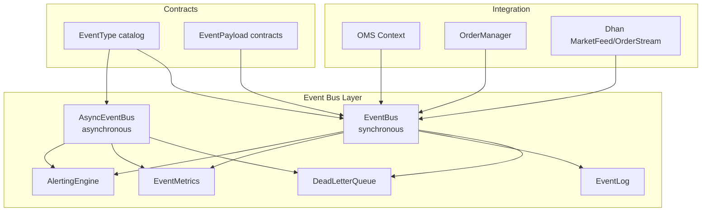

**Diagram sources**
- [event_bus.py:118-420](file://brokers/common/event_bus/event_bus.py#L118-L420)
- [async_event_bus.py:104-586](file://brokers/common/event_bus/async_event_bus.py#L104-L586)
- [dead_letter_queue.py:55-140](file://brokers/common/event_bus/dead_letter_queue.py#L55-L140)
- [event_log.py:114-268](file://brokers/common/event_log.py#L114-L268)
- [event_metrics.py:35-196](file://brokers/common/observability/event_metrics.py#L35-L196)
- [alerting.py:157-604](file://brokers/common/observability/alerting.py#L157-L604)
- [event_types.py:43-141](file://brokers/common/event_bus/event_types.py#L43-L141)
- [context.py:149-157](file://brokers/common/oms/context.py#L149-L157)
- [order_manager.py:515-533](file://brokers/common/oms/order_manager.py#L515-L533)
- [websocket.py:910-1023](file://brokers/dhan/websocket.py#L910-L1023)

**Section sources**
- [event_bus.py:1-420](file://brokers/common/event_bus/event_bus.py#L1-L420)
- [async_event_bus.py:1-586](file://brokers/common/event_bus/async_event_bus.py#L1-L586)
- [dead_letter_queue.py:1-140](file://brokers/common/event_bus/dead_letter_queue.py#L1-L140)
- [event_types.py:1-429](file://brokers/common/event_bus/event_types.py#L1-L429)
- [factory.py:1-390](file://brokers/common/event_bus/factory.py#L1-L390)
- [event_log.py:1-431](file://brokers/common/event_log.py#L1-L431)
- [event_metrics.py:1-196](file://brokers/common/observability/event_metrics.py#L1-L196)
- [alerting.py:1-604](file://brokers/common/observability/alerting.py#L1-L604)
- [context.py:149-157](file://brokers/common/oms/context.py#L149-L157)
- [order_manager.py:515-533](file://brokers/common/oms/order_manager.py#L515-L533)
- [websocket.py:910-1023](file://brokers/dhan/websocket.py#L910-L1023)

## Core Components
- DomainEvent: Immutable event value object with type, timestamp, payload, symbol, source, correlation ID, and sequence number for deterministic replay.
- EventBus: Thread-safe synchronous event bus with subscription management, ordered dispatch, persistence, metrics, alerting, and failure handling.
- AsyncEventBus: Asynchronous event bus with backpressure, FIFO dispatch, mixed handler support (sync/async), and DLQ integration.
- DeadLetterQueue: Bounded in-memory queue capturing handler failures for later replay and alerting.
- EventLog: Append-only JSONL persistence for crash recovery and replay.
- EventMetrics: Thread-safe counters and timestamped counters for observability and rate-based alerting.
- AlertingEngine: Threshold-based alerting over metrics snapshots.
- EventType catalog and EventPayload contracts: Canonical event types and payload schemas.
- AsyncEventBusFactory: Factory for selecting sync or async bus with environment-driven configuration and migration support.

**Section sources**
- [event_bus.py:50-115](file://brokers/common/event_bus/event_bus.py#L50-L115)
- [event_bus.py:118-420](file://brokers/common/event_bus/event_bus.py#L118-L420)
- [async_event_bus.py:104-586](file://brokers/common/event_bus/async_event_bus.py#L104-L586)
- [dead_letter_queue.py:55-140](file://brokers/common/event_bus/dead_letter_queue.py#L55-L140)
- [event_log.py:114-268](file://brokers/common/event_log.py#L114-L268)
- [event_metrics.py:35-196](file://brokers/common/observability/event_metrics.py#L35-L196)
- [alerting.py:157-604](file://brokers/common/observability/alerting.py#L157-L604)
- [event_types.py:43-376](file://brokers/common/event_bus/event_types.py#L43-L376)
- [factory.py:71-390](file://brokers/common/event_bus/factory.py#L71-L390)

## Architecture Overview
The event system implements a publish-subscribe model with strong reliability guarantees:
- Publishers emit DomainEvent instances with canonical event_type values.
- EventBus routes events to handlers atomically and safely, preserving ordering and injecting correlation IDs.
- EventLog persists events for crash recovery and replay.
- DeadLetterQueue captures handler failures for inspection and replay.
- EventMetrics tracks outcomes and rates; AlertingEngine triggers alerts based on thresholds.
- AsyncEventBus provides backpressure and FIFO ordering for async workflows.

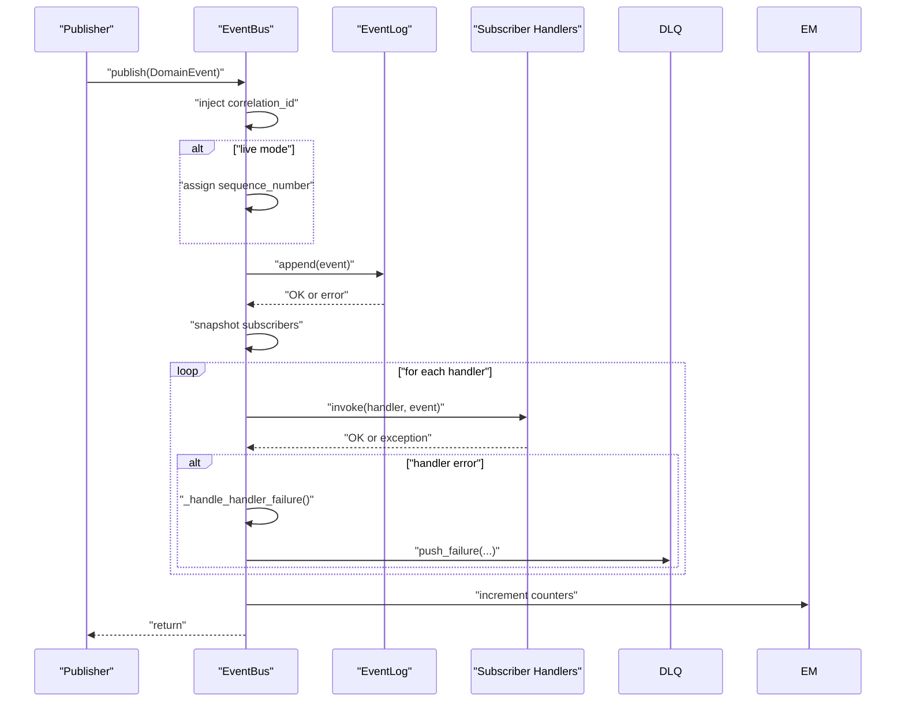

**Diagram sources**
- [event_bus.py:298-420](file://brokers/common/event_bus/event_bus.py#L298-L420)
- [event_log.py:153-195](file://brokers/common/event_log.py#L153-L195)
- [dead_letter_queue.py:90-107](file://brokers/common/event_bus/dead_letter_queue.py#L90-L107)
- [event_metrics.py:65-105](file://brokers/common/observability/event_metrics.py#L65-L105)

**Section sources**
- [event_bus.py:298-420](file://brokers/common/event_bus/event_bus.py#L298-L420)
- [event_log.py:153-195](file://brokers/common/event_log.py#L153-L195)

## Detailed Component Analysis

### EventBus (Synchronous)
- Thread safety: Uses an RLock to guard subscription and dispatch operations.
- Subscription management: subscribe returns a token; unsubscribe removes by token; clear removes all.
- Publication: injects correlation ID, assigns sequence number in live mode, persists to EventLog, snapshots handlers, and invokes each handler. Failures are logged, counted, and pushed to DeadLetterQueue.
- Alerting: Optional background thread evaluates rules periodically.
- Replay mode: Preserves original timestamps and sequence numbers for deterministic replay.

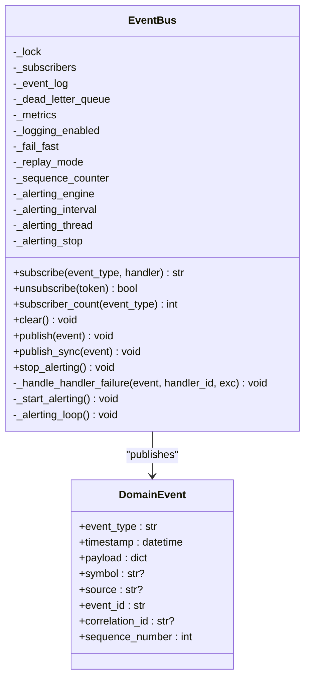

**Diagram sources**
- [event_bus.py:118-420](file://brokers/common/event_bus/event_bus.py#L118-L420)

**Section sources**
- [event_bus.py:118-420](file://brokers/common/event_bus/event_bus.py#L118-L420)

### AsyncEventBus (Asynchronous)
- Backpressure: Bounded queue with configurable policy (BLOCK/DROP/ERROR).
- FIFO ordering: Single dispatch worker ensures strict ordering.
- Mixed handlers: Sync handlers run in executor; async handlers awaited.
- Persistence: Not integrated with EventLog; DLQ used for failures.
- Alerting: Background task evaluates rules periodically.
- Stats: Provides queue size, counts, and subscriber totals.

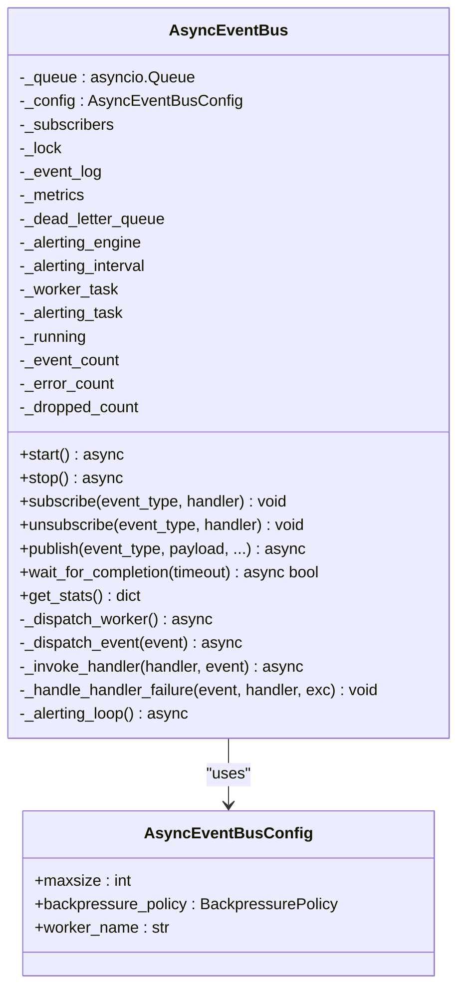

**Diagram sources**
- [async_event_bus.py:104-586](file://brokers/common/event_bus/async_event_bus.py#L104-L586)

**Section sources**
- [async_event_bus.py:104-586](file://brokers/common/event_bus/async_event_bus.py#L104-L586)

### DeadLetterQueue
- Bounded FIFO capture of handler failures with error type, message, timestamp, and optional traceback.
- On capacity overflow, oldest entry is dropped and a drop counter is incremented.
- Exposes drain, peek, length, stats, and clear operations.

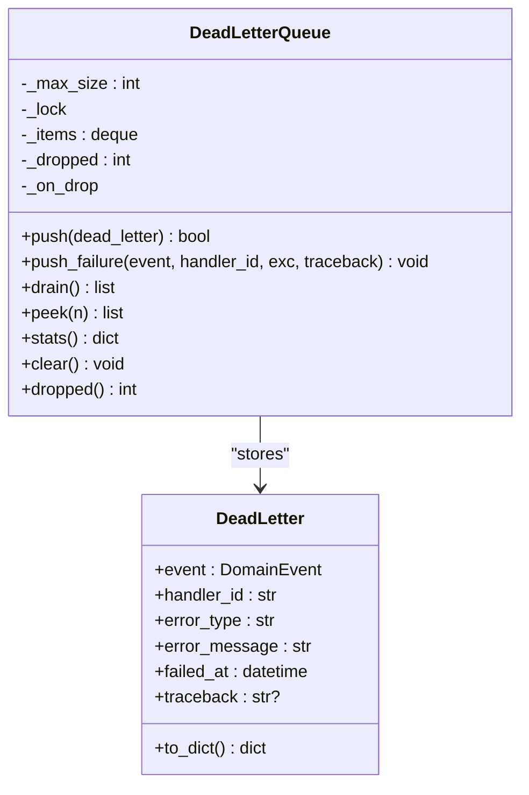

**Diagram sources**
- [dead_letter_queue.py:55-140](file://brokers/common/event_bus/dead_letter_queue.py#L55-L140)

**Section sources**
- [dead_letter_queue.py:55-140](file://brokers/common/event_bus/dead_letter_queue.py#L55-L140)

### Event Types and Payload Contracts
- EventType: Canonical enumeration of event types (market data, orders/OMS, risk/position, reconciliation, lifecycle/system, broker connectivity, scanner/strategy, etc.).
- EventPayload: Declares required and optional payload keys for each event type and notes for semantic guidance.
- make_payload: Optional validation enforcing required keys when enabled.

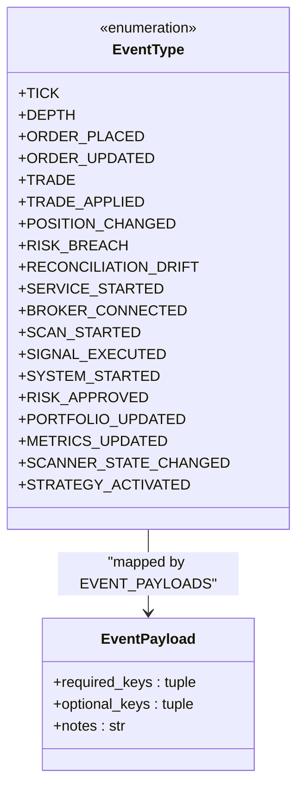

**Diagram sources**
- [event_types.py:43-376](file://brokers/common/event_bus/event_types.py#L43-L376)

**Section sources**
- [event_types.py:43-376](file://brokers/common/event_bus/event_types.py#L43-L376)

### Factory Pattern for Event Creation and Bus Selection
- AsyncEventBusFactory: Creates EventBus or AsyncEventBus based on environment variable and parameters, enabling gradual migration.
- async_publish_wrapper and AsyncPublishAdapter: Provide a uniform async publish API for both sync and async buses.

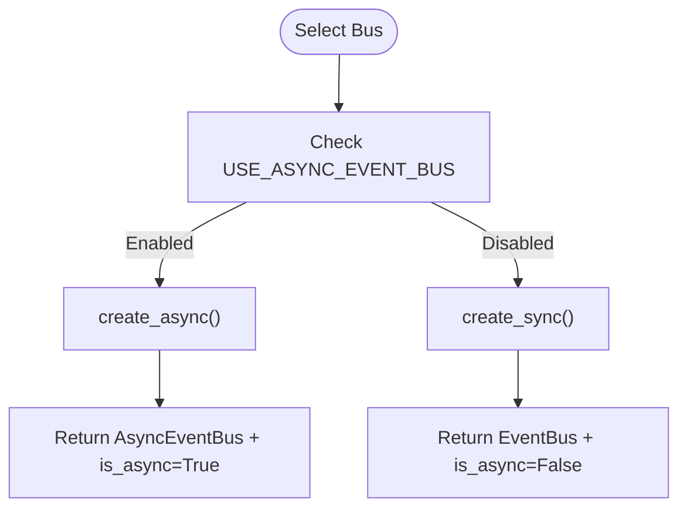

**Diagram sources**
- [factory.py:96-170](file://brokers/common/event_bus/factory.py#L96-L170)

**Section sources**
- [factory.py:71-390](file://brokers/common/event_bus/factory.py#L71-L390)

### Observer Pattern for Subscribers
- Subscribers register handlers for specific event types; EventBus snapshots handlers before dispatch to avoid concurrent mutation issues.
- Handlers can be sync or async (in AsyncEventBus); failures are isolated and captured.

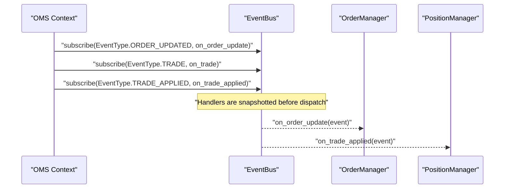

**Diagram sources**
- [context.py:149-157](file://brokers/common/oms/context.py#L149-L157)
- [event_bus.py:362-375](file://brokers/common/event_bus/event_bus.py#L362-L375)

**Section sources**
- [context.py:149-157](file://brokers/common/oms/context.py#L149-L157)
- [event_bus.py:362-375](file://brokers/common/event_bus/event_bus.py#L362-L375)

### Event Lifecycle: Publication to Delivery
- Publication: EventBus injects correlation ID, assigns sequence number (live mode), persists to EventLog, snapshots subscribers, and dispatches.
- Delivery: Handlers receive DomainEvent; failures are logged, counted, and dead-lettered.
- Replay: EventLog supports replay with deserialization and optional filtering by time/type.

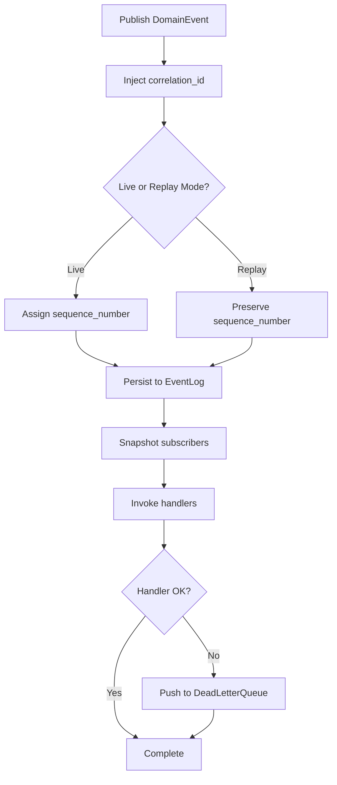

**Diagram sources**
- [event_bus.py:298-420](file://brokers/common/event_bus/event_bus.py#L298-L420)
- [event_log.py:200-249](file://brokers/common/event_log.py#L200-L249)

**Section sources**
- [event_bus.py:298-420](file://brokers/common/event_bus/event_bus.py#L298-L420)
- [event_log.py:200-249](file://brokers/common/event_log.py#L200-L249)

### Integration with Broker Adapters
- Broker adapters publish canonical event types (e.g., ORDER_UPDATED, TRADE) using DomainEvent.now.
- Dhan adapters demonstrate publishing TRADE events upon fills and ORDER_UPDATED events upon order updates.

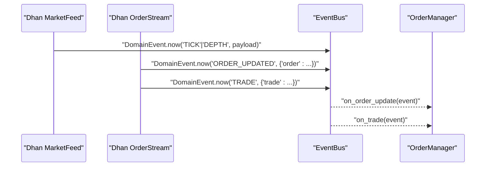

**Diagram sources**
- [websocket.py:910-1023](file://brokers/dhan/websocket.py#L910-L1023)
- [order_manager.py:515-533](file://brokers/common/oms/order_manager.py#L515-L533)

**Section sources**
- [websocket.py:910-1023](file://brokers/dhan/websocket.py#L910-L1023)
- [order_manager.py:515-533](file://brokers/common/oms/order_manager.py#L515-L533)

## Dependency Analysis
- EventBus depends on EventLog (persistence), DeadLetterQueue (failure capture), EventMetrics (observability), AlertingEngine (alerting), and correlation context.
- AsyncEventBus depends on EventMetrics and DeadLetterQueue; optionally uses AlertingEngine.
- Event types and payload contracts are shared across both buses and publishers.
- OMS wiring subscribes to canonical event types for order and trade processing.

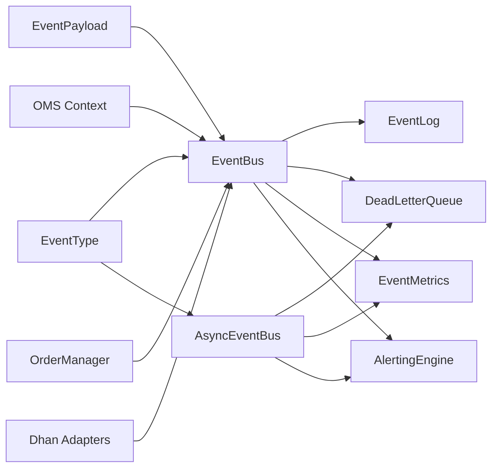

**Diagram sources**
- [event_bus.py:175-203](file://brokers/common/event_bus/event_bus.py#L175-L203)
- [async_event_bus.py:161-170](file://brokers/common/event_bus/async_event_bus.py#L161-L170)
- [event_types.py:43-141](file://brokers/common/event_bus/event_types.py#L43-L141)
- [context.py:149-157](file://brokers/common/oms/context.py#L149-L157)
- [order_manager.py:515-533](file://brokers/common/oms/order_manager.py#L515-L533)
- [websocket.py:910-1023](file://brokers/dhan/websocket.py#L910-L1023)

**Section sources**
- [event_bus.py:175-203](file://brokers/common/event_bus/event_bus.py#L175-L203)
- [async_event_bus.py:161-170](file://brokers/common/event_bus/async_event_bus.py#L161-L170)
- [event_types.py:43-141](file://brokers/common/event_bus/event_types.py#L43-L141)
- [context.py:149-157](file://brokers/common/oms/context.py#L149-L157)
- [order_manager.py:515-533](file://brokers/common/oms/order_manager.py#L515-L533)
- [websocket.py:910-1023](file://brokers/dhan/websocket.py#L910-L1023)

## Performance Considerations
- Synchronous EventBus: Lock-protected dispatch; handlers should be fast and non-blocking. Use AsyncEventBus for high-throughput scenarios.
- AsyncEventBus backpressure: Tune maxsize and backpressure policy to balance throughput and memory usage.
- Buffered EventLog: Use BufferedEventLog for higher write throughput with controlled flush thresholds and intervals.
- Metrics and alerting: Use timestamped counters for rate-based alerting to detect anomalies early.
- Memory: DeadLetterQueue is bounded; monitor dropped counts. Tests confirm bounded memory growth under sustained load.

**Section sources**
- [async_event_bus.py:71-102](file://brokers/common/event_bus/async_event_bus.py#L71-L102)
- [event_log.py:275-431](file://brokers/common/event_log.py#L275-L431)
- [event_metrics.py:106-166](file://brokers/common/observability/event_metrics.py#L106-L166)
- [test_memory_leaks.py:484-497](file://tests/regression/test_memory_leaks.py#L484-L497)

## Troubleshooting Guide
Common issues and remedies:
- Handler failures: Inspect DeadLetterQueue for captured failures; use peek/drain to investigate and replay after fixes.
- Missing DLQ: EventBus logs a loud error when a handler fails without a DLQ attached—configure DLQ in production.
- Backpressure: AsyncEventBus queue full; adjust maxsize or policy (BLOCK/DROP/ERROR).
- Subscription leaks: Use unsubscribe tokens and clear() for tests; verify subscriber counts.
- Replay integrity: Ensure replay_mode preserves timestamps and sequence numbers; use EventLog replay for crash recovery.

Operational tips:
- Enable AlertingEngine with default rules to track error rates, DLQ growth, and log failures.
- Use EventMetrics snapshot and rate calculations to diagnose bottlenecks and spikes.
- Verify canonical event types in tests to catch typos and unknown types.

**Section sources**
- [event_bus.py:382-420](file://brokers/common/event_bus/event_bus.py#L382-L420)
- [dead_letter_queue.py:109-140](file://brokers/common/event_bus/dead_letter_queue.py#L109-L140)
- [async_event_bus.py:390-414](file://brokers/common/event_bus/async_event_bus.py#L390-L414)
- [test_event_bus.py:173-193](file://brokers/common/event_bus/tests/test_event_bus.py#L173-L193)
- [test_event_bus_integration.py:46-84](file://brokers/common/event_bus/tests/test_event_bus_integration.py#L46-L84)
- [alerting.py:511-594](file://brokers/common/observability/alerting.py#L511-L594)
- [event_metrics.py:167-196](file://brokers/common/observability/event_metrics.py#L167-L196)

## Conclusion
The event system provides a robust, thread-safe, and observable foundation for the trading platform. It balances reliability (DeadLetterQueue, EventLog, AlertingEngine) with performance (AsyncEventBus backpressure, Buffered EventLog) and maintainability (canonical event types, payload contracts). The factory and adapter patterns enable smooth migration and consistent integration across broker adapters and the OMS.

## Appendices

### Practical Examples

- Subscribing to canonical event types:
  - Subscribe to ORDER_UPDATED, TRADE, and TRADE_APPLIED in OMS context.
  - Reference: [context.py:149-157](file://brokers/common/oms/context.py#L149-L157)

- Publishing TRADE and ORDER_UPDATED from broker adapters:
  - Emit DomainEvent.now with proper payload and correlation ID.
  - Reference: [websocket.py:910-1023](file://brokers/dhan/websocket.py#L910-L1023)

- Using AsyncEventBus with backpressure:
  - Configure maxsize and policy; start/stop worker; publish asynchronously.
  - Reference: [async_event_bus.py:215-280](file://brokers/common/event_bus/async_event_bus.py#L215-L280)

- Creating a uniform async publish interface:
  - Wrap EventBus or AsyncEventBus with AsyncPublishAdapter.
  - Reference: [factory.py:261-382](file://brokers/common/event_bus/factory.py#L261-L382)

### Extending the Event System
- Add a new event type:
  - Extend EventType and EventPayload contract; update EVENT_PAYLOADS.
  - Reference: [event_types.py:43-376](file://brokers/common/event_bus/event_types.py#L43-L376)

- Create a custom handler:
  - Subscribe to the new event type; implement handler logic; ensure idempotency where required.
  - Reference: [context.py:149-157](file://brokers/common/oms/context.py#L149-L157)

- Integrate with OMS:
  - Wire handlers in OMS initialization; ensure handlers are fast and non-blocking.
  - Reference: [order_manager.py:515-533](file://brokers/common/oms/order_manager.py#L515-L533)

- Broker adapter integration:
  - Publish canonical event types; use DomainEvent.now with symbol/source/correlation_id.
  - Reference: [websocket.py:910-1023](file://brokers/dhan/websocket.py#L910-L1023)