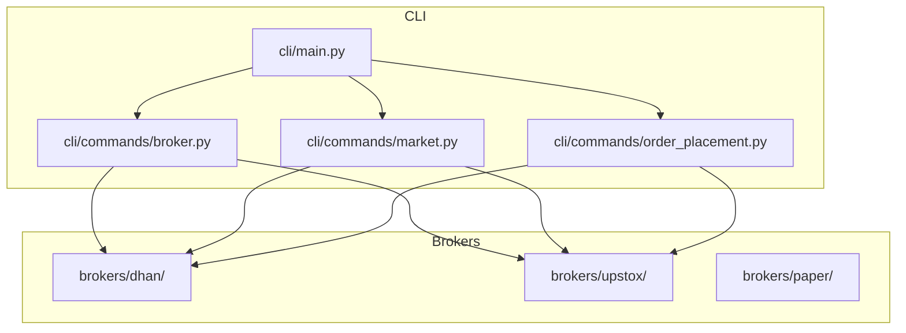
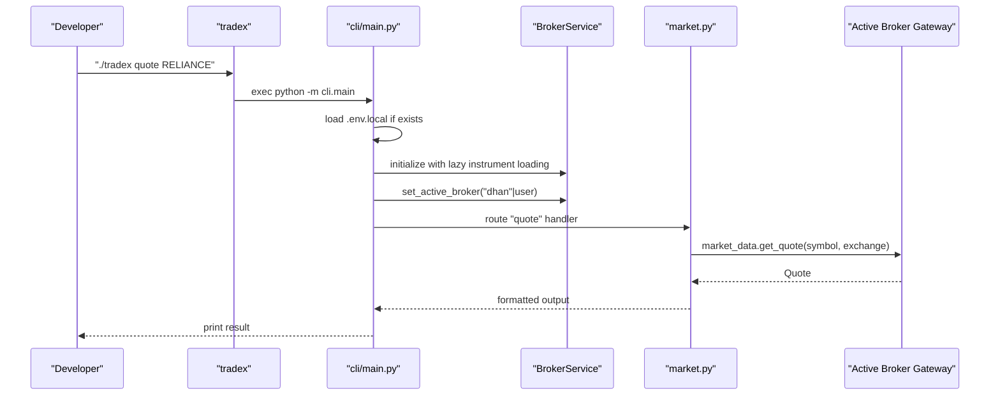
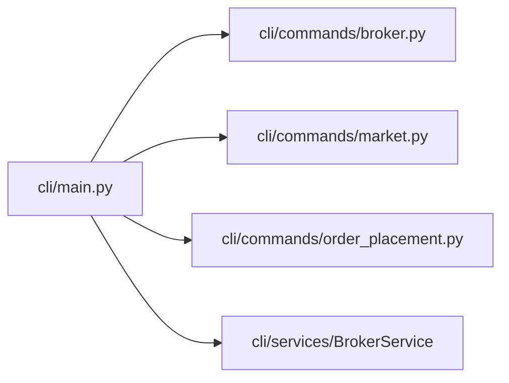

# Getting Started

<cite>
**Referenced Files in This Document**
- [README.md](file://README.md)
- [CONTRIBUTING.md](file://CONTRIBUTING.md)
- [pyproject.toml](file://pyproject.toml)
- [requirements.txt](file://requirements.txt)
- [tradex](file://tradex)
- [cli/main.py](file://cli/main.py)
- [cli/commands/broker.py](file://cli/commands/broker.py)
- [cli/commands/market.py](file://cli/commands/market.py)
- [cli/commands/order_placement.py](file://cli/commands/order_placement.py)
- [config/dhan-local.properties.example](file://config/dhan-local.properties.example)
- [config/dhan-sandbox.properties.example](file://config/dhan-sandbox.properties.example)
- [config/upstox-live.properties.example](file://config/upstox-live.properties.example)
- [config/upstox-sandbox.properties.example](file://config/upstox-sandbox.properties.example)
</cite>

## Table of Contents
1. [Introduction](#introduction)
2. [Project Structure](#project-structure)
3. [Core Components](#core-components)
4. [Architecture Overview](#architecture-overview)
5. [Detailed Component Analysis](#detailed-component-analysis)
6. [Dependency Analysis](#dependency-analysis)
7. [Performance Considerations](#performance-considerations)
8. [Troubleshooting Guide](#troubleshooting-guide)
9. [Conclusion](#conclusion)
10. [Appendices](#appendices)

## Introduction
This guide helps you quickly install TradeXV2, configure broker credentials for DhanHQ and Upstox, and begin using the CLI for diagnostics, market data, and order operations. It also covers development workflow, testing, code quality tools, and pre-commit hooks. The instructions are beginner-friendly while enabling experienced developers to become productive rapidly.

## Project Structure
TradeXV2 is organized into modular packages:
- brokers/: broker adapters (DhanHQ, Upstox, Paper) and common abstractions
- cli/: CLI/TUI entrypoint and commands
- analytics/, datalake/, tests/, scripts/: analytics, data lake, tests, and utilities
- config/: property templates for broker configurations
- Frontend and backend assets for the web UI (archive/frontend-v1-2026-06-14/ and frontend/)

**Diagram sources**
- [cli/main.py:33-61](file://cli/main.py#L33-L61)
- [cli/commands/broker.py:11-28](file://cli/commands/broker.py#L11-L28)
- [cli/commands/market.py:33-77](file://cli/commands/market.py#L33-L77)
- [cli/commands/order_placement.py:31-150](file://cli/commands/order_placement.py#L31-L150)

**Section sources**
- [README.md:50-83](file://README.md#L50-L83)

## Core Components
- Launcher: The tradex script invokes the CLI entrypoint inside the virtual environment.
- CLI entrypoint: Initializes logging, loads .env.local, registers commands, and routes to handlers.
- Broker commands: List and switch active broker connections.
- Market commands: Quote, depth, option chain, futures, historical, and streaming.
- Order commands: Place, cancel, modify, and batch orders via the central OMS.

Key behaviors:
- Environment loading: On startup, the CLI attempts to load .env.local if present.
- Single composition root: BrokerService composes gateways and services.
- Unified exit codes and JSON output: Commands return structured results and exit codes.

**Section sources**
- [tradex:1-5](file://tradex#L1-L5)
- [cli/main.py:20-32](file://cli/main.py#L20-L32)
- [cli/main.py:477-585](file://cli/main.py#L477-L585)
- [cli/commands/broker.py:31-46](file://cli/commands/broker.py#L31-L46)
- [cli/commands/market.py:488-523](file://cli/commands/market.py#L488-L523)
- [cli/commands/order_placement.py:31-150](file://cli/commands/order_placement.py#L31-L150)

## Architecture Overview
The CLI orchestrates broker gateways behind a common interface. Commands access market data, options, futures, and order management through the active broker selected by the user.

**Diagram sources**
- [tradex:1-5](file://tradex#L1-L5)
- [cli/main.py:28-32](file://cli/main.py#L28-L32)
- [cli/main.py:534-556](file://cli/main.py#L534-L556)
- [cli/commands/market.py:33-77](file://cli/commands/market.py#L33-L77)

## Detailed Component Analysis

### Installation and Environment Setup
Follow these steps to prepare your environment:

Prerequisites
- Python 3.10+ and Git

Install and activate the environment
- Option A: Use the provided virtualenv shipped with the repository
  - Activate the environment and run the CLI directly
- Option B: Create a fresh virtualenv and install editable dev dependencies
  - Create and activate a virtualenv
  - Install the project in development mode with optional dependencies

Install pre-commit hooks
- Install pre-commit and run the hook installer

Notes
- The tradex launcher hardcodes the venv’s Python interpreter and runs the CLI module.
- The on-disk .venv symlinked to miniconda does not ship pip or the full dependency set; use venv/ for running smoke tests until rebuilt.

**Section sources**
- [README.md:87-118](file://README.md#L87-L118)
- [CONTRIBUTING.md:11-23](file://CONTRIBUTING.md#L11-L23)
- [tradex:1-5](file://tradex#L1-L5)

### Dependency Management
- Project metadata and runtime dependencies are defined in pyproject.toml.
- Optional development dependencies (pytest, ruff, mypy, pre-commit, bandit, pip-audit) are declared under dev extras.
- requirements.txt lists broker module dependencies for quick installs.

Recommendation
- Prefer installing the project in editable mode with dev extras for local development.

**Section sources**
- [pyproject.toml:5-35](file://pyproject.toml#L5-L35)
- [requirements.txt:1-27](file://requirements.txt#L1-L27)

### Development Workflow Using the Launcher
- Use ./tradex to launch the CLI within the configured virtual environment.
- The launcher executes the CLI entrypoint module and passes through arguments.
- Typical commands include broker diagnostics, market data retrieval, and order operations.

**Section sources**
- [README.md:149-166](file://README.md#L149-L166)
- [tradex:1-5](file://tradex#L1-L5)
- [cli/main.py:121-177](file://cli/main.py#L121-L177)

### Configuring Broker Credentials
Set up credentials for DhanHQ and Upstox using the provided property templates. Copy each example to a git-ignored file and fill in your keys.

Dhan
- Local/live credentials: copy config/dhan-local.properties.example to config/dhan-local.properties
- Sandbox credentials: copy config/dhan-sandbox.properties.example to config/dhan-sandbox.properties

Upstox
- Live credentials: copy config/upstox-live.properties.example to config/upstox-live.properties
- Sandbox credentials: copy config/upstox-sandbox.properties.example to config/upstox-sandbox.properties

Notes
- The CLI loads .env.local at startup if present. Keep sensitive keys in .env.local and do not commit them.
- The broker property files complement .env.local for broker-specific configuration.

**Section sources**
- [config/dhan-local.properties.example:1-36](file://config/dhan-local.properties.example#L1-L36)
- [config/dhan-sandbox.properties.example:1-24](file://config/dhan-sandbox.properties.example#L1-L24)
- [config/upstox-live.properties.example:1-27](file://config/upstox-live.properties.example#L1-L27)
- [config/upstox-sandbox.properties.example:1-8](file://config/upstox-sandbox.properties.example#L1-L8)
- [cli/main.py:28-32](file://cli/main.py#L28-L32)

### Running Basic CLI Commands
Common first-time operations:

- Broker connectivity
  - List broker connections and statuses
  - Switch active broker if needed

- Market data
  - View a quote for a symbol
  - View market depth
  - Fetch option chain and futures contracts
  - Retrieve historical candles
  - Stream live ticks

- Orders
  - Place a single order with type, price, exchange, and product
  - Cancel an existing order
  - Modify an order’s price or quantity
  - Place multiple orders from a CSV

- Diagnostics
  - Run doctor checks for connectivity and health

Output modes
- Use --json for machine-readable output
- Use --verbose for debug logs
- Use --timing to measure command duration

**Section sources**
- [cli/commands/broker.py:31-46](file://cli/commands/broker.py#L31-L46)
- [cli/commands/market.py:488-523](file://cli/commands/market.py#L488-L523)
- [cli/commands/order_placement.py:31-150](file://cli/commands/order_placement.py#L31-L150)
- [cli/main.py:121-177](file://cli/main.py#L121-L177)
- [cli/main.py:435-474](file://cli/main.py#L435-L474)

### Testing Setup
Quick unit and contract tests
- Run unit and contract tests excluding integration, sandbox, and live_readonly markers

Full test suite
- Includes integration tests requiring Dhan credentials

Coverage reporting
- Generate coverage for brokers, cli, datalake, and chaos tests with branch coverage and HTML report

CLI endpoint matrix
- Offline smoke tests for registered CLI endpoints

Replay determinism
- Verify event replay determinism

**Section sources**
- [README.md:119-137](file://README.md#L119-L137)
- [pyproject.toml:47-71](file://pyproject.toml#L47-L71)
- [pyproject.toml:73-91](file://pyproject.toml#L73-L91)

### Code Quality Tools and Pre-commit Hooks
- Lint and format: ruff check and ruff format --check
- Type checking: mypy across brokers/, cli/, datalake/
- Pre-commit: install hooks to enforce lint/format/type checks locally before commits

**Section sources**
- [README.md:139-146](file://README.md#L139-L146)
- [CONTRIBUTING.md:23-23](file://CONTRIBUTING.md#L23-L23)
- [pyproject.toml:114-152](file://pyproject.toml#L114-L152)
- [pyproject.toml:93-108](file://pyproject.toml#L93-L108)

## Dependency Analysis
The CLI depends on broker gateways and services. The BrokerService composes gateways and manages lifecycle. Market and order commands rely on the active broker gateway.

**Diagram sources**
- [cli/main.py:33-61](file://cli/main.py#L33-L61)
- [cli/commands/broker.py:8-8](file://cli/commands/broker.py#L8-L8)
- [cli/commands/market.py:14-14](file://cli/commands/market.py#L14-L14)
- [cli/commands/order_placement.py:23-26](file://cli/commands/order_placement.py#L23-L26)

**Section sources**
- [cli/main.py:534-556](file://cli/main.py#L534-L556)

## Performance Considerations
- Use --timing to measure command execution time.
- Prefer JSON output (--json) for automation and scripting.
- Limit verbose logging to debugging sessions; use --verbose only when diagnosing issues.

[No sources needed since this section provides general guidance]

## Troubleshooting Guide
Common setup and runtime issues:

- Missing or invalid credentials
  - Ensure .env.local and broker property files are present and filled correctly.
  - Confirm the active broker matches your credentials.

- Broker gateway not available
  - Use broker list and broker use to select the intended broker.
  - Re-run doctor checks to diagnose connectivity.

- Market data or order commands fail
  - Verify symbol/exchange mapping and instrument availability.
  - Check --verbose logs for detailed error traces.

- Coverage and lint failures
  - Run ruff check, ruff format --check, and mypy to address issues locally before committing.

**Section sources**
- [cli/commands/broker.py:31-46](file://cli/commands/broker.py#L31-L46)
- [cli/main.py:28-32](file://cli/main.py#L28-L32)
- [README.md:139-146](file://README.md#L139-L146)

## Conclusion
You are ready to install TradeXV2, configure broker credentials, and use the CLI for diagnostics, market data, and order operations. Follow the testing and code quality workflows to maintain a healthy development environment. Refer to the troubleshooting section for common issues.

[No sources needed since this section summarizes without analyzing specific files]

## Appendices

### Appendix A: Step-by-Step First-Time Checklist
- Install prerequisites: Python 3.10+, Git
- Clone repository and enter directory
- Activate virtual environment (venv/ or .venv)
- Install dev dependencies with optional extras
- Install pre-commit hooks
- Configure Dhan and Upstox credentials using the provided property templates
- Create .env.local with secrets (do not commit)
- Launch CLI with ./tradex and run doctor checks
- Try market data commands (quote, depth, option-chain, futures, historical, stream)
- Place a test order (sandbox recommended) and verify status

**Section sources**
- [README.md:87-118](file://README.md#L87-L118)
- [README.md:119-166](file://README.md#L119-L166)
- [config/dhan-local.properties.example:1-36](file://config/dhan-local.properties.example#L1-L36)
- [config/dhan-sandbox.properties.example:1-24](file://config/dhan-sandbox.properties.example#L1-L24)
- [config/upstox-live.properties.example:1-27](file://config/upstox-live.properties.example#L1-L27)
- [config/upstox-sandbox.properties.example:1-8](file://config/upstox-sandbox.properties.example#L1-L8)
- [cli/main.py:28-32](file://cli/main.py#L28-L32)