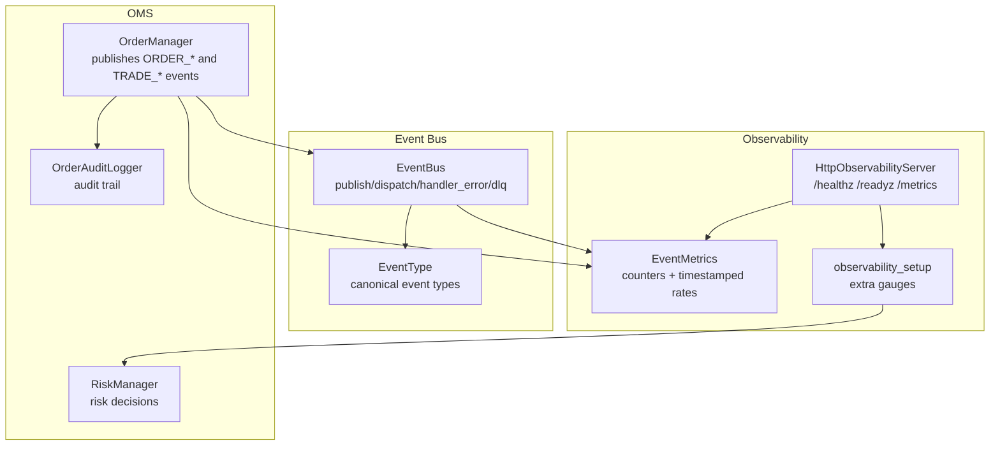
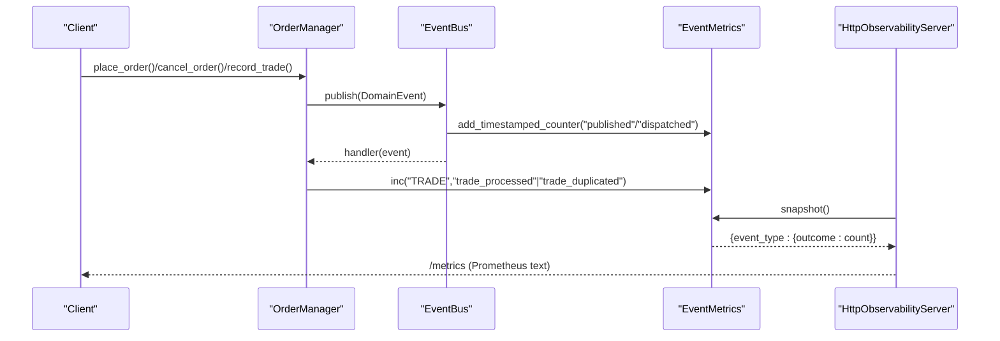
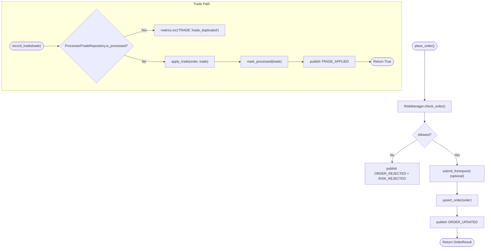
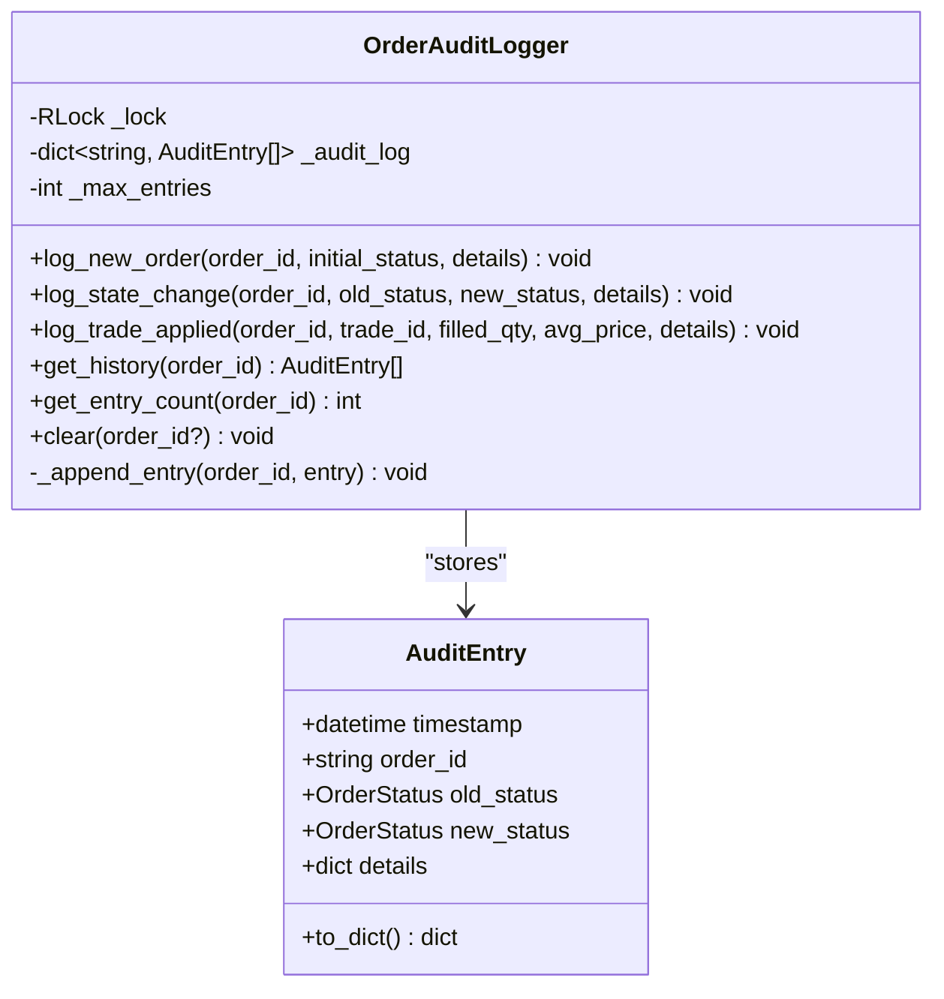
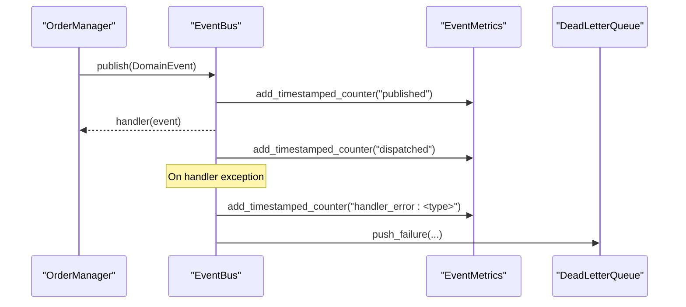
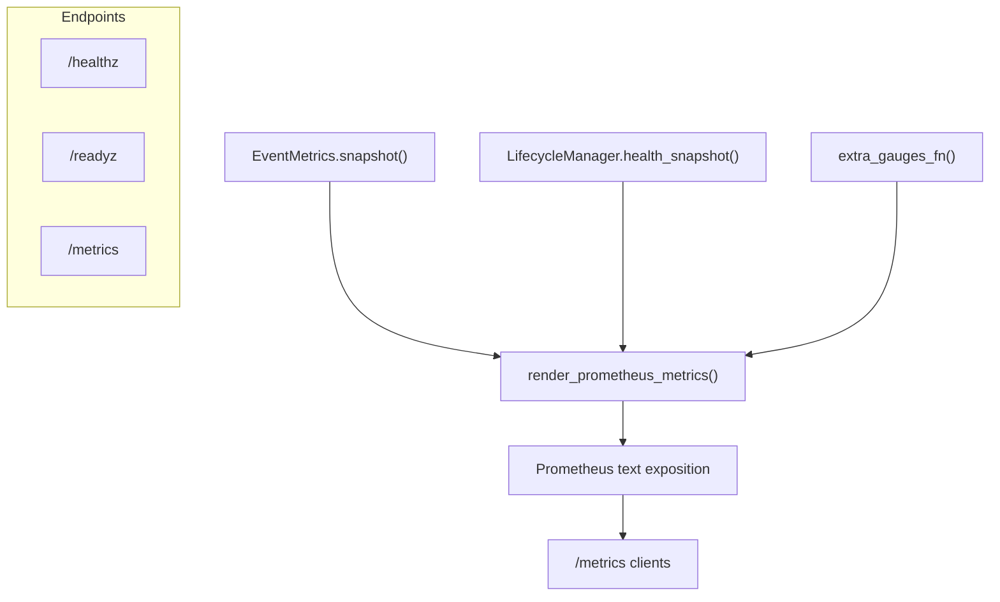
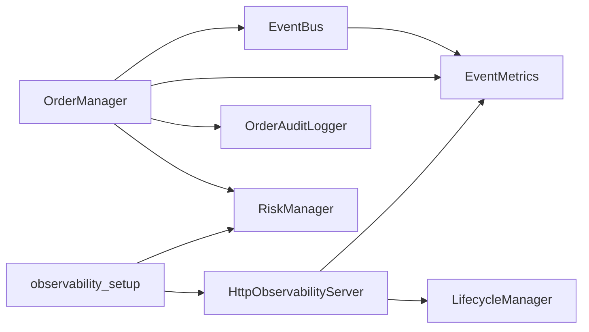

# OMS Observability and Monitoring

<cite>
**Referenced Files in This Document**
- [order_manager.py](file://brokers/common/oms/order_manager.py)
- [order_audit_logger.py](file://brokers/common/oms/order_audit_logger.py)
- [event_metrics.py](file://brokers/common/observability/event_metrics.py)
- [http_server.py](file://brokers/common/observability/http_server.py)
- [observability.py](file://brokers/common/core/constants/observability.py)
- [event_bus.py](file://brokers/common/event_bus/event_bus.py)
- [event_types.py](file://brokers/common/event_bus/event_types.py)
- [factory.py](file://brokers/common/event_bus/factory.py)
- [risk_manager.py](file://brokers/common/oms/risk_manager.py)
- [observability_setup.py](file://cli/services/observability_setup.py)
</cite>

## Table of Contents
1. [Introduction](#introduction)
2. [Project Structure](#project-structure)
3. [Core Components](#core-components)
4. [Architecture Overview](#architecture-overview)
5. [Detailed Component Analysis](#detailed-component-analysis)
6. [Dependency Analysis](#dependency-analysis)
7. [Performance Considerations](#performance-considerations)
8. [Troubleshooting Guide](#troubleshooting-guide)
9. [Conclusion](#conclusion)
10. [Appendices](#appendices)

## Introduction
This document describes the observability and monitoring systems for the Order Management System (OMS). It covers:
- Event publishing for ORDER_PLACED, ORDER_UPDATED, ORDER_CANCELLED, TRADE_APPLIED, and related risk/order lifecycle events
- Audit logging via OrderAuditLogger for a complete trail of order and trade activity
- Metrics collection for trade processing rates, duplicate trade detection, and order rejection statistics
- HTTP observability endpoints (/healthz, /readyz, /metrics) for production monitoring and health checking
- Event bus integration for real-time order and trade event streaming
- Practical monitoring and debugging guidance, including event replay and integration with external monitoring systems

## Project Structure
The observability stack spans several modules:
- OMS core: OrderManager publishes domain events and records audit trails
- Event bus: EventBus distributes events synchronously and tracks handler outcomes
- Metrics: EventMetrics maintains counters and timestamped metrics for alerting
- HTTP server: HttpObservabilityServer exposes health and metrics endpoints
- CLI integration: observability_setup wires OMS gauges and registers the HTTP server

**Diagram sources**
- [order_manager.py:93-527](file://brokers/common/oms/order_manager.py#L93-L527)
- [order_audit_logger.py:65-251](file://brokers/common/oms/order_audit_logger.py#L65-L251)
- [event_bus.py:118-420](file://brokers/common/event_bus/event_bus.py#L118-L420)
- [event_types.py:43-140](file://brokers/common/event_bus/event_types.py#L43-L140)
- [event_metrics.py:35-196](file://brokers/common/observability/event_metrics.py#L35-L196)
- [http_server.py:133-427](file://brokers/common/observability/http_server.py#L133-L427)
- [observability_setup.py:120-178](file://cli/services/observability_setup.py#L120-L178)

**Section sources**
- [order_manager.py:93-527](file://brokers/common/oms/order_manager.py#L93-L527)
- [event_bus.py:118-420](file://brokers/common/event_bus/event_bus.py#L118-L420)
- [event_metrics.py:35-196](file://brokers/common/observability/event_metrics.py#L35-L196)
- [http_server.py:133-427](file://brokers/common/observability/http_server.py#L133-L427)
- [observability.py:10-19](file://brokers/common/core/constants/observability.py#L10-L19)
- [observability_setup.py:120-178](file://cli/services/observability_setup.py#L120-L178)

## Core Components
- OrderManager: Central order lifecycle engine that publishes domain events and applies trades. It delegates state validation, audit logging, and position updates to collaborators. It increments metrics for trade processing and duplicates.
- OrderAuditLogger: Immutable audit trail for order lifecycle events, including new orders, state changes, and trade applications.
- EventBus: Synchronous event bus that tracks publish/dispatch/handler_error and dead-letter counts; integrates with EventMetrics and DeadLetterQueue.
- EventMetrics: In-process counter store with timestamped counters for rate-based alerting and snapshots for HTTP metrics export.
- HttpObservabilityServer: Exposes /healthz, /readyz, and /metrics endpoints; renders Prometheus text format combining EventMetrics, lifecycle health, and extra gauges.
- observability_setup: Collects OMS risk state, broker connectivity, reconciliation, and DLQ metrics as extra gauges for /metrics.

**Section sources**
- [order_manager.py:93-527](file://brokers/common/oms/order_manager.py#L93-L527)
- [order_audit_logger.py:65-251](file://brokers/common/oms/order_audit_logger.py#L65-L251)
- [event_bus.py:118-420](file://brokers/common/event_bus/event_bus.py#L118-L420)
- [event_metrics.py:35-196](file://brokers/common/observability/event_metrics.py#L35-L196)
- [http_server.py:133-427](file://brokers/common/observability/http_server.py#L133-L427)
- [observability_setup.py:26-117](file://cli/services/observability_setup.py#L26-L117)

## Architecture Overview
The OMS emits domain events through OrderManager, which are distributed by EventBus. EventMetrics captures publish/dispatch/handler_error and duplicate trade counts. HttpObservabilityServer aggregates metrics and lifecycle health into Prometheus metrics and serves health/readiness probes.

**Diagram sources**
- [order_manager.py:177-270](file://brokers/common/oms/order_manager.py#L177-L270)
- [order_manager.py:301-373](file://brokers/common/oms/order_manager.py#L301-L373)
- [event_bus.py:298-379](file://brokers/common/event_bus/event_bus.py#L298-L379)
- [event_metrics.py:65-105](file://brokers/common/observability/event_metrics.py#L65-L105)
- [http_server.py:238-268](file://brokers/common/observability/http_server.py#L238-L268)

## Detailed Component Analysis

### OrderManager Event Publishing and Metrics
- Event publishing:
  - ORDER_PLACED: emitted after a successful order placement
  - ORDER_UPDATED: emitted on state transitions and after trade application
  - ORDER_CANCELLED: emitted on cancellation
  - TRADE_APPLIED: emitted after a trade is accepted and applied (idempotency verified)
  - Risk events: RISK_APPROVED/RISK_REJECTED emitted around pre-trade risk checks
- Metrics:
  - Trade processing: EventMetrics.inc("TRADE","trade_processed")
  - Duplicate trade detection: EventMetrics.inc("TRADE","trade_duplicated")
- Audit logging:
  - New order, state changes, and trade applications are logged via OrderAuditLogger

**Diagram sources**
- [order_manager.py:177-270](file://brokers/common/oms/order_manager.py#L177-L270)
- [order_manager.py:301-373](file://brokers/common/oms/order_manager.py#L301-L373)
- [order_manager.py:212-243](file://brokers/common/oms/order_manager.py#L212-L243)

**Section sources**
- [order_manager.py:177-270](file://brokers/common/oms/order_manager.py#L177-L270)
- [order_manager.py:301-373](file://brokers/common/oms/order_manager.py#L301-L373)
- [order_manager.py:212-243](file://brokers/common/oms/order_manager.py#L212-L243)

### OrderAuditLogger Audit Trail
- Immutable AuditEntry model with timestamp, order_id, old/new status, and details
- Thread-safe logging of:
  - New orders (initial status)
  - State changes (e.g., OPEN → PARTIALLY_FILLED → FILLED)
  - Trade applications (filled quantity, average price, trade_id)
- History retrieval and eviction policy (max entries per order)

**Diagram sources**
- [order_audit_logger.py:30-63](file://brokers/common/oms/order_audit_logger.py#L30-L63)
- [order_audit_logger.py:65-251](file://brokers/common/oms/order_audit_logger.py#L65-L251)

**Section sources**
- [order_audit_logger.py:85-183](file://brokers/common/oms/order_audit_logger.py#L85-L183)
- [order_audit_logger.py:185-250](file://brokers/common/oms/order_audit_logger.py#L185-L250)

### Event Bus Integration and Failure Observability
- Synchronous dispatch with mandatory failure handling:
  - Handler failures are logged, counted under handler_error:<Exception>, and pushed to DeadLetterQueue
  - Publish/dispatch counters tracked in EventMetrics
- Canonical event types include ORDER_PLACED, ORDER_UPDATED, ORDER_CANCELLED, ORDER_REJECTED, TRADE, TRADE_APPLIED, and risk/system events
- Optional async bus via factory with backpressure policy and async publish wrapper

**Diagram sources**
- [event_bus.py:298-420](file://brokers/common/event_bus/event_bus.py#L298-L420)
- [event_types.py:43-140](file://brokers/common/event_bus/event_types.py#L43-L140)
- [factory.py:71-390](file://brokers/common/event_bus/factory.py#L71-L390)

**Section sources**
- [event_bus.py:118-420](file://brokers/common/event_bus/event_bus.py#L118-L420)
- [event_types.py:189-221](file://brokers/common/event_bus/event_types.py#L189-L221)
- [factory.py:96-170](file://brokers/common/event_bus/factory.py#L96-L170)

### Metrics Collection and HTTP Observability
- EventMetrics:
  - Counters for outcomes like published, dispatched, handler_ok, handler_error, dead_letter, duplicated_trade
  - Timestamped counters for rate-based alerting (e.g., error rate over 60s windows)
  - Snapshot exposed via /metrics
- HttpObservabilityServer:
  - /healthz: liveness with uptime and requests served
  - /readyz: readiness based on ManagedService health states
  - /metrics: Prometheus text exposition combining EventMetrics, lifecycle health, and extra gauges
- observability_setup:
  - Collects OMS risk gauges (daily_pnl, kill_switch, toggles, reset_count)
  - Broker connectivity gauges (market/order streams, token refresh, circuit breaker states)
  - Reconciliation and DLQ gauges
  - Registers server with LifecycleManager

**Diagram sources**
- [event_metrics.py:172-196](file://brokers/common/observability/event_metrics.py#L172-L196)
- [http_server.py:61-127](file://brokers/common/observability/http_server.py#L61-L127)
- [http_server.py:182-268](file://brokers/common/observability/http_server.py#L182-L268)
- [observability_setup.py:26-117](file://cli/services/observability_setup.py#L26-L117)

**Section sources**
- [event_metrics.py:35-196](file://brokers/common/observability/event_metrics.py#L35-L196)
- [http_server.py:133-427](file://brokers/common/observability/http_server.py#L133-L427)
- [observability.py:10-19](file://brokers/common/core/constants/observability.py#L10-L19)
- [observability_setup.py:120-178](file://cli/services/observability_setup.py#L120-L178)

### Risk Manager Observability
- RiskManager snapshots include kill_switch, daily_pnl, and counters for resets/toggles
- These are surfaced as gauges in /metrics via observability_setup

**Section sources**
- [risk_manager.py:237-257](file://brokers/common/oms/risk_manager.py#L237-L257)
- [observability_setup.py:26-117](file://cli/services/observability_setup.py#L26-L117)

## Dependency Analysis
- OrderManager depends on EventBus, EventMetrics, OrderAuditLogger, OrderPositionUpdater, and RiskManager
- EventBus depends on EventMetrics and DeadLetterQueue; integrates with AlertingEngine optionally
- HttpObservabilityServer depends on EventMetrics and LifecycleManager; collects extra gauges via observability_setup
- observability_setup depends on RiskManager and BrokerService internals to collect gauges

**Diagram sources**
- [order_manager.py:126-160](file://brokers/common/oms/order_manager.py#L126-L160)
- [event_bus.py:175-203](file://brokers/common/event_bus/event_bus.py#L175-L203)
- [http_server.py:158-174](file://brokers/common/observability/http_server.py#L158-L174)
- [observability_setup.py:141-160](file://cli/services/observability_setup.py#L141-L160)

**Section sources**
- [order_manager.py:126-160](file://brokers/common/oms/order_manager.py#L126-L160)
- [event_bus.py:175-203](file://brokers/common/event_bus/event_bus.py#L175-L203)
- [http_server.py:158-174](file://brokers/common/observability/http_server.py#L158-L174)
- [observability_setup.py:141-160](file://cli/services/observability_setup.py#L141-L160)

## Performance Considerations
- Synchronous EventBus ensures predictable latency; handler failures are counted and dead-lettered without silent swallowing
- EventMetrics uses timestamped counters to compute rates efficiently and prunes old entries to bound memory
- HttpObservabilityServer runs in a dedicated thread with its own event loop to avoid blocking the caller’s loop
- OrderManager uses fine-grained locks and immutable value objects to minimize contention

[No sources needed since this section provides general guidance]

## Troubleshooting Guide
- Monitoring order flow:
  - Subscribe to ORDER_PLACED, ORDER_UPDATED, ORDER_CANCELLED, TRADE_APPLIED on the EventBus
  - Use OrderAuditLogger.get_history(order_id) to inspect state transitions and trade applications
- Tracking trade processing performance:
  - Observe TRADE_APPLIED events and “trade_processed” counters in /metrics
  - Investigate “handler_error:*” outcomes for handler failures
- Diagnosing order lifecycle issues:
  - Check ORDER_REJECTED and RISK_REJECTED events for pre-trade reasons
  - Review audit trail for unexpected state changes
- Duplicate trade detection:
  - Monitor “trade_duplicated” counters; investigate repeated TRADE events
- Event replay:
  - Use EventBus replay_mode and sequence numbers for deterministic replay
- Production debugging:
  - Use /readyz to verify service health and readiness
  - Inspect extra gauges for broker connectivity, DLQ depth, reconciliation drift, and kill switch toggles

**Section sources**
- [event_bus.py:382-420](file://brokers/common/event_bus/event_bus.py#L382-L420)
- [order_audit_logger.py:185-200](file://brokers/common/oms/order_audit_logger.py#L185-L200)
- [http_server.py:199-236](file://brokers/common/observability/http_server.py#L199-L236)
- [observability_setup.py:26-117](file://cli/services/observability_setup.py#L26-L117)

## Conclusion
The OMS observability stack provides comprehensive visibility into order lifecycle events, trade processing, and system health. EventBus ensures robust event distribution with mandatory failure tracking, while EventMetrics and HttpObservabilityServer deliver actionable metrics and health endpoints. OrderAuditLogger offers an immutable audit trail essential for compliance and incident investigation. Together, these components enable effective monitoring, alerting, and operational diagnostics in production environments.

[No sources needed since this section summarizes without analyzing specific files]

## Appendices

### HTTP Observability Endpoints
- /healthz: Liveness probe reporting service status, uptime, and requests served
- /readyz: Readiness probe based on ManagedService health states
- /metrics: Prometheus text exposition combining EventMetrics, lifecycle health, and extra gauges

**Section sources**
- [http_server.py:182-268](file://brokers/common/observability/http_server.py#L182-L268)
- [observability.py:10-19](file://brokers/common/core/constants/observability.py#L10-L19)

### Canonical Event Types
- ORDER_PLACED, ORDER_SUBMITTED, ORDER_UPDATED, ORDER_CANCELLED, ORDER_REJECTED
- TRADE, TRADE_APPLIED
- RISK_APPROVED, RISK_REJECTED
- POSITION_CHANGED, RECONCILIATION_* events
- SYSTEM_STARTED, SYSTEM_SHUTDOWN, HEALTH_CHECK_* events

**Section sources**
- [event_types.py:43-140](file://brokers/common/event_bus/event_types.py#L43-L140)