# Order Lifecycle Management

<cite>
**Referenced Files in This Document**
- [order_manager.py](file://brokers/common/oms/order_manager.py)
- [order_state_validator.py](file://brokers/common/oms/order_state_validator.py)
- [order_audit_logger.py](file://brokers/common/oms/order_audit_logger.py)
- [order_position_updater.py](file://brokers/common/oms/order_position_updater.py)
- [risk_manager.py](file://brokers/common/oms/risk_manager.py)
- [types.py](file://brokers/common/core/types.py)
- [state_machine.py](file://brokers/common/core/state_machine.py)
- [domain.py](file://brokers/common/core/domain.py)
- [order_placement.py](file://cli/commands/order_placement.py)
- [test_order_lifecycle.py](file://tests/e2e/test_order_lifecycle.py)
- [test_e2e_order_lifecycle.py](file://brokers/common/tests/test_e2e_order_lifecycle.py)
</cite>

## Table of Contents
1. [Introduction](#introduction)
2. [Project Structure](#project-structure)
3. [Core Components](#core-components)
4. [Architecture Overview](#architecture-overview)
5. [Detailed Component Analysis](#detailed-component-analysis)
6. [Dependency Analysis](#dependency-analysis)
7. [Performance Considerations](#performance-considerations)
8. [Troubleshooting Guide](#troubleshooting-guide)
9. [Conclusion](#conclusion)
10. [Appendices](#appendices)

## Introduction
This document explains the order lifecycle management system that governs the complete journey of an order from placement to completion. It focuses on the OrderManager’s thread-safe design, immutable Order and Trade value objects, idempotent placement with correlation IDs, pre-trade risk validation, strict state transitions, and comprehensive audit logging. It also covers order modification and cancellation, broker-side coordination, and practical examples grounded in the repository’s implementation.

## Project Structure
The order lifecycle spans several modules:
- OMS core: OrderManager, OrderStateValidator, OrderAuditLogger, OrderPositionUpdater, RiskManager
- Domain model: canonical enums and value objects (Order, Trade, OrderStatus, etc.)
- CLI integration: order placement commands wired to the OMS
- Tests: end-to-end and integration tests validating lifecycle behavior

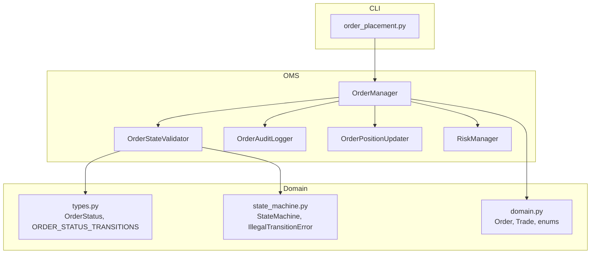

**Diagram sources**
- [order_manager.py:100-534](file://brokers/common/oms/order_manager.py#L100-L534)
- [order_state_validator.py:35-198](file://brokers/common/oms/order_state_validator.py#L35-L198)
- [order_audit_logger.py:65-251](file://brokers/common/oms/order_audit_logger.py#L65-L251)
- [order_position_updater.py:30-116](file://brokers/common/oms/order_position_updater.py#L30-L116)
- [risk_manager.py:70-258](file://brokers/common/oms/risk_manager.py#L70-L258)
- [types.py:21-263](file://brokers/common/core/types.py#L21-L263)
- [state_machine.py:53-162](file://brokers/common/core/state_machine.py#L53-L162)
- [domain.py:18-67](file://brokers/common/core/domain.py#L18-L67)
- [order_placement.py:31-383](file://cli/commands/order_placement.py#L31-L383)

**Section sources**
- [order_manager.py:1-534](file://brokers/common/oms/order_manager.py#L1-L534)
- [types.py:21-263](file://brokers/common/core/types.py#L21-L263)
- [domain.py:18-67](file://brokers/common/core/domain.py#L18-L67)
- [order_placement.py:31-383](file://cli/commands/order_placement.py#L31-L383)

## Core Components
- OrderManager: Central, thread-safe order book with idempotency, risk checks, state transitions, and event publishing. Uses immutable Order/Trade value objects and delegates validation, auditing, and position updates to collaborators.
- OrderStateValidator: Validates status transitions using a state machine and a canonical transition table.
- OrderAuditLogger: Immutable audit log entries with thread-safe storage and bounded retention.
- OrderPositionUpdater: Computes filled quantities, VWAP-style average price, and derived order status upon trade application.
- RiskManager: Pre-trade risk checks (kill switch, capital, position concentration, gross exposure, daily loss) with thread-safe state.
- Domain types: Canonical enums and value objects (OrderStatus, Order, Trade) and the transition table.

**Section sources**
- [order_manager.py:100-534](file://brokers/common/oms/order_manager.py#L100-L534)
- [order_state_validator.py:35-198](file://brokers/common/oms/order_state_validator.py#L35-L198)
- [order_audit_logger.py:65-251](file://brokers/common/oms/order_audit_logger.py#L65-L251)
- [order_position_updater.py:30-116](file://brokers/common/oms/order_position_updater.py#L30-L116)
- [risk_manager.py:70-258](file://brokers/common/oms/risk_manager.py#L70-L258)
- [types.py:21-263](file://brokers/common/core/types.py#L21-L263)

## Architecture Overview
The OrderManager orchestrates the lifecycle with a clear separation of concerns:
- Idempotent placement with correlation IDs
- Pre-trade risk validation
- State transitions validated by OrderStateValidator
- Position updates via OrderPositionUpdater
- Audit trail via OrderAuditLogger
- Events published to the EventBus for downstream consumers

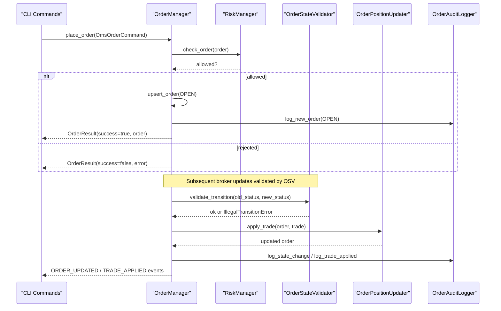

**Diagram sources**
- [order_manager.py:184-278](file://brokers/common/oms/order_manager.py#L184-L278)
- [order_state_validator.py:91-136](file://brokers/common/oms/order_state_validator.py#L91-L136)
- [order_position_updater.py:44-69](file://brokers/common/oms/order_position_updater.py#L44-L69)
- [order_audit_logger.py:85-184](file://brokers/common/oms/order_audit_logger.py#L85-L184)
- [risk_manager.py:125-158](file://brokers/common/oms/risk_manager.py#L125-L158)

## Detailed Component Analysis

### OrderManager: Thread-Safe Lifecycle Engine
- Thread-safety: Single owner of order state protected by an RLock; re-entrancy guard prevents recursive handler invocations.
- Immutable value objects: Order and Trade are updated by returning new instances.
- Idempotency: Correlation ID maps to the same order to avoid duplicates.
- Risk validation: Pre-trade checks via RiskManager; publishes risk events and rejection events.
- State transitions: Delegated to OrderStateValidator; enforces canonical transitions.
- Position updates: Delegated to OrderPositionUpdater; computes filled quantity and average price.
- Audit trail: Delegated to OrderAuditLogger; logs creation, state changes, and trade applications.
- Events: Publishes ORDER_PLACED, ORDER_UPDATED, ORDER_CANCELLED, TRADE_APPLIED via EventBus.

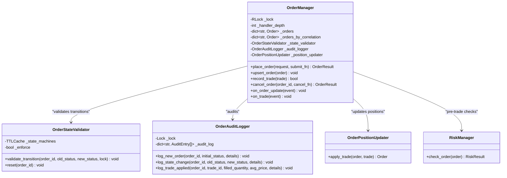

**Diagram sources**
- [order_manager.py:100-534](file://brokers/common/oms/order_manager.py#L100-L534)
- [order_state_validator.py:35-198](file://brokers/common/oms/order_state_validator.py#L35-L198)
- [order_audit_logger.py:65-251](file://brokers/common/oms/order_audit_logger.py#L65-L251)
- [order_position_updater.py:30-116](file://brokers/common/oms/order_position_updater.py#L30-L116)
- [risk_manager.py:70-258](file://brokers/common/oms/risk_manager.py#L70-L258)

**Section sources**
- [order_manager.py:100-534](file://brokers/common/oms/order_manager.py#L100-L534)

### OrderStateValidator: Canonical Transition Enforcement
- Uses a state machine with a bounded cache keyed by order_id and TTL eviction to prevent memory leaks.
- Enforce mode raises IllegalTransitionError; audit mode logs violations but continues.
- Thread-safety: Requires caller to hold a lock when accessing internal state machines.

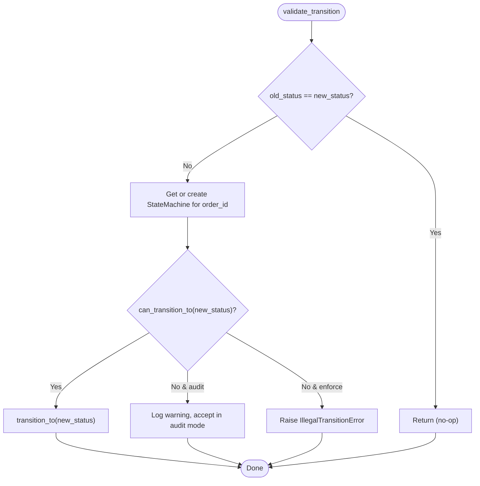

**Diagram sources**
- [order_state_validator.py:91-136](file://brokers/common/oms/order_state_validator.py#L91-L136)
- [state_machine.py:53-162](file://brokers/common/core/state_machine.py#L53-L162)
- [types.py:217-233](file://brokers/common/core/types.py#L217-L233)

**Section sources**
- [order_state_validator.py:35-198](file://brokers/common/oms/order_state_validator.py#L35-L198)
- [state_machine.py:53-162](file://brokers/common/core/state_machine.py#L53-L162)
- [types.py:217-233](file://brokers/common/core/types.py#L217-L233)

### OrderAuditLogger: Immutable Audit Trail
- Immutable AuditEntry captures timestamp, order_id, old/new statuses, and details.
- Thread-safe with its own Lock; bounded retention per order with eviction of oldest entries.
- Supports history retrieval, counts, and clearing.

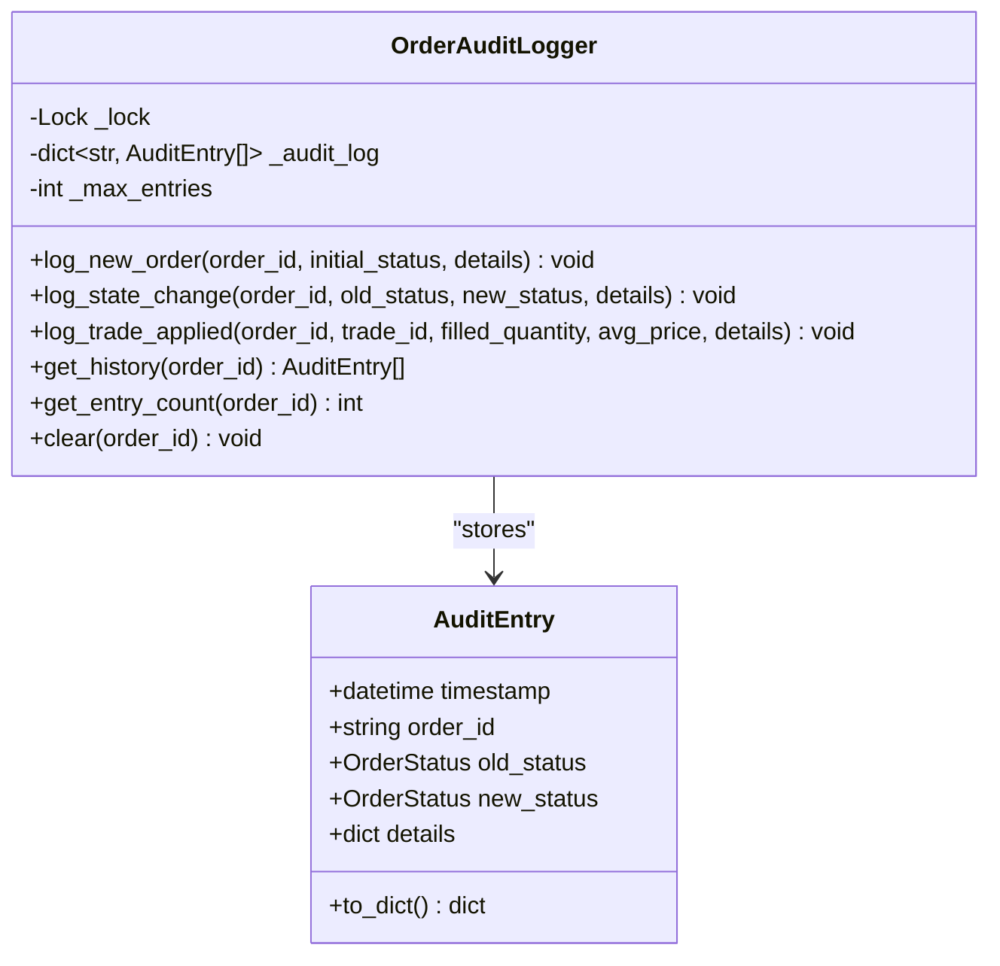

**Diagram sources**
- [order_audit_logger.py:30-251](file://brokers/common/oms/order_audit_logger.py#L30-L251)

**Section sources**
- [order_audit_logger.py:65-251](file://brokers/common/oms/order_audit_logger.py#L65-L251)

### OrderPositionUpdater: Derived State and VWAP
- Computes new filled quantity and VWAP-style average price.
- Derives status as FILLED or PARTIALLY_FILLED based on cumulative fill vs. quantity.
- Returns a new immutable Order instance.

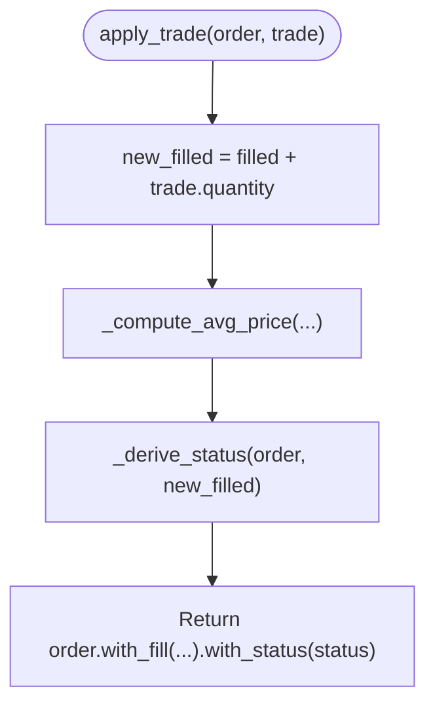

**Diagram sources**
- [order_position_updater.py:44-116](file://brokers/common/oms/order_position_updater.py#L44-L116)

**Section sources**
- [order_position_updater.py:30-116](file://brokers/common/oms/order_position_updater.py#L30-L116)

### RiskManager: Pre-Trade Validation
- Deterministic checks: kill switch, capital availability, per-symbol position concentration, gross exposure, and daily loss.
- Thread-safe state with RLock; supports both legacy capital_fn and new CapitalProvider protocol.
- Emits risk events on rejection/approval.

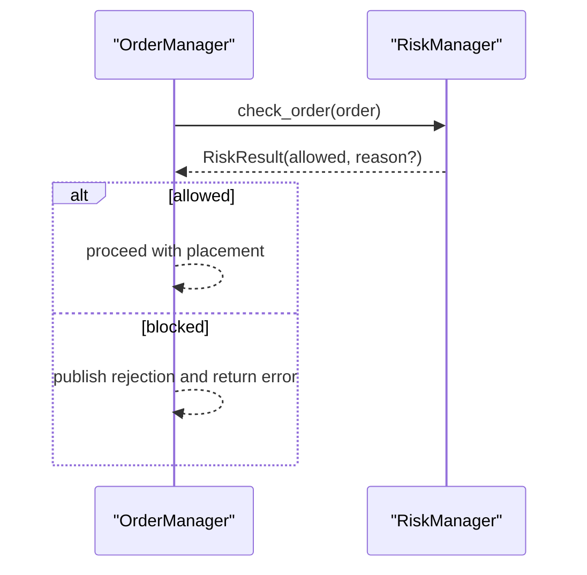

**Diagram sources**
- [risk_manager.py:125-158](file://brokers/common/oms/risk_manager.py#L125-L158)
- [order_manager.py:215-240](file://brokers/common/oms/order_manager.py#L215-L240)

**Section sources**
- [risk_manager.py:70-258](file://brokers/common/oms/risk_manager.py#L70-L258)

### Domain Types and State Machine
- OrderStatus defines canonical states and terminal detection.
- ORDER_STATUS_TRANSITIONS enumerates allowed transitions.
- StateMachine validates transitions and raises IllegalTransitionError for invalid moves.

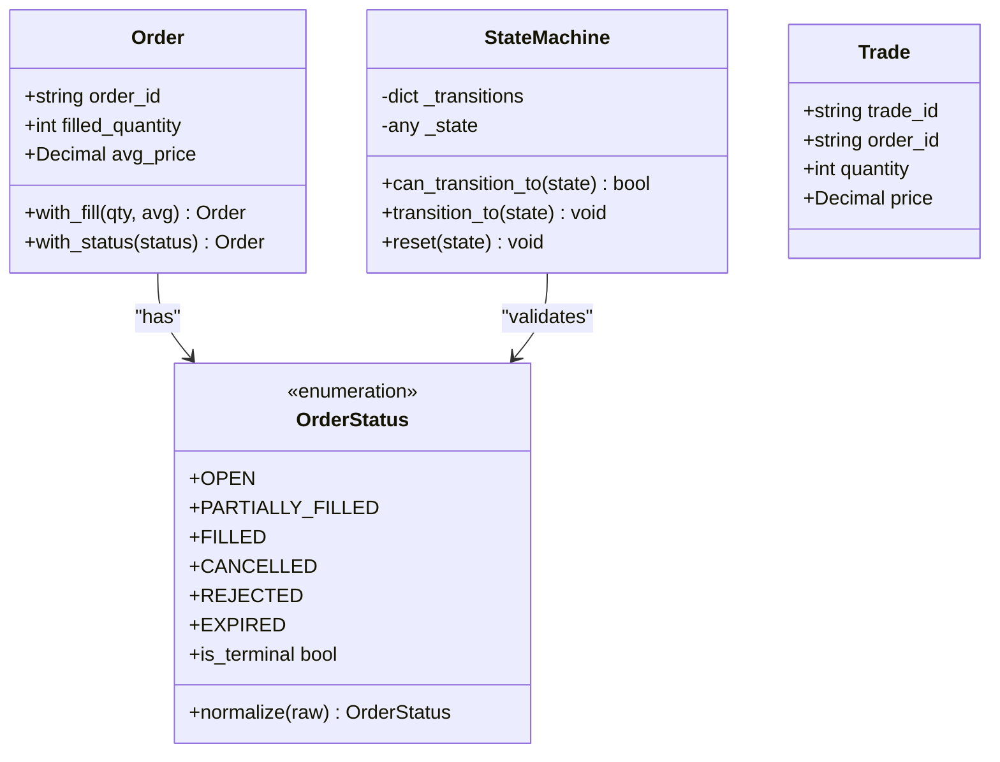

**Diagram sources**
- [types.py:21-263](file://brokers/common/core/types.py#L21-L263)
- [state_machine.py:53-162](file://brokers/common/core/state_machine.py#L53-L162)
- [domain.py:32-50](file://brokers/common/core/domain.py#L32-L50)

**Section sources**
- [types.py:21-263](file://brokers/common/core/types.py#L21-L263)
- [state_machine.py:53-162](file://brokers/common/core/state_machine.py#L53-L162)
- [domain.py:32-50](file://brokers/common/core/domain.py#L32-L50)

### Order Placement Workflow: OmsOrderCommand, Correlation ID, Risk Validation
- OmsOrderCommand encapsulates placement parameters and normalizes fields; auto-generates correlation_id if missing (with deprecation warning).
- Idempotency: OrderManager maps correlation_id to an existing order and returns it without duplication.
- Risk validation: RiskManager.check_order runs before submission; on rejection, publishes risk rejection and order rejection events.

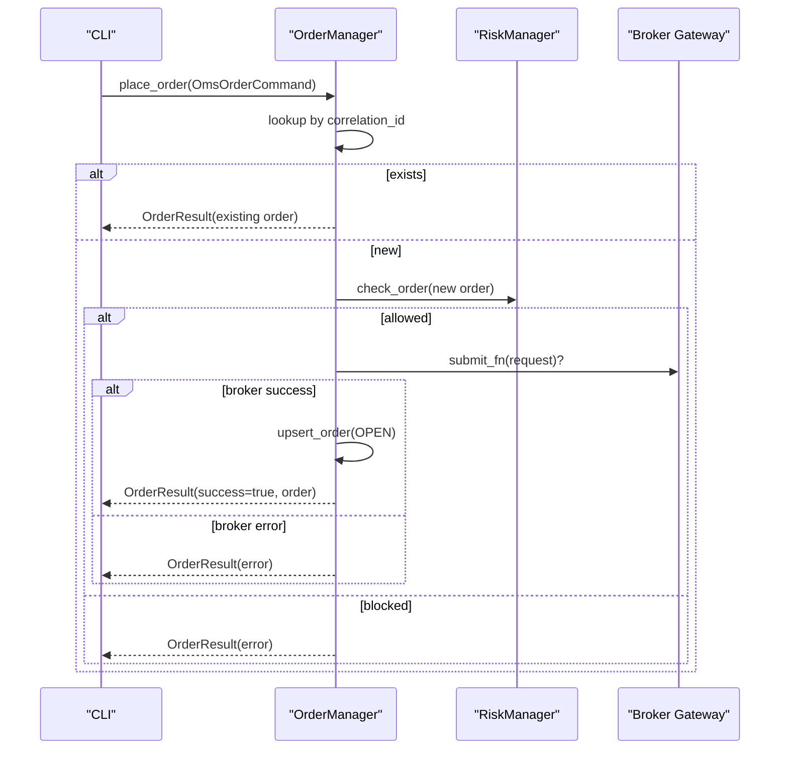

**Diagram sources**
- [order_manager.py:184-278](file://brokers/common/oms/order_manager.py#L184-L278)
- [risk_manager.py:125-158](file://brokers/common/oms/risk_manager.py#L125-L158)
- [order_placement.py:31-150](file://cli/commands/order_placement.py#L31-L150)

**Section sources**
- [order_manager.py:46-90](file://brokers/common/oms/order_manager.py#L46-L90)
- [order_manager.py:184-278](file://brokers/common/oms/order_manager.py#L184-L278)
- [risk_manager.py:125-158](file://brokers/common/oms/risk_manager.py#L125-L158)
- [order_placement.py:31-150](file://cli/commands/order_placement.py#L31-L150)

### Order State Transitions: OPEN, FILLED, PARTIALLY_FILLED, CANCELLED, REJECTED
- Canonical transitions defined in ORDER_STATUS_TRANSITIONS.
- OrderStateValidator enforces transitions; IllegalTransitionError raised when invalid.
- Terminal states halt further transitions.

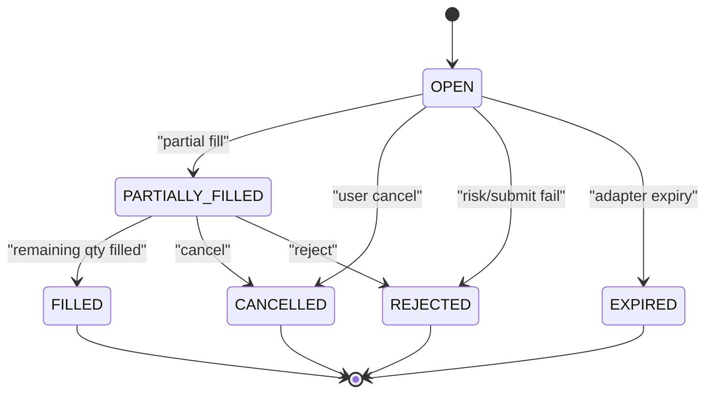

**Diagram sources**
- [types.py:217-233](file://brokers/common/core/types.py#L217-L233)
- [order_state_validator.py:91-136](file://brokers/common/oms/order_state_validator.py#L91-L136)

**Section sources**
- [types.py:217-233](file://brokers/common/core/types.py#L217-L233)
- [order_state_validator.py:91-136](file://brokers/common/oms/order_state_validator.py#L91-L136)

### Order Modification and Cancellation
- Cancellation: Local cancellation via OrderManager.cancel_order; optional broker-side cancellation via cancel_fn; publishes ORDER_CANCELLED and audits state change.
- Modification: CLI supports modifying price/quantity; delegated to broker gateway’s modify_order method.

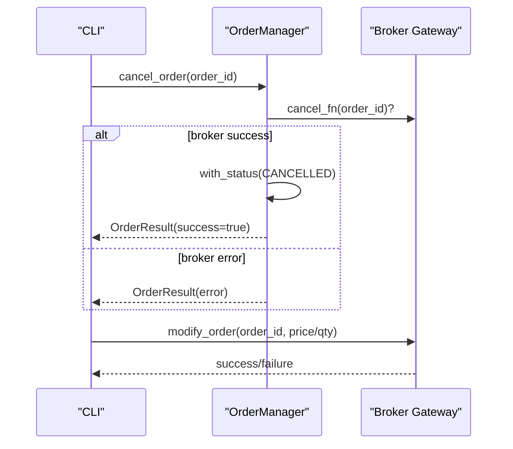

**Diagram sources**
- [order_manager.py:439-480](file://brokers/common/oms/order_manager.py#L439-L480)
- [order_placement.py:152-277](file://cli/commands/order_placement.py#L152-L277)

**Section sources**
- [order_manager.py:439-480](file://brokers/common/oms/order_manager.py#L439-L480)
- [order_placement.py:152-277](file://cli/commands/order_placement.py#L152-L277)

### Audit Trail System: OrderAuditLogger
- Logs new order creation, state changes, and trade applications with immutable entries.
- Provides history retrieval and bounded retention.

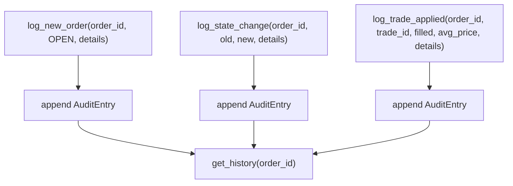

**Diagram sources**
- [order_audit_logger.py:85-184](file://brokers/common/oms/order_audit_logger.py#L85-L184)

**Section sources**
- [order_audit_logger.py:65-251](file://brokers/common/oms/order_audit_logger.py#L65-L251)

### Practical Examples
- Placing a market order with correlation ID idempotency and risk approval.
- Partial fills leading to derived PARTIALLY_FILLED and subsequent FULL FILLED.
- Rejections due to kill switch or capital constraints.
- End-to-end lifecycle verified by tests using a mock broker and EventBus.

**Section sources**
- [test_order_lifecycle.py:90-266](file://tests/e2e/test_order_lifecycle.py#L90-L266)
- [test_e2e_order_lifecycle.py:28-112](file://brokers/common/tests/test_e2e_order_lifecycle.py#L28-L112)

## Dependency Analysis
- OrderManager depends on:
  - RiskManager for pre-trade checks
  - OrderStateValidator for transition validation
  - OrderPositionUpdater for fill-derived state
  - OrderAuditLogger for audit trail
  - EventBus for publishing domain events
- OrderStateValidator depends on:
  - ORDER_STATUS_TRANSITIONS and StateMachine
- OrderPositionUpdater depends on:
  - OrderStatus and arithmetic for VWAP
- RiskManager depends on:
  - PositionManager and CapitalProvider
- CLI commands depend on OmsService to invoke OrderManager operations

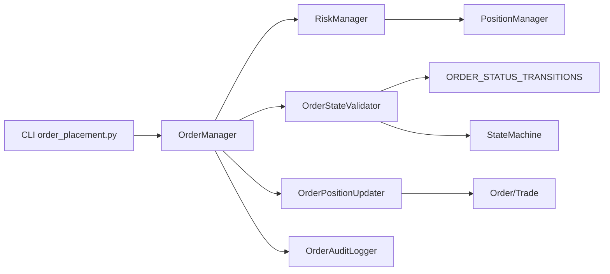

**Diagram sources**
- [order_manager.py:100-534](file://brokers/common/oms/order_manager.py#L100-L534)
- [order_state_validator.py:35-198](file://brokers/common/oms/order_state_validator.py#L35-L198)
- [order_audit_logger.py:65-251](file://brokers/common/oms/order_audit_logger.py#L65-L251)
- [order_position_updater.py:30-116](file://brokers/common/oms/order_position_updater.py#L30-L116)
- [risk_manager.py:70-258](file://brokers/common/oms/risk_manager.py#L70-L258)
- [types.py:217-233](file://brokers/common/core/types.py#L217-L233)
- [state_machine.py:53-162](file://brokers/common/core/state_machine.py#L53-L162)
- [domain.py:32-50](file://brokers/common/core/domain.py#L32-L50)
- [order_placement.py:31-383](file://cli/commands/order_placement.py#L31-L383)

**Section sources**
- [order_manager.py:100-534](file://brokers/common/oms/order_manager.py#L100-L534)
- [types.py:217-233](file://brokers/common/core/types.py#L217-L233)
- [state_machine.py:53-162](file://brokers/common/core/state_machine.py#L53-L162)
- [domain.py:32-50](file://brokers/common/core/domain.py#L32-L50)
- [order_placement.py:31-383](file://cli/commands/order_placement.py#L31-L383)

## Performance Considerations
- Thread-safety: RLock ensures single-writer access; re-entrancy guard avoids infinite recursion during internal event publishing.
- Memory: OrderStateValidator uses TTLCache to cap state machines per order; OrderAuditLogger evicts oldest entries beyond max_entries.
- Idempotency: ProcessedTradeRepository prevents duplicate trade processing, avoiding redundant position updates.
- Concurrency: Tests demonstrate safe concurrent order placement under load.

[No sources needed since this section provides general guidance]

## Troubleshooting Guide
Common issues and strategies:
- Illegal state transitions: Validate against ORDER_STATUS_TRANSITIONS; enable enforce mode to surface errors early.
- Duplicate trades: Ensure ProcessedTradeRepository is configured; duplicates are logged and ignored.
- Risk rejections: Review kill switch, capital, and exposure limits; adjust RiskConfig accordingly.
- Broker-side failures: Cancellation without local state change indicates broker error; inspect error messages.
- Audit gaps: Verify OrderAuditLogger retention and event bus subscriptions for ORDER_PLACED/ORDER_UPDATED/TRADE_APPLIED.

**Section sources**
- [order_state_validator.py:122-133](file://brokers/common/oms/order_state_validator.py#L122-L133)
- [order_manager.py:326-351](file://brokers/common/oms/order_manager.py#L326-L351)
- [risk_manager.py:132-158](file://brokers/common/oms/risk_manager.py#L132-L158)
- [order_audit_logger.py:242-251](file://brokers/common/oms/order_audit_logger.py#L242-L251)

## Conclusion
The order lifecycle system is designed around immutability, thread-safety, and strict validation. OrderManager coordinates placement, risk checks, state transitions, position updates, and audit logging through focused collaborators. The canonical transition table and state machine ensure robust lifecycle integrity, while correlation IDs and idempotency protect against duplicate submissions. The design supports broker-side coordination and comprehensive observability via events and audit logs.

[No sources needed since this section summarizes without analyzing specific files]

## Appendices

### Example Scenarios and References
- Placing a market order and verifying position increases after a fill:
  - [test_order_lifecycle.py:112-135](file://tests/e2e/test_order_lifecycle.py#L112-L135)
- Idempotent fill behavior preventing double counting:
  - [test_order_lifecycle.py:136-157](file://tests/e2e/test_order_lifecycle.py#L136-L157)
- Kill switch blocking order placement:
  - [test_order_lifecycle.py:158-177](file://tests/e2e/test_order_lifecycle.py#L158-L177)
- Full lifecycle from placement to filled position:
  - [test_order_lifecycle.py:237-266](file://tests/e2e/test_order_lifecycle.py#L237-L266)
- Live broker end-to-end flows (place/status/cancel/modify):
  - [test_e2e_order_lifecycle.py:36-81](file://brokers/common/tests/test_e2e_order_lifecycle.py#L36-L81)