# Order Management System

<cite>
**Referenced Files in This Document**
- [order_manager.py](file://brokers/common/oms/order_manager.py)
- [risk_manager.py](file://brokers/common/oms/_internal/risk_manager.py)
- [position_manager.py](file://brokers/common/oms/position_manager.py)
- [context.py](file://brokers/common/oms/context.py)
- [capital_provider.py](file://brokers/common/oms/capital_provider.py)
- [order_state_validator.py](file://brokers/common/oms/order_state_validator.py)
- [order_audit_logger.py](file://brokers/common/oms/order_audit_logger.py)
- [order_position_updater.py](file://brokers/common/oms/order_position_updater.py)
- [daily_pnl_reset_scheduler.py](file://brokers/common/oms/daily_pnl_reset_scheduler.py)
- [reconciliation_service.py](file://brokers/common/oms/reconciliation_service.py)
- [oms_service.py](file://cli/services/oms_service.py)
- [order_placement.py](file://cli/commands/order_placement.py)
- [risk_controls.py](file://cli/commands/risk_controls.py)
- [execution_service.py](file://brokers/common/execution/execution_service.py)
- [execution_mode_adapter.py](file://brokers/common/execution/execution_mode_adapter.py)
- [position_sizing.py](file://brokers/common/execution/position_sizing.py)
- [trading_orchestrator.py](file://brokers/common/execution/trading_orchestrator.py)
- [sizing.py](file://domain/execution/sizing.py)
</cite>

## Update Summary
**Changes Made**
- Added new ExecutionService facade as unified entry point for OMS-first order placement
- Integrated ExecutionModeAdapter pattern for live, paper, and replay execution modes
- Enhanced TradingOrchestrator with position sizing system and improved order lifecycle management
- Added domain-level position sizing utilities for analytics engines
- Updated risk manager with enhanced thread-safety and capital provider support

## Table of Contents
1. [Introduction](#introduction)
2. [Project Structure](#project-structure)
3. [Core Components](#core-components)
4. [Architecture Overview](#architecture-overview)
5. [Detailed Component Analysis](#detailed-component-analysis)
6. [Execution Service Facade](#execution-service-facade)
7. [Position Sizing System](#position-sizing-system)
8. [Enhanced Trading Orchestrator](#enhanced-trading-orchestrator)
9. [Dependency Analysis](#dependency-analysis)
10. [Performance Considerations](#performance-considerations)
11. [Troubleshooting Guide](#troubleshooting-guide)
12. [Conclusion](#conclusion)
13. [Appendices](#appendices)

## Introduction
This document describes the Order Management System (OMS) with a focus on central trading orchestration and risk management. The OMS ensures deterministic order lifecycle management, robust risk controls, accurate position tracking, and production-grade observability. It is composed around the OrderManager as the central composition root for all trading operations, with supporting collaborators for state validation, audit logging, and position updates. RiskManager enforces pre-trade risk gates with thread-safe concurrency, kill switch toggling, position sizing, gross exposure, and daily loss controls. PositionManager tracks positions, computes PnL, and enforces state transitions. TradingContext wires the OMS, PositionManager, RiskManager, and EventBus into a cohesive runtime. CapitalProvider enables flexible capital sizing based on available funds. The system integrates with broker adapters and follows an event-driven order lifecycle.

**Updated** Added new ExecutionService facade for unified order placement, enhanced TradingOrchestrator with position sizing, and improved risk controls with better thread safety.

## Project Structure
The OMS resides under brokers/common/oms and is integrated with CLI services and commands for operational control. The CLI commands delegate to OmsService, which coordinates with TradingContext to access the central managers. New execution services provide unified facades for different trading modes.

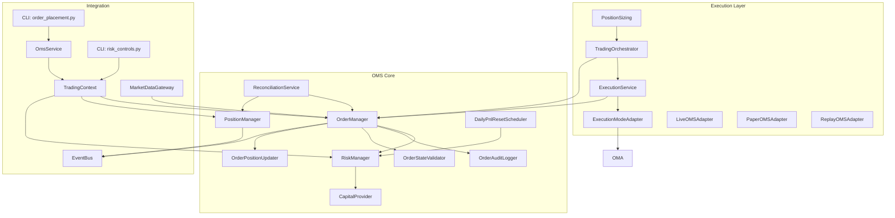

**Diagram sources**
- [order_manager.py:100-534](file://brokers/common/oms/order_manager.py#L100-L534)
- [position_manager.py:22-290](file://brokers/common/oms/position_manager.py#L22-L290)
- [risk_manager.py:70-258](file://brokers/common/oms/_internal/risk_manager.py#L70-L258)
- [context.py:44-478](file://brokers/common/oms/context.py#L44-L478)
- [capital_provider.py:25-94](file://brokers/common/oms/capital_provider.py#L25-L94)
- [order_state_validator.py:35-198](file://brokers/common/oms/order_state_validator.py#L35-L198)
- [order_audit_logger.py:65-251](file://brokers/common/oms/order_audit_logger.py#L65-L251)
- [order_position_updater.py:30-116](file://brokers/common/oms/order_position_updater.py#L30-L116)
- [daily_pnl_reset_scheduler.py:61-242](file://brokers/common/oms/daily_pnl_reset_scheduler.py#L61-L242)
- [reconciliation_service.py:29-207](file://brokers/common/oms/reconciliation_service.py#L29-L207)
- [oms_service.py:12-177](file://cli/services/oms_service.py#L12-L177)
- [order_placement.py:31-383](file://cli/commands/order_placement.py#L31-L383)
- [risk_controls.py:26-241](file://cli/commands/risk_controls.py#L26-L241)
- [execution_service.py:18-59](file://brokers/common/execution/execution_service.py#L18-L59)
- [execution_mode_adapter.py:16-89](file://brokers/common/execution/execution_mode_adapter.py#L16-L89)
- [trading_orchestrator.py:96-576](file://brokers/common/execution/trading_orchestrator.py#L96-L576)
- [position_sizing.py:1-6](file://brokers/common/execution/position_sizing.py#L1-L6)
- [sizing.py:6-19](file://domain/execution/sizing.py#L6-L19)

**Section sources**
- [context.py:44-478](file://brokers/common/oms/context.py#L44-L478)
- [order_manager.py:100-534](file://brokers/common/oms/order_manager.py#L100-L534)
- [position_manager.py:22-290](file://brokers/common/oms/position_manager.py#L22-L290)
- [risk_manager.py:70-258](file://brokers/common/oms/_internal/risk_manager.py#L70-L258)
- [oms_service.py:12-177](file://cli/services/oms_service.py#L12-L177)
- [order_placement.py:31-383](file://cli/commands/order_placement.py#L31-L383)
- [risk_controls.py:26-241](file://cli/commands/risk_controls.py#L26-L241)
- [execution_service.py:18-59](file://brokers/common/execution/execution_service.py#L18-L59)
- [execution_mode_adapter.py:16-89](file://brokers/common/execution/execution_mode_adapter.py#L16-L89)
- [trading_orchestrator.py:96-576](file://brokers/common/execution/trading_orchestrator.py#L96-L576)
- [position_sizing.py:1-6](file://brokers/common/execution/position_sizing.py#L1-L6)
- [sizing.py:6-19](file://domain/execution/sizing.py#L6-L19)

## Core Components
- OrderManager: Central order book with idempotency, risk checks, state validation, audit logging, position updates, and event publishing. Thread-safe via RLock; delegates to collaborators.
- RiskManager: Pre-trade risk checks with kill switch, position sizing, gross exposure, daily loss limits, and thread-safe state mutation. Supports dynamic capital via CapitalProvider.
- PositionManager: Thread-safe position book updated via trades and LTP ticks; enforces position state transitions and publishes lifecycle events.
- TradingContext: Wires EventBus, OMS, PositionManager, RiskManager, and reconciliation services; manages lifecycle and observability.
- CapitalProvider: Protocol for retrieving available balance; supports gateway-backed and fixed providers.
- OrderStateValidator, OrderAuditLogger, OrderPositionUpdater: Collaborators extracted from OrderManager to follow SRP and improve maintainability.
- DailyPnlResetScheduler: ManagedService that resets daily PnL at IST rollover boundaries.
- ReconciliationService: ManagedService that periodically reconciles OMS state with the broker.
- **New** ExecutionService: Unified facade for OMS-first order placement with execution mode adapters.
- **New** ExecutionModeAdapter: Factory pattern for live, paper, and replay execution modes.
- **New** TradingOrchestrator: Automated trading orchestrator with position sizing and enhanced order lifecycle management.

**Section sources**
- [order_manager.py:100-534](file://brokers/common/oms/order_manager.py#L100-L534)
- [risk_manager.py:70-258](file://brokers/common/oms/_internal/risk_manager.py#L70-L258)
- [position_manager.py:22-290](file://brokers/common/oms/position_manager.py#L22-L290)
- [context.py:44-478](file://brokers/common/oms/context.py#L44-L478)
- [capital_provider.py:25-94](file://brokers/common/oms/capital_provider.py#L25-L94)
- [order_state_validator.py:35-198](file://brokers/common/oms/order_state_validator.py#L35-L198)
- [order_audit_logger.py:65-251](file://brokers/common/oms/order_audit_logger.py#L65-L251)
- [order_position_updater.py:30-116](file://brokers/common/oms/order_position_updater.py#L30-L116)
- [daily_pnl_reset_scheduler.py:61-242](file://brokers/common/oms/daily_pnl_reset_scheduler.py#L61-L242)
- [reconciliation_service.py:29-207](file://brokers/common/oms/reconciliation_service.py#L29-L207)
- [execution_service.py:18-59](file://brokers/common/execution/execution_service.py#L18-L59)
- [execution_mode_adapter.py:16-89](file://brokers/common/execution/execution_mode_adapter.py#L16-L89)
- [trading_orchestrator.py:96-576](file://brokers/common/execution/trading_orchestrator.py#L96-L576)

## Architecture Overview
The OMS is event-driven. Order placement, updates, and trade application flow through OrderManager, which publishes domain events consumed by PositionManager and other subscribers. RiskManager performs pre-trade checks under a lock, and PositionManager enforces position state transitions. TradingContext wires all collaborators and observability. **New** ExecutionService provides a unified facade for different execution modes, while TradingOrchestrator handles automated trading with position sizing.

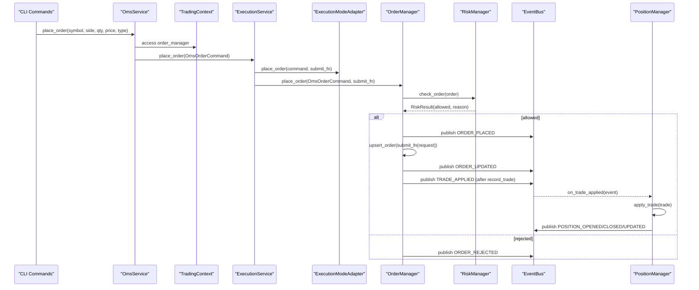

**Diagram sources**
- [order_placement.py:31-150](file://cli/commands/order_placement.py#L31-L150)
- [oms_service.py:101-168](file://cli/services/oms_service.py#L101-L168)
- [context.py:142-147](file://brokers/common/oms/context.py#L142-L147)
- [execution_service.py:44-59](file://brokers/common/execution/execution_service.py#L44-L59)
- [execution_mode_adapter.py:28-74](file://brokers/common/execution/execution_mode_adapter.py#L28-L74)
- [order_manager.py:184-277](file://brokers/common/oms/order_manager.py#L184-L277)
- [risk_manager.py:125-158](file://brokers/common/oms/_internal/risk_manager.py#L125-L158)
- [position_manager.py:250-269](file://brokers/common/oms/position_manager.py#L250-L269)

## Detailed Component Analysis

### OrderManager
Responsibilities:
- Idempotent order placement with correlation-id dedupe.
- Pre-trade risk checks via RiskManager.
- State validation via OrderStateValidator.
- Audit logging via OrderAuditLogger.
- Position updates via OrderPositionUpdater.
- Event publishing for ORDER_PLACED, ORDER_UPDATED, ORDER_CANCELLED, TRADE_APPLIED.
- Thread-safety via RLock; re-entrancy guard to prevent handler recursion.

Key behaviors:
- place_order: constructs canonical Order, checks risk, optionally submits via submit_fn, persists state, publishes events.
- upsert_order: validates state transitions, updates order, logs state change.
- record_trade: idempotent trade application, updates order and position, publishes TRADE_APPLIED.
- cancel_order: cancels locally and optionally at broker, logs state change.

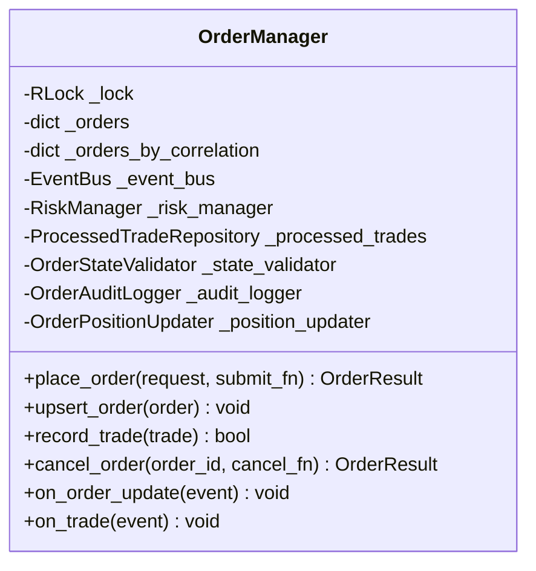

**Diagram sources**
- [order_manager.py:100-534](file://brokers/common/oms/order_manager.py#L100-L534)

**Section sources**
- [order_manager.py:100-534](file://brokers/common/oms/order_manager.py#L100-L534)
- [order_state_validator.py:35-198](file://brokers/common/oms/order_state_validator.py#L35-L198)
- [order_audit_logger.py:65-251](file://brokers/common/oms/order_audit_logger.py#L65-L251)
- [order_position_updater.py:30-116](file://brokers/common/oms/order_position_updater.py#L30-L116)

### RiskManager
Responsibilities:
- Pre-trade risk checks: kill switch, capital availability, per-symbol position, gross exposure, daily loss.
- Thread-safe state: internal RLock guards config and daily PnL.
- Dynamic capital via CapitalProvider (supports gateway-backed or fixed).
- Daily PnL rollover via DailyPnlResetScheduler.

Key behaviors:
- check_order: evaluates all limits under lock; returns RiskResult.
- set_kill_switch: atomic replacement of frozen config; thread-safe.
- update_daily_pnl/reset_daily_pnl: thread-safe mutation and reset.
- snapshot: thread-safe view of state for observability.

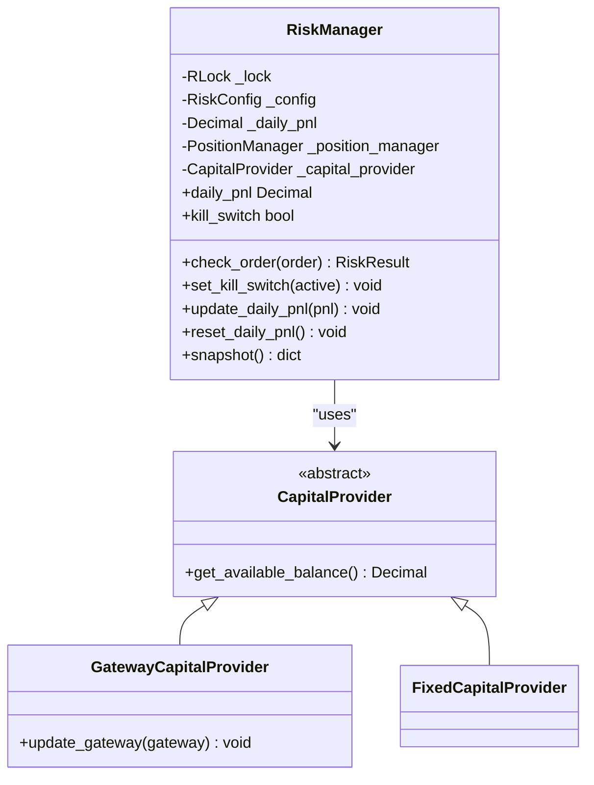

**Diagram sources**
- [risk_manager.py:70-258](file://brokers/common/oms/_internal/risk_manager.py#L70-L258)
- [capital_provider.py:25-94](file://brokers/common/oms/capital_provider.py#L25-L94)

**Section sources**
- [risk_manager.py:70-258](file://brokers/common/oms/_internal/risk_manager.py#L70-L258)
- [capital_provider.py:25-94](file://brokers/common/oms/capital_provider.py#L25-L94)

### PositionManager
Responsibilities:
- Thread-safe position book updated via TRADE_APPLIED events (ensures idempotency).
- Position state transitions: FLAT → OPEN → REDUCING → CLOSED or REVERSED.
- Publishes POSITION_OPENED, POSITION_CLOSED, POSITION_UPDATED lifecycle events.
- Supports LTP updates and reconciliation.

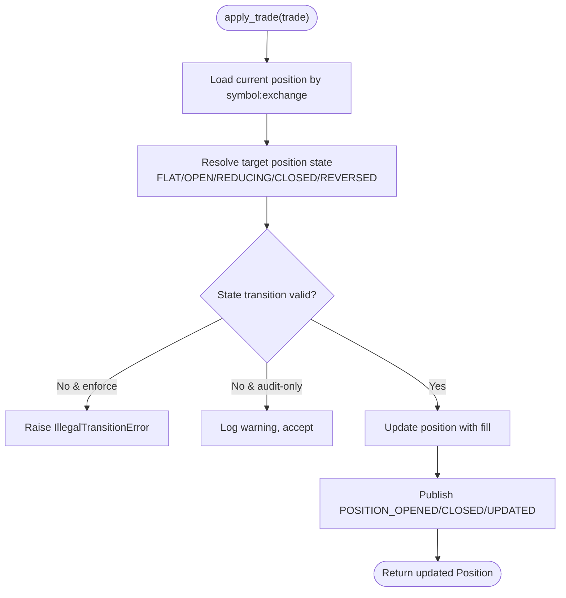

**Diagram sources**
- [position_manager.py:55-150](file://brokers/common/oms/position_manager.py#L55-L150)

**Section sources**
- [position_manager.py:22-290](file://brokers/common/oms/position_manager.py#L22-L290)

### TradingContext
Responsibilities:
- Wires EventBus, OrderManager, PositionManager, RiskManager, and reconciliation.
- Subscribes OMS and PositionManager to relevant events.
- Registers DailyPnlResetScheduler and DLQ monitor with LifecycleManager.
- Provides health snapshot and async bus integration.

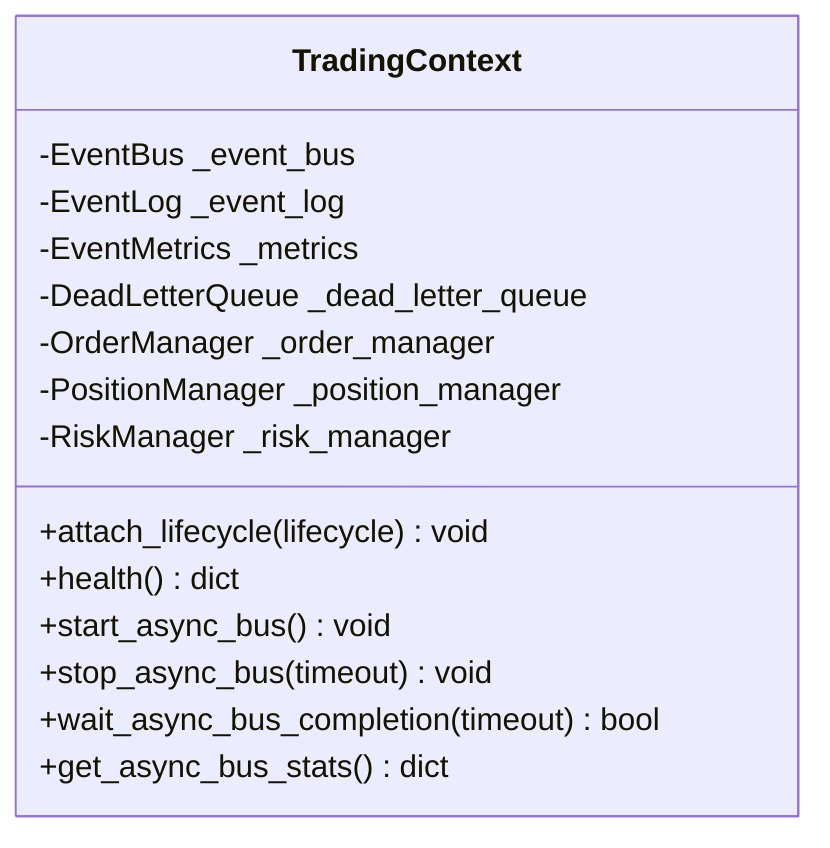

**Diagram sources**
- [context.py:44-478](file://brokers/common/oms/context.py#L44-L478)

**Section sources**
- [context.py:44-478](file://brokers/common/oms/context.py#L44-L478)

### CLI Integration
- OmsService: centralizes order placement and cancellation via TradingContext; falls back to gateway when no context is present.
- CLI commands: order_placement.py and risk_controls.py expose user-facing operations backed by OmsService and TradingContext.

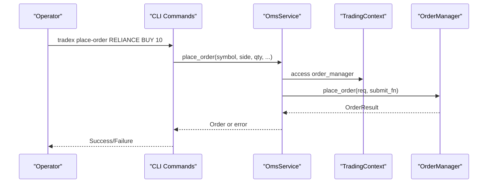

**Diagram sources**
- [order_placement.py:31-150](file://cli/commands/order_placement.py#L31-L150)
- [oms_service.py:101-168](file://cli/services/oms_service.py#L101-L168)
- [context.py:142-147](file://brokers/common/oms/context.py#L142-L147)
- [order_manager.py:184-277](file://brokers/common/oms/order_manager.py#L184-L277)

**Section sources**
- [oms_service.py:12-177](file://cli/services/oms_service.py#L12-L177)
- [order_placement.py:31-383](file://cli/commands/order_placement.py#L31-L383)
- [risk_controls.py:26-241](file://cli/commands/risk_controls.py#L26-L241)

## Execution Service Facade

**New** The ExecutionService provides a unified facade for OMS-first order placement, abstracting different execution modes behind a common interface.

### ExecutionService
Responsibilities:
- Unified entry point for order placement and cancellation through OMS.
- Manages execution mode adapters for live, paper, and replay modes.
- Provides consistent API regardless of execution environment.

Key behaviors:
- place_order: delegates to appropriate execution mode adapter.
- cancel_order: directly calls OrderManager.cancel_order.
- mode property: exposes current execution mode.

### ExecutionModeAdapter Pattern
The execution mode adapter pattern provides a common interface for different trading modes:

- LiveOMSAdapter: Direct OMS integration with real broker submission.
- PaperOMSAdapter: Simulated execution for paper trading.
- ReplayOMSAdapter: Zero-parity replay/backtesting through OMS.

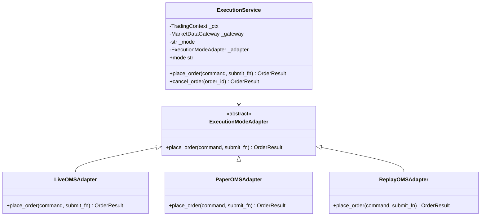

**Diagram sources**
- [execution_service.py:18-59](file://brokers/common/execution/execution_service.py#L18-L59)
- [execution_mode_adapter.py:16-89](file://brokers/common/execution/execution_mode_adapter.py#L16-L89)

**Section sources**
- [execution_service.py:18-59](file://brokers/common/execution/execution_service.py#L18-L59)
- [execution_mode_adapter.py:16-89](file://brokers/common/execution/execution_mode_adapter.py#L16-L89)

## Position Sizing System

**New** The position sizing system provides standardized calculation methods for determining order quantities based on capital constraints and risk parameters.

### Position Sizing Utilities
- compute_order_quantity: Calculates maximum order quantity given equity, price, and maximum position percentage.
- Backward-compatible re-export: position_sizing module maintains compatibility with existing imports.

### Domain-Level Position Sizing
The domain execution sizing module provides shared calculation logic used across analytics engines and trading systems.

Key features:
- Input validation for positive equity, price, and position percentage.
- Notional value calculation based on maximum allowed position percentage.
- Integer quantity rounding with minimum value enforcement.

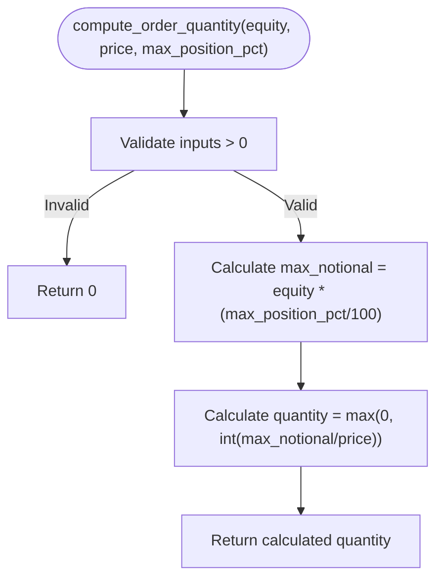

**Diagram sources**
- [sizing.py:6-19](file://domain/execution/sizing.py#L6-L19)

**Section sources**
- [position_sizing.py:1-6](file://brokers/common/execution/position_sizing.py#L1-L6)
- [sizing.py:6-19](file://domain/execution/sizing.py#L6-L19)

## Enhanced Trading Orchestrator

**New** The TradingOrchestrator connects the analytics layer (scanner/strategy) with the execution layer (OMS/broker), providing automated trading with enhanced position sizing and risk controls.

### TradingOrchestrator Responsibilities
- Subscribes to CANDIDATE_GENERATED events from EventBus.
- Evaluates candidates through strategy pipeline with confidence filtering.
- Converts actionable signals to OmsOrderCommand with position sizing.
- Executes orders through ExecutionService or directly via OrderManager.
- Publishes execution events (SIGNAL_EXECUTED, RISK_APPROVED, RISK_REJECTED).

### Enhanced Features
- **Position Sizing**: Automatic quantity calculation from signal position_size_pct or explicit quantity.
- **Confidence Filtering**: Minimum confidence threshold prevents low-quality executions.
- **Kill Switch Integration**: Real-time kill switch checking through OrderManager risk manager.
- **Execution Mode Support**: Optional ExecutionService integration for unified execution.
- **Statistics Tracking**: Executed, rejected, and error counts for performance monitoring.

### Signal Processing Workflow
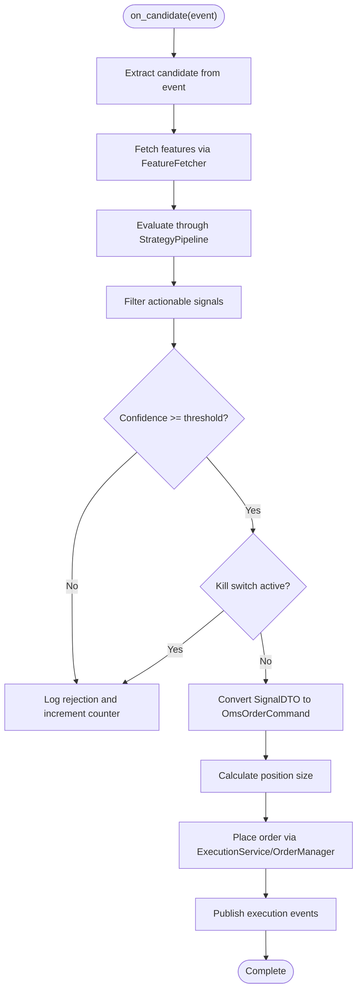

**Diagram sources**
- [trading_orchestrator.py:174-504](file://brokers/common/execution/trading_orchestrator.py#L174-L504)

**Section sources**
- [trading_orchestrator.py:96-576](file://brokers/common/execution/trading_orchestrator.py#L96-L576)

## Dependency Analysis
- Coupling: OrderManager depends on RiskManager, OrderStateValidator, OrderAuditLogger, OrderPositionUpdater, EventBus, and ProcessedTradeRepository. RiskManager depends on PositionManager and CapitalProvider. PositionManager depends on EventBus and state machine types.
- **New** ExecutionService couples TradingContext, MarketDataGateway, and ExecutionModeAdapter for unified execution.
- **New** TradingOrchestrator depends on ExecutionService, OrderManager, and position sizing utilities.
- Cohesion: Collaborators are extracted to improve separation of concerns and SRP.
- External integrations: MarketDataGateway via OmsService/place_order; broker adapters integrate via submit_fn and gateway APIs.

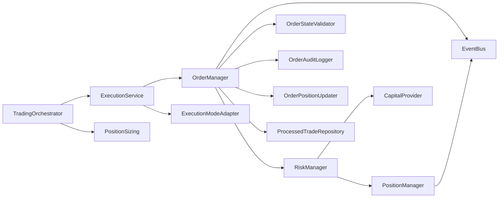

**Diagram sources**
- [order_manager.py:100-534](file://brokers/common/oms/order_manager.py#L100-L534)
- [risk_manager.py:70-258](file://brokers/common/oms/_internal/risk_manager.py#L70-L258)
- [position_manager.py:22-290](file://brokers/common/oms/position_manager.py#L22-L290)
- [order_state_validator.py:35-198](file://brokers/common/oms/order_state_validator.py#L35-L198)
- [order_audit_logger.py:65-251](file://brokers/common/oms/order_audit_logger.py#L65-L251)
- [order_position_updater.py:30-116](file://brokers/common/oms/order_position_updater.py#L30-L116)
- [execution_service.py:18-59](file://brokers/common/execution/execution_service.py#L18-L59)
- [execution_mode_adapter.py:16-89](file://brokers/common/execution/execution_mode_adapter.py#L16-L89)
- [trading_orchestrator.py:96-576](file://brokers/common/execution/trading_orchestrator.py#L96-L576)

**Section sources**
- [order_manager.py:100-534](file://brokers/common/oms/order_manager.py#L100-L534)
- [risk_manager.py:70-258](file://brokers/common/oms/_internal/risk_manager.py#L70-L258)
- [position_manager.py:22-290](file://brokers/common/oms/position_manager.py#L22-L290)
- [execution_service.py:18-59](file://brokers/common/execution/execution_service.py#L18-L59)
- [execution_mode_adapter.py:16-89](file://brokers/common/execution/execution_mode_adapter.py#L16-L89)
- [trading_orchestrator.py:96-576](file://brokers/common/execution/trading_orchestrator.py#L96-L576)

## Performance Considerations
- Concurrency: All managers use RLock to protect mutable state; OrderManager and PositionManager also guard event handler re-entry to avoid recursion.
- Idempotency: ProcessedTradeRepository prevents duplicate trade application and redundant position updates.
- State machines: OrderStateValidator and PositionManager enforce transitions to minimize invalid state churn.
- Observability: EventMetrics and DeadLetterQueue provide counters and failure visibility; async bus support enables scalable event dispatch.
- Scheduler discipline: DailyPnlResetScheduler and ReconciliationService are ManagedServices with controlled lifecycle and timeouts.
- **New** ExecutionService reduces coupling by providing unified interface for different execution modes.
- **New** Position sizing calculations are lightweight and performed outside of OMS locks for optimal performance.

## Troubleshooting Guide
Common issues and strategies:
- Duplicate trades: Verify ProcessedTradeRepository is wired; record_trade returns False for duplicates and increments trade_duplicated metrics.
- Order stuck in OPEN: Subscribe to ORDER_UPDATED and inspect audit trail via OrderAuditLogger; check state transitions with OrderStateValidator.
- Position mismatch: Run reconciliation via ReconciliationService; inspect drift counts and publish RECONCILIATION_COMPLETED events.
- Kill switch blocking orders: Use CLI risk controls to toggle kill switch; verify snapshot and health metrics.
- Daily loss limit: Confirm DailyPnlResetScheduler is registered with LifecycleManager; reset via CLI or programmatic reset_daily_pnl.
- **New** Execution mode issues: Verify ExecutionService mode property matches expected trading mode; check adapter selection logic.
- **New** Position sizing problems: Validate signal position_size_pct values; ensure proper capital provider configuration for accurate calculations.

**Section sources**
- [order_manager.py:308-380](file://brokers/common/oms/order_manager.py#L308-L380)
- [order_audit_logger.py:65-251](file://brokers/common/oms/order_audit_logger.py#L65-L251)
- [order_state_validator.py:91-136](file://brokers/common/oms/order_state_validator.py#L91-L136)
- [reconciliation_service.py:146-206](file://brokers/common/oms/reconciliation_service.py#L146-L206)
- [risk_controls.py:81-113](file://cli/commands/risk_controls.py#L81-L113)
- [daily_pnl_reset_scheduler.py:184-242](file://brokers/common/oms/daily_pnl_reset_scheduler.py#L184-L242)
- [execution_service.py:33-42](file://brokers/common/execution/execution_service.py#L33-L42)
- [trading_orchestrator.py:386-391](file://brokers/common/execution/trading_orchestrator.py#L386-L391)

## Conclusion
The OMS provides a robust, thread-safe, and observable foundation for trading orchestration. OrderManager centralizes lifecycle management with strong risk controls via RiskManager, while PositionManager ensures accurate position tracking and state transitions. TradingContext integrates all collaborators and observability, and CLI commands offer practical operational controls. **New** ExecutionService provides unified access to different execution modes, while TradingOrchestrator automates the complete trading workflow with enhanced position sizing and risk controls. The system's design emphasizes SRP, idempotency, and deterministic state transitions, enabling reliable production deployments with modern execution patterns.

## Appendices

### Practical Workflows

- **New** Order placement workflow with ExecutionService
  - CLI: tradex place-order
  - OmsService builds OmsOrderCommand and calls ExecutionService.place_order
  - ExecutionService selects appropriate adapter based on mode
  - Adapter delegates to OrderManager.place_order with submit_fn
  - RiskManager.check_order validates kill switch, capital, position, exposure, and daily loss
  - EventBus publishes ORDER_PLACED; broker executes order via submit_fn
  - On receipt of TRADE_APPLIED, PositionManager applies trade and publishes POSITION lifecycle events

- **New** Automated trading workflow with TradingOrchestrator
  - Scanner generates CANDIDATE_GENERATED event
  - TradingOrchestrator.on_candidate processes candidate
  - FeatureFetcher retrieves symbol features
  - StrategyPipeline evaluates candidate and generates signals
  - Signals filtered by confidence threshold and kill switch status
  - Position sizing calculated from signal parameters
  - ExecutionService.place_order executes actionable signals
  - Publishes SIGNAL_EXECUTED, RISK_APPROVED, or RISK_REJECTED events

- **New** Risk control scenario with enhanced thread safety
  - Operator toggles kill switch via CLI; RiskManager.set_kill_switch flips state atomically under lock
  - All subsequent place_order calls are rejected with RISK_REJECTED and ORDER_REJECTED events
  - Thread-safe snapshot and health metrics reflect current state
  - CapitalProvider dynamically resolves available balance for position sizing

- **New** Position management operation with state machine enforcement
  - On TRADE_APPLIED, PositionManager.apply_trade updates position state machine
  - Publishes POSITION_OPENED/CLOSED/UPDATED depending on state transition
  - State machine validation prevents illegal transitions with configurable enforcement mode
  - LTP updates supported via update_ltp for unrealized PnL calculations

**Section sources**
- [order_placement.py:31-150](file://cli/commands/order_placement.py#L31-L150)
- [oms_service.py:101-168](file://cli/services/oms_service.py#L101-L168)
- [risk_controls.py:81-113](file://cli/commands/risk_controls.py#L81-L113)
- [order_manager.py:184-277](file://brokers/common/oms/order_manager.py#L184-L277)
- [position_manager.py:55-150](file://brokers/common/oms/position_manager.py#L55-L150)
- [execution_service.py:44-59](file://brokers/common/execution/execution_service.py#L44-L59)
- [execution_mode_adapter.py:28-74](file://brokers/common/execution/execution_mode_adapter.py#L28-L74)
- [trading_orchestrator.py:174-504](file://brokers/common/execution/trading_orchestrator.py#L174-L504)
- [risk_manager.py:170-204](file://brokers/common/oms/_internal/risk_manager.py#L170-L204)
- [sizing.py:6-19](file://domain/execution/sizing.py#L6-L19)