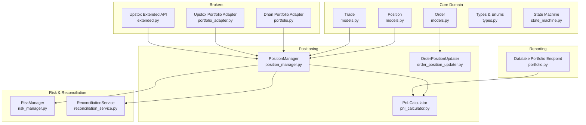
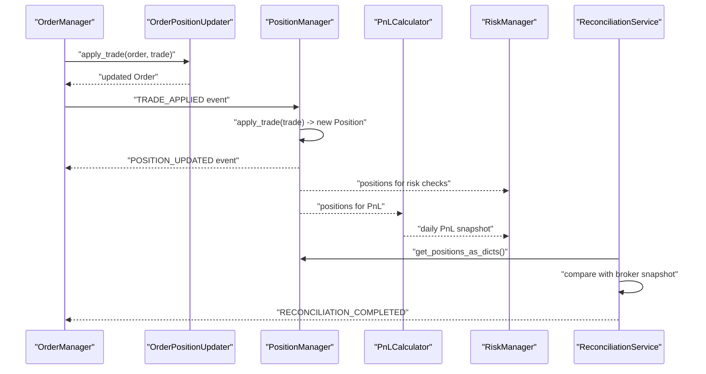
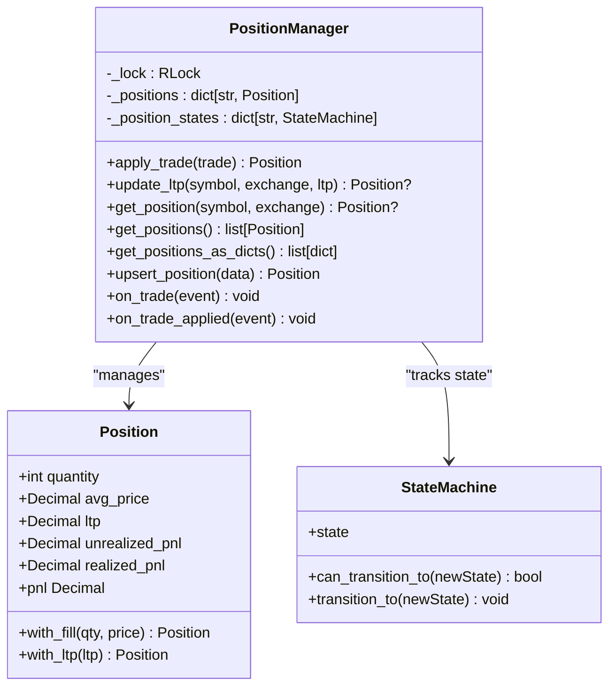
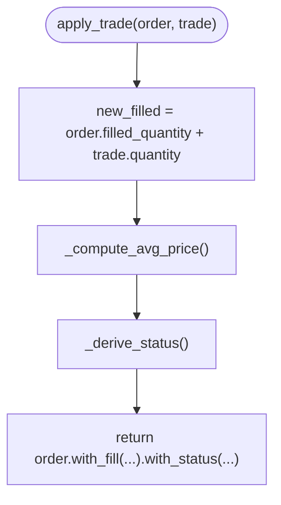
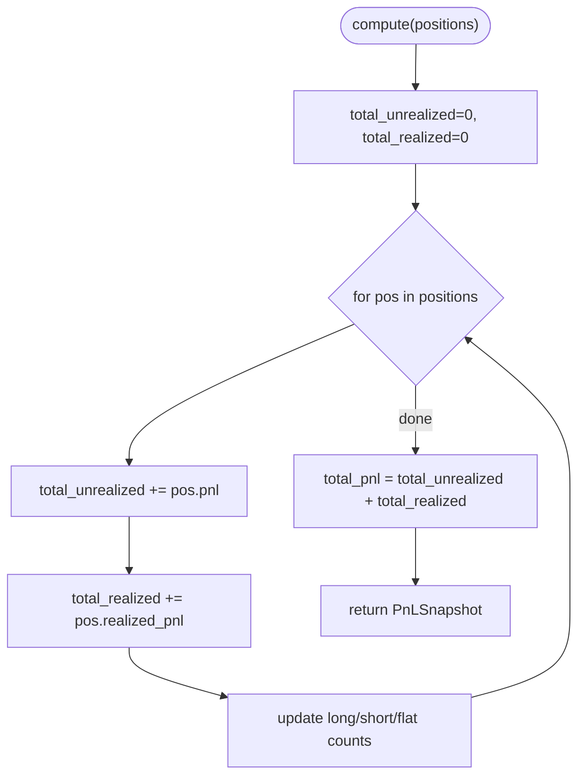
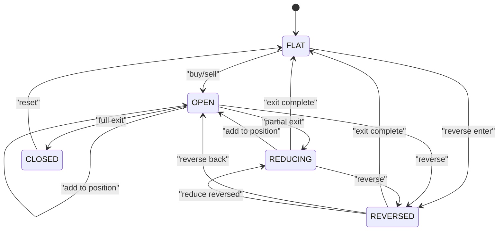
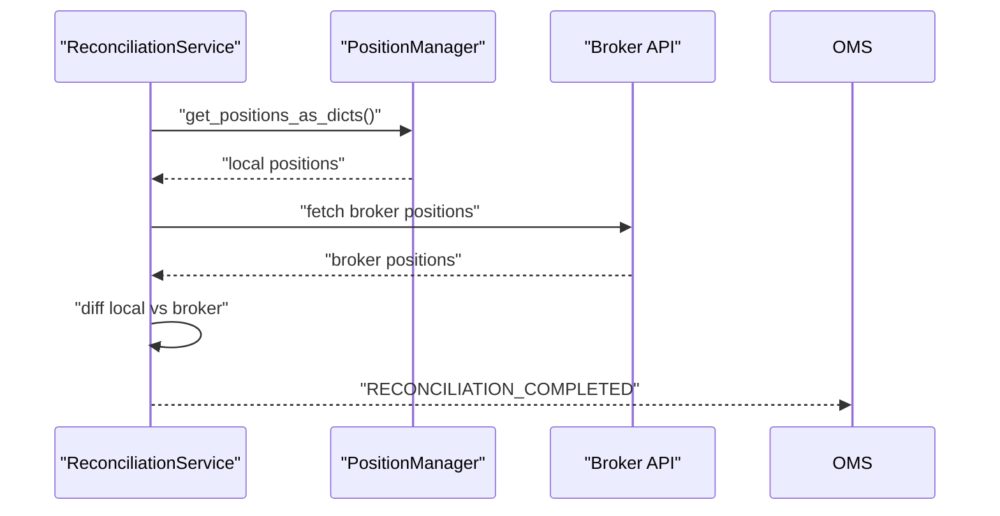
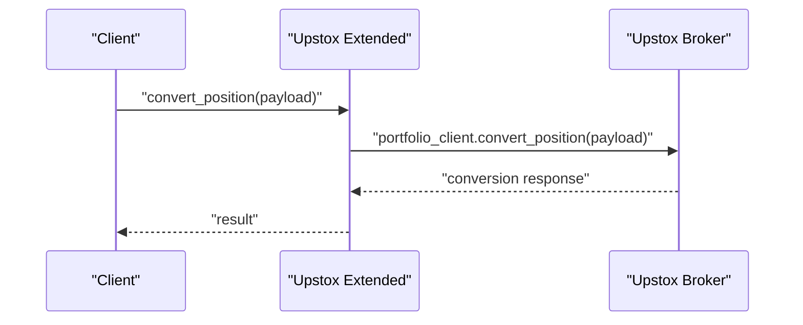
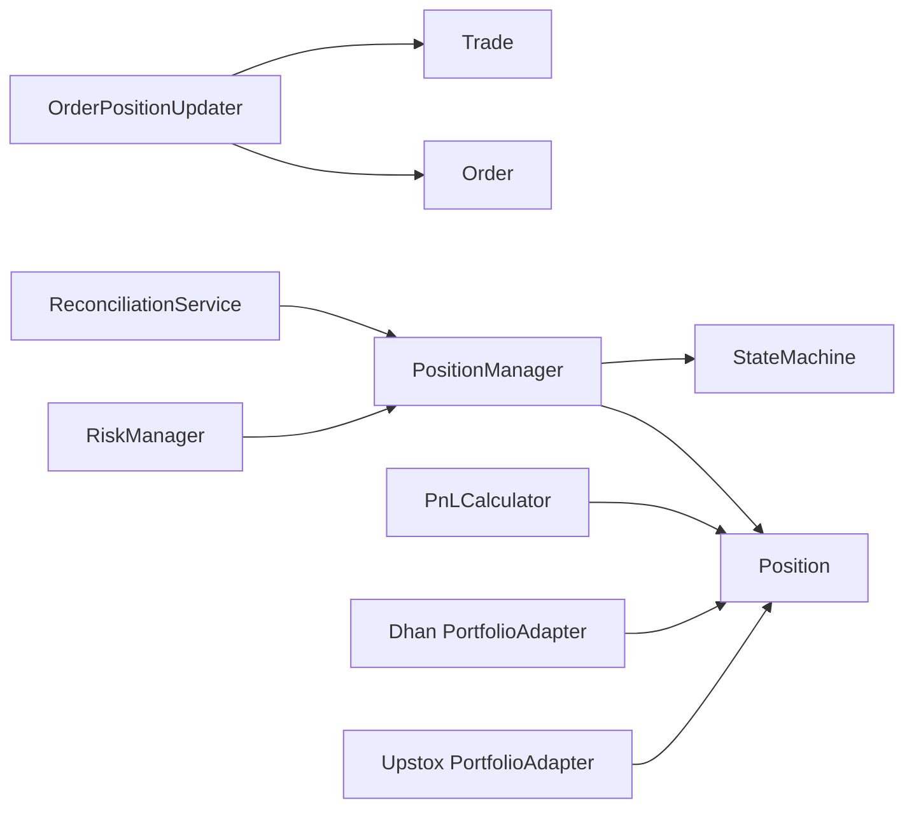

# Position and Portfolio Management

<cite>
**Referenced Files in This Document**
- [position_manager.py](file://brokers/common/oms/position_manager.py)
- [order_position_updater.py](file://brokers/common/oms/order_position_updater.py)
- [pnl_calculator.py](file://brokers/common/core/pnl_calculator.py)
- [models.py](file://brokers/common/core/models.py)
- [types.py](file://brokers/common/core/types.py)
- [state_machine.py](file://brokers/common/core/state_machine.py)
- [risk_manager.py](file://brokers/common/oms/risk_manager.py)
- [reconciliation_service.py](file://brokers/common/oms/reconciliation_service.py)
- [portfolio.py](file://brokers/dhan/portfolio.py)
- [portfolio_adapter.py](file://brokers/upstox/adapters/portfolio_adapter.py)
- [extended.py](file://brokers/upstox/extended.py)
- [portfolio.py](file://datalake/api/routers/portfolio.py)
- [test_order_position_updater.py](file://brokers/common/oms/tests/test_order_position_updater.py)
- [test_pnl_calculator.py](file://brokers/common/core/tests/test_pnl_calculator.py)
</cite>

## Table of Contents
1. [Introduction](#introduction)
2. [Project Structure](#project-structure)
3. [Core Components](#core-components)
4. [Architecture Overview](#architecture-overview)
5. [Detailed Component Analysis](#detailed-component-analysis)
6. [Dependency Analysis](#dependency-analysis)
7. [Performance Considerations](#performance-considerations)
8. [Troubleshooting Guide](#troubleshooting-guide)
9. [Conclusion](#conclusion)
10. [Appendices](#appendices)

## Introduction
This document explains position and portfolio management across the system, focusing on:
- Maintaining accurate position state and aggregating fills into positions
- Computing realized and unrealized PnL consistently
- Aggregating positions across symbols and products
- Position lifecycle tracking and state transitions
- Reporting, reconciliation, and risk integration
- Practical workflows for position tracking, PnL computation, and position conversion

It targets both developers and analysts who need to understand how positions are tracked, how PnL is calculated, and how systems integrate around order management, risk, and reporting.

## Project Structure
The position and portfolio management capability spans several modules:
- Core domain models and types define canonical Position, Trade, Order, and enums
- PositionManager centralizes position state and applies fills
- OrderPositionUpdater updates order state from fills (separate concern)
- PnLCalculator computes portfolio-level PnL from positions
- RiskManager integrates PnL and position state for pre-trade risk checks
- ReconciliationService compares local state against broker snapshots
- Broker adapters expose portfolio data and conversions

**Diagram sources**
- [position_manager.py:1-290](file://brokers/common/oms/position_manager.py#L1-L290)
- [order_position_updater.py:1-116](file://brokers/common/oms/order_position_updater.py#L1-L116)
- [pnl_calculator.py:1-124](file://brokers/common/core/pnl_calculator.py#L1-L124)
- [models.py:169-237](file://brokers/common/core/models.py#L169-L237)
- [types.py:172-263](file://brokers/common/core/types.py#L172-L263)
- [state_machine.py:53-162](file://brokers/common/core/state_machine.py#L53-L162)
- [risk_manager.py:70-258](file://brokers/common/oms/risk_manager.py#L70-L258)
- [reconciliation_service.py:29-207](file://brokers/common/oms/reconciliation_service.py#L29-L207)
- [portfolio.py:17-101](file://brokers/dhan/portfolio.py#L17-L101)
- [portfolio_adapter.py:18-87](file://brokers/upstox/adapters/portfolio_adapter.py#L18-L87)
- [extended.py:191-224](file://brokers/upstox/extended.py#L191-L224)
- [portfolio.py:129-167](file://datalake/api/routers/portfolio.py#L129-L167)

**Section sources**
- [position_manager.py:1-290](file://brokers/common/oms/position_manager.py#L1-L290)
- [models.py:169-237](file://brokers/common/core/models.py#L169-L237)
- [types.py:172-263](file://brokers/common/core/types.py#L172-L263)
- [pnl_calculator.py:1-124](file://brokers/common/core/pnl_calculator.py#L1-L124)
- [risk_manager.py:70-258](file://brokers/common/oms/risk_manager.py#L70-L258)
- [reconciliation_service.py:29-207](file://brokers/common/oms/reconciliation_service.py#L29-L207)
- [portfolio.py:17-101](file://brokers/dhan/portfolio.py#L17-L101)
- [portfolio_adapter.py:18-87](file://brokers/upstox/adapters/portfolio_adapter.py#L18-L87)
- [extended.py:191-224](file://brokers/upstox/extended.py#L191-L224)
- [portfolio.py:129-167](file://datalake/api/routers/portfolio.py#L129-L167)

## Core Components
- PositionManager: Single owner of position state, thread-safe, immutable Position updates, lifecycle events, and state-machine enforcement for position transitions.
- OrderPositionUpdater: Applies fills to orders (partial fills, VWAP average price, status derivation).
- PnLCalculator: Pure function computing portfolio-level realized/unrealized PnL and daily totals.
- Position, Trade, Order: Canonical domain models with immutable updates and computed properties.
- PositionState and state machine: Enforce valid position lifecycle transitions.
- RiskManager: Pre-trade checks using position state and PnL.
- ReconciliationService: Periodic drift detection between local state and broker snapshots.
- Broker adapters: Provide positions/holdings/balance and support position conversion.

**Section sources**
- [position_manager.py:22-290](file://brokers/common/oms/position_manager.py#L22-L290)
- [order_position_updater.py:30-116](file://brokers/common/oms/order_position_updater.py#L30-L116)
- [pnl_calculator.py:49-124](file://brokers/common/core/pnl_calculator.py#L49-L124)
- [models.py:169-237](file://brokers/common/core/models.py#L169-L237)
- [types.py:172-263](file://brokers/common/core/types.py#L172-L263)
- [state_machine.py:53-162](file://brokers/common/core/state_machine.py#L53-L162)
- [risk_manager.py:70-258](file://brokers/common/oms/risk_manager.py#L70-L258)
- [reconciliation_service.py:29-207](file://brokers/common/oms/reconciliation_service.py#L29-L207)
- [portfolio.py:17-101](file://brokers/dhan/portfolio.py#L17-L101)
- [portfolio_adapter.py:18-87](file://brokers/upstox/adapters/portfolio_adapter.py#L18-L87)
- [extended.py:191-224](file://brokers/upstox/extended.py#L191-L224)

## Architecture Overview
Position and portfolio management follows a strict separation of concerns:
- Orders are managed by OrderManager/Oms collaborators; fills are applied to orders via OrderPositionUpdater.
- Positions are updated by PositionManager upon receipt of TRADE_APPLIED events, ensuring idempotency and preventing duplicate counting.
- PnL is computed from Position state and published via events and endpoints.
- RiskManager reads positions and PnL to enforce limits pre-trade.
- ReconciliationService periodically compares local positions with broker snapshots.

**Diagram sources**
- [order_position_updater.py:44-68](file://brokers/common/oms/order_position_updater.py#L44-L68)
- [position_manager.py:55-150](file://brokers/common/oms/position_manager.py#L55-L150)
- [pnl_calculator.py:60-101](file://brokers/common/core/pnl_calculator.py#L60-L101)
- [risk_manager.py:125-158](file://brokers/common/oms/risk_manager.py#L125-L158)
- [reconciliation_service.py:156-206](file://brokers/common/oms/reconciliation_service.py#L156-L206)

## Detailed Component Analysis

### PositionManager
Responsibilities:
- Central position book maintained under a re-entrant lock
- Applies trades immutably, updating quantity, average price, and realized/unrealized PnL
- Publishes lifecycle events: POSITION_OPENED, POSITION_CLOSED, POSITION_UPDATED
- Enforces position state transitions using a state machine (FLAT/OPEN/REDUCING/CLOSED/REVERSED)
- Supports upsert from broker state for reconciliation
- Thread-safe updates and safe re-entry guard for event handlers

Key behaviors:
- Symbol-keyed storage with immutable Position updates
- LTP updates trigger recomputation of unrealized PnL
- State machine determines transitions based on sign and magnitude of quantity changes
- Events published for downstream systems (risk, reporting, alerts)

**Diagram sources**
- [position_manager.py:22-290](file://brokers/common/oms/position_manager.py#L22-L290)
- [models.py:169-237](file://brokers/common/core/models.py#L169-L237)
- [types.py:172-263](file://brokers/common/core/types.py#L172-L263)
- [state_machine.py:53-162](file://brokers/common/core/state_machine.py#L53-L162)

**Section sources**
- [position_manager.py:22-290](file://brokers/common/oms/position_manager.py#L22-L290)
- [models.py:169-237](file://brokers/common/core/models.py#L169-L237)
- [types.py:172-263](file://brokers/common/core/types.py#L172-L263)
- [state_machine.py:53-162](file://brokers/common/core/state_machine.py#L53-L162)

### OrderPositionUpdater
Responsibilities:
- Applies a single trade to an order and returns a new Order with updated fill state
- Computes VWAP-style average price across fills
- Derives order status (PARTIALLY_FILLED/FILLED) from cumulative filled quantity
- Not thread-safe; callers must synchronize externally

**Diagram sources**
- [order_position_updater.py:44-68](file://brokers/common/oms/order_position_updater.py#L44-L68)
- [order_position_updater.py:70-96](file://brokers/common/oms/order_position_updater.py#L70-L96)
- [order_position_updater.py:98-115](file://brokers/common/oms/order_position_updater.py#L98-L115)

**Section sources**
- [order_position_updater.py:30-116](file://brokers/common/oms/order_position_updater.py#L30-L116)
- [test_order_position_updater.py:47-346](file://brokers/common/oms/tests/test_order_position_updater.py#L47-L346)

### PnLCalculator
Responsibilities:
- Pure function computing portfolio-level PnL from a list of Position
- Computes total unrealized, realized, and total PnL
- Provides daily PnL for risk checks
- Deterministic and stateless

**Diagram sources**
- [pnl_calculator.py:60-101](file://brokers/common/core/pnl_calculator.py#L60-L101)

**Section sources**
- [pnl_calculator.py:49-124](file://brokers/common/core/pnl_calculator.py#L49-L124)
- [test_pnl_calculator.py:47-213](file://brokers/common/core/tests/test_pnl_calculator.py#L47-L213)

### Position Lifecycle and State Transitions
PositionManager tracks PositionState and validates transitions:
- FLAT → OPEN/REVERSED (entering position)
- OPEN → OPEN/REDUCING/CLOSED/REVERSED (adding, exiting, full/close, reversing)
- REDUCING → FLAT/OPEN/REVERSED (exit completion, adding, reversing)
- REVERSED → FLAT/OPEN/REDUCING/CLOSED (exit completion, reversing back, reducing)
- CLOSED → FLAT (session reset)

**Diagram sources**
- [types.py:172-263](file://brokers/common/core/types.py#L172-L263)
- [position_manager.py:87-120](file://brokers/common/oms/position_manager.py#L87-L120)

**Section sources**
- [types.py:172-263](file://brokers/common/core/types.py#L172-L263)
- [position_manager.py:87-120](file://brokers/common/oms/position_manager.py#L87-L120)

### Position Reporting and Reconciliation
- PositionManager exposes get_positions_as_dicts() for reconciliation compatibility
- ReconciliationService runs periodic reconciliation and publishes drift events
- Datalake endpoint aggregates portfolio metrics and splits PnL into realized/unrealized

**Diagram sources**
- [reconciliation_service.py:156-206](file://brokers/common/oms/reconciliation_service.py#L156-L206)
- [position_manager.py:172-185](file://brokers/common/oms/position_manager.py#L172-L185)

**Section sources**
- [position_manager.py:172-185](file://brokers/common/oms/position_manager.py#L172-L185)
- [reconciliation_service.py:29-207](file://brokers/common/oms/reconciliation_service.py#L29-L207)
- [portfolio.py:129-167](file://datalake/api/routers/portfolio.py#L129-L167)

### Position Conversion Across Symbols
- Upstox extended API supports converting positions (e.g., intraday to delivery) via a dedicated client call
- This enables changing product types or clearing house positions without manual re-entry

**Diagram sources**
- [extended.py:196-205](file://brokers/upstox/extended.py#L196-L205)

**Section sources**
- [extended.py:191-224](file://brokers/upstox/extended.py#L191-L224)

## Dependency Analysis
- PositionManager depends on Position, Trade, and StateMachine; publishes DomainEvents
- OrderPositionUpdater depends on Order and Trade; returns immutable Order updates
- PnLCalculator depends on Position; pure function
- RiskManager depends on PositionManager and capital provider; reads positions and PnL
- ReconciliationService depends on OrderManager and PositionManager; compares with broker snapshots
- Broker adapters depend on canonical models and return Position/Holding/Balance

**Diagram sources**
- [order_position_updater.py:30-116](file://brokers/common/oms/order_position_updater.py#L30-L116)
- [position_manager.py:22-290](file://brokers/common/oms/position_manager.py#L22-L290)
- [pnl_calculator.py:49-124](file://brokers/common/core/pnl_calculator.py#L49-L124)
- [risk_manager.py:70-258](file://brokers/common/oms/risk_manager.py#L70-L258)
- [reconciliation_service.py:29-207](file://brokers/common/oms/reconciliation_service.py#L29-L207)
- [portfolio.py:17-101](file://brokers/dhan/portfolio.py#L17-L101)
- [portfolio_adapter.py:18-87](file://brokers/upstox/adapters/portfolio_adapter.py#L18-L87)

**Section sources**
- [order_position_updater.py:30-116](file://brokers/common/oms/order_position_updater.py#L30-L116)
- [position_manager.py:22-290](file://brokers/common/oms/position_manager.py#L22-L290)
- [pnl_calculator.py:49-124](file://brokers/common/core/pnl_calculator.py#L49-L124)
- [risk_manager.py:70-258](file://brokers/common/oms/risk_manager.py#L70-L258)
- [reconciliation_service.py:29-207](file://brokers/common/oms/reconciliation_service.py#L29-L207)
- [portfolio.py:17-101](file://brokers/dhan/portfolio.py#L17-L101)
- [portfolio_adapter.py:18-87](file://brokers/upstox/adapters/portfolio_adapter.py#L18-L87)

## Performance Considerations
- Immutable updates minimize contention and enable safe sharing of Position instances
- Thread safety via RLock ensures safe concurrent access; avoid blocking under the lock
- Pure PnLCalculator avoids side effects and is suitable for frequent recomputation
- Reconciliation interval should be tuned to balance accuracy and overhead
- VWAP computation in OrderPositionUpdater is O(1) per fill; minimal overhead

## Troubleshooting Guide
Common issues and mitigations:
- Duplicate fills causing double-counting: handled by OMS idempotency; PositionManager only processes TRADE_APPLIED events
- Illegal position state transitions: PositionManager validates transitions; enable enforcement to catch violations
- Reconciliation drift: Investigate missing fills, timing gaps, or broker discrepancies; adjust reconciliation interval
- Risk check failures: Inspect position concentration, gross exposure, and daily loss limits; verify capital provider availability
- Position conversion failures: Validate payload and broker support; confirm product type eligibility

**Section sources**
- [position_manager.py:250-269](file://brokers/common/oms/position_manager.py#L250-L269)
- [types.py:235-263](file://brokers/common/core/types.py#L235-L263)
- [reconciliation_service.py:156-206](file://brokers/common/oms/reconciliation_service.py#L156-L206)
- [risk_manager.py:125-158](file://brokers/common/oms/risk_manager.py#L125-L158)

## Conclusion
The position and portfolio management subsystem provides a robust, thread-safe foundation for tracking positions, computing PnL, enforcing risk, and reconciling with broker state. Its design emphasizes immutability, pure computations, and explicit state transitions to ensure correctness and maintainability across order management, risk control, and reporting.

## Appendices

### Practical Scenarios and Workflows

- Position opening and partial exits
  - Enter position via BUY trade; PositionManager transitions from FLAT to OPEN
  - Subsequent SELL partial fills reduce quantity; state moves to REDUCING
  - Full SELL closes position; state moves to CLOSED/FLAT depending on reset policy

- Realized vs unrealized PnL
  - Realized PnL accumulates when closing part or all of an existing position
  - Unrealized PnL reflects current market value vs average entry
  - PnLCalculator aggregates across all positions for portfolio-level metrics

- Position aggregation across symbols
  - Use PositionManager.get_positions() and PnLCalculator.compute() to aggregate by symbol/product
  - Combine with broker adapters to reconcile across multiple connections

- Position conversion between symbols
  - Use Upstox extended API to convert product types (e.g., intraday to delivery)

- Position reporting and reconciliation
  - Expose positions via Datalake endpoint and reconcile with broker snapshots
  - Monitor RECONCILIATION_COMPLETED events for drift detection

**Section sources**
- [position_manager.py:55-150](file://brokers/common/oms/position_manager.py#L55-L150)
- [pnl_calculator.py:60-101](file://brokers/common/core/pnl_calculator.py#L60-L101)
- [portfolio.py:129-167](file://datalake/api/routers/portfolio.py#L129-L167)
- [extended.py:196-205](file://brokers/upstox/extended.py#L196-L205)
- [reconciliation_service.py:156-206](file://brokers/common/oms/reconciliation_service.py#L156-L206)