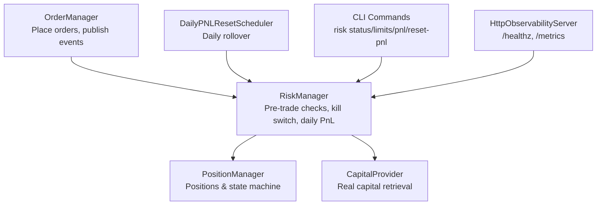
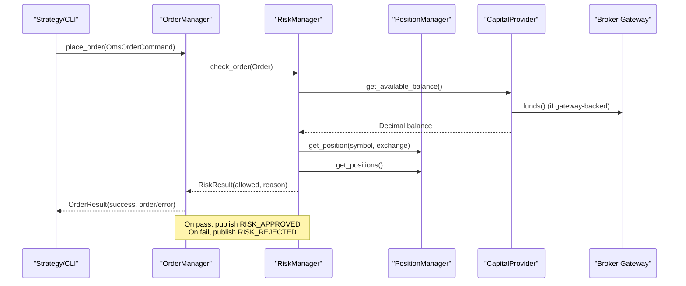
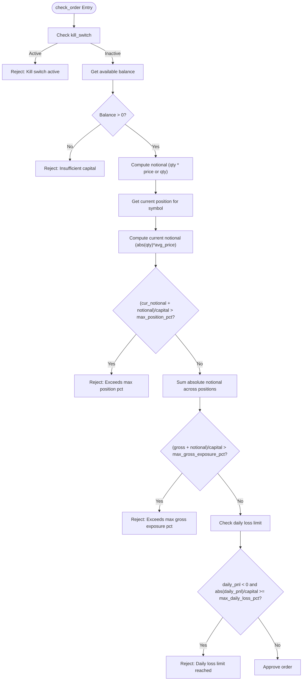
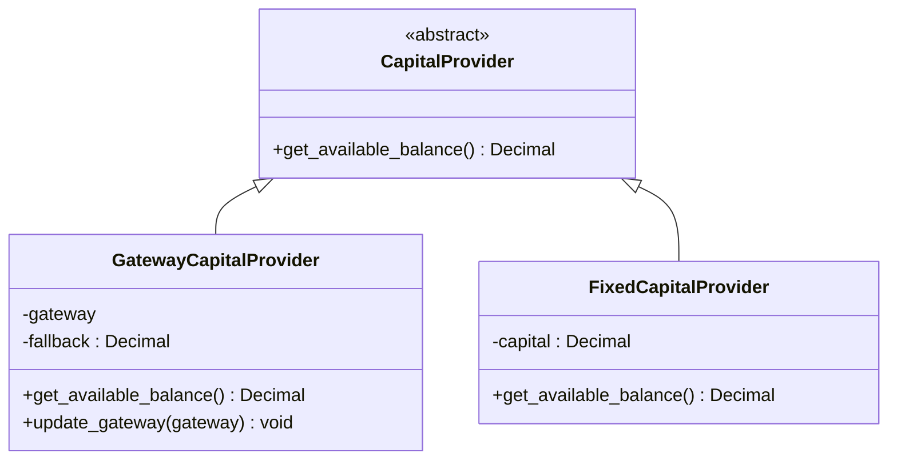
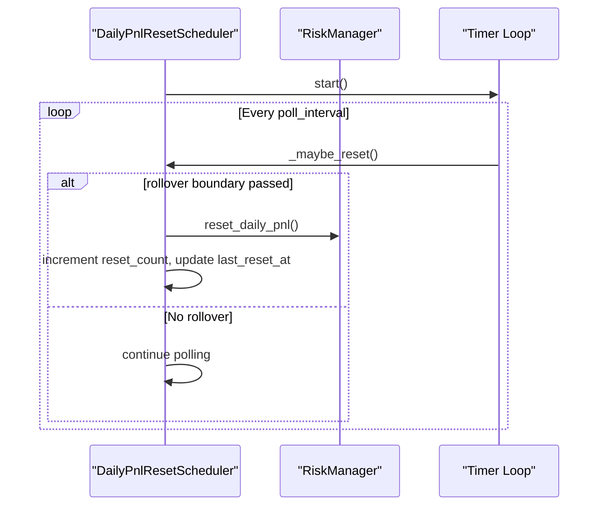
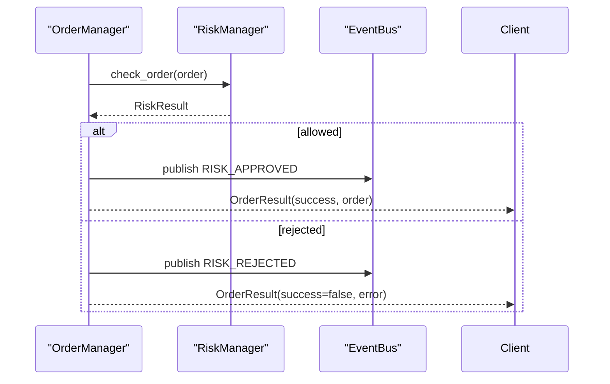
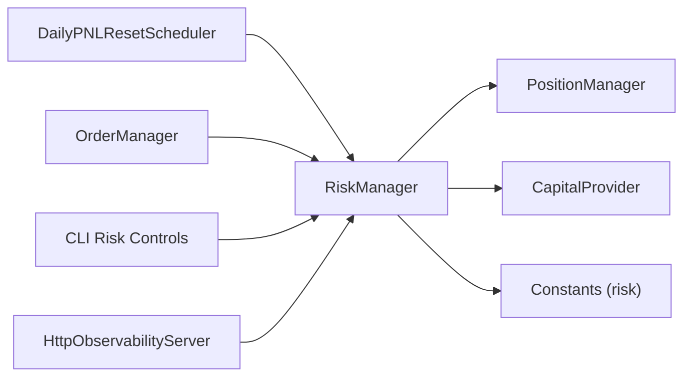

# Risk Management and Controls

<cite>
**Referenced Files in This Document**
- [risk_manager.py](file://brokers/common/oms/risk_manager.py)
- [capital_provider.py](file://brokers/common/oms/capital_provider.py)
- [daily_pnl_reset_scheduler.py](file://brokers/common/oms/daily_pnl_reset_scheduler.py)
- [position_manager.py](file://brokers/common/oms/position_manager.py)
- [order_manager.py](file://brokers/common/oms/order_manager.py)
- [risk.py](file://brokers/common/core/constants/risk.py)
- [risk_controls.py](file://cli/commands/risk_controls.py)
- [test_kill_switch_atomic_flip.py](file://tests/integration/test_kill_switch_atomic_flip.py)
- [observability_setup.py](file://cli/services/observability_setup.py)
- [http_server.py](file://brokers/common/observability/http_server.py)
</cite>

## Table of Contents
1. [Introduction](#introduction)
2. [Project Structure](#project-structure)
3. [Core Components](#core-components)
4. [Architecture Overview](#architecture-overview)
5. [Detailed Component Analysis](#detailed-component-analysis)
6. [Dependency Analysis](#dependency-analysis)
7. [Performance Considerations](#performance-considerations)
8. [Troubleshooting Guide](#troubleshooting-guide)
9. [Conclusion](#conclusion)
10. [Appendices](#appendices)

## Introduction
This document explains the risk management system with a focus on pre-trade validation and ongoing risk controls. It covers the thread-safe RiskManager implementation, position sizing and exposure limits, kill switch functionality, capital determination via CapitalProvider, automated daily loss controls via DailyPNLResetScheduler, and production observability through HTTP endpoints. Practical examples illustrate risk checks, position sizing calculations, and emergency shutdown procedures, along with guidance for integrating risk controls into order placement and monitoring risk metrics.

## Project Structure
The risk system spans several modules:
- RiskManager performs deterministic pre-trade checks and maintains daily PnL and kill switch state behind an internal RLock.
- CapitalProvider abstracts real capital retrieval from the broker gateway with graceful fallbacks.
- DailyPNLResetScheduler periodically resets daily PnL at the configured IST rollover boundary.
- OrderManager integrates RiskManager into the order placement workflow and publishes risk-related events.
- CLI commands expose risk controls for status, toggling kill switch, viewing limits, and resetting daily PnL.
- HTTP observability exposes risk state and operational metrics for production monitoring.

**Diagram sources**
- [risk_manager.py:70-258](file://brokers/common/oms/risk_manager.py#L70-L258)
- [capital_provider.py:25-94](file://brokers/common/oms/capital_provider.py#L25-L94)
- [position_manager.py:22-290](file://brokers/common/oms/position_manager.py#L22-L290)
- [order_manager.py:100-534](file://brokers/common/oms/order_manager.py#L100-L534)
- [daily_pnl_reset_scheduler.py:61-242](file://brokers/common/oms/daily_pnl_reset_scheduler.py#L61-L242)
- [risk_controls.py:26-241](file://cli/commands/risk_controls.py#L26-L241)
- [http_server.py:156-197](file://brokers/common/observability/http_server.py#L156-L197)

**Section sources**
- [risk_manager.py:1-258](file://brokers/common/oms/risk_manager.py#L1-L258)
- [capital_provider.py:1-94](file://brokers/common/oms/capital_provider.py#L1-L94)
- [daily_pnl_reset_scheduler.py:1-242](file://brokers/common/oms/daily_pnl_reset_scheduler.py#L1-L242)
- [order_manager.py:1-534](file://brokers/common/oms/order_manager.py#L1-L534)
- [position_manager.py:1-290](file://brokers/common/oms/position_manager.py#L1-L290)
- [risk_controls.py:1-241](file://cli/commands/risk_controls.py#L1-L241)
- [http_server.py:156-197](file://brokers/common/observability/http_server.py#L156-L197)

## Core Components
- RiskManager
  - Deterministic pre-trade checks: kill switch, capital availability, per-symbol position concentration, gross exposure, and daily loss limit.
  - Thread-safe via RLock; supports atomic replacement of configuration and safe daily PnL updates.
  - Exposes snapshot() for observability and CLI.
- CapitalProvider
  - Protocol-based abstraction for available balance retrieval.
  - GatewayCapitalProvider fetches funds from the broker gateway with fallback behavior.
  - FixedCapitalProvider for backtesting/paper trading.
- DailyPNLResetScheduler
  - Periodic daily rollover at IST boundary; ensures daily PnL resets to zero to prevent carry-forward across rollover.
- OrderManager
  - Integrates RiskManager into place_order; publishes RISK_APPROVED/RISK_REJECTED events; enforces idempotency and state transitions.
- CLI Risk Controls
  - Provides commands to view risk status, toggle kill switch, view limits, and reset daily PnL.
- HTTP Observability
  - Exposes /healthz and /metrics; collects risk gauges (daily PnL, kill switch state, reset counts) and other OMS metrics.

**Section sources**
- [risk_manager.py:70-258](file://brokers/common/oms/risk_manager.py#L70-L258)
- [capital_provider.py:25-94](file://brokers/common/oms/capital_provider.py#L25-L94)
- [daily_pnl_reset_scheduler.py:61-242](file://brokers/common/oms/daily_pnl_reset_scheduler.py#L61-L242)
- [order_manager.py:100-277](file://brokers/common/oms/order_manager.py#L100-L277)
- [risk_controls.py:26-241](file://cli/commands/risk_controls.py#L26-L241)
- [observability_setup.py:26-117](file://cli/services/observability_setup.py#L26-L117)
- [http_server.py:156-197](file://brokers/common/observability/http_server.py#L156-L197)

## Architecture Overview
The risk system is designed around a strict pre-trade gate enforced by RiskManager, integrated with OrderManager during order placement. Capital is resolved lazily via CapitalProvider, and daily PnL is managed by DailyPNLResetScheduler. Operators and SREs monitor risk state via CLI and HTTP observability.

**Diagram sources**
- [order_manager.py:184-277](file://brokers/common/oms/order_manager.py#L184-L277)
- [risk_manager.py:125-158](file://brokers/common/oms/risk_manager.py#L125-L158)
- [capital_provider.py:58-70](file://brokers/common/oms/capital_provider.py#L58-L70)
- [position_manager.py:163-170](file://brokers/common/oms/position_manager.py#L163-L170)

## Detailed Component Analysis

### RiskManager: Thread-Safe Pre-Trade Gate
- Role
  - Primary pre-trade gate enforcing kill switch, capital availability, per-symbol position concentration, gross exposure, and daily loss limit.
- Thread Safety
  - Internal RLock guards config, daily PnL, and reads during check_order to prevent torn reads.
  - Atomic replacement of RiskConfig via dataclass copy-on-write semantics.
- Position Sizing and Exposure Limits
  - Per-symbol concentration: compares (current_notional + proposed_notional)/capital vs max_position_pct.
  - Gross exposure: compares sum of absolute notional across all positions plus proposed notional vs max_gross_exposure_pct.
  - Daily loss: blocks orders if realized/unrealised losses exceed max_daily_loss_pct of capital.
- Kill Switch
  - set_kill_switch replaces config atomically; is_kill_switch_active returns current state safely.
- Daily PnL Management
  - update_daily_pnl sets running total; reset_daily_pnl zeroes and increments counters; snapshot exposes state for observability.
- Capital Provider Integration
  - Supports CapitalProvider protocol; wraps legacy capital_fn via adapter; defaults to FixedCapitalProvider for backtesting.

**Diagram sources**
- [risk_manager.py:125-158](file://brokers/common/oms/risk_manager.py#L125-L158)

**Section sources**
- [risk_manager.py:70-258](file://brokers/common/oms/risk_manager.py#L70-L258)

### CapitalProvider: Real Capital Determination
- Purpose
  - Protocol-based lazy retrieval of available balance to resolve initialization ordering issues.
- Implementations
  - GatewayCapitalProvider: fetches from gateway with fallback balance on failure or missing gateway.
  - FixedCapitalProvider: constant capital for backtesting/paper trading.
- Integration
  - RiskManager accepts either capital_fn (legacy) or capital_provider (preferred); defaults to FixedCapitalProvider if none provided.

**Diagram sources**
- [capital_provider.py:25-94](file://brokers/common/oms/capital_provider.py#L25-L94)

**Section sources**
- [capital_provider.py:1-94](file://brokers/common/oms/capital_provider.py#L1-L94)
- [risk_manager.py:86-116](file://brokers/common/oms/risk_manager.py#L86-L116)

### DailyPNLResetScheduler: Automated Daily Loss Controls
- Purpose
  - Ensures daily PnL resets at the configured IST rollover hour (default midnight) to prevent carry-forward across boundaries.
- Behavior
  - Polls at configurable interval; computes last rollover moment; calls reset_daily_pnl once per rollover window; tracks reset_count and last_reset_at.
- Lifecycle
  - ManagedService with lifecycle registration; stop waits with timeout; health reporting includes metrics.

**Diagram sources**
- [daily_pnl_reset_scheduler.py:184-220](file://brokers/common/oms/daily_pnl_reset_scheduler.py#L184-L220)
- [risk_manager.py:206-221](file://brokers/common/oms/risk_manager.py#L206-L221)

**Section sources**
- [daily_pnl_reset_scheduler.py:61-242](file://brokers/common/oms/daily_pnl_reset_scheduler.py#L61-L242)
- [risk_manager.py:160-221](file://brokers/common/oms/risk_manager.py#L160-L221)

### OrderManager Integration and Risk Events
- Integration
  - place_order invokes RiskManager.check_order under OMS lock; on rejection, publishes RISK_REJECTED and ORDER_REJECTED; on approval, publishes RISK_APPROVED.
- Idempotency and State Transitions
  - Uses ProcessedTradeRepository to prevent duplicate trades; enforces order state transitions via OrderStateValidator.
- Position Updates
  - Delegates trade application to OrderPositionUpdater; downstream PositionManager applies trades and publishes lifecycle events.

**Diagram sources**
- [order_manager.py:215-277](file://brokers/common/oms/order_manager.py#L215-L277)

**Section sources**
- [order_manager.py:100-277](file://brokers/common/oms/order_manager.py#L100-L277)
- [position_manager.py:22-290](file://brokers/common/oms/position_manager.py#L22-L290)

### CLI Risk Controls
- Commands
  - tradex risk status: displays available capital, daily PnL, kill switch state.
  - tradex risk kill-switch on|off: toggles kill switch via RiskManager.set_kill_switch.
  - tradex risk limits: shows configured max daily loss, max position size, and max gross exposure.
  - tradex risk pnl: prints current daily PnL.
  - tradex risk reset-pnl --confirm: resets daily PnL via RiskManager.reset_daily_pnl.
- Error Handling
  - Graceful handling of missing TradingContext or unconfigured RiskManager.

**Section sources**
- [risk_controls.py:26-241](file://cli/commands/risk_controls.py#L26-L241)

### HTTP Observability and Metrics
- Endpoints
  - /healthz: liveness endpoint returning alive status and uptime.
  - /metrics: Prometheus-style metrics including OMS event totals and extra gauges.
- Gauges Collection
  - _collect_oms_risk_gauges gathers daily_pnl, kill_switch_active, kill_switch_toggles, reset_count, and risk_fail_open_active from RiskManager snapshot.
  - Additional gauges include broker connectivity, token refresh, reconciliation, and DLQ metrics.
- Lifecycle
  - HttpObservabilityServer is started best-effort and registered with LifecycleManager for clean shutdown.

**Section sources**
- [http_server.py:156-197](file://brokers/common/observability/http_server.py#L156-L197)
- [observability_setup.py:26-117](file://cli/services/observability_setup.py#L26-L117)
- [observability_setup.py:120-178](file://cli/services/observability_setup.py#L120-L178)
- [risk_manager.py:237-258](file://brokers/common/oms/risk_manager.py#L237-L258)

## Dependency Analysis
- RiskManager depends on:
  - PositionManager for current and gross exposure computations.
  - CapitalProvider for available balance.
  - Constants for default risk thresholds.
- DailyPNLResetScheduler depends on:
  - RiskManager for reset_daily_pnl.
  - Constants for poll interval and rollover hour.
- OrderManager depends on:
  - RiskManager for pre-trade checks.
  - PositionManager indirectly via trade application.
- CLI and HTTP observability depend on RiskManager snapshot for risk state.

**Diagram sources**
- [risk_manager.py:43-51](file://brokers/common/oms/risk_manager.py#L43-L51)
- [daily_pnl_reset_scheduler.py:37-49](file://brokers/common/oms/daily_pnl_reset_scheduler.py#L37-L49)
- [order_manager.py](file://brokers/common/oms/order_manager.py#L41)
- [risk_controls.py](file://cli/commands/risk_controls.py#L33)
- [http_server.py:156-197](file://brokers/common/observability/http_server.py#L156-L197)

**Section sources**
- [risk_manager.py:1-258](file://brokers/common/oms/risk_manager.py#L1-L258)
- [daily_pnl_reset_scheduler.py:1-242](file://brokers/common/oms/daily_pnl_reset_scheduler.py#L1-L242)
- [order_manager.py:1-534](file://brokers/common/oms/order_manager.py#L1-L534)
- [risk.py:1-39](file://brokers/common/core/constants/risk.py#L1-L39)

## Performance Considerations
- Concurrency
  - Internal RLock in RiskManager prevents torn reads and ensures safe concurrent toggling of kill switch and order checks.
- Complexity
  - check_order runs in O(n) with respect to number of open positions for gross exposure calculation; acceptable for typical portfolios.
- Scheduling
  - Daily rollover poll interval balances accuracy vs CPU usage; lower intervals reduce rollover latency at the cost of more frequent checks.
- Observability
  - Snapshot and gauge collection are lightweight; avoid excessive polling in production.

[No sources needed since this section provides general guidance]

## Troubleshooting Guide
- Orders Rejected with “Insufficient capital”
  - Verify CapitalProvider is wired to a real gateway and gateway.funds() returns a positive balance; fallback balance may be in effect.
  - Confirm capital_fn/fixed provider returns expected value.
- Orders Rejected with “Exceeds max position pct” or “Exceeds max gross exposure pct”
  - Review current positions via PositionManager and adjust order quantity or price.
  - Check configured risk limits via CLI risk limits.
- Orders Rejected with “Daily loss limit reached”
  - Confirm daily PnL reset occurred at IST rollover; verify DailyPNLResetScheduler health and last_reset_at.
  - Temporarily lift restriction using CLI risk reset-pnl --confirm if appropriate.
- Kill Switch Active
  - Use CLI risk kill-switch off to resume normal operation; monitor kill_switch_toggles via snapshot/gauges.
- Observability Issues
  - Check /healthz for liveness and /metrics for risk gauges; ensure HttpObservabilityServer started and registered with LifecycleManager.

**Section sources**
- [risk_manager.py:125-158](file://brokers/common/oms/risk_manager.py#L125-L158)
- [capital_provider.py:58-70](file://brokers/common/oms/capital_provider.py#L58-L70)
- [daily_pnl_reset_scheduler.py:146-168](file://brokers/common/oms/daily_pnl_reset_scheduler.py#L146-L168)
- [risk_controls.py:81-114](file://cli/commands/risk_controls.py#L81-L114)
- [http_server.py:182-197](file://brokers/common/observability/http_server.py#L182-L197)

## Conclusion
The risk management system provides a robust, thread-safe pre-trade gate with deterministic checks, flexible capital sourcing, and automated daily controls. Integration with OrderManager ensures risk decisions are enforced consistently, while CLI and HTTP observability enable operators to monitor and manage risk state in production.

[No sources needed since this section summarizes without analyzing specific files]

## Appendices

### Practical Scenarios and Calculations
- Scenario: Pre-Trade Validation Failure
  - Example: Order exceeds per-symbol position percentage.
  - Calculation: Proposed notional vs (current notional + proposed notional)/capital vs configured max_position_pct.
  - Action: Reduce quantity or price; verify via CLI risk status and limits.
- Scenario: Daily Loss Limit Reached
  - Example: Running PnL negative and exceeds max_daily_loss_pct of capital.
  - Action: Wait for IST rollover or reset via CLI risk reset-pnl --confirm; monitor via /metrics.
- Scenario: Emergency Kill Switch Activation
  - Example: Operator toggles kill switch on.
  - Action: All orders blocked; use CLI risk kill-switch off to resume; verify kill_switch state via snapshot/gauges.

**Section sources**
- [risk_manager.py:125-158](file://brokers/common/oms/risk_manager.py#L125-L158)
- [risk_controls.py:81-114](file://cli/commands/risk_controls.py#L81-L114)
- [observability_setup.py:26-117](file://cli/services/observability_setup.py#L26-L117)

### Configuration and Thresholds
- Defaults
  - Max daily loss percent: configured via constants.
  - Max position percent per symbol: configured via constants.
  - Max gross exposure percent: configured via constants.
- Tuning
  - Adjust via configuration modules; verify with CLI risk limits and monitor via /metrics.

**Section sources**
- [risk.py:12-25](file://brokers/common/core/constants/risk.py#L12-L25)
- [risk_controls.py:116-165](file://cli/commands/risk_controls.py#L116-L165)

### Thread Safety and Race Conditions
- RiskManager’s internal RLock prevents torn reads of frozen RiskConfig and ensures atomic updates to daily PnL.
- Stress tests validate concurrent kill switch flips and order checks under load.

**Section sources**
- [risk_manager.py:112-121](file://brokers/common/oms/risk_manager.py#L112-L121)
- [test_kill_switch_atomic_flip.py:52-98](file://tests/integration/test_kill_switch_atomic_flip.py#L52-L98)