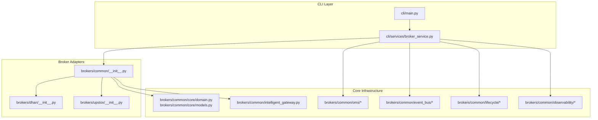
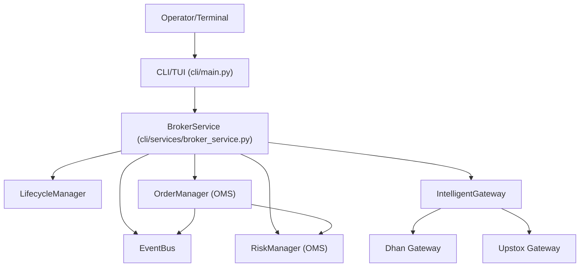
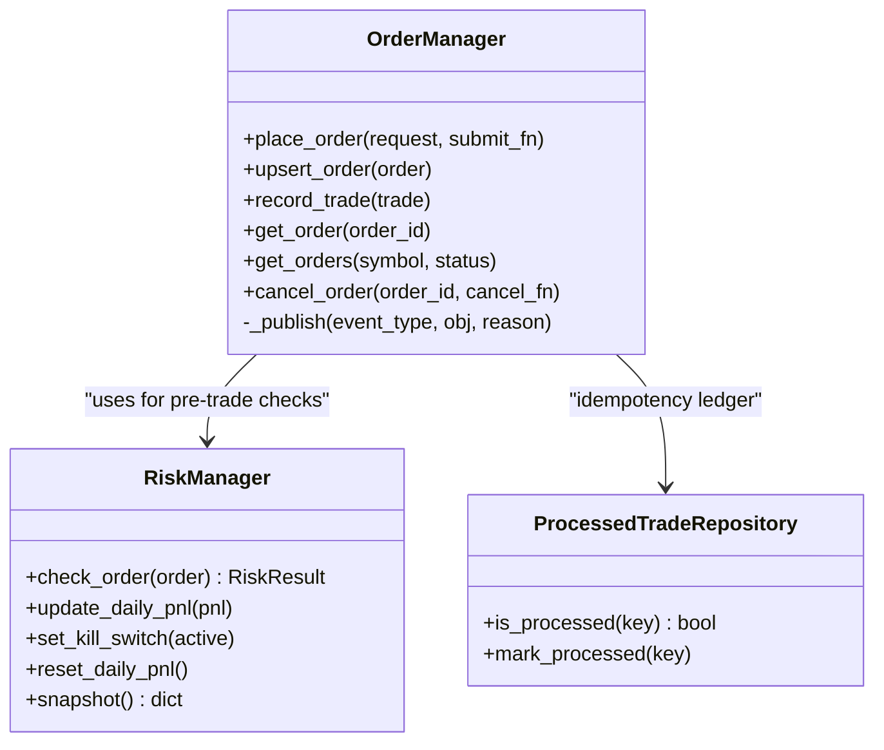
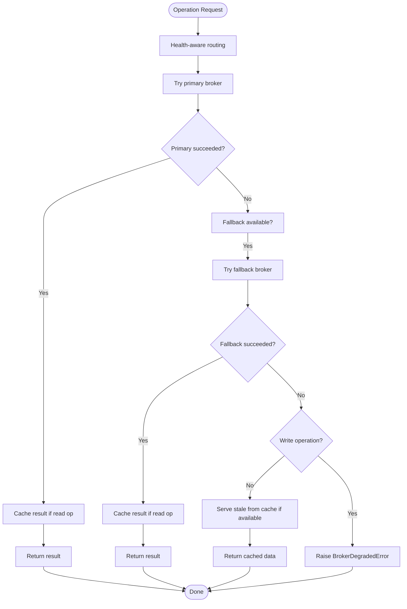
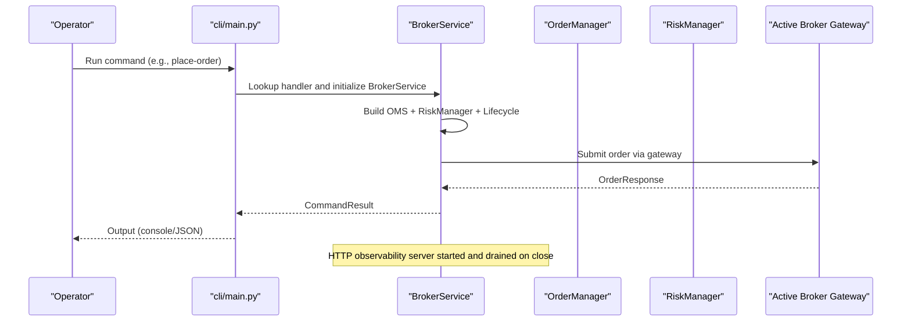
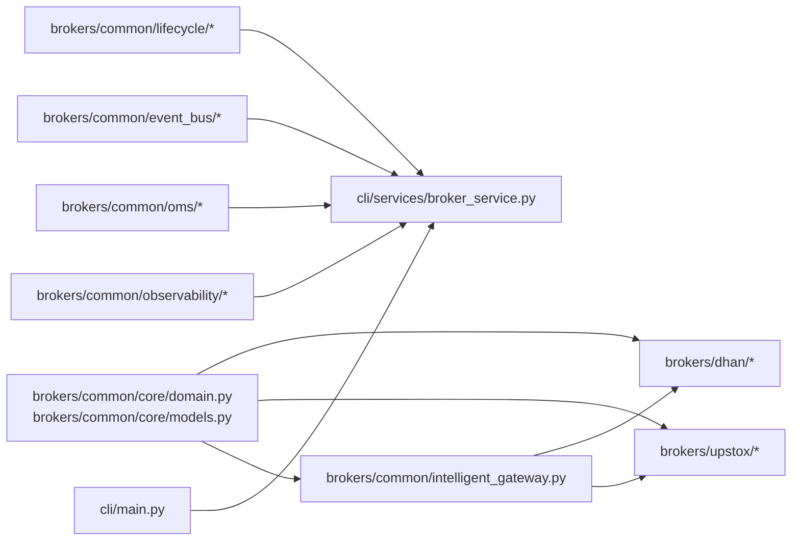

# Project Overview

<cite>
**Referenced Files in This Document**
- [README.md](file://README.md)
- [brokers/common/__init__.py](file://brokers/common/__init__.py)
- [brokers/common/core/domain.py](file://brokers/common/core/domain.py)
- [brokers/common/core/models.py](file://brokers/common/core/models.py)
- [brokers/common/intelligent_gateway.py](file://brokers/common/intelligent_gateway.py)
- [brokers/common/oms/__init__.py](file://brokers/common/oms/__init__.py)
- [brokers/common/oms/order_manager.py](file://brokers/common/oms/order_manager.py)
- [brokers/common/oms/risk_manager.py](file://brokers/common/oms/risk_manager.py)
- [brokers/common/event_bus/__init__.py](file://brokers/common/event_bus/__init__.py)
- [brokers/common/lifecycle/__init__.py](file://brokers/common/lifecycle/__init__.py)
- [brokers/common/observability/__init__.py](file://brokers/common/observability/__init__.py)
- [brokers/dhan/__init__.py](file://brokers/dhan/__init__.py)
- [brokers/upstox/__init__.py](file://brokers/upstox/__init__.py)
- [cli/main.py](file://cli/main.py)
- [cli/services/broker_service.py](file://cli/services/broker_service.py)
</cite>

## Table of Contents
1. [Introduction](#introduction)
2. [Project Structure](#project-structure)
3. [Core Components](#core-components)
4. [Architecture Overview](#architecture-overview)
5. [Detailed Component Analysis](#detailed-component-analysis)
6. [Dependency Analysis](#dependency-analysis)
7. [Performance Considerations](#performance-considerations)
8. [Troubleshooting Guide](#troubleshooting-guide)
9. [Conclusion](#conclusion)

## Introduction
TradeXV2 is a production-ready, broker-agnostic algorithmic trading framework tailored for Indian exchanges (NSE, BSE, MCX). It integrates DhanHQ and Upstox as first-class broker adapters, a Rich/Textual CLI/TUI diagnostic terminal, and a complete trading stack including Central OMS, event bus, risk management, portfolio, strategy, backtesting, and replay capabilities. The framework emphasizes correctness, observability, and resilience with thread-safe risk management, HTTP observability, and chaos testing.

Key production highlights include:
- Central OMS on the live CLI path with canonical RiskManager, kill switch, and daily PnL reset scheduling.
- Split Dhan circuit breakers across categories with read failures not blocking order placement.
- Thread-safe RiskManager with RLock ensuring atomic reads/writes and preventing torn reads during kill-switch flips.
- LifecycleManager owning every background service, draining TokenRefreshScheduler, ReconciliationService, and scheduled tasks deterministically.
- HTTP observability surface exposing health, readiness, and Prometheus metrics for OMS risk state.
- Chaos test suite validating failure modes such as token expiry, concurrency idempotency, kill-switch flips, and lifecycle drain under load.
- Dead-code elimination and canonical domain types as the single source of truth.

## Project Structure
The repository is organized into cohesive packages:
- brokers/common: Broker-agnostic core types, lifecycle, observability, OMS, event bus, resilience, and gateway abstractions.
- brokers/dhan and brokers/upstox: First-class broker adapters implementing market data, order, portfolio, and related capabilities.
- cli: Rich/Textual CLI/TUI with command routing, broker selection, and observability integration.
- analytics, datalake: Backtesting, scanning, replay, and read-only gateway with TradeJournal WAL.
- tests/chaos: Deterministic failure-mode tests for production hardening.

**Diagram sources**
- [cli/main.py:1-609](file://cli/main.py#L1-L609)
- [cli/services/broker_service.py:1-406](file://cli/services/broker_service.py#L1-L406)
- [brokers/common/__init__.py:1-68](file://brokers/common/__init__.py#L1-L68)
- [brokers/common/core/domain.py:1-67](file://brokers/common/core/domain.py#L1-L67)
- [brokers/common/core/models.py:1-546](file://brokers/common/core/models.py#L1-L546)
- [brokers/common/intelligent_gateway.py:1-534](file://brokers/common/intelligent_gateway.py#L1-L534)
- [brokers/common/oms/__init__.py:1-24](file://brokers/common/oms/__init__.py#L1-L24)
- [brokers/common/event_bus/__init__.py:1-40](file://brokers/common/event_bus/__init__.py#L1-L40)
- [brokers/common/lifecycle/__init__.py:1-19](file://brokers/common/lifecycle/__init__.py#L1-L19)
- [brokers/common/observability/__init__.py:1-14](file://brokers/common/observability/__init__.py#L1-L14)
- [brokers/dhan/__init__.py:1-97](file://brokers/dhan/__init__.py#L1-L97)
- [brokers/upstox/__init__.py:1-34](file://brokers/upstox/__init__.py#L1-L34)

**Section sources**
- [README.md:50-83](file://README.md#L50-L83)
- [cli/main.py:1-609](file://cli/main.py#L1-L609)
- [cli/services/broker_service.py:1-406](file://cli/services/broker_service.py#L1-L406)

## Core Components
- Canonical Domain Types: The single source of truth for all domain models crossing adapter, OMS, CLI, analytics, and tests. Includes Order, Position, Holding, Trade, Quote, MarketDepth, and request/input shapes.
- LifecycleManager: Centralized lifecycle ownership for all background services, ensuring deterministic start/stop and draining of schedulers and services.
- IntelligentGateway: Routes operations to the fastest broker for each capability, with graceful degradation, health-aware routing, and in-memory caching for read operations.
- Central OMS: Thread-safe order management with idempotency, risk checks, state validation, audit logging, and event publishing.
- Event Bus: Lock-safe pub/sub with dead-letter queue and processed trade repository for idempotent trade ingestion.
- Risk Management: Deterministic pre-trade checks with thread-safe state, kill switch, daily PnL rollover, and capital-provider integration.
- HTTP Observability: Liveness/readiness probes and Prometheus metrics for OMS risk state and lifecycle health.

Practical examples:
- Order placement: CLI invokes BrokerService, which coordinates with OMS and RiskManager, then submits to the active broker gateway.
- Market data streaming: IntelligentGateway routes LTP/quotes to Upstox and history/depth to Dhan, with health monitoring and cache fallbacks.
- Backtesting: Analytics/backtest modules consume canonical domain types and replay orchestration for deterministic runs.

**Section sources**
- [brokers/common/core/domain.py:1-67](file://brokers/common/core/domain.py#L1-L67)
- [brokers/common/core/models.py:1-546](file://brokers/common/core/models.py#L1-L546)
- [brokers/common/lifecycle/__init__.py:1-19](file://brokers/common/lifecycle/__init__.py#L1-L19)
- [brokers/common/intelligent_gateway.py:1-534](file://brokers/common/intelligent_gateway.py#L1-L534)
- [brokers/common/oms/order_manager.py:1-534](file://brokers/common/oms/order_manager.py#L1-L534)
- [brokers/common/oms/risk_manager.py:1-258](file://brokers/common/oms/risk_manager.py#L1-L258)
- [brokers/common/event_bus/__init__.py:1-40](file://brokers/common/event_bus/__init__.py#L1-L40)
- [brokers/common/observability/__init__.py:1-14](file://brokers/common/observability/__init__.py#L1-L14)
- [README.md:13-44](file://README.md#L13-L44)

## Architecture Overview
TradeXV2 mirrors a clean, broker-agnostic architecture:
- Broker adapters implement a common MarketDataGateway interface and expose domain types.
- IntelligentGateway composes multiple brokers and routes operations based on capability and performance.
- CLI/TUI uses BrokerService as a single composition root, wiring lifecycle, OMS, observability, and event bus.
- OMS encapsulates order state, risk checks, and event-driven reconciliation.
- Observability surfaces health and metrics for production monitoring.

**Diagram sources**
- [cli/main.py:1-609](file://cli/main.py#L1-L609)
- [cli/services/broker_service.py:1-406](file://cli/services/broker_service.py#L1-L406)
- [brokers/common/intelligent_gateway.py:1-534](file://brokers/common/intelligent_gateway.py#L1-L534)
- [brokers/common/oms/order_manager.py:1-534](file://brokers/common/oms/order_manager.py#L1-L534)
- [brokers/common/oms/risk_manager.py:1-258](file://brokers/common/oms/risk_manager.py#L1-L258)
- [brokers/common/event_bus/__init__.py:1-40](file://brokers/common/event_bus/__init__.py#L1-L40)
- [brokers/common/lifecycle/__init__.py:1-19](file://brokers/common/lifecycle/__init__.py#L1-L19)

## Detailed Component Analysis

### Central OMS and Risk Management
The Central OMS ensures single ownership of order state with thread-safe operations, idempotency, and deterministic risk checks. RiskManager performs pre-trade checks (kill switch, capital sufficiency, position concentration, gross exposure, daily loss) under an RLock to prevent torn reads. DailyPnlResetScheduler resets running PnL at IST 00:00, and CapitalProvider resolves available balance dynamically.

**Diagram sources**
- [brokers/common/oms/order_manager.py:100-534](file://brokers/common/oms/order_manager.py#L100-L534)
- [brokers/common/oms/risk_manager.py:70-258](file://brokers/common/oms/risk_manager.py#L70-L258)

**Section sources**
- [brokers/common/oms/order_manager.py:100-534](file://brokers/common/oms/order_manager.py#L100-L534)
- [brokers/common/oms/risk_manager.py:70-258](file://brokers/common/oms/risk_manager.py#L70-L258)

### IntelligentGateway Routing and Observability
IntelligentGateway routes operations to the optimal broker per capability, with health-aware fallbacks, cache TTLs for read operations, and strict handling for write operations. It logs fallbacks and increments metrics for observability, and supports degraded mode when all brokers are unhealthy.

**Diagram sources**
- [brokers/common/intelligent_gateway.py:213-375](file://brokers/common/intelligent_gateway.py#L213-L375)

**Section sources**
- [brokers/common/intelligent_gateway.py:94-534](file://brokers/common/intelligent_gateway.py#L94-L534)

### CLI/TUI Integration and HTTP Observability
The CLI/TUI entrypoint initializes logging, loads environment, and routes commands through a dispatch table. BrokerService acts as the single composition root, wiring lifecycle, OMS, observability, and event bus. It starts HTTP observability endpoints for health, readiness, and metrics, and ensures deterministic shutdown via LifecycleManager.

**Diagram sources**
- [cli/main.py:477-585](file://cli/main.py#L477-L585)
- [cli/services/broker_service.py:41-406](file://cli/services/broker_service.py#L41-L406)

**Section sources**
- [cli/main.py:1-609](file://cli/main.py#L1-L609)
- [cli/services/broker_service.py:1-406](file://cli/services/broker_service.py#L1-L406)
- [README.md:13-44](file://README.md#L13-L44)

### Broker Adapters: Dhan and Upstox
- Dhan adapter: Implements MarketDataGateway and exposes Dhan v2 REST + WebSocket APIs. Provides market data feeds, order streams, and reconciliation services.
- Upstox adapter: Provides a facade that wires multiple adapters (market data v2/v3, orders, portfolio, kill switch, alerts, margin, GTT, cover, slice, etc.).

**Section sources**
- [brokers/dhan/__init__.py:1-97](file://brokers/dhan/__init__.py#L1-L97)
- [brokers/upstox/__init__.py:1-34](file://brokers/upstox/__init__.py#L1-L34)
- [README.md:169-190](file://README.md#L169-L190)

### Canonical Domain Types
The canonical domain types unify data structures across adapters, OMS, CLI, analytics, and tests. They include immutable dataclasses for orders, positions, holdings, trades, quotes, and market depth, plus request/input shapes and reconciliation types.

**Section sources**
- [brokers/common/core/domain.py:1-67](file://brokers/common/core/domain.py#L1-L67)
- [brokers/common/core/models.py:1-546](file://brokers/common/core/models.py#L1-L546)

## Dependency Analysis
- Broker-agnostic core exports canonical types and interfaces used by Dhan and Upstox adapters.
- CLI depends on BrokerService, which depends on lifecycle, OMS, observability, and event bus.
- IntelligentGateway depends on EventMetrics and BrokerHealthMonitor for observability and routing.
- OMS depends on RiskManager, ProcessedTradeRepository, and EventBus for state management and event-driven updates.

**Diagram sources**
- [brokers/common/__init__.py:1-68](file://brokers/common/__init__.py#L1-L68)
- [brokers/common/core/domain.py:1-67](file://brokers/common/core/domain.py#L1-L67)
- [brokers/common/core/models.py:1-546](file://brokers/common/core/models.py#L1-L546)
- [brokers/common/intelligent_gateway.py:1-534](file://brokers/common/intelligent_gateway.py#L1-L534)
- [brokers/common/oms/__init__.py:1-24](file://brokers/common/oms/__init__.py#L1-L24)
- [brokers/common/event_bus/__init__.py:1-40](file://brokers/common/event_bus/__init__.py#L1-L40)
- [brokers/common/lifecycle/__init__.py:1-19](file://brokers/common/lifecycle/__init__.py#L1-L19)
- [brokers/common/observability/__init__.py:1-14](file://brokers/common/observability/__init__.py#L1-L14)
- [brokers/dhan/__init__.py:1-97](file://brokers/dhan/__init__.py#L1-L97)
- [brokers/upstox/__init__.py:1-34](file://brokers/upstox/__init__.py#L1-L34)
- [cli/main.py:1-609](file://cli/main.py#L1-L609)
- [cli/services/broker_service.py:1-406](file://cli/services/broker_service.py#L1-L406)

**Section sources**
- [brokers/common/__init__.py:1-68](file://brokers/common/__init__.py#L1-L68)
- [cli/main.py:1-609](file://cli/main.py#L1-L609)
- [cli/services/broker_service.py:1-406](file://cli/services/broker_service.py#L1-L406)

## Performance Considerations
- Thread-safe risk management with RLock prevents contention and race conditions across concurrent checks.
- IntelligentGateway’s cache TTLs reduce redundant broker calls for read-heavy operations.
- LifecycleManager ensures deterministic shutdown and resource cleanup, avoiding leaks and improving stability under load.
- Event bus idempotency ledger prevents double-position bugs and reduces redundant state updates.

## Troubleshooting Guide
Common operational checks and diagnostics:
- Broker connectivity and readiness: Use CLI doctor and readiness probes to validate broker health and gateway initialization.
- HTTP observability: Verify /healthz, /readyz, and /metrics endpoints for liveness, readiness, and OMS risk state.
- Kill switch and daily PnL: Confirm RiskManager snapshot and reset counters for accurate risk posture.
- Event bus replay and determinism: Use replay orchestrator and event log utilities to verify deterministic order lifecycle replay.

**Section sources**
- [README.md:161-166](file://README.md#L161-L166)
- [cli/main.py:121-177](file://cli/main.py#L121-L177)
- [cli/services/broker_service.py:113-167](file://cli/services/broker_service.py#L113-L167)
- [brokers/common/oms/risk_manager.py:237-258](file://brokers/common/oms/risk_manager.py#L237-L258)

## Conclusion
TradeXV2 delivers a production-grade, broker-agnostic trading framework for Indian exchanges with robust order management, resilient routing via IntelligentGateway, and comprehensive observability. Its canonical domain types, thread-safe risk management, and lifecycle-driven services enable reliable, deterministic trading operations across Dhan and Upstox, while the CLI/TUI provides powerful diagnostics and HTTP endpoints for operational visibility.