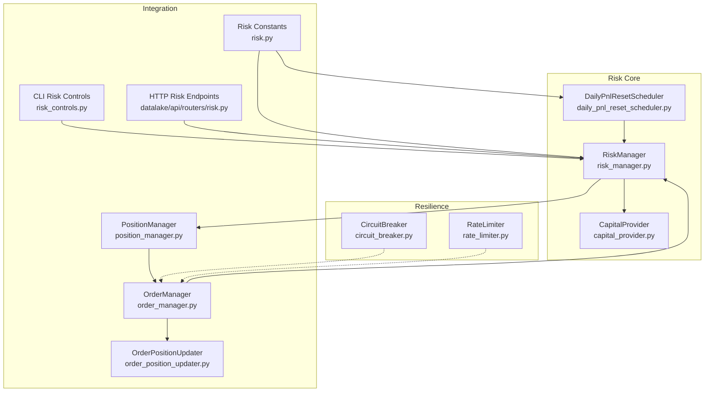
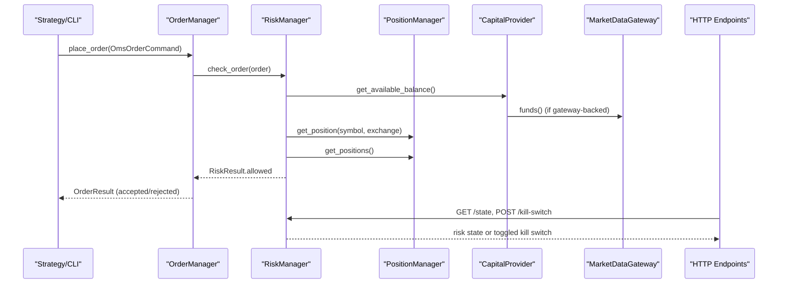
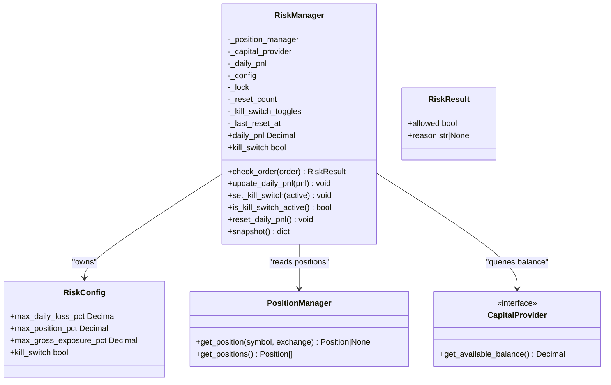
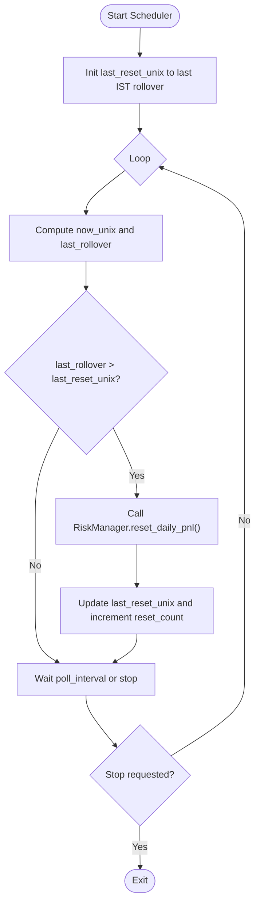
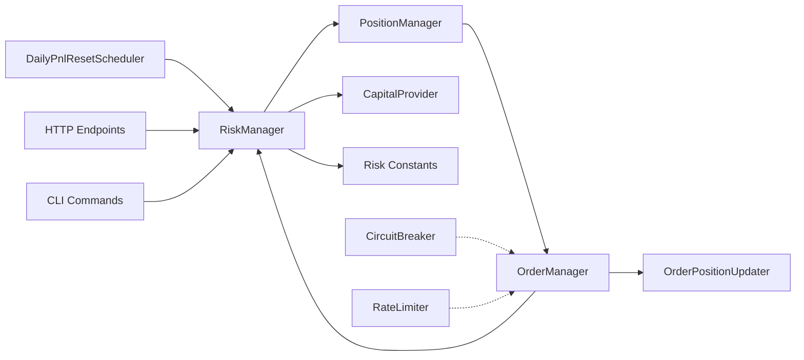

# Risk Management

<cite>
**Referenced Files in This Document**
- [risk_manager.py](file://brokers/common/oms/risk_manager.py)
- [capital_provider.py](file://brokers/common/oms/capital_provider.py)
- [daily_pnl_reset_scheduler.py](file://brokers/common/oms/daily_pnl_reset_scheduler.py)
- [circuit_breaker.py](file://brokers/common/resilience/circuit_breaker.py)
- [rate_limiter.py](file://brokers/common/resilience/rate_limiter.py)
- [risk.py](file://brokers/common/core/constants/risk.py)
- [risk.py](file://datalake/api/routers/risk.py)
- [risk_controls.py](file://cli/commands/risk_controls.py)
- [position_manager.py](file://brokers/common/oms/position_manager.py)
- [order_manager.py](file://brokers/common/oms/order_manager.py)
- [order_position_updater.py](file://brokers/common/oms/order_position_updater.py)
</cite>

## Table of Contents
1. [Introduction](#introduction)
2. [Project Structure](#project-structure)
3. [Core Components](#core-components)
4. [Architecture Overview](#architecture-overview)
5. [Detailed Component Analysis](#detailed-component-analysis)
6. [Dependency Analysis](#dependency-analysis)
7. [Performance Considerations](#performance-considerations)
8. [Troubleshooting Guide](#troubleshooting-guide)
9. [Conclusion](#conclusion)
10. [Appendices](#appendices)

## Introduction
This document explains the risk management system with a focus on position sizing, exposure controls, and production safety mechanisms. It covers the thread-safe RiskManager implementation with RLock protection, kill switch functionality, and real-time position monitoring. It documents the position sizing algorithms, exposure limits, and daily loss controls that prevent overtrading and protect capital. It also details the CapitalProvider’s role in real capital sizing based on available funds and broker-provided capital information, and the DailyPnlResetScheduler for automated PnL reset at IST 00:00. Additionally, it describes the circuit breaker implementation for handling broker outages and rate limiting strategies for API usage control. Finally, it explains the integration with order placement, position tracking, and market data feeds, and provides practical examples for configuring risk, monitoring risk metrics, and handling risk events, along with production safety considerations and risk reporting through HTTP observability endpoints.

## Project Structure
The risk management subsystem spans several modules:
- RiskManager and supporting components (risk_manager.py, capital_provider.py, daily_pnl_reset_scheduler.py)
- Resilience primitives (circuit_breaker.py, rate_limiter.py)
- Risk constants (risk.py)
- HTTP observability endpoints (risk.py in datalake/api/routers)
- CLI risk controls (risk_controls.py)
- Position and order management (position_manager.py, order_manager.py, order_position_updater.py)

**Diagram sources**
- [risk_manager.py:70-258](file://brokers/common/oms/risk_manager.py#L70-258)
- [capital_provider.py:25-94](file://brokers/common/oms/capital_provider.py#L25-94)
- [daily_pnl_reset_scheduler.py:61-242](file://brokers/common/oms/daily_pnl_reset_scheduler.py#L61-242)
- [position_manager.py:22-290](file://brokers/common/oms/position_manager.py#L22-290)
- [order_manager.py:100-200](file://brokers/common/oms/order_manager.py#L100-200)
- [order_position_updater.py:30-116](file://brokers/common/oms/order_position_updater.py#L30-116)
- [risk_controls.py:26-241](file://cli/commands/risk_controls.py#L26-241)
- [risk.py:18-44](file://datalake/api/routers/risk.py#L18-44)
- [risk.py:10-39](file://brokers/common/core/constants/risk.py#L10-39)
- [circuit_breaker.py:60-181](file://brokers/common/resilience/circuit_breaker.py#L60-181)
- [rate_limiter.py:24-154](file://brokers/common/resilience/rate_limiter.py#L24-154)

**Section sources**
- [risk_manager.py:1-258](file://brokers/common/oms/risk_manager.py#L1-258)
- [capital_provider.py:1-94](file://brokers/common/oms/capital_provider.py#L1-94)
- [daily_pnl_reset_scheduler.py:1-242](file://brokers/common/oms/daily_pnl_reset_scheduler.py#L1-242)
- [circuit_breaker.py:1-181](file://brokers/common/resilience/circuit_breaker.py#L1-181)
- [rate_limiter.py:1-154](file://brokers/common/resilience/rate_limiter.py#L1-154)
- [risk.py:1-39](file://brokers/common/core/constants/risk.py#L1-39)
- [risk.py:1-44](file://datalake/api/routers/risk.py#L1-44)
- [risk_controls.py:1-241](file://cli/commands/risk_controls.py#L1-241)
- [position_manager.py:1-290](file://brokers/common/oms/position_manager.py#L1-290)
- [order_manager.py:1-200](file://brokers/common/oms/order_manager.py#L1-200)
- [order_position_updater.py:1-116](file://brokers/common/oms/order_position_updater.py#L1-116)

## Core Components
- RiskManager: Deterministic pre-trade risk checks with thread-safe state and RLock protection. Enforces kill switch, per-symbol position concentration, gross exposure, and daily loss limits. Integrates with CapitalProvider for capital retrieval and PositionManager for position data.
- CapitalProvider: Protocol-based provider for available balance, with implementations for gateway-backed and fixed capital.
- DailyPnlResetScheduler: ManagedService that resets RiskManager’s daily PnL at IST rollover boundaries.
- Circuit Breaker: Stateful breaker to prevent cascading failures with configurable thresholds and half-open recovery.
- Rate Limiter: Token bucket and multi-category rate limiting with thread-safe acquisition and dynamic rate adjustment.
- Risk Constants: Defaults for daily loss, position, and gross exposure percentages.
- HTTP Observability: FastAPI endpoints to query risk state and toggle kill switch.
- CLI Risk Controls: Operator CLI to inspect risk state, adjust kill switch, view limits, and reset daily PnL.
- PositionManager and OrderManager: Centralized position and order state management, with RiskManager gating order placement.

**Section sources**
- [risk_manager.py:70-258](file://brokers/common/oms/risk_manager.py#L70-258)
- [capital_provider.py:25-94](file://brokers/common/oms/capital_provider.py#L25-94)
- [daily_pnl_reset_scheduler.py:61-242](file://brokers/common/oms/daily_pnl_reset_scheduler.py#L61-242)
- [circuit_breaker.py:60-181](file://brokers/common/resilience/circuit_breaker.py#L60-181)
- [rate_limiter.py:24-154](file://brokers/common/resilience/rate_limiter.py#L24-154)
- [risk.py:10-39](file://brokers/common/core/constants/risk.py#L10-39)
- [risk.py:18-44](file://datalake/api/routers/risk.py#L18-44)
- [risk_controls.py:26-241](file://cli/commands/risk_controls.py#L26-241)
- [position_manager.py:22-290](file://brokers/common/oms/position_manager.py#L22-290)
- [order_manager.py:100-200](file://brokers/common/oms/order_manager.py#L100-200)

## Architecture Overview
The risk system enforces pre-trade checks before order submission. The OrderManager coordinates idempotent order placement and delegates risk evaluation to RiskManager. RiskManager reads current positions via PositionManager, capital via CapitalProvider, and applies configured limits. Daily PnL resets are scheduled independently and atomically update RiskManager’s internal state. Resilience primitives (CircuitBreaker and RateLimiter) protect broker integrations from overload and outages. Operators and systems can observe and control risk via CLI and HTTP endpoints.

**Diagram sources**
- [order_manager.py:176-200](file://brokers/common/oms/order_manager.py#L176-200)
- [risk_manager.py:125-158](file://brokers/common/oms/risk_manager.py#L125-158)
- [position_manager.py:163-170](file://brokers/common/oms/position_manager.py#L163-170)
- [capital_provider.py:58-78](file://brokers/common/oms/capital_provider.py#L58-78)
- [risk.py:18-44](file://datalake/api/routers/risk.py#L18-44)

## Detailed Component Analysis

### RiskManager
RiskManager performs deterministic, read-only pre-trade checks inside an RLock-protected context. It evaluates:
- Kill switch: blocks all orders when active.
- Capital availability: ensures positive available balance.
- Per-symbol position concentration: compares notional of new order plus current position against capital percentage limit.
- Gross exposure: sums absolute notional across all positions and compares against capital percentage limit.
- Daily loss: blocks orders if realized/unrealized PnL for the day breaches the daily loss percentage limit.

It exposes:
- check_order(order): returns RiskResult with allowed flag and optional reason.
- update_daily_pnl(pnl): atomic update of running daily PnL.
- set_kill_switch(active)/is_kill_switch_active(): toggles and reads kill switch safely.
- reset_daily_pnl(): resets daily PnL to zero and increments counters.
- snapshot(): JSON-serializable state view for observability.

Thread-safety:
- Uses threading.RLock to guard config, daily PnL, and reads during check_order.
- Ensures no torn reads or writes across concurrent invocations.

**Diagram sources**
- [risk_manager.py:70-258](file://brokers/common/oms/risk_manager.py#L70-258)
- [position_manager.py:163-170](file://brokers/common/oms/position_manager.py#L163-170)
- [capital_provider.py:25-35](file://brokers/common/oms/capital_provider.py#L25-35)

**Section sources**
- [risk_manager.py:70-258](file://brokers/common/oms/risk_manager.py#L70-258)
- [risk.py:10-39](file://brokers/common/core/constants/risk.py#L10-39)

### CapitalProvider
CapitalProvider defines a protocol for retrieving available balance. Two implementations:
- GatewayCapitalProvider: Retrieves balance from a gateway with graceful fallback to a fixed amount when unavailable.
- FixedCapitalProvider: Supplies a constant amount for backtesting or paper trading.

Initialization flexibility:
- RiskManager supports both legacy capital_fn and the new CapitalProvider protocol, with automatic wrapping for legacy functions.

**Section sources**
- [capital_provider.py:25-94](file://brokers/common/oms/capital_provider.py#L25-94)
- [risk_manager.py:86-110](file://brokers/common/oms/risk_manager.py#L86-110)

### DailyPnlResetScheduler
ManagedService that periodically checks if the IST rollover boundary has passed and resets RiskManager’s daily PnL. It:
- Wakes up at configurable intervals.
- Computes the last IST rollover moment relative to current time.
- Resets daily PnL if the boundary has passed since the last reset.
- Tracks reset counts and last reset timestamps for observability.
- Enforces lifecycle discipline via ManagedService interface.

**Diagram sources**
- [daily_pnl_reset_scheduler.py:184-242](file://brokers/common/oms/daily_pnl_reset_scheduler.py#L184-242)
- [risk_manager.py:206-221](file://brokers/common/oms/risk_manager.py#L206-221)

**Section sources**
- [daily_pnl_reset_scheduler.py:61-242](file://brokers/common/oms/daily_pnl_reset_scheduler.py#L61-242)
- [risk.py:10-39](file://brokers/common/core/constants/risk.py#L10-39)

### Circuit Breaker
Stateful breaker with CLOSED, OPEN, and HALF_OPEN states. It:
- Tracks failure/success counts and transitions based on thresholds.
- Prevents requests when OPEN.
- Allows limited probe requests in HALF_OPEN after open duration.
- Resets counters and state upon transitions.

Thread-safety:
- Uses RLock to protect mutable state and metrics.

**Section sources**
- [circuit_breaker.py:60-181](file://brokers/common/resilience/circuit_breaker.py#L60-181)

### Rate Limiter
Token bucket rate limiter with:
- Configurable refill rate and capacity.
- Burst handling up to capacity.
- Thread-safe acquire with optional timeout.
- MultiBucketRateLimiter to manage categories (e.g., orders, quotes, data).
- Dynamic rate adjustment (reduce/increase) for adaptive throttling.

**Section sources**
- [rate_limiter.py:24-154](file://brokers/common/resilience/rate_limiter.py#L24-154)

### HTTP Observability Endpoints
FastAPI endpoints expose:
- GET /state: returns kill switch status, daily PnL, and configured risk limits.
- POST /kill-switch: toggles kill switch via dependency-injected RiskManager.

Authentication:
- Endpoints require auth via dependency.

**Section sources**
- [risk.py:18-44](file://datalake/api/routers/risk.py#L18-44)

### CLI Risk Controls
CLI commands provide:
- tradex risk status: displays available capital, daily PnL, and kill switch status.
- tradex risk kill-switch on|off: toggles kill switch.
- tradex risk limits: shows configured daily loss, position, and gross exposure limits.
- tradex risk pnl: prints current daily PnL.
- tradex risk reset-pnl --confirm: resets daily PnL to zero.

**Section sources**
- [risk_controls.py:26-241](file://cli/commands/risk_controls.py#L26-241)

### Position and Order Management Integration
- PositionManager maintains thread-safe position state and publishes lifecycle events.
- OrderManager coordinates order placement, enforces idempotency, delegates risk checks to RiskManager, and updates order state via OrderPositionUpdater.
- RiskManager relies on PositionManager for current positions and CapitalProvider for available capital.

**Section sources**
- [position_manager.py:22-290](file://brokers/common/oms/position_manager.py#L22-290)
- [order_manager.py:100-200](file://brokers/common/oms/order_manager.py#L100-200)
- [order_position_updater.py:30-116](file://brokers/common/oms/order_position_updater.py#L30-116)

## Dependency Analysis
RiskManager depends on:
- PositionManager for position data.
- CapitalProvider for available capital.
- Risk constants for default limits.

DailyPnlResetScheduler depends on:
- RiskManager for resetting daily PnL.
- Constants for rollover hour and polling interval.

HTTP endpoints and CLI depend on:
- RiskManager for state and control.

Resilience components (CircuitBreaker, RateLimiter) integrate with broker adapters and order placement to prevent overload and handle outages.

**Diagram sources**
- [risk_manager.py:70-258](file://brokers/common/oms/risk_manager.py#L70-258)
- [position_manager.py:22-290](file://brokers/common/oms/position_manager.py#L22-290)
- [capital_provider.py:25-94](file://brokers/common/oms/capital_provider.py#L25-94)
- [daily_pnl_reset_scheduler.py:61-242](file://brokers/common/oms/daily_pnl_reset_scheduler.py#L61-242)
- [risk.py:10-39](file://brokers/common/core/constants/risk.py#L10-39)
- [risk.py:18-44](file://datalake/api/routers/risk.py#L18-44)
- [risk_controls.py:26-241](file://cli/commands/risk_controls.py#L26-241)
- [order_manager.py:100-200](file://brokers/common/oms/order_manager.py#L100-200)
- [order_position_updater.py:30-116](file://brokers/common/oms/order_position_updater.py#L30-116)
- [circuit_breaker.py:60-181](file://brokers/common/resilience/circuit_breaker.py#L60-181)
- [rate_limiter.py:24-154](file://brokers/common/resilience/rate_limiter.py#L24-154)

**Section sources**
- [risk_manager.py:70-258](file://brokers/common/oms/risk_manager.py#L70-258)
- [daily_pnl_reset_scheduler.py:61-242](file://brokers/common/oms/daily_pnl_reset_scheduler.py#L61-242)
- [risk.py:10-39](file://brokers/common/core/constants/risk.py#L10-39)
- [risk.py:18-44](file://datalake/api/routers/risk.py#L18-44)
- [risk_controls.py:26-241](file://cli/commands/risk_controls.py#L26-241)
- [position_manager.py:22-290](file://brokers/common/oms/position_manager.py#L22-290)
- [order_manager.py:100-200](file://brokers/common/oms/order_manager.py#L100-200)
- [order_position_updater.py:30-116](file://brokers/common/oms/order_position_updater.py#L30-116)
- [circuit_breaker.py:60-181](file://brokers/common/resilience/circuit_breaker.py#L60-181)
- [rate_limiter.py:24-154](file://brokers/common/resilience/rate_limiter.py#L24-154)

## Performance Considerations
- RiskManager’s RLock ensures deterministic reads and atomic updates, minimizing contention in high-throughput scenarios.
- CapitalProvider defers expensive gateway calls until needed, reducing startup overhead.
- DailyPnlResetScheduler uses short poll intervals and monotonic timestamps to avoid double-firing and minimize latency.
- CircuitBreaker and RateLimiter use efficient counters and token calculations with minimal synchronization overhead.
- HTTP endpoints and CLI commands perform lightweight reads and toggles, avoiding heavy computations.

## Troubleshooting Guide
Common issues and remedies:
- Kill switch active: Orders are rejected. Use CLI or HTTP endpoint to toggle kill switch off.
- Insufficient capital: Ensure CapitalProvider returns a valid balance. For gateway-backed providers, verify connectivity and fallback behavior.
- Exceeded position or gross exposure: Reduce order size or close positions to meet limits.
- Daily loss limit reached: Wait until the next reset or adjust limits cautiously.
- Scheduler not firing: Verify IST rollover hour and poll interval configuration; check ManagedService lifecycle registration.
- Observability gaps: Use CLI status and HTTP /state to confirm state; monitor reset_count and kill_switch_toggles.

**Section sources**
- [risk_manager.py:125-158](file://brokers/common/oms/risk_manager.py#L125-158)
- [risk_controls.py:26-241](file://cli/commands/risk_controls.py#L26-241)
- [risk.py:18-44](file://datalake/api/routers/risk.py#L18-44)
- [daily_pnl_reset_scheduler.py:112-144](file://brokers/common/oms/daily_pnl_reset_scheduler.py#L112-144)

## Conclusion
The risk management system provides robust, thread-safe pre-trade controls with clear exposure limits, kill switch capability, and automated daily PnL reset. CapitalProvider enables flexible capital sourcing, while HTTP and CLI endpoints offer safe, observable control surfaces. Resilience primitives protect the system from broker outages and API overload. Together, these components form a production-grade risk framework suitable for live trading with strong safety guarantees.

## Appendices

### Practical Examples

- Configure risk limits:
  - Adjust daily loss, position, and gross exposure percentages via RiskConfig and constants.
  - Example paths: [risk.py:12-19](file://brokers/common/core/constants/risk.py#L12-L19), [risk_manager.py:56-62](file://brokers/common/oms/risk_manager.py#L56-L62)

- Monitor risk metrics:
  - CLI status: [risk_controls.py:26-78](file://cli/commands/risk_controls.py#L26-L78)
  - HTTP state: [risk.py:18-30](file://datalake/api/routers/risk.py#L18-L30)

- Toggle kill switch:
  - CLI: [risk_controls.py:81-113](file://cli/commands/risk_controls.py#L81-L113)
  - HTTP: [risk.py:33-43](file://datalake/api/routers/risk.py#L33-L43)

- Reset daily PnL:
  - CLI: [risk_controls.py:194-217](file://cli/commands/risk_controls.py#L194-L217)
  - Scheduler: [daily_pnl_reset_scheduler.py:203-219](file://brokers/common/oms/daily_pnl_reset_scheduler.py#L203-L219)

- Production safety and fail-safe mechanisms:
  - RLock-protected state in RiskManager: [risk_manager.py:112-121](file://brokers/common/oms/risk_manager.py#L112-L121)
  - ManagedService lifecycle for scheduler: [daily_pnl_reset_scheduler.py:112-144](file://brokers/common/oms/daily_pnl_reset_scheduler.py#L112-L144)
  - CircuitBreaker state transitions: [circuit_breaker.py:80-90](file://brokers/common/resilience/circuit_breaker.py#L80-L90)
  - Rate limiter acquire with timeout: [rate_limiter.py:58-90](file://brokers/common/resilience/rate_limiter.py#L58-L90)

- Customizing risk controls:
  - Implement a custom CapitalProvider: [capital_provider.py:25-35](file://brokers/common/oms/capital_provider.py#L25-L35)
  - Extend DailyPnlResetScheduler rollover hour: [daily_pnl_reset_scheduler.py:82-98](file://brokers/common/oms/daily_pnl_reset_scheduler.py#L82-L98)
  - Integrate with order placement: [order_manager.py:176-181](file://brokers/common/oms/order_manager.py#L176-L181)