# Testing and Quality Assurance

<cite>
**Referenced Files in This Document**
- [.pre-commit-config.yaml](file://.pre-commit-config.yaml)
- [pyproject.toml](file://pyproject.toml)
- [tests/conftest.py](file://tests/conftest.py)
- [tests/chaos/test_failure_modes.py](file://tests/chaos/test_failure_modes.py)
- [tests/architecture/test_gateway_abc_compliance.py](file://tests/architecture/test_gateway_abc_compliance.py)
- [tests/performance/test_benchmarks.py](file://tests/performance/test_benchmarks.py)
- [tests/e2e/test_complete_trading_flow.py](file://tests/e2e/test_complete_trading_flow.py)
- [tests/integration/test_upstox_gateway_integration.py](file://tests/integration/test_upstox_gateway_integration.py)
- [tests/quant/test_quant_parity.py](file://tests/quant/test_quant_parity.py)
- [tests/regression/test_memory_leaks.py](file://tests/regression/test_memory_leaks.py)
- [tests/api/test_performance.py](file://tests/api/test_performance.py)
- [tests/api/test_health.py](file://tests/api/test_health.py)
- [tests/api/test_auth.py](file://tests/api/test_auth.py)
- [tests/api/test_market_endpoints.py](file://tests/api/test_market_endpoints.py)
- [tests/api/test_order_endpoints.py](file://tests/api/test_order_endpoints.py)
- [tests/api/test_portfolio_endpoints.py](file://tests/api/test_portfolio_endpoints.py)
- [tests/api/test_backtest_endpoints.py](file://tests/api/test_backtest_endpoints.py)
- [tests/api/test_scanner_endpoints.py](file://tests/api/test_scanner_endpoints.py)
- [tests/api/test_replay_endpoints.py](file://tests/api/test_replay_endpoints.py)
- [tests/api/test_options_replay.py](file://tests/api/test_options_replay.py)
- [tests/api/test_freshness.py](file://tests/api/test_freshness.py)
- [tests/api/test_cache_headers.py](file://tests/api/test_cache_headers.py)
- [tests/api/test_service_container.py](file://tests/api/test_service_container.py)
- [tests/api/test_vectorized_candles.py](file://tests/api/test_vectorized_candles.py)
- [tests/api/test_oms_lifecycle.py](file://tests/api/test_oms_lifecycle.py)
- [tests/api/test_order_validation.py](file://tests/api/test_order_validation.py)
- [tests/api/test_options_bid_ask.py](file://tests/api/test_options_bid_ask.py)
- [tests/api/test_market_analytics.py](file://tests/api/test_market_analytics.py)
- [tests/api/test_analytics_endpoints.py](file://tests/api/test_analytics_endpoints.py)
- [tests/integration/test_gateway_contract.py](file://tests/integration/test_gateway_contract.py)
- [tests/integration/test_upstox_market_data.py](file://tests/integration/test_upstox_market_data.py)
- [tests/integration/test_upstox_order_lifecycle.py](file://tests/integration/test_upstox_order_lifecycle.py)
- [tests/integration/test_kill_switch_atomic_flip.py](file://tests/integration/test_kill_switch_atomic_flip.py)
- [tests/integration/test_processed_trade_repository_crash_recovery.py](file://tests/integration/test_processed_trade_repository_crash_recovery.py)
- [tests/integration/test_upstox_gateway_integration.py](file://tests/integration/test_upstox_gateway_integration.py)
- [tests/oms/test_order_state_transitions.py](file://tests/oms/test_order_state_transitions.py)
- [tests/oms/test_processed_trade_repository_singleton.py](file://tests/oms/test_processed_trade_repository_singleton.py)
- [tests/quant/baseline.py](file://tests/quant/baseline.py)
- [tests/quant/golden/feature_parity.json](file://tests/quant/golden/feature_parity.json)
- [tests/quant/golden/replay_pnl.json](file://tests/quant/golden/replay_pnl.json)
- [tests/quant/golden/resample_correctness.json](file://tests/quant/golden/resample_correctness.json)
- [tests/quant/golden/scanner_determinism.json](file://tests/quant/golden/scanner_determinism.json)
- [tests/chaos/test_data_corruption.py](file://tests/chaos/test_data_corruption.py)
- [tests/chaos/test_failover.py](file://tests/chaos/test_failover.py)
- [tests/chaos/test_network_partitions.py](file://tests/chaos/test_network_partitions.py)
- [tests/chaos/test_recovery_certification.py](file://tests/chaos/test_recovery_certification.py)
- [tests/e2e/test_order_lifecycle.py](file://tests/e2e/test_order_lifecycle.py)
- [tests/e2e/test_multi_broker_failover.py](file://tests/e2e/test_multi_broker_failover.py)
- [tests/e2e/test_replay_backtest_flow.py](file://tests/e2e/test_replay_backtest_flow.py)
- [tests/e2e/test_scanner_to_order_flow.py](file://tests/e2e/test_scanner_to_order_flow.py)
- [tests/e2e/README.md](file://tests/e2e/README.md)
- [tests/performance/test_performance.py](file://tests/performance/test_performance.py)
- [tests/performance/test_data_performance.py](file://tests/performance/test_data_performance.py)
- [tests/performance/test_benchmarks.py](file://tests/performance/test_benchmarks.py)
- [tests/regression/test_memory_leaks.py](file://tests/regression/test_memory_leaks.py)
- [tests/test_token_expiry_validation.py](file://tests/test_token_expiry_validation.py)
- [tests/test_security_findings.py](file://tests/test_security_findings.py)
- [tests/test_sql_injection.py](file://tests/test_sql_injection.py)
- [tests/test_connection_pool.py](file://tests/test_connection_pool.py)
- [tests/test_async_event_bus.py](file://tests/test_async_event_bus.py)
- [tests/test_buffered_event_log.py](file://tests/test_buffered_event_log.py)
- [tests/test_instruments.py](file://tests/test_instruments.py)
- [tests/test_instrument_registry.py](file://tests/test_instrument_registry.py)
- [tests/test_order_mapping.py](file://tests/test_order_mapping.py)
- [tests/test_replay_orchestrator.py](file://tests/test_replay_orchestrator.py)
- [tests/test_scanner_runner.py](file://tests/test_scanner_runner.py)
- [tests/test_identity.py](file://tests/test_identity.py)
- [tests/test_identity_coercion.py](file://tests/test_identity_coercion.py)
- [tests/test_invariants.py](file://tests/test_invariants.py)
- [tests/test_md5_cache_disable.py](file://tests/test_md5_cache_disable.py)
- [tests/test_data_validator.py](file://tests/test_data_validator.py)
- [tests/test_download_engine.py](file://tests/test_download_engine.py)
- [tests/test_benchmark.py](file://tests/test_benchmark.py)
- [tests/test_architecture.py](file://tests/test_architecture.py)
- [cli/tests/test_broker_service_concurrency.py](file://cli/tests/test_broker_service_concurrency.py)
- [cli/tests/test_broker_service_lifecycle.py](file://cli/tests/test_broker_service_lifecycle.py)
- [cli/tests/test_command_registry.py](file://cli/tests/test_command_registry.py)
- [cli/tests/test_commands.py](file://cli/tests/test_commands.py)
- [cli/tests/test_doctor_commands.py](file://cli/tests/test_doctor_commands.py)
- [cli/tests/test_doctor_orchestrator.py](file://cli/tests/test_doctor_orchestrator.py)
- [cli/tests/test_doctor_renderer.py](file://cli/tests/test_doctor_renderer.py)
- [cli/tests/test_doctor_strategies.py](file://cli/tests/test_doctor_strategies.py)
- [cli/tests/test_http_observability_wireup.py](file://cli/tests/test_http_observability_wireup.py)
- [cli/tests/test_market_commands.py](file://cli/tests/test_market_commands.py)
- [cli/tests/test_oms_service.py](file://cli/tests/test_oms_service.py)
- [cli/tests/test_order_placement.py](file://cli/tests/test_order_placement.py)
- [cli/tests/test_portfolio_commands.py](file://cli/tests/test_portfolio_commands.py)
- [cli/tests/test_risk_controls.py](file://cli/tests/test_risk_controls.py)
- [cli/tests/test_timeout_retry_error.py](file://cli/tests/test_timeout_retry_error.py)
- [cli/tests/test_tui.py](file://cli/tests/test_tui.py)
- [cli/tests/test_validate_commands.py](file://cli/tests/test_validate_commands.py)
- [cli/tests/test_verbose_timing_flags.py](file://cli/tests/test_verbose_timing_flags.py)
- [cli/tests/test_views_journal_commands.py](file://cli/tests/test_views_journal_commands.py)
- [cli/tests/test_analytics_commands.py](file://cli/tests/test_analytics_commands.py)
- [cli/tests/test_broker_registry.py](file://cli/tests/test_broker_registry.py)
- [cli/tests/test_b7_oms_wireup.py](file://cli/tests/test_b7_oms_wireup.py)
- [cli/load_testing/runner.py](file://cli/load_testing/runner.py)
- [cli/commands/load_test.py](file://cli/commands/load_test.py)
- [datalake/tests/test_health_check.py](file://datalake/tests/test_health_check.py)
- [datalake/tests/test_duckdb_e2e.py](file://datalake/tests/test_duckdb_e2e.py)
- [datalake/tests/test_gateway_batch.py](file://datalake/tests/test_gateway_batch.py)
- [datalake/tests/test_integration.py](file://datalake/tests/test_integration.py)
- [datalake/tests/test_journal.py](file://datalake/tests/test_journal.py)
- [datalake/tests/test_normalize.py](file://datalake/tests/test_normalize.py)
- [datalake/tests/test_option_format.py](file://datalake/tests/test_option_format.py)
- [datalake/tests/test_options_analytics.py](file://datalake/tests/test_options_analytics.py)
- [datalake/tests/test_paths.py](file://datalake/tests/test_paths.py)
- [datalake/tests/test_quality.py](file://datalake/tests/test_quality.py)
- [datalake/tests/test_retry.py](file://datalake/tests/test_retry.py)
- [datalake/tests/test_scan_store.py](file://datalake/tests/test_scan_store.py)
- [datalake/tests/test_schema.py](file://datalake/tests/test_schema.py)
- [datalake/tests/test_symbols.py](file://datalake/tests/test_symbols.py)
- [datalake/tests/test_update_env_token.py](file://datalake/tests/test_update_env_token.py)
- [datalake/tests/test_validation.py](file://datalake/tests/test_validation.py)
- [datalake/tests/test_atomic_io.py](file://datalake/tests/test_atomic_io.py)
- [datalake/tests/test_catalog.py](file://datalake/tests/test_catalog.py)
- [datalake/tests/test_converter.py](file://datalake/tests/test_converter.py)
- [datalake/tests/test_gateway_batch.py](file://datalake/tests/test_gateway_batch.py)
- [datalake/tests/test_paths.py](file://datalake/tests/test_paths.py)
- [datalake/tests/test_retry.py](file://datalake/tests/test_retry.py)
- [datalake/tests/test_scan_store.py](file://datalake/tests/test_scan_store.py)
- [datalake/tests/test_symbols.py](file://datalake/tests/test_symbols.py)
- [datalake/tests/test_update_env_token.py](file://datalake/tests/test_update_env_token.py)
- [datalake/tests/test_validation.py](file://datalake/tests/test_validation.py)
- [analytics/tests/test_backtest.py](file://analytics/tests/test_backtest.py)
- [analytics/tests/test_core.py](file://analytics/tests/test_core.py)
- [analytics/tests/test_features.py](file://analytics/tests/test_features.py)
- [analytics/tests/test_indicators.py](file://analytics/tests/test_indicators.py)
- [analytics/tests/test_market_structure.py](file://analytics/tests/test_market_structure.py)
- [analytics/tests/test_options.py](file://analytics/tests/test_options.py)
- [analytics/tests/test_orderflow.py](file://analytics/tests/test_orderflow.py)
- [analytics/tests/test_paper.py](file://analytics/tests/test_paper.py)
- [analytics/tests/test_pipeline.py](file://analytics/tests/test_pipeline.py)
- [analytics/tests/test_providers.py](file://analytics/tests/test_providers.py)
- [analytics/tests/test_ranking_determinism.py](file://analytics/tests/test_ranking_determinism.py)
- [analytics/tests/test_replay.py](file://analytics/tests/test_replay.py)
- [analytics/tests/test_reports.py](file://analytics/tests/test_reports.py)
- [analytics/tests/test_scanner.py](file://analytics/tests/test_scanner.py)
- [analytics/tests/test_sector.py](file://analytics/tests/test_sector.py)
- [analytics/tests/test_stocks.py](file://analytics/tests/test_stocks.py)
- [analytics/tests/test_strategy.py](file://analytics/tests/test_strategy.py)
- [analytics/tests/test_visualizations.py](file://analytics/tests/test_visualizations.py)
- [analytics/tests/test_volatility.py](file://analytics/tests/test_volatility.py)
- [analytics/tests/test_volume_profile.py](file://analytics/tests/test_volume_profile.py)
- [analytics/views/tests/test_view_determinism.py](file://analytics/views/tests/test_view_determinism.py)
- [analytics/views/tests/test_views.py](file://analytics/views/tests/test_views.py)
- [analytics/scanner/tests/test_determinism.py](file://analytics/scanner/tests/test_determinism.py)
- [analytics/scanner/tests/test_scanner_performance.py](file://analytics/scanner/tests/test_scanner_performance.py)
- [analytics/stocks/tests/test_find_levels.py](file://analytics/stocks/tests/test_find_levels.py)
- [analytics/indicators/tests/test_halftrend.py](file://analytics/indicators/tests/test_halftrend.py)
- [analytics/backtest/tests/test_comparator.py](file://analytics/backtest/tests/test_comparator.py)
- [analytics/backtest/tests/test_optimizer.py](file://analytics/backtest/tests/test_optimizer.py)
- [analytics/replay/tests/test_replay_memory.py](file://analytics/replay/tests/test_replay_memory.py)
- [brokers/common/tests/test_gateway_contract_integration.py](file://brokers/common/tests/test_gateway_contract_integration.py)
- [tests/integration/test_cross_broker_parity.py](file://tests/integration/test_cross_broker_parity.py)
- [tests/integration/test_execution_parity.py](file://tests/integration/test_execution_parity.py)
- [tests/quant/test_cross_broker_parity.py](file://tests/quant/test_cross_broker_parity.py)
- [tests/property/test_property_based.py](file://tests/property/test_property_based.py)
- [tests/property/test_domain_properties.py](file://tests/property/test_domain_properties.py)
- [tests/quant/parity_config.py](file://tests/quant/parity_config.py)
- [.github/workflows/mutation_nightly.yml](file://.github/workflows/mutation_nightly.yml)
- [tests/integration/test_runtime_validation_audit.py](file://tests/integration/test_runtime_validation_audit.py)
- [tests/integration/test_trading_runtime_orchestrator.py](file://tests/integration/test_trading_runtime_orchestrator.py)
- [runtime/trading_runtime_factory.py](file://runtime/trading_runtime_factory.py)
- [brokers/common/services/production_readiness.py](file://brokers/common/services/production_readiness.py)
- [brokers/common/services/tests/test_production_readiness_fail_closed.py](file://brokers/common/services/tests/test_production_readiness_fail_closed.py)
- [scripts/production_certification.py](file://scripts/production_certification.py)
</cite>

## Table of Contents
1. [Introduction](#introduction)
2. [Project Structure](#project-structure)
3. [Core Components](#core-components)
4. [Architecture Overview](#architecture-overview)
5. [Detailed Component Analysis](#detailed-component-analysis)
6. [Dependency Analysis](#dependency-analysis)
7. [Performance Considerations](#performance-considerations)
8. [Troubleshooting Guide](#troubleshooting-guide)
9. [Conclusion](#conclusion)
10. [Appendices](#appendices)

## Introduction
This document describes the comprehensive testing and quality assurance practices for the project. It covers the multi-layered testing approach (unit, integration, chaos, end-to-end, architecture, quant, regression, performance), continuous integration and code quality tooling, and practical guidance for writing, running, and interpreting tests across major components such as broker adapters, CLI commands, analytics modules, and the data lake.

**Updated** The testing framework now includes expanded cross-broker parity validation, execution parity testing, runtime validation audit testing, production readiness validation, and enhanced property-based testing and mutation testing for improved code quality and reliability.

## Project Structure
The test suite is organized by layers and domains:
- Unit and integration tests for core modules (brokers, analytics, CLI, data lake)
- Architecture tests enforcing cross-cutting contracts and domain invariants
- Chaos tests simulating deterministic production failure modes
- End-to-end tests validating complete trading workflows
- Quantitative parity tests ensuring determinism and correctness
- Regression tests guarding against memory leaks and performance regressions
- API tests validating backend endpoints and observability
- CLI tests covering command-line workflows and integrations
- Data lake tests validating ingestion, normalization, and query paths
- **New** Runtime validation audit tests for trading runtime factory and orchestrator components
- **New** Production readiness tests ensuring fail-closed safety gates
- **New** Property-based tests using Hypothesis for edge case discovery
- **New** Mutation testing for fault detection and code quality assessment

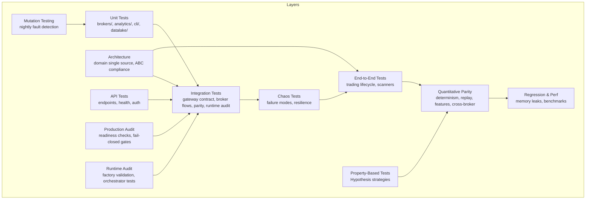

**Diagram sources**
- [tests/integration/test_cross_broker_parity.py:1-120](file://tests/integration/test_cross_broker_parity.py#L1-L120)
- [tests/integration/test_execution_parity.py:1-83](file://tests/integration/test_execution_parity.py#L1-L83)
- [tests/integration/test_runtime_validation_audit.py:1-86](file://tests/integration/test_runtime_validation_audit.py#L1-L86)
- [tests/integration/test_trading_runtime_orchestrator.py:1-75](file://tests/integration/test_trading_runtime_orchestrator.py#L1-L75)
- [tests/quant/test_cross_broker_parity.py:1-164](file://tests/quant/test_cross_broker_parity.py#L1-L164)
- [tests/property/test_property_based.py:1-266](file://tests/property/test_property_based.py#L1-L266)
- [.github/workflows/mutation_nightly.yml:1-26](file://.github/workflows/mutation_nightly.yml#L1-L26)

**Section sources**
- [pyproject.toml:47-71](file://pyproject.toml#L47-L71)

## Core Components
- Multi-layered test discovery and markers configured via pytest configuration.
- Shared fixtures for market hours, credential validity, and token expiry checks.
- Pre-commit hooks integrating Ruff, MyPy, and common hygiene checks.
- Coverage configuration targeting core packages and excluding tests.
- **New** Parity enforcement configuration with environment variable controls.
- **New** Property-based testing strategies using Hypothesis for comprehensive edge case coverage.
- **New** Runtime validation audit testing for trading runtime factory and orchestrator components.
- **New** Production readiness validation ensuring fail-closed safety gates.

Key capabilities:
- Test discovery across modules and markers for selective runs.
- Live credential gating with token expiry detection and skip logic.
- Static analysis and formatting enforcement via pre-commit.
- **New** Parity test markers for cross-broker and execution parity validation.
- **New** Runtime audit tests validating trading context, event bus, and orchestrator wiring.
- **New** Production readiness tests ensuring safety gates and fail-closed behavior.
- **New** Nightly mutation testing for fault detection in critical modules.

**Section sources**
- [pyproject.toml:47-71](file://pyproject.toml#L47-L71)
- [pyproject.toml:73-92](file://pyproject.toml#L73-L92)
- [pyproject.toml:114-152](file://pyproject.toml#L114-L152)
- [tests/conftest.py:66-134](file://tests/conftest.py#L66-L134)
- [.pre-commit-config.yaml:1-28](file://.pre-commit-config.yaml#L1-L28)
- [tests/quant/parity_config.py:1-69](file://tests/quant/parity_config.py#L1-L69)
- [tests/integration/test_runtime_validation_audit.py:1-86](file://tests/integration/test_runtime_validation_audit.py#L1-L86)
- [brokers/common/services/production_readiness.py:1-338](file://brokers/common/services/production_readiness.py#L1-L338)

## Architecture Overview
The testing architecture enforces cross-cutting concerns and contract compliance:
- Gateway contract compliance ensures all broker gateways implement the same interface.
- Domain single source validation prevents scattered domain definitions.
- Gateway ABC compliance validates method existence, signatures, and return types.
- Security and determinism tests guard against unsafe deserialization and non-reproducible computations.
- **New** Cross-broker parity validation ensures consistent data formats across Dhan, Upstox, and Paper gateways.
- **New** Execution parity testing validates identical results across replay, paper, and backtest modes.
- **New** Runtime validation audit tests ensure proper wiring of trading context, event bus, and orchestrator components.
- **New** Production readiness validation enforces fail-closed safety gates and comprehensive system checks.

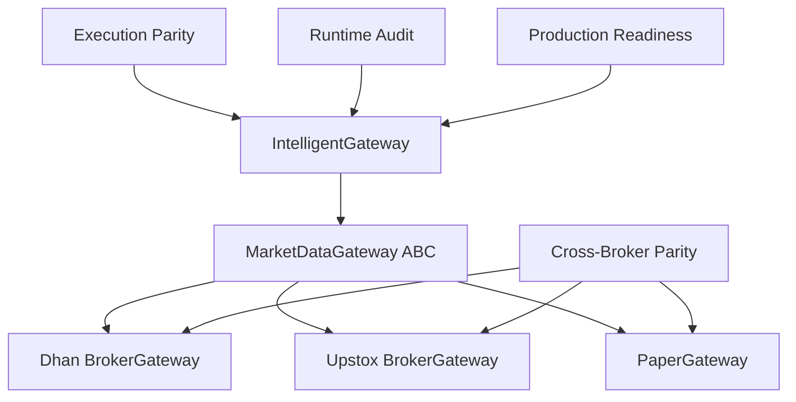

**Diagram sources**
- [tests/architecture/test_gateway_abc_compliance.py:20-133](file://tests/architecture/test_gateway_abc_compliance.py#L20-L133)
- [tests/common/tests/test_gateway_contract_integration.py:47-84](file://brokers/common/tests/test_gateway_contract_integration.py#L47-L84)
- [tests/integration/test_cross_broker_parity.py:24-120](file://tests/integration/test_cross_broker_parity.py#L24-L120)
- [tests/integration/test_execution_parity.py:52-83](file://tests/integration/test_execution_parity.py#L52-L83)
- [tests/integration/test_runtime_validation_audit.py:52-85](file://tests/integration/test_runtime_validation_audit.py#L52-L85)
- [brokers/common/services/production_readiness.py:72-138](file://brokers/common/services/production_readiness.py#L72-L138)

**Section sources**
- [tests/architecture/test_gateway_abc_compliance.py:1-276](file://tests/architecture/test_gateway_abc_compliance.py#L1-L276)
- [tests/common/tests/test_gateway_contract_integration.py:1-617](file://brokers/common/tests/test_gateway_contract_integration.py#L1-L617)
- [tests/integration/test_cross_broker_parity.py:1-120](file://tests/integration/test_cross_broker_parity.py#L1-L120)
- [tests/integration/test_execution_parity.py:1-83](file://tests/integration/test_execution_parity.py#L1-L83)
- [tests/integration/test_runtime_validation_audit.py:1-86](file://tests/integration/test_runtime_validation_audit.py#L1-L86)
- [brokers/common/services/production_readiness.py:1-338](file://brokers/common/services/production_readiness.py#L1-L338)

## Detailed Component Analysis

### Chaos Testing Suite
The chaos tests simulate deterministic production failure modes to validate resilience and correctness under stress:
- Token expiry mid-flight triggers refresh and retries transparently.
- Idempotency cache under concurrent duplicate orders ensures exactly one network call.
- Circuit breaker isolation under load maintains write availability when reads fail.
- Daily PnL rollover restores order flow after a losing day.
- Kill switch flip observed atomically under contention.
- Lifecycle drain under load stops all services within timeouts.
- Event bus backpressure survives re-entrant publishes.
- Concurrent daily PnL writes and resets remain consistent.
- EventMetrics snapshots remain consistent under heavy concurrency.

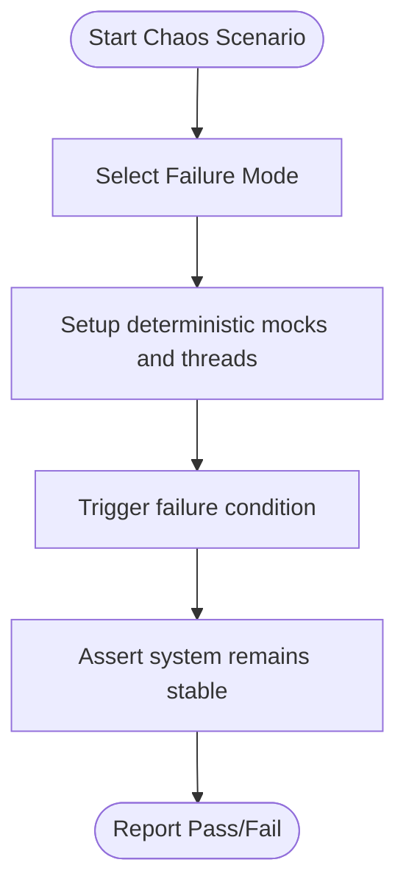

**Diagram sources**
- [tests/chaos/test_failure_modes.py:88-117](file://tests/chaos/test_failure_modes.py#L88-L117)
- [tests/chaos/test_failure_modes.py:122-157](file://tests/chaos/test_failure_modes.py#L122-L157)
- [tests/chaos/test_failure_modes.py:162-198](file://tests/chaos/test_failure_modes.py#L162-L198)
- [tests/chaos/test_failure_modes.py:203-219](file://tests/chaos/test_failure_modes.py#L203-L219)
- [tests/chaos/test_failure_modes.py:224-249](file://tests/chaos/test_failure_modes.py#L224-L249)
- [tests/chaos/test_failure_modes.py:254-293](file://tests/chaos/test_failure_modes.py#L254-L293)
- [tests/chaos/test_failure_modes.py:298-318](file://tests/chaos/test_failure_modes.py#L298-L318)
- [tests/chaos/test_failure_modes.py:323-355](file://tests/chaos/test_failure_modes.py#L323-L355)
- [tests/chaos/test_failure_modes.py:360-371](file://tests/chaos/test_failure_modes.py#L360-L371)
- [tests/chaos/test_failure_modes.py:376-390](file://tests/chaos/test_failure_modes.py#L376-L390)

**Section sources**
- [tests/chaos/test_failure_modes.py:1-390](file://tests/chaos/test_failure_modes.py#L1-L390)

### End-to-End Validation
End-to-end tests validate the complete trading stack:
- Strategy → Signal → Order → Fill → Position → PnL pipeline.
- Risk limits enforced (kill switch, position concentration, gross exposure).
- Deterministic behavior across runs with paper broker.
- Concurrent operations safely update state without races.
- State consistency verified across orders, positions, and trades.

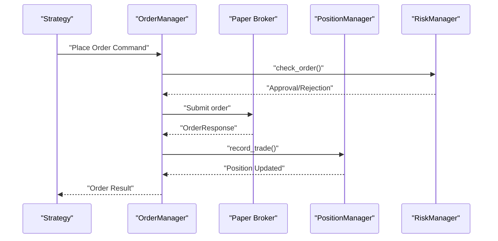

**Diagram sources**
- [tests/e2e/test_complete_trading_flow.py:115-203](file://tests/e2e/test_complete_trading_flow.py#L115-L203)
- [tests/e2e/test_complete_trading_flow.py:208-363](file://tests/e2e/test_complete_trading_flow.py#L208-L363)
- [tests/e2e/test_complete_trading_flow.py:436-506](file://tests/e2e/test_complete_trading_flow.py#L436-L506)

**Section sources**
- [tests/e2e/test_complete_trading_flow.py:1-675](file://tests/e2e/test_complete_trading_flow.py#L1-L675)

### Integration Tests
Integration tests validate gateway behavior and broker-specific flows:
- Gateway contract compliance across Dhan, Upstox, and Paper gateways.
- Upstox gateway integration including market data, order lifecycle, portfolio, and IntelligentGateway routing.
- Kill switch atomic flip and crash recovery validations.
- Thread safety under concurrent operations.
- **New** Cross-broker parity validation ensuring consistent schemas across all broker adapters.
- **New** Execution parity testing validating identical results across replay, paper, and backtest modes.
- **New** Runtime validation audit testing ensuring proper wiring of trading runtime components.
- **New** Trading runtime orchestrator testing validating event flow and counter increments.

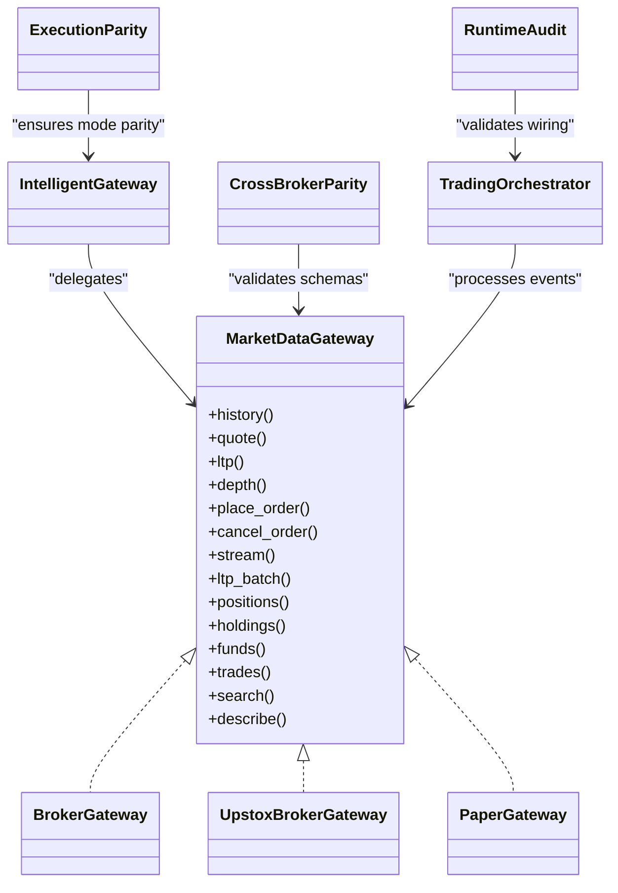

**Diagram sources**
- [tests/common/tests/test_gateway_contract_integration.py:47-84](file://brokers/common/tests/test_gateway_contract_integration.py#L47-L84)
- [tests/integration/test_upstox_gateway_integration.py:100-128](file://tests/integration/test_upstox_gateway_integration.py#L100-L128)
- [tests/integration/test_cross_broker_parity.py:24-120](file://tests/integration/test_cross_broker_parity.py#L24-L120)
- [tests/integration/test_execution_parity.py:52-83](file://tests/integration/test_execution_parity.py#L52-L83)
- [tests/integration/test_runtime_validation_audit.py:52-85](file://tests/integration/test_runtime_validation_audit.py#L52-L85)
- [tests/integration/test_trading_runtime_orchestrator.py:54-74](file://tests/integration/test_trading_runtime_orchestrator.py#L54-L74)

**Section sources**
- [tests/common/tests/test_gateway_contract_integration.py:1-617](file://brokers/common/tests/test_gateway_contract_integration.py#L1-L617)
- [tests/integration/test_upstox_gateway_integration.py:1-670](file://tests/integration/test_upstox_gateway_integration.py#L1-L670)
- [tests/integration/test_cross_broker_parity.py:1-120](file://tests/integration/test_cross_broker_parity.py#L1-L120)
- [tests/integration/test_execution_parity.py:1-83](file://tests/integration/test_execution_parity.py#L1-L83)
- [tests/integration/test_runtime_validation_audit.py:1-86](file://tests/integration/test_runtime_validation_audit.py#L1-L86)
- [tests/integration/test_trading_runtime_orchestrator.py:1-75](file://tests/integration/test_trading_runtime_orchestrator.py#L1-L75)

### Runtime Validation Audit Testing
**New** Runtime validation audit tests ensure proper wiring and operation of the trading runtime factory and orchestrator components:
- Validates TradingRuntimeFactory builds proper runtime with trading context, event bus, and orchestrator.
- Ensures orchestrator processes CANDIDATE_GENERATED events and increments counters.
- Verifies exposure of real OMS components (OrderManager, RiskManager, PositionManager).
- Tests event flow from trading context to orchestrator and back.
- Validates feature fetcher and strategy pipeline integration in orchestrator.

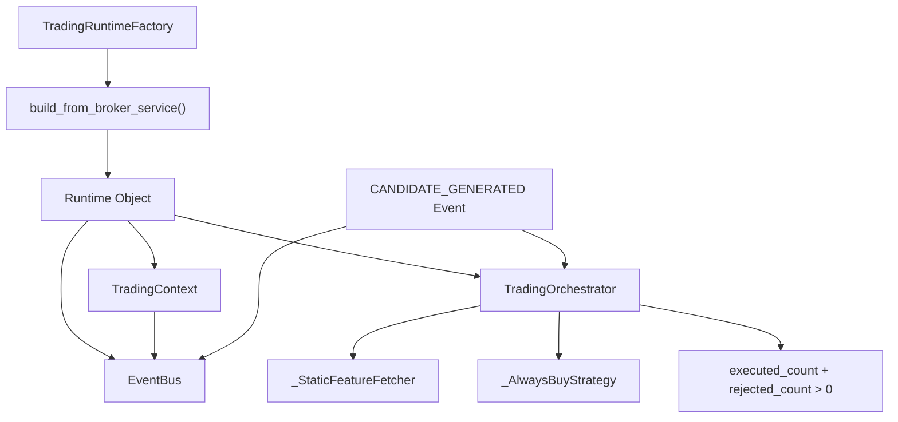

**Diagram sources**
- [tests/integration/test_runtime_validation_audit.py:52-85](file://tests/integration/test_runtime_validation_audit.py#L52-L85)
- [runtime/trading_runtime_factory.py:99-152](file://runtime/trading_runtime_factory.py#L99-L152)

**Section sources**
- [tests/integration/test_runtime_validation_audit.py:1-86](file://tests/integration/test_runtime_validation_audit.py#L1-L86)
- [runtime/trading_runtime_factory.py:1-239](file://runtime/trading_runtime_factory.py#L1-L239)

### Production Readiness Validation
**New** Production readiness validation ensures fail-closed safety gates and comprehensive system checks:
- Validates fail-closed behavior for RISK_FAIL_OPEN=1 (developer override).
- Ensures capital function does not use phantom 1,000,000 INR placeholder.
- Tests comprehensive system checks including reconciliation, event log, websockets, risk manager, credentials, and SSL hardening.
- Validates HTTP observability server and lifecycle management.
- Implements custom error factory for testing fail-closed behavior.

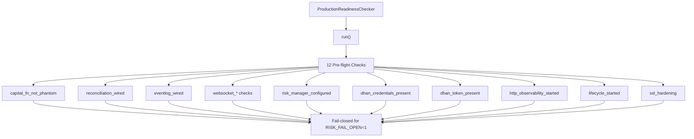

**Diagram sources**
- [brokers/common/services/production_readiness.py:88-138](file://brokers/common/services/production_readiness.py#L88-L138)
- [brokers/common/services/production_readiness.py:234-266](file://brokers/common/services/production_readiness.py#L234-L266)

**Section sources**
- [brokers/common/services/production_readiness.py:1-338](file://brokers/common/services/production_readiness.py#L1-L338)
- [brokers/common/services/tests/test_production_readiness_fail_closed.py:1-128](file://brokers/common/services/tests/test_production_readiness_fail_closed.py#L1-L128)

### Quantitative Parity and Determinism
Quantitative tests ensure reproducibility and correctness:
- Scanner determinism across multiple runs and tie-breaking stability.
- Replay determinism for trades and PnL.
- Resample correctness compared to pandas reference.
- Feature computation parity (RSI, SMA, ATR).
- Golden baseline comparisons for key outputs.
- **New** Cross-broker parity validation ensuring identical signals regardless of data source.
- **New** Execution parity testing validating identical results across different trading modes.

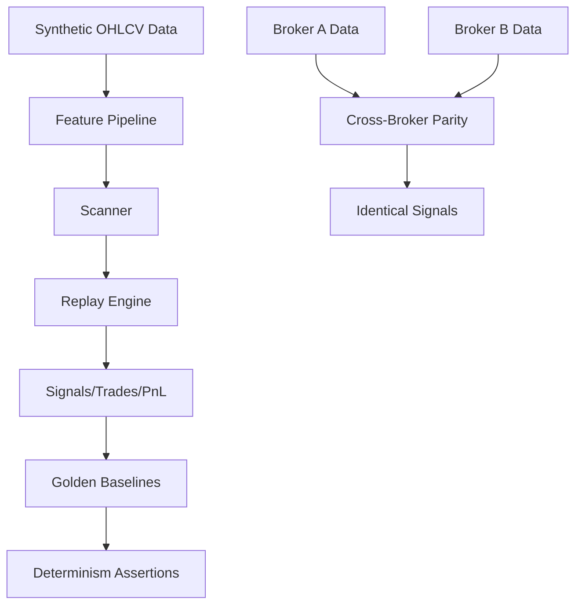

**Diagram sources**
- [tests/quant/test_quant_parity.py:130-196](file://tests/quant/test_quant_parity.py#L130-L196)
- [tests/quant/test_quant_parity.py:203-261](file://tests/quant/test_quant_parity.py#L203-L261)
- [tests/quant/test_quant_parity.py:267-355](file://tests/quant/test_quant_parity.py#L267-L355)
- [tests/quant/test_quant_parity.py:364-421](file://tests/quant/test_quant_parity.py#L364-L421)
- [tests/quant/test_cross_broker_parity.py:52-164](file://tests/quant/test_cross_broker_parity.py#L52-L164)
- [tests/integration/test_execution_parity.py:52-83](file://tests/integration/test_execution_parity.py#L52-L83)

**Section sources**
- [tests/quant/test_quant_parity.py:1-508](file://tests/quant/test_quant_parity.py#L1-L508)
- [tests/quant/test_cross_broker_parity.py:1-164](file://tests/quant/test_cross_broker_parity.py#L1-L164)
- [tests/integration/test_execution_parity.py:1-83](file://tests/integration/test_execution_parity.py#L1-L83)

### Property-Based Testing Framework
**New** Property-based testing using Hypothesis for comprehensive edge case discovery:
- Financial calculation invariants across a wide range of inputs.
- Order creation and fill operations maintain state invariants.
- Position PnL calculations are symmetric for long/short positions.
- Status mapping always returns valid order statuses.
- Trade value calculations remain positive and accurate.
- Scanner composite scores stay within expected bounds.

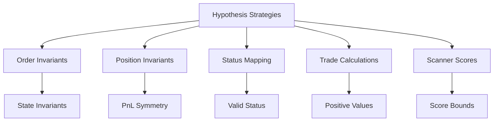

**Diagram sources**
- [tests/property/test_property_based.py:29-46](file://tests/property/test_property_based.py#L29-L46)
- [tests/property/test_property_based.py:53-83](file://tests/property/test_property_based.py#L53-L83)
- [tests/property/test_property_based.py:117-145](file://tests/property/test_property_based.py#L117-L145)
- [tests/property/test_property_based.py:176-195](file://tests/property/test_property_based.py#L176-L195)
- [tests/property/test_property_based.py:202-224](file://tests/property/test_property_based.py#L202-L224)
- [tests/property/test_property_based.py:231-266](file://tests/property/test_property_based.py#L231-L266)

**Section sources**
- [tests/property/test_property_based.py:1-266](file://tests/property/test_property_based.py#L1-L266)
- [tests/property/test_domain_properties.py:1-54](file://tests/property/test_domain_properties.py#L1-L54)

### Mutation Testing Infrastructure
**New** Nightly mutation testing for fault detection and code quality assessment:
- Automated mutation testing using mutmut for critical domain and OMS modules.
- Runs daily at 2 AM UTC with configurable timeout.
- Executes pytest suite for fault detection and displays results.
- Targets domain and OMS packages for maximum impact.

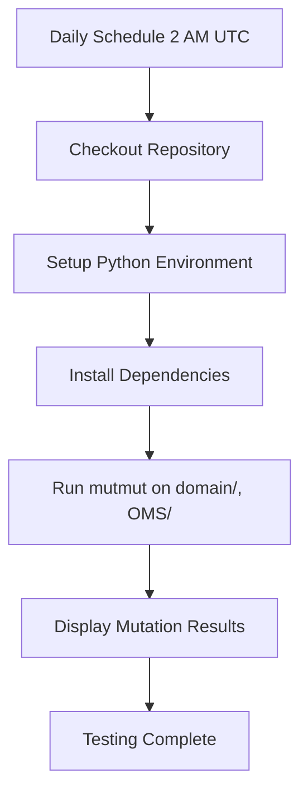

**Diagram sources**
- [.github/workflows/mutation_nightly.yml:3-6](file://.github/workflows/mutation_nightly.yml#L3-L6)
- [.github/workflows/mutation_nightly.yml:22-25](file://.github/workflows/mutation_nightly.yml#L22-L25)

**Section sources**
- [.github/workflows/mutation_nightly.yml:1-26](file://.github/workflows/mutation_nightly.yml#L1-L26)

### API Endpoint Tests
API tests validate backend endpoints and related behaviors:
- Health checks, authentication, caching headers, freshness, and vectorized candles.
- Market, order, portfolio, backtest, scanner, and options endpoints.
- OMS lifecycle and order validation.

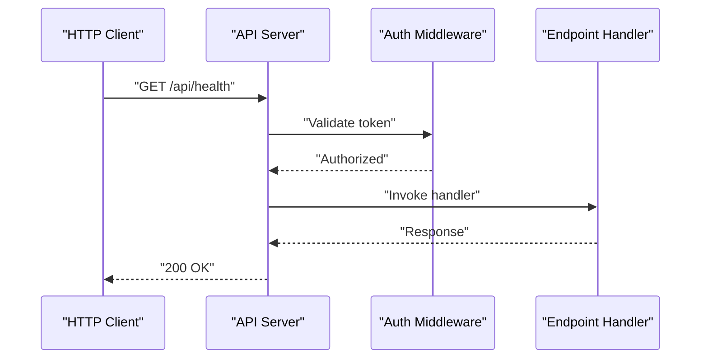

**Diagram sources**
- [tests/api/test_health.py:1-200](file://tests/api/test_health.py#L1-L200)
- [tests/api/test_auth.py:1-200](file://tests/api/test_auth.py#L1-L200)
- [tests/api/test_market_endpoints.py:1-200](file://tests/api/test_market_endpoints.py#L1-L200)
- [tests/api/test_order_endpoints.py:1-200](file://tests/api/test_order_endpoints.py#L1-L200)
- [tests/api/test_portfolio_endpoints.py:1-200](file://tests/api/test_portfolio_endpoints.py#L1-L200)
- [tests/api/test_backtest_endpoints.py:1-200](file://tests/api/test_backtest_endpoints.py#L1-L200)
- [tests/api/test_scanner_endpoints.py:1-200](file://tests/api/test_scanner_endpoints.py#L1-L200)
- [tests/api/test_replay_endpoints.py:1-200](file://tests/api/test_replay_endpoints.py#L1-L200)
- [tests/api/test_options_replay.py:1-200](file://tests/api/test_options_replay.py#L1-L200)
- [tests/api/test_freshness.py:1-200](file://tests/api/test_freshness.py#L1-L200)
- [tests/api/test_cache_headers.py:1-200](file://tests/api/test_cache_headers.py#L1-L200)
- [tests/api/test_service_container.py:1-200](file://tests/api/test_service_container.py#L1-L200)
- [tests/api/test_vectorized_candles.py:1-200](file://tests/api/test_vectorized_candles.py#L1-L200)
- [tests/api/test_oms_lifecycle.py:1-200](file://tests/api/test_oms_lifecycle.py#L1-L200)
- [tests/api/test_order_validation.py:1-200](file://tests/api/test_order_validation.py#L1-L200)
- [tests/api/test_options_bid_ask.py:1-200](file://tests/api/test_options_bid_ask.py#L1-L200)
- [tests/api/test_market_analytics.py:1-200](file://tests/api/test_market_analytics.py#L1-L200)
- [tests/api/test_analytics_endpoints.py:1-200](file://tests/api/test_analytics_endpoints.py#L1-L200)

**Section sources**
- [tests/api/test_performance.py:1-200](file://tests/api/test_performance.py#L1-L200)

### Performance Testing Framework
Performance tests and benchmarks:
- Benchmark critical paths (PnL calculation, domain models, event bus, order manager, risk manager, data lake I/O).
- Regression detection for performance degradation.
- Load testing via CLI load testing runner and dedicated commands.

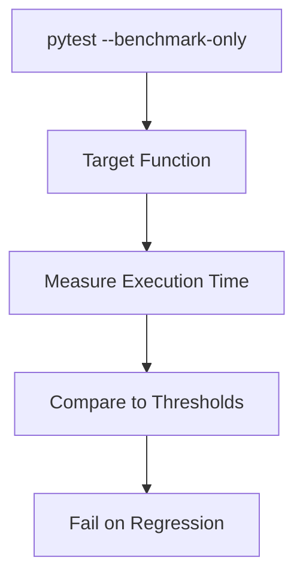

**Diagram sources**
- [tests/performance/test_benchmarks.py:48-80](file://tests/performance/test_benchmarks.py#L48-L80)
- [tests/performance/test_benchmarks.py:127-181](file://tests/performance/test_benchmarks.py#L127-L181)
- [tests/performance/test_benchmarks.py:188-224](file://tests/performance/test_benchmarks.py#L188-L224)
- [tests/performance/test_benchmarks.py:231-275](file://tests/performance/test_benchmarks.py#L231-L275)
- [tests/performance/test_benchmarks.py:282-342](file://tests/performance/test_benchmarks.py#L282-L342)
- [cli/load_testing/runner.py](file://cli/load_testing/runner.py)
- [cli/commands/load_test.py](file://cli/commands/load_test.py)

**Section sources**
- [tests/performance/test_benchmarks.py:1-342](file://tests/performance/test_benchmarks.py#L1-L342)
- [tests/performance/test_performance.py:1-200](file://tests/performance/test_performance.py#L1-L200)
- [tests/performance/test_data_performance.py:1-200](file://tests/performance/test_data_performance.py#L1-L200)

### Regression and Memory Leak Tests
Guardrails against resource leaks and regressions:
- EventBus memory bounds, DLQ bounded size, cache eviction policies.
- ReplayEngine window bounds and bounded memory growth.
- Reference cycle detection and garbage collection stability.
- DataFrame memory usage and view semantics.

**Section sources**
- [tests/regression/test_memory_leaks.py:1-561](file://tests/regression/test_memory_leaks.py#L1-L561)

### CLI Command Tests
CLI tests validate command-line workflows:
- Broker service concurrency and lifecycle.
- Command registry and endpoint smoke tests.
- Doctor commands and TUI rendering.
- Market, OMS, portfolio, and analytics commands.
- Risk controls and timing flags.

**Section sources**
- [cli/tests/test_broker_service_concurrency.py](file://cli/tests/test_broker_service_concurrency.py)
- [cli/tests/test_broker_service_lifecycle.py](file://cli/tests/test_broker_service_lifecycle.py)
- [cli/tests/test_command_registry.py](file://cli/tests/test_command_registry.py)
- [cli/tests/test_commands.py](file://cli/tests/test_commands.py)
- [cli/tests/test_doctor_commands.py](file://cli/tests/test_doctor_commands.py)
- [cli/tests/test_doctor_orchestrator.py](file://cli/tests/test_doctor_orchestrator.py)
- [cli/tests/test_doctor_renderer.py](file://cli/tests/test_doctor_renderer.py)
- [cli/tests/test_doctor_strategies.py](file://cli/tests/test_doctor_strategies.py)
- [cli/tests/test_http_observability_wireup.py](file://cli/tests/test_http_observability_wireup.py)
- [cli/tests/test_market_commands.py](file://cli/tests/test_market_commands.py)
- [cli/tests/test_oms_service.py](file://cli/tests/test_oms_service.py)
- [cli/tests/test_order_placement.py](file://cli/tests/test_order_placement.py)
- [cli/tests/test_portfolio_commands.py](file://cli/tests/test_portfolio_commands.py)
- [cli/tests/test_risk_controls.py](file://cli/tests/test_risk_controls.py)
- [cli/tests/test_timeout_retry_error.py](file://cli/tests/test_timeout_retry_error.py)
- [cli/tests/test_tui.py](file://cli/tests/test_tui.py)
- [cli/tests/test_validate_commands.py](file://cli/tests/test_validate_commands.py)
- [cli/tests/test_verbose_timing_flags.py](file://cli/tests/test_verbose_timing_flags.py)
- [cli/tests/test_views_journal_commands.py](file://cli/tests/test_views_journal_commands.py)
- [cli/tests/test_analytics_commands.py](file://cli/tests/test_analytics_commands.py)
- [cli/tests/test_broker_registry.py](file://cli/tests/test_broker_registry.py)
- [cli/tests/test_b7_oms_wireup.py](file://cli/tests/test_b7_oms_wireup.py)

### Data Lake Tests
Data lake tests validate ingestion, normalization, and query:
- Health checks, DuckDB end-to-end, batch gateway operations.
- Journal, normalization, option format, paths, quality, retry, scan store, schema, symbols, token updates, validation, atomic I/O, catalog, converter, and paths.

**Section sources**
- [datalake/tests/test_health_check.py](file://datalake/tests/test_health_check.py)
- [datalake/tests/test_duckdb_e2e.py](file://datalake/tests/test_duckdb_e2e.py)
- [datalake/tests/test_gateway_batch.py](file://datalake/tests/test_gateway_batch.py)
- [datalake/tests/test_integration.py](file://datalake/tests/test_integration.py)
- [datalake/tests/test_journal.py](file://datalake/tests/test_journal.py)
- [datalake/tests/test_normalize.py](file://datalake/tests/test_normalize.py)
- [datalake/tests/test_option_format.py](file://datalake/tests/test_option_format.py)
- [datalake/tests/test_options_analytics.py](file://datalake/tests/test_options_analytics.py)
- [datalake/tests/test_paths.py](file://datalake/tests/test_paths.py)
- [datalake/tests/test_quality.py](file://datalake/tests/test_quality.py)
- [datalake/tests/test_retry.py](file://datalake/tests/test_retry.py)
- [datalake/tests/test_scan_store.py](file://datalake/tests/test_scan_store.py)
- [datalake/tests/test_schema.py](file://datalake/tests/test_schema.py)
- [datalake/tests/test_symbols.py](file://datalake/tests/test_symbols.py)
- [datalake/tests/test_update_env_token.py](file://datalake/tests/test_update_env_token.py)
- [datalake/tests/test_validation.py](file://datalake/tests/test_validation.py)
- [datalake/tests/test_atomic_io.py](file://datalake/tests/test_atomic_io.py)
- [datalake/tests/test_catalog.py](file://datalake/tests/test_catalog.py)
- [datalake/tests/test_converter.py](file://datalake/tests/test_converter.py)

### Analytics Module Tests
Analytics tests validate core functionality:
- Backtest, core, features, indicators, market structure, options, orderflow, paper, pipeline, providers, ranking determinism, replay, reports, scanner, sector, stocks, strategy, visualizations, volatility, and volume profile.
- Views tests for determinism and view correctness.

**Section sources**
- [analytics/tests/test_backtest.py](file://analytics/tests/test_backtest.py)
- [analytics/tests/test_core.py](file://analytics/tests/test_core.py)
- [analytics/tests/test_features.py](file://analytics/tests/test_features.py)
- [analytics/tests/test_indicators.py](file://analytics/tests/test_indicators.py)
- [analytics/tests/test_market_structure.py](file://analytics/tests/test_market_structure.py)
- [analytics/tests/test_options.py](file://analytics/tests/test_options.py)
- [analytics/tests/test_orderflow.py](file://analytics/tests/test_orderflow.py)
- [analytics/tests/test_paper.py](file://analytics/tests/test_paper.py)
- [analytics/tests/test_pipeline.py](file://analytics/tests/test_pipeline.py)
- [analytics/tests/test_providers.py](file://analytics/tests/test_providers.py)
- [analytics/tests/test_ranking_determinism.py](file://analytics/tests/test_ranking_determinism.py)
- [analytics/tests/test_replay.py](file://analytics/tests/test_replay.py)
- [analytics/tests/test_reports.py](file://analytics/tests/test_reports.py)
- [analytics/tests/test_scanner.py](file://analytics/tests/test_scanner.py)
- [analytics/tests/test_sector.py](file://analytics/tests/test_sector.py)
- [analytics/tests/test_stocks.py](file://analytics/tests/test_stocks.py)
- [analytics/tests/test_strategy.py](file://analytics/tests/test_strategy.py)
- [analytics/tests/test_visualizations.py](file://analytics/tests/test_visualizations.py)
- [analytics/tests/test_volatility.py](file://analytics/tests/test_volatility.py)
- [analytics/tests/test_volume_profile.py](file://analytics/tests/test_volume_profile.py)
- [analytics/views/tests/test_view_determinism.py](file://analytics/views/tests/test_view_determinism.py)
- [analytics/views/tests/test_views.py](file://analytics/views/tests/test_views.py)
- [analytics/scanner/tests/test_determinism.py](file://analytics/scanner/tests/test_determinism.py)
- [analytics/scanner/tests/test_scanner_performance.py](file://analytics/scanner/tests/test_scanner_performance.py)
- [analytics/stocks/tests/test_find_levels.py](file://analytics/stocks/tests/test_find_levels.py)
- [analytics/indicators/tests/test_halftrend.py](file://analytics/indicators/tests/test_halftrend.py)
- [analytics/backtest/tests/test_comparator.py](file://analytics/backtest/tests/test_comparator.py)
- [analytics/backtest/tests/test_optimizer.py](file://analytics/backtest/tests/test_optimizer.py)
- [analytics/replay/tests/test_replay_memory.py](file://analytics/replay/tests/test_replay_memory.py)

## Dependency Analysis
The test suite depends on:
- PyTest configuration for markers, discovery, and coverage.
- Pre-commit hooks for Ruff, MyPy, and hygiene checks.
- Shared fixtures for market hours and credential validation.
- Test modules for each major component area.
- **New** Parity enforcement configuration and environment variable controls.
- **New** Hypothesis dependency for property-based testing.
- **New** mutmut dependency for nightly mutation testing.
- **New** Runtime validation audit tests for trading runtime factory components.
- **New** Production readiness validation for safety gate enforcement.

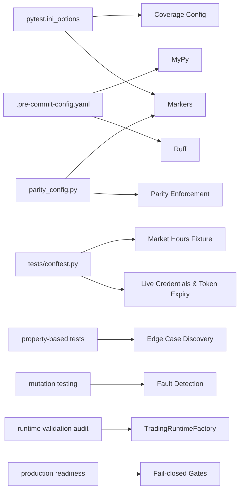

**Diagram sources**
- [pyproject.toml:47-71](file://pyproject.toml#L47-L71)
- [pyproject.toml:73-92](file://pyproject.toml#L73-L92)
- [.pre-commit-config.yaml:1-28](file://.pre-commit-config.yaml#L1-L28)
- [tests/conftest.py:66-134](file://tests/conftest.py#L66-L134)
- [tests/quant/parity_config.py:12-26](file://tests/quant/parity_config.py#L12-L26)
- [tests/property/test_property_based.py:1-5](file://tests/property/test_property_based.py#L1-L5)
- [.github/workflows/mutation_nightly.yml:22-25](file://.github/workflows/mutation_nightly.yml#L22-L25)
- [tests/integration/test_runtime_validation_audit.py:52-85](file://tests/integration/test_runtime_validation_audit.py#L52-L85)
- [brokers/common/services/production_readiness.py:88-138](file://brokers/common/services/production_readiness.py#L88-L138)

**Section sources**
- [pyproject.toml:47-71](file://pyproject.toml#L47-L71)
- [.pre-commit-config.yaml:1-28](file://.pre-commit-config.yaml#L1-L28)
- [tests/conftest.py:66-134](file://tests/conftest.py#L66-L134)
- [tests/quant/parity_config.py:1-69](file://tests/quant/parity_config.py#L1-L69)

## Performance Considerations
- Use pytest-benchmark markers to isolate and measure critical paths.
- Prefer deterministic synthetic data for performance tests to avoid flakiness.
- Monitor memory growth with tracemalloc and ensure bounded windows for replay and caches.
- Keep benchmarks focused on hot paths and avoid expensive I/O unless necessary.
- **New** Property-based tests can be computationally expensive; configure max_examples appropriately.
- **New** Mutation testing should be scheduled during off-peak hours to minimize CI impact.
- **New** Runtime validation audit tests should be optimized for deterministic event flow testing.
- **New** Production readiness validation should be designed to fail fast and provide clear error messages.

## Troubleshooting Guide
Common debugging techniques and reliability practices:
- Use shared fixtures to gate live tests and skip when credentials are invalid or tokens are expired.
- Validate token expiry via JWT decoding logic in fixtures.
- Employ deterministic fixtures for E2E tests to ensure reproducibility.
- Leverage chaos tests to surface race conditions and resource leaks.
- Use regression tests to detect memory growth and reference cycles.
- Apply pre-commit hooks to enforce code quality early.
- **New** Use parity test markers to selectively run cross-broker and execution parity tests.
- **New** Configure parity enforcement flags for development environments.
- **New** Run property-based tests with reduced example counts when debugging failures.
- **New** Use runtime validation audit tests to debug trading runtime factory wiring issues.
- **New** Leverage production readiness validation to identify safety gate violations and configuration problems.

**Section sources**
- [tests/conftest.py:21-64](file://tests/conftest.py#L21-L64)
- [tests/conftest.py:84-134](file://tests/conftest.py#L84-L134)
- [tests/regression/test_memory_leaks.py:1-561](file://tests/regression/test_memory_leaks.py#L1-L561)
- [tests/chaos/test_failure_modes.py:1-390](file://tests/chaos/test_failure_modes.py#L1-L390)
- [tests/quant/parity_config.py:12-26](file://tests/quant/parity_config.py#L12-L26)
- [tests/integration/test_runtime_validation_audit.py:1-86](file://tests/integration/test_runtime_validation_audit.py#L1-L86)
- [brokers/common/services/production_readiness.py:101-121](file://brokers/common/services/production_readiness.py#L101-L121)

## Conclusion
The testing and QA framework combines rigorous contract compliance, determinism, resilience, and performance validation across layers. The recent expansion includes comprehensive cross-broker parity validation, execution parity testing, runtime validation audit testing, production readiness validation, enhanced property-based testing, and nightly mutation testing. By leveraging shared fixtures, comprehensive chaos tests, targeted regression checks, runtime validation audits, production readiness gates, and advanced testing methodologies, the suite ensures reliability, correctness, and maintainability of the trading stack while continuously improving code quality and fault detection capabilities.

## Appendices

### Practical Examples

- Running the chaos suite:
  - Execute deterministic failure-mode tests to validate resilience.
  - Example invocation: pytest tests/chaos/test_failure_modes.py -v

- Running quantitative parity tests:
  - Validate determinism and golden baselines.
  - Example invocation: pytest tests/quant/test_quant_parity.py -v

- Running cross-broker parity tests:
  - **New** Validate consistent schemas across broker adapters.
  - Example invocation: pytest tests/integration/test_cross_broker_parity.py -v

- Running execution parity tests:
  - **New** Validate identical results across trading modes.
  - Example invocation: pytest tests/integration/test_execution_parity.py -v

- Running runtime validation audit tests:
  - **New** Validate trading runtime factory and orchestrator components.
  - Example invocation: pytest tests/integration/test_runtime_validation_audit.py -v

- Running production readiness tests:
  - **New** Validate fail-closed safety gates and system checks.
  - Example invocation: pytest brokers/common/services/tests/test_production_readiness_fail_closed.py -v

- Running property-based tests:
  - **New** Discover edge cases with randomized inputs.
  - Example invocation: pytest tests/property/test_property_based.py -v

- Running mutation testing:
  - **New** Nightly fault detection in critical modules.
  - Example invocation: GitHub Actions workflow runs automatically

- Running API tests:
  - Validate endpoints and health.
  - Example invocation: pytest tests/api/test_health.py tests/api/test_auth.py -v

- Running performance benchmarks:
  - Measure critical paths and detect regressions.
  - Example invocation: pytest tests/performance/test_benchmarks.py --benchmark-only

- Running end-to-end tests:
  - Validate complete trading lifecycle.
  - Example invocation: pytest tests/e2e/test_complete_trading_flow.py -v

- Running regression tests:
  - Detect memory leaks and reference cycles.
  - Example invocation: pytest tests/regression/test_memory_leaks.py -v

- Extending the test suite:
  - Add new unit tests under respective component directories.
  - Add integration tests for new broker adapters or features.
  - Add chaos tests for new failure modes.
  - Add quant tests for new deterministic computations.
  - Add API tests for new endpoints.
  - Add CLI tests for new commands.
  - Add data lake tests for new ingestion or query paths.
  - **New** Add runtime validation audit tests for new trading runtime components.
  - **New** Add production readiness tests for new safety gate requirements.
  - **New** Add property-based tests for edge case discovery.
  - **New** Add parity tests for cross-broker and execution validation.

- Interpreting test results:
  - Use pytest markers to filter and run subsets.
  - Review coverage reports to identify gaps.
  - Inspect benchmark reports for performance regressions.
  - Use pre-commit logs to address lint and type issues.
  - **New** Configure parity enforcement flags for development environments.
  - **New** Analyze mutation testing results for code quality improvements.
  - **New** Review runtime validation audit test failures for wiring issues.
  - **New** Examine production readiness validation reports for safety gate violations.

**Section sources**
- [tests/chaos/test_failure_modes.py:1-390](file://tests/chaos/test_failure_modes.py#L1-L390)
- [tests/quant/test_quant_parity.py:1-508](file://tests/quant/test_quant_parity.py#L1-L508)
- [tests/integration/test_cross_broker_parity.py:1-120](file://tests/integration/test_cross_broker_parity.py#L1-L120)
- [tests/integration/test_execution_parity.py:1-83](file://tests/integration/test_execution_parity.py#L1-L83)
- [tests/integration/test_runtime_validation_audit.py:1-86](file://tests/integration/test_runtime_validation_audit.py#L1-L86)
- [brokers/common/services/tests/test_production_readiness_fail_closed.py:1-128](file://brokers/common/services/tests/test_production_readiness_fail_closed.py#L1-L128)
- [tests/property/test_property_based.py:1-266](file://tests/property/test_property_based.py#L1-L266)
- [.github/workflows/mutation_nightly.yml:1-26](file://.github/workflows/mutation_nightly.yml#L1-L26)
- [tests/api/test_health.py:1-200](file://tests/api/test_health.py#L1-L200)
- [tests/api/test_auth.py:1-200](file://tests/api/test_auth.py#L1-L200)
- [tests/performance/test_benchmarks.py:1-342](file://tests/performance/test_benchmarks.py#L1-L342)
- [tests/e2e/test_complete_trading_flow.py:1-675](file://tests/e2e/test_complete_trading_flow.py#L1-L675)
- [tests/regression/test_memory_leaks.py:1-561](file://tests/regression/test_memory_leaks.py#L1-L561)
- [pyproject.toml:47-69](file://pyproject.toml#L47-L69)
- [pyproject.toml:73-92](file://pyproject.toml#L73-L92)
- [tests/quant/parity_config.py:12-26](file://tests/quant/parity_config.py#L12-L26)